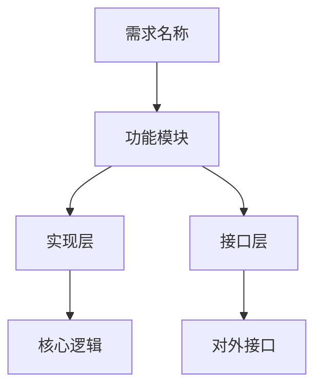
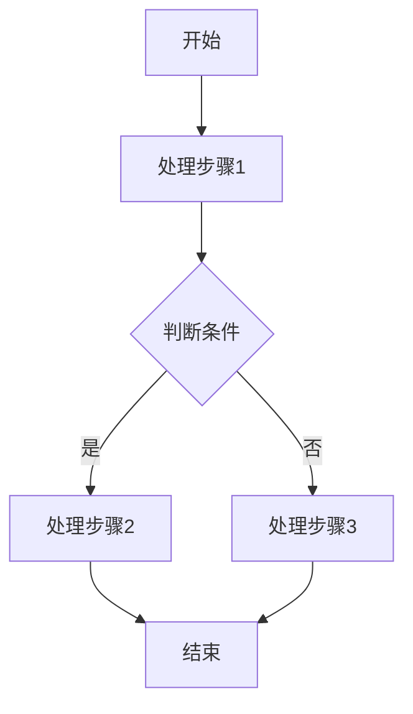
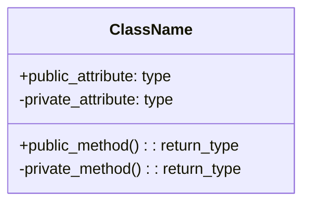

# SRS 文档格式规范

本文档定义了软件需求规格说明书（SRS）的标准格式和内容要求。

## 文档命名规范

### 文件命名

| 规则 | 说明 |
|------|------|
| 基础命名 | 使用需求列表第一个需求的标题 |
| 特殊字符处理 | 将空格、斜杠、反斜杠、冒号、星号、问号、双引号、小于号、大于号、竖线替换为下划线 |
| 长度限制 | 文件名最大 50 个字符，超出部分截断 |
| 默认命名 | 若标题为空，使用 `SRS_文档.docx` |
| 时间戳 | 可选添加时间戳避免覆盖，格式：`SRS_文档_20250324.docx` |

### 命名示例

```
输入：platform框架整改
输出：platform框架整改.docx

输入：迁移硬件参数获取接口/新增功能
输出：迁移硬件参数获取接口_新增功能.docx

输入：（空）
输出：SRS_文档.docx
```

## 文档结构规范

### 一级标题：文档标题

- 文档标题应简洁明了，反映文档主题
- 使用黑色黑体 14磅（可选，根据需要调整）

### 二级标题：独立需求

每个独立需求作为一个二级标题，格式：`{序号}. {需求标题}`

**字体格式**：
- 中文字体：黑体
- 英文字体：Times New Roman
- 字号：12磅
- 加粗
- 字体颜色：黑色

### 三级标题：需求子章节

每个需求下包含四个固定的三级标题：

#### 1. 功能需求 (`{序号}.1 功能需求`)

**内容要求**：
- 背景信息：说明需求的来源和背景
- 需求描述：详细描述需求的内容
- 字数要求：根据json文件提供的信息，结合网络搜索结果与项目说明文档对功能需求进行扩写，扩写至150字~200字左右。
- 架构关系图：基于该章节所提供的描述信息，使用 mermaid 语法绘制需求引入后新增的总体架构关系图，以png的形式将生成的关系图插入本章。

**架构关系图规范**：


#### 2. 模块划分 (`{序号}.2 模块划分`)

**内容要求**：
- 子需求列表：列出所有子需求
- 实现逻辑：每个子需求的实现逻辑描述
- 字数要求：根据json文件提供的信息，结合网络搜索结果与项目说明文档对功能需求进行扩写，每个子需求扩写至150字~200字左右。
- 流程图：基于扩写的子需求信息，使用 mermaid 语法绘制每个子需求的抽象流程图，以png的形式将生成的关系图插入本章。
- 类图：如需新建类，提供类的架构说明，使用 mermaid 语法绘制架构说明，以png的形式将生成的关系图插入本章。

**流程图规范**：


**类图规范**：


#### 3. 特性依赖 (`{序号}.3 特性依赖`)

**内容要求**：
- 根据项目代码与项目的说明文档推断依赖情况，对依赖进行说明
- 框架依赖：说明需求对现有框架的依赖
- 模块依赖：说明需求对其他模块的依赖
- 外部依赖：说明需求对外部组件的依赖

**格式**：
```
- 依赖：{模块/组件名称}
  - 依赖原因：{说明为什么依赖}
  - 使用方式：{说明如何使用}
```

#### 4. 软件接口 (`{序号}.4 软件接口`)

**表格格式规范**：

| 列名 | 必填 | 说明 |
|------|------|------|
| 函数原型 | 是 | 完整的 C++ 函数声明，包含返回值、函数名、参数列表 |
| 函数功能 | 是 | 函数的功能描述，简要说明函数的作用 |
| 增加输入 | 是 | 输入参数的详细说明，包括参数类型和含义 |
| 函数输出 | 是 | 输出参数的详细说明，包括参数类型和含义 |
| 返回 | 是 | 返回值的说明，包括返回值类型和含义 |
| 使用说明 | 是 | 函数的使用方法和示例 |
| 注意事项 | 否 | 特殊注意点，无则填 NA |

**表格样式**：
- 边框：全边框
- 对齐：左对齐
- 标题行：加粗
- 字体：宋体 10磅（中文），Times New Roman 10磅（英文）
- 函数原型中不应包含任何中文

**示例表格**：

| 函数原型 | `bool GetHardwareParam(const std::string& param_name, std::string& value)` |
| 函数功能 | 获取指定硬件参数的值 |
| 增加输入 | param_name: string类型的参数，代表属性名 |
| 函数输出 | value: string类型的参数，代表属性所对应的值 |
| 返回 | true: 成功获取属性值；false：获取属性值失败 |
| 使用说明 | 调用前确保已初始化 |
| 注意事项 | NA |

## 字体格式规范

### 标题字体

| 标题级别 | 中文字体 | 英文字体 | 字号 | 样式 |
|---------|---------|---------|------|------|
| 一级标题 | 黑体 | Times New Roman | 14磅 | 加粗 |
| 二级标题 | 黑体 | Times New Roman | 12磅 | 加粗 |
| 三级标题 | 黑体 | Times New Roman | 12磅 | 加粗 |
| 四级标题 | 黑体 | Times New Roman | 11磅 | 加粗 |

### 正文字体

| 内容类型 | 中文字体 | 英文字体 | 字号 | 样式 |
|---------|---------|---------|------|------|
| 正文段落 | 宋体 | Times New Roman | 10.5磅 | 常规 |
| 表格内容 | 宋体 | Times New Roman | 10磅 | 常规 |
| 代码块 | 宋体 | Consolas | 9磅 | 常规 |
| 列表项 | 宋体 | Times New Roman | 10.5磅 | 常规 |

### 防止字体乱码

1. 使用 UTF-8 编码
2. 通过 python-docx 的 `font.name` 设置主字体
3. 通过 `font._element.rPr.rFonts.set(qn('w:eastAsia'), font_name)` 设置中文字体
4. 确保系统已安装指定字体

## Mermaid 图表规范

### 图表类型

| 图表类型 | 语法 | 使用场景 |
|---------|------|---------|
| 流程图 | `flowchart TD` 或 `graph TD` | 描述处理流程 |
| 时序图 | `sequenceDiagram` | 描述交互过程 |
| 类图 | `classDiagram` | 描述类结构 |
| 状态图 | `stateDiagram-v2` | 描述状态转换 |
| 关系图 | `graph TD` | 描述模块关系 |

### 图表转换

1. 使用 mermaid-cli 将 mermaid 语法转换为 PNG 图片
2. 安装命令：`npm install -g @mermaid-js/mermaid-cli`
3. 转换命令：`mmdc -i input.mmd -o output.png -b white`
4. 图片宽度建议：5 英寸

### 转换失败处理

- 保留 mermaid 文本作为代码块
- 在代码块前标注"（Mermaid 图表）"
- 格式：` ```mermaid ... ``` `

## C++ 接口设计规范

### 函数命名规范

参考 Google C++ Style Guide：

| 规则 | 说明 | 示例 |
|------|------|------|
| 大驼峰命名 | 函数名使用大驼峰命名法 | `GetHardwareParam` |
| 动词开头 | 函数名以动词开头 | `InitializeContext` |
| 取值/设值 | Get/Set 开头 | `GetName()` / `SetName()` |
| 布尔返回 | Is/Can/Has 开头 | `IsValid()` / `HasPermission()` |

### 参数规范

| 参数类型 | 传递方式 | 说明 |
|---------|---------|------|
| 输入参数 | `const T&` | 常量引用，避免拷贝 |
| 输出参数 | `T*` | 指针，明确表示输出 |
| 输入输出参数 | `T&` | 引用，表示可修改 |
| 基本类型 | `T` | 直接传递（int, bool, char 等） |

### 返回值规范

| 功能类型 | 返回值 | 说明 |
|---------|-------|------|
| 获取操作 | 返回类型或 `const T&` | 返回目标值 |
| 设置/执行操作 | `bool` | true 表示成功 |
| 初始化操作 | `bool` 或 `ErrorCode` | 明确操作结果 |
| 创建操作 | 指针或智能指针 | 返回创建的对象 |
| 无返回需求 | `void` | 无返回值 |

## 错误处理规范

### JSON 输入验证

| 错误类型 | 错误信息 | 处理方式 |
|---------|---------|---------|
| 文件不存在 | `JSON 文件不存在：{path}` | 终止并提示 |
| 格式错误 | `JSON 格式错误：{detail}` | 终止并提示 |
| 缺少字段 | `缺少必需字段：{field}` | 终止并提示 |
| 列表为空 | `需求列表为空` | 终止并提示 |

### 项目扫描错误

| 错误类型 | 错误信息 | 处理方式 |
|---------|---------|---------|
| 路径不存在 | `项目路径不存在：{path}` | 终止并提示 |
| 权限不足 | `权限错误：{detail}` | 终止并提示 |

### 文档生成错误

| 错误类型 | 错误信息 | 处理方式 |
|---------|---------|---------|
| 输出目录不可写 | `无法写入输出目录：{path}` | 终止并提示 |
| mermaid 转换失败 | `Mermaid 渲染失败：{detail}` | 保留文本 |

## 附录

### 参考标准

- IEEE 830-1998: 软件需求规格说明推荐实践
- Google C++ Style Guide
- ISO/IEC/IEEE 29148:2018: 系统和软件工程——生命周期过程——需求工程
