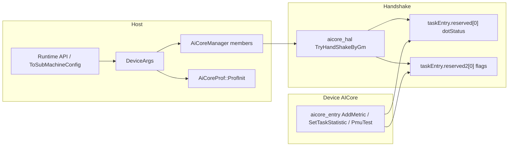

# PMU 采集动态开关与串行调度 API

## 背景与现状

- `[device_switch.h](framework/src/machine/utils/device_switch.h)` 中 `PMU_COLLECT==1` 时会定义：`PERF_PMU_TEST_SWITCH=1`、`SCHEDULE_USE_PENDING_AND_RUNING_SWITCH=0`（串行/仅 sync 解析路径）、`PROF_DFX_HOST_PREPARE_MEMORY_MODE=0`。
- 设备核 `[aicore_entry.h](framework/src/interface/machine/device/tilefwk/aicore_entry.h)` **重复定义**了 `PERF_PMU_TEST_SWITCH` / `PROF_DFX_HOST_PREPARE_MEMORY_MODE`，与 host 头文件解耦，导致必须两处改宏；`PmuTestBegin/End` 用 `#if PERF_PMU_TEST_SWITCH` 包一层，而内部已用 `args->taskEntry.reserved[0] == PRO_LEVEL2`（与 `[aicpu_common.h](framework/src/interface/machine/device/tilefwk/aicpu_common.h)` 中 `PRO_LEVEL2=3` / `AiCoreProfLevel::PROF_LEVEL_FUNC_LOG_PMU` 一致）判断。
- 调度差异：`[aicore_manager.h](framework/src/machine/device/dynamic/aicore_manager.h)` 中 `ResolveByRegVal` 在 `SCHEDULE_USE_PENDING_AND_RUNING_SWITCH==1` 时走 pending+running 大分支，`#else` 为 `[ResolveWhenSyncMode](framework/src/machine/device/dynamic/aicore_manager.h)`（与 PMU 宏为 1 时的串行语义一致）。
- Prof 初始化：`[aicore_prof.cpp](framework/src/machine/device/dynamic/aicore_prof.cpp)` 在打开 profiling 分支后，仅用 `**#if PMU_COLLECT`** 调用 `ProfInitPmu` 并将 `profLevel_` 升为 `PROF_LEVEL_FUNC_LOG_PMU`；**即使 `ProfConfig` 含 `AICORE_PMU`，当前逻辑仍会把 `profLevel_` 先写成 `PROF_LEVEL_FUNC_LOG`，没有宏则不会真正 Init PMU**。
- Host 侧 `[device_runner.cpp](framework/src/machine/runtime/device_runner.cpp)` `RunPrepare` 用 `PMU_COLLECT==1` 决定是否把 DFX Metric 指针拷到多块 shared buffer。

## 设计要点

### 1. 运行时标志载体（Host → AICPU）

- 在 `[ToSubMachineConfig](framework/src/interface/machine/device/tilefwk/aicpu_common.h)` 中增加 `uint32_t aicoreRuntimeFlags{0}`（或等价命名），用 bitmask，例如：
  - `AICORE_RT_SERIAL_SCHEDULE`：为 1 时 `ResolveByRegVal` 走与当前 `#else` 相同的 `ResolveWhenSyncMode` 路径。
  - `AICORE_RT_DISABLE_HOST_DFX_METRICS`：为 1 时与当前 `PROF_DFX_HOST_PREPARE_MEMORY_MODE==0` 一致（设备用 `taskStat` ping-pong + `SetTaskStatistic`）。
  - `AICORE_RT_ENABLE_PMU_HW`：为 1 时在 `ProfInit` 中调用 `ProfInitPmu` 并将 `profLevel_` 设为 `PROF_LEVEL_FUNC_LOG_PMU`（替代 `PMU_COLLECT`）。
- 保证 **默认全 0** 时行为与**当前默认宏**一致：异步 pending+running、Host 预分配 Metrics、`ProfInit` 不启 PMU 硬件（与 `PMU_COLLECT 0` 一致）。

### 2. 串行调度 + PMU 采集的对外 API（Host）

- 在 `[DeviceRunner](framework/src/machine/runtime/device_runner.h)` 上增加清晰入口（示例命名，实现时可微调）：`void SetAicorePmuCollectionRuntimeOptions(bool serialSchedule, bool disableHostDfxMetrics, bool enablePmuHw)`，或提供一键封装 `void EnableAicorePmuSerialCollectionMode()`：内部置位上述三个标志（与今日手动改三处宏等价）。
- **语义约定（须在头文件注释中写清）**：须在 **AICPU/AiCore 机器 `AiCoreManager::Init` 之前** 生效，即通常在 `InitDeviceArgs` / 首次 `DynamicLaunch` 前设置 `DeviceRunner` 持有的 `args_.toSubMachineConfig`（或与 launch 合并的 `DeviceKernelArgs` 中的同结构）。运行中改标志不予保证。
- **与 L2 的关系**：MSProf 的 L2 对应 `[aicore_prof.h](framework/src/machine/device/dynamic/aicore_prof.h)` 中 `PROF_TASK_TIME_L2` + `[ProfCheckLevel](framework/src/machine/device/dynamic/aicore_prof.cpp)`。**检测 L2 仍在调用方**（调用 `ProfCheckLevel(PROF_TASK_TIME_L2)`）；本方案只提供“设置运行时选项”的 API，避免在框架内强绑环境探测策略。

### 3. AiCoreManager：宏改为运行时分支

- 在 `[AiCoreManager](framework/src/machine/device/dynamic/aicore_manager.h)` 增加成员（如 `bool usePendingRunningSchedule_`、`bool useHostPrepareDfxMemory_`），在 `Init(..., DeviceArgs *deviceArgs)` 中根据 `deviceArgs->toSubMachineConfig.aicoreRuntimeFlags` 初始化。
- `ResolveByRegVal`：将 `#if SCHEDULE_USE_PENDING_AND_RUNING_SWITCH` 改为 `if (usePendingRunningSchedule_) { ... } else { ResolveWhenSyncMode(...); }`。
- `ProfStop` / `DfxProcAfterFinishTask`：将 `#if PROF_DFX_HOST_PREPARE_MEMORY_MODE` 改为 `if (useHostPrepareDfxMemory_) { ... }`。

### 4. 握手把 DFX 模式传到设备核

- `[TaskEntry](framework/src/interface/machine/device/tilefwk/aicpu_common.h)` 已有未使用的 `reserved2[2]`。在 `[aicore_hal.h](framework/src/machine/device/dynamic/aicore_hal.h)` `TryHandShakeByGm` 中除设置 `taskEntry.reserved[0] = dotStatus` 外，增加写入 `taskEntry.reserved2[0]`（例如仅低 32 位为 flag，与 host `useHostPrepareDfxMemory_` 一致），避免扩展 `reserved[1]`（当前仅 1 个 `uint32_t`）。
- 在 `[aicore_entry.h](framework/src/interface/machine/device/tilefwk/aicore_entry.h)`：
  - **删除**与 host 冲突的 `PERF_PMU_TEST_SWITCH` / `PROF_DFX_HOST_PREPARE_MEMORY_MODE` 宏定义；统一用 `reserved2[0]` 的 bit 判断 `AddMetricStatistic` 是否走 GM `Metrics` 路径，`ExecDynCoreFunctionKernel` 末尾是否调用 `SetTaskStatistic`。
  - `PmuTestBegin/End`：去掉外层 `#if PERF_PMU_TEST_SWITCH`，保留 `reserved[0]==PRO_LEVEL2` 判断（逻辑与“宏为 1”时一致，非 L2 时无额外 PMU 控制）。

### 5. AiCoreProf::ProfInit 与 DeviceRunner::RunPrepare

- `[aicore_prof.cpp](framework/src/machine/device/dynamic/aicore_prof.cpp)`：去掉 `#if PMU_COLLECT`；当进入现有“打开 profiling”分支且 `**aicoreRuntimeFlags` 含 `` 或 `ProfConfig` 含 `AICORE_PMU`（二选一或按产品约定合并）** 时调用 `ProfInitPmu` 并设置 `PROF_LEVEL_FUNC_LOG_PMU`。建议：**以 flag 为主、配置为辅**写清楚规则，避免与旧行为意外分叉（实现时在注释中固定优先级）。
- `[device_runner.cpp](framework/src/machine/runtime/device_runner.cpp)` `RunPrepare`：将 `PMU_COLLECT == 1` 改为检查 `args_.toSubMachineConfig.aicoreRuntimeFlags` 中对应“需要预先下发 DFX metric 指针”的 bit（或与 `ENABLE_PERF_TRACE` / debug 并列的显式条件）。

### 6. 清理 device_switch.h

- 移除或降级 `PMU_COLLECT` 及其衍生的三个宏定义；若仍有文档/脚本引用，可暂时保留 `PMU_COLLECT 0` 并注释“已废弃，请使用运行时 API”，避免 silent 行为变化。

### 7. 测试

- 更新 `[framework/tests/ut/machine/src/test_device_runner.cpp](framework/tests/ut/machine/src/test_device_runner.cpp)` / `[test_prof.cpp](framework/tests/ut/machine/src/test_prof.cpp)`：覆盖默认标志、置位串行+关 Host DFX+开 PMU HW 的组合与 `CreateProfLevel` / `ProfInit` 行为。
- 若有仅依赖宏编译分支的用例，改为构造带 `aicoreRuntimeFlags` 的 `DeviceArgs` 或 `ToSubMachineConfig`。

## 风险与约束

- **调用时序**：串行调度与 DFX 路径必须在核握手前确定；晚于 `Init` 修改 flags 可能导致 host/device 不一致。
- **二进制体积**：设备侧由 `#if` 改为始终编译双分支 + 运行时判断，代码略增；若需可后续对非 prof 构建保留单独 target 优化（非本需求范围）。
- `**ProfConfig::AICORE_PMU` 与 `` flag**：需在一次实现中明确组合关系，避免“配置了 PMU 但未设 flag”与旧宏行为不一致。

