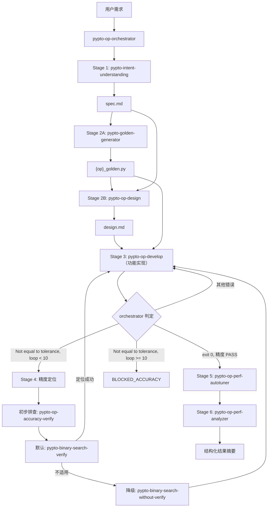

# Pipeline Overview

## 流程图



## Stage 总览

| Stage | 名称 | 执行者 | 关键输入 | 关键输出 | 成功标准 |
|-------|------|--------|----------|----------|----------|
| 0 | 上下文解析 | orchestrator | 用户请求 / 现有目录 | 唯一工作目录 | `custom/{op}/` 目录确定 |
| 1 | 需求理解 | `pypto-intent-understanding` | 用户需求 | `spec.md` | 文件存在 |
| 2A | 生成 Golden | `pypto-golden-generator` | `spec.md` | `{op}_golden.py` | 文件存在 |
| 2B | 生成 Design | `pypto-op-design` | `spec.md` + `{op}_golden.py` | `design.md` | 文件存在 |
| 3 | 功能实现 | `pypto-op-develop` | `spec.md` + `design.md` + `{op}_golden.py` | `test_{op}.py` + `{op}_impl.py` + `README.md` | 见 Stage 3 判定 |
| 4 | 精度定位 | 见精度定位策略 | 实现 + 中间结果 | 修复建议 | 产出定位报告 |
| 5 | 性能采集与调优 | `pypto-op-perf-autotuner` | 精度通过实现 | 新 output / 调优建议 | 新 `output/output_*` 存在 |
| 6 | 性能分析 | `pypto-op-perf-analyzer` | 性能工件 | 性能摘要 | 报告产出 |

## Stage 2 串行

```
Stage 2A (golden-generator) → Stage 2B (op-design)
```

design 生成时参考 golden 代码结构和函数签名，避免两者不一致。
