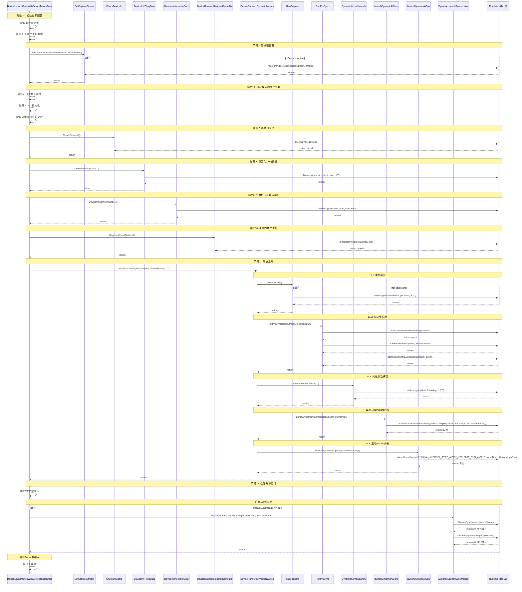
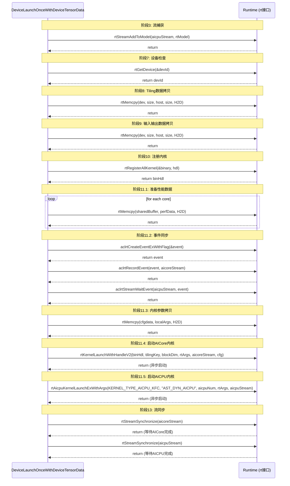
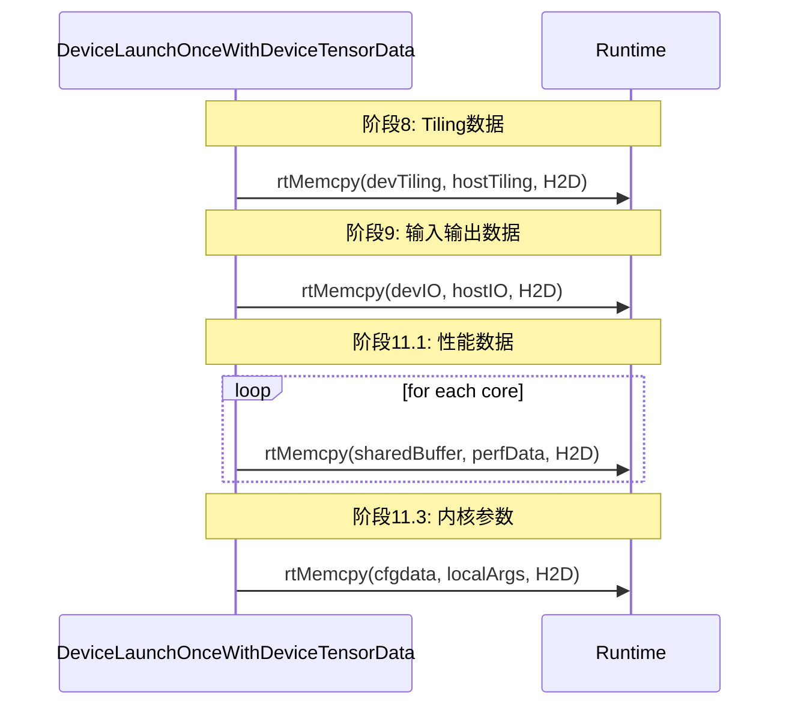
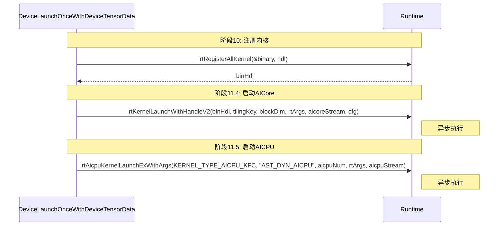
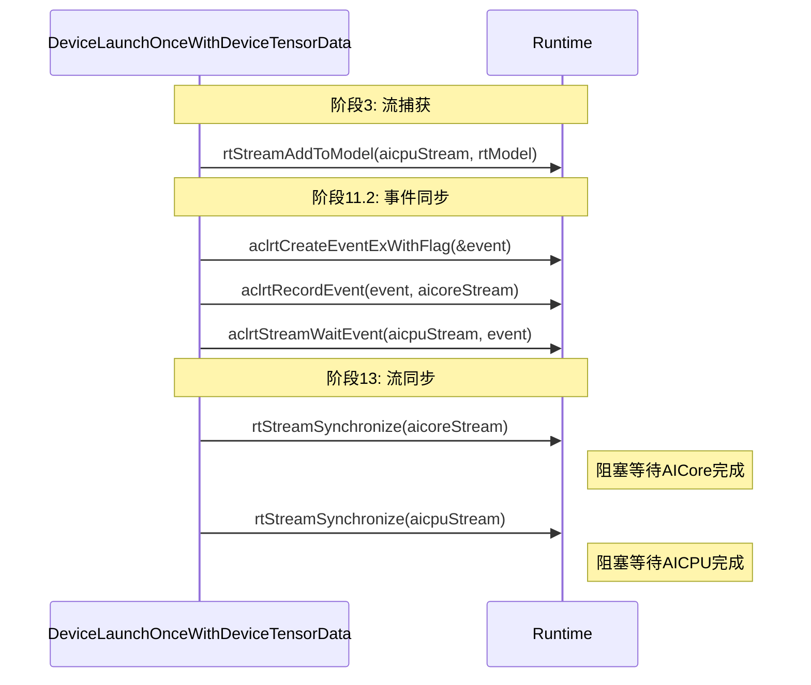
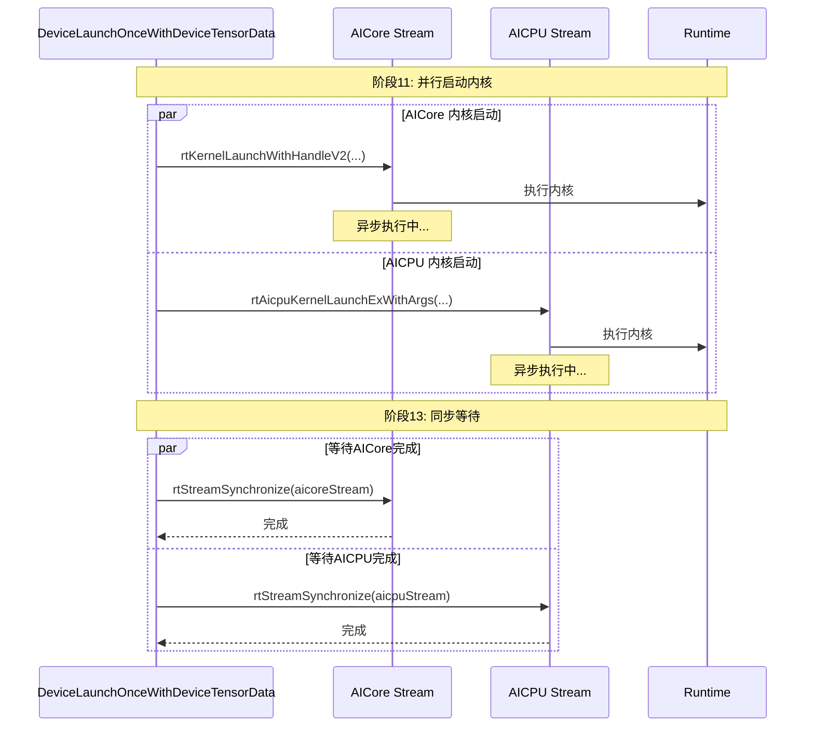

# DeviceLaunchOnceWithDeviceTensorData rt 接口调用时序图

本文档使用时序图展示 `DeviceLaunchOnceWithDeviceTensorData` 函数中所有 rt 接口的调用顺序和关系。

## 完整时序图

## 简化版时序图（仅 rt 接口）

## 按接口类型分类的时序图

### 内存管理接口 (rtMemcpy)

### 内核启动接口

### 流同步接口

## 并行执行时序图

## 关键时间点说明

1. **阶段3**: 流捕获设置（可选，仅在捕获模式激活时）
2. **阶段7**: 设备ID检查（确保设备可用）
3. **阶段8-9**: 数据准备（将主机数据拷贝到设备）
4. **阶段10**: 内核注册（注册内核二进制，获取句柄）
5. **阶段11**: 内核启动（并行启动 AICore 和 AICPU）
   - 11.1: 准备性能数据
   - 11.2: 事件同步（确保流顺序）
   - 11.3: 拷贝内核参数
   - 11.4: 启动 AICore 内核（异步）
   - 11.5: 启动 AICPU 内核（异步）
6. **阶段13**: 流同步（等待所有任务完成）

## 注意事项

1. **异步执行**: `rtKernelLaunchWithHandleV2` 和 `rtAicpuKernelLaunchExWithArgs` 是异步调用，立即返回
2. **阻塞同步**: `rtStreamSynchronize` 是阻塞调用，会等待流中所有任务完成
3. **内存拷贝**: 所有 `rtMemcpy` 调用都是同步的，拷贝完成后才返回
4. **事件同步**: `aclrtStreamWaitEvent` 用于在流之间建立依赖关系
5. **并行执行**: AICore 和 AICPU 内核可以并行执行，最后通过流同步等待两者都完成

## 性能优化建议

1. **减少内存拷贝**: 尽量复用设备内存，减少 H2D 拷贝次数
2. **异步执行**: 利用异步特性，在数据拷贝的同时准备其他资源
3. **流管理**: 合理使用多个流实现并行执行
4. **事件同步**: 使用事件而非流同步可以减少不必要的等待
