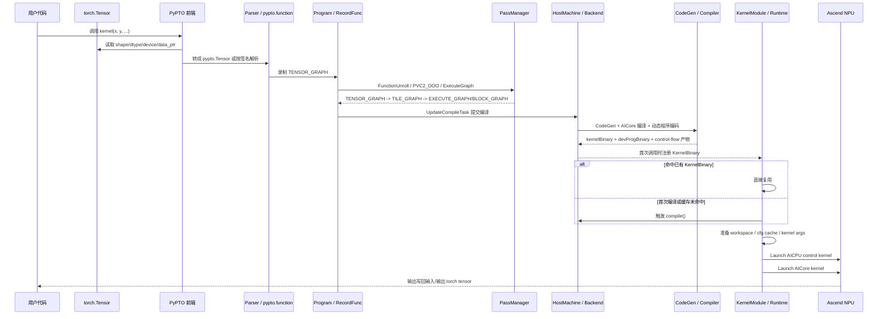
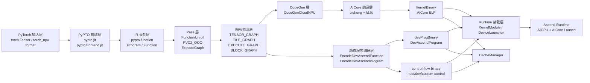

# 从 PyTorch 输入到 NPU 可运行 Binary 的生成链路报告

## 1. 报告结论

这条链路的本质不是“把任意 PyTorch ATen 算子直接 lowering 成 NPU binary”，而是：

1. PyTorch `torch.Tensor` 作为输入数据载体进入 PyPTO。
2. PyPTO 前端把输入张量转成 `pypto.Tensor` 语义，记录并构建自己的计算图。
3. 真正被编译的是 PyPTO 的 `Function/Graph`，而不是 PyTorch 原生图。
4. 后端经过 Pass、CodeGen、AICore 编译和动态程序编码，生成 NPU 运行需要的二进制产物。
5. 运行时加载这些产物，并通过 AICPU 控制核 + AICore 计算核把任务发到昇腾 NPU。

最终至少会得到两类核心产物：

- `kernelBinary`
  - AICore ELF binary。
  - 由运行时注册成 kernel handle 后发射到 AICore。
- `devProgBinary`
  - `DevAscendProgram` 的序列化结果。
  - 保存运行期所需的参数布局、workspace、控制流数据、调度元信息等。

动态控制流场景下还可能伴随：

- `hostControlFlowBinary`
- `devControlFlowBinary`
- custom control `.so/.json`

## 2. 分析范围

本报告覆盖以下链路：

- 旧前端：`pypto.jit + pypto.from_torch`
- 新前端：`pypto.frontend.jit`
- 图录制与 Program 提交
- Pass 链路
- CodeGen 与 AICore binary 生成
- `devProgBinary/kernelBinary` 的生成与运行时加载
- binary cache 持久化/恢复

不覆盖：

- 任意 PyTorch FX / TorchDynamo / Inductor 图的自动接入
- 单个 tile op 的数学细节
- NPU 硬件执行微架构

## 3. 总体时序图

## 4. 模块图

## 5. 端到端链路说明

### 5.1 前端入口

新前端 `pypto.frontend.jit` 明确支持“直接传入 torch 张量”，无需手动 `from_torch`，见 `docs/api/pypto-frontend-jit.md`。

旧前端路径中，`pypto.from_torch()` 负责把 `torch.Tensor` 转换为 PyPTO tensor，保留：

- shape
- dtype
- format
- `data_ptr`
- device

并根据 NPU format 推断 `ND/NZ`，见：

- `python/pypto/converter.py`

### 5.2 图录制

旧前端 `pypto.jit`：

1. `__call__` 在 NPU 模式下进入 `pypto_impl.LaunchKernel`
2. 首次 launch 时，如果没有已编译 kernel，会回调 Python `compile()`
3. `compile()` 用 `with pypto.function(...):` 录制用户函数体

新前端 `pypto.frontend.jit`：

1. 首次调用时先按函数签名解析输入
2. 如果是 torch tensor，则根据 tensor definition 转成 PTO tensor
3. parser 执行时最终仍会落到 `with pypto.function(...):`，把函数体变成 PyPTO IR

因此，两条前端的后端 IR 构建收敛到同一套 `Program / Function` 体系。

### 5.3 Program 提交编译

动态函数结束录制后，`RecordFunc::EndFunction()` 会：

1. 清理隐藏函数和冗余 outcast
2. 执行 `FunctionUnroll`
3. 调 `Program::UpdateCompileTask()`

`Program::UpdateCompileTask()` 会把函数 stash 到 `HostMachine`，再由 `HostMachine` 顺序提交编译任务。

### 5.4 Pass 链路与图形态演进

默认主策略是 `PVC2_OOO`，它覆盖了从 tensor graph 到执行图之前的大部分优化与图变换。

关键边界如下：

1. `ExpandFunction`
   - 把函数从 `TENSOR_GRAPH` 推进到 `TILE_GRAPH`
2. `SubgraphToFunction`
   - 把 tile graph 切成多个 `BLOCK_GRAPH` leaf function
   - 同时构造一个 `EXECUTE_GRAPH` root function
3. `ExecuteGraph`
   - 跑 `DynAttrToStatic`
   - 把动态执行图需要的调用关系、leaf 到 caller 映射等静态化到更接近 runtime 的结构

可以把图形态理解为：

`TENSOR_GRAPH -> TILE_GRAPH -> EXECUTE_GRAPH + BLOCK_GRAPH(leaf)`

其中：

- `EXECUTE_GRAPH` 是调度/调用视角的根图
- `BLOCK_GRAPH` 是 leaf subgraph，对应实际会被 codegen 的计算块

### 5.5 CodeGen 阶段

`Backend::GenCode()` 对动态函数会走 `CompileDyndevFunction()`。

这里做了三类关键工作：

1. 生成控制流相关产物
   - expression 头文件
   - host/device control-flow binary
   - 可选 custom control `.so/.json`

2. 对每个 leaf 做 codegen
   - `CodeGenCloudNPU::GenCode()` 遍历 `topFunc.rootFunc_->programs_`
   - 为每个 leaf 生成 CCE 源码
   - 编译后把 `kernelName/binPath/declare` 写回 `LeafFuncAttribute`

3. 汇总生成动态程序编码
   - `EncodeDevAscendFunction`
   - `EncodeDevAscendProgram`

### 5.6 AICore binary 是如何生成的

`CompileAICoreKernel()` 是最终 AICore binary 的生成核心。

它的过程是：

1. 先生成统一入口模板 `aicore.cpp`
2. 分别为 AIC 和 AIV 生成 `CallSubFuncTask` 的 switch 分发头文件
3. 用 `bisheng` 编译出中间对象
4. 用 `ld.lld` 先分别链接出 AIC/AIV 对象
5. 最后把两者再链接成混合的最终 kernel object

典型产物路径形态：

- `dy_kernel_<funcHash>_aic_<tilingKey>.o`
- `dy_kernel_<funcHash>_aiv_<tilingKey>.o`
- `dy_kernel_<funcHash>_<tilingKey>.o`

最终这个 `dy_kernel_*.o` 会被读入到 `attr->kernelBinary`。

### 5.7 devProgBinary 是如何生成的

`SetDyndevProgBinary()` 通过 `EncodeDevAscendProgram()` 把当前动态函数编码成 `DevAscendProgram` 二进制结构，并存到 `attr->devProgBinary`。

这部分不是 AICore 指令 ELF，而是运行时程序描述：

- device runtime offset
- workspace / mem budget
- 动态程序入口信息
- 调度与控制流相关元数据

它是运行期准备 `AICPU/AICore` 参数、workspace 和 cfg cache 的关键输入。

### 5.8 运行时加载与发射

Python 绑定层的关键点是：

1. `KernelModule` 在首次调用时触发编译
2. 编译完成后构造 `KernelBinary`
3. `KernelBinary` 从 `dynAttr` 中读取：
   - `devProgBinary`
   - `kernelBinary`
4. `kernelBinary` 通过 `DeviceLauncher::RegisterKernelBin()` 注册成 runtime handle
5. 运行时构建 kernel args、workspace、control flow cache
6. 先 launch AICPU kernel，再 launch AICore kernel

其中，AICPU 负责控制与调度，AICore 负责真正计算。

### 5.9 binary cache

如果 binary cache 开启，`CacheManager` 会把以下产物落盘：

- `devProgBinary`
- `kernelBinary`
- control side `.so/.json`

后续如果 cache key 命中，就会直接恢复：

- `attr->devProgBinary`
- `attr->kernelBinary`

从而跳过完整重新编译。

## 6. compile_stage 对链路的影响

`compile_stage` 不是另一条链路，而是“在主链路上停在哪一站”。

阶段含义：

- `TENSOR_GRAPH`
- `TILE_GRAPH`
- `EXECUTE_GRAPH`
- `CODEGEN_INSTRUCTION`
- `CODEGEN_BINARY`

行为差异：

1. 如果阶段在 `TENSOR_GRAPH ~ EXECUTE_GRAPH`
   - backend 在执行图生成后直接返回
   - 不进入最终 binary 生成

2. 如果阶段是 `CODEGEN_INSTRUCTION`
   - 会生成 codegen 代码
   - 但会跳过最终 CCE/AICore binary 编译

3. 如果阶段是 `CODEGEN_BINARY`
   - 会把 binary 编译出来
   - 但运行侧不会真正执行 device run

4. 只有 `ALL_COMPLETE`
   - 才会“编译 + 运行”完整走通

## 7. 为什么说这不是“PyTorch 算子直接编译成 binary”

原因有三点：

1. 入口虽然可以直接传 `torch.Tensor`，但真正编译的 IR 是 PyPTO 自己的 `Function`
2. 新前端 parser 最终仍通过 `pypto.function` 建图，而不是直接消费 PyTorch 计算图
3. 运行时绑定从 `DyndevFunctionAttribute` 读取的是 PyPTO 后端生成的 `devProgBinary/kernelBinary`

所以更准确的表述应该是：

> PyTorch 张量通过 PyPTO 前端进入编译链路，最终由 PyPTO 后端生成 NPU 可执行 binary。

## 8. 关键源码锚点

### 8.1 前端与输入转换

- `docs/api/pypto-frontend-jit.md`
- `python/pypto/converter.py`
- `python/pypto/runtime.py`
- `python/pypto/frontend/parser/entry.py`
- `python/pypto/frontend/parser/parser.py`

### 8.2 Program / 编译提交

- `framework/src/interface/program/recorder.cpp`
- `framework/src/interface/program/program.cpp`
- `framework/src/interface/machine/host/host_machine.cpp`

### 8.3 Pass 与图演进

- `framework/src/passes/pass_mgr/pass_manager.cpp`
- `framework/src/passes/tensor_graph_pass/expand_function.cpp`
- `framework/src/passes/tile_graph_pass/subgraph_to_function.cpp`
- `framework/src/passes/block_graph_pass/dyn_attr_to_static.cpp`

### 8.4 CodeGen 与 binary 生成

- `framework/src/machine/host/backend.cpp`
- `framework/src/codegen/cloudnpu/codegen_cloudnpu.cpp`
- `framework/src/machine/compile/aicore_compiler.cpp`
- `framework/src/machine/compile/gen_aicore_code.cpp`
- `framework/src/machine/compile/compile_control_bin.cpp`

### 8.5 Runtime 装载与执行

- `python/src/bindings/runtime.cpp`
- `framework/src/machine/runtime/device_launcher.cpp`
- `framework/src/machine/cache_manager/cache_manager.cpp`

## 9. 关键源码证据摘录

### 9.1 PyTorch tensor 进入 PyPTO

- `python/pypto/converter.py`
  - `from_torch()` 读取 `data_ptr/shape/dtype/device/format`

### 9.2 旧前端首次 launch 时触发编译

- `python/pypto/runtime.py`
  - `_JIT.__call__()` -> `pypto_impl.LaunchKernel`
  - `compile()` 中通过 `with pypto.function(...)` 建图

### 9.3 新前端最终也落到 `pypto.function`

- `python/pypto/frontend/parser/parser.py`
  - `_visit_function_def()` 中使用 `with pypto.function(...)`

### 9.4 动态函数结束后提交编译

- `framework/src/interface/program/recorder.cpp`
  - `RecordFunc::EndFunction()` -> `Program::UpdateCompileTask()`

### 9.5 HostMachine 把函数交给 pass/backend

- `framework/src/interface/machine/host/host_machine.cpp`
  - compile thread 跑 `Compile()`
  - agent thread 跑 `backend.execute`

### 9.6 图从 TENSOR_GRAPH 变成 TILE_GRAPH

- `framework/src/passes/tensor_graph_pass/expand_function.cpp`

### 9.7 tile graph 拆成 leaf block 与 execute root

- `framework/src/passes/tile_graph_pass/subgraph_to_function.cpp`

### 9.8 `CompileDyndevFunction()` 生成核心产物

- `framework/src/machine/host/backend.cpp`
  - `attr->kernelBinary = LoadFile(kernelPath)`
  - `SetDyndevProgBinary(function)`

### 9.9 runtime 侧注册 kernel 并发射

- `python/src/bindings/runtime.cpp`
  - `KernelBinary` 从 `dynAttr` 取 `devProgBinary/kernelBinary`
  - `DoLaunch()` 中 cache miss 时触发 compile
- `framework/src/machine/runtime/device_launcher.cpp`
  - `RegisterKernelBin()`
  - `LaunchAicpuKernel()`
  - `LaunchAicoreKernel()`

## 10. 最终归纳

从“PyTorch 输入”到“NPU 上能跑的 binary”，可以压缩成一句话：

> `torch.Tensor` 通过 PyPTO 前端进入后，被记录成 PyPTO 的动态图/张量图，随后经过 Pass 把图变成 tile/execute/leaf 结构，再由 codegen 生成 CCE 与 leaf kernel，通过 `bisheng + ld.lld` 生成 `kernelBinary`，同时通过 `EncodeDevAscendProgram` 生成 `devProgBinary`，最后在 runtime 中注册 kernel 并发射到 Ascend NPU。`

如果从“产物视角”理解，这条链路的最终结果不是单个 binary 文件，而是：

- `kernelBinary`
- `devProgBinary`
- 可选控制流 binary / `.so/.json`

三者共同组成了可运行的 NPU 执行单元。
