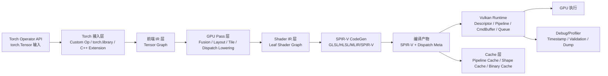
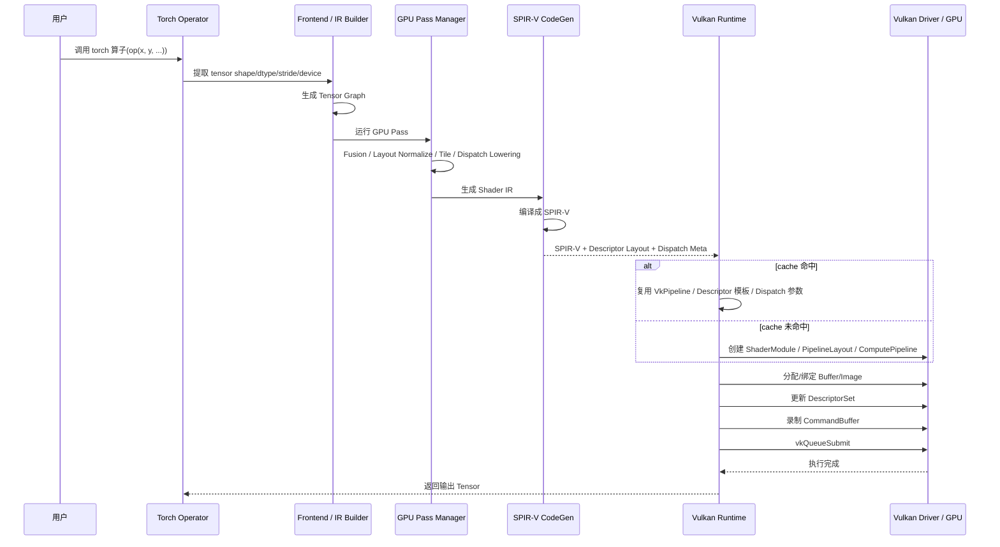

# 基于 NPU 流程的 GPU Vulkan Torch 算子执行流程计划

## 1. 目标

基于当前 NPU 链路：

- `Torch Tensor -> 前端建图 -> Pass -> CodeGen -> Binary -> Runtime Launch`

设计一条在 GPU 上运行 Torch 算子的对应流程，GPU 后端采用 Vulkan Compute API。

本计划的目标不是直接复用 NPU 的所有实现细节，而是复用其分层思想：

1. 前端统一描述
2. 后端无关 IR
3. 分阶段 Pass
4. 独立 CodeGen
5. 独立 Runtime
6. 编译产物缓存

## 2. 总体结论

如果按 NPU 当前链路类比，Vulkan GPU 方案应被拆成 6 层：

1. Torch 接入层
2. Backend-neutral IR 层
3. GPU Pass 层
4. SPIR-V CodeGen 层
5. Vulkan Runtime 层
6. Cache / Debug / Profiling 层

与 NPU 最大不同点不在算子表达，而在：

- PyTorch Tensor 与 Vulkan Buffer/Image 的内存互通
- 调度模型从 `AICPU + AICore` 变成 `CommandBuffer + Compute Pipeline`
- Binary 产物从 `kernelBinary + devProgBinary` 变成 `SPIR-V + VkPipeline 元数据`

## 3. NPU 到 Vulkan 的映射关系

| NPU 链路阶段 | Vulkan GPU 对应阶段 | 说明 |
|---|---|---|
| `pypto.from_torch / frontend.jit` | Torch 接入 + Vulkan Tensor 包装 | 输入仍来自 Torch，但要转换为 Vulkan 可访问资源 |
| `TENSOR_GRAPH` | GPU Tensor Graph | 保留高层算子语义，不直接绑定 Vulkan |
| `TILE_GRAPH` | Workgroup / Tile Graph | 将高层算子切成 workgroup-friendly 子任务 |
| `EXECUTE_GRAPH + BLOCK_GRAPH` | Dispatch Graph + Shader Function Graph | 生成 dispatch 节点和 shader 级 leaf 计算块 |
| `CodeGenCloudNPU` | Vulkan Shader CodeGen | 输出 GLSL/HLSL/MLIR/SPIR-V IR，再编译成 SPIR-V |
| `kernelBinary` | `SPIR-V module / VkPipeline` | Vulkan 最终执行所需 shader/pipeline |
| `devProgBinary` | Dispatch Meta / Descriptor Layout / PushConst Layout | 保存 dispatch 结构、资源绑定与运行时元数据 |
| `DeviceLauncher` | Vulkan Runtime Launcher | 构造 descriptor set、command buffer、queue submit |
| `ctrl flow cache` | Shape-specialized Dispatch Cache | 对不同 shape/stride/layout 缓存 pipeline 和 dispatch 参数 |

## 4. 总体模块图



## 5. 总体时序图



## 6. 设计原则

### 6.1 复用 NPU 的分层思想，不复用 NPU 的硬件假设

必须保留：

- 前后端分离
- IR 与 Runtime 解耦
- Pass 分阶段
- 编译产物可缓存

不能直接照搬：

- `AICPU + AICore` 双核调度
- NPU 特有 memory hierarchy
- `kernelBinary + devProgBinary` 的编码格式

### 6.2 先跑通，再做零拷贝和深度优化

Vulkan 的最大风险不是 shader 生成，而是 Torch 张量与 Vulkan 资源互通。

因此必须分阶段：

1. 第一阶段允许 CPU staging copy
2. 第二阶段支持 Vulkan 原生 GPU buffer 常驻
3. 第三阶段再追求 PyTorch GPU tensor 直连/外部内存互通

### 6.3 优先 Compute Pipeline，不引入图形管线复杂度

只使用：

- `VkBuffer`
- `VkDescriptorSet`
- `VkPipelineLayout`
- `VkPipeline`
- `VkCommandBuffer`
- `vkCmdDispatch`

不引入 graphics pipeline、render pass、framebuffer 等无关机制。

## 7. 分阶段流程计划

## 7.1 Phase 0: 最小可运行链路

目标：

- 跑通 1 个简单 torch 算子
- 输入输出允许 CPU tensor
- Vulkan 端使用 staging buffer 拷入拷出

建议算子：

- `add`
- `mul`
- `relu`

输出物：

- Torch 调用入口
- Vulkan Runtime 原型
- 单 shader 编译与 dispatch 路径

关键工作：

1. Torch 接入
   - 用 `torch.library` 或 C++ extension 注册自定义算子
   - 接收 `torch.Tensor`

2. Tensor 元数据抽取
   - shape
   - dtype
   - stride
   - contiguous 状态

3. CPU staging
   - 若输入是 CPU tensor，直接拷到 `VkBuffer`
   - 输出 `VkBuffer` 执行完成后再拷回 CPU tensor

4. Shader 原型
   - 手写一个最小 compute shader
   - 先不做自动 codegen

5. Vulkan Runtime
   - instance/device/queue 初始化
   - descriptor set layout
   - pipeline 创建
   - command buffer 录制
   - queue submit + fence wait

完成标准：

- `torch_op(x, y)` 可返回正确结果
- 支持 FP32 contiguous 1D/2D tensor

## 7.2 Phase 1: Backend-neutral IR 与 GPU Pass

目标：

- 不再手写 shader
- 建立与 NPU 类似的可扩展编译链

关键工作：

1. 建立 GPU 后端无关 IR
   - `TensorGraph`
   - `DispatchGraph`
   - `ShaderLeaf`

2. 建立 Pass 流程
   - 常量折叠
   - 广播合法化
   - layout normalize
   - op fusion
   - tile/workgroup 切分
   - dispatch 参数推导

3. 定义 Vulkan 专用 lowering 边界
   - 高层 IR 中不出现 Vulkan API
   - 只有在 `DispatchGraph -> ShaderLeaf` 之后才进入 Vulkan 相关结构

完成标准：

- `add / mul / relu / where` 通过自动 CodeGen 跑通
- 不同 shape 能生成不同 dispatch 参数

## 7.3 Phase 2: SPIR-V CodeGen

目标：

- 建立稳定的 shader 编译产物链路

推荐路径：

1. 短期
   - 先生成 GLSL compute shader
   - 再用 `glslangValidator` 或 `shaderc` 编译成 SPIR-V

2. 中期
   - 直接生成 SPIR-V friendly IR
   - 避免字符串模板过重

3. 长期
   - 引入更强的中间表示，例如 MLIR/SPIR-V dialect

CodeGen 最少需要生成：

- descriptor binding 布局
- push constants 结构
- local size
- 索引映射逻辑
- dtype 访问逻辑
- 广播/stride 访问逻辑

完成标准：

- shader 生成与编译完全自动化
- 支持 elementwise unary / binary / simple reduction

## 7.4 Phase 3: Vulkan Runtime 工程化

目标：

- 将 Vulkan Runtime 从 demo 提升为可复用执行引擎

模块拆分建议：

- `runtime/vk_instance`
- `runtime/vk_device`
- `runtime/vk_buffer`
- `runtime/vk_descriptor`
- `runtime/vk_pipeline`
- `runtime/vk_command`
- `runtime/vk_allocator`
- `runtime/vk_cache`

运行时关键能力：

1. buffer 生命周期管理
2. descriptor set 池化
3. pipeline cache
4. shape-specialized dispatch cache
5. fence/semaphore 同步
6. profiling timestamp

完成标准：

- 首次编译创建 pipeline
- 重复调用命中 cache
- 不重复构造 descriptor layout/pipeline

## 7.5 Phase 4: Torch GPU Tensor 互通

这是最高风险阶段。

需要先定义支持边界：

### 方案 A：保守方案，CPU 中转

优点：

- 最快跑通
- 风险低

缺点：

- 没有真正 GPU 常驻执行价值

### 方案 B：Vulkan 原生 Tensor 存储

思路：

- 自己定义 Vulkan-backed tensor storage
- Torch 侧只作为调用层，底层数据由 Vulkan backend 管理

优点：

- 路径清晰

缺点：

- 需要较大后端改造

### 方案 C：与现有 GPU backend 做外部内存互通

例如：

- DMA-BUF
- external memory fd
- 专用平台扩展

优点：

- 最终性能最好

缺点：

- 平台依赖强
- 工程复杂度最高

建议路线：

- `Phase 0~3` 先采用方案 A
- `Phase 4` 再评估 B/C

## 7.6 Phase 5: 性能优化

目标：

- 把“能跑”变成“可用”

重点优化项：

1. workgroup size autotune
2. vectorized load/store
3. shared memory 使用
4. descriptor 更新复用
5. pipeline reuse
6. command buffer reuse
7. 减少 host-device copy
8. kernel fusion

对应 NPU 的类比：

- NPU 的 tile shape / memory reuse / scheduling
- 在 Vulkan 中对应：
  - local size
  - shared memory
  - buffer aliasing
  - dispatch fusion

## 8. 建议的“GPU 编译阶段”定义

为了复用 NPU 的 `compile_stage` 思想，建议为 Vulkan GPU 定义类似阶段：

1. `GPU_TENSOR_GRAPH`
   - 高层算子图生成完成

2. `GPU_DISPATCH_GRAPH`
   - 完成 tile/workgroup/disptach lowering

3. `GPU_SHADER_IR`
   - 完成 shader 级 IR 生成

4. `GPU_SPIRV`
   - SPIR-V 编译完成

5. `GPU_PIPELINE`
   - Vulkan pipeline 创建完成

6. `GPU_RUN`
   - 真正完成 dispatch 执行

这样可以像 NPU 一样：

- 分阶段调试
- 分阶段 dump 产物
- 快速定位问题到底在图、codegen，还是 runtime

## 9. 推荐目录规划

如果在当前工程中落地，建议新增以下模块：

```text
framework/src/gpu_vk/
├── ir/
│   ├── gpu_tensor_graph.*
│   ├── gpu_dispatch_graph.*
│   └── gpu_shader_graph.*
├── passes/
│   ├── gpu_layout_normalize.*
│   ├── gpu_op_fusion.*
│   ├── gpu_tile_lowering.*
│   └── gpu_dispatch_lowering.*
├── codegen/
│   ├── spirv_codegen.*
│   ├── glsl_codegen.*
│   └── shader_meta.*
├── runtime/
│   ├── vk_device.*
│   ├── vk_buffer.*
│   ├── vk_pipeline.*
│   ├── vk_descriptor.*
│   ├── vk_command.*
│   └── vk_launcher.*
└── cache/
    ├── shader_cache.*
    └── pipeline_cache.*
```

Python / Torch 接口建议：

```text
python/pypto_gpu_vk/
├── runtime.py
├── converter.py
├── backend.py
└── op/
```

## 10. 里程碑计划

### Milestone 1: 跑通最小算子

范围：

- CPU tensor 输入
- Vulkan staging copy
- 手写 `add` shader

验收：

- `torch_add_vk(x, y)` 输出正确

### Milestone 2: 自动 shader 生成

范围：

- elementwise unary/binary
- 自动生成 GLSL/SPIR-V

验收：

- `add/mul/relu/where` 自动 codegen 成功

### Milestone 3: 构建 dispatch graph

范围：

- 引入 tile/workgroup lowering
- 引入 shape-specialized cache

验收：

- 多 shape 下复用 pipeline
- dispatch 参数自动推导

### Milestone 4: GPU 常驻数据路径

范围：

- 去掉 CPU 中转
- 引入 Vulkan-native tensor storage 或外部内存互通

验收：

- 输入输出全流程不回落 CPU

### Milestone 5: 性能调优

范围：

- autotune
- fusion
- cache 复用

验收：

- 对标 naive Vulkan compute path 有明显提升

## 11. 风险清单

### 风险 1：Torch 与 Vulkan 的内存互通

这是第一优先级风险。

如果没有稳定的 GPU 内存互通方案，系统即使能跑，也会长期停留在 CPU staging 模式。

### 风险 2：IR 过早绑定 Vulkan 细节

如果在高层 IR 里直接出现 descriptor/pipeline/binding 等概念，后续维护成本会很高。

解决方式：

- 高层 IR 后端无关
- 只在最后 lowering 到 runtime meta 时引入 Vulkan 细节

### 风险 3：shader 生成策略过于模板化

直接字符串拼 GLSL 很快能跑，但后续复杂算子会很难维护。

建议：

- Phase 1 可接受模板
- Phase 2 起引入更结构化的 Shader IR

### 风险 4：过早做复杂算子

如果一开始就做 matmul/attention，调试面会过大。

建议顺序：

- unary
- binary
- broadcast
- reduce
- matmul
- fused attention

## 12. 建议的起步实现顺序

1. `add`
2. `mul`
3. `relu`
4. `where`
5. `sum-reduce`
6. `matmul`

原因：

- `add/mul/relu` 能验证 buffer 读写、shader 编译、dispatch 正确性
- `where` 能验证多输入与条件访问
- `reduce` 能验证 workgroup/shared memory
- `matmul` 才值得引入更复杂的 tiling

## 13. 最终建议

如果以“最小风险、可持续演进”为目标，建议路线是：

1. 先做 Torch 自定义算子入口
2. 先做 CPU staging 版本 Vulkan Runtime
3. 建立 backend-neutral IR 和 GPU pass
4. 用 GLSL -> SPIR-V 跑通自动 codegen
5. 引入 pipeline cache / dispatch cache
6. 最后再解决 Vulkan 与 Torch GPU tensor 直连

一句话总结：

> 基于 NPU 现有流程，Vulkan GPU 方案最合理的落地方式是复用“前端建图 + Pass + CodeGen + Runtime + Cache”的分层架构，但把最终产物改成 `SPIR-V + Pipeline Meta`，把执行器改成 Vulkan Compute Runtime，并把 Torch/Vulkan 内存互通单独作为高风险阶段处理。
