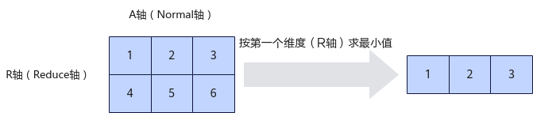
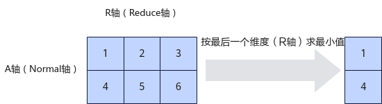

# pypto.amin<a name="ZH-CN_TOPIC_0000002471024493"></a>

## 产品支持情况<a name="section1550532418810"></a>

<a name="table0318142155520"></a>
<table><thead align="left"><tr id="row11318625556"><th class="cellrowborder" valign="top" width="57.99999999999999%" id="mcps1.1.3.1.1"><p id="p103183216558"><a name="p103183216558"></a><a name="p103183216558"></a><span id="ph131818275517"><a name="ph131818275517"></a><a name="ph131818275517"></a>AI处理器类型</span></p>
</th>
<th class="cellrowborder" align="center" valign="top" width="42%" id="mcps1.1.3.1.2"><p id="p731814235515"><a name="p731814235515"></a><a name="p731814235515"></a>是否支持</p>
</th>
</tr>
</thead>
<tbody><tr id="row83182245518"><td class="cellrowborder" valign="top" width="57.99999999999999%" headers="mcps1.1.3.1.1 "><p id="p73181217557"><a name="p73181217557"></a><a name="p73181217557"></a><span id="ph1531810211556"><a name="ph1531810211556"></a><a name="ph1531810211556"></a><term id="zh-cn_topic_0000001312391781_term1253731311225"><a name="zh-cn_topic_0000001312391781_term1253731311225"></a><a name="zh-cn_topic_0000001312391781_term1253731311225"></a>Ascend 910C</term></span></p>
</td>
<td class="cellrowborder" align="center" valign="top" width="42%" headers="mcps1.1.3.1.2 "><p id="p1731816220558"><a name="p1731816220558"></a><a name="p1731816220558"></a>√</p>
</td>
</tr>
<tr id="row431872155513"><td class="cellrowborder" valign="top" width="57.99999999999999%" headers="mcps1.1.3.1.1 "><p id="p19318729554"><a name="p19318729554"></a><a name="p19318729554"></a><span id="ph431892195513"><a name="ph431892195513"></a><a name="ph431892195513"></a><term id="zh-cn_topic_0000001312391781_term11962195213215"><a name="zh-cn_topic_0000001312391781_term11962195213215"></a><a name="zh-cn_topic_0000001312391781_term11962195213215"></a>Ascend 910B</term></span></p>
</td>
<td class="cellrowborder" align="center" valign="top" width="42%" headers="mcps1.1.3.1.2 "><p id="p1131820275516"><a name="p1131820275516"></a><a name="p1131820275516"></a>√</p>
</td>
</tr>
<tr id="row1431852185515"><td class="cellrowborder" valign="top" width="57.99999999999999%" headers="mcps1.1.3.1.1 "><p id="p83185265512"><a name="p83185265512"></a><a name="p83185265512"></a><span id="ph183181529556"><a name="ph183181529556"></a><a name="ph183181529556"></a><term id="zh-cn_topic_0000001312391781_term354143892110"><a name="zh-cn_topic_0000001312391781_term354143892110"></a><a name="zh-cn_topic_0000001312391781_term354143892110"></a>Ascend 310B</term></span></p>
</td>
<td class="cellrowborder" align="center" valign="top" width="42%" headers="mcps1.1.3.1.2 "><p id="p124951335517"><a name="p124951335517"></a><a name="p124951335517"></a>☓</p>
</td>
</tr>
<tr id="row173191727550"><td class="cellrowborder" valign="top" width="57.99999999999999%" headers="mcps1.1.3.1.1 "><p id="p1031982135514"><a name="p1031982135514"></a><a name="p1031982135514"></a><span id="ph731910215512"><a name="ph731910215512"></a><a name="ph731910215512"></a><term id="zh-cn_topic_0000001312391781_term4363218112215"><a name="zh-cn_topic_0000001312391781_term4363218112215"></a><a name="zh-cn_topic_0000001312391781_term4363218112215"></a>Ascend 310P</term></span></p>
</td>
<td class="cellrowborder" align="center" valign="top" width="42%" headers="mcps1.1.3.1.2 "><p id="p182521413105513"><a name="p182521413105513"></a><a name="p182521413105513"></a>☓</p>
</td>
</tr>
<tr id="row4319162125515"><td class="cellrowborder" valign="top" width="57.99999999999999%" headers="mcps1.1.3.1.1 "><p id="p9319172115519"><a name="p9319172115519"></a><a name="p9319172115519"></a><span id="ph23191215518"><a name="ph23191215518"></a><a name="ph23191215518"></a><term id="zh-cn_topic_0000001312391781_term71949488213"><a name="zh-cn_topic_0000001312391781_term71949488213"></a><a name="zh-cn_topic_0000001312391781_term71949488213"></a>Ascend 910</term></span></p>
</td>
<td class="cellrowborder" align="center" valign="top" width="42%" headers="mcps1.1.3.1.2 "><p id="p112553131552"><a name="p112553131552"></a><a name="p112553131552"></a>☓</p>
</td>
</tr>
</tbody>
</table>

## 功能说明<a name="section1288121471119"></a>

对一个多维向量在指定的维度求最小值。

定义指定计算的维度（Reduce轴）为R轴，非指定维度（Normal轴）为A轴。如下图所示，对Shape为\(2, 3\)的二维矩阵进行运算，指定在第一维求最小值，输出结果为\[1, 2, 3\]；指定在第二维求最小值，输出结果为\[1, 4\]。

**图 1**  amin按第一个维度计算示例<a name="fig1757220381044"></a>  


**图 2**  amin按最后一个维度计算示例<a name="fig197381580573"></a>  


## 函数原型<a name="section8786125214915"></a>

```
amin(input: Tensor, dim: int, keepdim: bool = False) -> Tensor: 
```

## 参数说明<a name="section644919345515"></a>

<a name="zh-cn_topic_0235751031_table33761356"></a>
<table><thead align="left"><tr id="zh-cn_topic_0235751031_row27598891"><th class="cellrowborder" valign="top" width="18.54%" id="mcps1.1.4.1.1"><p id="zh-cn_topic_0235751031_p20917673"><a name="zh-cn_topic_0235751031_p20917673"></a><a name="zh-cn_topic_0235751031_p20917673"></a>参数名</p>
</th>
<th class="cellrowborder" valign="top" width="10.05%" id="mcps1.1.4.1.2"><p id="zh-cn_topic_0235751031_p16609919"><a name="zh-cn_topic_0235751031_p16609919"></a><a name="zh-cn_topic_0235751031_p16609919"></a>输入/输出</p>
</th>
<th class="cellrowborder" valign="top" width="71.41%" id="mcps1.1.4.1.3"><p id="zh-cn_topic_0235751031_p59995477"><a name="zh-cn_topic_0235751031_p59995477"></a><a name="zh-cn_topic_0235751031_p59995477"></a>说明</p>
</th>
</tr>
</thead>
<tbody><tr id="row42461942101815"><td class="cellrowborder" valign="top" width="18.54%" headers="mcps1.1.4.1.1 "><p id="p57634810538"><a name="p57634810538"></a><a name="p57634810538"></a>input</p>
</td>
<td class="cellrowborder" valign="top" width="10.05%" headers="mcps1.1.4.1.2 "><p id="p1329911375318"><a name="p1329911375318"></a><a name="p1329911375318"></a>输入</p>
</td>
<td class="cellrowborder" valign="top" width="71.41%" headers="mcps1.1.4.1.3 "><p id="p652854125310"><a name="p652854125310"></a><a name="p652854125310"></a>源操作数。</p>
<p id="p1872462420360"><a name="p1872462420360"></a><a name="p1872462420360"></a>支持的数据类型为：DT_FP32。</p>
<p id="p14554937181812"><a name="p14554937181812"></a><a name="p14554937181812"></a>不支持空Tensor，且Shape仅支持2-4维，Shape Size不大于2147483647（即INT32_MAX）。</p>
</td>
</tr>
<tr id="row113226117598"><td class="cellrowborder" valign="top" width="18.54%" headers="mcps1.1.4.1.1 "><p id="p10322161115592"><a name="p10322161115592"></a><a name="p10322161115592"></a>dim</p>
</td>
<td class="cellrowborder" valign="top" width="10.05%" headers="mcps1.1.4.1.2 "><p id="p13432181975917"><a name="p13432181975917"></a><a name="p13432181975917"></a>输入</p>
</td>
<td class="cellrowborder" valign="top" width="71.41%" headers="mcps1.1.4.1.3 "><p id="p589219055415"><a name="p589219055415"></a><a name="p589219055415"></a>源操作数。</p>
<p id="p10580548171413"><a name="p10580548171413"></a><a name="p10580548171413"></a>支持任意单轴。</p>
</td>
</tr>
<tr id="row8588183142717"><td class="cellrowborder" valign="top" width="18.54%" headers="mcps1.1.4.1.1 "><p id="p17589840111120"><a name="p17589840111120"></a><a name="p17589840111120"></a>keepdim</p>
</td>
<td class="cellrowborder" valign="top" width="10.05%" headers="mcps1.1.4.1.2 "><p id="p5589174081118"><a name="p5589174081118"></a><a name="p5589174081118"></a>输入</p>
</td>
<td class="cellrowborder" valign="top" width="71.41%" headers="mcps1.1.4.1.3 "><p id="p175898405116"><a name="p175898405116"></a><a name="p175898405116"></a>源操作数</p>
<p id="p927261918136"><a name="p927261918136"></a><a name="p927261918136"></a>控制在进行归约后，是否保持被压缩的维度。</p>
<p id="p823417556224"><a name="p823417556224"></a><a name="p823417556224"></a>默认值为False。</p>
</td>
</tr>
</tbody>
</table>

## 返回值说明<a name="section640mcpsimp"></a>

返回输出张量，形状与keepdim相关。

keepdim 若为 True，则在执行归约操作后保留被归约的维度。返回张量在除 dim 以外的所有维度上与输入张量形状一致，而在 dim 维度上的大小为 1。

keepdim若为 False（默认），则被归约的维度会从输出张量中移除。

## 约束说明<a name="section753174210543"></a>

1. tileshape大小不超过 64KB；

2. 尾轴要 32bytes 对齐;

3. tileshape 次尾轴要小于255，即 tileshape\[-2\]<=255.

## 调用示例<a name="section642mcpsimp"></a>

```
x = pypto.tensor([2, 3], pypto.DT_FP32)
y = pypto.amin(x, -1, True)
```

结果示例如下：

```
输入数据 x: [[1 2 3],
             [1 2 3]]
输出数据 y: [[1],
             [1]]
```

