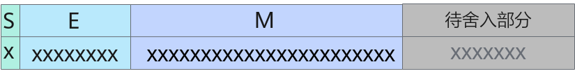

# pypto.cast<a name="ZH-CN_TOPIC_0000002437505940"></a>

## 产品支持情况<a name="section1550532418810"></a>

<a name="table0318142155520"></a>
<table><thead align="left"><tr id="row11318625556"><th class="cellrowborder" valign="top" width="57.99999999999999%" id="mcps1.1.3.1.1"><p id="p103183216558"><a name="p103183216558"></a><a name="p103183216558"></a><span id="ph131818275517"><a name="ph131818275517"></a><a name="ph131818275517"></a>AI处理器类型</span></p>
</th>
<th class="cellrowborder" align="center" valign="top" width="42%" id="mcps1.1.3.1.2"><p id="p731814235515"><a name="p731814235515"></a><a name="p731814235515"></a>是否支持</p>
</th>
</tr>
</thead>
<tbody><tr id="row83182245518"><td class="cellrowborder" valign="top" width="57.99999999999999%" headers="mcps1.1.3.1.1 "><p id="p73181217557"><a name="p73181217557"></a><a name="p73181217557"></a><span id="ph1531810211556"><a name="ph1531810211556"></a><a name="ph1531810211556"></a><term id="zh-cn_topic_0000001312391781_term1253731311225"><a name="zh-cn_topic_0000001312391781_term1253731311225"></a><a name="zh-cn_topic_0000001312391781_term1253731311225"></a>Ascend 910C</term></span></p>
</td>
<td class="cellrowborder" align="center" valign="top" width="42%" headers="mcps1.1.3.1.2 "><p id="p1731816220558"><a name="p1731816220558"></a><a name="p1731816220558"></a>√</p>
</td>
</tr>
<tr id="row431872155513"><td class="cellrowborder" valign="top" width="57.99999999999999%" headers="mcps1.1.3.1.1 "><p id="p19318729554"><a name="p19318729554"></a><a name="p19318729554"></a><span id="ph431892195513"><a name="ph431892195513"></a><a name="ph431892195513"></a><term id="zh-cn_topic_0000001312391781_term11962195213215"><a name="zh-cn_topic_0000001312391781_term11962195213215"></a><a name="zh-cn_topic_0000001312391781_term11962195213215"></a>Ascend 910B</term></span></p>
</td>
<td class="cellrowborder" align="center" valign="top" width="42%" headers="mcps1.1.3.1.2 "><p id="p1131820275516"><a name="p1131820275516"></a><a name="p1131820275516"></a>√</p>
</td>
</tr>
<tr id="row1431852185515"><td class="cellrowborder" valign="top" width="57.99999999999999%" headers="mcps1.1.3.1.1 "><p id="p83185265512"><a name="p83185265512"></a><a name="p83185265512"></a><span id="ph183181529556"><a name="ph183181529556"></a><a name="ph183181529556"></a><term id="zh-cn_topic_0000001312391781_term354143892110"><a name="zh-cn_topic_0000001312391781_term354143892110"></a><a name="zh-cn_topic_0000001312391781_term354143892110"></a>Ascend 310B</term></span></p>
</td>
<td class="cellrowborder" align="center" valign="top" width="42%" headers="mcps1.1.3.1.2 "><p id="p124951335517"><a name="p124951335517"></a><a name="p124951335517"></a>☓</p>
</td>
</tr>
<tr id="row173191727550"><td class="cellrowborder" valign="top" width="57.99999999999999%" headers="mcps1.1.3.1.1 "><p id="p1031982135514"><a name="p1031982135514"></a><a name="p1031982135514"></a><span id="ph731910215512"><a name="ph731910215512"></a><a name="ph731910215512"></a><term id="zh-cn_topic_0000001312391781_term4363218112215"><a name="zh-cn_topic_0000001312391781_term4363218112215"></a><a name="zh-cn_topic_0000001312391781_term4363218112215"></a>Ascend 310P</term></span></p>
</td>
<td class="cellrowborder" align="center" valign="top" width="42%" headers="mcps1.1.3.1.2 "><p id="p182521413105513"><a name="p182521413105513"></a><a name="p182521413105513"></a>☓</p>
</td>
</tr>
<tr id="row4319162125515"><td class="cellrowborder" valign="top" width="57.99999999999999%" headers="mcps1.1.3.1.1 "><p id="p9319172115519"><a name="p9319172115519"></a><a name="p9319172115519"></a><span id="ph23191215518"><a name="ph23191215518"></a><a name="ph23191215518"></a><term id="zh-cn_topic_0000001312391781_term71949488213"><a name="zh-cn_topic_0000001312391781_term71949488213"></a><a name="zh-cn_topic_0000001312391781_term71949488213"></a>Ascend 910</term></span></p>
</td>
<td class="cellrowborder" align="center" valign="top" width="42%" headers="mcps1.1.3.1.2 "><p id="p112553131552"><a name="p112553131552"></a><a name="p112553131552"></a>☓</p>
</td>
</tr>
</tbody>
</table>

## 功能说明<a name="section618mcpsimp"></a>

根据源操作数和目的操作数Tensor的数据类型进行精度转换，如果目的操作数是整形且源操作数的数值超过整形的数据表示范围进行精度转换结果为目的操作数的最大值或者最小值。

在了解精度转换规则之前，需要先了解浮点数的表示方式和二进制的舍入规则：

-   浮点数的表示方式
    -   DT\_FP16共16bit，包括1bit符号位（S），5bit指数位（E）和10bit尾数位（M）。

        当E不全为0或不全为1时，表示的结果为：

        \(-1\)<sup>S</sup>  \* 2<sup>E - 15</sup>  \* \(1 + M\)

        当E全为0时，表示的结果为：

        \(-1\)<sup>S</sup>  \* 2<sup>-14</sup>  \* M

        当E全为1时，若M全为0，表示的结果为±inf（取决于符号位）；若M不全为0，表示的结果为nan。

        

        上图中S=0，E=15，M = 2<sup>-1</sup>  + 2<sup>-2</sup>，表示的结果为1.75。

    -   DT\_FP32共32bit，包括1bit符号位（S），8bit指数位（E）和23bit尾数位（M）。

        当E不全为0或不全为1时，表示的结果为：

        \(-1\)<sup>S</sup>  \* 2<sup>E - 127</sup>  \* \(1 + M\)

        当E全为0时，表示的结果为：

        \(-1\)<sup>S</sup>  \* 2<sup>-126</sup>  \* M

        当E全为1时，若M全为0，表示的结果为±inf（取决于符号位）；若M不全为0，表示的结果为nan。

        

        上图中S = 0，E = 127，M = 2<sup>-1</sup>  + 2<sup>-2</sup>，最终表示的结果为1.75 。

    -   DT\_BF16共16bit，包括1bit符号位（S），8bit指数位（E）和7bit尾数位（M）。

        当E不全为0或不全为1时，表示的结果为：

        \(-1\)<sup>S</sup>  \* 2<sup>E - 127</sup>  \* \(1 + M\)

        当E全为0时，表示的结果为：

        \(-1\)<sup>S</sup>  \* 2<sup>-126</sup>  \* M

        当E全为1时，若M全为0，表示的结果为±inf（取决于符号位）；若M不全为0，表示的结果为nan。

        

        上图中S = 0，E = 127，M = 2<sup>-1</sup>  + 2<sup>-2</sup>，最终表示的结果为1.75。

-   二进制的舍入规则和十进制类似，具体如下：

    

    -   CAST\_RINT模式下，若待舍入部分的第一位为0，则不进位；若第一位为1且后续位不全为0，则进位；若第一位为1且后续位全为0，当M的最后一位为0则不进位，当M的最后一位为1则进位。

    -   CAST\_FLOOR模式下，若S为0，则不进位；若S为1，当待舍入部分全为0则不进位，否则，进位。
    -   CAST\_CEIL模式下，若S为1，则不进位；若S为0，当待舍入部分全为0则不进位；否则，进位。
    -   CAST\_ROUND模式下，若待舍入部分的第一位为0，则不进位；否则，进位。
    -   CAST\_TRUNC模式下，总是不进位。
    -   CAST\_ODD模式下，若待舍入部分全为0，则不进位；若待舍入部分不全为0，当M的最后一位为1则不进位，当M的最后一位为0则进位。

## 函数原型<a name="section8786125214915"></a>

```
cast(input: Tensor, dtype: DataType) -> Tensor
```

## 参数说明<a name="section644919345515"></a>

<a name="zh-cn_topic_0235751031_table33761356"></a>
<table><thead align="left"><tr id="zh-cn_topic_0235751031_row27598891"><th class="cellrowborder" valign="top" width="18.54%" id="mcps1.1.4.1.1"><p id="zh-cn_topic_0235751031_p20917673"><a name="zh-cn_topic_0235751031_p20917673"></a><a name="zh-cn_topic_0235751031_p20917673"></a>参数名</p>
</th>
<th class="cellrowborder" valign="top" width="10.05%" id="mcps1.1.4.1.2"><p id="zh-cn_topic_0235751031_p16609919"><a name="zh-cn_topic_0235751031_p16609919"></a><a name="zh-cn_topic_0235751031_p16609919"></a>输入/输出</p>
</th>
<th class="cellrowborder" valign="top" width="71.41%" id="mcps1.1.4.1.3"><p id="zh-cn_topic_0235751031_p59995477"><a name="zh-cn_topic_0235751031_p59995477"></a><a name="zh-cn_topic_0235751031_p59995477"></a>说明</p>
</th>
</tr>
</thead>
<tbody><tr id="row42461942101815"><td class="cellrowborder" valign="top" width="18.54%" headers="mcps1.1.4.1.1 "><p id="p57634810538"><a name="p57634810538"></a><a name="p57634810538"></a>input</p>
</td>
<td class="cellrowborder" valign="top" width="10.05%" headers="mcps1.1.4.1.2 "><p id="p1329911375318"><a name="p1329911375318"></a><a name="p1329911375318"></a>输入</p>
</td>
<td class="cellrowborder" valign="top" width="71.41%" headers="mcps1.1.4.1.3 "><p id="p4131323173018"><a name="p4131323173018"></a><a name="p4131323173018"></a>源操作数。</p>
<p id="p33175486202"><a name="p33175486202"></a><a name="p33175486202"></a>支持的数据类型为：DT_FP32、DT_FP16、DT_INT32、DT_BF16。</p>
<p id="p45217198302"><a name="p45217198302"></a><a name="p45217198302"></a>不支持空Tensor，且Shape仅支持1-4维，且Shape Size不大于2147483647（即INT32_MAX）。</p>
</td>
</tr>
<tr id="row1539105117484"><td class="cellrowborder" valign="top" width="18.54%" headers="mcps1.1.4.1.1 "><p id="p1240151104818"><a name="p1240151104818"></a><a name="p1240151104818"></a>dtype</p>
</td>
<td class="cellrowborder" valign="top" width="10.05%" headers="mcps1.1.4.1.2 "><p id="p14035184819"><a name="p14035184819"></a><a name="p14035184819"></a>输入</p>
</td>
<td class="cellrowborder" valign="top" width="71.41%" headers="mcps1.1.4.1.3 "><p id="p10409516480"><a name="p10409516480"></a><a name="p10409516480"></a>精度转换后的数据类型。</p>
<p id="p397117155215"><a name="p397117155215"></a><a name="p397117155215"></a>支持的数据类型为：DT_FP32、DT_FP16、DT_INT32、DT_BF16、DT_INT8。</p>
</td>
</tr>
</tbody>
</table>

## 约束说明<a name="section753174210543"></a>

1.  half 转 int8 时输入数据范围需要在int8能表示的数据范围内。

## 调用示例<a name="section642mcpsimp"></a>

```
x = pypto.tensor([2], pypto.DT_FP32)
y = pypto.cast(x, pypto.DT_FP16)
```

结果示例如下：

```
输入数据x: [2.0, 3.0] # x.dtype: pypto.DT_FP32

输出数据y: [2.0, 3.0] # y.dtype: pypto.DT_FP16
```

