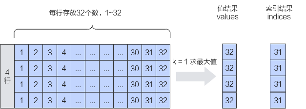

# pypto.topk<a name="ZH-CN_TOPIC_0000002503198067"></a>

## 产品支持情况<a name="section1550532418810"></a>

<a name="table0318142155520"></a>
<table><thead align="left"><tr id="row11318625556"><th class="cellrowborder" valign="top" width="57.99999999999999%" id="mcps1.1.3.1.1"><p id="p103183216558"><a name="p103183216558"></a><a name="p103183216558"></a><span id="ph131818275517"><a name="ph131818275517"></a><a name="ph131818275517"></a>AI处理器类型</span></p>
</th>
<th class="cellrowborder" align="center" valign="top" width="42%" id="mcps1.1.3.1.2"><p id="p731814235515"><a name="p731814235515"></a><a name="p731814235515"></a>是否支持</p>
</th>
</tr>
</thead>
<tbody><tr id="row83182245518"><td class="cellrowborder" valign="top" width="57.99999999999999%" headers="mcps1.1.3.1.1 "><p id="p73181217557"><a name="p73181217557"></a><a name="p73181217557"></a><span id="ph1531810211556"><a name="ph1531810211556"></a><a name="ph1531810211556"></a><term id="zh-cn_topic_0000001312391781_term1253731311225"><a name="zh-cn_topic_0000001312391781_term1253731311225"></a><a name="zh-cn_topic_0000001312391781_term1253731311225"></a>Ascend 910C</term></span></p>
</td>
<td class="cellrowborder" align="center" valign="top" width="42%" headers="mcps1.1.3.1.2 "><p id="p1731816220558"><a name="p1731816220558"></a><a name="p1731816220558"></a>√</p>
</td>
</tr>
<tr id="row431872155513"><td class="cellrowborder" valign="top" width="57.99999999999999%" headers="mcps1.1.3.1.1 "><p id="p19318729554"><a name="p19318729554"></a><a name="p19318729554"></a><span id="ph431892195513"><a name="ph431892195513"></a><a name="ph431892195513"></a><term id="zh-cn_topic_0000001312391781_term11962195213215"><a name="zh-cn_topic_0000001312391781_term11962195213215"></a><a name="zh-cn_topic_0000001312391781_term11962195213215"></a>Ascend 910B</term></span></p>
</td>
<td class="cellrowborder" align="center" valign="top" width="42%" headers="mcps1.1.3.1.2 "><p id="p1131820275516"><a name="p1131820275516"></a><a name="p1131820275516"></a>√</p>
</td>
</tr>
<tr id="row1431852185515"><td class="cellrowborder" valign="top" width="57.99999999999999%" headers="mcps1.1.3.1.1 "><p id="p83185265512"><a name="p83185265512"></a><a name="p83185265512"></a><span id="ph183181529556"><a name="ph183181529556"></a><a name="ph183181529556"></a><term id="zh-cn_topic_0000001312391781_term354143892110"><a name="zh-cn_topic_0000001312391781_term354143892110"></a><a name="zh-cn_topic_0000001312391781_term354143892110"></a>Ascend 310B</term></span></p>
</td>
<td class="cellrowborder" align="center" valign="top" width="42%" headers="mcps1.1.3.1.2 "><p id="p124951335517"><a name="p124951335517"></a><a name="p124951335517"></a>☓</p>
</td>
</tr>
<tr id="row173191727550"><td class="cellrowborder" valign="top" width="57.99999999999999%" headers="mcps1.1.3.1.1 "><p id="p1031982135514"><a name="p1031982135514"></a><a name="p1031982135514"></a><span id="ph731910215512"><a name="ph731910215512"></a><a name="ph731910215512"></a><term id="zh-cn_topic_0000001312391781_term4363218112215"><a name="zh-cn_topic_0000001312391781_term4363218112215"></a><a name="zh-cn_topic_0000001312391781_term4363218112215"></a>Ascend 310P</term></span></p>
</td>
<td class="cellrowborder" align="center" valign="top" width="42%" headers="mcps1.1.3.1.2 "><p id="p182521413105513"><a name="p182521413105513"></a><a name="p182521413105513"></a>☓</p>
</td>
</tr>
<tr id="row4319162125515"><td class="cellrowborder" valign="top" width="57.99999999999999%" headers="mcps1.1.3.1.1 "><p id="p9319172115519"><a name="p9319172115519"></a><a name="p9319172115519"></a><span id="ph23191215518"><a name="ph23191215518"></a><a name="ph23191215518"></a><term id="zh-cn_topic_0000001312391781_term71949488213"><a name="zh-cn_topic_0000001312391781_term71949488213"></a><a name="zh-cn_topic_0000001312391781_term71949488213"></a>Ascend 910</term></span></p>
</td>
<td class="cellrowborder" align="center" valign="top" width="42%" headers="mcps1.1.3.1.2 "><p id="p112553131552"><a name="p112553131552"></a><a name="p112553131552"></a>☓</p>
</td>
</tr>
</tbody>
</table>

## 功能说明<a name="section618mcpsimp"></a>

获取最后一个维度的前k个最大值或最小值及其对应的索引。

如果输入是向量，则在向量中找到前k个最大值或最小值及其对应的索引；如果输入是矩阵，则沿最后一个维度计算每行中前k个最大值或最小值及其对应的索引。如下图所示，对Shape为\(4, 32\)的二维矩阵进行排序，k设置为1，输出结果为\[\[32\] \[32\] \[32\] \[32\]\]。



## 函数原型<a name="section8786125214915"></a>

```
topk(input: Tensor, k: int, dim: Optional[int]=None, largest: bool=True) -> Tuple[Tensor, Tensor]
```

## 参数说明<a name="section644919345515"></a>

<a name="zh-cn_topic_0235751031_table33761356"></a>
<table><thead align="left"><tr id="zh-cn_topic_0235751031_row27598891"><th class="cellrowborder" valign="top" width="18.54%" id="mcps1.1.4.1.1"><p id="zh-cn_topic_0235751031_p20917673"><a name="zh-cn_topic_0235751031_p20917673"></a><a name="zh-cn_topic_0235751031_p20917673"></a>参数名</p>
</th>
<th class="cellrowborder" valign="top" width="10.05%" id="mcps1.1.4.1.2"><p id="zh-cn_topic_0235751031_p16609919"><a name="zh-cn_topic_0235751031_p16609919"></a><a name="zh-cn_topic_0235751031_p16609919"></a>输入/输出</p>
</th>
<th class="cellrowborder" valign="top" width="71.41%" id="mcps1.1.4.1.3"><p id="zh-cn_topic_0235751031_p59995477"><a name="zh-cn_topic_0235751031_p59995477"></a><a name="zh-cn_topic_0235751031_p59995477"></a>说明</p>
</th>
</tr>
</thead>
<tbody><tr id="row42461942101815"><td class="cellrowborder" valign="top" width="18.54%" headers="mcps1.1.4.1.1 "><p id="p57634810538"><a name="p57634810538"></a><a name="p57634810538"></a>input</p>
</td>
<td class="cellrowborder" valign="top" width="10.05%" headers="mcps1.1.4.1.2 "><p id="p1329911375318"><a name="p1329911375318"></a><a name="p1329911375318"></a>输入</p>
</td>
<td class="cellrowborder" valign="top" width="71.41%" headers="mcps1.1.4.1.3 "><p id="p652854125310"><a name="p652854125310"></a><a name="p652854125310"></a>源操作数。</p>
<p id="p6203457185819"><a name="p6203457185819"></a><a name="p6203457185819"></a>支持的数据类型为：DT_FP32。</p>
<p id="p12279204033314"><a name="p12279204033314"></a><a name="p12279204033314"></a>不支持空Tensor，且Shape仅支持2-4维，且Shape Size不大于2147483647（即INT32_MAX）。</p>
</td>
</tr>
<tr id="row1963611262594"><td class="cellrowborder" valign="top" width="18.54%" headers="mcps1.1.4.1.1 "><p id="p1863712675912"><a name="p1863712675912"></a><a name="p1863712675912"></a>k</p>
</td>
<td class="cellrowborder" valign="top" width="10.05%" headers="mcps1.1.4.1.2 "><p id="p763752655911"><a name="p763752655911"></a><a name="p763752655911"></a>输入</p>
</td>
<td class="cellrowborder" valign="top" width="71.41%" headers="mcps1.1.4.1.3 "><p id="p1852917382617"><a name="p1852917382617"></a><a name="p1852917382617"></a>返回元素的数量。</p>
<p id="p911317316106"><a name="p911317316106"></a><a name="p911317316106"></a>k的大小应该满足：1 &lt;= k &lt;= input.shape[dim]。</p>
</td>
</tr>
<tr id="row957519331519"><td class="cellrowborder" valign="top" width="18.54%" headers="mcps1.1.4.1.1 "><p id="p38850381651"><a name="p38850381651"></a><a name="p38850381651"></a>dim</p>
</td>
<td class="cellrowborder" valign="top" width="10.05%" headers="mcps1.1.4.1.2 "><p id="p18859381454"><a name="p18859381454"></a><a name="p18859381454"></a>输入</p>
</td>
<td class="cellrowborder" valign="top" width="71.41%" headers="mcps1.1.4.1.3 "><p id="p10621561786"><a name="p10621561786"></a><a name="p10621561786"></a>指定排序的维度。</p>
<p id="p16903172315113"><a name="p16903172315113"></a><a name="p16903172315113"></a>目前仅支持按最后一个维度排序，即dim= -1或dim= input.shape.size() - 1。</p>
</td>
</tr>
<tr id="row113226117598"><td class="cellrowborder" valign="top" width="18.54%" headers="mcps1.1.4.1.1 "><p id="p1843013456512"><a name="p1843013456512"></a><a name="p1843013456512"></a>largest</p>
</td>
<td class="cellrowborder" valign="top" width="10.05%" headers="mcps1.1.4.1.2 "><p id="p1443017451258"><a name="p1443017451258"></a><a name="p1443017451258"></a>输入</p>
</td>
<td class="cellrowborder" valign="top" width="71.41%" headers="mcps1.1.4.1.3 "><p id="p7154104441210"><a name="p7154104441210"></a><a name="p7154104441210"></a><span>如果为</span>True<span>，返回最大元素。如果为</span>False<span>，返回最小元素。</span></p>
</td>
</tr>
</tbody>
</table>

## 返回值说明<a name="section640mcpsimp"></a>

返回一个命名元组 \(values, indices\)，其中包含input在指定维度 dim 下每行中最大的 k 个元素的值和索引。

## 约束说明<a name="section753174210543"></a>

1.  只支持对尾轴进行topk操作；
2.  tileshape尾轴32bytes对齐\(tileshape\[-1\]\*4 % 32 == 0\)，且tileshape尾轴需要小于22KB\(tileshape\[-1\]\*4 < 22KB\)；
3.  k <= tileshape\[-1\] && k <= input.shape\[-1\]；

## 调用示例<a name="section642mcpsimp"></a>

```
x = pypto.tensor([2, 3], pypto.DT_FP32)
y = pypto.topk(x, 2, -1, True)
```

结果示例如下：

```
输入数据x: [[1, 2, 3],
            [1, 2, 3]]
输出数据y[0]: [[3, 2],
                 [3, 2]]
输出数据y[1]: [[2, 1],
                 [2, 1]]
```

