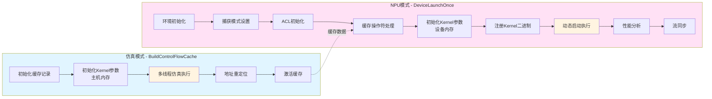
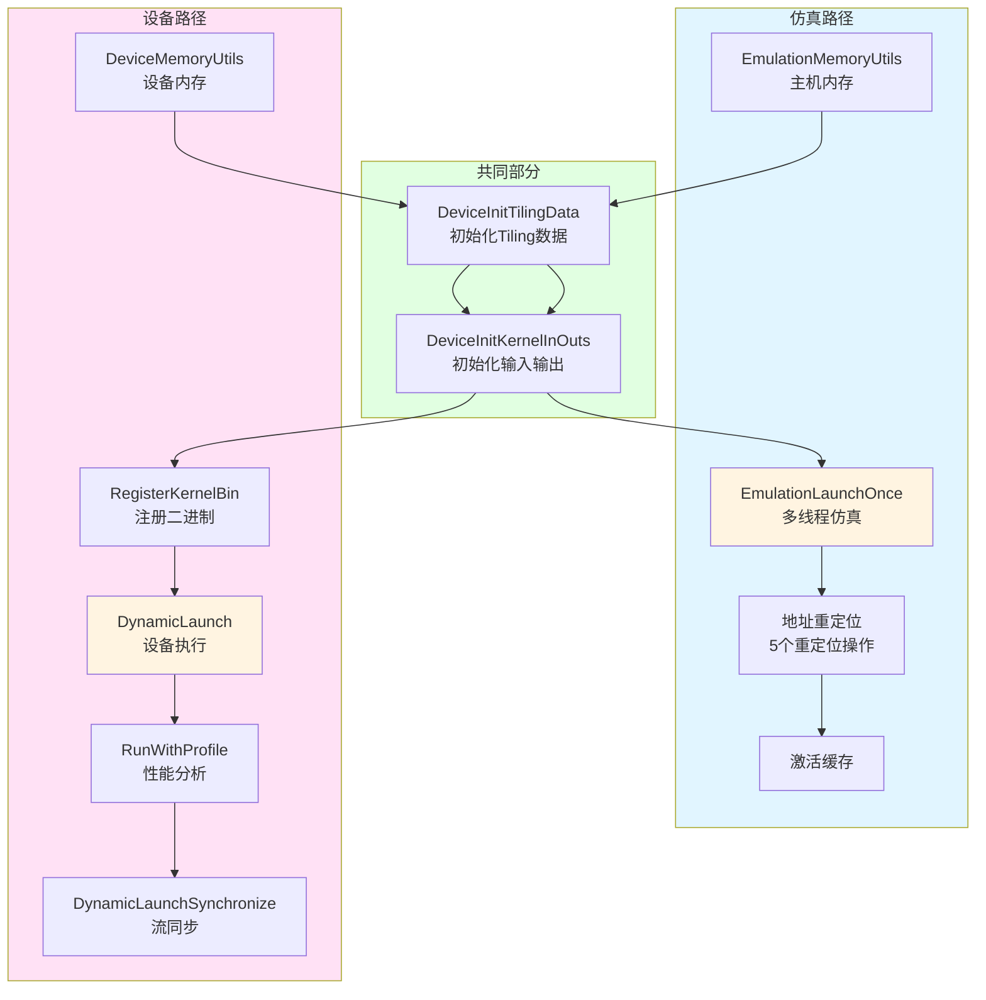
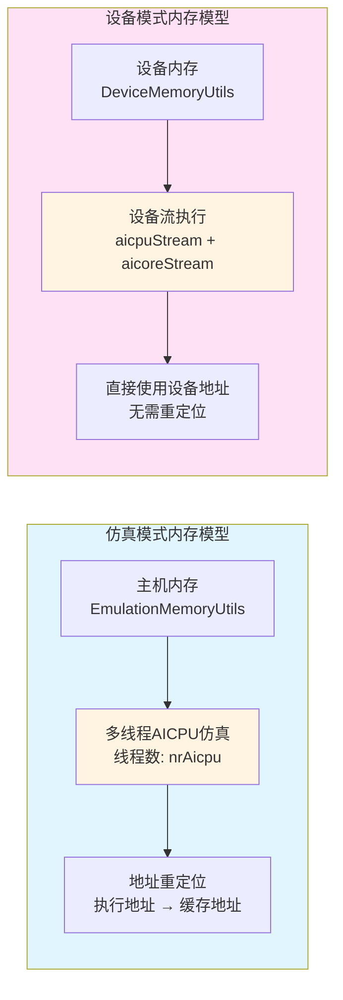
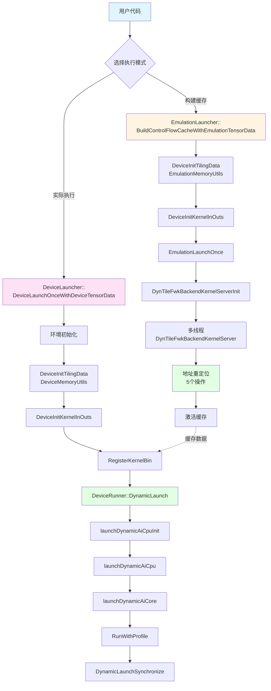

# 代码执行流程图

## 1. EmulationLauncher::BuildControlFlowCacheWithEmulationTensorData 流程图

```mermaid
flowchart TD
    Start([开始: BuildControlFlowCacheWithEmulationTensorData]) --> Init1[初始化控制流缓存记录模式]
    Init1 --> SetRecording[设置 isRecording = true<br/>deviceTaskCount = 0<br/>cacheDataOffset = 0]
    SetRecording --> InitKArgs[创建 DeviceKernelArgs kArgs]
    InitKArgs --> InitTiling[DeviceInitTilingData<br/>使用 EmulationMemoryUtils<br/>主机内存]
    InitTiling --> InitIO[DeviceInitKernelInOuts<br/>初始化输入输出张量]
    InitIO --> EmulationLaunch[调用 EmulationLaunchOnce]
    
    EmulationLaunch --> InitServer[DynTileFwkBackendKernelServerInit<br/>初始化后端内核服务器]
    InitServer --> CheckInit{初始化成功?}
    CheckInit -->|失败| ReturnError1[返回错误]
    CheckInit -->|成功| CreateThreads[创建多个AICPU线程<br/>数量: devProg->devArgs.nrAicpu]
    
    CreateThreads --> ThreadLoop[对每个线程]
    ThreadLoop --> SetAffinity[设置CPU亲和性]
    SetAffinity --> SetName[设置线程名称 aicputN]
    SetName --> RunServer[DynTileFwkBackendKernelServer<br/>执行AICPU内核服务器]
    RunServer --> JoinThreads[等待所有线程完成]
    
    JoinThreads --> CheckResult{所有线程成功?}
    CheckResult -->|失败| ReturnError2[返回错误]
    CheckResult -->|成功| StopRecording[停止记录<br/>isRecording = false]
    
    StopRecording --> GetAddr[获取 contextWorkspaceAddr]
    GetAddr --> Reloc1[IncastOutcastAddrReloc<br/>重定位输入/输出cast地址]
    Reloc1 --> Reloc2[RuntimeAddrRelocWorkspace<br/>重定位运行时工作空间]
    Reloc2 --> Reloc3[RuntimeAddrRelocProgram<br/>重定位运行时程序地址]
    Reloc3 --> Reloc4[TaskAddrRelocWorkspace<br/>重定位任务工作空间]
    Reloc4 --> Reloc5[TaskAddrRelocProgram<br/>重定位任务程序地址]
    
    Reloc5 --> Reset[devProg->ResetFromLaunch<br/>重置启动状态]
    Reset --> Activate[设置 isActivated = true<br/>激活缓存]
    Activate --> ReturnSuccess[返回成功]
    
    ReturnError1 --> End1([结束])
    ReturnError2 --> End1
    ReturnSuccess --> End1
    
    style Start fill:#e1f5ff
    style End1 fill:#ffe1f5
    style EmulationLaunch fill:#fff4e1
    style Reloc1 fill:#e1ffe1
    style Reloc2 fill:#e1ffe1
    style Reloc3 fill:#e1ffe1
    style Reloc4 fill:#e1ffe1
    style Reloc5 fill:#e1ffe1
    style Activate fill:#ffe1f5
```

## 2. DeviceLauncher::DeviceLaunchOnceWithDeviceTensorData 流程图

```mermaid
flowchart TD
    Start([开始: DeviceLaunchOnceWithDeviceTensorData]) --> EnvInit[环境初始化]
    EnvInit --> SetRunType[设置运行类型: npu]
    SetRunType --> SetBinData[设置Kernel二进制数据]
    SetBinData --> CaptureStream[设置捕获流<br/>SetCaptureStream]
    
    CaptureStream --> CheckCapture{需要捕获?}
    CheckCapture -->|是| ChangeMode[更改捕获模式为RELAXED]
    CheckCapture -->|否| SetFlag[设置捕获标志和性能分析函数]
    ChangeMode --> SetFlag
    
    SetFlag --> ACLInit[ACL初始化<br/>aclInit]
    ACLInit --> CheckACL{初始化成功?}
    CheckACL -->|失败| ReturnError1[返回错误]
    CheckACL -->|成功| CheckCache{cachedOperator == nullptr?}
    
    CheckCache -->|是| CheckReuse{启用Kernel重用?}
    CheckReuse -->|是| GetCache[获取缓存的配置数据地址]
    GetCache --> SetCache[设置 cachedOperator]
    CheckReuse -->|否| CheckDevice
    CheckCache -->|否| CheckDevice[检查设备ID]
    SetCache --> CheckDevice
    
    CheckDevice --> CreateKArgs[创建 DeviceKernelArgs kArgs]
    CreateKArgs --> FillDeviceInfo[填充设备信息<br/>DeviceLauncherConfigFillDeviceInfo]
    FillDeviceInfo --> InitTiling[DeviceInitTilingData<br/>使用 DeviceMemoryUtils<br/>设备内存]
    InitTiling --> SetCacheKernel[DeviceRunCacheKernelSet<br/>设置缓存Kernel]
    SetCacheKernel --> InitIO[DeviceInitKernelInOuts<br/>初始化输入输出]
    
    InitIO --> RegisterBin[注册Kernel二进制<br/>RegisterKernelBin]
    RegisterBin --> CheckReg{注册成功?}
    CheckReg -->|失败| ReturnError2[返回错误: Register kernel bin failed]
    CheckReg -->|成功| DynamicLaunch[执行动态启动<br/>DynamicLaunch]
    
    DynamicLaunch --> InitAicpuSo[初始化AICPU SO二进制<br/>首次执行]
    InitAicpuSo --> PrepareArgs[准备设备参数 DeviceArgs]
    PrepareArgs --> CopyArgs[复制参数到设备内存]
    CopyArgs --> RunPrepare[执行准备阶段 RunPrepare]
    RunPrepare --> LaunchInit[launchDynamicAiCpuInit<br/>初始化AICPU]
    LaunchInit --> LaunchCpu[launchDynamicAiCpu<br/>启动AICPU任务]
    LaunchCpu --> LaunchCore[launchDynamicAiCore<br/>启动AICore任务]
    
    LaunchCore --> CheckLaunch{启动成功?}
    CheckLaunch -->|失败| ReturnError3[返回错误]
    CheckLaunch -->|成功| RunProfile[运行性能分析<br/>RunWithProfile]
    
    RunProfile --> CheckProfile{性能分析成功?}
    CheckProfile -->|失败| ReturnError4[返回错误]
    CheckProfile -->|成功| CheckSync{需要同步?}
    
    CheckSync -->|是| Sync[执行流同步<br/>DynamicLaunchSynchronize]
    CheckSync -->|否| ReturnSuccess[返回成功]
    Sync --> ReturnSuccess
    
    ReturnError1 --> End1([结束])
    ReturnError2 --> End1
    ReturnError3 --> End1
    ReturnError4 --> End1
    ReturnSuccess --> End1
    
    style Start fill:#e1f5ff
    style End1 fill:#ffe1f5
    style DynamicLaunch fill:#fff4e1
    style LaunchInit fill:#e1ffe1
    style LaunchCpu fill:#e1ffe1
    style LaunchCore fill:#e1ffe1
    style RunProfile fill:#ffe1f5
    style Sync fill:#ffe1f5
```

## 3. 两个流程的对比图

## 4. 详细执行流程对比

## 5. 内存和线程模型对比

## 6. 完整调用链

