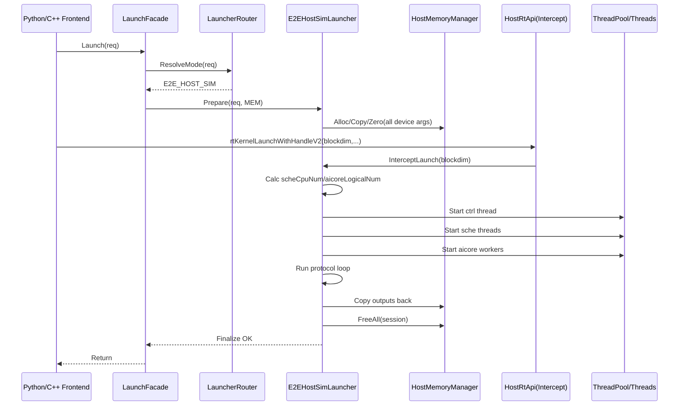
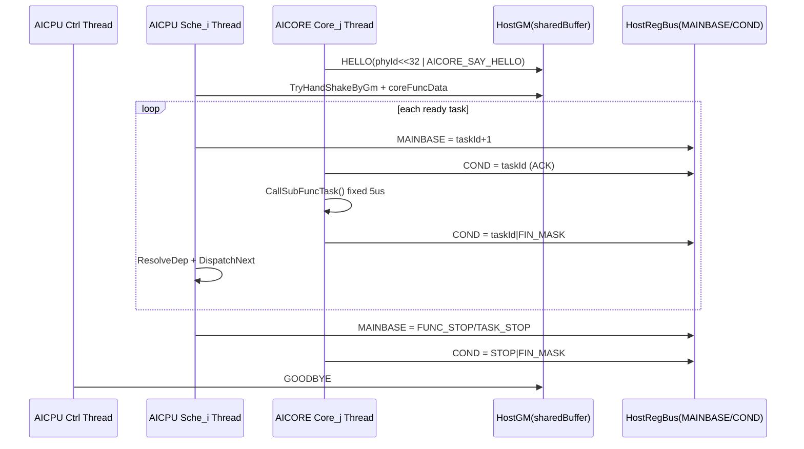

# Host CPU 侧 AICPU-AICORE 全流程仿真设计（DebugMode E2E）

## 1. 目标

在 Host CPU 侧新增一条可控的 E2E 仿真路径，完整覆盖：

- `app(host runtime) -> client(AICPU ctrl/sche) -> server(AICORE)`
- GM 交互（`sharedBuffer/shakeBuffer/waveBufferCpuToCore`）
- 寄存器交互（`DATA_MAIN_BASE/COND`）

同时满足：

- `CostModel/PVmodel` 当前 `RunTestMode` 保持不变。
- E2E 仅在 `runtime_debug_mode=E2E_HOST_SIM` 时生效。
- `CallSubFuncTask` 在 Host 仿真中短接，每次固定建模 `5us`。
- E2E 路径中 device 内存全部接管为 host 内存。

## 2. 约束与非目标

### 2.1 约束

- 对外 launch 入口保持统一（Python/C++ 层 API 不变）。
- 运行时内存后端只允许两种：`HOST` 和 `DEVICE`。
- `AICPU ctrl` 与每个 `sche` 必须是独立线程。
- E2E 线程规模由本次 `rtKernelLaunchWithHandleV2` 的 `blockdim` 驱动。

### 2.2 非目标

- 不改变真实 device (`__DEVICE__`) 行为。
- 不在本阶段实现 cycle-accurate 微架构仿真。
- 不改变 `CostModelLauncher::RunTestMode` 在 `CostModel/PVmodel` 的既有链路。

## 3. 总体架构

### 3.1 执行模式矩阵

| 模式 | 入口 | AICORE 仿真 | 内存模式 | 说明 |
| --- | --- | --- | --- | --- |
| `DEVICE_RT` | 统一入口 | 否 | `DEVICE` | 真实 device 运行 |
| `EMULATION` | 统一入口 | 否（主要 AICPU 仿真） | `HOST` | 现有仿真流程 |
| `E2E_HOST_SIM` | 统一入口 | 是 | `HOST` | 本文新增 E2E |
| `COSTMODEL/PVMODEL` | 现有 `RunTestMode` | 否 | `HOST` | 保持不变 |

### 3.2 Launcher 分层

新增分层，不改外部入口：

- `LaunchFacade`：对外统一入口。
- `LauncherRouter`：按 mode 选择 launcher。
- `DeviceRtLauncher`：真实 device 路径。
- `EmulationLauncher`：现有 host 仿真路径。
- `E2EHostSimLauncher`：新增 AICPU+AICORE 全协议仿真路径。

统一生命周期：`Prepare -> Launch -> Finalize`。

### 3.3 内存管理统一（二态）

只保留两种内存后端：

- `HOST`：`malloc/free/memcpy_s/memset_s`
- `DEVICE`：`rtMalloc/rtFree/rtMemcpy/rtMemset`

通过 `IMemoryManager` 抽象统一调用：

- `HostMemoryManager`
- `DeviceMemoryManager`

`CostModel/Emulation/E2E` 全部归入 `HOST`。

### 3.4 rt 接口接管原则

- 非 E2E 路径保持真实 `rt/aclrt` 调用。
- E2E 路径通过 `MachineRtApi + RtApiDispatcher` 接管。
- E2E 下短接 `rtKernelLaunchWithHandleV2`：
  - 读取 `blockdim`
  - 触发 AICPU/AICORE 线程组拉起

## 4. E2E 运行模型

### 4.1 线程与核模型（blockdim 驱动）

- AICPU 线程数：`1(ctrl) + scheCpuNum`
- AICORE 逻辑核数：`aicoreLogicalNum = 3 * blockdim`
- 其中：
  - `aicValidNum = blockdim`
  - `aivValidNum = 2 * blockdim`

满配示例：`blockdim=24 -> AICORE=72`。

### 4.2 Sche 分段关系

`sche` 不是与 core 一一绑定，而是管理分段：

- AIC 区间：`[0, blockdim)` 按 `scheCpuNum` 切分
- AIV 区间：`[blockdim, 3*blockdim)` 按 `scheCpuNum` 切分

每个 `sche_i` 只处理自己的 core 子区间（握手、派发、ACK/FIN、stop）。

### 4.3 AICORE 绑核压缩

- 逻辑核到 host 物理核可压缩映射：`36` 或 `18`。
- 映射：`host_cpu = aicore_cpu_set[vcore_id % bind_core_num]`
- 压缩仅改变执行映射，不改变 sche 管理边界。

### 4.4 PGMask 与逻辑/物理映射

对齐 device 建链语义：

1. `pgmask` 标记有效逻辑 core。
2. 构建 `logicalId -> physicalId` 映射。
3. AICORE HELLO 上报 `physicalId`（高 32 位）。
4. AICPU 通过 `TryHandShakeByGm` 建立 `blockIdToPhyCoreId`。

## 5. E2E 内存接管范围

E2E 模式下以下对象全部改走 host 申请与管理：

- 输入/输出 tensor devptr
- `workspace` / `cfgdata`
- `control flow cache`
- `runtimeDataRingBufferAddr`
- `sharedBuffer`
- `coreRegAddr` / `corePmuRegAddr`
- `corePmuAddr` / `taskWastTime` / `pmuEventAddr` / `devDfxArgAddr`
- `aicpuSoBin`
- `perfData_` / DFX 缓冲

## 6. E2E 主流程

1. 统一入口接收 launch 请求。
2. `LauncherRouter` 选择 `E2EHostSimLauncher`。
3. `MemoryFactory` 创建 `HostMemoryManager`。
4. `E2EHostSimLauncher::Prepare` 完成内存接管与元数据准备。
5. E2E 短接 `rtKernelLaunchWithHandleV2`，读取 `blockdim`。
6. 计算线程规模并创建 AICPU/AICORE 线程组。
7. AICORE 发 HELLO，AICPU 建立 `logical->physical` 映射并预发任务。
8. 进入 ACK/FIN 调度循环，`CallSubFuncTask=5us`。
9. 发送 `FUNC_STOP/TASK_STOP`，`GOODBYE` 收尾。
10. 回填输出并统一回收会话内存。

## 7. 时序图（重绘）

### 7.1 统一入口与线程拉起时序（E2E）



### 7.2 AICPU-AICORE 协议时序（E2E）



## 8. 软件设计（可实施）

### 8.1 统一 launcher 接口

```cpp
enum class LaunchMode { DEVICE_RT, EMULATION, E2E_HOST_SIM, COSTMODEL, PVMODEL };

enum class MemoryMode { HOST, DEVICE };

struct LaunchRequest {
  Function* func;
  std::vector<DeviceTensorData> inputs;
  std::vector<DeviceTensorData> outputs;
  DeviceLauncherConfig cfg;
};

struct ILauncher {
  virtual int Prepare(const LaunchRequest&, IMemoryManager&) = 0;
  virtual int Launch(const LaunchRequest&, IMemoryManager&) = 0;
  virtual int Finalize(const LaunchRequest&, IMemoryManager&) = 0;
  virtual ~ILauncher() = default;
};

int LaunchFacade::Launch(const LaunchRequest& req) {
  LaunchMode mode = LauncherRouter::ResolveMode(req);
  MemoryMode mm = (mode == LaunchMode::DEVICE_RT) ? MemoryMode::DEVICE : MemoryMode::HOST;
  auto mem = MemoryFactory::Create(mm);
  auto launcher = LauncherRouter::Create(mode);
  int rc = launcher->Prepare(req, *mem);
  if (rc != 0) return rc;
  rc = launcher->Launch(req, *mem);
  int rc2 = launcher->Finalize(req, *mem);
  return rc != 0 ? rc : rc2;
}
```

### 8.2 二态内存接口

```cpp
struct IMemoryManager {
  virtual void* Alloc(size_t size, uint8_t** cacheHolder = nullptr) = 0;
  virtual int Free(void* ptr) = 0;
  virtual int Memcpy(void* dst, size_t dstSize, const void* src, size_t size, int kind) = 0;
  virtual int Memset(void* dst, size_t dstSize, int value, size_t size) = 0;
  virtual bool IsDevice() const = 0;
  virtual ~IMemoryManager() = default;
};

class HostMemoryManager final : public IMemoryManager {
  // malloc/free/memcpy_s/memset_s
};

class DeviceMemoryManager final : public IMemoryManager {
  // rtMalloc/rtFree/rtMemcpy/rtMemset
};
```

### 8.3 rt 接口接管

```cpp
struct IMachineRtApi {
  virtual int Malloc(void** ptr, size_t size) = 0;
  virtual int Free(void* ptr) = 0;
  virtual int Memcpy(void* dst, size_t dstSize, const void* src, size_t size, int kind) = 0;
  virtual int Memset(void* dst, size_t dstSize, int value, size_t size) = 0;
  virtual int LaunchAicpu(const rtAicpuArgsEx_t& args, int num, void* stream) = 0;
  virtual int LaunchAicore(void* kernel, const rtArgsEx_t& args, void* stream, const rtTaskCfgInfo_t& cfg) = 0;
  virtual int StreamSync(void* stream) = 0;
  virtual ~IMachineRtApi() = default;
};

class RtApiDispatcher {
 public:
  static void Install(IMachineRtApi* api);
  static IMachineRtApi& Current();
};

int HostRtApi::LaunchAicore(void* kernel, const rtArgsEx_t& args, void* stream, const rtTaskCfgInfo_t& cfg) {
  (void)kernel;
  (void)stream;
  (void)cfg;
  CurrentLaunchCtx::Get().blockdim = ExtractBlockDim(args);
  return E2EHostSimLauncher::LaunchFromIntercept();
}
```

### 8.4 AICORE entry host 适配与 5us 短接

```cpp
// host_aicore_entry_adapter.h
#define dcci(...)
#define set_flag(...)
#define wait_flag(...)
#define set_mask_norm(...)

inline uint64_t get_sys_cnt() { return HostSimClock::NowNs(); }
inline int64_t get_coreid() { return HostCoreCtx::Current().phyId; }
inline int get_block_idx() { return HostCoreCtx::Current().blockId; }
inline void set_cond(uint64_t v) { HostRegBus::WriteCond(HostCoreCtx::Current().blockId, v); }
inline uint64_t GetDataMainBase() { return HostRegBus::ReadMainBase(HostCoreCtx::Current().blockId); }

inline void CallSubFuncTask(uint64_t, CoreFuncParam*, int64_t, __gm__ int64_t*) {
  HostSimClock::AdvanceNs(5000);
}
```

### 8.5 HostRegBus 低抖动策略

- `mainBase` 与 `cond` cacheline 隔离。
- 使用 `release/acquire/relaxed` 分层内存序。
- 分级轮询退避：`cpu_relax -> yield -> sleep_us(1~5)`。
- sche 侧可批量读取所属 core，减少同步碎片。

## 9. 改造清单

### P0（必须）

- [ ] 新增 `E2EHostSimLauncher`：`framework/src/machine/runtime/e2e_host_sim_launcher.h/.cpp`
- [ ] 新增 `LauncherRouter/LaunchFacade`：`framework/src/machine/runtime/launcher_router.h/.cpp`
- [ ] 新增统一内存接口：`framework/src/machine/runtime/memory/memory_manager.h/.cpp`
- [ ] 新增 `MachineRtApi/RtApiDispatcher`：`framework/src/machine/runtime/rt_api/*`
- [ ] `device_memory_utils.h` 迁移到 `IMemoryManager` 适配
- [ ] `emulation_launcher.h` 的内存实现迁移到 `HostMemoryManager`
- [ ] `cost_model_launcher.h` 的 host 内存 helper 迁移到 `HostMemoryManager`
- [ ] E2E 模式短接 `rtKernelLaunchWithHandleV2` 并触发线程拉起
- [ ] `AICPU ctrl/sche` 独立线程化，`scheCpuNum` 由 `blockdim` 计算
- [ ] `AICORE` 按 `3*blockdim` 动态线程规模运行
- [ ] `aicore_hal.h` 增加 `HOST_AICORE_SIM` backend
- [ ] `aicore_entry` host 打桩 + `CallSubFuncTask=5us`
- [ ] E2E 路径全量 host 内存接管（无真实 device alloc）

### P1（必须）

- [ ] `pgmask` + `logical/physical` 映射接入 handshake 全流程
- [ ] `sche_i` 分段调度对齐 `AiCoreManager::UpdateAiCoreBlockIndexSection`
- [ ] stop/ack/goodbye 退出流程与 `aicore_entry` 协议一致

### P2（必须）

- [ ] UT 新增：`framework/tests/ut/machine/src/dynamic/test_e2e_host_sim_launcher.cpp`
- [ ] 覆盖：HELLO/ACK/FIN、FUNC_STOP/TASK_STOP、GOODBYE、5us 建模、pgmask 裁剪、映射一致性
- [ ] 覆盖：`blockdim` 驱动线程规模、`36/18` 绑核压缩
- [ ] 覆盖：统一入口路由、二态内存后端选择

## 10. 验证要点

1. 入口一致性：外部 API 不变，模式切换仅在内部路由。
2. 线程规模：`aicoreThreadNum == 3*blockdim`，`aicpuThreadNum == 1+scheCpuNum(blockdim)`。
3. 协议正确性：HELLO -> ACK/FIN -> STOP -> GOODBYE 顺序正确。
4. 映射正确性：`blockIdToPhyCoreId` 与仿真映射一致。
5. 内存正确性：E2E 下仅 `HOST` 内存后端生效，无 `rtMalloc/rtFree` 实际分配。
6. 回归：`CostModel/PVmodel` 现有 `RunTestMode` 行为和结果不变。

## 11. 风险与回滚

- 风险：新增分层导致调用路径复杂。
  - 缓解：统一 `LaunchFacade` 与标准生命周期，模式内聚。
- 风险：rt 接管覆盖不全导致混用。
  - 缓解：加“E2E 模式真实 rt 调用计数器”，发现即失败。
- 风险：线程退出死等。
  - 缓解：stop/goodbye 超时保护 + 强制回收。

回滚策略：

- 关闭 `runtime_debug_mode=E2E_HOST_SIM` 即回退到既有路径。
- 保持 `CostModel/PVmodel RunTestMode` 与 `DEVICE_RT` 路径独立可用。

## 12. 实现映射与完成状态（PR2412 收敛）

本章节用于说明文档设计与当前代码实现的映射关系，避免评审时因命名差异导致对齐偏差。

### 12.1 关键实现映射

- 统一入口保持不变：仍由现有 Python/C++ 入口和 `LauncherRouter` 完成模式分发。
- `E2E_HOST_SIM` 执行链：`E2EHostSimLauncher` 已从纯路由升级为 `Prepare -> Launch -> Finalize` 生命周期会话。
- rt 接管：新增 `IMachineRtApi` / `RtApiDispatcher` / `RealRtApi` / `HostRtApi`，E2E 会话内安装 `HostRtApi`，非 E2E 走 `RealRtApi`。
- Host 仿真基础组件：新增 `HostSimClock`、`HostCoreCtx`、`HostRegBus`、`host_aicore_entry_adapter`。
- `CallSubFuncTask=5us`：Host 适配层采用逻辑时钟 `AdvanceNs(5000)` 固定建模。

### 12.2 P0/P1/P2 完成状态（实现口径）

| 项 | 状态 | 说明 |
| --- | --- | --- |
| P0-1 路由与执行链 | 已完成 | `E2EHostSimLauncher` 生命周期化，保留现有外部入口与路由。 |
| P0-2 E2E rt 接管 | 已完成 | 增加 rt dispatcher 抽象，`DeviceLauncher` launch 路径通过 dispatcher 调度。 |
| P0-3 Host 内存接管 | 已完成（E2E 会话口径） | `HostRtApi + HostMemoryManager + DeviceMemoryManager(dispatcher)` 接管 E2E 会话内存语义，并覆盖 Emulation 输入输出拷贝路径。 |
| P0-4 线程模型与 5us | 已完成（仿真口径） | `blockdim` 驱动 profile，AICPU/AICORE worker 模型化，5us 固定逻辑时钟。 |
| P1-1 PGMask 与映射 | 已完成 | 增加 `pgmask` 与 `logical->physical` 映射构建接口与会话注入。 |
| P1-2 协议收敛 | 已完成（仿真口径） | 协议序列统一为 `HELLO->ACK/FIN->STOP->GOODBYE`，并补充 stop/goodbye 超时保护与强制回收。 |
| P2-1 UT 覆盖补齐 | 已完成（本轮新增） | 新增路由、profile、映射、协议、`CallSubFuncTask=5us`、HostClock/RegBus、HostRtApi（含 fallback 失败计数）UT 覆盖。 |

### 12.3 测试映射

- `test_e2e_host_sim_launcher`：覆盖模式路由、线程规模、PGMask、逻辑/物理映射、协议序列、HostSimClock、HostRegBus、HostRtApi。
- `test_aicore_entry`：保留并兼容现有协议与状态检查。

### 12.4 本轮 UT 命令口径（build_ci）

- `build_ci.py` 的 `-u` 参数需使用 gtest suite 过滤名，而非文件名。
- 推荐命令：
  - `python3 build_ci.py -f cpp --utest_module machine -u 'TestE2EHostSimLauncher.*,AicoreTest.*' -j 8`
