# Hello World 示例完整解析

> **适用对象：** 已完成[上手指南](../00-getting-started/00-quick-start.md)的开发者  
> **学习时间：** 30-45分钟  
> **学习目标：** 深入理解PyPTO的编译和执行流程

## 概述

本文档以 `hello_world.py` 这个最简单的 PyPTO 示例为切入点，深入解析 PyPTO 框架从源码编译到代码执行的完整流程。通过追踪一个简单的张量加法操作，我们将串联起 PyPTO 的整个编译和执行链路，包括前端解析、IR 构建、Pass 优化、代码生成、设备执行等各个环节。

**示例文件：**
- **示例代码**：`examples/hello_world/hello_world.py`
- **相关文档**：[Function模块](../02-core/05-function.md)、[Passes模块](../02-core/09-passes.md)、[Codegen模块](../02-core/10-codegen.md)

---

## 目录

- [快速开始](#快速开始)
- [示例代码解析](#示例代码解析)
- [完整执行流程](#完整执行流程)
- [模块接口调用链](#模块接口调用链)
- [Python 与 C++ 混合调试](#python-与-c-混合调试)
- [框架实现原理串联](#框架实现原理串联)
- [关键概念详解](#关键概念详解)
- [最佳实践](#最佳实践)

---

## 快速开始

### 从源码编译到运行

#### 1. 环境准备

**依赖要求：**
- Python 3.9+
- CMake 3.16.3+
- CANN 环境（NPU 模式）或 Cost Model（仿真模式）
- PyTorch + torch_npu（NPU 模式）

**环境配置：**

```bash
# 配置 CANN 环境变量（NPU 模式）
source /usr/local/Ascend/ascend-toolkit/latest/bin/setenv.bash

# 设置设备 ID
export TILE_FWK_DEVICE_ID=0
```

#### 2. 快速编译

**最快速编译方式：**

```bash
# 进入项目根目录
cd /path/to/pypto

# 使用 build_ci.py 快速编译（Python 前端，NPU 后端）
python3 build_ci.py

# 或者指定构建类型和并行度
python3 build_ci.py --build_type Release -j 8
```

**编译流程：**

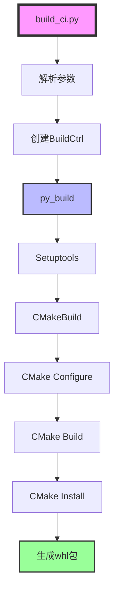

**关键步骤：**

1. **参数解析**：`BuildCtrl` 解析命令行参数，创建参数对象
2. **Python 构建**：`py_build()` 调用 Setuptools 构建 whl 包
3. **CMake 集成**：`CMakeBuild.run()` 执行 CMake Configure、Build、Install
4. **包生成**：生成 `pypto-*.whl` 包到 `build_out/` 目录

**详细说明：** 参考 [Build 系统文档](../02-core/11-build.md#构建流程详解)

#### 3. 安装包

```bash
# 安装生成的 whl 包
pip install build_out/pypto-*.whl

# 或者使用可编辑安装（开发模式）
python3 build_ci.py --editable
```

#### 4. 运行示例

**NPU 模式（需要真实硬件）：**

```bash
cd examples/hello_world
export TILE_FWK_DEVICE_ID=0
python3 hello_world.py --run_mode npu
```

**仿真模式（无需硬件）：**

```bash
cd examples/hello_world
python3 hello_world.py --run_mode sim
```

**运行输出：**

```
============================================================
PyPTO hello_world Example
============================================================

Running Example hello_world::test_add_direct: hello_world
Input0 shape: torch.Size([1, 4, 1, 64])
Input1 shape: torch.Size([1, 4, 1, 64])
Output shape: torch.Size([1, 4, 1, 64])
Max difference: 0.000000
✓ Hello world example passed
```

---

## 示例代码解析

### 代码结构

`hello_world.py` 包含以下关键组件：

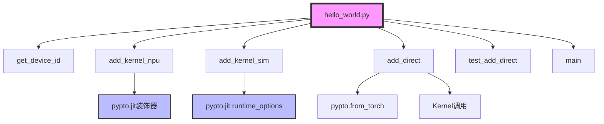

### 核心函数详解

#### 1. add_kernel_npu（NPU 模式内核函数）

**代码位置：** [`examples/hello_world/hello_world.py`](../../../examples/hello_world/hello_world.py#L47)

```python
@pypto.jit
def add_kernel_npu(x: pypto.Tensor, y: pypto.Tensor, z: pypto.Tensor) -> None:
    pypto.set_vec_tile_shapes(1, 4, 1, 64)
    z[:] = x + y
```

**功能概述：** 定义在 NPU 上执行的张量加法内核函数。

**关键概念：**

- **`@pypto.jit` 装饰器**：JIT 编译装饰器
  - **功能**：将 Python 函数编译为 PyPTO IR，进而生成 NPU 可执行代码
  - **实现**：参考 [`python/pypto/frontend/parser/entry.py`](../../../python/pypto/frontend/parser/entry.py#L744) 中的 `jit()` 函数
  - **编译时机**：首次调用时进行编译（延迟编译）
  - **缓存机制**：编译结果会被缓存，后续相同形状的调用直接使用缓存

- **`pypto.set_vec_tile_shapes(1, 4, 1, 64)`**：设置向量计算的 Tile 形状
  - **功能**：配置向量计算在各维度上的切分大小
  - **参数说明**：
    - `1`：第 0 维的 Tile 大小
    - `4`：第 1 维的 Tile 大小
    - `1`：第 2 维的 Tile 大小
    - `64`：第 3 维的 Tile 大小（必须满足 32 字节对齐）
  - **实现**：参考 [`python/pypto/_controller.py`](../../../python/pypto/_controller.py#L56) 中的 `set_vec_tile_shapes()` 函数
  - **底层调用**：`pypto_impl.SetVecTile(*shapes)` → [`TileShape::SetVecTile()`](../../../framework/src/interface/operation/tile_shape.cpp#L26)
  - **用途**：优化数据在 UB（统一缓冲区）上的切分，提高计算效率

- **`z[:] = x + y`**：张量加法操作
  - **功能**：执行逐元素加法，结果写入输出张量
  - **IR 生成**：前端解析器将其转换为 `OP_ADD` 操作
  - **执行**：在 NPU 的向量计算单元上执行

#### 2. add_kernel_sim（仿真模式内核函数）

**代码位置：** [`examples/hello_world/hello_world.py`](../../../examples/hello_world/hello_world.py#L53)

```python
@pypto.jit(runtime_options={"run_mode": 1})
def add_kernel_sim(x: pypto.Tensor, y: pypto.Tensor, z: pypto.Tensor) -> None:
    pypto.set_vec_tile_shapes(1, 4, 1, 64)
    z[:] = x + y
```

**功能概述：** 定义在仿真模式下执行的张量加法内核函数。

**关键概念：**

- **`runtime_options={"run_mode": 1}`**：运行时选项
  - **`run_mode: 1`**：表示仿真模式（`RunMode.SIM`）
  - **`run_mode: 0`**：表示 NPU 模式（`RunMode.NPU`）
  - **用途**：在无 NPU 硬件时，可以在 CPU 上仿真执行

#### 3. add_direct（直接调用函数）

**代码位置：** [`examples/hello_world/hello_world.py`](../../../examples/hello_world/hello_world.py#L59)

```python
def add_direct(x: torch.Tensor, y: torch.Tensor, run_mode: str = "npu") -> torch.Tensor:
    out = torch.empty_like(x)
    pto_input0 = pypto.from_torch(x)
    pto_input1 = pypto.from_torch(y)
    pto_output = pypto.from_torch(out)

    # launch the kernel
    if run_mode == "npu":
        add_kernel_npu(pto_input0, pto_input1, pto_output)
    else:
        add_kernel_sim(pto_input0, pto_input1, pto_output)
    return out
```

**功能概述：** 将 PyTorch 张量转换为 PyPTO 张量，调用内核函数执行计算。

**关键概念：**

- **`pypto.from_torch()`**：PyTorch 张量转换
  - **功能**：将 PyTorch 张量转换为 PyPTO 张量
  - **实现**：参考 [`python/pypto/converter.py`](../../../python/pypto/converter.py#L35) 中的 `from_torch()` 函数
  - **转换内容**：
    - **形状**：`tensor.shape` → `Tensor.shape`
    - **数据类型**：`tensor.dtype` → `Tensor.dtype`（通过 `_dtype_from()` 转换）
    - **数据指针**：`tensor.data_ptr()` → `Tensor.data_ptr`
    - **格式**：根据 NPU 格式（如 `TILEOP_NZ`）设置 `Tensor.format`
    - **设备**：`tensor.device` → `Tensor.device`
  - **关键约束**：输入张量必须是连续的（`tensor.is_contiguous()`）

- **内核函数调用**：`add_kernel_npu(pto_input0, pto_input1, pto_output)`
  - **首次调用**：触发 JIT 编译流程
  - **后续调用**：直接使用缓存的编译结果执行

#### 4. test_add_direct（测试函数）

**代码位置：** [`examples/hello_world/hello_world.py`](../../../examples/hello_world/hello_world.py#L73)

```python
def test_add_direct(device_id = None, run_mode: str = "npu") -> None:
    device = f'npu:{device_id}' if (run_mode == "npu" and device_id is not None) else 'cpu'
    shape = (1, 4, 1, 64)
    #prepare data
    input_data0 = torch.rand(shape, dtype=torch.float, device=device)
    input_data1 = torch.rand(shape, dtype=torch.float, device=device)
    output_data = add_direct(input_data0, input_data1, run_mode)
    golden = torch.add(input_data0, input_data1)

    max_diff = np.abs(output_data.cpu().numpy() - golden.cpu().numpy()).max()
    print(f"Input0 shape: {input_data0.shape}")
    print(f"Input1 shape: {input_data1.shape}")
    print(f"Output shape: {output_data.shape}")
    
    if run_mode == "npu":
        print(f"Max difference: {max_diff:.6f}")
        assert_allclose(np.array(output_data.cpu()), np.array(golden.cpu()), rtol=3e-3, atol=3e-3)
    print("✓ Hello world example passed")
```

**功能概述：** 测试函数，准备输入数据，调用 `add_direct()` 执行计算，并与 PyTorch 的参考结果对比。

**关键步骤：**

1. **数据准备**：创建随机输入张量
2. **执行计算**：调用 `add_direct()` 执行 PyPTO 计算
3. **参考对比**：使用 PyTorch 的 `torch.add()` 生成参考结果
4. **结果验证**：对比输出和参考结果，检查误差

---

## 完整执行流程

### 整体执行流程图

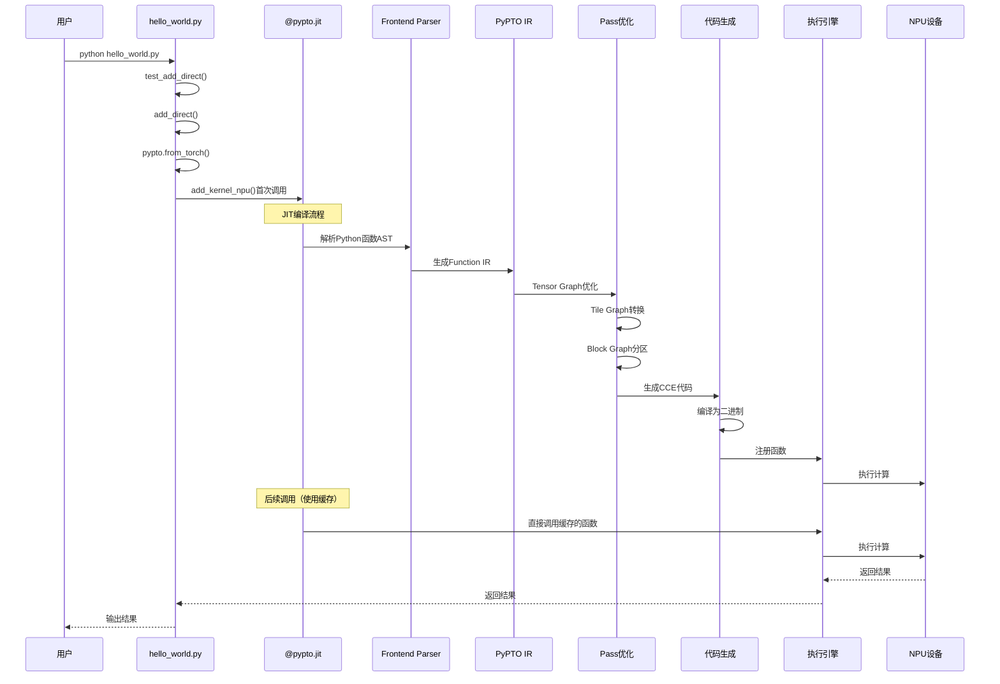

### 详细执行步骤

#### 阶段 1：Python 前端解析

**入口：** `@pypto.jit` 装饰器

**文件位置：** [`python/pypto/frontend/parser/entry.py`](../../../python/pypto/frontend/parser/entry.py#L744)

**执行流程：**

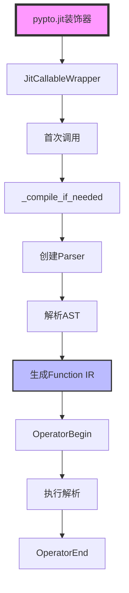

**关键函数：**

- **`jit()`**：JIT 装饰器函数
  - **功能**：创建 `JitCallableWrapper` 包装原始函数
  - **实现**：参考 [`python/pypto/frontend/parser/entry.py`](../../../python/pypto/frontend/parser/entry.py#L744)
  - **关键概念**：
    - **延迟编译**：装饰时不编译，首次调用时才编译
    - **配置选项**：支持 `codegen_options`、`pass_options`、`runtime_options` 等
    - **函数包装**：保持原始函数的元数据（`__name__`、`__doc__`）

- **`JitCallableWrapper.__call__()`**：函数调用入口
  - **功能**：处理函数调用，触发编译或执行
  - **实现**：参考 [`python/pypto/frontend/parser/entry.py`](../../../python/pypto/frontend/parser/entry.py#L216)
  - **关键步骤**：
    1. **张量转换**：将 PyTorch 张量转换为 PyPTO 张量（`from_torch()`）
    2. **输出张量创建**：根据函数签名创建输出张量
    3. **编译检查**：检查是否已编译，未编译则触发编译
    4. **执行分发**：根据运行模式分发执行（`_dispatch_with_run_mode()`）
  - **缓存机制**：相同形状的输入使用缓存的编译结果

- **`JitCallableWrapper._compile_if_needed()`**：延迟编译
  - **功能**：在首次调用时编译函数
  - **实现**：参考 [`python/pypto/frontend/parser/entry.py`](../../../python/pypto/frontend/parser/entry.py#L485)
  - **关键步骤详解**：
    1. **创建 Parser**：`self._parser = self._create_parser()`
       - **功能**：创建解析器实例，用于解析函数 AST
       - **Parser 初始化**：提取函数的 AST、闭包变量、全局变量等
    2. **解析 AST**：`self._parser.parse()`
       - **功能**：将 Python 函数 AST 转换为 doc AST
       - **转换内容**：函数体、参数、返回值等
    3. **初始化后端**：
       - **`pypto_impl.DeviceInit()`**：初始化设备环境
         - **功能**：初始化 NPU 设备或仿真环境
         - **实现位置**：C++ 后端实现
       - **`pypto_impl.OperatorBegin()`**：开始操作编译
         - **功能**：创建编译上下文，开始一个新的编译单元
         - **返回值**：`handler`（编译句柄，用于后续操作）
         - **实现位置**：C++ 后端实现
         - **关键作用**：触发 `Program::BeginFunction()`，创建 `Function` 对象
    4. **应用配置选项**：`self._set_config_option()`
       - **功能**：应用代码生成、Pass、运行时等配置选项
       - **时机**：在 `OperatorBegin()` 之后，确保配置在正确的上下文中生效
    5. **绑定动态维度**：`self._parser.bind_dynamic_dims_from_inputs(concrete_input_shapes)`
       - **功能**：将符号维度绑定到具体的输入形状
       - **示例**：`SymbolicScalar("N")` → 实际值 `64`
    6. **执行解析**：`self._pto_function = self._parser.execute()`
       - **功能**：执行解析，生成 `Function` IR 对象
       - **过程**：
         - 遍历 doc AST 节点
         - 调用相应的访问器方法
         - 构建 `Operation` 和 `LogicalTensor` 对象
         - 添加到 `Function` 中
    7. **完成编译**：`pypto_impl.OperatorEnd(handler)`
       - **功能**：结束操作编译，触发代码生成
       - **实现位置**：C++ 后端实现
       - **关键作用**：
         - 调用 `Program::EndFunction()`，完成函数构建
         - 触发 Pass 优化流程
         - 触发代码生成流程
         - 编译 CCE 代码为二进制
         - 注册函数到运行时

**生成的 IR 结构：**

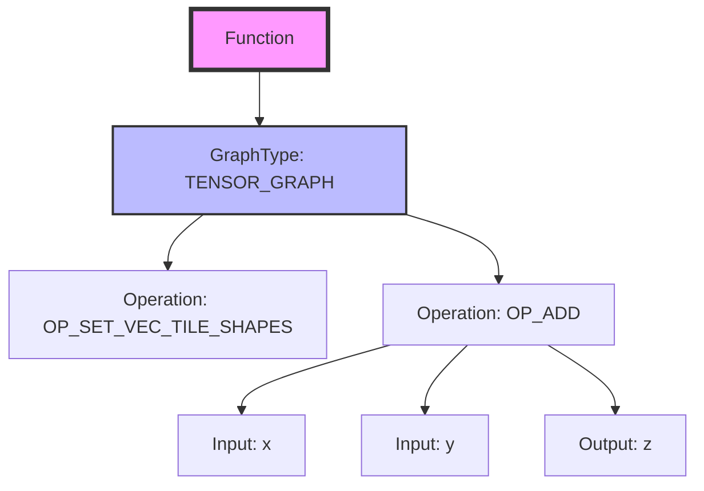

#### 阶段 2：Pass 优化

**入口：** `OperatorBegin()` 后的 Pass 执行

**文件位置：** [`framework/src/passes/pass_mgr/pass_manager.cpp`](../../../framework/src/passes/pass_mgr/pass_manager.cpp)

**执行流程：**

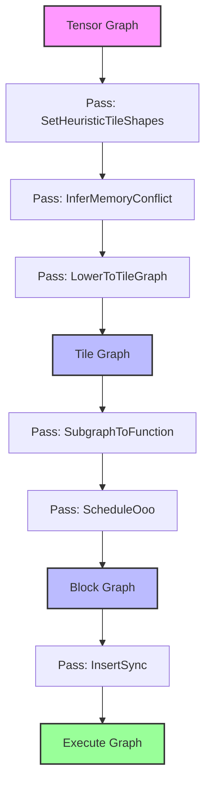

**关键 Pass：**

- **`SetHeuristicTileShapes`**：设置启发式 Tile 形状
  - **功能**：根据硬件特性和数据形状，自动设置最优的 Tile 形状
  - **说明**：如果用户已通过 `set_vec_tile_shapes()` 设置，则使用用户设置

- **`InferMemoryConflict`**：推断内存冲突
  - **功能**：分析张量的生命周期，识别内存冲突，插入必要的拷贝操作
  - **参考**：[Passes 模块文档](../02-core/09-passes.md#infermemoryconflict-pass)

- **`LowerToTileGraph`**：Lowering 到 Tile Graph
  - **功能**：将 Tensor Graph 转换为硬件感知的 Tile Graph
  - **说明**：`z[:] = x + y` 被转换为具体的 Tile 操作序列

- **`SubgraphToFunction`**：子图转函数
  - **功能**：将子图转换为可调用的函数，支持模块化和缓存
  - **参考**：[Passes 模块文档](../02-core/09-passes.md#subgraphtofunction-pass)

- **`InsertSync`**：插入同步
  - **功能**：在数据依赖处插入同步操作（`SetFlag`、`WaitFlag`）
  - **参考**：[Passes 模块文档](../02-core/09-passes.md#insertsync-pass)

**详细说明：** 参考 [Passes 模块文档](../02-core/09-passes.md)

#### 阶段 3：代码生成

**入口：** `OperatorEnd()` 触发代码生成

**文件位置：** [`framework/src/codegen/cloudnpu/codegen_cloudnpu.cpp`](../../../framework/src/codegen/cloudnpu/codegen_cloudnpu.cpp)

**执行流程：**

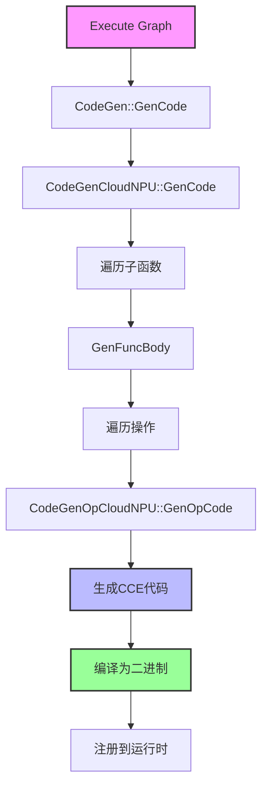

**关键函数：**

- **`CodeGen::GenCode()`**：代码生成入口
  - **功能**：生成 CCE 代码并编译
  - **实现**：参考 [`framework/src/codegen/codegen.cpp`](../../../framework/src/codegen/codegen.cpp)

- **`CodeGenCloudNPU::GenFuncBody()`**：生成函数体
  - **功能**：为每个子函数生成 CCE 代码
  - **实现**：参考 [`framework/src/codegen/cloudnpu/codegen_cloudnpu.cpp`](../../../framework/src/codegen/cloudnpu/codegen_cloudnpu.cpp#L125)
  - **关键步骤**：
    1. 创建 `SymbolManager` 管理符号
    2. 生成参数映射表（`GenRealizeIdMap()`）
    3. 遍历操作，生成代码：
       - 生成局部缓冲区分配代码（`GenAllocForLocalBuffer()`）
       - 生成操作代码（`CodeGenOpCloudNPU::GenOpCode()`）
    4. 组合代码（浮点饱和限制、动态参数表达式、Using 列表、TileTensor 定义、缓冲区分配、操作代码）

- **`CodeGenOpCloudNPU::GenOpCode()`**：生成操作代码
  - **功能**：为每个操作生成 CCE 代码
  - **实现**：参考 [`framework/src/codegen/cloudnpu/codegen_op_cloudnpu.cpp`](../../../framework/src/codegen/cloudnpu/codegen_op_cloudnpu.cpp)
  - **示例**：`OP_ADD` 操作生成 `aicore::Add(ubTile_0, ubTile_1, ubTile_2);`

**生成的 CCE 代码示例：**

```cpp
// 函数声明
extern "C" [aicore] void func_abc123_0_aic(
    __gm__ GMTensorInfo* param, int64_t GMStackBase, 
    __gm__ int64_t *hcclContext, __gm__ GMTensorInfo* oriAddrParam) {
    
    // 局部缓冲区分配
    float __ubuf__ *UB_S0_E16384 = (float __ubuf__ *)get_imm(0x0);
    
    // TileTensor 定义
    UBTileTensorFP32Dim4 ubTile_0((uint64_t)UB_S0_E16384, Shape4Dim(1, 4, 1, 64));
    UBTileTensorFP32Dim4 ubTile_1((uint64_t)UB_S0_E4096, Shape4Dim(1, 4, 1, 64));
    UBTileTensorFP32Dim4 ubTile_2((uint64_t)UB_S0_E8192, Shape4Dim(1, 4, 1, 64));
    
    // 操作代码
    aicore::CopyIn(ubTile_0, param, 0);  // 从 DDR 拷贝输入 x
    aicore::CopyIn(ubTile_1, param, 1);  // 从 DDR 拷贝输入 y
    aicore::Add(ubTile_0, ubTile_1, ubTile_2);  // 执行加法
    aicore::CopyOut(ubTile_2, param, 2);  // 拷贝输出 z 到 DDR
}
```

**详细说明：** 参考 [Codegen 模块文档](../02-core/10-codegen.md)

#### 阶段 4：设备执行

**入口：** `_dispatch_with_run_mode()` 或 `_run()`

**文件位置：** [`python/pypto/frontend/parser/entry.py`](../../../python/pypto/frontend/parser/entry.py#L534)

**执行流程：**

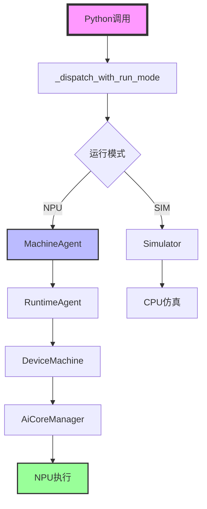

**关键函数：**

- **`_dispatch_with_run_mode()`**：根据运行模式分发执行
  - **功能**：根据 `run_mode` 选择 NPU 执行或仿真执行
  - **实现**：参考 [`python/pypto/frontend/parser/entry.py`](../../../python/pypto/frontend/parser/entry.py#L534)

- **`_run()`**：执行函数
  - **功能**：调用后端运行时执行函数
  - **实现**：参考 [`python/pypto/frontend/parser/entry.py`](../../../python/pypto/frontend/parser/entry.py#L534)
  - **关键步骤详解**：
    1. **查询工作空间大小**：`pypto_impl.GetWorkSpaceSize(handler, in_tensor_data, out_tensor_data)`
       - **功能**：查询函数执行所需的工作空间大小
       - **用途**：为临时缓冲区分配内存
    2. **分配工作空间**：`torch.empty(workspace_size, dtype=torch.uint8, device=device)`
       - **功能**：在设备上分配工作空间内存
       - **类型**：`uint8`（字节数组）
    3. **执行函数**：`pypto_impl.OperatorDeviceRunOnceDataFromDevice(handler, ...)`
       - **功能**：在设备上执行编译后的函数
       - **参数**：
         - `handler`：编译句柄
         - `in_tensor_data + out_tensor_data`：输入和输出张量数据
         - `stream`：CUDA/NPU 流
         - `workspace_ptr`：工作空间指针
       - **实现**：调用 `MachineAgent::AgentProc()` 执行任务
    4. **错误检查**：检查运行时错误消息
       - **功能**：如果执行失败，抛出 `RuntimeError`

**设备端执行流程：**

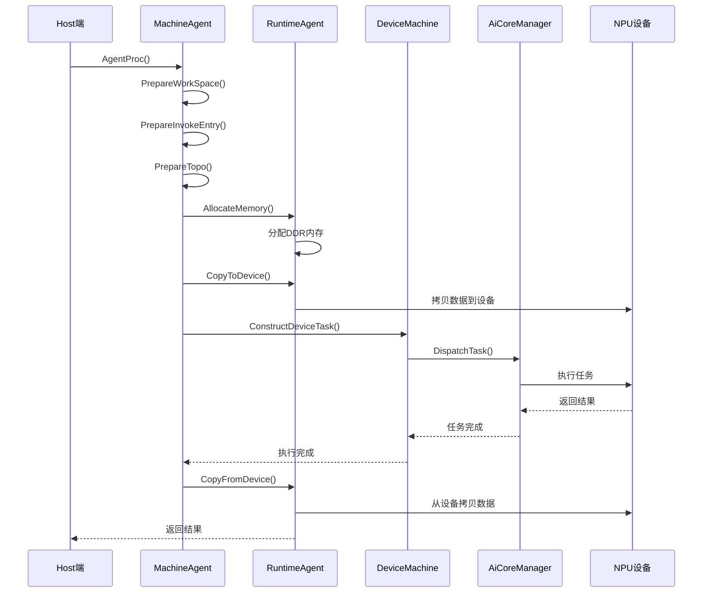

**详细说明：** 参考 [Machine 模块文档](../02-core/08-machine.md)

### OperatorBegin/OperatorEnd 详解

**定义位置：** C++ 后端实现（通过 pybind11 绑定到 Python）

**功能概述：** `OperatorBegin()` 和 `OperatorEnd()` 是编译流程的关键控制点，管理编译上下文和触发代码生成。

**执行时机：**

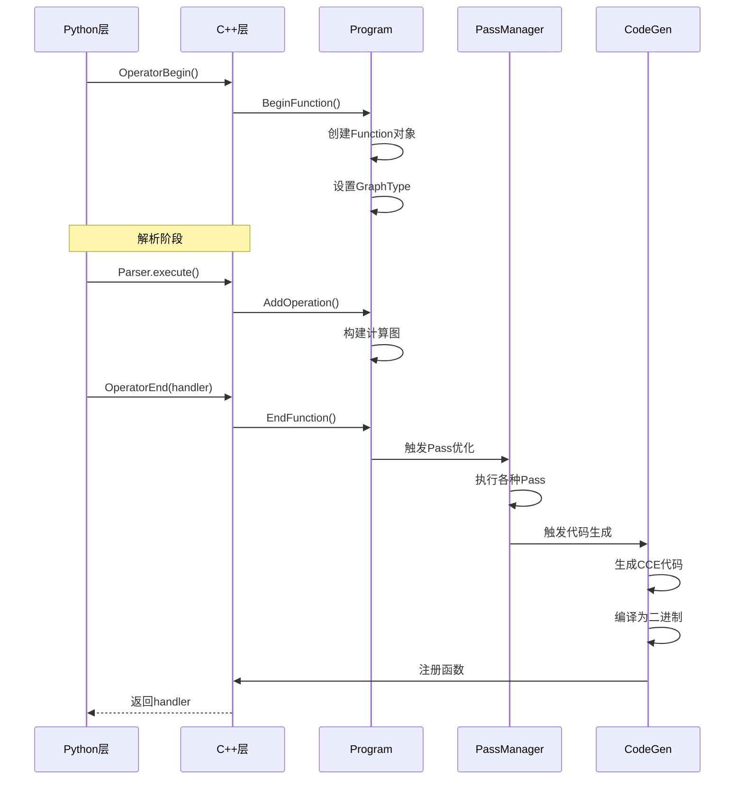

**OperatorBegin() 详解：**

- **功能**：开始一个新的编译单元
- **实现**：调用 `Program::BeginFunction()`
- **关键操作**：
  1. **创建 Function 对象**：根据函数名、类型、图类型创建 `Function` 实例
  2. **设置 GraphType**：初始为 `TENSOR_GRAPH`
  3. **初始化 TensorSlotManager**：开始新的作用域
  4. **设置参数配置**：应用函数的参数配置

**OperatorEnd() 详解：**

- **功能**：结束编译单元，触发优化和代码生成
- **实现**：调用 `Program::EndFunction()`
- **关键操作**：
  1. **完成函数构建**：
     - 调用 `Function::EndFunction()` 完成函数构建
     - 计算函数哈希值（`Function::ComputeHash()`）
     - 查询函数缓存（`QueryAndUpdateCurrentFunction()`）
  2. **触发 Pass 优化**：
     - 如果函数未命中缓存，触发 Pass 优化流程
     - 执行 Tensor Graph Pass → Tile Graph Pass → Block Graph Pass
  3. **触发代码生成**：
     - 调用 `CodeGen::GenCode()` 生成 CCE 代码
     - 编译 CCE 代码为二进制
     - 注册函数到运行时
  4. **任务提交**：如果启用，提交任务到设备执行

**关键概念：**

- **`handler`**：编译句柄
  - **类型**：`int`（C++ 后端返回的句柄）
  - **用途**：标识编译后的函数，用于后续执行
  - **生命周期**：从 `OperatorBegin()` 创建，到 `OperatorEnd()` 完成

- **函数缓存**：`QueryAndUpdateCurrentFunction()`
  - **功能**：查询函数缓存，如果已存在相同哈希的函数，直接使用
  - **缓存键**：函数哈希值
  - **优势**：避免重复编译，提高性能

---

## 模块接口调用链

### 完整调用链

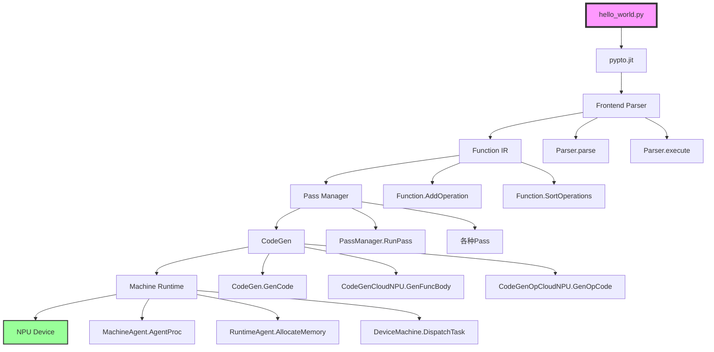

### 各模块接口详解

#### 1. Frontend Parser 模块

**模块位置：** [`python/pypto/frontend/parser`](../../../python/pypto/frontend/parser)

**关键接口：**

- **`jit()`**：JIT 装饰器
  - **文件**：[`entry.py`](../../../python/pypto/frontend/parser/entry.py#L744)
  - **功能**：创建 `JitCallableWrapper`，包装原始函数

- **`JitCallableWrapper.__call__()`**：函数调用入口
  - **文件**：[`entry.py`](../../../python/pypto/frontend/parser/entry.py#L216)
  - **功能**：处理函数调用，触发编译或执行

- **`Parser.parse()`**：解析函数 AST
  - **文件**：[`parser.py`](../../../python/pypto/frontend/parser/parser.py)
  - **功能**：将 Python 函数 AST 转换为 PyPTO IR

- **`Parser.execute()`**：执行解析
  - **文件**：[`parser.py`](../../../python/pypto/frontend/parser/parser.py)
  - **功能**：生成 `Function` 对象

#### 2. Interface 模块

**模块位置：** [`framework/src/interface`](../../../framework/src/interface)

**关键接口：**

- **`Function::AddOperation()`**：添加操作
  - **文件**：[`function.cpp`](../../../framework/src/interface/function/function.cpp#L530)
  - **功能**：向函数中添加操作，构建计算图

- **`Function::SortOperations()`**：排序操作
  - **文件**：[`function.cpp`](../../../framework/src/interface/function/function.cpp#L2700)
  - **功能**：对操作进行拓扑排序，确定执行顺序

- **`Function::ComputeHash()`**：计算哈希
  - **文件**：[`function.cpp`](../../../framework/src/interface/function/function.cpp#L3409)
  - **功能**：计算函数的哈希值，用于去重和缓存

- **`LogicalTensor`**：逻辑张量
  - **文件**：[`tensor/logical_tensor.h`](../../../framework/src/interface/tensor/logical_tensor.h)
  - **功能**：表示函数中的张量视图

**详细说明：** 参考 [Interface 模块文档](../02-core/04-interface.md) 和 [Function 类文档](../02-core/05-function.md)

#### 3. Passes 模块

**模块位置：** [`framework/src/passes`](../../../framework/src/passes)

**关键接口：**

- **`PassManager::RunPass()`**：执行 Pass
  - **文件**：[`pass_mgr/pass_manager.cpp`](../../../framework/src/passes/pass_mgr/pass_manager.cpp)
  - **功能**：按照策略执行优化 Pass

- **`Pass::RunOnFunction()`**：在函数上运行 Pass
  - **文件**：[`pass_interface/pass.h`](../../../framework/src/passes/pass_interface/pass.h)
  - **功能**：Pass 的抽象接口，子类实现具体的优化逻辑

**详细说明：** 参考 [Passes 模块文档](../02-core/09-passes.md)

#### 4. Codegen 模块

**模块位置：** [`framework/src/codegen`](../../../framework/src/codegen)

**关键接口：**

- **`CodeGen::GenCode()`**：代码生成入口
  - **文件**：[`codegen.cpp`](../../../framework/src/codegen/codegen.cpp)
  - **功能**：生成 CCE 代码并编译

- **`CodeGenCloudNPU::GenFuncBody()`**：生成函数体
  - **文件**：[`cloudnpu/codegen_cloudnpu.cpp`](../../../framework/src/codegen/cloudnpu/codegen_cloudnpu.cpp#L125)
  - **功能**：为函数生成 CCE 代码

- **`CodeGenOpCloudNPU::GenOpCode()`**：生成操作代码
  - **文件**：[`cloudnpu/codegen_op_cloudnpu.cpp`](../../../framework/src/codegen/cloudnpu/codegen_op_cloudnpu.cpp)
  - **功能**：为操作生成 CCE 代码

**详细说明：** 参考 [Codegen 模块文档](../02-core/10-codegen.md)

#### 5. Machine 模块

**模块位置：** [`framework/src/machine`](../../../framework/src/machine)

**关键接口：**

- **`MachineAgent::AgentProc()`**：Agent 处理
  - **文件**：[`runtime/machine_agent.cpp`](../../../framework/src/machine/runtime/machine_agent.cpp)
  - **功能**：准备设备任务，协调执行流程

- **`RuntimeAgent::AllocateMemory()`**：分配内存
  - **文件**：[`runtime/runtime.h`](../../../framework/src/machine/runtime/runtime.h)
  - **功能**：分配设备内存（DDR、Huge Pages 等）

- **`DeviceMachine::DispatchTask()`**：分发任务
  - **文件**：[`device/device_machine.h`](../../../framework/src/machine/device/device_machine.h)
  - **功能**：将任务分发到 AI Core 执行

**详细说明：** 参考 [Machine 模块文档](../02-core/08-machine.md)

---

## Python 与 C++ 混合调试

### 调试架构

PyPTO 采用 Python + C++ 混合架构，调试需要同时关注两个层面：

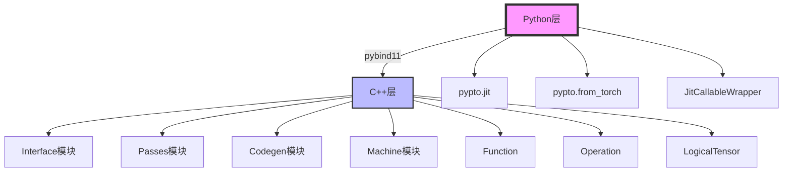

### Python 层调试

**调试工具：**

1. **Python Debugger（pdb）**
   ```python
   import pdb
   pdb.set_trace()  # 设置断点
   ```

2. **IPython Debugger（ipdb）**
   ```python
   import ipdb
   ipdb.set_trace()  # 设置断点
   ```

3. **VS Code Python Debugger**
   - 配置 `.vscode/launch.json`
   - 设置断点，启动调试

**关键调试点：**

- **`JitCallableWrapper.__call__()`**：函数调用入口
  - **位置**：[`python/pypto/frontend/parser/entry.py`](../../../python/pypto/frontend/parser/entry.py#L216)
  - **调试内容**：检查输入张量、编译状态、执行结果

- **`JitCallableWrapper._compile_if_needed()`**：编译流程
  - **位置**：[`python/pypto/frontend/parser/entry.py`](../../../python/pypto/frontend/parser/entry.py#L485)
  - **调试内容**：检查 Parser 创建、AST 解析、IR 生成

- **`from_torch()`**：张量转换
  - **位置**：[`python/pypto/converter.py`](../../../python/pypto/converter.py#L35)
  - **调试内容**：检查张量属性转换、数据指针

### C++ 层调试

**调试工具：**

1. **GDB**
   ```bash
   gdb python
   (gdb) break Function::AddOperation
   (gdb) run hello_world.py
   ```

2. **LLDB**
   ```bash
   lldb python
   (lldb) breakpoint set --name Function::AddOperation
   (lldb) run hello_world.py
   ```

3. **VS Code C++ Debugger**
   - 配置 `.vscode/launch.json`
   - 附加到 Python 进程
   - 设置 C++ 断点

**关键调试点：**

- **`Function::AddOperation()`**：添加操作
  - **位置**：[`framework/src/interface/function/function.cpp`](../../../framework/src/interface/function/function.cpp#L530)
  - **调试内容**：检查操作添加、张量连接、依赖关系

- **`PassManager::RunPass()`**：Pass 执行
  - **位置**：[`framework/src/passes/pass_mgr/pass_manager.cpp`](../../../framework/src/passes/pass_mgr/pass_manager.cpp)
  - **调试内容**：检查 Pass 执行顺序、IR 转换结果

- **`CodeGenCloudNPU::GenFuncBody()`**：代码生成
  - **位置**：[`framework/src/codegen/cloudnpu/codegen_cloudnpu.cpp`](../../../framework/src/codegen/cloudnpu/codegen_cloudnpu.cpp#L125)
  - **调试内容**：检查生成的 CCE 代码、符号管理

- **`MachineAgent::AgentProc()`**：设备执行
  - **位置**：[`framework/src/machine/runtime/machine_agent.cpp`](../../../framework/src/machine/runtime/machine_agent.cpp)
  - **调试内容**：检查任务准备、内存分配、设备调度

### 混合调试技巧

**1. 日志调试**

```python
# Python 层日志
import logging
logging.basicConfig(level=logging.DEBUG)

# C++ 层日志（通过环境变量）
export ALOG_LEVEL=DEBUG
```

**2. 断点调试**

```python
# Python 断点
import pdb; pdb.set_trace()

# C++ 断点（在代码中）
ASSERT(false) << "Debug breakpoint";
```

**3. 打印调试**

```python
# Python 打印
print(f"Tensor shape: {tensor.shape}")

# C++ 打印
ALOG_INFO_F("Tensor shape: %s", tensor->GetShape().Dump().c_str());
```

**4. 可视化调试**

- **计算图可视化**：使用 PyPTO ToolKit 插件查看计算图
- **泳道图可视化**：查看执行时间线
- **IR 转储**：使用 `Function::DumpJson()` 导出 IR

---

## 框架实现原理串联

### 整体架构串联

通过 `hello_world.py` 示例，我们可以串联起 PyPTO 的整个框架实现：

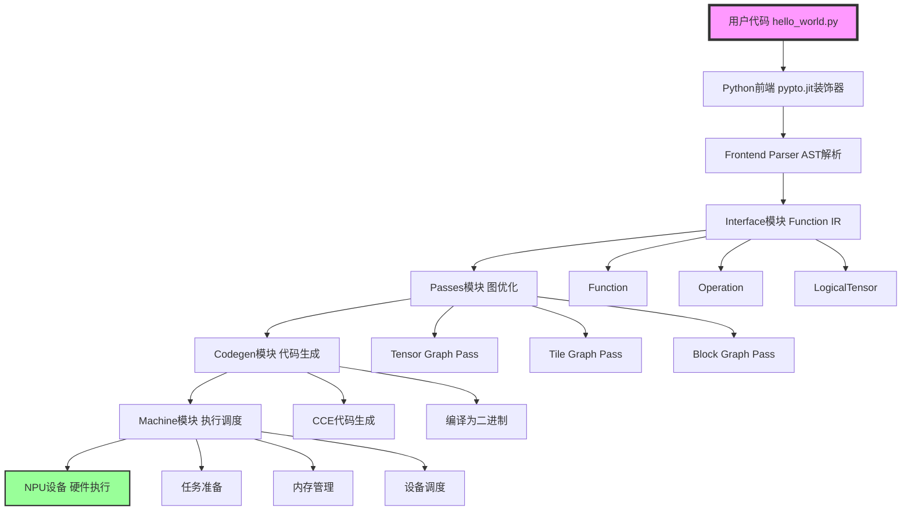

### 数据流转换

**从 Python 代码到硬件执行的完整数据流：**

```mermaid
graph LR
    A[Python函数 add_kernel_npu] --> B[AST解析]
    B --> C[Function IR TENSOR_GRAPH]
    C --> D[Pass优化 TILE_GRAPH]
    D --> E[Pass优化 BLOCK_GRAPH]
    E --> F[代码生成 CCE代码]
    F --> G[编译 二进制]
    G --> H[设备执行 NPU]
    
    style A fill:#f9f,stroke:#333,stroke-width:2px
    style C fill:#bbf,stroke:#333,stroke-width:2px
    style D fill:#bbf,stroke:#333,stroke-width:2px
    style E fill:#bbf,stroke:#333,stroke-width:2px
    style F fill:#bbf,stroke:#333,stroke-width:2px
    style H fill:#9f9,stroke:#333,stroke-width:2px
```

### 关键转换点

#### 1. Python → IR（前端解析）

**转换内容：**
- `z[:] = x + y` → `OP_ADD` 操作
- `pypto.set_vec_tile_shapes(1, 4, 1, 64)` → `OP_SET_VEC_TILE_SHAPES` 操作
- 函数参数 → `Incast` 和 `Outcast`

**实现位置：**
- [`python/pypto/frontend/parser/parser.py`](../../../python/pypto/frontend/parser/parser.py)

#### 2. Tensor Graph → Tile Graph（Lowering）

**转换内容：**
- Tensor 操作 → Tile 操作序列
- 内存布局优化
- 数据搬运操作插入

**实现位置：**
- [`framework/src/passes/tile_graph_pass/`](../../../framework/src/passes/tile_graph_pass/)

#### 3. Tile Graph → Block Graph（分区）

**转换内容：**
- 子图分区
- 函数提取
- 并行执行支持

**实现位置：**
- [`framework/src/passes/block_graph_pass/`](../../../framework/src/passes/block_graph_pass/)

#### 4. Block Graph → CCE Code（代码生成）

**转换内容：**
- IR 操作 → CCE 操作代码
- 符号管理
- 参数映射

**实现位置：**
- [`framework/src/codegen/cloudnpu/`](../../../framework/src/codegen/cloudnpu/)

#### 5. CCE Code → Binary（编译）

**转换内容：**
- CCE 代码 → 二进制文件
- 函数注册

**实现位置：**
- [`framework/src/codegen/cloudnpu/codegen_cloudnpu.cpp`](../../../framework/src/codegen/cloudnpu/codegen_cloudnpu.cpp#L335)

#### 6. Binary → Execution（执行）

**转换内容：**
- 二进制加载
- 任务调度
- 设备执行

**实现位置：**
- [`framework/src/machine/`](../../../framework/src/machine/)

---

## 关键概念详解

### JIT 编译

**定义：** Just-In-Time 编译，在运行时将 Python 函数编译为可执行代码。

**PyPTO 中的 JIT：**

- **延迟编译**：首次调用时编译，后续调用使用缓存
- **形状缓存**：相同形状的输入使用缓存的编译结果
- **动态形状支持**：支持动态形状的函数编译

**实现原理：**

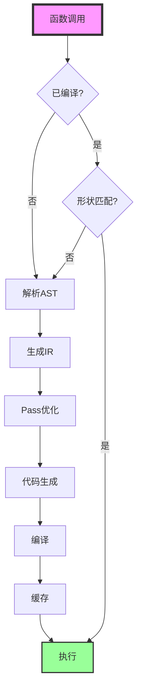

**关键函数：**
- **`JitCallableWrapper._compile_if_needed()`**：延迟编译实现
- **`JitCallableWrapper._hit_cache()`**：缓存命中检查

### Tensor 转换

**定义：** 将 PyTorch 张量转换为 PyPTO 张量。

**转换内容：**

| PyTorch 属性 | PyPTO 属性 | 转换函数 |
|-------------|-----------|---------|
| `tensor.shape` | `Tensor.shape` | 直接映射 |
| `tensor.dtype` | `Tensor.dtype` | `_dtype_from()` |
| `tensor.data_ptr()` | `Tensor.data_ptr` | 直接映射 |
| `tensor.device` | `Tensor.device` | 直接映射 |
| NPU Format | `Tensor.format` | `torch_npu.get_npu_format()` |

**关键函数：**
- **`from_torch()`**：转换函数
- **`_dtype_from()`**：数据类型转换

### Tile 形状配置

**定义：** Tile 形状定义了数据在硬件不同计算单元中的切分方式。

**`set_vec_tile_shapes(1, 4, 1, 64)` 的含义：**

- **维度 0（1）**：第 0 维的 Tile 大小为 1
- **维度 1（4）**：第 1 维的 Tile 大小为 4
- **维度 2（1）**：第 2 维的 Tile 大小为 1
- **维度 3（64）**：第 3 维的 Tile 大小为 64（满足 32 字节对齐：64 * 4 = 256 字节）

**约束条件：**
- 每个维度必须大于 0
- 最后一维需要按照输入的数据类型满足 32 字节对齐

**实现位置：**
- **Python 接口**：[`python/pypto/_controller.py`](../../../python/pypto/_controller.py#L56)
- **C++ 实现**：[`framework/src/interface/operation/tile_shape.cpp`](../../../framework/src/interface/operation/tile_shape.cpp#L26)

### 函数缓存

**定义：** 编译后的函数会被缓存，避免重复编译。

**缓存键：**
- 函数哈希值（`Function::ComputeHash()`）
- 输入形状
- 编译选项

**缓存位置：**
- **内存缓存**：`FunctionCache`
- **磁盘缓存**：编译后的二进制文件

**关键函数：**
- **`Function::ComputeHash()`**：计算函数哈希
- **`FunctionCache::Get()`**：获取缓存的函数

---

## 最佳实践

### 开发调试

**推荐做法：**

1. **使用可编辑安装**：`python3 build_ci.py --editable`
   - Python 代码修改即时生效
   - C++ 代码修改后需要重新编译

2. **启用调试日志**：
   ```bash
   export ALOG_LEVEL=DEBUG
   ```

3. **使用仿真模式**：无硬件时使用 `--run_mode sim`

4. **可视化调试**：使用 PyPTO ToolKit 查看计算图和泳道图

### 性能优化

**推荐做法：**

1. **合理设置 Tile 形状**：根据数据形状和硬件特性设置
2. **避免频繁编译**：使用相同形状的输入，利用缓存
3. **批量执行**：将多个操作组合到一个函数中

### 错误排查

**常见问题：**

1. **编译失败**：检查 CMake 配置和依赖
2. **执行失败**：检查设备状态和内存
3. **结果不正确**：检查 Tile 形状配置和数据对齐

---

## 相关文档

- [Function 类详细文档](../02-core/05-function.md)
- [Framework 模块文档](../02-core/03-framework.md)
- [Interface 模块文档](../02-core/04-interface.md)
- [Passes 模块文档](../02-core/09-passes.md)
- [Codegen 模块文档](../02-core/10-codegen.md)
- [Machine 模块文档](../02-core/08-machine.md)
- [Build 系统文档](../02-core/11-build.md)

---

## 总结

通过 `hello_world.py` 这个简单的示例，我们深入解析了 PyPTO 框架的完整实现链路：

1. **前端解析**：Python 函数通过 `@pypto.jit` 装饰器编译为 PyPTO IR
2. **Pass 优化**：IR 经过多层级 Pass 优化，从 Tensor Graph 转换为 Execute Graph
3. **代码生成**：优化后的 IR 生成 CCE 代码并编译为二进制
4. **设备执行**：二进制代码在 NPU 设备上执行，完成计算

整个流程体现了 PyPTO 框架的分层设计、模块化架构和高效的编译执行机制，为高性能 AI 算子开发提供了强大的支持。

