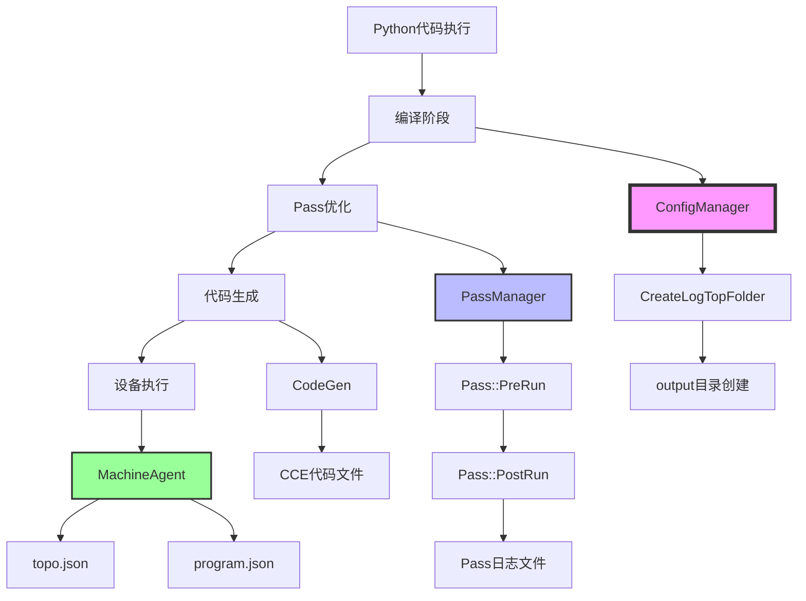
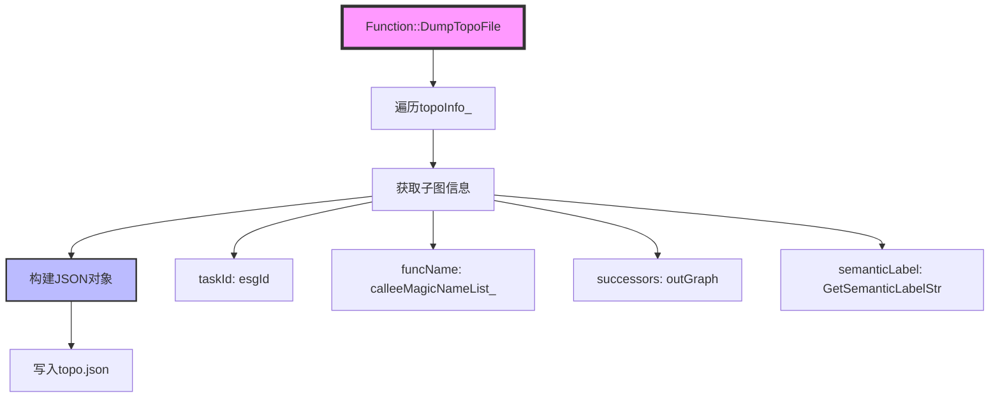
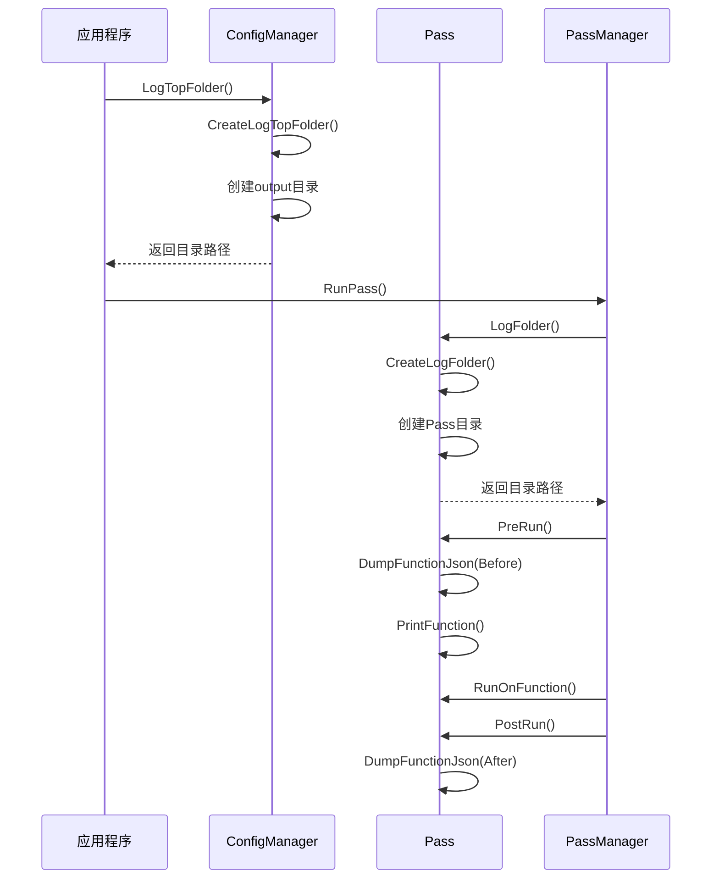

# Hello World 调试文件详解

> **适用对象：** 已运行过Hello World示例的开发者  
> **学习时间：** 25-35分钟  
> **前置知识：** 已阅读[Hello World示例](00-hello-world.md)  
> **学习目标：** 理解PyPTO生成的调试文件、学会通过调试文件分析问题

## 概述

PyPTO 在编译和执行过程中会生成大量的调试文件，这些文件记录了从 Python 代码到 NPU 执行的完整链路信息。通过分析这些文件，开发者可以深入了解编译优化过程、IR 转换细节、Pass 执行结果、代码生成产物以及设备执行拓扑等信息，是调试和性能分析的重要工具。

**学习价值：**
- 🔍 **问题诊断**：通过调试文件快速定位问题
- 📊 **性能分析**：理解Pass优化效果
- 💡 **深入理解**：观察IR转换的完整过程
- 🛠️ **调试技巧**：掌握调试文件的使用方法

**调试文件位置：**
- **默认路径**：`output/output_<timestamp>_<pid>/`
- **自定义路径**：通过环境变量 `TILE_FWK_OUTPUT_DIR` 指定
- **示例路径（运行后生成）**：`examples/hello_world/output/`

**相关文档：**
- [Hello World 示例解析](00-hello-world.md)
- [Passes 模块文档](../02-core/09-passes.md)
- [Function 类详细文档](../02-core/05-function.md)
- [Framework 模块文档](../02-core/03-framework.md)

---

## 目录

- [调试文件架构](#调试文件架构)
- [目录结构](#目录结构)
- [核心文件详解](#核心文件详解)
- [Pass 调试文件](#pass-调试文件)
- [代码生成文件](#代码生成文件)
- [执行拓扑文件](#执行拓扑文件)
- [文件生成机制](#文件生成机制)
- [调试场景应用](#调试场景应用)
- [可视化工具](#可视化工具)
- [最佳实践](#最佳实践)

---

## 调试文件架构

### 文件生成流程



### 文件分类

PyPTO 调试文件按功能可分为以下几类：

| 文件类型 | 文件格式 | 主要用途 | 生成阶段 |
|---------|---------|---------|---------|
| **Pass 日志** | `.log` | 记录 Pass 执行日志 | Pass 优化阶段 |
| **Function IR** | `.json` | 序列化的函数 IR | Pass 优化阶段 |
| **拓扑文件** | `topo.json` | 任务执行拓扑 | 代码生成/执行阶段 |
| **程序文件** | `program.json` | 程序级 IR | 代码生成阶段 |
| **CCE 代码** | `.cce` | 生成的 CCE 代码 | 代码生成阶段 |
| **二进制文件** | `.o` | 编译后的二进制 | 代码生成阶段 |

---

## 目录结构

### 标准目录布局

运行 `hello_world.py` 后，会在 `output/` 目录下生成如下结构：

```
output/
└── output_20251229_105947_007877_3802596/    # 时间戳目录
    ├── topo.json                              # 执行拓扑文件
    ├── program.json                           # 程序级 IR
    ├── run.log                                # 主日志文件
    ├── built_in/                              # 内置操作信息
    │   └── pypto_op_info.json
    ├── kernel_aicore/                         # AI Core 内核文件
    │   └── ...
    ├── kernel_aicpu/                          # AI CPU 内核文件
    │   └── libTENSOR_add_kernel_npu_*.json
    └── Pass_XX_<PassName>/                    # Pass 调试目录
        ├── <PassName><FunctionName>.log      # Pass 日志
        ├── <PassName><FunctionName>_Before.json  # Pass 前 IR
        └── <PassName><FunctionName>_After.json   # Pass 后 IR
```

### 目录命名规则

**时间戳目录：**
- **格式**：`output_<YYYYMMDD>_<HHMMSS>_<微秒>_<进程ID>`
- **示例**：`output_20251229_105947_007877_3802596`
- **生成位置**：[`framework/src/interface/configs/config_manager.cpp`](../../../framework/src/interface/configs/config_manager.cpp#L121)

**Pass 目录：**
- **格式**：`Pass_<序号>_<Pass名称>`
- **示例**：`Pass_02_InferMemoryConflict`
- **生成位置**：[`framework/src/passes/pass_interface/pass.cpp`](../../../framework/src/passes/pass_interface/pass.cpp#L227)

---

## 核心文件详解

### 1. topo.json（执行拓扑文件）

**文件位置：** `output_*/topo.json`

**功能概述：** 记录任务执行的拓扑结构，包括任务 ID、函数名、前驱后继关系、语义标签等信息。

**生成代码：** [`framework/src/interface/function/function.cpp`](../../../framework/src/interface/function/function.cpp#L6323)

**文件结构：**

```json
[
  {
    "taskId": 0,
    "funcName": "add_kernel_npu",
    "successors": [1, 2],
    "predecessors": [],
    "remainingPredecessors": 0,
    "semanticLabel": "COMPUTE"
  },
  {
    "taskId": 1,
    "funcName": "add_kernel_npu",
    "successors": [],
    "predecessors": [0],
    "remainingPredecessors": 1,
    "semanticLabel": "COPY_OUT"
  }
]
```

**字段说明：**

| 字段 | 类型 | 说明 |
|-----|------|------|
| **`taskId`** | `int` | 任务唯一标识符，对应子图 ID（`esgId`） |
| **`funcName`** | `string` | 被调用的函数名称（`calleeMagicNameList_[id]`） |
| **`successors`** | `array<int>` | 后继任务 ID 列表（`outGraph`） |
| **`predecessors`** | `array<int>` | 前驱任务 ID 列表（从 `successors` 反向构建） |
| **`remainingPredecessors`** | `int` | 剩余未完成的前驱任务数（用于调度） |
| **`semanticLabel`** | `string` | 语义标签（`GetSemanticLabelStr()`），如 `COMPUTE`、`COPY_IN`、`COPY_OUT` |

**关键代码：**

```cpp
void Function::DumpTopoFile(const std::string &fileName) const {
    Json totalTopoJson;
    for (const auto &topo : topoInfo_.GetTopology()) {
        Json sJson;
        sJson["taskId"] = topo.esgId;  // 子图ID
        sJson["successors"] = Json::array();
        for (const auto &successor : topo.outGraph) {
            sJson["successors"].push_back(successor);
        }
        int id = operations_[topo.esgId]->GetProgramId();
        sJson["funcName"] = calleeMagicNameList_[id];
        sJson["semanticLabel"] = operations_[topo.esgId]->GetSemanticLabelStr();
        totalTopoJson.push_back(sJson);
    }
    std::ofstream ofs(fileName);
    ofs << totalTopoJson.dump(1) << std::endl;
    ofs.close();
}
```

**使用场景：**
- **执行顺序分析**：理解任务的执行顺序和依赖关系
- **性能瓶颈定位**：识别关键路径和阻塞任务
- **可视化工具**：供 `draw_swim_lane.py` 等工具生成泳道图

---

### 2. program.json（程序级 IR）

**文件位置：** `output_*/program.json`

**功能概述：** 序列化的程序级 IR，包含所有函数的完整信息，包括操作、张量、属性等。

**生成代码：** [`framework/src/interface/program/program.cpp`](../../../framework/src/interface/program/program.cpp)

**文件结构：**

```json
{
  "curr_funcmagic": 2,
  "enable_cvfuse": false,
  "entryhash": "7551154946208327739",
  "functions": [
    {
      "_funcid": 9,
      "_opseed": 10001,
      "func_magicname": "PROGRAM_ENTRY",
      "funcmagic": 1,
      "functype": 0,
      "graphtype": 5,
      "hash": "0",
      "operations": [
        {
          "opcode": "CALL",
          "opmagic": 10000,
          "calleehash": "7551154946208327739",
          "ioperands": [31, 34],
          "ooperands": [39],
          "latency": 13,
          "tile": {
            "comm": [0, 0, 0, 0, 0, 0, 0, 0, 0, 32767],
            "cube": [0, 0, 0, 0, 0, 0, 0, 0, 0, 0, 0, 0, 0, 0],
            "vec": []
          }
        }
      ],
      "incasts": [],
      "global_tensors": []
    }
  ]
}
```

**字段说明：**

| 字段 | 类型 | 说明 |
|-----|------|------|
| **`curr_funcmagic`** | `int` | 当前函数 Magic ID |
| **`entryhash`** | `string` | 入口函数哈希值（`GetFunctionHash().Data()`） |
| **`functions`** | `array` | 函数数组，每个元素是一个完整的函数 IR |
| **`funcmagic`** | `int` | 函数 Magic ID |
| **`func_magicname`** | `string` | 函数 Magic 名称（`GetMagicName()`） |
| **`functype`** | `int` | 函数类型（`FunctionType` 枚举值） |
| **`graphtype`** | `int` | 图类型（`GraphType` 枚举值，5 = `BLOCK_GRAPH`） |
| **`operations`** | `array` | 操作数组，每个元素包含操作码、操作数、属性等 |
| **`opcode`** | `string` | 操作码（如 `CALL`、`ADD`、`COPY_IN` 等） |
| **`opmagic`** | `int` | 操作 Magic ID |
| **`ioperands`** | `array<int>` | 输入操作数 Magic ID 列表 |
| **`ooperands`** | `array<int>` | 输出操作数 Magic ID 列表 |
| **`latency`** | `int` | 操作延迟（时钟周期数） |
| **`tile`** | `object` | Tile 信息，包括通信、Cube、Vector 等 |

**关键代码：**

```cpp
void Function::DumpJsonFile(std::string fileName) {
    auto filePath = config::LogTopFolder() + "/" + funcRawName_ + ".json";
    if (!fileName.empty()) {
        filePath = fileName;
    }
    std::ofstream file(filePath);
    Json progDump;
    progDump["version"] = T_VERSION;
    progDump["functions"].push_back(DumpJson());
    progDump["entryhash"] = this->GetFunctionHash().Data();
    file << progDump.dump(1) << std::endl;
    file.close();
}
```

**使用场景：**
- **IR 分析**：查看优化后的函数 IR 结构
- **反序列化**：用于 IR 的保存和恢复
- **调试验证**：对比 Pass 前后的 IR 变化

---

### 3. run.log（主日志文件）

**文件位置：** `output_*/run.log`

**功能概述：** 记录整个编译和执行过程的主日志，包括 Pass 执行信息、错误警告等。

**生成代码：** [`framework/src/interface/configs/config_manager.cpp`](../../../framework/src/interface/configs/config_manager.cpp#L165)

**日志内容：**

```
[INFO] [PassManager] Apply pass <InferMemoryConflict> on function: add_kernel_npu
[INFO] [Pass] Dump function Before pass [InferMemoryConflict].
[INFO] [Pass] Dump function After pass [InferMemoryConflict].
[INFO] Runtime of pass InferMemoryConflict for program add_kernel_npu function add_kernel_npu is 1234 us.
```

**使用场景：**
- **问题排查**：查看编译过程中的错误和警告
- **性能分析**：查看各 Pass 的执行时间
- **流程追踪**：理解编译流程的执行顺序

---

## Pass 调试文件

### Pass 目录结构

每个 Pass 都会在对应的目录下生成以下文件：

```
Pass_XX_<PassName>/
├── <PassName><FunctionName>.log              # Pass 执行日志
├── <PassName><FunctionName>_Before.json      # Pass 执行前的函数 IR
├── <PassName><FunctionName>_After.json       # Pass 执行后的函数 IR
└── <PassName><FunctionName>_ROOT.json        # Root 函数 IR（如果存在）
```

### Pass 日志文件（.log）

**文件格式：** `<PassName><FunctionName>.log`

**示例：** `InferMemoryConflictTENSOR_TENSOR_add_kernel_npu_loop_Unroll1_PATH0_hiddenfunc0_5.log`

**生成代码：** [`framework/src/passes/pass_mgr/pass_manager.cpp`](../../../framework/src/passes/pass_mgr/pass_manager.cpp#L228)

**文件内容：**
- Pass 执行前的函数状态
- Pass 执行过程中的中间结果
- Pass 执行后的函数状态
- 错误和警告信息

**关键代码：**

```cpp
std::string logFolder = pass->LogFolder(config::LogTopFolder(), i);
std::string logfilePath = logFolder + "/" + (pass->GetName() + function.GetMagicName() + ".log");
LoggerManager::FileLoggerReplace(originLogOutPath, logfilePath, true);
```

### Pass IR 文件（.json）

**文件格式：** `<PassName><FunctionName>_Before.json` / `<PassName><FunctionName>_After.json`

**生成代码：** [`framework/src/passes/pass_interface/pass.cpp`](../../../framework/src/passes/pass_interface/pass.cpp#L139)

**功能概述：** 记录 Pass 执行前后的函数 IR，用于对比分析 Pass 的优化效果。

**关键代码：**

```cpp
Status Pass::DumpFunctionJson(Function& function, const std::string &logFolder, bool beforeFunction = true) {
    std::string stageName = beforeFunction ? "Before" : "After";
    std::stringstream ss;
    ss << GetDumpFilePrefix(function, beforeFunction) << ".json";
    function.DumpJsonFile(logFolder + "/" + ss.str());
    if (function.rootFunc_ != nullptr) {
        ss.str("");
        ss << GetDumpFilePrefix(function, beforeFunction) << "_ROOT.json";
        function.rootFunc_->DumpJsonFile(logFolder + "/" + ss.str());
        for (auto &subProgram : function.rootFunc_->programs_) {
            ss.str("");
            ss << GetDumpFilePrefix(function, beforeFunction, subProgram.second, subProgram.first) << ".json";
            subProgram.second->DumpJsonFile(logFolder + "/" + ss.str());
        }
    }
    return SUCCESS;
}
```

**使用场景：**
- **Pass 效果分析**：对比 Pass 前后的 IR 变化
- **问题定位**：找出 Pass 引入的问题
- **优化验证**：验证 Pass 的优化效果

---

## 代码生成文件

### CCE 代码文件

**文件位置：** `output_*/kernel_aicore/` 或 `output_*/kernel_aicpu/`

**文件格式：** `.cce` 或 `.h`

**生成代码：** [`framework/src/codegen/cloudnpu/codegen_cloudnpu.cpp`](../../../framework/src/codegen/cloudnpu/codegen_cloudnpu.cpp)

**文件内容：** 生成的 CCE（Compute Core Engine）代码，用于在 NPU 上执行。

**使用场景：**
- **代码审查**：检查生成的代码是否正确
- **性能优化**：分析代码生成的质量
- **问题调试**：定位代码生成阶段的问题

### 编译产物文件

**文件位置：** `output_*/kernel_aicore/` 或 `output_*/kernel_aicpu/`

**文件格式：** `.o`（目标文件）、`.so`（共享库）

**生成代码：** [`framework/src/codegen/cloudnpu/codegen_cloudnpu.cpp`](../../../framework/src/codegen/cloudnpu/codegen_cloudnpu.cpp#LDoCompileCCE)

**使用场景：**
- **链接调试**：检查编译和链接过程
- **符号分析**：查看生成的符号信息

---

## 执行拓扑文件

### topo.json 详细解析

**生成时机：** 代码生成阶段或执行阶段

**生成位置：** [`framework/src/interface/function/function.cpp`](../../../framework/src/interface/function/function.cpp#L6323)

**数据结构：**



**关键概念：**

- **`esgId`**：子图 ID（Element Subgraph ID），唯一标识一个子图
- **`outGraph`**：输出图，包含该子图的所有后继子图 ID
- **`calleeMagicNameList_`**：被调用函数 Magic 名称列表
- **`GetSemanticLabelStr()`**：获取操作的语义标签字符串

---

## 文件生成机制

### 目录创建流程



### 关键函数详解

#### CreateLogTopFolder()

**定义位置：** [`framework/src/interface/configs/config_manager.cpp`](../../../framework/src/interface/configs/config_manager.cpp#L121)

**功能概述：** 创建时间戳命名的输出目录。

**实现逻辑：**

```cpp
static std::string CreateLogTopFolder() {
    auto now = std::chrono::high_resolution_clock::now();
    auto time = std::chrono::system_clock::to_time_t(std::chrono::system_clock::now());
    auto us = std::chrono::duration_cast<std::chrono::microseconds>(now.time_since_epoch()).count() % 1000000;
    
    std::stringstream timestamp;
    timestamp << std::put_time(std::localtime(&time), "%Y%m%d_%H%M%S");
    timestamp << "_" << std::setw(6) << std::setfill('0') << us;
    
    std::string folderPath = "output";
    CreateDir(folderPath);
    
    const char* envDir = std::getenv("TILE_FWK_OUTPUT_DIR");
    if (envDir != nullptr && !std::string(envDir).empty()) {
        folderPath = std::string(envDir);
    } else {
        folderPath = folderPath + "/" + "output_" + timestamp.str() + "_" + std::to_string(getpid());
    }
    CreateDir(folderPath);
    return folderPath;
}
```

**关键变量：**

- **`timestamp`**：时间戳字符串，格式为 `YYYYMMDD_HHMMSS_微秒`
- **`folderPath`**：目录路径，默认 `output/output_<timestamp>_<pid>`
- **`TILE_FWK_OUTPUT_DIR`**：环境变量，用于自定义输出目录

#### LogFolder()

**定义位置：** [`framework/src/passes/pass_interface/pass.cpp`](../../../framework/src/passes/pass_interface/pass.cpp#L227)

**功能概述：** 为每个 Pass 创建独立的日志目录。

**实现逻辑：**

```cpp
const std::string &Pass::LogFolder(const std::string &topFolder, size_t i) const {
    if (passFolder_.empty() || passFolder_ == ".") {
        std::stringstream ss;
        ss << topFolder << "/Pass_" << std::setw(2) << std::setfill('0') << i << "_" << name_;
        passFolder_ = ss.str();
        CreateDir(passFolder_);
    }
    return passFolder_;
}
```

**关键变量：**

- **`topFolder`**：顶层输出目录（`LogTopFolder()` 的返回值）
- **`i`**：Pass 执行序号（从 0 开始）
- **`name_`**：Pass 名称（如 `InferMemoryConflict`）

---

## 调试场景应用

### 场景 1：Pass 优化效果分析

**问题：** 想了解某个 Pass 对 IR 的优化效果。

**步骤：**

1. **定位 Pass 目录**：
   ```bash
   cd output/output_*/Pass_XX_<PassName>/
   ```

2. **对比 Before/After JSON**：
   ```bash
   diff <PassName><FunctionName>_Before.json <PassName><FunctionName>_After.json
   ```

3. **分析日志文件**：
   ```bash
   cat <PassName><FunctionName>.log
   ```

**关键文件：**
- `*_Before.json`：Pass 执行前的 IR
- `*_After.json`：Pass 执行后的 IR
- `*.log`：Pass 执行日志

### 场景 2：执行顺序问题调试

**问题：** 任务执行顺序不符合预期。

**步骤：**

1. **查看拓扑文件**：
   ```bash
   cat output_*/topo.json | python3 -m json.tool
   ```

2. **分析任务依赖**：
   - 查看 `predecessors` 和 `successors` 字段
   - 检查 `remainingPredecessors` 是否为 0

3. **可视化拓扑**：
   ```bash
   python3 tools/draw_swim_lane.py --topo-json output_*/topo.json
   ```

**关键文件：**
- `topo.json`：执行拓扑文件

### 场景 3：代码生成问题定位

**问题：** 生成的 CCE 代码有错误。

**步骤：**

1. **查看生成的代码**：
   ```bash
   cat output_*/kernel_aicore/*.cce
   ```

2. **检查编译日志**：
   ```bash
   grep -i error output_*/run.log
   ```

3. **对比 Pass IR**：
   - 查看最后一个 Pass 的 `*_After.json`
   - 检查 IR 是否正确

**关键文件：**
- `kernel_aicore/*.cce`：生成的 CCE 代码
- `run.log`：主日志文件
- `Pass_XX_CodegenPreproc/*_After.json`：代码生成前的 IR

### 场景 4：性能瓶颈分析

**问题：** 执行性能不理想，需要找出瓶颈。

**步骤：**

1. **查看 Pass 执行时间**：
   ```bash
   grep "Runtime of pass" output_*/run.log
   ```

2. **分析拓扑关键路径**：
   - 查看 `topo.json` 中的任务依赖
   - 识别最长执行路径

3. **检查操作延迟**：
   - 查看 `program.json` 中的 `latency` 字段
   - 找出延迟最大的操作

**关键文件：**
- `run.log`：主日志文件（包含 Pass 执行时间）
- `topo.json`：执行拓扑文件
- `program.json`：程序级 IR（包含操作延迟信息）

---

## 可视化工具

### 1. draw_swim_lane.py（泳道图工具）

**文件位置：** [`tools/draw_swim_lane.py`](../../../tools/draw_swim_lane.py)

**功能概述：** 将 `topo.json` 和日志文件转换为 Perfetto 格式的泳道图。

**使用方法：**

```bash
python3 tools/draw_swim_lane.py \
    --topo-json output_*/topo.json \
    --swim-json output_*/swim.json \
    --func-table-file output_*/program.json
```

**输出文件：**
- `merged_swimlane.json`：Perfetto 格式的跟踪文件
- `bubble_analysis.log`：气泡分析日志
- `pipe_usage.csv`：管道使用情况

**可视化：**
- 在 [Perfetto UI](https://ui.perfetto.dev/) 中打开 `merged_swimlane.json`

### 2. JSON 查看工具

**推荐工具：**
- **jq**：命令行 JSON 处理工具
- **VS Code**：支持 JSON 语法高亮和格式化
- **在线工具**：如 [JSON Formatter](https://jsonformatter.org/)

**使用示例：**

```bash
# 使用 jq 查看 program.json
cat output_*/program.json | jq '.functions[0].operations[0]'

# 使用 jq 统计操作数量
cat output_*/program.json | jq '.functions[0].operations | length'
```

---

## 最佳实践

### 1. 启用调试模式

**方法 1：环境变量**

```bash
export TILE_FWK_OUTPUT_DIR=/path/to/custom/output
export CFG_COMPILE_DBEUG_MODE=1  # 启用完整调试模式
```

**方法 2：配置文件**

在配置文件中设置：

```json
{
  "compile_debug_mode": 1,
  "pass_configs": {
    "dumpGraph": true,
    "printGraph": true
  }
}
```

### 2. 文件管理

**建议：**
- 定期清理旧的输出目录
- 使用 `TILE_FWK_OUTPUT_DIR` 指定输出位置
- 为重要调试会话创建备份

**清理脚本：**

```bash
# 删除 7 天前的输出目录
find output/ -type d -name "output_*" -mtime +7 -exec rm -rf {} \;
```

### 3. 问题排查流程

**标准流程：**

1. **确认问题现象**：记录错误信息、性能数据等
2. **定位相关文件**：根据问题类型选择对应的调试文件
3. **分析文件内容**：使用工具查看和对比文件
4. **定位根本原因**：结合代码和日志找出问题
5. **验证修复方案**：重新运行并检查输出文件

### 4. 性能分析技巧

**关键指标：**
- **Pass 执行时间**：在 `run.log` 中查找 `Runtime of pass`
- **操作延迟**：在 `program.json` 中查看 `latency` 字段
- **任务依赖深度**：在 `topo.json` 中分析 `predecessors` 链长度

**分析工具：**
- 使用 `grep` 和 `awk` 提取关键信息
- 使用 `jq` 处理 JSON 文件
- 使用可视化工具生成图表

---

## 常见问题

### Q1: 输出目录未生成

**可能原因：**
- 未启用调试模式
- 目录创建权限不足
- 环境变量配置错误

**解决方案：**
- 检查 `CFG_COMPILE_DBEUG_MODE` 是否启用
- 检查目录写入权限
- 验证 `TILE_FWK_OUTPUT_DIR` 环境变量

### Q2: Pass 目录为空

**可能原因：**
- Pass 配置中 `dumpGraph` 为 `false`
- Pass 执行失败
- 函数 IR 为空

**解决方案：**
- 检查 Pass 配置
- 查看 `run.log` 中的错误信息
- 验证函数 IR 是否正确

### Q3: JSON 文件格式错误

**可能原因：**
- 文件写入中断
- 磁盘空间不足
- 序列化过程出错

**解决方案：**
- 检查文件完整性
- 验证磁盘空间
- 查看 `run.log` 中的错误信息

---

## 相关文档

- [Hello World 示例解析](00-hello-world.md)
- [Passes 模块文档](../02-core/09-passes.md)
- [Function 类详细文档](../02-core/05-function.md)
- [Framework 模块文档](../02-core/03-framework.md)
- [Codegen 模块文档](../02-core/10-codegen.md)
- [Machine 模块文档](../02-core/08-machine.md)

---

## 总结

PyPTO 调试文件系统提供了完整的编译和执行链路追踪能力，通过合理使用这些文件，开发者可以：

1. **深入理解编译过程**：通过 Pass IR 文件了解优化细节
2. **快速定位问题**：通过日志和拓扑文件找出问题根源
3. **性能优化分析**：通过执行时间和拓扑分析找出瓶颈
4. **代码质量验证**：通过生成的代码文件验证代码生成质量

掌握这些调试文件的使用方法，将大大提高 PyPTO 开发和调试的效率。
