# Softmax 示例完整解析

> **适用对象：** 已完成Hello World示例的开发者  
> **学习时间：** 45-60分钟  
> **前置知识：** 已阅读[Hello World示例](00-hello-world.md)和[核心概念](../02-core/01-concepts.md)  
> **学习目标：** 掌握动态形状、循环结构和数值稳定计算的实现方法

## 概述

本文档以 `softmax.py` 这个进阶的 PyPTO 示例为切入点，深入解析 PyPTO 框架如何处理动态形状、循环结构、数值稳定计算等复杂场景。通过追踪一个完整的 Softmax 操作实现，我们将串联起 PyPTO 的整个编译和执行链路，包括动态轴标记、循环处理、Pass 优化、代码生成、设备执行等各个环节。

**与Hello World的区别：**
- ✅ 支持**动态形状**（运行时确定维度）
- ✅ 包含**循环结构**（pypto.loop）
- ✅ 实现**数值稳定**计算（减去最大值）
- ✅ 更复杂的**Tiling配置**（4维张量）

**学习价值：**
- 🎯 掌握PyPTO的高级特性
- 💡 理解实际AI算子的实现方法
- 🔧 学会性能优化技巧
- 📊 理解动态形状的编译机制

**示例文件：**
- **示例代码**：[`examples/02_intermediate/operators/softmax/softmax.py`](../../../examples/02_intermediate/operators/softmax/softmax.py)
- **相关文档**：[Hello World 示例解析](../01-examples/00-hello-world.md)、[Function 类详细文档](../02-core/05-function.md)、[Framework 模块文档](../02-core/03-framework.md)、[Passes 模块文档](../02-core/09-passes.md)、[Codegen 模块文档](../02-core/10-codegen.md)、[Machine 模块文档](../02-core/08-machine.md)

---

## 目录

- [快速开始](#快速开始)
- [示例代码解析](#示例代码解析)
- [完整执行流程](#完整执行流程)
- [动态形状处理](#动态形状处理)
- [循环结构处理](#循环结构处理)
- [数值稳定计算](#数值稳定计算)
- [模块接口调用链](#模块接口调用链)
- [Python 与 C++ 混合调试](#python-与-c-混合调试)
- [框架实现原理串联](#框架实现原理串联)
- [关键概念详解](#关键概念详解)
- [最佳实践](#最佳实践)

---

## 快速开始

### 设计规格与输入输出约束

**函数原型：**
```python
@pypto.jit
def softmax_kernel(x: pypto.Tensor, y: pypto.Tensor):
    """
    计算 Softmax：y = exp(x - max(x)) / sum(exp(x - max(x)))
    
    输入约束：
    - x: 形状为 (batch, seq_len, hidden_size) 的 FP32/BF16/FP16 张量
    - x 必须是 contiguous（非连续输入不支持）
    - 最后一维（hidden_size）需要满足 32 字节对齐
    
    输出约束：
    - y: 与 x 相同形状和 dtype
    - y 必须在 kernel 内显式写回：y[:] = ...
    """
```

**输入输出约束表：**

| 参数 | 类型 | 形状约束 | dtype | 连续性 | 对齐要求 |
|------|------|---------|-------|--------|---------|
| `x` | 输入 | `(batch, seq_len, hidden_size)` | FP32/BF16/FP16 | 必须 contiguous | 最后一维 32B 对齐 |
| `y` | 输出 | 与 `x` 相同 | 与 `x` 相同 | 必须 contiguous | 最后一维 32B 对齐 |

**详细说明：** 参考[Operator 模块文档](../02-core/07-operator.md)中的模型算子字段表（示例来自 models README，不代表框架全局约束）

### 从源码编译到运行

#### 1. 环境准备

**依赖要求：**
- Python 3.9+
- CMake 3.16.3+
- CANN 环境（NPU 模式）或 Cost Model（仿真模式）
- PyTorch + torch_npu（NPU 模式）

**环境配置：**

```bash
# 配置 CANN 环境变量（NPU 模式）
source /usr/local/Ascend/ascend-toolkit/latest/bin/setenv.bash

# 设置设备 ID
export TILE_FWK_DEVICE_ID=0
```

#### 2. 快速编译

**最快速编译方式：**

```bash
# 进入项目根目录
cd /path/to/pypto

# 使用 build_ci.py 快速编译（Python 前端，NPU 后端）
python3 build_ci.py

# 或者指定构建类型和并行度
python3 build_ci.py --build_type Release -j 8
```

**编译流程：**

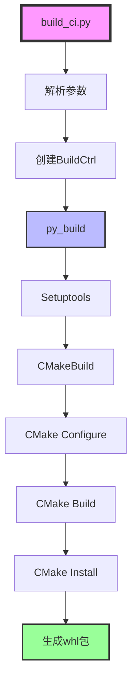

**详细说明：** 参考 [Build 系统文档](../02-core/11-build.md#构建流程详解)

#### 3. 安装包

```bash
# 安装生成的 whl 包
pip install build_out/pypto-*.whl

# 或者使用可编辑安装（开发模式）
pip3 install -e ./
```

#### 4. 运行示例

**NPU 模式（需要真实硬件）：**

```bash
cd examples/02_intermediate/operators/softmax
export TILE_FWK_DEVICE_ID=0
python3 softmax.py --run_mode npu
```

**仿真模式（无需硬件）：**

```bash
cd examples/02_intermediate/operators/softmax
python3 softmax.py --run_mode sim
```

**运行输出：**

```
============================================================
PyPTO Softmax Example
============================================================

Running Example softmax::test_softmax: Softmax
Input shape: torch.Size([32, 32, 1, 256])
Output shape: torch.Size([32, 32, 1, 256])
Max difference: 0.000123
✓ Softmax test passed
```

---

## 示例代码解析

### 代码结构

`softmax.py` 包含以下关键组件：

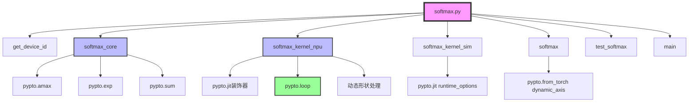

### 核心函数详解

#### 1. softmax_core（核心计算逻辑）

**代码位置：** [`examples/02_intermediate/operators/softmax/softmax.py`](../../../examples/02_intermediate/operators/softmax/softmax.py#L53)

```python
def softmax_core(x: pypto.Tensor) -> pypto.Tensor:
    """
    Core softmax computation: exp(x - max(x)) / sum(exp(x - max(x))).
    """
    row_max = pypto.amax(x, dim=-1, keepdim=True)
    sub = x - row_max
    exp = pypto.exp(sub)
    esum = pypto.sum(exp, dim=-1, keepdim=True)
    return exp / esum
```

**功能概述：** 实现数值稳定的 Softmax 计算，通过减去最大值防止指数运算溢出。

**关键概念：**

- **数值稳定性**：`exp(x - max(x))` 而非 `exp(x)`
  - **问题**：直接计算 `exp(x)` 可能导致数值溢出（当 `x` 很大时）
  - **解决方案**：先减去最大值 `max(x)`，再计算指数
  - **数学等价性**：`exp(x_i - max(x)) / sum(exp(x_j - max(x)))` = `exp(x_i) / sum(exp(x_j))`
  - **优势**：所有指数项都在 `[0, 1]` 范围内，避免溢出

- **`pypto.amax(x, dim=-1, keepdim=True)`**：计算最大值
  - **功能**：在最后一个维度上计算最大值
  - **`dim=-1`**：表示最后一个维度（`-1` 表示从后往前索引）
  - **`keepdim=True`**：保持维度，输出形状为 `[..., 1]`，便于广播
  - **实现位置（归约类实现汇总）**：[`framework/src/interface/operation/vector/reduction.cpp`](../../../framework/src/interface/operation/vector/reduction.cpp)
  - **IR 生成**：转换为 `OP_AMAX` 操作

- **`x - row_max`**：张量减法
  - **功能**：从每个元素中减去对应行的最大值
  - **广播机制**：`row_max` 的形状为 `[..., 1]`，会自动广播到 `x` 的形状
  - **IR 生成**：转换为 `OP_SUB` 操作

- **`pypto.exp(sub)`**：指数运算
  - **功能**：计算 `exp(x - max(x))`
  - **实现位置（向量一元算子实现汇总）**：[`framework/src/interface/operation/vector/unary.cpp`](../../../framework/src/interface/operation/vector/unary.cpp)
  - **IR 生成**：转换为 `OP_EXP` 操作
  - **数值特性**：结果在 `[0, 1]` 范围内

- **`pypto.sum(exp, dim=-1, keepdim=True)`**：求和运算
  - **功能**：在最后一个维度上求和，得到归一化分母
  - **`keepdim=True`**：保持维度，便于后续除法运算
  - **实现位置（归约类实现汇总）**：[`framework/src/interface/operation/vector/reduction.cpp`](../../../framework/src/interface/operation/vector/reduction.cpp)
  - **IR 生成**：转换为 `OP_SUM` 操作

- **`exp / esum`**：归一化
  - **功能**：将指数结果除以求和结果，得到最终的 Softmax 输出
  - **IR 生成**：转换为 `OP_DIV` 操作
  - **结果特性**：每行的和为 1，符合概率分布

**计算流程图：**


#### 2. softmax_kernel_npu（NPU 模式内核函数）

**代码位置：** [`examples/02_intermediate/operators/softmax/softmax.py`](../../../examples/02_intermediate/operators/softmax/softmax.py#L74)

```python
@pypto.jit
def softmax_kernel_npu(x: pypto.Tensor, y: pypto.Tensor) -> None:
    # after the dynamic axis of tensor is marked, get the tensor shape accordingly
    tensor_shape = x.shape
    b = tensor_shape[0] # dynamic: symbolic_scalar; static: immediate number
    n1, n2, dim = tensor_shape[1:]
    tile_b = 1
    b_loop = b / tile_b

    # tiling shape setting
    pypto.set_vec_tile_shapes(1, 4, 1, 64)

    for idx in pypto.loop(b_loop):
        b_offset = idx * tile_b
        b_offset_end = (idx + 1) * tile_b
        x_view = x[b_offset:b_offset_end, :n1, :n2, :dim]
        softmax_out = softmax_core(x_view)
        y[b_offset:, ...] = softmax_out
```

**功能概述：** 定义在 NPU 上执行的 Softmax 内核函数，支持动态 Batch 大小和循环处理。

**关键概念：**

- **动态形状获取**：`tensor_shape = x.shape`
  - **功能**：获取输入张量的形状
  - **动态维度**：如果第 0 维被标记为动态（`dynamic_axis=[0]`），则 `tensor_shape[0]` 为 `SymbolicScalar` 类型
  - **静态维度**：其他维度为具体的整数值
  - **运行时解析**：动态维度在首次调用时绑定到实际输入形状

- **`b = tensor_shape[0]`**：获取 Batch 维度
  - **动态场景**：`b` 为 `SymbolicScalar` 类型，表示运行时确定的维度
  - **静态场景**：`b` 为具体的整数值
  - **用途**：用于计算循环次数

- **`b_loop = b / tile_b`**：计算循环次数
  - **功能**：根据 Batch 大小和 Tile 大小计算需要循环的次数
  - **动态支持**：如果 `b` 是 `SymbolicScalar`，则 `b_loop` 也是 `SymbolicScalar`
  - **实现**：`SymbolicScalar` 支持除法运算，结果仍为 `SymbolicScalar`

- **`pypto.set_vec_tile_shapes(1, 4, 1, 64)`**：设置 Tile 形状
  - **功能**：配置向量计算的 Tile 切分大小
  - **参数说明**：
    - `1`：Batch 维度的 Tile 大小
    - `4`：第 1 维的 Tile 大小
    - `1`：第 2 维的 Tile 大小
    - `64`：第 3 维（特征维度）的 Tile 大小
  - **约束**：最后一个参数必须满足 32 字节对齐（64 满足要求）
  - **优化目标**：平衡计算效率和内存使用

- **`for idx in pypto.loop(b_loop)`**：动态循环
  - **功能**：创建动态循环，处理不同 Batch 大小的数据
  - **`pypto.loop()`**：循环构造器
    - **函数签名**：`loop(stop: SymInt, /, **kwargs) -> Iterator[SymInt]`
    - **参数**：
      - `stop`：循环终止值（可以是 `SymbolicScalar`）
      - `name`：循环标识名称（可选）
      - `idx_name`：循环索引变量名称（可选）
      - `submit_before_loop`：是否在循环开始前提交计算（可选）
    - **实现位置**：[`python/pypto/frontend/parser/parser.py`](../../../python/pypto/frontend/parser/parser.py)
    - **IR 生成**：转换为 `DYNAMIC_LOOP` 或 `DYNAMIC_LOOP_PATH` 类型的 `Function`
  - **循环变量**：`idx` 为 `SymbolicScalar` 类型，表示当前循环索引
  - **循环范围**：`[0, b_loop)`，即 `[0, b / tile_b)`

- **`x_view = x[b_offset:b_offset_end, :n1, :n2, :dim]`**：张量切片
  - **功能**：从输入张量中提取当前循环迭代的数据块
  - **切片语法**：Python 标准的切片语法 `[start:end, ...]`
  - **IR 生成**：转换为 `OP_VIEW` 操作
  - **内存优化**：`VIEW` 操作不拷贝数据，只是创建新的 `LogicalTensor` 视图
  - **实现位置**：[`framework/src/interface/tensor/logical_tensor.cpp`](../../../framework/src/interface/tensor/logical_tensor.cpp#LView)

- **`softmax_out = softmax_core(x_view)`**：调用核心计算
  - **功能**：对当前数据块执行 Softmax 计算
  - **内联处理**：`softmax_core` 会被内联到当前函数中，不会创建子函数
  - **IR 生成**：展开为 `amax`、`sub`、`exp`、`sum`、`div` 等操作序列

- **`y[b_offset:, ...] = softmax_out`**：结果写入
  - **功能**：将计算结果写入输出张量的对应位置
  - **切片赋值**：使用切片语法将结果写入输出
  - **IR 生成**：转换为 `OP_ASSEMBLE` 操作
  - **内存优化**：`ASSEMBLE` 操作将数据组装到目标位置，支持内存复用

**循环处理流程图：**

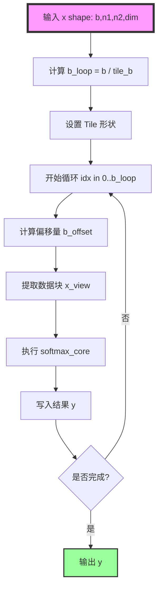

#### 3. softmax_kernel_sim（仿真模式内核函数）

**代码位置：** [`examples/02_intermediate/operators/softmax/softmax.py`](../../../examples/02_intermediate/operators/softmax/softmax.py#L94)

```python
@pypto.jit(runtime_options={"run_mode": 1})
def softmax_kernel_sim(x: pypto.Tensor, y: pypto.Tensor) -> None:
    # 与 softmax_kernel_npu 相同的实现
    ...
```

**功能概述：** 定义在仿真模式下执行的 Softmax 内核函数。

**关键概念：**

- **`runtime_options={"run_mode": 1}`**：运行时选项
  - **`run_mode: 1`**：表示仿真模式（`RunMode.SIM`）
  - **`run_mode: 0`**：表示 NPU 模式（`RunMode.NPU`，默认值）
  - **用途**：在无 NPU 硬件时，可以在 CPU 上仿真执行
  - **实现位置**：[`python/pypto/runtime.py`](../../../python/pypto/runtime.py#LRunMode)

#### 4. softmax（主函数）

**代码位置：** [`examples/02_intermediate/operators/softmax/softmax.py`](../../../examples/02_intermediate/operators/softmax/softmax.py#L114)

```python
def softmax(x: torch.Tensor, run_mode: str = "npu", dynamic: bool = True) -> torch.Tensor:
    y = torch.empty_like(x)

    if dynamic:
        x_pto = pypto.from_torch(x, dynamic_axis=[0])
        y_pto = pypto.from_torch(y, dynamic_axis=[0])
    else:
        x_pto = pypto.from_torch(x)
        y_pto = pypto.from_torch(y)

    # launch the kernel
    if run_mode == "npu":
        softmax_kernel_npu(x_pto, y_pto)
    else:
        softmax_kernel_sim(x_pto, y_pto)
    return y
```

**功能概述：** 将 PyTorch 张量转换为 PyPTO 张量，调用内核函数执行计算。

**关键概念：**

- **`pypto.from_torch(x, dynamic_axis=[0])`**：动态轴标记
  - **功能**：将 PyTorch 张量转换为 PyPTO 张量，并标记动态维度
  - **`dynamic_axis=[0]`**：将第 0 维（Batch 维度）标记为动态
  - **实现位置**：[`python/pypto/converter.py`](../../../python/pypto/converter.py#L35)
  - **转换逻辑**：
    ```python
    dyn_shape = list(tensor.shape)
    if dynamic_axis is not None:
        for axis in dynamic_axis:
            dyn_shape[axis] = -1  # 标记为动态维度
    ```
  - **动态维度表示**：在 IR 中，动态维度被表示为 `SymbolicScalar`，如 `SymbolicScalar("RUNTIME_GetInputShapeDim(ARG_x, 0)")`
  - **运行时绑定**：在首次调用时，动态维度会被绑定到实际输入形状

- **动态 vs 静态**：
  - **动态模式**（`dynamic=True`）：支持运行时变化的 Batch 大小
    - **优势**：一次编译，支持多种 Batch 大小
    - **适用场景**：推理场景，Batch 大小可能变化
  - **静态模式**（`dynamic=False`）：Batch 大小固定
    - **优势**：编译优化更充分，性能可能更好
    - **适用场景**：训练场景，Batch 大小固定

#### 5. test_softmax（测试函数）

**代码位置：** [`examples/02_intermediate/operators/softmax/softmax.py`](../../../examples/02_intermediate/operators/softmax/softmax.py#L132)

```python
def test_softmax(device_id = None, run_mode: str = "npu", dynamic: bool = True) -> None:
    device = f'npu:{device_id}' if (run_mode == "npu" and device_id is not None) else 'cpu'

    shape = (32, 32, 1, 256)
    x = torch.rand(shape, dtype=torch.float, device=device)

    y = softmax(x, run_mode, dynamic).cpu() # default dim: -1
    golden = torch.softmax(x, dim=-1).cpu()

    max_diff = np.abs(y.numpy() - golden.numpy()).max()
    print(f"Input shape: {x.shape}")
    print(f"Output shape: {y.shape}")
    print(f"Max difference: {max_diff:.6f}")

    if run_mode == "npu":
        assert_allclose(np.array(y), np.array(golden), rtol=3e-3, atol=3e-3)
    print("✓ Softmax test passed")
```

**功能概述：** 测试函数，准备输入数据，调用 `softmax()` 执行计算，并与 PyTorch 的参考结果对比。

**关键步骤：**

1. **数据准备**：创建随机输入张量，形状为 `(32, 32, 1, 256)`
2. **执行计算**：调用 `softmax()` 执行 PyPTO 计算
3. **参考对比**：使用 PyTorch 的 `torch.softmax()` 生成参考结果
4. **结果验证**：对比输出和参考结果，检查误差（允许误差：`rtol=3e-3, atol=3e-3`）

---

## 完整执行流程

### 整体执行流程图

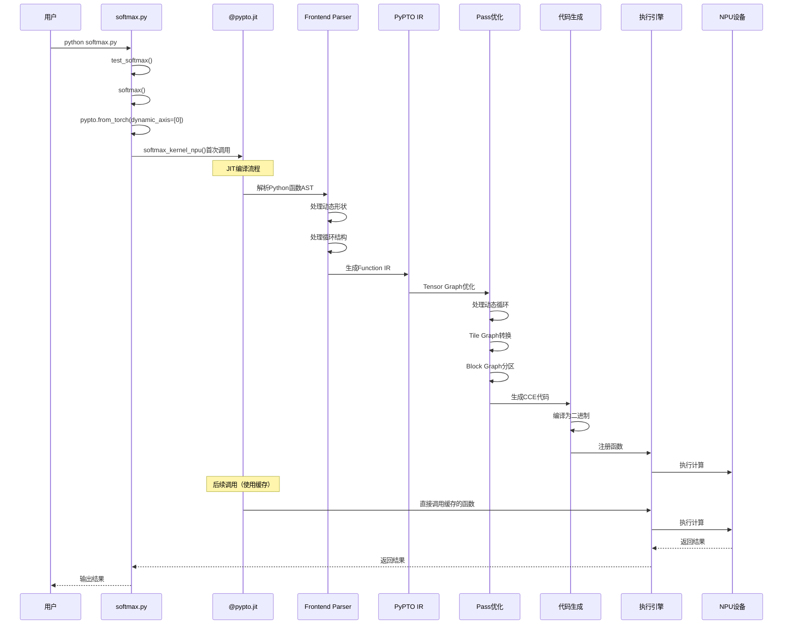

### 详细执行步骤

#### 阶段 1：Python 前端解析

**入口：** `@pypto.jit` 装饰器

**文件位置：** [`python/pypto/frontend/parser/entry.py`](../../../python/pypto/frontend/parser/entry.py#L744)

**执行流程：**

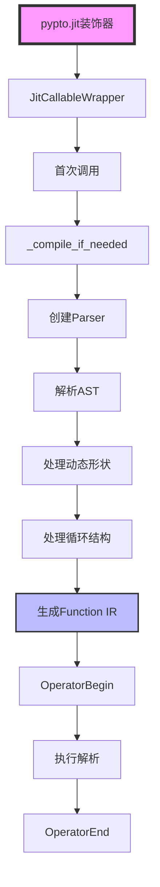

**关键函数：**

- **`jit()`**：JIT 装饰器函数
  - **功能**：创建 `JitCallableWrapper` 包装原始函数
  - **实现**：参考 [`python/pypto/frontend/parser/entry.py`](../../../python/pypto/frontend/parser/entry.py#L744)

- **`JitCallableWrapper._compile_if_needed()`**：延迟编译
  - **功能**：在首次调用时编译函数
  - **实现**：参考 [`python/pypto/frontend/parser/entry.py`](../../../python/pypto/frontend/parser/entry.py#L485)
  - **关键步骤详解**：
    1. **创建 Parser**：`self._parser = self._create_parser()`
    2. **解析 AST**：`self._parser.parse()`
    3. **初始化后端**：`pypto_impl.DeviceInit()`、`pypto_impl.OperatorBegin()`
    4. **绑定动态维度**：`self._parser.bind_dynamic_dims_from_inputs(concrete_input_shapes)`
       - **功能**：将符号维度绑定到具体的输入形状
       - **示例**：`SymbolicScalar("N")` → 实际值 `32`
       - **实现位置**：[`python/pypto/frontend/parser/parser.py`](../../../python/pypto/frontend/parser/parser.py)
    5. **执行解析**：`self._pto_function = self._parser.execute()`
       - **循环处理**：`for idx in pypto.loop(b_loop)` 被转换为 `DYNAMIC_LOOP` 类型的 `Function`
       - **视图处理**：`x[b_offset:b_offset_end, ...]` 被转换为 `OP_VIEW` 操作
       - **函数内联**：`softmax_core()` 被内联，展开为操作序列
    6. **完成编译**：`pypto_impl.OperatorEnd(handler)`

**生成的 IR 结构：**

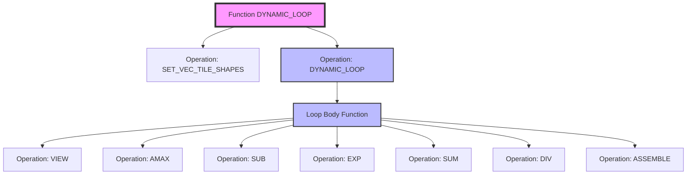

#### 阶段 2：Pass 优化

**入口：** `OperatorEnd()` 触发 Pass 优化

**文件位置：** [`framework/src/passes/pass_mgr/pass_manager.cpp`](../../../framework/src/passes/pass_mgr/pass_manager.cpp)

**执行流程：**

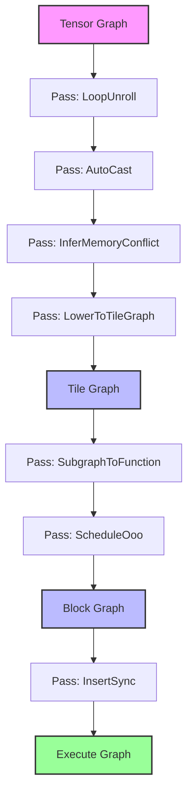

**关键 Pass：**

- **`LoopUnroll`**：循环展开
  - **功能**：展开动态循环，生成循环体函数
  - **处理**：将 `DYNAMIC_LOOP` 转换为 `DYNAMIC_LOOP_PATH`，并创建循环体函数
  - **参考**：[Passes 模块文档](../02-core/09-passes.md#loopunroll-pass)

- **`InferMemoryConflict`**：推断内存冲突
  - **功能**：分析张量的生命周期，识别内存冲突
  - **处理**：在循环中，`x_view` 和 `softmax_out` 可能存在内存冲突，需要插入拷贝
  - **参考**：[Passes 模块文档](../02-core/09-passes.md#infermemoryconflict-pass)

- **`LowerToTileGraph`**：Lowering 到 Tile Graph
  - **功能**：将 Tensor Graph 转换为硬件感知的 Tile Graph
  - **处理**：`amax`、`exp`、`sum`、`div` 等操作被转换为具体的 Tile 操作序列

- **`SubgraphToFunction`**：子图转函数
  - **功能**：将循环体转换为可调用的函数
  - **处理**：循环体函数被转换为独立的 `Function`，支持参数化和缓存

- **`InsertSync`**：插入同步
  - **功能**：在数据依赖处插入同步操作
  - **处理**：循环迭代之间的依赖需要同步

**详细说明：** 参考 [Passes 模块文档](../02-core/09-passes.md)

#### 阶段 3：代码生成

**入口：** `OperatorEnd()` 触发代码生成

**文件位置：** [`framework/src/codegen/cloudnpu/codegen_cloudnpu.cpp`](../../../framework/src/codegen/cloudnpu/codegen_cloudnpu.cpp)

**执行流程：**

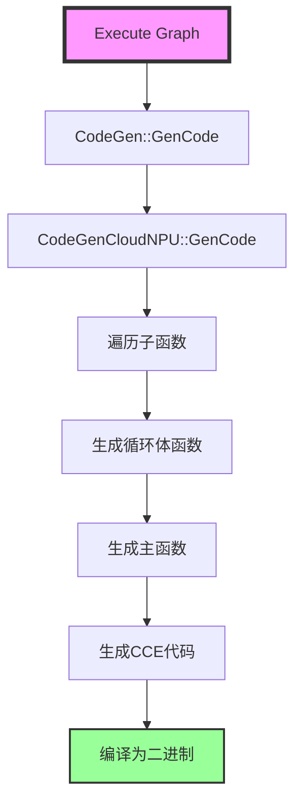

**关键函数：**

- **`CodeGenCloudNPU::GenFuncBody()`**：生成函数体
  - **功能**：遍历操作，生成 CCE 代码
  - **实现**：参考 [`framework/src/codegen/cloudnpu/codegen_cloudnpu.cpp`](../../../framework/src/codegen/cloudnpu/codegen_cloudnpu.cpp#LGenFuncBody)
  - **循环处理**：动态循环被转换为 CCE 的 `for` 循环
  - **视图处理**：`VIEW` 操作不生成代码，只是调整偏移量

**详细说明：** 参考 [Codegen 模块文档](../02-core/10-codegen.md)

#### 阶段 4：设备执行

**入口：** `_dispatch_with_run_mode()` 或 `_run()`

**文件位置：** [`python/pypto/frontend/parser/entry.py`](../../../python/pypto/frontend/parser/entry.py#L534)

**执行流程：**

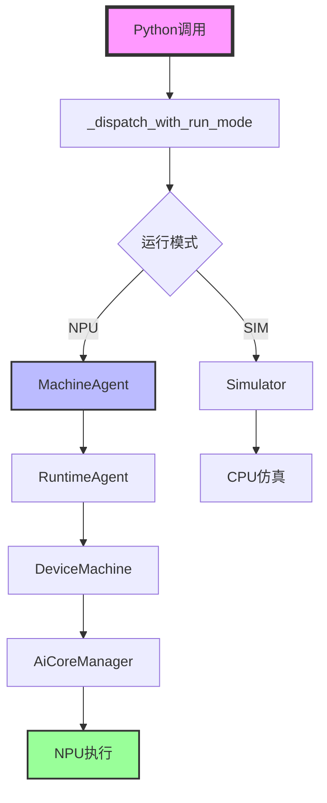

**关键函数：**

- **`_run()`**：执行函数
  - **功能**：调用后端运行时执行函数
  - **实现**：参考 [`python/pypto/frontend/parser/entry.py`](../../../python/pypto/frontend/parser/entry.py#L534)
  - **关键步骤详解**：
    1. **查询工作空间大小**：`pypto_impl.GetWorkSpaceSize(handler, in_tensor_data, out_tensor_data)`
    2. **分配工作空间**：`torch.empty(workspace_size, dtype=torch.uint8, device=device)`
    3. **执行函数**：`pypto_impl.OperatorDeviceRunOnceDataFromDevice(handler, ...)`
       - **动态形状处理**：运行时根据实际输入形状解析动态维度
       - **循环执行**：根据实际的 `b` 值执行循环

**详细说明：** 参考 [Machine 模块文档](../02-core/08-machine.md)

---

## 动态形状处理

### 动态轴标记机制

**标记方式：** `pypto.from_torch(x, dynamic_axis=[0])`

**实现位置：** [`python/pypto/converter.py`](../../../python/pypto/converter.py#L35)

**处理流程：**

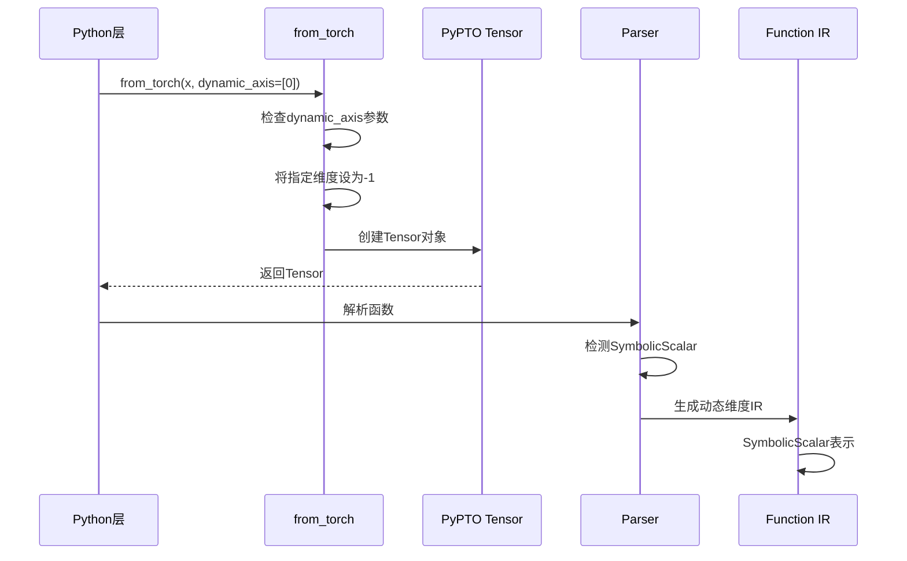

**关键概念：**

- **`dynamic_axis`**：动态轴列表
  - **类型**：`Optional[List[int]]`
  - **功能**：指定哪些维度应该被标记为动态
  - **示例**：`dynamic_axis=[0]` 表示第 0 维（Batch 维度）是动态的
  - **转换逻辑**：
    ```python
    dyn_shape = list(tensor.shape)
    if dynamic_axis is not None:
        for axis in dynamic_axis:
            dyn_shape[axis] = -1  # 标记为动态维度
    ```

- **`SymbolicScalar`**：符号标量
  - **功能**：表示运行时确定的维度大小
  - **创建方式**：`SymbolicScalar("RUNTIME_GetInputShapeDim(ARG_x, 0)")`
  - **运算支持**：支持加减乘除等基本运算
  - **运行时解析**：在首次调用时绑定到实际输入形状

- **运行时绑定**：`bind_dynamic_dims_from_inputs()`
  - **功能**：将符号维度绑定到具体的输入形状
  - **实现位置**：[`python/pypto/frontend/parser/parser.py`](../../../python/pypto/frontend/parser/parser.py)
  - **绑定时机**：在 `Parser.execute()` 之前
  - **绑定过程**：
    1. 获取实际输入张量的形状
    2. 查找对应的 `SymbolicScalar`
    3. 将 `SymbolicScalar` 替换为实际值

### 动态循环处理

**循环构造：** `for idx in pypto.loop(b_loop)`

**实现位置：** [`python/pypto/frontend/parser/parser.py`](../../../python/pypto/frontend/parser/parser.py)

**处理流程：**

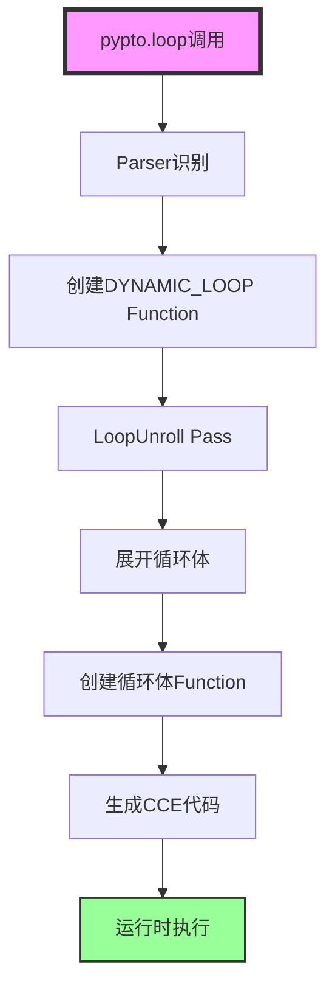

**关键概念：**

- **`pypto.loop()`**：循环构造器
  - **函数签名**：`loop(stop: SymInt, /, **kwargs) -> Iterator[SymInt]`
  - **参数**：
    - `stop`：循环终止值（可以是 `SymbolicScalar`）
    - `name`：循环标识名称（可选）
    - `idx_name`：循环索引变量名称（可选）
    - `submit_before_loop`：是否在循环开始前提交计算（可选）
  - **实现位置**：[`python/pypto/frontend/parser/parser.py`](../../../python/pypto/frontend/parser/parser.py)
  - **IR 生成**：转换为 `DYNAMIC_LOOP` 或 `DYNAMIC_LOOP_PATH` 类型的 `Function`

- **`DYNAMIC_LOOP`**：动态循环函数类型
  - **功能**：表示包含动态循环的函数
  - **特点**：循环次数在运行时确定
  - **处理**：`LoopUnroll` Pass 会展开循环，创建循环体函数

- **循环体函数**：循环内部的函数
  - **创建时机**：`LoopUnroll` Pass 展开循环时
  - **函数类型**：`DYNAMIC_LOOP_PATH`
  - **参数化**：循环索引作为参数传入
  - **缓存**：循环体函数会被缓存，避免重复编译

---

## 循环结构处理

### 循环展开机制

**Pass：** `LoopUnroll`

**功能概述：** 展开动态循环，生成循环体函数。

**处理流程：**

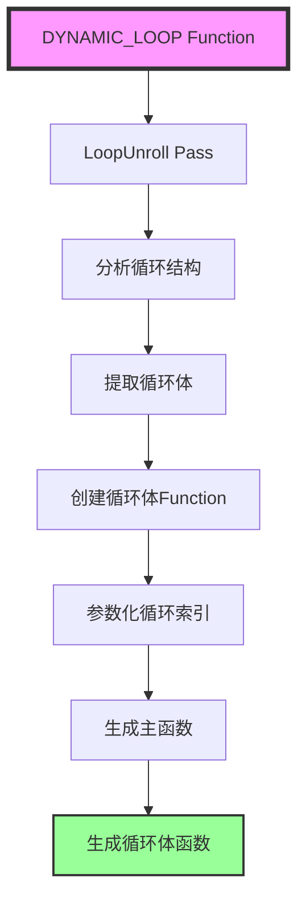

**关键步骤：**

1. **识别循环结构**：查找 `DYNAMIC_LOOP` 类型的操作
2. **提取循环体**：提取循环内部的操作为循环体
3. **创建循环体函数**：将循环体转换为独立的 `Function`
4. **参数化**：循环索引作为参数传入循环体函数
5. **生成调用**：主函数中生成对循环体函数的调用

### 视图和组装操作

**视图操作：** `x_view = x[b_offset:b_offset_end, ...]`

**IR 表示：** `OP_VIEW`

**功能概述：** 创建张量视图，不拷贝数据。

**实现位置：** [`framework/src/interface/tensor/logical_tensor.cpp`](../../../framework/src/interface/tensor/logical_tensor.cpp#LView)

**关键概念：**

- **`VIEW` 操作**：视图操作
  - **功能**：创建一个新的 `LogicalTensor`，指向原张量的特定视图
  - **内存优化**：不拷贝数据，只是调整偏移量和形状
  - **IR 生成**：Python 切片语法 `x[start:end, ...]` 被转换为 `OP_VIEW` 操作
  - **参数**：
    - `source`：源张量
    - `shape`：视图形状
    - `offset`：视图偏移量

- **`ASSEMBLE` 操作**：组装操作
  - **功能**：将源张量的数据组装到目标张量的指定位置
  - **IR 生成**：Python 切片赋值 `y[start:end, ...] = value` 被转换为 `OP_ASSEMBLE` 操作
  - **参数**：
    - `source`：源张量
    - `offset`：目标偏移量
    - `target`：目标张量

---

## 数值稳定计算

### Softmax 数值稳定性

**问题：** 直接计算 `exp(x)` 可能导致数值溢出。

**解决方案：** `exp(x - max(x))` 而非 `exp(x)`

**数学原理：**

```
softmax(x_i) = exp(x_i) / sum(exp(x_j))
             = exp(x_i - max(x)) / sum(exp(x_j - max(x)))
```

**优势：**

- **避免溢出**：所有指数项都在 `[0, 1]` 范围内
- **数值稳定**：减少浮点运算误差
- **数学等价**：结果与直接计算相同

### 实现细节

**计算步骤：**

1. **计算最大值**：`row_max = amax(x, dim=-1, keepdim=True)`
2. **减去最大值**：`sub = x - row_max`
3. **计算指数**：`exp = exp(sub)`
4. **求和**：`esum = sum(exp, dim=-1, keepdim=True)`
5. **归一化**：`output = exp / esum`

**关键操作：**

- **`amax`**：最大值计算
  - **实现位置（归约类实现汇总）**：[`framework/src/interface/operation/vector/reduction.cpp`](../../../framework/src/interface/operation/vector/reduction.cpp)
  - **IR 表示**：`OP_AMAX`
  - **硬件支持**：在 NPU 的向量计算单元上执行

- **`exp`**：指数运算
  - **实现位置（向量一元算子实现汇总）**：[`framework/src/interface/operation/vector/unary.cpp`](../../../framework/src/interface/operation/vector/unary.cpp)
  - **IR 表示**：`OP_EXP`
  - **数值特性**：结果在 `[0, 1]` 范围内

- **`sum`**：求和运算
  - **实现位置（归约类实现汇总）**：[`framework/src/interface/operation/vector/reduction.cpp`](../../../framework/src/interface/operation/vector/reduction.cpp)
  - **IR 表示**：`OP_SUM`
  - **用途**：计算归一化分母

---

## 模块接口调用链

### 完整调用链

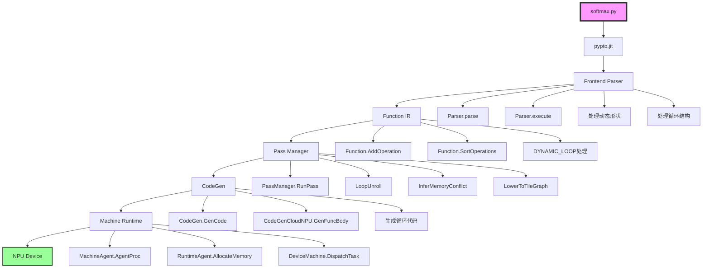

### 各模块接口详解

#### 1. Frontend Parser 模块

**模块位置：** [`python/pypto/frontend/parser`](../../../python/pypto/frontend/parser)

**关键接口：**

- **`jit()`**：JIT 装饰器
  - **文件**：[`entry.py`](../../../python/pypto/frontend/parser/entry.py#L744)
  - **功能**：创建 `JitCallableWrapper`，包装原始函数

- **`Parser.parse()`**：解析函数 AST
  - **文件**：[`parser.py`](../../../python/pypto/frontend/parser/parser.py)
  - **功能**：将 Python 函数 AST 转换为 PyPTO IR
  - **循环处理**：识别 `pypto.loop()` 调用，生成 `DYNAMIC_LOOP` IR

- **`Parser.execute()`**：执行解析
  - **文件**：[`parser.py`](../../../python/pypto/frontend/parser/parser.py)
  - **功能**：生成 `Function` 对象
  - **动态形状绑定**：绑定动态维度到实际输入形状

#### 2. Interface 模块

**模块位置：** [`framework/src/interface`](../../../framework/src/interface)

**关键接口：**

- **`Function::AddOperation()`**：添加操作
  - **文件**：[`function.cpp`](../../../framework/src/interface/function/function.cpp#L530)
  - **功能**：向函数中添加操作，构建计算图

- **`Function::SortOperations()`**：排序操作
  - **文件**：[`function.cpp`](../../../framework/src/interface/function/function.cpp#L2700)
  - **功能**：对操作进行拓扑排序，确定执行顺序

#### 3. Passes 模块

**模块位置：** [`framework/src/passes`](../../../framework/src/passes)

**关键接口：**

- **`PassManager::RunPass()`**：执行 Pass
  - **文件**：[`pass_mgr/pass_manager.cpp`](../../../framework/src/passes/pass_mgr/pass_manager.cpp#L211)
  - **功能**：按策略执行 Pass 序列

- **`LoopUnroll::RunOnFunction()`**：循环展开
  - **文件**：[`tensor_graph_pass/loop_unroll.cpp`](../../../framework/src/passes/tensor_graph_pass/loop_unroll.cpp)
  - **功能**：展开动态循环，创建循环体函数

#### 4. Codegen 模块

**模块位置：** [`framework/src/codegen`](../../../framework/src/codegen)

**关键接口：**

- **`CodeGen::GenCode()`**：生成代码
  - **文件**：[`codegen.cpp`](../../../framework/src/codegen/codegen.cpp)
  - **功能**：生成 CCE 代码

- **`CodeGenCloudNPU::GenFuncBody()`**：生成函数体
  - **文件**：[`cloudnpu/codegen_cloudnpu.cpp`](../../../framework/src/codegen/cloudnpu/codegen_cloudnpu.cpp)
  - **功能**：生成函数体的 CCE 代码

#### 5. Machine 模块

**模块位置：** [`framework/src/machine`](../../../framework/src/machine)

**关键接口：**

- **`MachineAgent::AgentProc()`**：执行任务
  - **文件**：[`runtime/machine_agent.cpp`](../../../framework/src/machine/runtime/machine_agent.cpp#LAgentProc)
  - **功能**：准备任务，调度执行

- **`RuntimeAgent::AllocateMemory()`**：分配内存
  - **文件**：[`runtime/runtime.h`](../../../framework/src/machine/runtime/runtime.h)
  - **功能**：分配设备内存

---

## Python 与 C++ 混合调试

### 调试架构

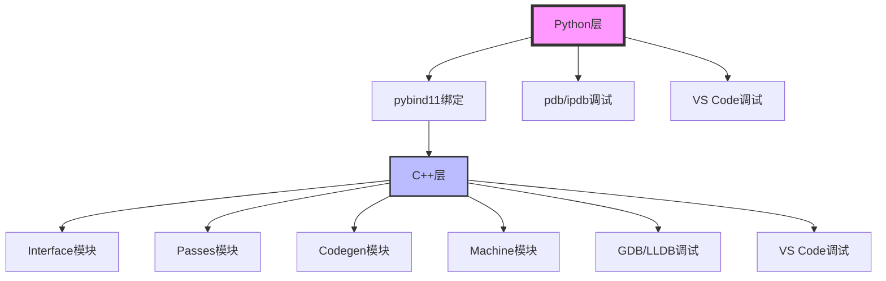

### Python 层调试

**调试工具：**
- **pdb**：Python 调试器
- **ipdb**：增强版 Python 调试器
- **VS Code**：集成调试环境

**调试技巧：**

1. **设置断点**：在 `softmax_kernel_npu()` 函数中设置断点
2. **查看变量**：检查 `tensor_shape`、`b`、`b_loop` 等变量的值
3. **单步执行**：逐步执行循环，观察每次迭代的行为

### C++ 层调试

**调试工具：**
- **GDB**：GNU 调试器
- **LLDB**：LLVM 调试器
- **VS Code**：集成调试环境

**调试技巧：**

1. **设置断点**：在 `Function::AddOperation()` 中设置断点
2. **查看 IR**：使用 `Function::DumpSSA()` 查看 IR 结构
3. **跟踪 Pass**：在 `PassManager::RunPass()` 中跟踪 Pass 执行

### 混合调试技巧

**推荐做法：**

1. **使用日志**：在关键位置添加日志输出
2. **查看输出文件**：分析 `output/` 目录下的调试文件
3. **可视化工具**：使用 `draw_swim_lane.py` 可视化执行流程

---

## 框架实现原理串联

### 整体架构串联

通过 `softmax.py` 示例，我们可以串联起 PyPTO 的整个框架实现：

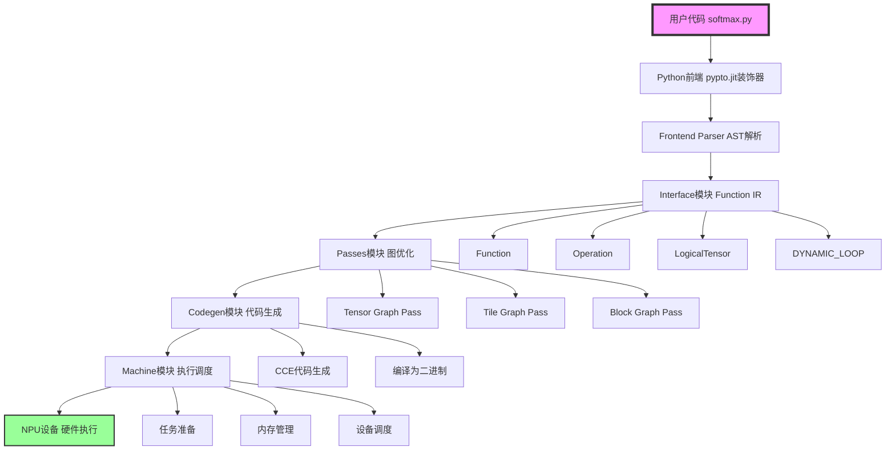

### 数据流转换

**从 Python 代码到硬件执行的完整数据流：**

```mermaid
graph LR
    A[Python函数 softmax_kernel_npu] --> B[AST解析]
    B --> C[Function IR TENSOR_GRAPH]
    C --> D[Pass优化 TILE_GRAPH]
    D --> E[Pass优化 BLOCK_GRAPH]
    E --> F[代码生成 CCE代码]
    F --> G[编译 二进制]
    G --> H[设备执行 NPU]
    
    style A fill:#f9f,stroke:#333,stroke-width:2px
    style C fill:#bbf,stroke:#333,stroke-width:2px
    style D fill:#bbf,stroke:#333,stroke-width:2px
    style E fill:#bbf,stroke:#333,stroke-width:2px
    style F fill:#bbf,stroke:#333,stroke-width:2px
    style H fill:#9f9,stroke:#333,stroke-width:2px
```

### 关键转换点

#### 1. Python → IR

**转换内容：**
- `pypto.loop(b_loop)` → `DYNAMIC_LOOP` Function
- `x[b_offset:b_offset_end, ...]` → `OP_VIEW` Operation
- `softmax_core(x_view)` → 内联的操作序列

#### 2. Tensor Graph → Tile Graph

**转换内容：**
- `OP_AMAX` → Tile 级别的 `AMAX` 操作
- `OP_EXP` → Tile 级别的 `EXP` 操作
- `OP_SUM` → Tile 级别的 `SUM` 操作

#### 3. Tile Graph → Block Graph

**转换内容：**
- 循环体 → 独立的子函数
- 子图分区 → 多个执行块
- 同步插入 → `SetFlag`、`WaitFlag` 操作

#### 4. Block Graph → CCE Code

**转换内容：**
- 操作 → CCE 函数调用
- 循环 → CCE `for` 循环
- 视图 → 偏移量调整

---

## 关键概念详解

### 动态形状（Dynamic Shape）

**定义：** 在编译时未知，运行时确定的维度大小。

**标记方式：** `pypto.from_torch(x, dynamic_axis=[0])`

**表示方式：** `SymbolicScalar`

**使用场景：**
- **推理场景**：Batch 大小可能变化
- **变长序列**：序列长度可能变化

**关键函数：**
- **`from_torch()`**：标记动态维度
- **`bind_dynamic_dims_from_inputs()`**：绑定动态维度
- **`GetInputShape()`**：获取动态形状

### 循环结构（Loop Structure）

**定义：** 使用 `pypto.loop()` 创建的动态循环。

**类型：**
- **`DYNAMIC_LOOP`**：动态循环函数
- **`DYNAMIC_LOOP_PATH`**：循环体函数

**处理流程：**
1. **识别循环**：Parser 识别 `pypto.loop()` 调用
2. **展开循环**：`LoopUnroll` Pass 展开循环
3. **创建循环体**：将循环体转换为独立函数
4. **生成代码**：生成 CCE 循环代码

### 数值稳定计算（Numerically Stable Computation）

**定义：** 通过数学变换避免数值溢出和精度损失的计算方法。

**Softmax 稳定性：**
- **问题**：`exp(x)` 可能溢出
- **解决方案**：`exp(x - max(x))`
- **优势**：所有指数项在 `[0, 1]` 范围内

### Tile 形状配置（Tile Shape Configuration）

**定义：** 配置向量计算在各维度上的切分大小。

**设置方式：** `pypto.set_vec_tile_shapes(1, 4, 1, 64)`

**参数说明：**
- `1`：Batch 维度的 Tile 大小
- `4`：第 1 维的 Tile 大小
- `1`：第 2 维的 Tile 大小
- `64`：第 3 维的 Tile 大小（必须满足 32 字节对齐）

**优化目标：** 平衡计算效率和内存使用

---

## 最佳实践

### 开发调试

**推荐做法：**

1. **使用可编辑安装**：`pip3 install -e ./`
   - Python 代码修改即时生效
   - C++ 代码修改后需要重新编译

2. **启用调试日志**：
   ```bash
   export ALOG_LEVEL=DEBUG
   ```

3. **使用仿真模式**：无硬件时使用 `--run_mode sim`

4. **可视化调试**：使用 PyPTO ToolKit 查看计算图和泳道图

### 性能优化

**推荐做法：**

1. **合理设置 Tile 形状**：根据数据形状和硬件特性设置
2. **避免频繁编译**：使用相同形状的输入，利用缓存
3. **批量执行**：将多个操作组合到一个函数中
4. **动态形状权衡**：动态形状增加编译开销，但提高灵活性

### 错误排查

**常见问题：**

1. **编译失败**：检查 CMake 配置和依赖
2. **执行失败**：检查设备可用性和内存分配
3. **精度问题**：检查数值稳定性实现
4. **性能问题**：检查 Tile 形状配置和循环结构

---

## 相关文档

- [Hello World 示例解析](../01-examples/00-hello-world.md)
- [Function 类详细文档](../02-core/05-function.md)
- [Framework 模块文档](../02-core/03-framework.md)
- [Passes 模块文档](../02-core/09-passes.md)
- [Codegen 模块文档](../02-core/10-codegen.md)
- [Machine 模块文档](../02-core/08-machine.md)
- [Build 系统文档](../02-core/11-build.md)

---

## 总结

通过 `softmax.py` 示例，我们深入了解了 PyPTO 框架如何处理：

1. **动态形状**：通过 `dynamic_axis` 标记和 `SymbolicScalar` 表示
2. **循环结构**：通过 `pypto.loop()` 创建动态循环
3. **数值稳定计算**：通过数学变换避免数值溢出
4. **视图和组装**：通过 `VIEW` 和 `ASSEMBLE` 操作优化内存使用

这些特性使得 PyPTO 能够高效地处理复杂的深度学习计算场景。

