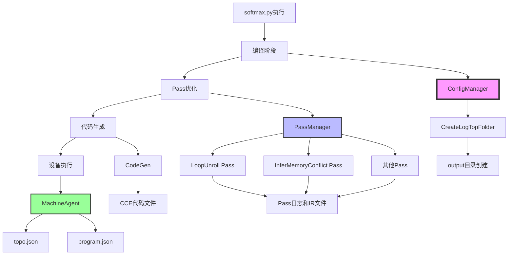
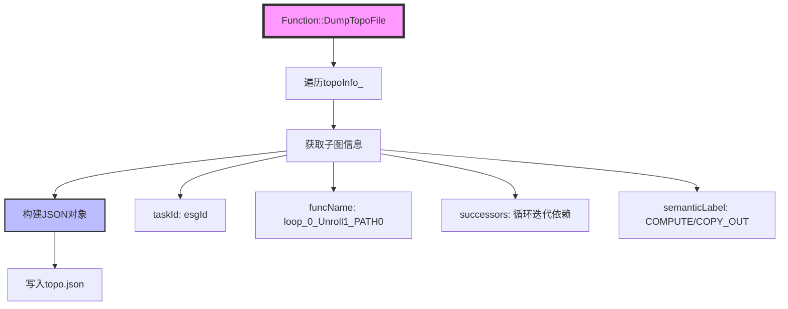
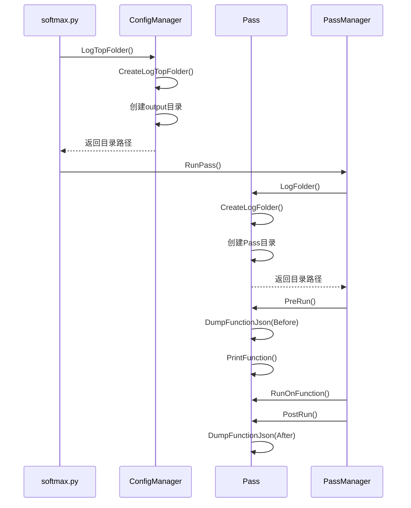

# Softmax 调试文件详解

> **适用对象：** 已运行过Softmax示例的开发者  
> **学习时间：** 40-60分钟  
> **前置知识：** 已阅读[Softmax示例](02-softmax.md)和[Hello World调试文件](01-hello-world-debug.md)  
> **学习目标：** 理解复杂场景下的调试文件、掌握动态形状和循环的调试方法

## 概述

本文档以 `softmax.py` 示例生成的调试文件为切入点，深入解析 PyPTO 框架在编译和执行过程中生成的各类调试文件。通过分析 Softmax 这个包含动态形状、循环结构、数值稳定计算的复杂示例，我们将详细说明每个 Pass 前后的 IR 变化、文件生成机制、字段含义、使用场景等，帮助开发者深入理解 PyPTO 的编译优化过程。

**与Hello World调试文件的区别：**
- 🔄 **动态形状**：观察SymbolicScalar的处理
- 🔁 **循环结构**：理解DYNAMIC_LOOP类型的Function
- 📊 **更多Pass**：更复杂的优化流程
- 🎯 **控制流**：包含控制流编译相关的文件

**学习价值：**
- 🔍 调试复杂算子的方法
- 📈 理解动态形状的编译流程
- 🛠️ 掌握高级调试技巧
- 💡 性能优化的方向

**调试文件位置：**
- **默认路径**：`output/output_<timestamp>_<pid>/`
- **自定义路径**：通过环境变量 `TILE_FWK_OUTPUT_DIR` 指定
- **示例路径（运行后生成）**：`examples/02_intermediate/operators/softmax/output/`

**相关文档：**
- [Softmax 示例解析](../01-examples/03-softmax.md)
- [Hello World 调试文件详解](01-hello-world-debug.md)
- [Passes 模块文档](../02-core/09-passes.md)
- [Function 类详细文档](../02-core/05-function.md)

---

## 目录

- [调试文件架构](#调试文件架构)
- [目录结构](#目录结构)
- [核心文件详解](#核心文件详解)
- [Pass 调试文件详解](#pass-调试文件详解)
- [关键 Pass 变化分析](#关键-pass-变化分析)
- [代码生成文件](#代码生成文件)
- [执行拓扑文件](#执行拓扑文件)
- [文件生成机制](#文件生成机制)
- [调试场景应用](#调试场景应用)
- [可视化工具](#可视化工具)
- [最佳实践](#最佳实践)

---

## 调试文件架构

### 文件生成流程



### 文件分类

Softmax 示例生成的调试文件按功能可分为以下几类：

| 文件类型 | 文件格式 | 主要用途 | 生成阶段 | Softmax 特点 |
|---------|---------|---------|---------|-------------|
| **Pass 日志** | `.log` | 记录 Pass 执行日志 | Pass 优化阶段 | 包含循环展开日志 |
| **Function IR** | `.json` | 序列化的函数 IR | Pass 优化阶段 | 包含动态循环 IR |
| **拓扑文件** | `topo.json` | 任务执行拓扑 | 代码生成/执行阶段 | 包含循环体任务 |
| **程序文件** | `program.json` | 程序级 IR | 代码生成阶段 | 包含循环体函数 |
| **CCE 代码** | `.cce` | 生成的 CCE 代码 | 代码生成阶段 | 包含循环代码 |

---

## 目录结构

### 标准目录布局

运行 `softmax.py` 后，会在 `output/` 目录下生成如下结构：

```
output/
└── output_20251229_113045_628481_3971654/    # 时间戳目录
    ├── topo.json                              # 执行拓扑文件
    ├── program.json                           # 程序级 IR
    ├── run.log                                # 主日志文件
    ├── built_in/                              # 内置操作信息
    │   └── pypto_op_info.json
    ├── kernel_aicore/                         # AI Core 内核文件
    │   └── ...
    ├── kernel_aicpu/                          # AI CPU 内核文件
    │   └── libTENSOR_softmax_kernel_npu_*.json
    └── Pass_XX_<PassName>/                    # Pass 调试目录
        ├── <PassName><FunctionName>.log      # Pass 日志
        ├── <PassName><FunctionName>_Before.json  # Pass 前 IR
        └── <PassName><FunctionName>_After.json   # Pass 后 IR
```

### 目录命名规则

**时间戳目录：**
- **格式**：`output_<YYYYMMDD>_<HHMMSS>_<微秒>_<进程ID>`
- **示例**：`output_20251229_113045_628481_3971654`
- **生成位置**：[`framework/src/interface/configs/config_manager.cpp`](../../../framework/src/interface/configs/config_manager.cpp#L121)

**Pass 目录：**
- **格式**：`Pass_<序号>_<Pass名称>`
- **示例**：`Pass_00_LoopUnroll`、`Pass_02_InferMemoryConflict`
- **生成位置**：[`framework/src/passes/pass_interface/pass.cpp`](../../../framework/src/passes/pass_interface/pass.cpp#L227)

**Softmax 特有的 Pass：**
- **`Pass_00_LoopUnroll`**：循环展开 Pass，处理 `pypto.loop()` 循环
- **`Pass_04_ExpandFunction`**：函数展开 Pass，内联 `softmax_core()` 函数

---

## 核心文件详解

### 1. topo.json（执行拓扑文件）

**文件位置：** `output_*/topo.json`

**功能概述：** 记录任务执行的拓扑结构，包括循环体任务、函数调用任务等。

**生成代码：** [`framework/src/interface/function/function.cpp`](../../../framework/src/interface/function/function.cpp#L6323)

**Softmax 示例的拓扑结构：**

```json
[
  {
    "taskId": 0,
    "funcName": "loop_0_Unroll1_PATH0",
    "successors": [1],
    "predecessors": [],
    "remainingPredecessors": 0,
    "semanticLabel": "COMPUTE"
  },
  {
    "taskId": 1,
    "funcName": "loop_0_Unroll1_PATH0",
    "successors": [],
    "predecessors": [0],
    "remainingPredecessors": 1,
    "semanticLabel": "COPY_OUT"
  }
]
```

**字段说明：**

| 字段 | 类型 | 说明 | Softmax 示例值 |
|-----|------|------|---------------|
| **`taskId`** | `int` | 任务唯一标识符，对应子图 ID（`esgId`） | `0`, `1`, ... |
| **`funcName`** | `string` | 被调用的函数名称 | `"loop_0_Unroll1_PATH0"`（循环体函数） |
| **`successors`** | `array<int>` | 后继任务 ID 列表 | `[1]` |
| **`predecessors`** | `array<int>` | 前驱任务 ID 列表 | `[]` |
| **`remainingPredecessors`** | `int` | 剩余未完成的前驱任务数 | `0`, `1` |
| **`semanticLabel`** | `string` | 语义标签 | `"COMPUTE"`, `"COPY_OUT"` |

**关键概念：**

- **`loop_0_Unroll1_PATH0`**：循环体函数名称
  - **`loop_0`**：循环标识（`pypto.loop()` 的 `name` 参数）
  - **`Unroll1`**：展开因子为 1
  - **`PATH0`**：循环路径 0（循环体）
  - **生成位置**：`LoopUnroll` Pass 创建循环体函数时

**使用场景：**
- **执行顺序分析**：理解循环任务的执行顺序和依赖关系
- **性能瓶颈定位**：识别循环迭代之间的阻塞
- **可视化工具**：供 `draw_swim_lane.py` 等工具生成泳道图

---

### 2. program.json（程序级 IR）

**文件位置：** `output_*/program.json`

**功能概述：** 序列化的程序级 IR，包含主函数和循环体函数的完整信息。

**生成代码：** [`framework/src/interface/program/program.cpp`](../../../framework/src/interface/program/program.cpp)

**Softmax 示例的文件结构：**

```json
{
  "curr_funcmagic": 2,
  "enable_cvfuse": false,
  "entryhash": "210193433060527433398",
  "functions": [
    {
      "func_magicname": "PROGRAM_ENTRY",
      "funcmagic": 1,
      "functype": 0,
      "graphtype": 5,
      "operations": [
        {
          "opcode": "CALL",
          "opmagic": 10000,
          "calleehash": "...",
          "ioperands": [31, 34],
          "ooperands": [39],
          "latency": 13
        }
      ]
    },
    {
      "func_magicname": "loop_0_Unroll1_PATH0",
      "funcmagic": 2,
      "functype": 3,
      "graphtype": 5,
      "operations": [
        {
          "opcode": "VIEW",
          "opmagic": 10001,
          "ioperands": [40],
          "ooperands": [41]
        },
        {
          "opcode": "AMAX",
          "opmagic": 10002,
          "ioperands": [41],
          "ooperands": [42]
        },
        {
          "opcode": "SUB",
          "opmagic": 10003,
          "ioperands": [41, 42],
          "ooperands": [43]
        },
        {
          "opcode": "EXP",
          "opmagic": 10004,
          "ioperands": [43],
          "ooperands": [44]
        },
        {
          "opcode": "SUM",
          "opmagic": 10005,
          "ioperands": [44],
          "ooperands": [45]
        },
        {
          "opcode": "DIV",
          "opmagic": 10006,
          "ioperands": [44, 45],
          "ooperands": [46]
        },
        {
          "opcode": "ASSEMBLE",
          "opmagic": 10007,
          "ioperands": [46],
          "ooperands": [39]
        }
      ]
    }
  ]
}
```

**字段说明：**

| 字段 | 类型 | 说明 | Softmax 示例值 |
|-----|------|------|---------------|
| **`entryhash`** | `string` | 入口函数哈希值 | `"210193433060527433398"` |
| **`functions`** | `array` | 函数数组 | 包含主函数和循环体函数 |
| **`func_magicname`** | `string` | 函数 Magic 名称 | `"PROGRAM_ENTRY"`, `"loop_0_Unroll1_PATH0"` |
| **`functype`** | `int` | 函数类型 | `0`（STATIC）, `3`（DYNAMIC_LOOP_PATH） |
| **`graphtype`** | `int` | 图类型 | `5`（BLOCK_GRAPH） |
| **`operations`** | `array` | 操作数组 | 包含 `VIEW`, `AMAX`, `SUB`, `EXP`, `SUM`, `DIV`, `ASSEMBLE` |

**关键概念：**

- **`PROGRAM_ENTRY`**：程序入口函数
  - **功能**：主函数，包含对循环体函数的调用
  - **操作**：`CALL` 操作，调用循环体函数

- **`loop_0_Unroll1_PATH0`**：循环体函数
  - **功能**：循环体函数，包含 Softmax 核心计算
  - **操作序列**：`VIEW` → `AMAX` → `SUB` → `EXP` → `SUM` → `DIV` → `ASSEMBLE`
  - **参数化**：循环索引作为参数传入

---

### 3. run.log（主日志文件）

**文件位置：** `output_*/run.log`

**功能概述：** 记录整个编译和执行过程的主日志。

**生成代码：** [`framework/src/interface/configs/config_manager.cpp`](../../../framework/src/interface/configs/config_manager.cpp#L165)

**Softmax 示例的日志内容：**

```
[INFO] [PassManager] Apply pass <LoopUnroll> on function: softmax_kernel_npu
[INFO] [Pass] Dump function Before pass [LoopUnroll].
[INFO] [Pass] Dump function After pass [LoopUnroll].
[INFO] Runtime of pass LoopUnroll for program softmax_kernel_npu function softmax_kernel_npu is 2345 us.
[INFO] [PassManager] Apply pass <InferMemoryConflict> on function: loop_0_Unroll1_PATH0
[INFO] [Pass] Dump function Before pass [InferMemoryConflict].
[INFO] [Pass] Dump function After pass [InferMemoryConflict].
[INFO] Runtime of pass InferMemoryConflict for program softmax_kernel_npu function loop_0_Unroll1_PATH0 is 1234 us.
```

**关键信息：**
- **Pass 执行顺序**：`LoopUnroll` → `AutoCast` → `InferMemoryConflict` → ...
- **Pass 执行时间**：各 Pass 的执行时间（微秒）
- **函数名称变化**：从 `softmax_kernel_npu` 到 `loop_0_Unroll1_PATH0`

---

## Pass 调试文件详解

### Pass 目录结构

每个 Pass 都会在对应的目录下生成以下文件：

```
Pass_XX_<PassName>/
├── <PassName><FunctionName>.log              # Pass 执行日志
├── <PassName><FunctionName>_Before.json      # Pass 执行前的函数 IR
├── <PassName><FunctionName>_After.json       # Pass 执行后的函数 IR
└── <PassName><FunctionName>_ROOT.json        # Root 函数 IR（如果存在）
```

### Pass 文件命名规则

**文件格式：** `<PassName><FunctionName>_<Stage>.json`

**示例：**
- `LoopUnrollTENSOR_loop_0_Unroll1_PATH0_hiddenfunc0_8_Before.json`
- `InferMemoryConflictTENSOR_loop_0_Unroll1_PATH0_hiddenfunc0_8_After.json`

**命名组成部分：**
- **`<PassName>`**：Pass 名称（如 `LoopUnroll`、`InferMemoryConflict`）
- **`<FunctionName>`**：函数 Magic 名称（如 `TENSOR_loop_0_Unroll1_PATH0_hiddenfunc0_8`）
- **`<Stage>`**：阶段（`Before` 或 `After`）

**函数名称解析：**
- **`TENSOR`**：图类型前缀（`TENSOR_GRAPH`）
- **`loop_0`**：循环标识（`pypto.loop()` 的 `name` 参数，默认为 `"loop_0"`）
- **`Unroll1`**：展开因子（`unroll=1`）
- **`PATH0`**：循环路径（循环体路径）
- **`hiddenfunc0_8`**：隐藏函数标识（循环体函数的内部标识）

---

## 关键 Pass 变化分析

### Pass_00_LoopUnroll（循环展开 Pass）

**功能概述：** 展开动态循环，创建循环体函数。

**生成代码：** [`framework/src/passes/tensor_graph_pass/loop_unroll.cpp`](../../../framework/src/passes/tensor_graph_pass/loop_unroll.cpp)

**Pass 前 IR（Before）：**

```json
{
  "func_magicname": "softmax_kernel_npu",
  "functype": 2,
  "graphtype": 0,
  "operations": [
    {
      "opcode": "SET_VEC_TILE_SHAPES",
      "opmagic": 10000
    },
    {
      "opcode": "DYNAMIC_LOOP",
      "opmagic": 10001,
      "attr": {
        "loop_name": "loop_0",
        "begin": 0,
        "end": "b / tile_b",
        "step": 1
      }
    }
  ]
}
```

**Pass 后 IR（After）：**

```json
{
  "func_magicname": "softmax_kernel_npu",
  "functype": 0,
  "graphtype": 0,
  "operations": [
    {
      "opcode": "SET_VEC_TILE_SHAPES",
      "opmagic": 10000
    },
    {
      "opcode": "CALL",
      "opmagic": 10001,
      "calleehash": "...",
      "ioperands": [31, 34],
      "ooperands": [39]
    }
  ]
}
```

**关键变化：**

1. **函数类型变化**：
   - **Before**：`functype: 2`（`DYNAMIC_LOOP`）
   - **After**：`functype: 0`（`STATIC`）

2. **操作变化**：
   - **Before**：`OP_DYNAMIC_LOOP` 操作
   - **After**：`OP_CALL` 操作，调用循环体函数

3. **新增循环体函数**：
   - **函数名**：`loop_0_Unroll1_PATH0`
   - **函数类型**：`DYNAMIC_LOOP_PATH`
   - **包含操作**：循环体内的所有操作（`VIEW`、`AMAX`、`SUB`、`EXP`、`SUM`、`DIV`、`ASSEMBLE`）

**生成代码位置：**

```cpp
Status LoopUnroll::RunOnFunction(Function &function) {
    // 识别 DYNAMIC_LOOP 操作
    auto callopList = function.GetCallopList();
    for (auto callop : callopList) {
        if (callop->GetCalleeFunctionType() == FunctionType::DYNAMIC_LOOP) {
            // 展开循环
            ExpandDynamicLoop(callop);
        }
    }
    return SUCCESS;
}
```

**关键函数：**

- **`ExpandDynamicLoop()`**：展开动态循环
  - **功能**：将 `DYNAMIC_LOOP` 操作展开为循环体函数调用
  - **实现位置**：[`framework/src/passes/tensor_graph_pass/loop_unroll.cpp`](../../../framework/src/passes/tensor_graph_pass/loop_unroll.cpp#L230)
  - **处理步骤**：
    1. 获取循环属性（`begin`、`end`、`step`）
    2. 提取循环体操作
    3. 创建循环体函数
    4. 参数化循环索引
    5. 在主函数中生成 `CALL` 操作

- **`CreateLoopFunc()`**：创建循环体函数
  - **功能**：将循环体操作转换为独立的 `Function`
  - **函数类型**：`DYNAMIC_LOOP_PATH`
  - **参数**：循环索引作为参数传入

---

### Pass_02_InferMemoryConflict（内存冲突推断 Pass）

**功能概述：** 分析张量的生命周期，识别内存冲突，插入必要的拷贝操作。

**生成代码：** [`framework/src/passes/tensor_graph_pass/infer_memory_conflict.cpp`](../../../framework/src/passes/tensor_graph_pass/infer_memory_conflict.cpp)

**Pass 前 IR（Before）：**

```json
{
  "func_magicname": "loop_0_Unroll1_PATH0",
  "operations": [
    {
      "opcode": "VIEW",
      "opmagic": 10001,
      "ioperands": [40],
      "ooperands": [41]
    },
    {
      "opcode": "AMAX",
      "opmagic": 10002,
      "ioperands": [41],
      "ooperands": [42]
    },
    {
      "opcode": "SUB",
      "opmagic": 10003,
      "ioperands": [41, 42],
      "ooperands": [43]
    }
  ]
}
```

**Pass 后 IR（After）：**

```json
{
  "func_magicname": "loop_0_Unroll1_PATH0",
  "operations": [
    {
      "opcode": "VIEW",
      "opmagic": 10001,
      "ioperands": [40],
      "ooperands": [41]
    },
    {
      "opcode": "COPY",
      "opmagic": 10008,
      "ioperands": [41],
      "ooperands": [47]
    },
    {
      "opcode": "AMAX",
      "opmagic": 10002,
      "ioperands": [47],
      "ooperands": [42]
    },
    {
      "opcode": "SUB",
      "opmagic": 10003,
      "ioperands": [47, 42],
      "ooperands": [43]
    }
  ]
}
```

**关键变化：**

1. **插入拷贝操作**：
   - **Before**：`VIEW` 操作直接连接到 `AMAX` 和 `SUB`
   - **After**：在 `VIEW` 和 `AMAX` 之间插入 `COPY` 操作

2. **操作数变化**：
   - **Before**：`AMAX` 和 `SUB` 使用 `ioperands: [41]`（`VIEW` 的输出）
   - **After**：`AMAX` 和 `SUB` 使用 `ioperands: [47]`（`COPY` 的输出）

3. **内存冲突解决**：
   - **问题**：`VIEW` 创建的视图可能与后续操作产生内存冲突
   - **解决方案**：插入 `COPY` 操作，创建独立的内存副本

**生成代码位置：**

```cpp
Status InferMemoryConflict::RunOnFunction(Function &function) {
    // 前向传播：分析张量生命周期
    ForwardPropagate(function);
    // 后向传播：识别冲突
    BackwardPropagate(function);
    // 插入拷贝操作
    InsertCopyOperations(function);
    return SUCCESS;
}
```

**关键函数：**

- **`ForwardPropagate()`**：前向传播
  - **功能**：分析张量的生命周期，记录最后一次写入位置
  - **实现位置**：[`framework/src/passes/tensor_graph_pass/infer_memory_conflict.cpp`](../../../framework/src/passes/tensor_graph_pass/infer_memory_conflict.cpp#LForwardPropagate)

- **`BackwardPropagate()`**：后向传播
  - **功能**：识别内存冲突，标记需要插入拷贝的位置
  - **实现位置**：[`framework/src/passes/tensor_graph_pass/infer_memory_conflict.cpp`](../../../framework/src/passes/tensor_graph_pass/infer_memory_conflict.cpp#LBackwardPropagate)

- **`InsertCopyOperations()`**：插入拷贝操作
  - **功能**：在冲突位置插入 `COPY` 操作
  - **实现位置**：[`framework/src/passes/tensor_graph_pass/infer_memory_conflict.cpp`](../../../framework/src/passes/tensor_graph_pass/infer_memory_conflict.cpp#LInsertCopyOperations)

---

### Pass_04_ExpandFunction（函数展开 Pass）

**功能概述：** 内联函数调用，将 `softmax_core()` 函数展开为操作序列。

**生成代码：** [`framework/src/passes/tensor_graph_pass/expand_function.cpp`](../../../framework/src/passes/tensor_graph_pass/expand_function.cpp)

**Pass 前 IR（Before）：**

```json
{
  "func_magicname": "loop_0_Unroll1_PATH0",
  "operations": [
    {
      "opcode": "VIEW",
      "opmagic": 10001
    },
    {
      "opcode": "CALL",
      "opmagic": 10002,
      "calleehash": "softmax_core_hash",
      "ioperands": [41],
      "ooperands": [46]
    },
    {
      "opcode": "ASSEMBLE",
      "opmagic": 10003
    }
  ]
}
```

**Pass 后 IR（After）：**

```json
{
  "func_magicname": "loop_0_Unroll1_PATH0",
  "operations": [
    {
      "opcode": "VIEW",
      "opmagic": 10001
    },
    {
      "opcode": "AMAX",
      "opmagic": 10004,
      "ioperands": [41],
      "ooperands": [42]
    },
    {
      "opcode": "SUB",
      "opmagic": 10005,
      "ioperands": [41, 42],
      "ooperands": [43]
    },
    {
      "opcode": "EXP",
      "opmagic": 10006,
      "ioperands": [43],
      "ooperands": [44]
    },
    {
      "opcode": "SUM",
      "opmagic": 10007,
      "ioperands": [44],
      "ooperands": [45]
    },
    {
      "opcode": "DIV",
      "opmagic": 10008,
      "ioperands": [44, 45],
      "ooperands": [46]
    },
    {
      "opcode": "ASSEMBLE",
      "opmagic": 10003
    }
  ]
}
```

**关键变化：**

1. **函数调用展开**：
   - **Before**：`CALL` 操作调用 `softmax_core()` 函数
   - **After**：`CALL` 操作被展开为 `AMAX`、`SUB`、`EXP`、`SUM`、`DIV` 操作序列

2. **操作数映射**：
   - **Before**：`CALL` 的 `ioperands: [41]` 和 `ooperands: [46]`
   - **After**：操作序列中的操作数被正确映射

3. **函数内联**：
   - **优势**：减少函数调用开销，提高优化空间
   - **适用场景**：小型函数，调用频率高

**生成代码位置：**

```cpp
Status ExpandFunction::RunOnFunction(Function &function) {
    auto callopList = function.GetCallopList();
    for (auto callop : callopList) {
        Function *callee = nullptr;
        if (GetCallee(callop, callee) == SUCCESS) {
            // 内联函数
            InlineFunction(function, callop, callee);
        }
    }
    return SUCCESS;
}
```

**关键函数：**

- **`InlineFunction()`**：内联函数
  - **功能**：将被调用函数的操作序列插入到调用位置
  - **实现位置**：[`framework/src/passes/tensor_graph_pass/expand_function.cpp`](../../../framework/src/passes/tensor_graph_pass/expand_function.cpp#LInlineFunction)
  - **处理步骤**：
    1. 获取被调用函数的操作列表
    2. 映射操作数（从被调用函数的操作数映射到调用函数的操作数）
    3. 插入操作到调用位置
    4. 删除 `CALL` 操作

---

### Pass_10_AssignMemoryType（内存类型分配 Pass）

**功能概述：** 为张量分配内存类型（DDR、L1、UB 等）。

**生成代码：** [`framework/src/passes/tile_graph_pass/data_path/assign_memory_type.cpp`](../../../framework/src/passes/tile_graph_pass/data_path/assign_memory_type.cpp)

**Pass 前 IR（Before）：**

```json
{
  "operations": [
    {
      "opcode": "AMAX",
      "opmagic": 10002,
      "ioperands": [41],
      "ooperands": [42]
    }
  ],
  "tensors": [
    {
      "magic": 41,
      "memory_type": 0
    },
    {
      "magic": 42,
      "memory_type": 0
    }
  ]
}
```

**Pass 后 IR（After）：**

```json
{
  "operations": [
    {
      "opcode": "AMAX",
      "opmagic": 10002,
      "ioperands": [41],
      "ooperands": [42]
    }
  ],
  "tensors": [
    {
      "magic": 41,
      "memory_type": 1
    },
    {
      "magic": 42,
      "memory_type": 2
    }
  ]
}
```

**关键变化：**

1. **内存类型分配**：
   - **Before**：`memory_type: 0`（未分配）
   - **After**：`memory_type: 1`（DDR）、`memory_type: 2`（UB）

2. **分配策略**：
   - **输入张量**：通常分配为 DDR（设备内存）
   - **中间张量**：根据操作类型分配（如 `AMAX` 的输出分配为 UB）
   - **输出张量**：通常分配为 DDR

**关键概念：**

- **`memory_type`**：内存类型枚举
  - **`0`**：未分配
  - **`1`**：`MEM_DEVICE_DDR`（设备 DDR 内存）
  - **`2`**：`MEM_UB`（统一缓冲区）
  - **`3`**：`MEM_L1`（L1 缓存）
  - **`4`**：`MEM_L0A`、`MEM_L0B`、`MEM_L0C`（L0 缓存）

---

### Pass_14_GraphPartition（图分区 Pass）

**功能概述：** 将 Tile Graph 分区为多个子图，支持并行执行。

**生成代码：** [`framework/src/passes/tile_graph_pass/graph_partition/graph_partition.h`](../../../framework/src/passes/tile_graph_pass/graph_partition/graph_partition.h)

**Pass 前 IR（Before）：**

```json
{
  "func_magicname": "loop_0_Unroll1_PATH0",
  "graphtype": 1,
  "operations": [
    {
      "opcode": "AMAX",
      "opmagic": 10002,
      "subgraphid": -1
    },
    {
      "opcode": "SUB",
      "opmagic": 10003,
      "subgraphid": -1
    }
  ]
}
```

**Pass 后 IR（After）：**

```json
{
  "func_magicname": "loop_0_Unroll1_PATH0",
  "graphtype": 2,
  "operations": [
    {
      "opcode": "AMAX",
      "opmagic": 10002,
      "subgraphid": 0
    },
    {
      "opcode": "SUB",
      "opmagic": 10003,
      "subgraphid": 1
    }
  ]
}
```

**关键变化：**

1. **图类型变化**：
   - **Before**：`graphtype: 1`（`TILE_GRAPH`）
   - **After**：`graphtype: 2`（`BLOCK_GRAPH`）

2. **子图 ID 分配**：
   - **Before**：`subgraphid: -1`（未分配）
   - **After**：`subgraphid: 0, 1, ...`（分配子图 ID）

3. **分区策略**：
   - **数据依赖**：有数据依赖的操作分配到不同子图
   - **并行性**：无数据依赖的操作可以并行执行
   - **内存限制**：考虑内存使用，避免子图过大

---

### Pass_31_OoOSchedule（乱序调度 Pass）

**功能概述：** 优化操作执行顺序，提高并行性。

**生成代码：** [`framework/src/passes/block_graph_pass/schedule_ooo/schedule_ooo.cpp`](../../../framework/src/passes/block_graph_pass/schedule_ooo/schedule_ooo.cpp)

**Pass 前 IR（Before）：**

```json
{
  "operations": [
    {
      "opcode": "AMAX",
      "opmagic": 10002,
      "latency": 10
    },
    {
      "opcode": "SUB",
      "opmagic": 10003,
      "latency": 5
    },
    {
      "opcode": "EXP",
      "opmagic": 10004,
      "latency": 15
    }
  ]
}
```

**Pass 后 IR（After）：**

```json
{
  "operations": [
    {
      "opcode": "AMAX",
      "opmagic": 10002,
      "latency": 10,
      "schedule_order": 0
    },
    {
      "opcode": "EXP",
      "opmagic": 10004,
      "latency": 15,
      "schedule_order": 1
    },
    {
      "opcode": "SUB",
      "opmagic": 10003,
      "latency": 5,
      "schedule_order": 2
    }
  ]
}
```

**关键变化：**

1. **操作顺序优化**：
   - **Before**：按数据依赖顺序执行
   - **After**：考虑延迟，优化执行顺序

2. **调度顺序**：
   - **`schedule_order`**：操作的调度顺序
   - **优化目标**：最小化总执行时间

---

## 代码生成文件

### CCE 代码文件

**文件位置：** `output_*/kernel_aicore/` 或 `output_*/kernel_aicpu/`

**文件格式：** `.cce` 或 `.h`

**生成代码：** [`framework/src/codegen/cloudnpu/codegen_cloudnpu.cpp`](../../../framework/src/codegen/cloudnpu/codegen_cloudnpu.cpp)

**Softmax 示例的 CCE 代码结构：**

```cpp
// 主函数
void softmax_kernel_npu(...) {
    // 设置 Tile 形状
    SetVecTileShapes(1, 4, 1, 64);
    
    // 循环处理
    for (int idx = 0; idx < b_loop; idx++) {
        // 调用循环体函数
        loop_0_Unroll1_PATH0(...);
    }
}

// 循环体函数
void loop_0_Unroll1_PATH0(...) {
    // VIEW 操作（不生成代码，只调整偏移量）
    // AMAX 操作
    aicore::Amax(ubTile_0, ubTile_1);
    // SUB 操作
    aicore::Sub(ubTile_0, ubTile_1, ubTile_2);
    // EXP 操作
    aicore::Exp(ubTile_2, ubTile_3);
    // SUM 操作
    aicore::Sum(ubTile_3, ubTile_4);
    // DIV 操作
    aicore::Div(ubTile_3, ubTile_4, ubTile_5);
    // ASSEMBLE 操作（不生成代码，只调整偏移量）
}
```

**关键概念：**

- **循环代码生成**：动态循环被转换为 CCE 的 `for` 循环
- **视图处理**：`VIEW` 操作不生成代码，只调整偏移量
- **操作代码生成**：每个操作被转换为对应的 CCE 函数调用

---

## 执行拓扑文件

### topo.json 详细解析

**生成时机：** 代码生成阶段或执行阶段

**生成位置：** [`framework/src/interface/function/function.cpp`](../../../framework/src/interface/function/function.cpp#L6323)

**Softmax 示例的拓扑结构：**



**关键概念：**

- **循环体任务**：每个循环迭代对应一个任务
- **任务依赖**：循环迭代之间可能存在依赖关系
- **语义标签**：`COMPUTE`（计算任务）、`COPY_OUT`（输出拷贝任务）

---

## 文件生成机制

### 目录创建流程



### 关键函数详解

#### CreateLogTopFolder()

**定义位置：** [`framework/src/interface/configs/config_manager.cpp`](../../../framework/src/interface/configs/config_manager.cpp#L121)

**功能概述：** 创建时间戳命名的输出目录。

**实现逻辑：**

```cpp
static std::string CreateLogTopFolder() {
    auto now = std::chrono::high_resolution_clock::now();
    auto time = std::chrono::system_clock::to_time_t(std::chrono::system_clock::now());
    auto us = std::chrono::duration_cast<std::chrono::microseconds>(now.time_since_epoch()).count() % 1000000;
    
    std::stringstream timestamp;
    timestamp << std::put_time(std::localtime(&time), "%Y%m%d_%H%M%S");
    timestamp << "_" << std::setw(6) << std::setfill('0') << us;
    
    std::string folderPath = "output";
    CreateDir(folderPath);
    
    const char* envDir = std::getenv("TILE_FWK_OUTPUT_DIR");
    if (envDir != nullptr && !std::string(envDir).empty()) {
        folderPath = std::string(envDir);
    } else {
        folderPath = folderPath + "/" + "output_" + timestamp.str() + "_" + std::to_string(getpid());
    }
    CreateDir(folderPath);
    return folderPath;
}
```

**关键变量：**

- **`timestamp`**：时间戳字符串，格式为 `YYYYMMDD_HHMMSS_微秒`
- **`folderPath`**：目录路径，默认 `output/output_<timestamp>_<pid>`
- **`TILE_FWK_OUTPUT_DIR`**：环境变量，用于自定义输出目录

#### LogFolder()

**定义位置：** [`framework/src/passes/pass_interface/pass.cpp`](../../../framework/src/passes/pass_interface/pass.cpp#L227)

**功能概述：** 为每个 Pass 创建独立的日志目录。

**实现逻辑：**

```cpp
const std::string &Pass::LogFolder(const std::string &topFolder, size_t i) const {
    if (passFolder_.empty() || passFolder_ == ".") {
        std::stringstream ss;
        ss << topFolder << "/Pass_" << std::setw(2) << std::setfill('0') << i << "_" << name_;
        passFolder_ = ss.str();
        CreateDir(passFolder_);
    }
    return passFolder_;
}
```

**关键变量：**

- **`topFolder`**：顶层输出目录（`LogTopFolder()` 的返回值）
- **`i`**：Pass 执行序号（从 0 开始）
- **`name_`**：Pass 名称（如 `LoopUnroll`、`InferMemoryConflict`）

---

## 调试场景应用

### 场景 1：循环展开问题调试

**问题：** 循环未正确展开，导致执行失败。

**步骤：**

1. **查看 LoopUnroll Pass 的 Before/After JSON**：
   ```bash
   cd output_*/Pass_00_LoopUnroll/
   diff LoopUnroll*_Before.json LoopUnroll*_After.json
   ```

2. **检查循环体函数**：
   - 查看 `After.json` 中是否包含 `loop_0_Unroll1_PATH0` 函数
   - 检查循环体函数是否包含所有必要的操作

3. **分析日志文件**：
   ```bash
   cat LoopUnroll*.log
   ```

**关键文件：**
- `Pass_00_LoopUnroll/*_Before.json`：循环展开前的 IR
- `Pass_00_LoopUnroll/*_After.json`：循环展开后的 IR
- `Pass_00_LoopUnroll/*.log`：循环展开日志

### 场景 2：内存冲突问题调试

**问题：** 执行时出现内存冲突错误。

**步骤：**

1. **查看 InferMemoryConflict Pass 的 Before/After JSON**：
   ```bash
   cd output_*/Pass_02_InferMemoryConflict/
   diff InferMemoryConflict*_Before.json InferMemoryConflict*_After.json
   ```

2. **检查拷贝操作**：
   - 查看 `After.json` 中是否插入了 `COPY` 操作
   - 检查拷贝操作的位置是否正确

3. **分析内存使用**：
   - 查看张量的 `memory_type` 字段
   - 检查是否存在内存类型冲突

**关键文件：**
- `Pass_02_InferMemoryConflict/*_Before.json`：内存冲突推断前的 IR
- `Pass_02_InferMemoryConflict/*_After.json`：内存冲突推断后的 IR
- `Pass_02_InferMemoryConflict/*.log`：内存冲突推断日志

### 场景 3：函数内联问题调试

**问题：** `softmax_core()` 函数未正确内联。

**步骤：**

1. **查看 ExpandFunction Pass 的 Before/After JSON**：
   ```bash
   cd output_*/Pass_04_ExpandFunction/
   diff ExpandFunction*_Before.json ExpandFunction*_After.json
   ```

2. **检查操作序列**：
   - 查看 `Before.json` 中是否包含 `CALL` 操作
   - 查看 `After.json` 中 `CALL` 操作是否被展开为操作序列

3. **验证操作数映射**：
   - 检查展开后的操作数是否正确映射

**关键文件：**
- `Pass_04_ExpandFunction/*_Before.json`：函数展开前的 IR
- `Pass_04_ExpandFunction/*_After.json`：函数展开后的 IR
- `Pass_04_ExpandFunction/*.log`：函数展开日志

### 场景 4：性能瓶颈分析

**问题：** Softmax 执行性能不理想。

**步骤：**

1. **查看 Pass 执行时间**：
   ```bash
   grep "Runtime of pass" output_*/run.log
   ```

2. **分析拓扑关键路径**：
   - 查看 `topo.json` 中的任务依赖
   - 识别最长执行路径

3. **检查操作延迟**：
   - 查看 `program.json` 中的 `latency` 字段
   - 找出延迟最大的操作（如 `EXP`、`SUM`）

4. **分析循环结构**：
   - 查看循环体函数的操作序列
   - 检查是否存在优化空间

**关键文件：**
- `run.log`：主日志文件（包含 Pass 执行时间）
- `topo.json`：执行拓扑文件
- `program.json`：程序级 IR（包含操作延迟信息）

---

## 可视化工具

### 1. draw_swim_lane.py（泳道图工具）

**文件位置：** [`tools/draw_swim_lane.py`](../../../tools/draw_swim_lane.py)

**功能概述：** 将 `topo.json` 和日志文件转换为 Perfetto 格式的泳道图。

**使用方法：**

```bash
python3 tools/draw_swim_lane.py \
    --topo-json output_*/topo.json \
    --swim-json output_*/swim.json \
    --func-table-file output_*/program.json
```

**输出文件：**
- `merged_swimlane.json`：Perfetto 格式的跟踪文件
- `bubble_analysis.log`：气泡分析日志
- `pipe_usage.csv`：管道使用情况

**可视化：**
- 在 [Perfetto UI](https://ui.perfetto.dev/) 中打开 `merged_swimlane.json`

### 2. JSON 查看工具

**推荐工具：**
- **jq**：命令行 JSON 处理工具
- **VS Code**：支持 JSON 语法高亮和格式化
- **在线工具**：如 [JSON Formatter](https://jsonformatter.org/)

**使用示例：**

```bash
# 使用 jq 查看 program.json 中的循环体函数
cat output_*/program.json | jq '.functions[] | select(.func_magicname | contains("loop_0"))'

# 使用 jq 统计操作数量
cat output_*/program.json | jq '.functions[] | .operations | length'

# 使用 jq 查看 AMAX 操作
cat output_*/program.json | jq '.functions[].operations[] | select(.opcode == "AMAX")'
```

---

## 最佳实践

### 1. 启用调试模式

**方法 1：环境变量**

```bash
export TILE_FWK_OUTPUT_DIR=/path/to/custom/output
export CFG_COMPILE_DBEUG_MODE=1  # 启用完整调试模式
```

**方法 2：配置文件**

在配置文件中设置：

```json
{
  "compile_debug_mode": 1,
  "pass_configs": {
    "dumpGraph": true,
    "printGraph": true
  }
}
```

### 2. Pass 变化分析流程

**标准流程：**

1. **定位关键 Pass**：根据问题类型选择相关的 Pass
2. **对比 Before/After**：使用 `diff` 或可视化工具对比 IR 变化
3. **分析变化原因**：理解 Pass 的优化逻辑
4. **验证优化效果**：检查优化是否符合预期

### 3. 循环结构调试技巧

**关键检查点：**

1. **循环展开**：检查 `LoopUnroll` Pass 是否正确展开循环
2. **循环体函数**：检查循环体函数是否包含所有必要操作
3. **循环依赖**：检查循环迭代之间的依赖关系
4. **循环优化**：检查是否存在循环优化空间

### 4. 内存冲突调试技巧

**关键检查点：**

1. **冲突识别**：检查 `InferMemoryConflict` Pass 是否识别出所有冲突
2. **拷贝插入**：检查是否在正确位置插入了 `COPY` 操作
3. **内存类型**：检查张量的内存类型分配是否正确
4. **内存使用**：检查是否存在内存浪费

---

## 常见问题

### Q1: 循环未展开

**可能原因：**
- 循环条件无法静态求值
- `LoopUnroll` Pass 配置错误
- 循环体函数创建失败

**解决方案：**
- 检查 `LoopUnroll` Pass 的日志
- 查看 `Pass_00_LoopUnroll/*_After.json` 是否包含循环体函数
- 验证循环条件是否可以静态求值

### Q2: 内存冲突未解决

**可能原因：**
- `InferMemoryConflict` Pass 未识别出冲突
- 拷贝操作插入位置错误
- 内存类型分配错误

**解决方案：**
- 检查 `InferMemoryConflict` Pass 的日志
- 查看 `Pass_02_InferMemoryConflict/*_After.json` 是否包含 `COPY` 操作
- 验证内存类型分配

### Q3: 函数未内联

**可能原因：**
- `ExpandFunction` Pass 配置错误
- 函数调用无法内联
- 操作数映射失败

**解决方案：**
- 检查 `ExpandFunction` Pass 的日志
- 查看 `Pass_04_ExpandFunction/*_After.json` 是否包含展开的操作序列
- 验证操作数映射

---

## 相关文档

- [Softmax 示例解析](../01-examples/03-softmax.md)
- [Hello World 调试文件详解](01-hello-world-debug.md)
- [Passes 模块文档](../02-core/09-passes.md)
- [Function 类详细文档](../02-core/05-function.md)
- [Framework 模块文档](../02-core/03-framework.md)
- [Codegen 模块文档](../02-core/10-codegen.md)
- [Machine 模块文档](../02-core/08-machine.md)

---

## 总结

通过分析 `softmax.py` 示例生成的调试文件，我们深入了解了 PyPTO 框架如何处理：

1. **动态循环**：通过 `LoopUnroll` Pass 展开循环，创建循环体函数
2. **内存冲突**：通过 `InferMemoryConflict` Pass 识别并解决内存冲突
3. **函数内联**：通过 `ExpandFunction` Pass 内联函数调用
4. **图优化**：通过多个 Pass 优化计算图结构

这些调试文件为开发者提供了完整的编译和执行链路追踪能力，是调试和性能分析的重要工具。

