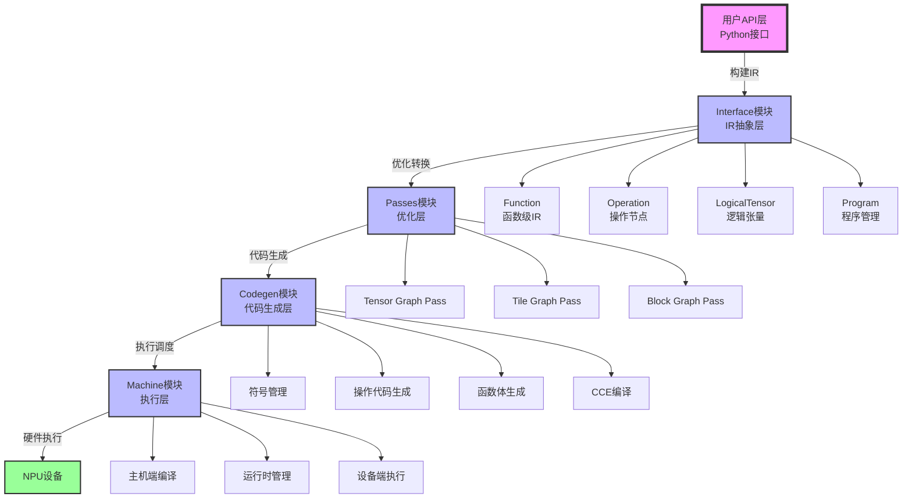
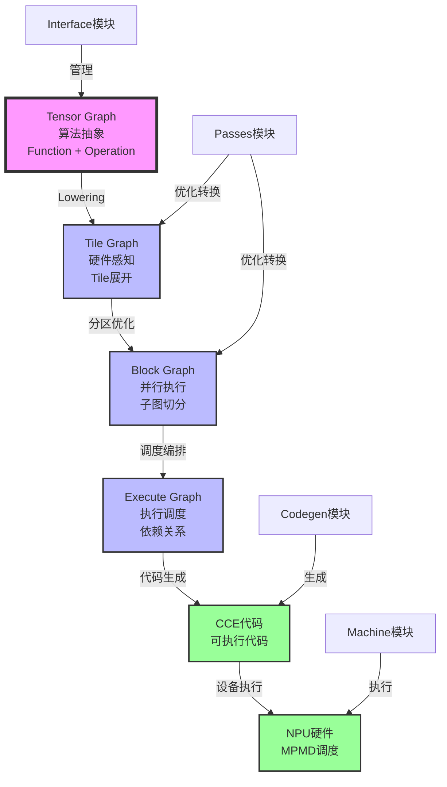
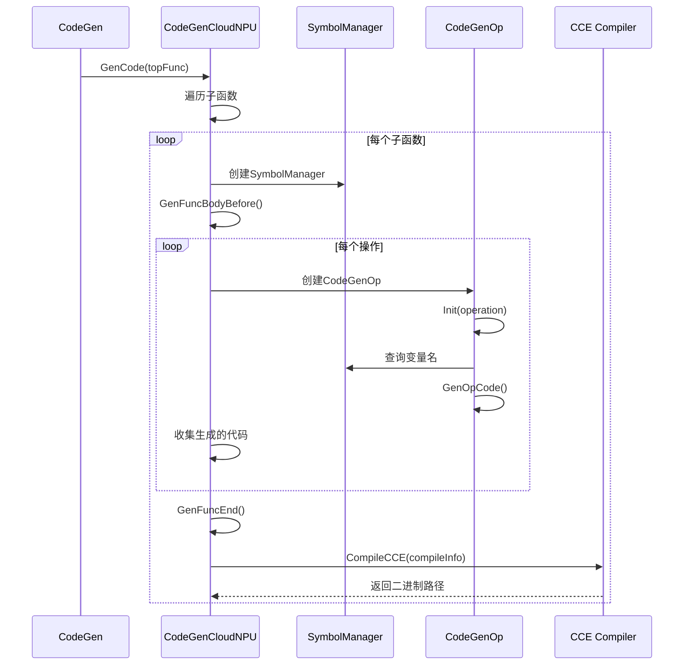
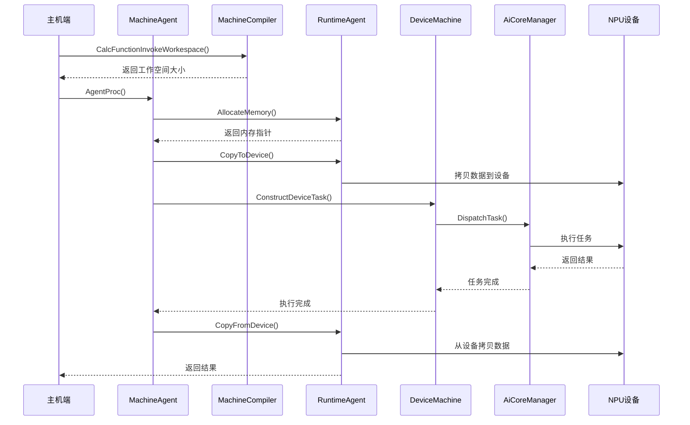
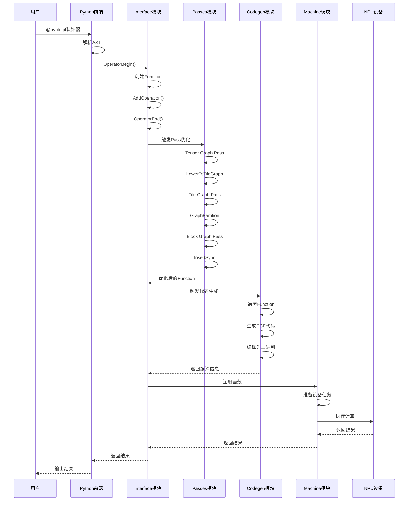
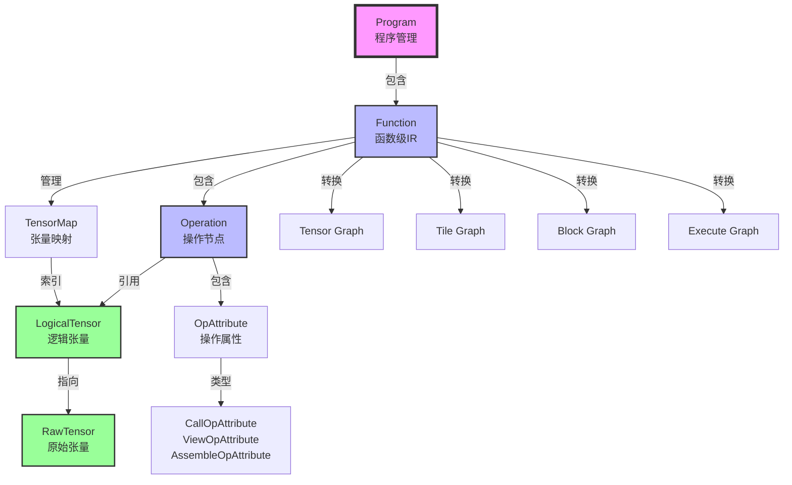
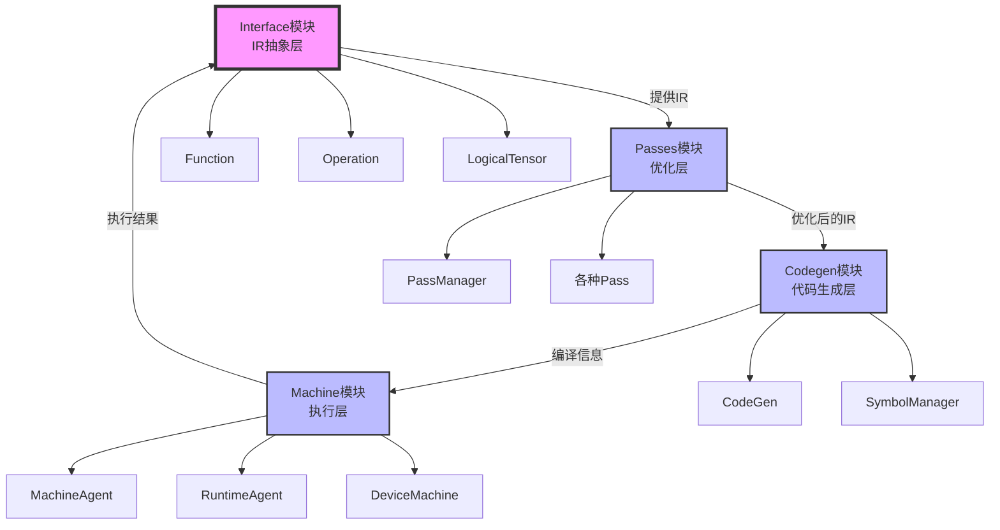
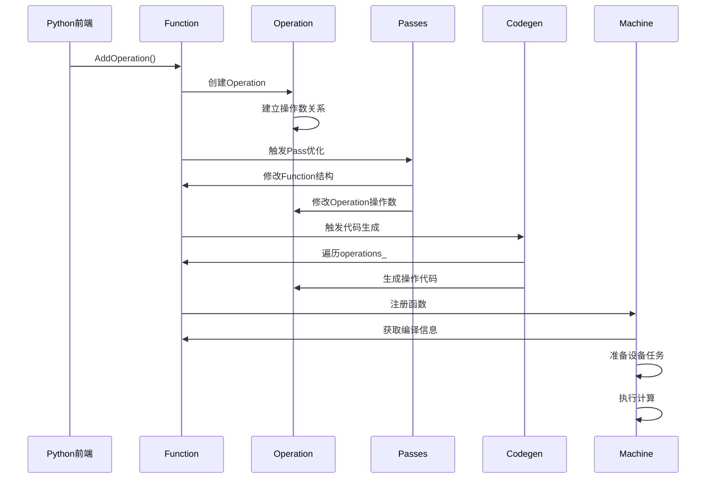

# PyPTO 框架技术文档总览

> **适用对象：** 想要全面了解PyPTO框架的开发者  
> **学习时间：** 60-90分钟  
> **前置知识：** 已阅读[上手指南](../00-getting-started/00-quick-start.md)  
> **学习目标：** 理解PyPTO整体架构、核心模块、编译流程和设计理念

## 概述

PyPTO（发音：pai p-t-o）是一款面向 AI 加速器的高性能编程框架，旨在简化复杂融合算子乃至整个模型网络的开发流程，同时保持高性能计算能力。该框架采用创新的 **PTO（Parallel Tensor/Tile Operation）编程范式**，以 **基于 Tile 的编程模型** 为核心设计理念，通过多层次的中间表示（IR）系统，将用户通过 API 构建的 AI 模型应用从高层次的 Tensor 图逐步编译成硬件指令，最终生成可在目标平台上高效执行的可执行代码。

**本文档作用：**
- **系统学习**：提供PyPTO框架的完整知识地图
- **快速定位**：通过架构图快速理解各模块职责
- **导航枢纽**：串联所有核心模块文档的导航中心
- **设计理解**：阐述关键设计决策和权衡

**本文档体系：**

本文档是 PyPTO 框架技术文档的总览，旨在为开发者提供一个完整的、由浅入深的 PyPTO 学习路径。文档体系包含以下核心模块：

- **[Function 模块](03-function.md)**：函数级 IR 的核心抽象，管理操作序列、张量映射等
- **[Operation 模块](04-operation.md)**：计算图的基本节点，表示计算操作
- **[Passes 模块](07-passes.md)**：编译优化层，负责多层级 IR 的优化和转换
- **[Codegen 模块](08-codegen.md)**：代码生成层，将优化后的 IR 转换为可执行代码
- **[Machine 模块](06-machine.md)**：执行层，负责设备端任务调度和执行

**相关文档：**

- [Framework 模块文档](01-framework.md)：Framework 模块的整体架构
- [Interface 模块文档](02-interface.md)：Interface 模块的详细说明
- [Operator 模块文档](05-operator.md)：算子实现模块
- [Build 系统文档](09-build.md)：构建系统的详细说明
- [核心概念详解](10-concepts.md)：PyPTO 核心概念和术语解释
- [Hello World 示例解析](../01-examples/00-hello-world.md)：入门示例的完整解析
- [Softmax 示例解析](../01-examples/03-softmax.md)：进阶示例的完整解析

---

## 目录

- [学习路径指南](#学习路径指南) ⭐ **建议先读**
- [文档导航](#文档导航) ⭐ **建议先读**
- [PyPTO 架构总览](#pypto-架构总览)
- [核心模块概览](#核心模块概览)
- [完整编译执行流程](#完整编译执行流程)
- [关键概念体系](#关键概念体系)
- [模块间交互关系](#模块间交互关系)
- [最佳实践](#最佳实践)

---

## 学习路径指南

### 新手入门

1. **阅读示例**：从 [Hello World 示例解析](../01-examples/00-hello-world.md) 开始，了解基本使用
2. **理解概念**：阅读 [核心概念详解](10-concepts.md) 理解核心概念
3. **理解 IR**：阅读 [Function 类技术文档](03-function.md) 理解 IR 抽象
4. **理解操作**：阅读 [Operation 类技术文档](04-operation.md) 理解操作节点

### 进阶学习

1. **理解优化**：阅读 [Passes 模块技术文档](07-passes.md) 理解编译优化
2. **理解代码生成**：阅读 [Codegen 模块技术文档](08-codegen.md) 理解代码生成
3. **理解执行**：阅读 [Machine 模块技术文档](06-machine.md) 理解执行调度

### 深入理解

1. **理解架构**：阅读 [Framework 模块文档](01-framework.md) 理解整体架构
2. **理解接口**：阅读 [Interface 模块文档](02-interface.md) 理解接口层设计
3. **理解复杂场景**：阅读 [Softmax 示例解析](../01-examples/03-softmax.md) 理解复杂场景

---

## 文档导航

### 核心模块文档

| 模块 | 文档 | 说明 |
|------|------|------|
| **Function** | [Function 类技术文档](03-function.md) | 函数级 IR 的核心抽象 |
| **Operation** | [Operation 类技术文档](04-operation.md) | 计算图的基本节点 |
| **Passes** | [Passes 模块技术文档](07-passes.md) | 编译优化层 |
| **Codegen** | [Codegen 模块技术文档](08-codegen.md) | 代码生成层 |
| **Machine** | [Machine 模块技术文档](06-machine.md) | 执行层 |

### 框架文档

| 文档 | 说明 |
|------|------|
| [Framework 模块文档](01-framework.md) | Framework 模块的整体架构 |
| [Interface 模块文档](02-interface.md) | Interface 模块的详细说明 |
| [Operator 模块文档](05-operator.md) | 算子实现模块 |

### 示例文档

| 文档 | 说明 |
|------|------|
| [Hello World 示例解析](../01-examples/00-hello-world.md) | 入门示例的完整解析 |
| [Softmax 示例解析](../01-examples/03-softmax.md) | 进阶示例的完整解析 |
| [Hello World 调试文件详解](../01-examples/02-hello-world-debug.md) | 调试文件的详细说明 |
| [Softmax 调试文件详解](../01-examples/04-softmax-debug.md) | 调试文件的详细说明 |

### 工具文档

| 文档 | 说明 |
|------|------|
| [Build 系统文档](09-build.md) | 构建系统的详细说明 |
| [核心概念详解](10-concepts.md) | PyPTO 核心概念和术语解释 |

---

## PyPTO 架构总览

**注意：** 以下架构图是概念图，用于理解整体设计，不保证一一对应源码目录结构。

### 整体架构图

PyPTO 框架采用分层架构设计，从用户 API 到底层硬件执行，共分为以下几个层次：

### 多层级 IR 系统

PyPTO 采用多层级 IR 设计，支持从高层次到低层次的逐步转换：

**IR 层级说明：**

| IR 层级 | 抽象层次 | 核心组件 | 主要优化 | 文档链接 |
|--------|---------|---------|---------|---------|
| **Tensor Graph** | 算法抽象 | `Function`、`Operation`、`LogicalTensor` | 图级优化、内存冲突推断 | [Function 模块](03-function.md)、[Operation 模块](04-operation.md)、[Tensor Graph 概念](10-concepts.md#tensor-graph张量图) |
| **Tile Graph** | 硬件感知 | Tile 操作、内存层次 | Tile 展开、内存类型分配 | [Passes 模块](07-passes.md#tile-graph-pass-详细说明)、[Tile Graph 概念](10-concepts.md#tile-graph分块图) |
| **Block Graph** | 并行执行 | 子图分区、资源管理 | 内存重用、乱序调度 | [Passes 模块](07-passes.md#block-graph-pass-详细说明)、[Block Graph 概念](10-concepts.md#block-graph块图) |
| **Execute Graph** | 执行调度 | 依赖关系、调度信息 | 同步插入、调度优化 | [Passes 模块](07-passes.md#execute-graph-pass)、[Execute Graph 概念](10-concepts.md#execute-graph执行图) |
| **CCE 代码** | 可执行代码 | CCE 函数、操作代码 | 代码优化、编译优化 | [Codegen 模块](08-codegen.md) |

---

## 核心模块概览

### 1. Function 模块

**模块定位：** IR 抽象层的核心，函数级 IR 的管理者

**核心职责：**
- 管理操作序列（`Operation` 列表）
- 管理张量映射（`TensorMap`）
- 支持多层级 IR 转换
- 提供函数哈希和缓存

**关键组件：**
- **`Function` 类**：函数级 IR 的核心抽象
  - **文档**：[Function 类技术文档](03-function.md)
  - **文件位置**：[`framework/src/interface/function/function.h`](../../../framework/src/interface/function/function.h)
  - **关键方法**：`AddOperation()`、`SortOperations()`、`ComputeHash()`、`DumpJson()`

**关键概念：**
- **`FunctionType`**：函数类型（EAGER、STATIC、DYNAMIC、DYNAMIC_LOOP 等）
- **`GraphType`**：图类型（TENSOR_GRAPH、TILE_GRAPH、BLOCK_GRAPH 等）
- **`operations_`**：操作序列，存储函数中的所有操作
- **`tensorMap_`**：张量映射表，用于内存优化和去重
- **`inCasts_`/`outCasts_`**：输入/输出张量列表

**与其他模块的关系：**
- **与 Operation**：`Function` 包含多个 `Operation`，通过 `operations_` 管理
- **与 Passes**：`Function` 是 Pass 优化的对象，Pass 通过 `Function` 接口进行优化
- **与 Codegen**：`Function` 是代码生成的输入，Codegen 遍历 `Function` 生成代码
- **与 Machine**：`Function` 的编译信息用于 Machine 模块的任务准备

**详细文档：** [Function 类技术文档](03-function.md)

---

### 2. Operation 模块

**模块定位：** 计算图的基本节点，表示计算操作

**核心职责：**
- 封装操作类型（`Opcode`）
- 管理输入输出操作数（`iOperand`/`oOperand`）
- 存储操作属性（`opAttribute_`）
- 提供操作数替换和更新接口

**关键组件：**
- **`Operation` 类**：操作的核心抽象
  - **文档**：[Operation 类技术文档](04-operation.md)
  - **文件位置**：[`framework/src/interface/operation/operation.h`](../../../framework/src/interface/operation/operation.h)
  - **关键方法**：`ReplaceInputOperand()`、`SetAttribute()`、`ComputeHash()`

**关键概念：**
- **`Opcode`**：操作码枚举，表示操作类型（`OP_ADD`、`OP_MUL`、`OP_CONV` 等）
- **`iOperand`/`oOperand`**：输入/输出操作数列表，指向 `LogicalTensor`
- **`opmagic`**：操作唯一标识符，在 `Function` 内唯一
- **`opAttribute_`**：操作特定属性（`CallOpAttribute`、`ViewOpAttribute`、`AssembleOpAttribute` 等）
- **`tileShape_`**：Tile 形状信息，用于硬件感知优化
- **`coreType_`**：核心类型（AIC、AIV、AICPU），标识操作在哪个硬件核心上执行

**操作类型分类：**
- **Vector 操作**：向量运算（`OP_ADD`、`OP_MUL`、`OP_EXP` 等）
- **Cube 操作**：矩阵运算（`OP_A_MUL_B`、`OP_CONV` 等）
- **View 操作**：视图操作（`OP_VIEW`、`OP_RESHAPE`、`OP_ASSEMBLE` 等）
- **Move 操作**：数据移动（`OP_COPY_IN`、`OP_COPY_OUT`、`OP_CONVERT` 等）
- **Call 操作**：函数调用（`OP_CALL`、`OP_CALL_NOT_EXPAND` 等）

**与其他模块的关系：**
- **与 Function**：`Operation` 属于 `Function`，通过 `Function::AddOperation()` 添加
- **与 LogicalTensor**：`Operation` 通过操作数引用 `LogicalTensor`，建立数据依赖关系
- **与 Passes**：Pass 优化通过修改 `Operation` 的操作数和属性实现
- **与 Codegen**：Codegen 遍历 `Operation` 生成对应的 CCE 代码

**详细文档：** [Operation 类技术文档](04-operation.md)

---

### 3. Passes 模块

**模块定位：** 编译优化层，负责多层级 IR 的优化和转换

**核心职责：**
- 实现 Tensor Graph 到 Tile Graph 的 Lowering
- 实现 Tile Graph 到 Block Graph 的分区
- 实现 Block Graph 到 Execute Graph 的编排
- 提供各种图优化 Pass

**关键组件：**
- **`Pass` 基类**：所有 Pass 的基类
  - **文件位置**：[`framework/src/passes/pass_interface/pass.h`](../../../framework/src/passes/pass_interface/pass.h)
  - **关键方法**：`RunOnFunction()`、`PreRun()`、`PostRun()`
- **`PassManager`**：Pass 管理器，负责 Pass 的注册和执行
  - **文件位置**：[`framework/src/passes/pass_mgr/pass_manager.h`](../../../framework/src/passes/pass_mgr/pass_manager.h)
  - **关键方法**：`RunPass()`、`RegisterPass()`

**Pass 分类：**

| Pass 类型 | 图类型 | 主要职责 | 关键 Pass | 文档链接 |
|----------|--------|---------|----------|---------|
| **Tensor Graph Pass** | TENSOR_GRAPH | 图级优化、内存冲突推断 | `InferMemoryConflict`、`AutoCast`、`RemoveRedundantReshape` | [Passes 模块](07-passes.md#tensor-graph-pass-详细说明) |
| **Tile Graph Pass** | TILE_GRAPH | Tile 级优化、图分区 | `GraphPartition`、`SubgraphToFunction`、`GenerateMoveOp` | [Passes 模块](07-passes.md#tile-graph-pass-详细说明) |
| **Block Graph Pass** | BLOCK_GRAPH | 内存重用、调度优化 | `GlobalMemoryReuse`、`OoOSchedule`、`InsertSync` | [Passes 模块](07-passes.md#block-graph-pass-详细说明) |

**关键概念：**
- **`PassType`**：Pass 类型枚举，标识 Pass 适用的图类型
- **`PassName`**：Pass 名称枚举，标识具体的 Pass
- **`PassStrategy`**：Pass 策略，定义 Pass 的执行顺序
- **`DFX`**：Dump/Log 功能，用于调试和可视化

**与其他模块的关系：**
- **与 Function**：Pass 优化 `Function`，修改其操作序列和图结构
- **与 Operation**：Pass 通过修改 `Operation` 的操作数和属性实现优化
- **与 Codegen**：Pass 优化后的 IR 是 Codegen 的输入
- **与 Machine**：Pass 优化影响 Machine 模块的任务准备和执行

**详细文档：** [Passes 模块技术文档](07-passes.md)

---

### 4. Codegen 模块

**模块定位：** 代码生成层，将优化后的 IR 转换为可执行代码

**核心职责：**
- 管理符号（变量名、类型）
- 生成操作代码（CCE 操作代码）
- 生成函数体（CCE 函数代码）
- 编译 CCE 代码为二进制

**关键组件：**
- **`CodeGen` 类**：代码生成的主入口
  - **文件位置**：[`framework/src/codegen/codegen.h`](../../../framework/src/codegen/codegen.h)
  - **关键方法**：`GenCode()`
- **`CodeGenCCE` 基类**：CCE 代码生成的基类
  - **文件位置**：[`framework/src/codegen/codegen_cce.h`](../../../framework/src/codegen/codegen_cce.h)
  - **关键方法**：`GenFuncBody()`、`GenOpCode()`
- **`CodeGenCloudNPU`**：CloudNPU 平台的代码生成实现
  - **文件位置**：[`framework/src/codegen/cloudnpu/codegen_cloudnpu.h`](../../../framework/src/codegen/cloudnpu/codegen_cloudnpu.h)
- **`SymbolManager`**：符号管理器
  - **文件位置**：[`framework/src/codegen/symbol_mgr/codegen_symbol.h`](../../../framework/src/codegen/symbol_mgr/codegen_symbol.h)
  - **关键方法**：`QueryVarNameByTensorMagic()`、`BindVarName()`

**关键概念：**
- **`CodeGenCtx`**：代码生成上下文，包含输出路径、包含路径等
- **`CompileInfo`**：编译信息，包含内核名称、二进制路径、函数声明等
- **`TileTensor`**：Tile 张量，表示生成的 CCE 代码中的张量
- **`TileTensorUsing`**：Tile 张量类型声明，用于 CCE 代码的 `using` 声明
- **`SymbolManager`**：符号管理器，管理变量名和类型绑定
- **`SKIP_OPCODE`**：跳过代码生成的操作码集合（如 `OP_SET_FLAG`、`OP_WAIT_FLAG` 等）

**代码生成流程：**

**与其他模块的关系：**
- **与 Function**：Codegen 遍历 `Function` 的操作序列生成代码
- **与 Operation**：Codegen 为每个 `Operation` 生成对应的 CCE 代码
- **与 Passes**：Codegen 接收 Pass 优化后的 IR
- **与 Machine**：Codegen 生成的二进制文件由 Machine 模块加载执行

**详细文档：** [Codegen 模块技术文档](08-codegen.md)

---

### 5. Machine 模块

**模块定位：** 执行层，负责设备端任务调度和执行

**核心职责：**
- 准备编译信息（工作空间大小、参数偏移等）
- 准备设备任务（内存分配、数据拷贝等）
- 调度任务到设备（MPMD 调度）
- 管理运行时环境（内存、流等）

**关键组件：**
- **`MachineCompiler`**：主机端编译信息准备
  - **文件位置**：[`framework/src/machine/host/machine_compiler.h`](../../../framework/src/machine/host/machine_compiler.h)
  - **关键方法**：`CalcFunctionInvokeWorkespace()`
- **`MachineAgent`**：主机端任务准备和执行
  - **文件位置**：[`framework/src/machine/runtime/machine_agent.h`](../../../framework/src/machine/runtime/machine_agent.h)
  - **关键方法**：`AgentProc()`、`PrepareWorkSpace()`、`PrepareInvokeEntry()`
- **`RuntimeAgent`**：运行时代理
  - **文件位置**：[`framework/src/machine/runtime/runtime.h`](../../../framework/src/machine/runtime/runtime.h)
  - **关键方法**：`AllocateMemory()`、`CopyToDevice()`、`CopyFromDevice()`
- **`DeviceMachine`**：设备端任务调度
  - **文件位置**：[`framework/src/machine/device/device_machine.h`](../../../framework/src/machine/device/device_machine.h)
  - **关键方法**：`DispatchTask()`、`ExecuteTask()`
- **`AiCoreManager`**：AI Core 管理
  - **文件位置**：[`framework/src/machine/device/aicore_manager.h`](../../../framework/src/machine/device/aicore_manager.h)
  - **关键方法**：`AddTask()`、`DispatchTask()`

**关键概念：**
- **`MachineCompileInfo`**：编译信息结构，包含工作空间大小、函数数量、参数偏移等
- **`DeviceAgentTask`**：设备任务封装，包含所有设备执行所需的信息
- **`InvokeParaOffset`**：参数偏移信息，用于运行时参数传递
- **`DeviceTask`**：设备任务结构，表示要在设备上执行的任务
- **`MPMD`**：Multiple Program Multiple Data，设备端的执行调度模式

**执行流程：**

**与其他模块的关系：**
- **与 Function**：Machine 模块使用 `Function` 的编译信息准备任务
- **与 Codegen**：Machine 模块加载 Codegen 生成的二进制文件
- **与 Passes**：Pass 优化影响 Machine 模块的任务准备和执行效率

**详细文档：** [Machine 模块技术文档](06-machine.md)

---

## 完整编译执行流程

### 端到端流程

从 Python 代码到 NPU 执行的完整流程：

### 各阶段详细说明

#### 阶段 1：Python 前端解析

**入口（两条前端路径）：**
- **旧版（项目内大量示例在用）**：`@pypto.jit` → `python/pypto/runtime.py::_JIT`
- **新版（函数式/更强解析能力）**：`@pypto.frontend.jit` → `python/pypto/frontend/parser/entry.py::JitCallableWrapper`

**共同的编译边界（非常关键）：**
- 两条路径最终都会调用 `pypto_impl.OperatorBegin()` / `pypto_impl.OperatorEnd()` 把“Python函数执行轨迹”固化为后端可优化的IR/缓存句柄（handler）。
- **源码位置：**
  - `python/pypto/runtime.py::_JIT.compile()`（旧版）
  - `python/pypto/frontend/parser/entry.py::JitCallableWrapper._compile_if_needed()`（新版）

**旧版 `@pypto.jit` 的实现细节（runtime侧）：**
1. `pypto_impl.DeviceInit()` 初始化后端
2. `pypto_impl.OperatorBegin()` 开始录制
3. `with pypto.options("jit_scope")` + `with pypto.function(name, *tensors)` 建立当前 Function 上下文
4. 执行被装饰函数体（此时会不断创建 Operation/LogicalTensor 等IR对象）
5. `pypto_impl.OperatorEnd(handler)` 结束录制，触发后端编译/优化链路

**新版 `@pypto.frontend.jit` 的实现细节（parser侧）：**
1. `Source(func)` 抽取源码 + 捕获闭包变量
2. `Parser.parse()` 解析AST并生成可执行的解析计划
3. 首次调用时 `OperatorBegin()` 后应用 options，再执行 `parser.execute()` 生成 `pypto.Function`

**输出（对齐后端）：**
- 一个可执行/可缓存的编译句柄（handler）以及对应的 `Function`（Tensor Graph 起始层级）

**相关文档：** [Hello World 示例解析](../01-examples/00-hello-world.md#阶段-1python-前端解析)

#### 阶段 2：Pass 优化

**入口：** `OperatorEnd()` 触发 Pass 优化

**关键组件：**
- **`PassManager`**：Pass 管理器
- **各种 Pass**：优化和转换 Pass

**主要工作：**
1. **Tensor Graph Pass**：图级优化、内存冲突推断
2. **Lowering**：Tensor Graph → Tile Graph
3. **Tile Graph Pass**：Tile 级优化、图分区
4. **分区**：Tile Graph → Block Graph
5. **Block Graph Pass**：内存重用、调度优化
6. **编排**：Block Graph → Execute Graph

**输出：** 优化后的 `Function` 对象（EXECUTE_GRAPH 类型）

**相关文档：** [Passes 模块技术文档](07-passes.md)

#### 阶段 3：代码生成

**入口：** `OperatorEnd()` 触发代码生成

**关键组件：**
- **`CodeGen`**：代码生成主入口
- **`CodeGenCloudNPU`**：CloudNPU 平台实现
- **`SymbolManager`**：符号管理器

**主要工作：**
1. 遍历 `Function` 的操作序列
2. 为每个操作生成 CCE 代码
3. 生成完整的 CCE 函数
4. 编译 CCE 代码为二进制

**输出：** CCE 二进制文件

**相关文档：** [Codegen 模块技术文档](08-codegen.md)

#### 阶段 4：设备执行

**入口：** `_run()` 或 `_run_with_npu()`

**关键组件：**
- **`MachineAgent`**：主机端任务准备
- **`RuntimeAgent`**：运行时管理
- **`DeviceMachine`**：设备端调度

**主要工作：**
1. 准备编译信息（工作空间大小、参数偏移）
2. 分配设备内存
3. 拷贝数据到设备
4. 调度任务到设备
5. 执行计算
6. 拷贝结果回主机

**输出：** 计算结果

**相关文档：** [Machine 模块技术文档](06-machine.md)

---

## 关键概念体系

### 核心概念关系图

### 关键概念详解

#### 1. Function（函数）

**定义：** 函数级 IR 的核心抽象，管理操作序列、张量映射等。

**关键特性：**
- **多层级 IR 支持**：支持 TENSOR_GRAPH、TILE_GRAPH、BLOCK_GRAPH、EXECUTE_GRAPH 等图类型
- **操作管理**：通过 `operations_` 管理操作序列
- **张量管理**：通过 `tensorMap_` 管理张量，支持内存优化
- **函数哈希**：支持函数去重和缓存

**生命周期：**
1. **创建**：`Function::BeginFunction()` 创建函数
2. **构建**：`Function::AddOperation()` 添加操作
3. **优化**：Pass 优化修改函数结构
4. **转换**：`Function::SetGraphType()` 转换图类型
5. **完成**：`Function::EndFunction()` 完成函数构建

**详细文档：** [Function 类技术文档](03-function.md)、[Function 概念](10-concepts.md#function函数)

#### 2. Operation（操作）

**定义：** 计算图的基本节点，表示一个计算操作。

**关键特性：**
- **操作码**：`Opcode` 枚举标识操作类型
- **操作数**：`iOperand`/`oOperand` 管理输入输出张量
- **属性**：`opAttribute_` 存储操作特定信息
- **Tile 形状**：`tileShape_` 存储硬件感知的 Tile 形状

**生命周期：**
1. **创建**：`Operation()` 构造函数创建操作
2. **添加到函数**：`Function::AddOperation()` 添加到函数
3. **优化**：Pass 优化修改操作的操作数和属性
4. **代码生成**：Codegen 为操作生成 CCE 代码
5. **执行**：Machine 模块执行操作

**详细文档：** [Operation 类技术文档](04-operation.md)、[Operation 概念](10-concepts.md#operation操作)

#### 3. LogicalTensor（逻辑张量）

**定义：** 对 `RawTensor` 的逻辑视图，表示张量在函数中的使用。

**关键特性：**
- **视图语义**：`LogicalTensor` 是 `RawTensor` 的视图，不拥有数据
- **偏移和形状**：`offset` 和 `shape` 定义视图的范围
- **动态形状**：支持 `SymbolicScalar` 表示动态维度
- **生产者/消费者**：记录产生和使用该张量的操作

**关键概念：**
- **`magic`**：LogicalTensor 的唯一标识符
- **`rawTensor_`**：指向底层 `RawTensor` 的指针
- **`offset`**：在 `RawTensor` 中的偏移
- **`shape`**：张量形状
- **`dynOffset_`**：动态偏移（运行时确定）
- **`dynValidShape_`**：动态有效形状（运行时确定）

**详细文档：** [Function 类技术文档](03-function.md#张量管理)、[LogicalTensor 概念](10-concepts.md#logicaltensor逻辑张量)

#### 4. RawTensor（原始张量）

**定义：** 实际的内存存储，表示底层数据。

**关键特性：**
- **数据拥有**：`RawTensor` 拥有实际的数据存储
- **内存管理**：管理数据的生命周期
- **多个视图**：一个 `RawTensor` 可以有多个 `LogicalTensor` 视图

**关键概念：**
- **`rawmagic`**：RawTensor 的唯一标识符
- **`storage_`**：存储对象，管理实际内存
- **`refCount_`**：引用计数，用于内存管理

**详细文档：** [Interface 模块文档](02-interface.md#tensor-模块)、[RawTensor 概念](10-concepts.md#rawtensor原始张量)

#### 5. Tile（Tile 数据块）

**定义：** 硬件感知的数据块，是硬件执行的基本单位。

**关键特性：**
- **硬件感知**：Tile 大小根据硬件特性确定
- **内存对齐**：Tile 必须满足硬件对齐要求（32 字节对齐）
- **并行执行**：多个 Tile 可以并行执行

**关键概念：**
- **`TileShape`**：Tile 形状，包含 CubeTile、VecTile、CommTile
- **`VecTile`**：Vector 操作的 Tile 形状
- **`CubeTile`**：Cube 操作的 Tile 形状（M、N、K 维度）
- **Tile 展开**：Tensor Graph 到 Tile Graph 的转换过程

**详细文档：** [Passes 模块文档](07-passes.md#tile-graph-pass-详细说明)、[Tile 概念](10-concepts.md#tiletile-数据块)

#### 6. Pass（优化 Pass）

**定义：** 图优化和转换的基本单元。

**关键特性：**
- **模块化设计**：每个 Pass 负责特定的优化任务
- **可组合性**：多个 Pass 可以组合成 Pass 策略
- **DFX 支持**：支持 Dump/Log 功能，便于调试

**关键概念：**
- **`PassType`**：Pass 类型，标识 Pass 适用的图类型
- **`PassName`**：Pass 名称，标识具体的 Pass
- **`PassStrategy`**：Pass 策略，定义 Pass 的执行顺序
- **`RunOnFunction()`**：Pass 的核心方法，执行优化逻辑

**详细文档：** [Passes 模块技术文档](07-passes.md)、[Pass 概念](10-concepts.md#pass优化阶段)

#### 7. CodeGen（代码生成）

**定义：** 将优化后的 IR 转换为可执行代码的过程。

**关键特性：**
- **符号管理**：管理变量名和类型绑定
- **操作代码生成**：为每个操作生成对应的 CCE 代码
- **函数体生成**：生成完整的 CCE 函数
- **编译优化**：支持并行编译和优化

**关键概念：**
- **`SymbolManager`**：符号管理器，管理变量名和类型
- **`TileTensor`**：Tile 张量，表示生成的 CCE 代码中的张量
- **`CompileInfo`**：编译信息，包含内核名称、二进制路径等
- **`CodeGenCtx`**：代码生成上下文，包含输出路径、包含路径等

**详细文档：** [Codegen 模块技术文档](08-codegen.md)、[CodeGen 概念](10-concepts.md#codegen代码生成)

#### 8. Machine（执行引擎）

**定义：** 设备端任务调度和执行的引擎。

**关键特性：**
- **主机端编译**：准备编译信息，计算工作空间大小
- **运行时管理**：管理设备内存、流等运行时资源
- **设备端调度**：MPMD 调度模式，将任务调度到设备
- **错误处理**：提供完善的错误处理和恢复机制

**关键概念：**
- **`MachineCompileInfo`**：编译信息结构
- **`DeviceAgentTask`**：设备任务封装
- **`RuntimeAgent`**：运行时代理，管理内存和流
- **`DeviceMachine`**：设备端任务调度器
- **`MPMD`**：Multiple Program Multiple Data，设备端的执行调度模式

**详细文档：** [Machine 模块技术文档](06-machine.md)、[Machine 概念](10-concepts.md#machine执行引擎)

---

## 学习路径指南

### 入门路径（由浅入深）

#### 第 1 阶段：快速上手

**目标：** 了解 PyPTO 的基本使用和整体架构

**推荐文档：**
1. [Hello World 示例解析](../01-examples/00-hello-world.md)
   - 最简单的示例，展示 PyPTO 的基本使用
   - 涵盖从编译到执行的完整流程
2. [Build 系统文档](09-build.md)
   - 了解如何编译和安装 PyPTO
   - 了解如何运行示例和测试

**关键概念：**
- `@pypto.jit` 装饰器
- `pypto.from_torch()` 张量转换
- `pypto.set_vec_tile_shapes()` Tile 形状设置

#### 第 2 阶段：理解 IR 抽象

**目标：** 理解 PyPTO 的 IR 抽象和数据结构

**推荐文档：**
1. [Function 类技术文档](03-function.md)
   - 理解函数级 IR 的核心抽象
   - 了解操作序列管理、张量管理等
2. [Operation 类技术文档](04-operation.md)
   - 理解操作节点的结构和功能
   - 了解操作数管理、属性管理等

**关键概念：**
- `Function` 类：函数级 IR 的管理者
- `Operation` 类：计算图的基本节点
- `LogicalTensor`：逻辑张量，对 `RawTensor` 的视图
- `RawTensor`：原始张量，实际的内存存储

#### 第 3 阶段：理解编译优化

**目标：** 理解 PyPTO 的编译优化流程

**推荐文档：**
1. [Passes 模块技术文档](07-passes.md)
   - 理解 Pass 框架和 Pass 分类
   - 了解 Tensor Graph、Tile Graph、Block Graph 的优化
2. [Softmax 示例解析](../01-examples/03-softmax.md)
   - 进阶示例，展示动态形状、循环结构等复杂场景
   - 了解 Pass 优化在实际场景中的应用

**关键概念：**
- Pass 框架：Pass 基类、PassManager、PassRegistry
- Tensor Graph Pass：图级优化、内存冲突推断
- Tile Graph Pass：Tile 级优化、图分区
- Block Graph Pass：内存重用、调度优化

#### 第 4 阶段：理解代码生成

**目标：** 理解 PyPTO 的代码生成流程

**推荐文档：**
1. [Codegen 模块技术文档](08-codegen.md)
   - 理解代码生成的流程和机制
   - 了解符号管理、操作代码生成等

**关键概念：**
- `SymbolManager`：符号管理器
- `CodeGenCloudNPU`：CloudNPU 平台的代码生成实现
- CCE 代码生成：从 IR 到 CCE 代码的转换

#### 第 5 阶段：理解执行调度

**目标：** 理解 PyPTO 的执行调度流程

**推荐文档：**
1. [Machine 模块技术文档](06-machine.md)
   - 理解执行层的架构和流程
   - 了解主机端编译、运行时管理、设备端调度等

**关键概念：**
- `MachineAgent`：主机端任务准备
- `RuntimeAgent`：运行时管理
- `DeviceMachine`：设备端任务调度
- MPMD 调度：设备端的执行调度模式

#### 第 6 阶段：深入理解整体架构

**目标：** 深入理解 PyPTO 的整体架构和设计理念

**推荐文档：**
1. [Framework 模块文档](01-framework.md)
   - 理解 Framework 模块的整体架构
   - 了解各模块之间的关系
2. [Interface 模块文档](02-interface.md)
   - 理解 Interface 模块的组织和功能
   - 了解各子模块的职责

**关键概念：**
- 多层级 IR 系统
- 模块化设计
- 分层抽象

---

## 模块间交互关系

### 模块依赖关系

### 数据流转换

**从 Python 代码到硬件执行的完整数据流：**

```mermaid
graph LR
    A[Python函数] -->|解析| B[Function IR<br/>TENSOR_GRAPH]
    B -->|Pass优化| C[Function IR<br/>TILE_GRAPH]
    C -->|Pass优化| D[Function IR<br/>BLOCK_GRAPH]
    D -->|Pass优化| E[Function IR<br/>EXECUTE_GRAPH]
    E -->|代码生成| F[CCE代码]
    F -->|编译| G[二进制文件]
    G -->|执行| H[NPU硬件]
    
    style A fill:#f9f,stroke:#333,stroke-width:4px
    style B fill:#bbf,stroke:#333,stroke-width:2px
    style C fill:#bbf,stroke:#333,stroke-width:2px
    style D fill:#bbf,stroke:#333,stroke-width:2px
    style E fill:#bbf,stroke:#333,stroke-width:2px
    style F fill:#9f9,stroke:#333,stroke-width:2px
    style G fill:#9f9,stroke:#333,stroke-width:2px
    style H fill:#9f9,stroke:#333,stroke-width:2px
```

### 关键接口调用链

**完整的接口调用链：**

---

## 最佳实践

### 开发流程

**推荐流程：**

1. **快速原型**：使用 Tensor Graph 层次快速实现算法
2. **性能优化**：使用 Tile Graph 层次进行性能调优
3. **深度优化**：使用 Block Graph 层次进行深度优化
4. **调试分析**：使用调试文件分析编译和执行过程

### 性能优化

**推荐做法：**

1. **合理设置 Tile 形状**：根据数据形状和硬件特性设置
2. **避免频繁编译**：使用相同形状的输入，利用缓存
3. **批量执行**：将多个操作组合到一个函数中
4. **动态形状权衡**：动态形状增加编译开销，但提高灵活性

### 调试技巧

**推荐做法：**

1. **使用调试文件**：分析 `output/` 目录下的调试文件
2. **可视化工具**：使用 `draw_swim_lane.py` 可视化执行流程
3. **Pass 分析**：对比 Pass 前后的 IR 变化
4. **性能分析**：分析 Pass 执行时间和操作周期

---

## 文档导航

### 核心模块文档

| 模块 | 文档 | 说明 |
|------|------|------|
| **Function** | [Function 类技术文档](03-function.md) | 函数级 IR 的核心抽象 |
| **Operation** | [Operation 类技术文档](04-operation.md) | 计算图的基本节点 |
| **Passes** | [Passes 模块技术文档](07-passes.md) | 编译优化层 |
| **Codegen** | [Codegen 模块技术文档](08-codegen.md) | 代码生成层 |
| **Machine** | [Machine 模块技术文档](06-machine.md) | 执行层 |

### 框架文档

| 文档 | 说明 |
|------|------|
| [Framework 模块文档](01-framework.md) | Framework 模块的整体架构 |
| [Interface 模块文档](02-interface.md) | Interface 模块的详细说明 |
| [Operator 模块文档](05-operator.md) | 算子实现模块 |

### 示例文档

| 文档 | 说明 |
|------|------|
| [Hello World 示例解析](../01-examples/00-hello-world.md) | 入门示例的完整解析 |
| [Softmax 示例解析](../01-examples/03-softmax.md) | 进阶示例的完整解析 |
| [Hello World 调试文件详解](../01-examples/02-hello-world-debug.md) | 调试文件的详细说明 |
| [Softmax 调试文件详解](../01-examples/04-softmax-debug.md) | 调试文件的详细说明 |

### 工具文档

| 文档 | 说明 |
|------|------|
| [Build 系统文档](09-build.md) | 构建系统的详细说明 |
| [核心概念详解](10-concepts.md) | PyPTO 核心概念和术语解释 |

### 文档阅读建议

**新手入门：**
1. 阅读 [Hello World 示例解析](../01-examples/00-hello-world.md) 了解基本使用
2. 阅读 [核心概念详解](10-concepts.md) 理解核心概念
3. 阅读 [Function 类技术文档](03-function.md) 理解 IR 抽象
4. 阅读 [Operation 类技术文档](04-operation.md) 理解操作节点

**进阶学习：**
1. 阅读 [Passes 模块技术文档](07-passes.md) 理解编译优化
2. 阅读 [Codegen 模块技术文档](08-codegen.md) 理解代码生成
3. 阅读 [Machine 模块技术文档](06-machine.md) 理解执行调度

**深入理解：**
1. 阅读 [Framework 模块文档](01-framework.md) 理解整体架构
2. 阅读 [Interface 模块文档](02-interface.md) 理解接口层设计
3. 阅读 [Softmax 示例解析](../01-examples/03-softmax.md) 理解复杂场景

---

## 总结

PyPTO 框架通过五个核心模块（Function、Operation、Passes、Codegen、Machine）实现了从 Python 代码到 NPU 执行的完整编译和执行流程。通过多层级 IR 系统、模块化 Pass 优化、自动化代码生成和高效的执行调度，PyPTO 实现了高性能 AI 算子开发框架。

**核心优势：**
- **分层抽象**：不同层次的开发者可以使用不同抽象层次
- **模块化设计**：各模块职责清晰，易于扩展和维护
- **自动化优化**：通过 Pass 优化自动提升性能
- **完整工具链**：提供完整的调试和分析工具

**学习建议：**
- 从简单示例开始，逐步深入理解各模块
- 结合实际代码阅读文档，加深理解
- 使用调试文件分析编译和执行过程
- 参考最佳实践进行开发和优化

---

**相关文档：**
- [核心概念详解](10-concepts.md) - PyPTO 核心概念和术语解释
- [Function 类技术文档](03-function.md)
- [Operation 类技术文档](04-operation.md)
- [Passes 模块技术文档](07-passes.md)
- [Codegen 模块技术文档](08-codegen.md)
- [Machine 模块技术文档](06-machine.md)
- [Framework 模块文档](01-framework.md)
- [Interface 模块文档](02-interface.md)
- [Hello World 示例解析](../01-examples/00-hello-world.md)
- [Softmax 示例解析](../01-examples/03-softmax.md)

