# Framework 模块技术文档

> **适用对象：** 想要了解PyPTO整体架构的开发者、框架贡献者  
> **学习时间：** 30-45分钟  
> **前置知识：** 已阅读[框架总览](00-overview.md)  
> **学习目标：** 理解Framework模块的整体结构、子模块划分和模块间协作

## 概述

`framework` 模块是 PyPTO 编译框架的核心实现层，提供了从用户 API 到硬件执行的完整编译和执行流程。该模块采用分层架构设计，通过多层级 IR 系统、模块化 Pass 优化、自动化代码生成和高效的执行调度，实现了高性能 AI 算子开发框架。

**模块职责：**
- 🏗️ **架构基础**：定义框架的整体架构和模块划分
- 🔗 **模块协调**：协调Interface、Passes、Codegen、Machine等子模块
- 📊 **流程管理**：管理从前端到后端的完整编译流程
- 🎯 **接口统一**：提供统一的对外接口

**模块位置：**
- 目录路径：[`framework`](../../../framework)
- 构建目标：`tile_fwk_interface`、`tile_fwk_compiler` 等（共享库）
- 相关文档：[Function 类详细文档](03-function.md)、[Interface 模块文档](02-interface.md)、[Machine 模块文档](06-machine.md)

### 实现细节速查（从工程视角理解“Python→C++→设备”的真实链路）

**Python 包加载时发生了什么（很关键，影响调试与崩溃定位）：**
- `python/pypto/__init__.py::_load_shared_libs()` 会按 `ASCEND_HOME_PATH` 是否存在加载不同后端库：
  - NPU：`libtile_fwk_runtime.so`
  - 无 CANN：`libtile_fwk_runtime_stub.so` + simulation 相关库

**后端能力通过 pypto_impl 暴露给 Python：**
- `pypto_impl` 是 Python 绑定层（C++/pybind），例如：
  - 编译边界：`OperatorBegin()` / `OperatorEnd()`
  - 执行边界：`GetWorkSpaceSize()` / `OperatorDeviceRunOnceDataFromDevice()`
  - options：`GetOptions()` / `SetOption()`

**你要“从源码追全链路”，建议按这条路径：**
1. Python：`python/pypto/runtime.py::_JIT`（旧版）或 `python/pypto/frontend/parser/entry.py::JitCallableWrapper`（新版）
2. Interface：`framework/src/interface/**`（Function/Operation/LogicalTensor 等IR）
3. Passes：`framework/src/passes/**`
4. Codegen：`framework/src/codegen/**`
5. Machine/Runtime：`framework/src/machine/**`

### PTO 前端（Python 解析器）开发视角：解析流水线速览

当你在排查“Python 写法为什么不能编译/IR 为什么长这样/控制流为什么被改写”时，通常需要先搞清楚前端的解析流水线（以 `@pypto.jit` / `@pypto.frontend.function` 为入口）：

1. **源代码提取（Source Extraction）**
   - 通过 `inspect` 获取被装饰函数的源码片段，保留源位置用于错误报告
2. **Python AST 解析**
   - 使用 `ast.parse()` 生成 Python 标准 AST
3. **Doc AST 转换**
   - 将 Python AST 节点转换为更稳定的 doc AST（降低 Python 版本差异带来的影响）
4. **活性分析（Liveness Analysis）**
   - 扫描变量的“最后一次使用”，为自动内存管理/删除点插入提供依据
5. **解析与 IR 生成（Parser & IR Generation）**
   - `Parser` 以 visitor 方式遍历 doc AST，生成 PTO IR；并通过 `Context` 管理作用域
6. **惰性执行（Lazy Execution）**
   - 包装器将“真正解析/编译”延迟到第一次调用，以便绑定动态 shape、进行代价模型评估等

这条链路的工程价值：
- **定位语法/语义报错**：优先看 Source/AST/doc AST 阶段的 diagnostics
- **定位控制流/动态轴行为**：重点看 Parser 的 visitor 与 Context/ExprEvaluator
- **定位“首次调用才出错”**：重点看惰性执行与缓存路径（首次 call 才会触发 compile/run）

---

## 目录

- [架构定位](#架构定位)
- [模块组织](#模块组织)
- [核心模块详解](#核心模块详解)
- [编译流程](#编译流程)
- [执行流程](#执行流程)
- [关键概念详解](#关键概念详解)
- [数据流与生命周期](#数据流与生命周期)
- [最佳实践](#最佳实践)
- [常见问题](#常见问题)

---

## 架构定位

### 在 PyPTO 框架中的位置

`framework` 模块是 PyPTO 框架的核心实现，连接用户 API 和硬件执行：

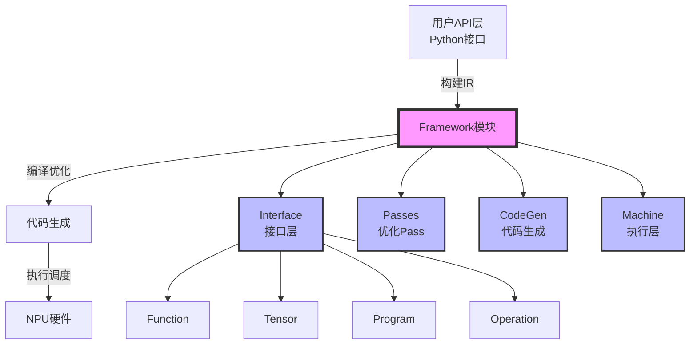

**Framework 模块职责：**

| 层次 | 模块 | 职责 | 关键组件 |
|------|------|------|---------|
| **接口层** | `interface` | 定义 IR 抽象和数据结构 | [`Function`](../../../framework/src/interface/function/function.h), [`Tensor`](../../../framework/src/interface/tensor/logical_tensor.h), [`Program`](../../../framework/src/interface/program/program.h) |
| **优化层** | `passes` | 图优化和转换 Pass | 各种优化 Pass |
| **代码生成层** | `codegen` | 生成可执行代码 | 代码生成器 |
| **执行层** | `machine` | 设备端执行和调度 | [`MachineAgent`](../../../framework/src/machine/runtime/machine_agent.h), [`DeviceMachine`](../../../framework/src/machine/device/device_machine.h) |

### 类图

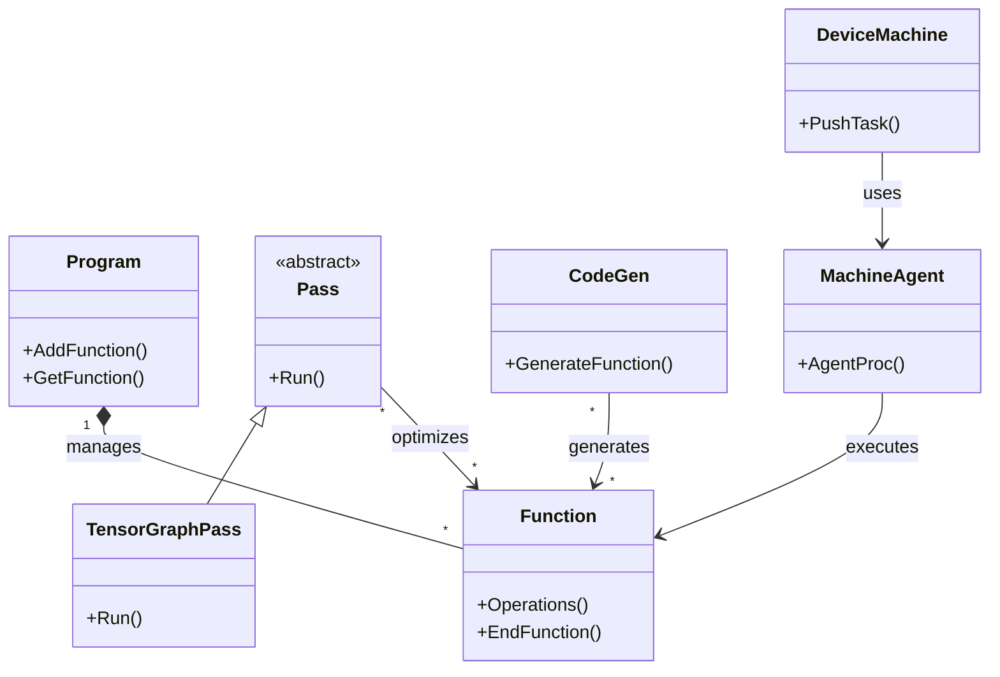

### 多层级 IR 系统

PyPTO 采用多层级 IR 设计，`framework` 模块支持从高层次到低层次的 IR 转换：

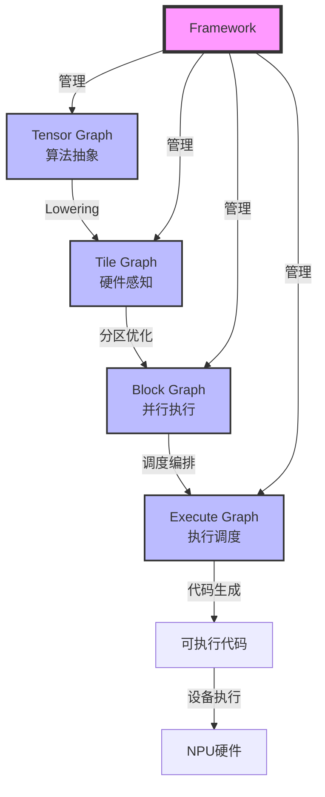

**IR 层级说明：**

- **Tensor Graph**：高层次的 Tensor 操作，贴近算法设计者的数学表达式
- **Tile Graph**：硬件感知的 Tile 操作，充分利用硬件并行性和内存层次结构
- **Block Graph**：子图分区，支持并行执行和资源管理
- **Execute Graph**：执行图，包含依赖关系和调度信息

---

## 模块组织

### 模块结构

根据 [`CMakeLists.txt`](../../../framework/CMakeLists.txt) 和 [`src/CMakeLists.txt`](../../../framework/src/CMakeLists.txt)，`framework` 模块包含以下核心子模块：

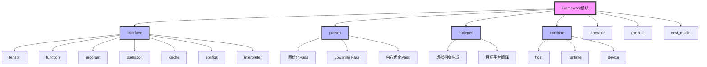

### 模块分类

#### 1. Interface 模块（接口层）

**构建目标：** `tile_fwk_interface`（共享库）

**核心组件：**

- **前端框架**：
  - **`tensor`**：张量抽象（[`LogicalTensor`](../../../framework/src/interface/tensor/logical_tensor.h), [`RawTensor`](../../../framework/src/interface/tensor/raw_tensor.h)）
  - **`function`**：函数级 IR（[`Function`](../../../framework/src/interface/function/function.h)）
  - **`program`**：程序管理（[`Program`](../../../framework/src/interface/program/program.h)）
  - **`operation`**：操作抽象（[`Operation`](../../../framework/src/interface/operation/operation.h)）
  - **`interpreter`**：解释执行器
  - **`utils`**：工具函数

- **Operation**：
  - **`operation`**：操作实现
  - **`operation/vector`**：向量操作
  - **`operation/distributed`**：分布式操作

- **Machine**：
  - **`cache`**：缓存系统（[`FunctionCache`](../../../framework/src/interface/cache/function_cache.h)）
  - **`machine`**：机器接口
  - **`registry`**：注册表

**详细文档：** 请参考 [Interface 模块文档](02-interface.md)

#### 2. Passes 模块（优化层）

**功能概述：** 提供各种图优化和转换 Pass，实现多层级 IR 的转换和优化。

**Pass 类型：**

- **Tensor Graph Pass**：Tensor 级别的优化
  - 冗余操作消除
  - 类型转换优化
  - 内存冲突推断

- **Tile Graph Pass**：Tile 级别的优化
  - Tile 展开
  - 内存类型分配
  - 移动操作生成
  - 子图切分

- **Block Graph Pass**：Block 级别的优化
  - 乱序调度（OOO）
  - 内存重用
  - 同步点插入

- **Execute Graph Pass**：执行图优化
  - 依赖关系分析
  - 调度优化

#### 3. CodeGen 模块（代码生成层）

**功能概述：** 将优化后的 IR 转换为可执行代码。

**核心功能：**

- **虚拟指令生成**：从 Execute Graph 生成 PTO 虚拟指令代码
- **目标平台编译**：将虚拟指令编译为目标平台代码

#### 4. Machine 模块（执行层）

**构建目标：** `tile_fwk_compiler`（共享库）

**核心组件：**

- **`host`**：主机端编译和任务准备
  - [`MachineCompiler`](../../../framework/src/machine/host/machine_compiler.h)：编译信息计算
  - [`DeviceAgentTask`](../../../framework/src/machine/host/device_agent_task.h)：设备任务封装

- **`runtime`**：运行时环境
  - [`MachineAgent`](../../../framework/src/machine/runtime/machine_agent.h)：设备任务准备和执行
  - [`RuntimeAgent`](../../../framework/src/machine/runtime/runtime.h)：运行时代理

- **`device`**：设备端执行
  - [`DeviceMachine`](../../../framework/src/machine/device/device_machine.h)：设备端任务调度
  - [`AiCoreManager`](../../../framework/src/machine/device/aicore_manager.h)：AI Core 管理

**详细文档：** 请参考 [Machine 模块文档](06-machine.md)

#### 5. Operator 模块（算子实现）

**功能概述：** 提供各种算子的实现。

#### 6. Execute 模块（执行相关）

**功能概述：** 提供执行相关的功能。

#### 7. Cost Model 模块（成本模型）

**功能概述：** 提供性能成本模型，用于优化决策。

---

## 核心模块详解

### Interface 模块

Interface 模块是 Framework 的基础抽象层，定义了编译流程中所需的所有核心数据结构。

#### Function 类

**文件位置：** [`interface/function/function.h`](../../../framework/src/interface/function/function.h), [`interface/function/function.cpp`](../../../framework/src/interface/function/function.cpp)

**功能概述：** `Function` 类是函数级 IR 的核心抽象，管理操作序列、张量映射、输入输出等。

**关键特性：**

- **多层级 IR 支持**：支持 TENSOR_GRAPH、TILE_GRAPH、BLOCK_GRAPH、EXECUTE_GRAPH 等图类型
- **操作管理**：支持操作的添加、排序、删除
- **张量管理**：通过 `TensorMap` 管理张量，支持内存优化
- **函数哈希**：支持函数去重和缓存

**详细文档：** 请参考 [Function 类详细文档](03-function.md)

#### Tensor 系统

**核心组件：**

- **`LogicalTensor`**：逻辑张量，表示对 `RawTensor` 的视图
  - **文件位置：** [`interface/tensor/logical_tensor.h`](../../../framework/src/interface/tensor/logical_tensor.h)
  - **关键概念：**
    - **`magic`**：LogicalTensor 的唯一标识符
    - **`offset`**：在 RawTensor 中的偏移
    - **`shape`**：张量形状
    - **`rawTensor_`**：指向底层 RawTensor 的指针

- **`RawTensor`**：原始张量，表示实际的内存存储
  - **文件位置：** [`interface/tensor/raw_tensor.h`](../../../framework/src/interface/tensor/raw_tensor.h)
  - **关键概念：**
    - **`rawmagic`**：RawTensor 的唯一标识符
    - **`storage_`**：存储对象，管理实际内存

- **`TensorMap`**：张量映射表，用于内存优化和去重
  - **文件位置：** [`interface/tensor/tensormap.h`](../../../framework/src/interface/tensor/tensormap.h)
  - **关键概念：**
    - **`ViewKey`**：视图键（形状+偏移+动态偏移）
    - **内存复用**：识别相同底层数据的多个视图

#### Program 类

**文件位置：** [`interface/program/program.h`](../../../framework/src/interface/program/program.h)

**功能概述：** `Program` 类是编译单元，管理函数集合和全局资源。

**关键特性：**

- **函数管理**：通过 `functionmap_` 管理所有函数
- **全局资源**：管理全局 ID 生成器、配置等
- **序列化**：支持 JSON 序列化和反序列化

#### Operation 系统

**核心组件：**

- **`Operation`**：操作抽象
  - **文件位置：** [`interface/operation/operation.h`](../../../framework/src/interface/operation/operation.h)
  - **关键概念：**
    - **`opcode_`**：操作码，标识操作类型
    - **`iOperand_`**：输入操作数列表
    - **`oOperand_`**：输出操作数列表
    - **`opMagic_`**：操作的唯一标识符

- **`Opcode`**：操作码枚举
  - **文件位置：** [`interface/operation/opcode.h`](../../../framework/src/interface/operation/opcode.h)

### Machine 模块

Machine 模块负责将编译后的 IR 转换为可执行代码并调度执行。

#### MachineCompiler

**文件位置：** [`machine/host/machine_compiler.h`](../../../framework/src/machine/host/machine_compiler.h)

**功能概述：** 计算函数调用的工作空间大小、参数偏移等信息。

**关键函数：**

- **`CalcFunctionInvokeWorkespace()`**：计算函数调用工作空间
  - **功能**：遍历所有核心函数，计算参数偏移和工作空间大小
  - **关键概念：**
    - **`rawTensorOffsetMap`**：RawTensor 偏移映射表，实现内存复用
    - **`InvokeParaOffset`**：调用参数偏移结构
    - **内存对齐**：512 字节对齐，用于性能优化

#### MachineAgent

**文件位置：** [`machine/runtime/machine_agent.h`](../../../framework/src/machine/runtime/machine_agent.h)

**功能概述：** 准备设备任务，包括内存分配、参数准备、拓扑准备等。

**关键函数：**

- **`AgentProc()`**：设备代理处理函数
  - **执行流程：**
    1. `PrepareWorkSpace()`：分配工作空间内存
    2. `PrepareInvokeEntry()`：准备调用入口参数
    3. `PrepareTopo()`：准备拓扑信息
    4. `PrepareCoreFunctionBin()`：准备核心函数二进制
    5. `PrepareReadyCoreFunction()`：准备就绪函数
    6. `PrepareReadyState()`：准备就绪状态
    7. `ConstructDeviceTask()`：构建设备任务
    8. `Validate()`：验证任务

**详细文档：** 请参考 [Machine 模块文档](06-machine.md)

---

## 编译流程

### 完整编译流程

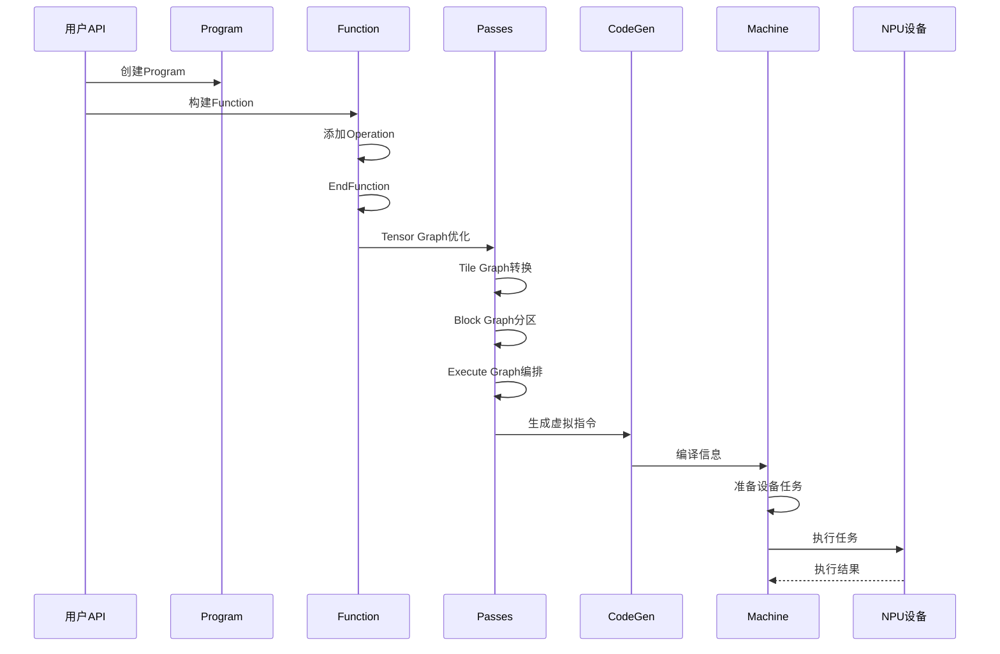

### 图类型转换流程

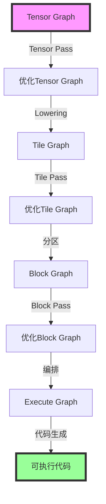

---

## 执行流程

### 完整执行流程

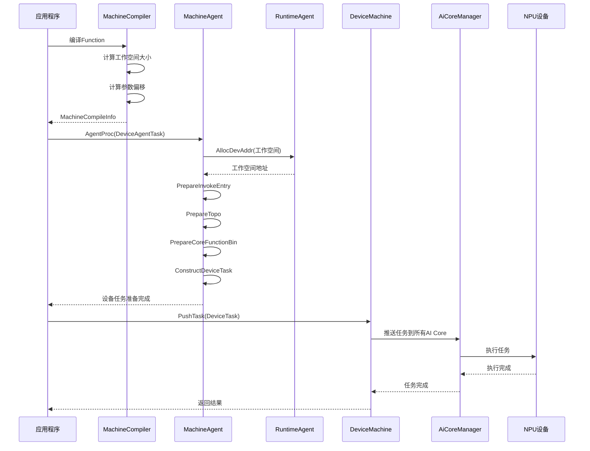

---

## 关键概念详解

### Magic ID 系统

**概念说明：** Magic ID 是 Framework 中用于唯一标识对象的全局 ID 系统。

**Magic ID 类型：**

- **`functionMagic`**：函数唯一 ID
  - **生成方式：** 通过 [`IdGen<IdType::FUNCTION>`](../../../framework/src/interface/utils/id_gen.h) 分配
  - **作用域：** 全局（Program 级别）
  - **用途：** 函数查找、函数调用、序列化

- **`opMagic`**：操作唯一 ID
  - **生成方式：** 通过 [`IdGen<IdType::OPERATION>`](../../../framework/src/interface/utils/id_gen.h) 分配
  - **作用域：** 全局（Program 级别）
  - **用途：** 操作查找、依赖分析

- **`magic`**（LogicalTensor）：逻辑张量唯一 ID
  - **生成方式：** 通过 [`IdGen<IdType::TENSOR>`](../../../framework/src/interface/utils/id_gen.h) 分配
  - **作用域：** 全局（Program 级别）
  - **用途：** 张量查找、依赖分析

- **`rawmagic`**（RawTensor）：原始张量唯一 ID
  - **生成方式：** 通过 [`IdGen<IdType::RAW_TENSOR>`](../../../framework/src/interface/utils/id_gen.h) 分配
  - **作用域：** 全局（Program 级别）
  - **用途：** 内存管理、参数传递

**Magic ID 生命周期：**

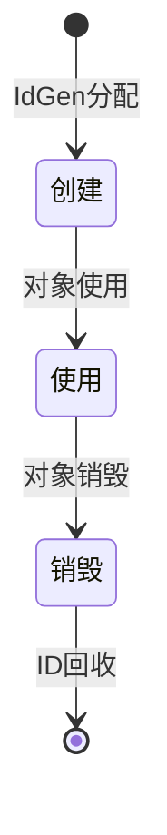

### InCast 和 OutCast

**概念说明：** InCast 和 OutCast 是 Function 的输入和输出张量。

- **InCast（输入张量）**：
  - **定义：** 函数的输入参数列表
  - **存储位置：** `Function::inCasts_`
  - **推导方式：** 通过 [`MakeIncasts()`](../../../framework/src/interface/function/function.cpp#L4355) 自动推导
  - **用途：** 参数传递、依赖分析

- **OutCast（输出张量）**：
  - **定义：** 函数的输出参数列表
  - **存储位置：** `Function::outCasts_`
  - **推导方式：** 通过 [`MakeOutcasts()`](../../../framework/src/interface/function/function.cpp#L4620) 自动推导
  - **用途：** 返回值、依赖分析

**与 `originInCasts_` / `originOutCasts_` 的区别：**

- **`originInCasts_` / `originOutCasts_`**：原始输入/输出，在 `EndFunction()` 中推导得出
- **`inCasts_` / `outCasts_`**：处理后的输入/输出，经过 VIEW/ASSEMBLE 操作处理

### VIEW 和 ASSEMBLE 操作

**概念说明：** VIEW 和 ASSEMBLE 是用于内存优化的操作。

- **VIEW 操作**：
  - **功能：** 创建一个新的 LogicalTensor，指向同一个 RawTensor 的不同视图
  - **用途：** 内存复用，避免数据拷贝
  - **实现：** 通过 [`TensorMap::View()`](../../../framework/src/interface/tensor/tensormap.h) 实现

- **ASSEMBLE 操作**：
  - **功能：** 将多个 LogicalTensor 组装成一个新的 LogicalTensor
  - **用途：** 内存优化，减少内存碎片
  - **实现：** 通过 [`TensorMap::Assemble()`](../../../framework/src/interface/tensor/tensormap.h) 实现

### 工作空间（Workspace）

**概念说明：** 工作空间是设备端用于存储临时数据和参数的内存区域。

**工作空间布局：**

```
workspaceGmAddr
├── [0, invokeParaWorkSpaceSize)        : 参数工作空间
│   ├── 参数0偏移
│   ├── 参数1偏移
│   └── ...
└── [invokeParaWorkSpaceSize, ...)      : 栈工作空间（每个AI Core独立）
    ├── AI Core 0 栈
    ├── AI Core 1 栈
    └── ...
```

**关键概念：**

- **`invokeParaWorkSpaceSize`**：调用参数工作空间大小
- **`workSpaceStackSize`**：每个 AI Core 的栈工作空间大小
- **总大小计算：** `invokeParaWorkSpaceSize + aicoreCnt * workSpaceStackSize`

### MPMD 调度

**概念说明：** MPMD（Multiple Program Multiple Data）是一种并行执行模式。

**特点：**

- 多个 AI Core 可以并行执行不同的函数
- 通过依赖关系管理执行顺序
- 支持乱序调度（OOO）优化

**调度流程：**

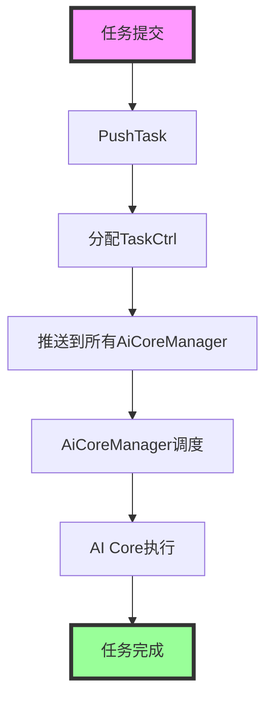

---

## 数据流与生命周期

### Function 生命周期

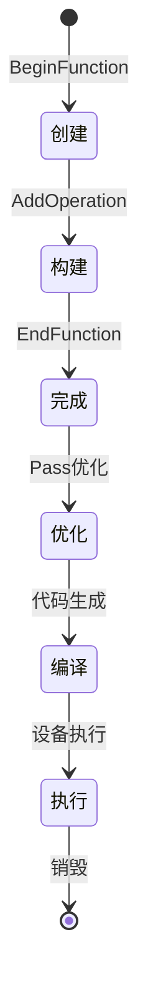

### Tensor 生命周期

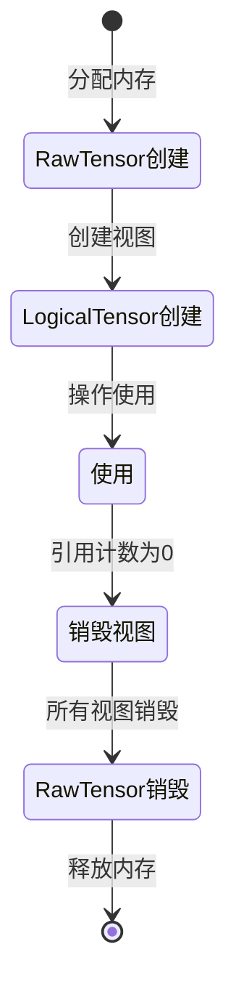

### 编译到执行的数据流

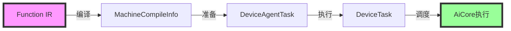

---

## 最佳实践

### 1. Function 构建

**推荐做法：**

- 使用 `BeginFunction()` 和 `EndFunction()` 明确函数边界
- 按依赖顺序添加操作
- 合理使用 VIEW 和 ASSEMBLE 操作进行内存优化

### 2. 内存管理

**推荐做法：**

- 合理设置工作空间大小
- 使用大页内存提高性能
- 注意内存对齐（512 字节）

### 3. 性能优化

**推荐做法：**

- 使用函数缓存避免重复编译
- 合理设置 AI Core 数量
- 使用 OOO 调度优化并行执行

---

## 常见问题

### 1. 函数编译失败

**问题：** 函数编译时出现错误。

**可能原因：**
- 操作依赖关系错误
- 张量形状不匹配
- 内存不足

**解决方案：**
- 检查操作依赖关系
- 验证张量形状
- 检查内存使用情况

### 2. 设备执行失败

**问题：** 设备端任务执行失败。

**可能原因：**
- 设备任务结构错误
- 参数地址错误
- 设备状态异常

**解决方案：**
- 检查设备任务结构
- 验证参数地址
- 查看设备日志

### 3. 性能问题

**问题：** 执行性能不理想。

**可能原因：**
- 工作空间设置不合理
- AI Core 利用率低
- 内存访问模式不佳

**解决方案：**
- 优化工作空间大小
- 提高 AI Core 利用率
- 优化内存访问模式

---

## 相关文档

- [Function 类详细文档](03-function.md)
- [Interface 模块文档](02-interface.md)
- [Machine 模块文档](06-machine.md)
- 示例体系与选型建议见：[仓库 examples/ 全景速览](../01-examples/01-examples-catalog.md)

---

## 总结

`framework` 模块是 PyPTO 编译框架的核心实现，提供了：

1. **完整的编译流程**：从用户 API 到硬件执行的完整流程
2. **多层级 IR 系统**：支持 Tensor Graph、Tile Graph、Block Graph、Execute Graph 等多层级 IR
3. **模块化设计**：清晰的模块划分，便于维护和扩展
4. **高效的执行调度**：MPMD 调度、OOO 调度等高级特性
5. **强大的优化能力**：各种 Pass 优化，提升执行性能

通过深入理解 `framework` 模块的设计和实现，开发者可以更好地使用 PyPTO 框架，优化算子性能，解决开发过程中的问题。

