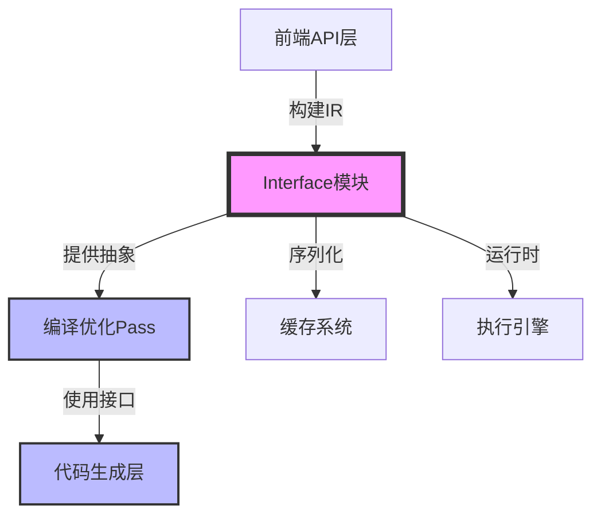
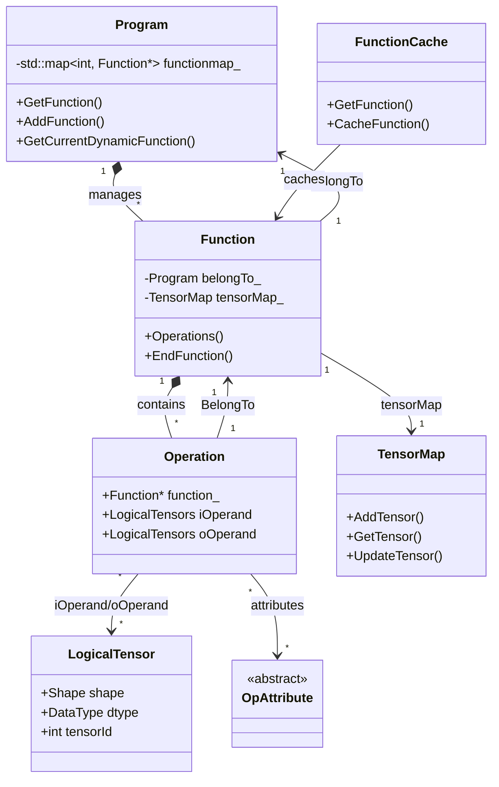
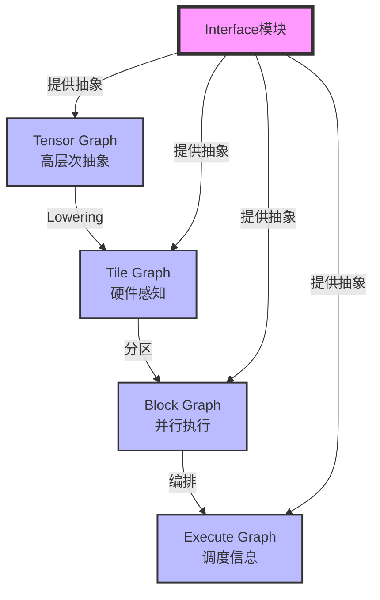
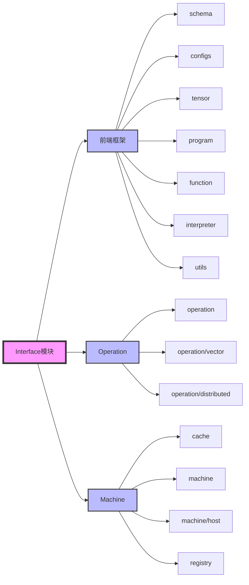
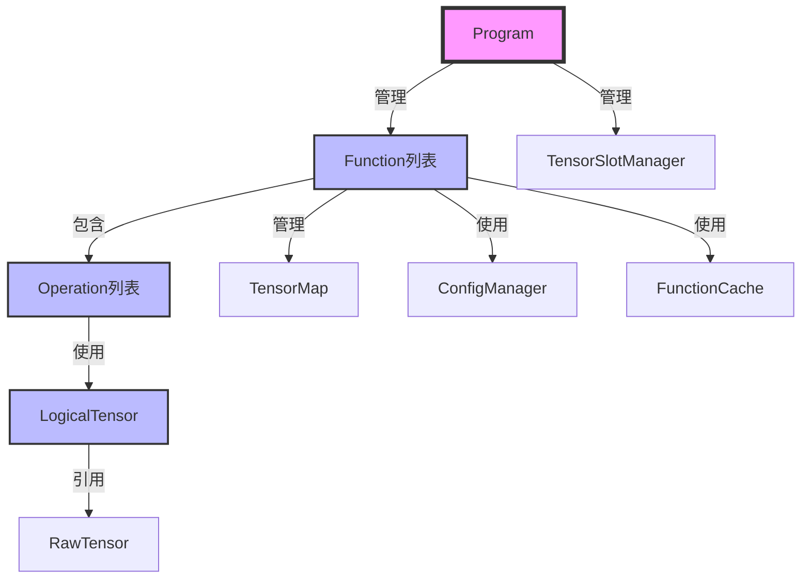
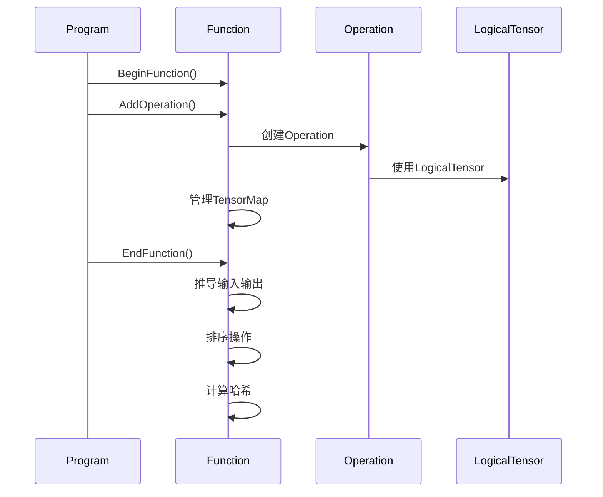
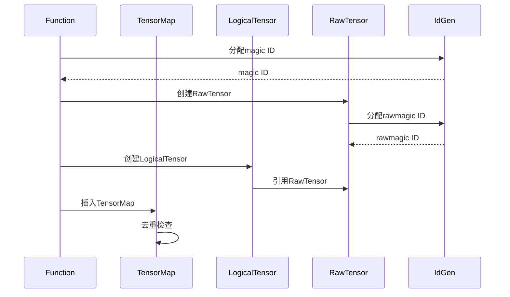
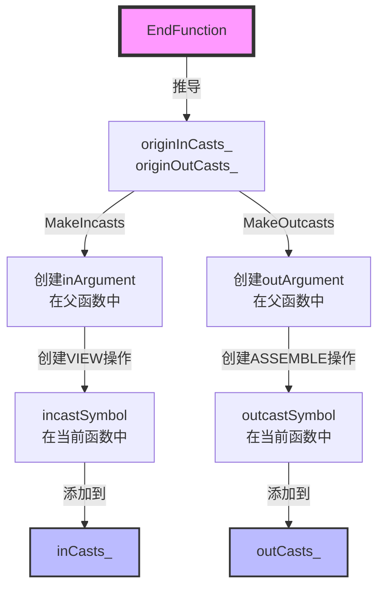
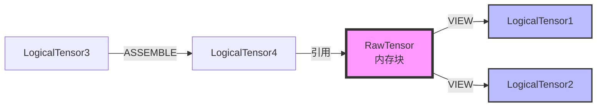
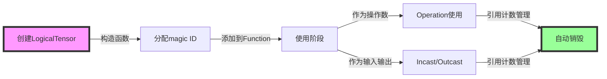

# Interface 模块技术文档

> **适用对象：** 想要深入理解IR抽象层的开发者、框架贡献者  
> **学习时间：** 40-60分钟  
> **前置知识：** 已阅读[Function模块](03-function.md)和[Operation模块](04-operation.md)  
> **学习目标：** 理解Interface模块的组织结构、核心抽象和与其他模块的接口

## 概述

`interface` 模块是 PyPTO 编译框架的核心接口层，提供了编译流程中所需的所有基础抽象和数据结构。该模块定义了多层级 IR 系统的核心组件，包括函数、操作、张量、程序等，是连接前端 API 和后端编译优化的关键桥梁。

**模块职责：**
- 📐 **IR定义**：定义Function、Operation、LogicalTensor等核心IR组件
- 🔧 **抽象接口**：提供统一的接口供Pass和Codegen使用
- 🗃️ **数据管理**：管理IR数据结构的创建、修改和销毁
- 🔄 **图转换**：支持多层级IR之间的转换

**模块位置：**
- 目录路径：[`framework/src/interface`](../../../framework/src/interface)
- 构建目标：`tile_fwk_interface`（共享库）
- 相关文档：[Function 类详细文档](03-function.md)

### 实现细节速查（IR 抽象层的“真实落点”）

**最重要的几个 C++ 类型（建议带着源码一起读）：**
- `Function`：`framework/src/interface/function/function.h`
- `Operation`：`framework/src/interface/operation/operation.h`
- `Opcode`：`framework/src/interface/operation/opcode.h`
- `LogicalTensor`：`framework/src/interface/tensor/logical_tensor.h`
- `RawTensor` / storage：位于 `framework/src/interface/tensor/` 与相关 storage 目录（以源码为准）

**Python 侧如何触发这些 IR 对象的创建：**
- 旧版 `@pypto.jit`：`python/pypto/runtime.py::_JIT.compile()` 内部的 `with pypto.function(...)` 上下文
- 新版 `@pypto.frontend.jit`：`python/pypto/frontend/parser/entry.py` 通过 Parser 执行生成 `pypto.Function`

**可直接用于“看懂 IR”的 Dump 接口：**
- `python/pypto/functions.py`：`Function.Dump()` / `DumpSSA()` / `DumpJsonFile()`

---

## 目录

- [架构定位](#架构定位)
- [模块组织](#模块组织)
- [核心模块详解](#核心模块详解)
- [模块间交互](#模块间交互)
- [关键概念详解](#关键概念详解)
- [数据流与生命周期](#数据流与生命周期)
- [最佳实践](#最佳实践)
- [常见问题](#常见问题)

---

## 架构定位

### 在编译框架中的位置

`interface` 模块在 PyPTO 编译框架中处于核心位置，连接前端 API 和后端编译优化：



**核心职责：**

| 职责 | 说明 | 关键组件 |
|------|------|---------|
| **IR 抽象** | 定义多层级 IR 的数据结构和接口 | [`Function`](../../../framework/src/interface/function/function.h), [`Operation`](../../../framework/src/interface/operation/operation.h), [`LogicalTensor`](../../../framework/src/interface/tensor/logical_tensor.h) |
| **程序管理** | 管理整个编译单元和函数集合 | [`Program`](../../../framework/src/interface/program/program.h) |
| **张量管理** | 管理张量的生命周期和内存 | [`LogicalTensor`](../../../framework/src/interface/tensor/logical_tensor.h), [`RawTensor`](../../../framework/src/interface/tensor/raw_tensor.h), [`TensorMap`](../../../framework/src/interface/tensor/tensormap.h) |
| **操作管理** | 定义和执行计算操作 | [`Operation`](../../../framework/src/interface/operation/operation.h), [`Opcode`](../../../framework/src/interface/operation/opcode.h) |
| **配置管理** | 管理编译配置和运行时参数 | [`ConfigManager`](../../../framework/src/interface/configs/config_manager.h) |
| **缓存系统** | 函数去重和编译缓存 | [`FunctionCache`](../../../framework/src/interface/cache/function_cache.h), [`Hash`](../../../framework/src/interface/cache/hash.h) |

### 类图



### 多层级 IR 支持

`interface` 模块支持 PyPTO 的多层级 IR 设计：



**图类型说明：**

- **TENSOR_GRAPH**：高层次的 Tensor 操作，贴近算法设计
- **TILE_GRAPH**：硬件感知的 Tile 操作，充分利用硬件并行性
- **BLOCK_GRAPH**：子图分区，支持并行执行和资源管理
- **EXECUTE_GRAPH**：执行图，包含依赖关系和调度信息
- **LEAF_VF_GRAPH**：叶子函数图，用于函数调用

---

## 模块组织

### 模块结构

根据 [`CMakeLists.txt`](../../../framework/src/interface/CMakeLists.txt)，`interface` 模块包含以下子模块：



### 模块分类

#### 1. 前端框架模块

**核心模块：**

- **`tensor`**：张量抽象和管理
  - [`LogicalTensor`](../../../framework/src/interface/tensor/logical_tensor.h)：逻辑张量，表示张量的逻辑视图
  - [`RawTensor`](../../../framework/src/interface/tensor/raw_tensor.h)：原始张量，表示底层数据
  - [`TensorMap`](../../../framework/src/interface/tensor/tensormap.h)：张量映射表，支持内存优化和去重
  - [`TensorSlot`](../../../framework/src/interface/tensor/tensor_slot.h)：张量槽位，用于运行时内存管理

- **`function`**：函数级 IR 管理
  - [`Function`](../../../framework/src/interface/function/function.h)：函数类，管理函数级 IR
  - 详细文档：[Function 类技术文档](03-function.md)

- **`program`**：程序级管理
  - [`Program`](../../../framework/src/interface/program/program.h)：程序类，管理整个编译单元

- **`operation`**：操作抽象
  - [`Operation`](../../../framework/src/interface/operation/operation.h)：操作类，表示计算图中的节点
  - [`Opcode`](../../../framework/src/interface/operation/opcode.h)：操作码枚举
  - [`Attribute`](../../../framework/src/interface/operation/attribute.h)：操作属性

- **`configs`**：配置管理
  - [`ConfigManager`](../../../framework/src/interface/configs/config_manager.h)：配置管理器

- **`schema`**：模式定义
  - 定义 IR 的序列化格式和验证规则

- **`interpreter`**：解释器
  - 支持 EAGER 模式的即时执行

- **`utils`**：工具函数
  - [`IdGen`](../../../framework/src/interface/utils/id_gen.h)：ID 生成器
  - 其他工具函数

#### 2. Operation 模块

- **`operation`**：核心操作实现
- **`operation/vector`**：向量化操作
- **`operation/distributed`**：分布式操作

#### 3. Machine 模块

- **`cache`**：缓存系统
  - [`FunctionCache`](../../../framework/src/interface/cache/function_cache.h)：函数缓存
  - [`Hash`](../../../framework/src/interface/cache/hash.h)：哈希计算

- **`machine`**：机器抽象
- **`machine/host`**：主机端实现
- **`registry`**：注册表

---

## 核心模块详解

### Program 模块

**文件位置：** [`program/program.h`](../../../framework/src/interface/program/program.h), [`program/program.cpp`](../../../framework/src/interface/program/program.cpp)

**核心类：** [`Program`](../../../framework/src/interface/program/program.h#L26)

**功能概述：** `Program` 类是编译单元的最高层抽象，管理整个程序的所有函数、配置和运行时资源。

#### 关键成员变量

```cpp
class Program {
    std::vector<Function *> functionSequence_;  // 函数序列
    std::map<std::string, std::shared_ptr<Function>> functionmap_;  // 函数映射表
    Function *currentFunctionPtr_;  // 当前函数指针
    std::shared_ptr<TensorSlotManager> tensorSlotManager_;  // 张量槽位管理器
    // ...
};
```

**关键概念：**

- **`functionSequence_`**：函数执行序列，按执行顺序排列
- **`functionmap_`**：函数映射表，通过函数名（magic name）查找函数
- **`currentFunctionPtr_`**：当前正在构建的函数指针
- **`tensorSlotManager_`**：张量槽位管理器，用于运行时内存管理

#### 关键方法

**`BeginFunction()`** - 开始函数构建

```cpp
bool BeginFunction(const std::string &funcName,
    const FunctionType funcType = FunctionType::STATIC,
    const GraphType graphType = GraphType::TENSOR_GRAPH,
    const std::vector<std::reference_wrapper<const Tensor>> &explicitOpArgs = {},
    bool isHiddenFunction = false);
```

**功能：** 开始构建一个新函数，初始化函数对象并设置当前函数指针。

**参数说明：**
- `funcName`：函数名称
- `funcType`：函数类型（STATIC、DYNAMIC 等）
- `graphType`：图类型（TENSOR_GRAPH、TILE_GRAPH 等）
- `explicitOpArgs`：显式输入参数（可选）
- `isHiddenFunction`：是否为隐藏函数（用于内部实现）

**`EndFunction()`** - 完成函数构建

```cpp
std::tuple<Function *, Operation *, bool> EndFunction(
    const std::string &funcName, 
    bool generateCall = true);
```

**功能：** 完成函数构建，调用 `Function::EndFunction()` 完成 IR 构建，并可选地生成调用操作。

**返回值：** `(Function*, Operation*, bool)` 元组
- `Function*`：构建完成的函数指针
- `Operation*`：生成的调用操作指针（如果 `generateCall=true`）
- `bool`：是否成功

**`GetInstance()`** - 获取单例

```cpp
static Program &GetInstance();
```

**功能：** 获取 `Program` 的单例实例。`Program` 采用单例模式，整个编译过程中只有一个 `Program` 实例。

**使用场景：**
- 全局访问：从任何地方访问 `Program` 实例
- 函数查找：通过 `GetInstance().GetCurrentFunction()` 获取当前函数
- 资源管理：访问全局资源（ID 生成器、配置等）

### Tensor 模块

**文件位置：** [`tensor/`](../../../framework/src/interface/tensor/)

**核心类：**

- [`LogicalTensor`](../../../framework/src/interface/tensor/logical_tensor.h)：逻辑张量
- [`RawTensor`](../../../framework/src/interface/tensor/raw_tensor.h)：原始张量
- [`TensorMap`](../../../framework/src/interface/tensor/tensormap.h)：张量映射表
- [`TensorSlot`](../../../framework/src/interface/tensor/tensor_slot.h)：张量槽位

#### LogicalTensor vs RawTensor

**核心区别：**

| 特性 | LogicalTensor | RawTensor |
|------|--------------|-----------|
| **抽象层次** | 逻辑视图 | 底层数据 |
| **唯一性** | 可以有多个 LogicalTensor 共享一个 RawTensor | 全局唯一 |
| **标识符** | `magic`（函数内唯一） | `rawmagic`（全局唯一） |
| **视图信息** | 包含 `offset`、`shape`、`dynOffset_` | 包含 `rawshape`、`datatype`、`format` |
| **使用场景** | 作为操作的输入输出 | 作为内存分配的基础 |

**关系图：**

```mermaid
graph LR
    A[RawTensor<br/>rawmagic=1<br/>shape=[100,200]] -->|共享| B[LogicalTensor1<br/>magic=10<br/>offset=[0,0]<br/>shape=[50,100]]
    A -->|共享| C[LogicalTensor2<br/>magic=11<br/>offset=[50,0]<br/>shape=[50,100]]
    A -->|共享| D[LogicalTensor3<br/>magic=12<br/>offset=[0,100]<br/>shape=[100,100]]
    
    style A fill:#f9f,stroke:#333,stroke-width:4px
    style B fill:#bbf,stroke:#333,stroke-width:2px
    style C fill:#bbf,stroke:#333,stroke-width:2px
    style D fill:#bbf,stroke:#333,stroke-width:2px
```

**关键概念：**

- **`magic`**：LogicalTensor 的唯一标识符，在 Function 内唯一，范围通常是 0 ~ 9999（输入张量）或 10000+（操作输出）
- **`rawmagic`**：RawTensor 的唯一标识符，全局唯一，通过 [`IdGen<IdType::RAW_TENSOR>`](../../../framework/src/interface/utils/id_gen.h) 分配
- **`offset`**：LogicalTensor 在 RawTensor 中的偏移量，用于创建视图
- **`shape`**：LogicalTensor 的形状，可能小于 RawTensor 的 `rawshape`

#### TensorMap

**功能：** 管理函数中的张量，支持内存优化和去重。

**关键特性：**

- **ViewKey**：使用 `(rawMagic, shape, offset, dynOffset)` 作为键，识别相同底层数据的多个视图
- **去重**：相同 ViewKey 的张量会被去重，实现内存复用
- **查找**：支持通过 `magic` 或 `ViewKey` 快速查找张量

**ViewKey 结构：**

```cpp
struct ViewKey {
    int rawMagic;                              // RawTensor的magic
    Shape shape;                                // 形状
    Offset offset;                              // 偏移
    std::vector<SymbolicScalar> dynOffset;     // 动态偏移
};
```

**使用场景：**
- 内存优化：识别可以共享内存的张量
- VIEW 操作：查找已存在的视图，避免重复创建
- 去重：在函数构建过程中去重相同的张量

#### TensorSlot

**功能：** 张量槽位系统，用于运行时内存管理和参数传递。

**关键概念：**

- **`TensorSlot`**：槽位对象，包含槽位 ID 和内存地址
- **`TensorSlotManager`**：槽位管理器，管理所有槽位的分配和释放
- **`TensorSlotScope`**：槽位作用域，管理函数内的槽位映射

**生命周期：**


### Operation 模块

**文件位置：** [`operation/operation.h`](../../../framework/src/interface/operation/operation.h), [`operation/operation.cpp`](../../../framework/src/interface/operation/operation.cpp)

**核心类：** [`Operation`](../../../framework/src/interface/operation/operation.h#L147)

**功能概述：** `Operation` 类是计算图中的节点，表示一个计算操作。

#### 关键成员变量

```cpp
class Operation {
    Opcode opcode_;                              // 操作码
    std::vector<std::shared_ptr<LogicalTensor>> iOperand_;  // 输入操作数
    std::vector<std::shared_ptr<LogicalTensor>> oOperand_;  // 输出操作数
    int opMagic_;                                 // 操作唯一ID
    std::shared_ptr<OpAttribute> opAttribute_;   // 操作属性
    // ...
};
```

**关键概念：**

- **`opcode_`**：操作码，表示操作的类型（如 `OP_ADD`、`OP_MUL`、`OP_CALL` 等）
- **`iOperand_`**：输入操作数列表，指向产生该操作输入的 LogicalTensor
- **`oOperand_`**：输出操作数列表，指向该操作产生的 LogicalTensor
- **`opMagic_`**：操作的唯一标识符，在 Function 内唯一，范围通常是 10000+
- **`opAttribute_`**：操作属性，包含操作特定的信息（如 `CallOpAttribute`、`AssembleOpAttribute` 等）

#### 操作类型

**常见操作类型：**

| 操作类型 | 说明 | 示例 |
|---------|------|------|
| **计算操作** | 数学运算 | `OP_ADD`、`OP_MUL`、`OP_CONV2D` |
| **内存操作** | 内存管理 | `OP_VIEW`、`OP_ASSEMBLE` |
| **控制流操作** | 控制流 | `OP_CALL`、`OP_COND`、`OP_LOOP` |
| **数据操作** | 数据变换 | `OP_RESHAPE`、`OP_TRANSPOSE` |

**特殊操作：**

- **`OP_VIEW`**：创建张量视图，实现内存复用
- **`OP_ASSEMBLE`**：组装张量，将多个张量组装成一个
- **`OP_CALL`**：函数调用，调用其他函数

### Function 模块

**详细文档：** 请参考 [Function 类技术文档](03-function.md)

**核心功能：**

- 函数级 IR 管理
- 操作序列管理
- 张量管理
- 输入输出推导
- 内存优化
- 函数哈希和缓存

---

## 模块间交互

### 交互关系图



### 典型交互流程

#### 1. 函数构建流程



#### 2. 张量创建流程



---

## 关键概念详解

### Magic ID 系统

**定义：** Magic ID 是 PyPTO 框架中用于唯一标识各种对象的整数标识符系统。

**Magic ID 的类型：**

| Magic ID 类型 | 作用域 | 生成方式 | 用途 | 代码位置 |
|--------------|--------|---------|------|---------|
| **`functionMagic_`** | Program 全局 | [`IdGen<IdType::FUNCTION>`](../../../framework/src/interface/utils/id_gen.h) | 标识 Function 对象 | [`function.h`](../../../framework/src/interface/function/function.h#L589) |
| **`magic`** (LogicalTensor) | Function 局部 | [`IdGen<IdType::LOGICAL_TENSOR>`](../../../framework/src/interface/utils/id_gen.h) | 标识 LogicalTensor | [`logical_tensor.h`](../../../framework/src/interface/tensor/logical_tensor.h#L66) |
| **`opMagic`** (Operation) | Function 局部 | 从 `opSeed_` 开始递增 | 标识 Operation | [`operation.h`](../../../framework/src/interface/operation/operation.h#L200) |
| **`rawmagic`** (RawTensor) | Program 全局 | [`IdGen<IdType::RAW_TENSOR>`](../../../framework/src/interface/utils/id_gen.h) | 标识 RawTensor | [`raw_tensor.h`](../../../framework/src/interface/tensor/raw_tensor.h) |

**ID 范围分离：**

- 输入张量的 `magic` ID 范围：0 ~ 9999
- 操作的 `opMagic` 范围：10000+
- 设计原因：避免输入张量 ID 和操作 ID 冲突

### InCast 和 OutCast

**定义：** InCast（输入张量）和 OutCast（输出张量）是函数的输入输出接口，用于函数间的数据传递。

**InCast（输入张量）：**

- **定义位置：** [`inCasts_`](../../../framework/src/interface/function/function.h#L476) 成员变量
- **创建时机：** 在 [`MakeIncasts()`](../../../framework/src/interface/function/function.cpp#L4355) 中创建
- **节点类型：** `NodeType::INCAST`
- **作用：** 表示函数的输入参数，在父函数中创建 `inArgument`，在当前函数中创建 `incastSymbol`

**OutCast（输出张量）：**

- **定义位置：** [`outCasts_`](../../../framework/src/interface/function/function.h#L477) 成员变量
- **创建时机：** 在 [`MakeOutcasts()`](../../../framework/src/interface/function/function.cpp#L4620) 中创建
- **节点类型：** `NodeType::OUTCAST`
- **作用：** 表示函数的输出参数，在父函数中创建 `outArgument`，在当前函数中创建 `outcastSymbol`

**创建流程：**



### VIEW 和 ASSEMBLE 操作

**VIEW 操作：**

- **功能：** 创建张量的视图，共享底层 RawTensor，实现内存复用
- **使用场景：** 输入参数传递、内存优化
- **实现：** [`LogicalTensor::View()`](../../../framework/src/interface/tensor/logical_tensor.cpp#L342)

**ASSEMBLE 操作：**

- **功能：** 将多个张量组装成一个张量，用于输出参数收集
- **使用场景：** 输出参数传递、数据收集
- **实现：** 在 [`MakeOutcasts()`](../../../framework/src/interface/function/function.cpp#L4620) 中创建

**内存优化机制：**



---

## 数据流与生命周期

### 函数生命周期

```mermaid
stateDiagram-v2
    [*] --> 构造: Program::BeginFunction()
    构造 --> 构建中: Function::BeginFunction()
    构建中 --> 添加操作: Function::AddOperation()
    添加操作 --> 添加操作: 继续添加
    添加操作 --> 完成构建: Function::EndFunction()
    完成构建 --> 优化: SortOperations()
    优化 --> 序列化: DumpJson()
    序列化 --> [*]
    
    note right of 构造
        分配functionMagic_
        初始化opSeed_
        创建tensorMap_
    end note
    
    note right of 完成构建
        推导输入输出
        规范化COA
        计算哈希值
    end note
```

### 张量生命周期



---

## 最佳实践

### 1. 函数构建

**推荐做法：**

```cpp
// 1. 开始函数构建
Program::GetInstance().BeginFunction("my_function", 
    FunctionType::STATIC, 
    GraphType::TENSOR_GRAPH);

// 2. 添加操作
auto result = Add(a, b);  // 内部调用 Program::AddOperation()

// 3. 完成函数构建
Program::GetInstance().EndFunction("my_function");
```

**注意事项：**
- 确保 `BeginFunction()` 和 `EndFunction()` 配对调用
- 不要在函数构建过程中手动创建 `Function` 对象
- 使用 `Program::GetCurrentFunction()` 获取当前函数

### 2. 张量管理

**推荐做法：**

- 使用 `TensorMap` 进行张量去重
- 通过 `VIEW` 操作实现内存复用
- 避免创建不必要的 `RawTensor`

**内存优化：**

```cpp
// 好的做法：使用 VIEW 复用内存
auto view = tensor.View(newShape, newOffset);

// 避免：创建新的 RawTensor
auto newTensor = LogicalTensor(function, dtype, newShape);  // 不推荐
```

### 3. 操作添加

**推荐做法：**

- 使用高级 API（如 `Add()`, `Mul()`）而非直接调用 `AddOperation()`
- 确保操作的输入输出张量属于当前函数
- 避免在操作中添加循环依赖

---

## 常见问题

### 1. Magic ID 冲突

**问题：** 输入张量的 `magic` ID 和操作的 `opMagic` 冲突。

**原因：** `opSeed_` 设置不当，导致操作 ID 落入输入张量 ID 范围。

**解决方案：** 确保 `opSeed_` 初始值为 10000，并在添加操作时正确更新。

### 2. 张量生命周期管理

**问题：** 张量在使用前被销毁。

**原因：** 未正确管理 `shared_ptr` 的引用计数。

**解决方案：** 确保操作的输入输出操作数正确引用张量，通过 `AddProducer()` 和 `AddConsumer()` 建立关系。

### 3. 函数调用参数传递

**问题：** 函数调用时参数传递错误。

**原因：** `InCast` 和 `OutCast` 未正确创建。

**解决方案：** 确保在 `EndFunction()` 中正确调用 `MakeIncasts()` 和 `MakeOutcasts()`。

---

## 相关文档

- [Function 类详细文档](03-function.md)
- [PyPTO 编程指南](../../../docs/tutorials/README.md)
- [架构设计文档](../../../docs/tutorials/introduction/简介.md)

---

## 总结

`interface` 模块是 PyPTO 编译框架的核心接口层，提供了：

1. **多层级 IR 支持**：支持从 Tensor Graph 到 Execute Graph 的多层级抽象
2. **完整的生命周期管理**：从函数构建到执行的全流程管理
3. **高效的内存优化**：通过 VIEW 和 ASSEMBLE 操作实现内存复用
4. **灵活的扩展性**：支持自定义操作和属性
5. **强大的工具支持**：序列化、缓存、调试等完整工具链

通过深入理解 `interface` 模块的设计和实现，开发者可以更好地使用 PyPTO 框架进行高效的算子开发。
