# Function 类技术文档

> **适用对象：** 想要深入理解Function模块的开发者、框架贡献者  
> **学习时间：** 45-60分钟  
> **前置知识：** 已阅读[框架总览](00-overview.md)和[核心概念](10-concepts.md)  
> **学习目标：** 理解Function的职责、数据结构、生命周期和与其他模块的交互

## 概述

`Function` 类是 PyPTO 编译框架的核心组件，负责管理函数级中间表示（IR）的构建、优化和转换。作为编译流程中的关键抽象，`Function` 类连接了前端解析、图优化、代码生成等多个编译阶段，是 PyPTO 多层级 IR 系统的重要组成部分。

**核心职责：**
- 📦 **IR管理**：管理Operation序列和LogicalTensor映射
- 🔄 **图转换**：支持多层级IR转换（Tensor Graph → Tile Graph → Block Graph）
- 🗃️ **缓存优化**：通过函数哈希实现编译缓存
- 🔗 **接口桥梁**：连接前端、Pass、Codegen、Machine等模块

**相关文件：**
- 头文件：[`function.h`](../../../framework/src/interface/function/function.h)
- 实现文件：[`function.cpp`](../../../framework/src/interface/function/function.cpp)
- 相关模块：[Operation](../../../framework/src/interface/operation/operation.h)、[Tensor](../../../framework/src/interface/tensor/logical_tensor.h)、[Program](../../../framework/src/interface/program/program.h)

---

## 目录

- [架构定位](#架构定位)
- [核心概念与数据结构](#核心概念与数据结构)
- [关键函数详解](#关键函数详解)
- [生命周期管理](#生命周期管理)
- [操作序列管理](#操作序列管理)
- [张量管理](#张量管理)
- [内存优化机制](#内存优化机制)
- [函数哈希与缓存](#函数哈希与缓存)
- [模块接口与交互](#模块接口与交互)
- [最佳实践](#最佳实践)
- [常见问题](#常见问题)

---

## 架构定位

### 在编译流程中的位置

`Function` 类在 PyPTO 编译框架中处于核心位置，连接多个编译阶段：

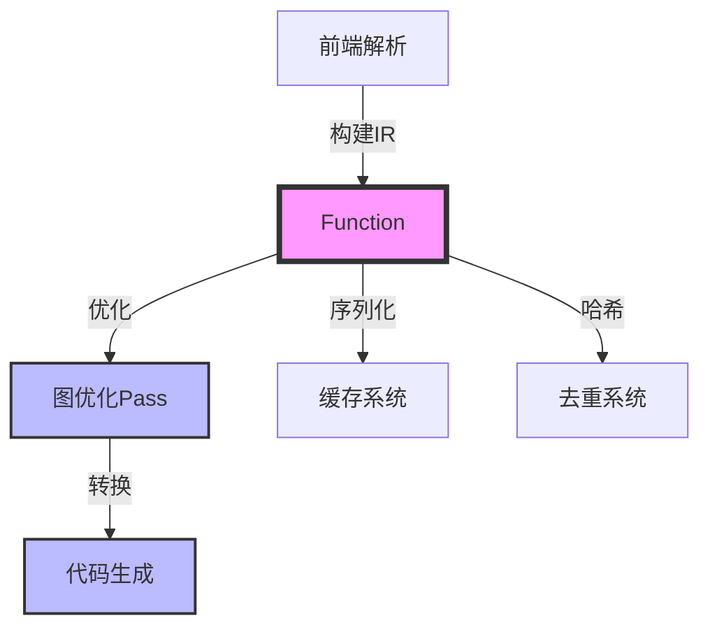

**编译阶段职责：**

| 编译阶段 | Function 类职责 | 关键方法 |
|---------|----------------|---------|
| **前端阶段** | 接收操作序列，构建函数级 IR | [`AddOperation()`](../../../framework/src/interface/function/function.cpp#L530), [`BeginFunction()`](../../../framework/src/interface/function/function.cpp#L1302) |
| **优化阶段** | 提供操作排序、依赖分析 | [`SortOperations()`](../../../framework/src/interface/function/function.cpp#L2700), [`GetSortedOperations()`](../../../framework/src/interface/function/function.cpp#L2480) |
| **转换阶段** | 支持图类型转换和 Lowering | [`SetGraphType()`](../../../framework/src/interface/function/function.h#L619), [`MakeIncasts()`](../../../framework/src/interface/function/function.cpp#L4355), [`MakeOutcasts()`](../../../framework/src/interface/function/function.cpp#L4620) |
| **代码生成** | 提供序列化和哈希计算 | [`DumpJson()`](../../../framework/src/interface/function/function.cpp#L6920), [`ComputeHash()`](../../../framework/src/interface/function/function.cpp#L3409) |
| **运行时** | COA 规范化、参数传递 | [`NormalizeCoa()`](../../../framework/src/interface/function/function.cpp#L560), [`GetOpOriginArgsInfo()`](../../../framework/src/interface/function/function.h#L471) |

### 类图

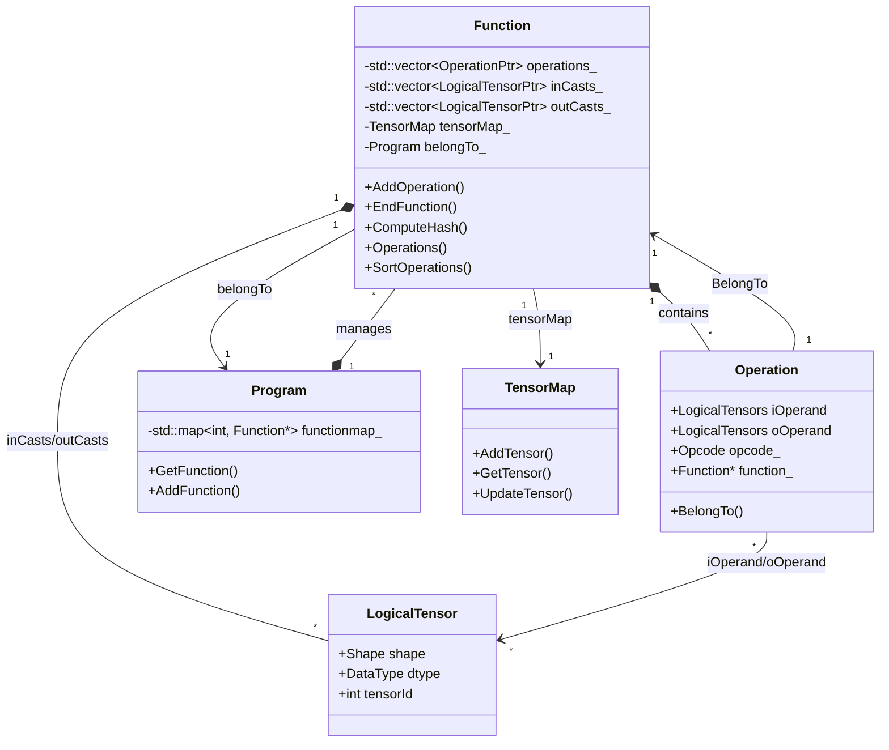

### 多层级 IR 支持

PyPTO 采用多层级 IR 设计，`Function` 类支持不同的图类型（[`GraphType`](../../../framework/src/interface/function/function.h#L52)）：

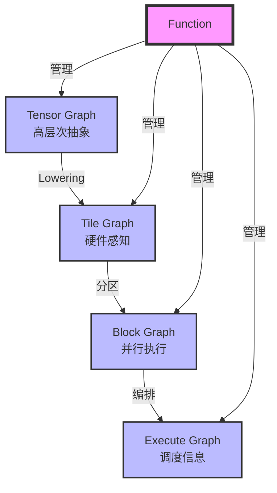

**图类型说明：**

- **TENSOR_GRAPH**：高层次的 Tensor 操作，贴近算法设计
- **TILE_GRAPH**：硬件感知的 Tile 操作，充分利用硬件并行性
- **BLOCK_GRAPH**：子图分区，支持并行执行和资源管理
- **EXECUTE_GRAPH**：执行图，包含依赖关系和调度信息
- **LEAF_VF_GRAPH**：叶子函数图，用于函数调用

---

## 核心概念与数据结构

### Function 类型

`Function` 类支持多种函数类型（[`FunctionType`](../../../framework/src/interface/function/function.h#L38)），用于表示不同的执行语义：

| 函数类型 | 说明 | 使用场景 |
|---------|------|---------|
| **EAGER** | 即时执行函数 | 调试、测试 |
| **STATIC** | 静态形状函数 | 固定形状的计算 |
| **DYNAMIC** | 动态形状函数 | 运行时确定形状 |
| **DYNAMIC_LOOP** | 动态循环函数 | 循环次数运行时确定 |
| **DYNAMIC_LOOP_PATH** | 动态循环路径函数 | 条件分支的循环 |

### 核心数据结构

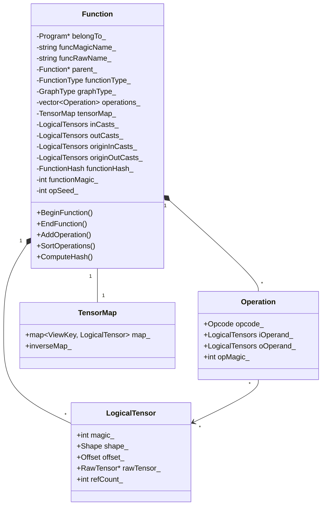

### 关键成员变量详解

#### `operations_`：操作序列

**类型：** `std::vector<std::shared_ptr<Operation>>`

**作用：** 存储函数中的所有操作，按添加顺序或拓扑排序后的顺序排列。

**关键特性：**
- 使用 `shared_ptr` 管理操作生命周期
- 支持动态添加和删除操作
- 通过 [`SortOperations()`](../../../framework/src/interface/function/function.cpp#L2700) 进行拓扑排序

**相关方法：**
- [`AddOperation()`](../../../framework/src/interface/function/function.cpp#L530)：添加操作
- [`EraseOperations()`](../../../framework/src/interface/function/function.cpp#L3269)：删除操作
- [`GetSortedOperations()`](../../../framework/src/interface/function/function.cpp#L2480)：获取排序后的操作列表

#### `tensorMap_`：张量映射表

**类型：** [`TensorMap`](../../../framework/src/interface/tensor/tensormap.h)

**作用：** 管理函数中的张量，支持内存优化和去重。

**关键特性：**
- 使用 `ViewKey`（形状+偏移+动态偏移）作为键
- 识别相同底层数据的多个视图
- 支持快速查找已存在的张量

**ViewKey 结构：**
```cpp
struct ViewKey {
    int rawMagic;                    // RawTensor的magic
    Shape shape;                      // 形状
    Offset offset;                    // 偏移
    std::vector<SymbolicScalar> dynOffset;  // 动态偏移
};
```

#### `inCasts_` / `outCasts_`：输入/输出张量列表

**类型：** `std::vector<std::shared_ptr<LogicalTensor>>`

**作用：** 存储函数的输入和输出张量。

**关键特性：**
- `inCasts_`：函数的输入参数列表
- `outCasts_`：函数的输出参数列表
- 通过 [`MakeIncasts()`](../../../framework/src/interface/function/function.cpp#L4355) 和 [`MakeOutcasts()`](../../../framework/src/interface/function/function.cpp#L4620) 自动推导

**与 `originInCasts_` / `originOutCasts_` 的区别：**
- `originInCasts_` / `originOutCasts_`：原始输入/输出，在 `EndFunction()` 中推导得出
- `inCasts_` / `outCasts_`：处理后的输入/输出，经过 VIEW/ASSEMBLE 操作处理

#### `functionHash_`：函数哈希值

**类型：** [`FunctionHash`](../../../framework/src/interface/cache/hash.h)

**作用：** 函数的唯一标识，用于去重和缓存。

**计算方式：**
- [`ComputeHash()`](../../../framework/src/interface/function/function.cpp#L3409)：顺序相关哈希
- [`ComputeHashOrderless()`](../../../framework/src/interface/function/function.cpp#L3148)：顺序无关哈希

#### `functionMagic_`：函数唯一 ID

**类型：** `int`

**作用：** 在整个 Program 中唯一标识这个 Function 对象。

**生成方式：** 通过全局 ID 生成器 [`IdGen<IdType::FUNCTION>`](../../../framework/src/interface/utils/id_gen.h) 分配。

**用途：**
- 函数查找：Program 通过 `functionMagic_` 在 `functionmap_` 中查找函数
- 函数调用：`CallOpAttribute` 中存储被调用函数的 `functionMagic_`
- 序列化：JSON 序列化时保存 `functionMagic_` 用于反序列化

#### `opSeed_`：操作种子值

**类型：** `int`

**初始值：** `FUNCTION_MAX_INCASTS` (10000)

**作用：** 用于当前 Function 内部的操作 ID 分配，确保操作 ID 不与输入张量 ID 冲突。

**关键特性：**
- 作用域：函数局部，仅用于当前 Function 内部
- 初始值：10000（确保操作 ID 不与输入张量 ID 冲突）
- 动态更新：添加操作时，如果操作 ID 超过当前值，会递增 `opSeed_`

**与 `functionMagic_` 的区别：**
- `functionMagic_`：全局唯一，标识 Function 对象
- `opSeed_`：函数局部，用于操作 ID 分配

---

## 关键函数详解

### EndFunction：函数构建完成

**函数签名：** [`FunctionCallArgs EndFunction(const std::shared_ptr<TensorSlotScope> &scope)`](../../../framework/src/interface/function/function.cpp#L1666)

**功能概述：** 这是函数构建的核心函数，负责完成函数的构建过程，包括输入输出推导、图类型处理、COA 规范化、哈希计算等。

**执行流程图：**

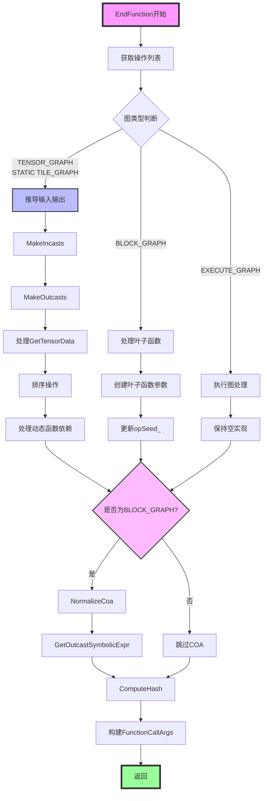

**代码详解：**

#### 第一层：准备阶段

```cpp
// 获取操作列表，false表示不排序，保持原始添加顺序
std::vector<Operation *> operationList = Operations(false).DuplicatedOpList();
```

**关键点：**
- `Operations(false)`：获取操作列表，`false` 表示不排序
- `DuplicatedOpList()`：将 `shared_ptr` 转换为原始指针列表

#### 第二层：输入输出推导（针对 TENSOR_GRAPH 和 STATIC TILE_GRAPH）

```cpp
if (IsGraphType(GraphType::TENSOR_GRAPH) ||
    IsFunctionTypeAndGraphType(FunctionType::STATIC, GraphType::TILE_GRAPH)) {
    OrderedSet<LogicalTensorPtr> incasts;
    OrderedSet<LogicalTensorPtr> outcasts;
    
    // 遍历所有操作，分析每个操作的输入输出
    for (auto &op : operationList) {
        // 分析输入操作数
        for (auto &iOperand : op->iOperand) {
            // 输入张量的判断条件：
            // 1. 操作是函数调用（OP_CALL）
            // 2. 张量不在当前函数的tensorMap中
            // 3. 张量属于其他函数
            if (op->IsCall() || 
                (tensorMap_.tensorMap_.count(iOperand->tensor->rawmagic) == 0 &&
                 (&iOperand->BelongFunction() != this))) {
                incasts.Insert(iOperand);
            }
        }
        
        // 分析输出操作数
        for (auto &oOperand : op->oOperand) {
            // 输出张量的判断条件：
            // 1. 操作是函数调用（OP_CALL）
            // 2. 张量的引用计数>0
            if (op->IsCall() || oOperand->tensor->GetRefCount() > 0) {
                outcasts.Insert(oOperand);
                // 断言：输出不能同时是输入
                ASSERT(incasts.count(oOperand) == 0);
            }
        }
    }
    
    // 添加到原始输入输出列表
    for (const auto &incast : incasts) {
        AddOriginIncast(incast);
    }
    for (const auto &outcast : outcasts) {
        AddOriginOutcast(outcast);
    }
}
```

**关键概念：**

- **`OrderedSet`**：保持插入顺序的集合，同时去重
- **输入判断条件**：
  - `op->IsCall()`：调用操作的输入来自外部
  - `tensorMap_.tensorMap_.count(...) == 0`：张量不在当前函数的 tensorMap 中
  - `&iOperand->BelongFunction() != this`：张量属于其他函数
- **输出判断条件**：
  - `op->IsCall()`：调用操作的输出需要返回
  - `oOperand->tensor->GetRefCount() > 0`：被其他操作使用

#### 第三层：根据图类型分支处理

**分支1：TENSOR_GRAPH 或 STATIC TILE_GRAPH**

```cpp
if (IsGraphType(GraphType::TENSOR_GRAPH) ||
    IsFunctionTypeAndGraphType(FunctionType::STATIC, GraphType::TILE_GRAPH)) {
    // 3.1 设置调用操作的槽位信息
    SetCallOpSlot();
    
    // 3.2 创建输入张量（Incasts）
    inArgumentList = MakeIncasts(scope);
    
    // 3.3 创建输出张量（Outcasts）
    outArgumentList = MakeOutcasts(scope);
    
    // 3.4 处理GetTensorData相关的IO描述
    auto iodescDict = GetTensorDataForTensorGraph();
    GetTensorDataRefreshIO(iodescDict);
    
    // 3.5 排序操作
    AddOperationGroup(operationList);
    SortOperations();
    ClearOperationGroups();
    
    // 3.6 处理动态函数的依赖描述
    if (Program::GetInstance().GetCurrentDynamicFunction()) {
        DyndevFunctionAttribute::ValueDependDesc desc = LookupValueDepend();
        // ... 记录依赖信息
    }
}
```

**分支2：BLOCK_GRAPH（叶子函数）**

```cpp
else if (graphType_ == GraphType::BLOCK_GRAPH) {
    // 为输出创建叶子函数的输入输出参数
    for (auto &out : outCasts_) {
        CreateLeafInAndOutCast(out, outArgumentList);
    }
    
    // 为输入创建叶子函数的输入输出参数
    for (auto &in : inCasts_) {
        CreateLeafInAndOutCast(in, inArgumentList);
    }
    
    // 更新操作种子值
    for (const auto &op : operations_) {
        opSeed_ = std::max(opSeed_, op->GetOpMagic() + 1);
    }
}
```

#### 第四层：COA 规范化（针对 BLOCK_GRAPH）

```cpp
if (graphType_ == GraphType::BLOCK_GRAPH) {
    // 规范化COA
    argList = NormalizeCoa(iOffset, oOffset);
    
    // 获取输出张量的符号表达式
    GetOutcastSymbolicExpr(outIndexToExpr);
}
```

**COA（Constant Offset Array）说明：**
- **作用**：存储张量的偏移、形状等常量信息，用于运行时参数传递
- **输入**：`iOffset`、`oOffset`（输出参数，填充偏移索引列表）
- **输出**：`argList`（参数列表的 COA 规范化结果）

#### 第五层：计算哈希并返回

```cpp
// 计算函数的唯一哈希值
ComputeHash();

// 返回函数调用所需的所有信息
return {std::move(inArgumentList), std::move(outArgumentList),
        std::move(iOffset), std::move(oOffset),
        std::move(outIndexToExpr), std::move(argList)};
```

**FunctionCallArgs 结构：**
```cpp
struct FunctionCallArgs {
    LogicalTensors iOperands;              // 输入参数列表
    LogicalTensors oOperands;               // 输出参数列表
    std::vector<int> iOpAttrOffset;         // 输入参数的COA偏移索引
    std::vector<int> oOpAttrOffset;         // 输出参数的COA偏移索引
    std::map<int, SymbolicScalar> outIndexToExpr;  // 输出索引到符号表达式的映射
    std::vector<std::vector<SymbolicScalar>> argList;  // 参数列表的COA规范化结果
};
```

### MakeIncasts：创建输入张量

**函数签名：** [`LogicalTensors MakeIncasts(const std::shared_ptr<TensorSlotScope> &scope)`](../../../framework/src/interface/function/function.cpp#L4355)

**功能概述：** 将原始输入张量转换为函数内部使用的输入张量，处理相同 `rawTensor` 的多个视图，创建 VIEW 操作连接输入参数和函数内部张量。

**执行流程图：**

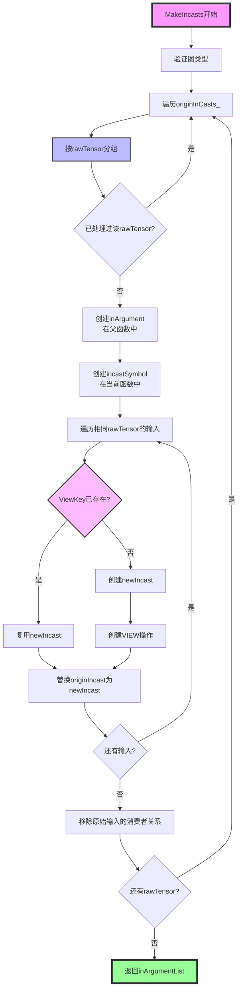

**代码详解：**

#### 第一层：预处理和验证

```cpp
// 断言检查：只有TENSOR_GRAPH或STATIC类型的TILE_GRAPH需要创建Incasts
ASSERT(IsGraphType(GraphType::TENSOR_GRAPH) || 
       IsFunctionTypeAndGraphType(FunctionType::STATIC, GraphType::TILE_GRAPH));

// 断言检查：函数必须有父函数
ASSERT(HasParent());
```

#### 第二层：数据结构和初始化

```cpp
LogicalTensors inArgumentList;  // 存储父函数中的输入参数列表
std::unordered_set<int> appearedRawIncasts;  // 记录已出现的rawTensor magic
std::vector<std::shared_ptr<RawTensor>> rawIncasts;  // 存储唯一的rawTensor列表
std::map<int, std::vector<std::shared_ptr<LogicalTensor>>> incastWithSameRaw;  // 按rawMagic分组
std::map<std::shared_ptr<RawTensor>, std::shared_ptr<LogicalTensor>> rawToIncast;  // rawTensor到原始输入的映射
```

**关键数据结构：**
- **`incastWithSameRaw`**：按 `rawMagic` 分组，相同 `rawTensor` 的输入会被合并处理
- **`rawToIncast`**：建立 `rawTensor` 到原始输入的映射，用于后续查找

#### 第三层：遍历原始输入，按 rawTensor 分组

```cpp
for (auto &originIncast : originInCasts_) {
    // 将输入按rawTensor分组
    incastWithSameRaw[originIncast->tensor->rawmagic].emplace_back(originIncast);
    
    // 检查是否已处理过这个rawTensor
    if (appearedRawIncasts.count(originIncast->tensor->rawmagic) != 0) {
        continue;
    }
    
    // 记录新的rawTensor
    appearedRawIncasts.emplace(originIncast->tensor->rawmagic);
    rawIncasts.emplace_back(originIncast->tensor);
    rawToIncast[originIncast->tensor] = originIncast;
}
```

#### 第四层：创建输入参数和符号

```cpp
for (auto &rawIncast : rawIncasts) {
    // 4.1 在父函数中创建inArgument
    auto inArgument = Parent().CreateIncastTensor(
        rawIncast, 
        rawToIncast[rawIncast]->GetShape(),
        rawToIncast[rawIncast]->GetOffset(),
        // ...
    );
    inArgumentList.push_back(inArgument);
    
    // 4.2 在当前函数中创建incastSymbol
    auto incastSymbol = CreateIncastTensor(
        rawIncast,
        rawToIncast[rawIncast]->GetShape(),
        rawToIncast[rawIncast]->GetOffset(),
        // ...
    );
    inCasts_.push_back(incastSymbol);
    
    // 4.3 处理相同rawTensor的多个输入
    for (auto &originIncast : incastWithSameRaw[rawIncast->rawmagic]) {
        // 构建ViewKey
        ViewKey viewKey = {
            rawIncast->rawmagic,
            originIncast->GetShape(),
            originIncast->GetOffset(),
            originIncast->GetDynOffset()
        };
        
        // 查找是否已存在相同的ViewKey
        auto it = tensorMap_.tensorMap_.find(viewKey);
        if (it != tensorMap_.tensorMap_.end()) {
            // 复用已存在的newIncast
            auto newIncast = it->second;
            // 替换originIncast为newIncast
            SubstituteIn(originIncast, newIncast);
        } else {
            // 创建新的newIncast
            auto newIncast = CreateIncastTensor(/* ... */);
            // 创建VIEW操作
            CreateFromIncast(incastSymbol, newIncast, originIncast);
            // 替换originIncast为newIncast
            SubstituteIn(originIncast, newIncast);
        }
    }
}
```

**关键概念：**

- **`inArgument`**：父函数中的参数，用于函数调用时传递输入数据
- **`incastSymbol`**：当前函数中的输入符号，类型为 `NodeType::INCAST`
- **`newIncast`**：函数内部使用的输入张量，通过 VIEW 操作连接到 `incastSymbol`
- **`ViewKey`**：由形状、偏移、动态偏移组成，用于识别相同底层数据的多个视图

### MakeOutcasts：创建输出张量

**函数签名：** [`LogicalTensors MakeOutcasts(const std::shared_ptr<TensorSlotScope> &scope)`](../../../framework/src/interface/function/function.cpp#L4620)

**功能概述：** 将原始输出张量转换为函数内部使用的输出张量，处理相同 `rawTensor` 的多个输出，创建 ASSEMBLE 操作收集函数内部张量到输出。

**执行流程：**

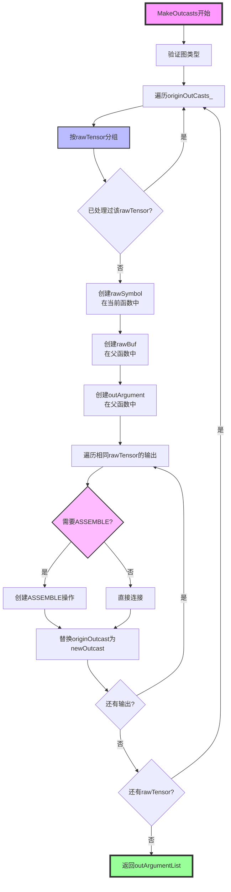

**关键步骤：**

1. **创建 rawSymbol**：在当前函数中创建输出符号
2. **创建 rawBuf**：在父函数中创建输出缓冲区
3. **创建 outArgument**：在父函数中创建输出参数
4. **处理相同 rawTensor 的多个输出**：
   - 如果多个输出需要组装，创建 ASSEMBLE 操作
   - 如果只有一个输出，直接连接

### SortOperations：拓扑排序

**函数签名：** [`void SortOperations()`](../../../framework/src/interface/function/function.cpp#L2700)

**功能概述：** 对操作序列进行拓扑排序，确保操作按照依赖关系正确排列。

**执行流程：**

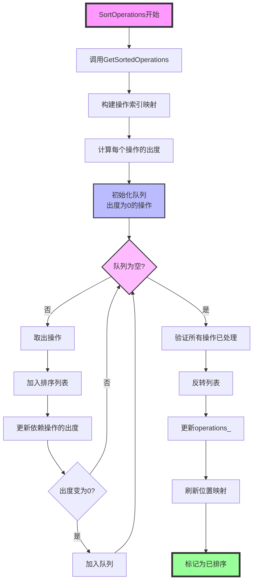

**关键实现：** [`GetSortedOperations()`](../../../framework/src/interface/function/function.cpp#L2480)

**算法说明：**
- **Kahn 算法**：使用队列进行 BFS 遍历
- **出度计算**：出度表示该操作被多少个其他操作依赖
- **操作组约束**：支持操作组内的相对顺序约束
- **GetTensorData 依赖**：处理 `GetTensorData` 使用依赖

---

## 生命周期管理

### 函数构建流程

`Function` 对象的生命周期包括构建、优化、序列化等阶段：

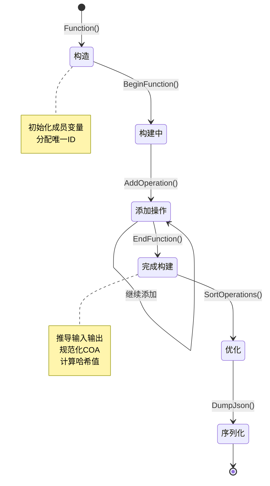

### BeginFunction：函数构建开始

**函数签名：** [`void BeginFunction(const std::vector<std::reference_wrapper<const Tensor>>& explicitOpArgs)`](../../../framework/src/interface/function/function.cpp#L1302)

**功能说明：**
- 初始化函数构建环境
- 处理显式操作参数（`explicitOpArgs`）
- 设置函数状态为构建中

**关键代码：**
```cpp
void Function::BeginFunction(...) {
    auto slotManager = Program::GetInstance().GetTensorSlotManager();
    
    for (auto &arg : explicitOpArgs) {
        // 为Tensor创建槽位对象
        explicitArgSlots_.push_back(TensorSlot::CreateTensor(arg));
        
        // 记录Tensor的实际数据地址
        explicitArgAddrs_.push_back(arg.get().GetData());
    }
}
```

**关键概念：**
- **`TensorSlotManager`**：管理所有 Tensor 的内存槽位分配和查找
- **`explicitArgSlots_`**：显式参数的槽位列表
- **`explicitArgAddrs_`**：显式参数的数据地址列表

---

## 操作序列管理

### 操作添加

**函数签名：** [`Operation& AddOperation(...)`](../../../framework/src/interface/function/function.cpp#L530)

**功能说明：**
- 添加操作到函数中
- 建立操作的输入输出关系
- 更新张量的生产者-消费者关系

**依赖关系建立：**

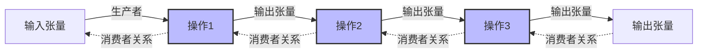

### 操作删除

**函数签名：** [`void EraseOperations(bool eraseRelatedTensor, bool sorted)`](../../../framework/src/interface/function/function.cpp#L3269)

**功能说明：**
- 删除标记为删除的操作
- 可选删除相关张量
- 可选重新排序

**删除模式：**

| 模式 | 说明 | 使用场景 |
|-----|------|---------|
| **基于标志删除** | 删除 `IsDeleted()` 为 true 的操作 | 图优化、Pass 转换 |
| **基于删除器删除** | 使用自定义删除器函数 | 条件删除、批量删除 |

---

## 张量管理

### TensorMap：张量映射表

`TensorMap` 是 `Function` 类中用于管理张量的核心数据结构，支持：

- **内存优化**：通过 `ViewKey` 识别相同底层数据的多个视图
- **去重**：避免创建重复的张量对象
- **查找**：快速查找已存在的张量

**查找逻辑：**

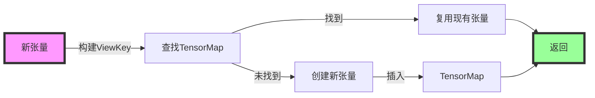

---

## 内存优化机制

### VIEW 操作：内存视图

`VIEW` 操作用于创建张量的视图，共享底层内存，避免数据拷贝。

**使用场景：**
- 多个操作需要访问同一个张量的不同部分
- 输入张量的多个视图

**内存布局示例：**

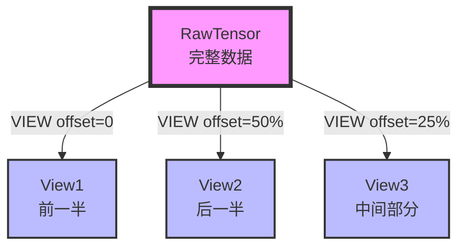

### ASSEMBLE 操作：内存组装

`ASSEMBLE` 操作用于将多个部分数据组装成完整张量，支持部分更新。

**使用场景：**
- 多个操作产生同一个张量的不同部分
- 输出张量的部分更新

**组装逻辑：**

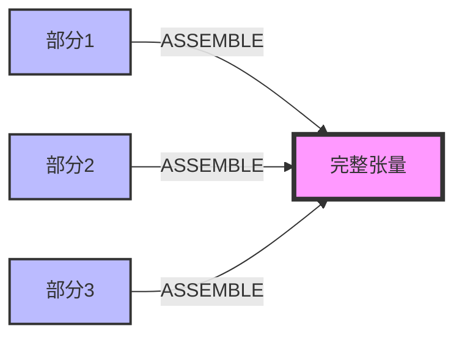

### ConnectWithOverlap：重叠检测

**函数签名：** [`std::shared_ptr<LogicalTensor> ConnectWithOverlap(...)`](../../../framework/src/interface/function/function.cpp#L3719)

**功能说明：**
- 检测输入操作数是否与现有张量重叠
- 如果重叠，创建 `VIEW` 或 `ASSEMBLE` 操作复用内存
- 否则返回 `nullptr`

**重叠检测流程：**

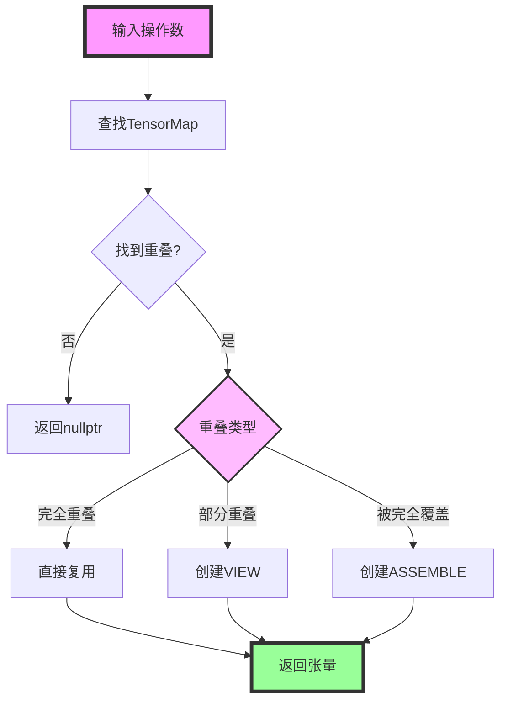

---

## 函数哈希与缓存

### 哈希计算

`Function` 类提供两种哈希计算方式：

#### ComputeHash：顺序相关哈希

**函数签名：** [`FunctionHash ComputeHash()`](../../../framework/src/interface/function/function.cpp#L3409)

**特点：**
- 考虑操作的执行顺序
- 用于精确匹配和缓存查找

**哈希组成：**
- 函数类型和图类型
- 函数名称
- 操作序列（按执行顺序）
- 张量信息

#### ComputeHashOrderless：顺序无关哈希

**函数签名：** [`unsigned long ComputeHashOrderless() const`](../../../framework/src/interface/function/function.cpp#L3148)

**特点：**
- 不考虑操作顺序，只考虑操作内容
- 用于语义等价判断

**应用场景：**
- 函数去重
- 语义等价检测
- 优化机会识别

### 哈希计算流程

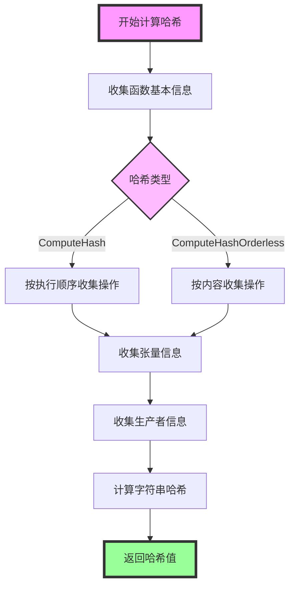

### 缓存机制

函数哈希值用于：
- **去重**：识别相同的函数，避免重复编译
- **缓存**：使用哈希值作为缓存键
- **版本管理**：跟踪函数变更

---

## 模块接口与交互

### 与 Program 模块的交互

`Function` 类通过 `belongTo_` 成员访问 [`Program`](../../../framework/src/interface/program/program.h) 对象：

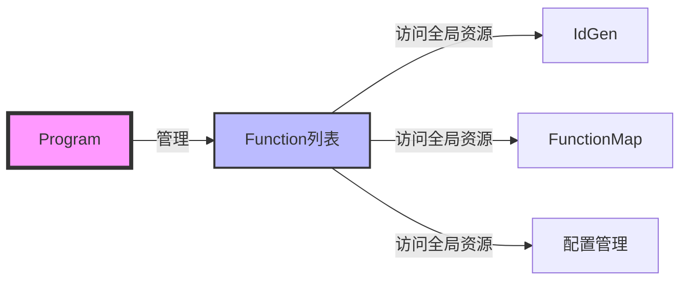

**关键接口：**
- `belongTo_->GetIdGen()`：获取 ID 生成器
- `belongTo_->GetFunctionMap()`：获取函数映射表
- `belongTo_->GetConfig()`：获取配置信息

### 与 Operation 模块的交互

`Function` 类管理 [`Operation`](../../../framework/src/interface/operation/operation.h) 对象序列：

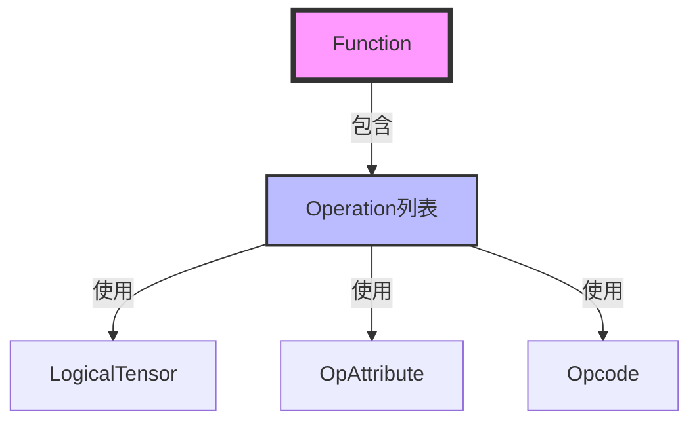

**关键接口：**
- [`AddOperation()`](../../../framework/src/interface/function/function.cpp#L530)：添加操作
- [`GetOpByOpMagic()`](../../../framework/src/interface/function/function.h#L638)：根据 magic 查找操作
- [`FindConsumers()`](../../../framework/src/interface/function/function.cpp#L6665)/[`FindProducers()`](../../../framework/src/interface/function/function.cpp#L6680)：查找依赖关系

### 与 Tensor 模块的交互

`Function` 类管理 [`LogicalTensor`](../../../framework/src/interface/tensor/logical_tensor.h) 和 [`RawTensor`](../../../framework/src/interface/tensor/raw_tensor.h)：

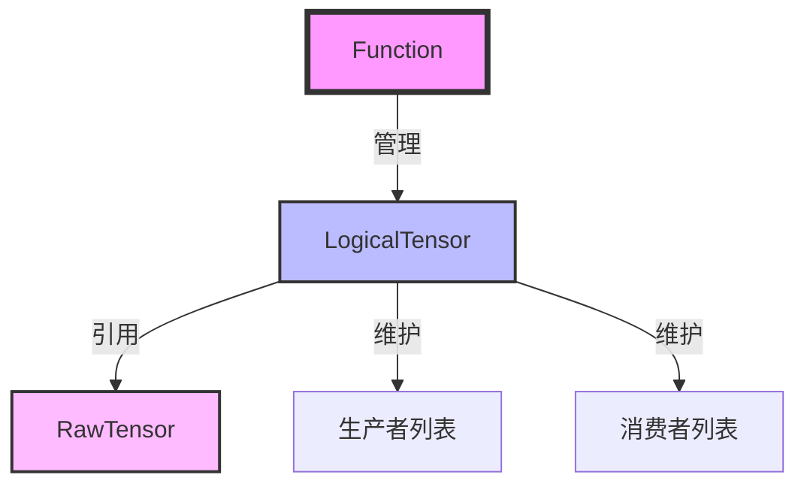

**关键接口：**
- [`CreateIncastTensor()`](../../../framework/src/interface/function/function.cpp#L4252)：创建输入张量
- [`CreateOutcastTensor()`](../../../framework/src/interface/function/function.cpp#L4620)：创建输出张量
- `TensorMap`：管理张量映射

### 模块调用时序图

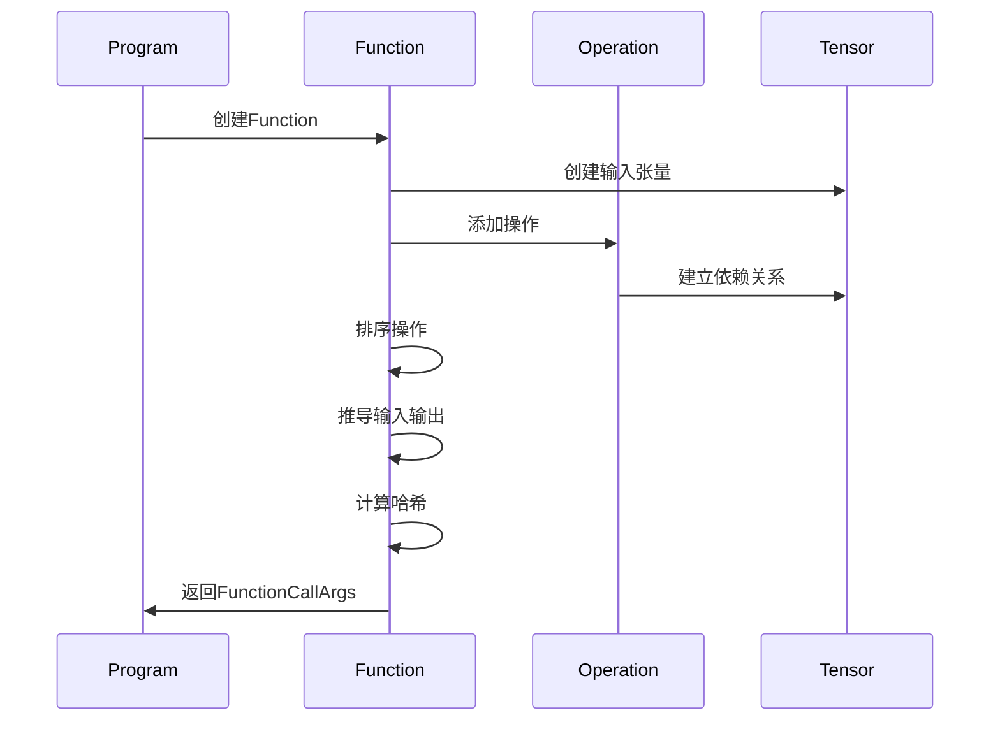

---

## 最佳实践

### 函数构建

1. **明确函数类型**：在创建函数时明确指定函数类型和图类型
2. **按顺序添加操作**：按照数据流顺序添加操作，便于理解和调试
3. **及时调用 EndFunction**：在添加完所有操作后及时调用 `EndFunction()`
4. **合理使用 scope**：在函数调用时传递正确的 `TensorSlotScope` 参数

### 性能优化

1. **预分配空间**：在已知操作数量时，预分配 `operations_` 空间
2. **避免不必要的拷贝**：使用移动语义和引用传递
3. **缓存中间结果**：对于重复计算的结果进行缓存
4. **批量处理**：对于大量操作，考虑批量处理

### 错误处理

1. **使用断言**：在关键位置添加断言，及早发现问题
2. **验证输入**：在函数入口验证输入参数的有效性
3. **处理异常**：对于可能失败的操作，添加异常处理
4. **记录日志**：在关键步骤记录日志，便于问题定位

### 调试技巧

1. **导出 IR**：使用 [`DumpJson()`](../../../framework/src/interface/function/function.cpp#L6920) 导出函数 IR，便于分析
2. **SSA 格式**：使用 [`DumpSSA()`](../../../framework/src/interface/function/function.cpp#L7800) 导出 SSA 格式，理解数据流
3. **可视化工具**：将 IR 转换为图形，直观查看函数结构
4. **断点调试**：在关键函数设置断点，跟踪执行流程

---

## 常见问题

### Q1: 为什么需要 MakeIncasts 和 MakeOutcasts？

**A:** [`MakeIncasts()`](../../../framework/src/interface/function/function.cpp#L4355) 和 [`MakeOutcasts()`](../../../framework/src/interface/function/function.cpp#L4620) 的主要目的是：
1. **统一接口**：将不同来源的输入输出统一为标准的函数接口
2. **内存优化**：通过 VIEW 和 ASSEMBLE 操作实现内存复用
3. **参数合并**：将相同 `rawTensor` 的多个视图合并为一个参数
4. **支持函数调用**：在父函数中创建参数，支持函数调用

### Q2: COA 规范化的作用是什么？

**A:** COA（Constant Offset Array）规范化的主要作用是：
1. **运行时参数传递**：将张量的偏移、形状等信息规范化到数组中，便于运行时传递
2. **支持动态形状**：通过 COA 支持动态形状的计算和传递
3. **减少参数数量**：将多个相关值组织成数组，减少参数数量
4. **提高执行效率**：运行时直接使用 COA 数组，避免重复计算

### Q3: 函数哈希的作用是什么？

**A:** 函数哈希的主要作用是：
1. **函数去重**：通过哈希值识别相同的函数，避免重复编译
2. **缓存管理**：使用哈希值作为缓存的键，提高缓存效率
3. **快速比较**：通过比较哈希值快速判断函数是否相同
4. **版本管理**：通过哈希值管理函数的版本和变更

### Q4: 如何处理循环依赖？

**A:** 当前实现通过拓扑排序检测循环依赖：
1. **检测循环依赖**：在拓扑排序后检查是否所有操作都被处理
2. **报告错误**：如果检测到循环依赖，报告详细的错误信息
3. **用户干预**：对于复杂的循环依赖，需要用户手动修复

### Q5: VIEW 和 ASSEMBLE 的区别是什么？

**A:** 
- **VIEW**：创建张量的视图，共享底层内存，用于读取访问
- **ASSEMBLE**：将多个部分数据组装成完整张量，用于写入访问

### Q6: 如何选择合适的图类型？

**A:** 根据编译阶段选择图类型：
- **TENSOR_GRAPH**：前端阶段，高层次抽象
- **TILE_GRAPH**：优化阶段，硬件感知
- **BLOCK_GRAPH**：分区阶段，并行执行
- **EXECUTE_GRAPH**：代码生成阶段，调度信息

---

## 相关文档

- [Operation 模块目录](../../../framework/src/interface/operation/)
- [Tensor 模块目录](../../../framework/src/interface/tensor/)
- [Program 模块目录](../../../framework/src/interface/program/)
- [PyPTO 编程指南](../../../docs/tutorials/README.md)

---

**文档版本：** 3.0  
**最后更新：** 2025年  
**维护者：** PyPTO 编译框架团队

