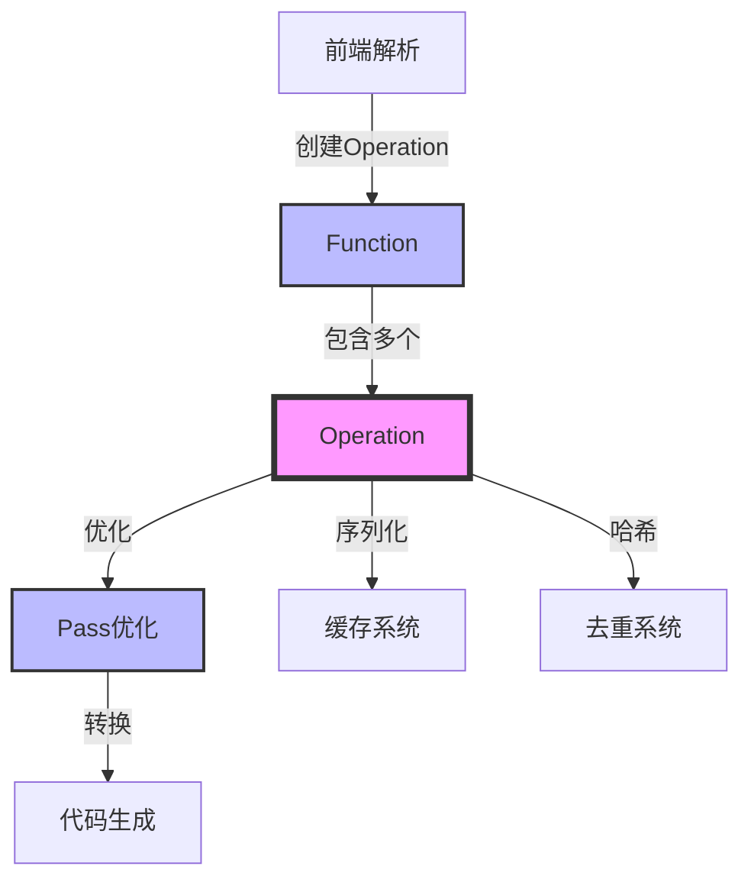
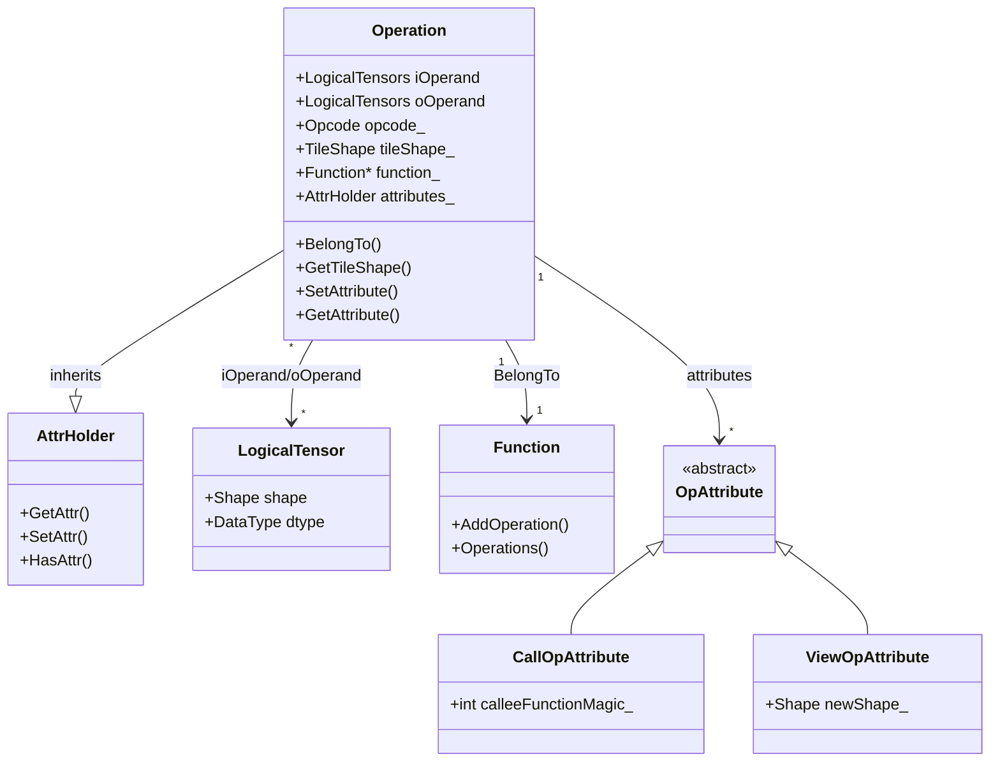
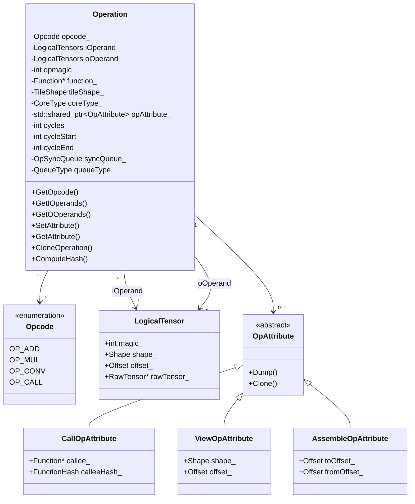
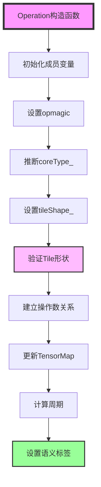
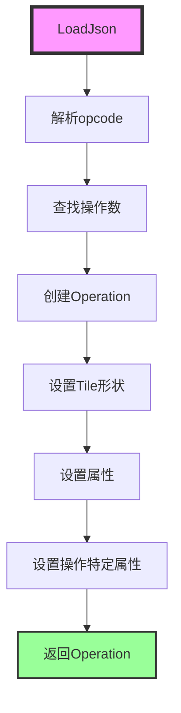
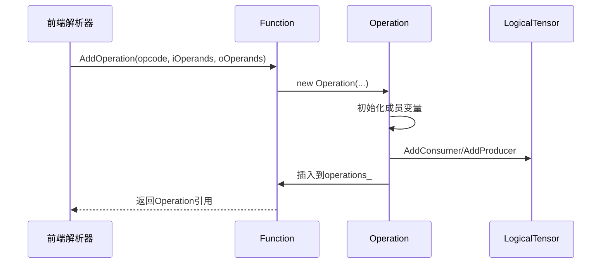
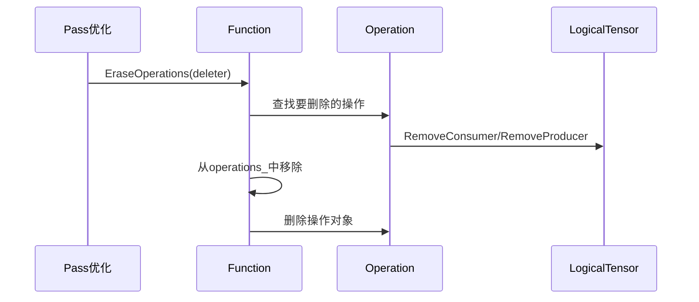

# Operation 类技术文档

> **适用对象：** 想要深入理解Operation模块的开发者、算子开发者  
> **学习时间：** 45-60分钟  
> **前置知识：** 已阅读[Function模块](03-function.md)和[核心概念](10-concepts.md)  
> **学习目标：** 理解Operation的结构、操作类型、属性管理和在编译流程中的作用

## 概述

`Operation` 类是 PyPTO 编译框架中计算图的基本节点，表示一个计算操作。作为 IR 的核心组件，`Operation` 类封装了操作的类型（Opcode）、输入输出操作数（Operands）、属性（Attributes）、Tile 形状、执行周期等关键信息，是连接前端解析、图优化、代码生成等多个编译阶段的重要桥梁。

**核心职责：**
- 🎯 **操作抽象**：表示计算图中的一个具体操作
- 🔗 **数据依赖**：通过操作数管理输入输出张量的依赖关系
- ⚙️ **配置管理**：存储操作的属性和Tile形状信息
- 🔄 **Pass优化**：作为Pass优化的对象，支持操作数替换和属性修改

**相关文件：**
- 头文件：[`operation.h`](../../../framework/src/interface/operation/operation.h)
- 实现文件：[`operation.cpp`](../../../framework/src/interface/operation/operation.cpp)
- 操作码定义：[`opcode.h`](../../../framework/src/interface/operation/opcode.h)
- 属性定义：[`attribute.h`](../../../framework/src/interface/operation/attribute.h)
- 相关模块：[Function](03-function.md)、[Interface](02-interface.md)、[Program/Program 管理](02-interface.md)

---

## 目录

- [架构定位](#架构定位)
- [核心概念与数据结构](#核心概念与数据结构)
- [关键函数详解](#关键函数详解)
- [操作数管理](#操作数管理)
- [属性管理](#属性管理)
- [形状推断](#形状推断)
- [序列化与反序列化](#序列化与反序列化)
- [哈希计算](#哈希计算)
- [操作类型详解](#操作类型详解)
- [生命周期管理](#生命周期管理)
- [模块接口与交互](#模块接口与交互)
- [最佳实践](#最佳实践)
- [常见问题](#常见问题)

---

## 架构定位

### 在编译流程中的位置

`Operation` 类在 PyPTO 编译框架中处于核心位置，是计算图的基本构建单元：



**编译阶段职责：**

| 编译阶段 | Operation 类职责 | 关键方法 |
|---------|-----------------|---------|
| **前端阶段** | 接收操作码和操作数，创建操作节点 | [`Operation()`](../../../framework/src/interface/operation/operation.cpp#L111) |
| **优化阶段** | 提供操作数替换、属性修改接口 | [`ReplaceInputOperand()`](../../../framework/src/interface/operation/operation.h#L287), [`SetAttribute()`](../../../framework/src/interface/operation/operation.h#L202) |
| **转换阶段** | 支持操作克隆、操作数更新 | [`CloneOperation()`](../../../framework/src/interface/operation/operation.h#L327), [`UpdateInputOperand()`](../../../framework/src/interface/operation/operation.h#L291) |
| **代码生成** | 提供序列化和哈希计算 | [`DumpJson()`](../../../framework/src/interface/operation/operation.h#L260), [`ComputeHash()`](../../../framework/src/interface/operation/operation.h#L335) |
| **运行时** | 提供形状推断、周期计算 | [`InferShape()`](../../../framework/src/interface/operation/op_infer_shape_impl.h#L42), [`GetCycles()`](../../../framework/src/interface/operation/cycles.h) |

### 类图



### 在计算图中的角色

`Operation` 是计算图中的节点，通过操作数（Operands）与其他节点连接：

```mermaid
graph LR
    A[Operation: OP_ADD] -->|iOperand[0]| B[LogicalTensor: x]
    A -->|iOperand[1]| C[LogicalTensor: y]
    A -->|oOperand[0]| D[LogicalTensor: z]
    
    E[Operation: OP_MUL] -->|iOperand[0]| D
    E -->|iOperand[1]| F[LogicalTensor: w]
    E -->|oOperand[0]| G[LogicalTensor: result]
    
    style A fill:#f9f,stroke:#333,stroke-width:4px
    style E fill:#f9f,stroke:#333,stroke-width:4px
    style B fill:#bbf,stroke:#333,stroke-width:2px
    style C fill:#bbf,stroke:#333,stroke-width:2px
    style D fill:#9f9,stroke:#333,stroke-width:2px
```

**关键关系：**
- **Operation → LogicalTensor**：操作通过操作数引用张量
- **LogicalTensor → Operation**：张量记录生产者和消费者操作
- **Operation → Operation**：通过共享的 LogicalTensor 建立数据依赖关系

---

## 核心概念与数据结构

### Operation 类结构



### 关键成员变量详解

#### `opcode_`：操作码

**类型：** [`Opcode`](../../../framework/src/interface/operation/opcode.h#L29)（枚举类型）

**作用：** 标识操作的类型，决定操作的语义和执行方式。

**操作码分类：**

| 操作码类别 | 说明 | 示例 |
|----------|------|------|
| **一元向量操作** | 单输入向量运算 | `OP_EXP`, `OP_SQRT`, `OP_RSQRT`, `OP_CAST` |
| **二元向量操作** | 双输入向量运算 | `OP_ADD`, `OP_SUB`, `OP_MUL`, `OP_DIV` |
| **Cube 操作** | 矩阵乘法、卷积等 | `OP_A_MUL_B`, `OP_CONV`, `OP_A_MULACC_B` |
| **View 操作** | 张量视图操作 | `OP_VIEW`, `OP_RESHAPE`, `OP_ASSEMBLE` |
| **Move 操作** | 数据移动操作 | `OP_COPY_IN`, `OP_COPY_OUT`, `OP_CONVERT` |
| **Call 操作** | 函数调用操作 | `OP_CALL`, `OP_CALL_NOT_EXPAND` |
| **同步操作** | 同步和通信操作 | `OP_SET_FLAG`, `OP_WAIT_FLAG`, `OP_SHMEM_PUT` |

**获取方式：**
```cpp
Opcode GetOpcode() const { return opcode_; }
std::string GetOpcodeStr(bool appendTile = false) const;
```

**关键概念：**
- **`OpcodeManager`**：操作码管理器，提供操作码到字符串的转换、核心类型查询等功能
- **`FindOpcode()`**：根据字符串查找对应的操作码
- **`GetCoreType()`**：获取操作的核心类型（AIC/AIV/AICPU）

#### `iOperand` / `oOperand`：输入/输出操作数

**类型：** `LogicalTensors`（`std::vector<std::shared_ptr<LogicalTensor>>`）

**作用：** 存储操作的输入和输出张量，建立操作之间的数据依赖关系。

**关键特性：**
- 使用 `shared_ptr` 管理 `LogicalTensor` 的生命周期
- 操作数在创建时建立与张量的双向关系：
  - 操作添加到张量的消费者列表（`LogicalTensor::AddConsumer()`）
  - 操作添加到张量的生产者列表（`LogicalTensor::AddProducer()`）

**访问方法：**
```cpp
const LogicalTensors &GetIOperands() const { return iOperand; }
const LogicalTensors &GetOOperands() const { return oOperand; }
LogicalTensorPtr GetInputOperand(const size_t index) const;
LogicalTensorPtr GetOutputOperand(const size_t index) const;
```

**关键概念：**
- **操作数索引**：通过索引访问特定位置的操作数
- **操作数替换**：支持替换操作数，用于图优化
- **操作数更新**：支持更新操作数，用于 Pass 优化

#### `opmagic`：操作唯一标识符

**类型：** `int`

**作用：** 在 `Function` 内唯一标识一个操作，用于操作排序、哈希计算等。

**生成规则：**
- 默认值：`-1`（表示未指定）
- 自动生成：如果未指定，使用 `Function::opSeed_++` 生成
- 范围：通常从 10000 开始递增

**关键概念：**
- **`opSeed_`**：`Function` 中的操作种子值，用于生成唯一的 `opmagic`
- **操作排序**：`OperationComparator` 使用 `opmagic` 对操作进行排序
- **哈希计算**：`opmagic` 参与操作的哈希计算

#### `opAttribute_`：操作属性

**类型：** `std::shared_ptr<OpAttribute>`

**作用：** 存储操作特定的属性信息，如函数调用信息、视图信息、组装信息等。

**属性类型：**

| 属性类型 | 说明 | 使用场景 |
|---------|------|---------|
| **`CallOpAttribute`** | 函数调用属性 | `OP_CALL` 操作，包含被调用函数信息 |
| **`ViewOpAttribute`** | 视图属性 | `OP_VIEW` 操作，包含视图的形状和偏移 |
| **`AssembleOpAttribute`** | 组装属性 | `OP_ASSEMBLE` 操作，包含组装的目标偏移 |
| **`CopyOpAttribute`** | 拷贝属性 | `OP_COPY_IN`、`OP_COPY_OUT` 等操作 |
| **`ConvertOpAttribute`** | 转换属性 | `OP_CONVERT` 操作，包含数据类型转换信息 |

**访问方法：**
```cpp
const std::shared_ptr<OpAttribute> &GetOpAttribute() const;
void SetOpAttribute(const std::shared_ptr<OpAttribute> &attr);
```

**关键概念：**
- **属性验证**：`SetOpAttribute()` 会验证属性类型是否与操作码匹配
- **属性克隆**：`OpAttribute::Clone()` 用于操作克隆时复制属性
- **属性序列化**：`OpAttribute::DumpDynJson()` 用于序列化属性

#### `tileShape_`：Tile 形状

**类型：** [`TileShape`](../../../framework/src/interface/inner/tile_shape.h)

**作用：** 存储操作的 Tile 形状信息，用于硬件感知的优化和代码生成。

**Tile 形状组成：**
- **`CubeTile`**：Cube 操作的 Tile 形状（矩阵乘法、卷积等）
- **`VecTile`**：Vector 操作的 Tile 形状（向量运算）
- **`CommTile`**：通信操作的 Tile 形状

**访问方法：**
```cpp
const TileShape &GetTileShape() const { return tileShape_; }
void UpdateTileShape(const TileShape newTileShape);
TileShape &GetTileShapeForSetting();
```

**关键概念：**
- **Tile 形状设置**：在 `TENSOR_GRAPH` 和 `TILE_GRAPH` 阶段，Tile 形状从 `TileShape::Current()` 获取
- **Tile 形状验证**：创建操作时会验证 Tile 形状是否有效
- **Tile 形状对齐**：Vector 操作的最后一个维度必须满足 32 字节对齐

#### `coreType_`：核心类型

**类型：** [`CoreType`](../../../framework/src/interface/inner/pre_def.h)（枚举类型）

**作用：** 标识操作在哪个硬件核心上执行。

**核心类型：**

| 核心类型 | 说明 | 使用场景 |
|---------|------|---------|
| **`AIC`** | AI Cube 核心 | 矩阵乘法、卷积等 Cube 操作 |
| **`AIV`** | AI Vector 核心 | 向量运算、逐元素操作 |
| **`AICPU`** | AI CPU 核心 | CPU 执行的操作 |
| **`MIX`** | 混合类型 | 默认值，表示未指定 |

**获取方式：**
```cpp
CoreType GetCoreType() const { return coreType_; }
void SetCoreType(CoreType ct) { coreType_ = ct; }
```

**关键概念：**
- **自动推断**：创建操作时，根据操作码自动推断核心类型
- **核心类型查询**：`OpcodeManager::GetCoreType()` 提供操作码到核心类型的映射
- **核心类型设置**：Pass 优化时可以修改核心类型

#### `cycles` / `cycleStart` / `cycleEnd`：执行周期

**类型：** `int`

**作用：** 记录操作的执行周期信息，用于性能分析和调度优化。

**周期信息：**
- **`cycles`**：操作的执行周期数（延迟）
- **`cycleStart`**：操作开始执行的周期
- **`cycleEnd`**：操作结束执行的周期

**关键概念：**
- **周期计算**：`GetCycles()` 函数根据操作码、形状、数据类型计算周期
- **周期表**：`INTRIN_LATENCY_IN_OP` 定义了各种操作的周期表
- **调度优化**：Pass 优化时使用周期信息进行调度优化

---

## 关键函数详解

### Operation 构造函数

**函数签名：** [`Operation(Function &cur, Opcode opcode, LogicalTensors iOperands, LogicalTensors oOperands, bool updateTensorMap = true, int opMagic = -1)`](../../../framework/src/interface/operation/operation.cpp#L111)

**功能概述：** 创建操作对象，初始化操作码、操作数、操作标识符等。

**执行流程：**



**代码详解：**

#### 第一层：初始化成员变量

```cpp
Operation::Operation(
    Function &cur, Opcode opcode, LogicalTensors iOperands, LogicalTensors oOperands, 
    bool updateTensorMap, int opMagic)
    : iOperand(std::move(iOperands)),
      oOperand(std::move(oOperands)),
      opmagic(opMagic),
      opcode_(opcode),
      isTileOp_(!cur.IsGraphType(GraphType::TENSOR_GRAPH)),
      coreType_(CoreType::MIX),
      function_(&cur) {
```

**关键变量：**
- **`iOperand`**：输入操作数列表（使用 `std::move` 避免拷贝）
- **`oOperand`**：输出操作数列表
- **`opmagic`**：操作标识符（如果为 `-1`，后续会自动生成）
- **`isTileOp_`**：是否为 Tile 操作（非 `TENSOR_GRAPH` 时为 `true`）
- **`coreType_`**：核心类型（初始化为 `MIX`）

#### 第二层：设置 opmagic

```cpp
if (opmagic == -1) {
    opmagic = cur.opSeed_++;
}
```

**功能：** 如果未指定 `opmagic`，使用 `Function::opSeed_` 自动生成。

**关键概念：**
- **`opSeed_`**：`Function` 中的操作种子值，每次创建操作时递增
- **唯一性保证**：在同一个 `Function` 内，`opmagic` 是唯一的

#### 第三层：推断核心类型

```cpp
auto opCoreType = OpcodeManager::Inst().GetCoreType(opcode);
switch (opCoreType) {
    case OpCoreType::AIC: coreType_ = CoreType::AIC; break;
    case OpCoreType::AIV: coreType_ = CoreType::AIV; break;
    case OpCoreType::AICPU: coreType_ = CoreType::AICPU; break;
    default: break;
}
```

**功能：** 根据操作码推断操作的核心类型。

**关键概念：**
- **`OpcodeManager`**：操作码管理器，提供操作码到核心类型的映射
- **核心类型推断**：不同操作码对应不同的核心类型（如 `OP_A_MUL_B` 对应 `AIC`，`OP_ADD` 对应 `AIV`）

#### 第四层：设置 Tile 形状

```cpp
if (function_->IsGraphType({GraphType::TENSOR_GRAPH, GraphType::TILE_GRAPH})) {
    tileShape_ = TileShape::Current();
    if (coreType_ == CoreType::AIC) {
        ASSERT(tileShape_.GetCubeTile().valid())
            << "op [" << OpcodeManager::Inst().GetOpcodeStr(opcode) << "]tile shape not set";
    }
    if (coreType_ == CoreType::AIV && calcType != OpCalcType::DISTRIBUTED) {
        auto &vecTile = tileShape_.GetVecTile();
        ASSERT(vecTile.valid()) << "op [" << OpcodeManager::Inst().GetOpcodeStr(opcode) << "]tile shape not set";
        if (iOperands.size()) {
            auto dataType = iOperands[0]->Datatype();
            auto lastAxis = vecTile.tile.back();
            ASSERT((lastAxis * BytesOf(dataType)) % BLOCK_SIZE == 0) 
                << "vec tile should be 32B align";
        }
    }
}
```

**功能：** 在 `TENSOR_GRAPH` 和 `TILE_GRAPH` 阶段，从 `TileShape::Current()` 获取 Tile 形状，并验证其有效性。

**关键概念：**
- **`TileShape::Current()`**：全局的当前 Tile 形状，由 `pypto.set_vec_tile_shapes()` 等函数设置
- **Tile 形状验证**：
  - **Cube 操作**：必须设置有效的 `CubeTile`
  - **Vector 操作**：必须设置有效的 `VecTile`，且最后一个维度必须满足 32 字节对齐
- **32 字节对齐**：`(lastAxis * BytesOf(dataType)) % BLOCK_SIZE == 0`，其中 `BLOCK_SIZE = 32`

#### 第五层：建立操作数关系

```cpp
for (auto &input : GetIOperands()) {
    input->AddConsumer(this);
}

for (auto &output : GetOOperands()) {
    output->AddProducer(this);
    if (updateTensorMap) {
        function_->GetTensorMap().Insert(output);
    }
}
```

**功能：** 建立操作与操作数之间的双向关系。

**关键概念：**
- **消费者关系**：输入操作数将当前操作添加到其消费者列表
- **生产者关系**：输出操作数将当前操作添加到其生产者列表
- **TensorMap 更新**：如果 `updateTensorMap` 为 `true`，将输出操作数插入到 `Function` 的 `TensorMap` 中

#### 第六层：计算周期

```cpp
if (opcode == Opcode::OP_COPY_IN || opcode == Opcode::OP_VIEW) {
    if (!GetOOperands().empty()) {
        std::vector<std::vector<int64_t>> shape;
        for (auto &tgtTile : GetOOperands()) {
            shape.emplace_back(tgtTile->shape);
        }
        latency_ = GetCycles(GetOpcodeStr(), shape, GetOOperands()[0]->tensor->datatype);
    }
} else {
    if (!GetIOperands().empty()) {
        std::vector<std::vector<int64_t>> shape;
        for (auto &srcTile : GetIOperands()) {
            shape.emplace_back(srcTile->shape);
        }
        latency_ = GetCycles(GetOpcodeStr(), shape, GetIOperands()[0]->tensor->datatype);
    }
}
```

**功能：** 根据操作码、形状、数据类型计算操作的执行周期。

**关键概念：**
- **`GetCycles()`**：周期计算函数，根据操作码字符串、形状列表、数据类型查询周期表
- **周期表**：`INTRIN_LATENCY_IN_OP` 定义了各种操作的周期表
- **周期用途**：用于性能分析和调度优化

---

## 操作数管理

### 操作数访问

**获取操作数：**

```cpp
LogicalTensorPtr GetInputOperand(const size_t index) const {
    ASSERT(index < iOperand.size()) << "Input operand index out of range";
    return iOperand[index];
}

LogicalTensorPtr GetOutputOperand(const size_t index) const {
    ASSERT(index < oOperand.size()) << "Output operand index out of range";
    return oOperand[index];
}
```

**操作数索引查询：**

```cpp
int GetIOperandIndex(const LogicalTensorPtr &ioperand) const {
    for (size_t i = 0; i < iOperand.size(); ++i) {
        if (iOperand[i] == ioperand) {
            return static_cast<int>(i);
        }
    }
    return -1;
}

int GetOOperandIndex(const LogicalTensorPtr &ooperand) const {
    for (size_t i = 0; i < oOperand.size(); ++i) {
        if (oOperand[i] == ooperand) {
            return static_cast<int>(i);
        }
    }
    return -1;
}
```

### 操作数替换

**替换输入操作数：**

```cpp
void ReplaceInputOperand(const LogicalTensorPtr &originInput, const LogicalTensorPtr &newInput) {
    int index = GetIOperandIndex(originInput);
    ASSERT(index >= 0) << "Input operand not found";
    ReplaceIOperand(index, newInput);
}

void ReplaceIOperand(size_t index, std::shared_ptr<LogicalTensor> newTensor) {
    ASSERT(index < iOperand.size()) << "Input operand index out of range";
    auto oldTensor = iOperand[index];
    
    // 移除旧的消费者关系
    oldTensor->RemoveConsumer(this);
    
    // 设置新的操作数
    iOperand[index] = newTensor;
    
    // 添加新的消费者关系
    newTensor->AddConsumer(this);
}
```

**替换输出操作数：**

```cpp
void ReplaceOutputOperand(const LogicalTensorPtr &originOutput, const LogicalTensorPtr &newOutput) {
    int index = GetOOperandIndex(originOutput);
    ASSERT(index >= 0) << "Output operand not found";
    ReplaceOOperand(index, newOutput);
}

void ReplaceOOperand(size_t index, std::shared_ptr<LogicalTensor> newTensor) {
    ASSERT(index < oOperand.size()) << "Output operand index out of range";
    auto oldTensor = oOperand[index];
    
    // 移除旧的生产者关系
    oldTensor->RemoveProducer(this);
    
    // 设置新的操作数
    oOperand[index] = newTensor;
    
    // 添加新的生产者关系
    newTensor->AddProducer(this);
}
```

**关键概念：**
- **关系维护**：替换操作数时需要维护操作与张量之间的双向关系
- **消费者/生产者更新**：移除旧张量的关系，添加新张量的关系
- **使用场景**：Pass 优化时经常需要替换操作数

### 操作数更新

**更新输入操作数：**

```cpp
void UpdateInputOperand(const size_t index, const std::shared_ptr<LogicalTensor> &newInput) {
    ASSERT(index < iOperand.size()) << "Input operand index out of range";
    ReplaceIOperand(index, newInput);
}
```

**更新输出操作数：**

```cpp
void UpdateOutputOperand(const size_t index, const std::shared_ptr<LogicalTensor> &newOutput) {
    ASSERT(index < oOperand.size()) << "Output operand index out of range";
    ReplaceOOperand(index, newOutput);
}
```

---

## 属性管理

### 通用属性访问

**获取属性：**

```cpp
[[nodiscard]] std::string GetStringAttribute(const std::string &key) const;
[[nodiscard]] bool GetBoolAttribute(const std::string &key) const;
[[nodiscard]] int64_t GetIntAttribute(const std::string &key) const;
[[nodiscard]] Element GetElementAttribute(const std::string &key) const;
[[nodiscard]] SymbolicScalar GetSymbolicScalarAttribute(const std::string &key) const;
[[nodiscard]] std::vector<int64_t> GetVectorIntAttribute(const std::string &key) const;
[[nodiscard]] std::vector<SymbolicScalar> GetVectorSymbolicScalarAttribute(const std::string &key) const;
```

**设置属性：**

```cpp
void SetAttribute(const std::string &key, const std::string &value);
void SetAttribute(const std::string &key, bool value);
void SetAttribute(const std::string &key, int64_t value);
void SetAttribute(const std::string &key, const SymbolicScalar &value);
void SetAttribute(const std::string &key, const std::vector<int64_t> &value);
void SetAttribute(const std::string &key, const std::vector<SymbolicScalar> &value);
```

**属性检查：**

```cpp
[[nodiscard]] bool HasAttribute(const std::string &key) const {
    return HasAttr(key);
}
```

**关键概念：**
- **`AttrHolder`**：`Operation` 继承自 `AttrHolder`，提供属性存储和访问功能
- **属性键**：`OpAttributeKey` 类定义了常用的属性键常量
- **属性类型**：支持字符串、布尔、整数、向量、`SymbolicScalar` 等多种类型

### 操作特定属性

**CallOpAttribute（函数调用属性）：**

```cpp
void SetCallOpAttribute(Function *callee, const FunctionHash &calleeHash) {
    ASSERT(opcode_ == Opcode::OP_CALL);
    SetOpAttribute(std::make_shared<CallOpAttribute>(callee, calleeHash));
}

std::string GetCalleeMagicName() const {
    ASSERT(IsCall());
    auto callAttr = std::dynamic_pointer_cast<CallOpAttribute>(opAttribute_);
    return callAttr->GetCalleeMagicName();
}
```

**ViewOpAttribute（视图属性）：**

```cpp
void SetViewOpAttribute(const Shape &shape, const Offset &offset, 
                        const std::vector<SymbolicScalar> &dynOffset = {}) {
    ASSERT(opcode_ == Opcode::OP_VIEW);
    SetOpAttribute(std::make_shared<ViewOpAttribute>(shape, offset, dynOffset));
}
```

**AssembleOpAttribute（组装属性）：**

```cpp
void SetAssembleOpAttribute(
    const std::vector<int64_t> &toOffset, 
    const std::vector<SymbolicScalar> &toDynOffset = {}) {
    ASSERT(opcode_ == Opcode::OP_ASSEMBLE || opcode_ == Opcode::OP_ASSEMBLE_SSA);
    SetOpAttribute(std::make_shared<AssembleOpAttribute>(toOffset, toDynOffset));
}
```

**关键概念：**
- **属性类型验证**：`SetOpAttribute()` 会验证属性类型是否与操作码匹配
- **属性访问**：通过 `dynamic_pointer_cast` 将 `OpAttribute` 转换为特定类型
- **属性克隆**：操作克隆时会克隆属性

---

## 形状推断

### 形状推断机制

**形状推断注册表：**

```cpp
class InferShapeRegistry {
public:
    static InferShapeRegistry& GetInstance() {
        static InferShapeRegistry instance;
        return instance;
    }
    
    void RegisterInferShapeFunc(const Opcode opcode, FuncType func) {
        inferShapeFuncs_[opcode] = func;
    }
    
    void CallInferShapeFunc(Operation* op) {
        const Opcode opcode = op->GetOpcode();
        std::vector<std::vector<SymbolicScalar>> outValidShapes;
        auto it = inferShapeFuncs_.find(opcode);
        if (it != inferShapeFuncs_.end()) {
            it->second(op, outValidShapes);
        } else {
            // 如果未注册，使用默认形状
            for (auto output : op->GetOOperands()) {
                outValidShapes.push_back(output->GetDynValidShape());
            }
        }
        // 设置输出形状
        for (size_t i = 0; i < op->GetOOperands().size(); ++i) {
            op->GetOOperands()[i]->UpdateDynValidShape(outValidShapes[i]);
        }
    }
private:
    std::unordered_map<Opcode, FuncType> inferShapeFuncs_;
};
```

**形状推断函数注册：**

```cpp
#define REGISTER_INFER_SHAPE_FUNC(OpCoreStr, OpType, FuncName) \
class OpCoreStr##Register { \
public: \
    OpCoreStr##Register() { \
        InferShapeRegistry::GetInstance().RegisterInferShapeFunc(OpType, FuncName); \
    } \
}; \
static OpCoreStr##Register OpCoreStr##_register
```

### 常见形状推断函数

**逐元素操作形状推断：**

```cpp
void ElewiseInferFunc(Operation* op, std::vector<std::vector<SymbolicScalar>>& outValidShapes) {
    std::vector<std::vector<SymbolicScalar>> inputValidShapes;
    for (auto inputTensor : op->GetIOperands()) {
        inputValidShapes.push_back(inputTensor->GetDynValidShape());
    }
    if (inputValidShapes.empty()) {
        return;
    }
    // 输出形状等于第一个输入的形状
    auto outValidShape = inputValidShapes[0];
    for (auto output : op->GetOOperands()) {
        outValidShapes.push_back(outValidShape);
    }
}
REGISTER_INFER_SHAPE_FUNC(OP_ADD, Opcode::OP_ADD, ElewiseInferFunc);
REGISTER_INFER_SHAPE_FUNC(OP_SUB, Opcode::OP_SUB, ElewiseInferFunc);
REGISTER_INFER_SHAPE_FUNC(OP_MUL, Opcode::OP_MUL, ElewiseInferFunc);
REGISTER_INFER_SHAPE_FUNC(OP_DIV, Opcode::OP_DIV, ElewiseInferFunc);
```

**Reduce 操作形状推断：**

```cpp
void ReduceInferFunc(Operation* op, std::vector<std::vector<SymbolicScalar>>& outValidShapes) {
    std::vector<std::vector<SymbolicScalar>> inputValidShapes;
    for (auto inputTensor : op->GetIOperands()) {
        inputValidShapes.push_back(inputTensor->GetDynValidShape());
    }
    if (inputValidShapes.empty()) {
        return;
    }
    auto outValidShape = inputValidShapes[0];
    int axis = op->GetIntAttribute(OP_ATTR_PREFIX + "AXIS");
    // 在指定轴上reduce，该维度变为1
    outValidShape[axis] = SymbolicScalar(1);
    for (auto output : op->GetOOperands()) {
        outValidShapes.push_back(outValidShape);
    }
}
REGISTER_INFER_SHAPE_FUNC(OP_ROWSUMLINE, Opcode::OP_ROWSUMLINE, ReduceInferFunc);
REGISTER_INFER_SHAPE_FUNC(OP_ROWMAXLINE, Opcode::OP_ROWMAXLINE, ReduceInferFunc);
```

**View 操作形状推断：**

```cpp
void ViewInferFunc(Operation* op, std::vector<std::vector<SymbolicScalar>>& outValidShapes) {
    auto viewOpAttribute = std::dynamic_pointer_cast<ViewOpAttribute>(op->GetOpAttribute());
    if (viewOpAttribute != nullptr) {
        // 使用ViewOpAttribute中的形状
        auto viewShape = viewOpAttribute->GetShape();
        std::vector<SymbolicScalar> outValidShape;
        for (auto dim : viewShape) {
            outValidShape.push_back(SymbolicScalar(dim));
        }
        for (auto output : op->GetOOperands()) {
            outValidShapes.push_back(outValidShape);
        }
    } else {
        // 如果没有ViewOpAttribute，使用输入形状
        ElewiseInferFunc(op, outValidShapes);
    }
}
REGISTER_INFER_SHAPE_FUNC(OP_VIEW, Opcode::OP_VIEW, ViewInferFunc);
```

**关键概念：**
- **`dynValidShape`**：动态有效形状，用于表示运行时确定的形状
- **形状推断时机**：在 Pass 优化阶段调用形状推断函数
- **形状推断注册**：使用宏 `REGISTER_INFER_SHAPE_FUNC` 注册形状推断函数

---

## 序列化与反序列化

### DumpJson：序列化操作

**函数签名：** [`Json DumpJson(bool dumpTensor = true) const`](../../../framework/src/interface/operation/operation.h#L260)

**功能概述：** 将操作序列化为 JSON 格式，用于 IR 的保存和恢复。

**序列化内容：**

```json
{
  "opcode": "ADD",
  "opmagic": 10001,
  "ioperands": [31, 34],
  "ooperands": [39],
  "tile": {
    "cube": [16, 16, 16],
    "vec": [1, 4, 1, 64],
    "comm": []
  },
  "coreType": "AIV",
  "cycles": 6,
  "attributes": {
    "SCALAR": 1.0
  },
  "opAttribute": {
    "type": "CallOpAttribute",
    "calleeHash": "1234567890"
  }
}
```

**关键字段：**
- **`opcode`**：操作码字符串
- **`opmagic`**：操作标识符
- **`ioperands`**：输入操作数的 Magic ID 列表
- **`ooperands`**：输出操作数的 Magic ID 列表
- **`tile`**：Tile 形状信息
- **`coreType`**：核心类型
- **`cycles`**：执行周期
- **`attributes`**：通用属性
- **`opAttribute`**：操作特定属性

### LoadJson：反序列化操作

**函数签名：** [`static std::shared_ptr<Operation> LoadJson(Function &cur, const std::unordered_map<int, std::shared_ptr<LogicalTensor>> &tensorDict, const Json &opDump)`](../../../framework/src/interface/operation/operation.h#L261)

**功能概述：** 从 JSON 格式恢复操作对象。

**反序列化流程：**



**关键步骤：**
1. **解析操作码**：从 JSON 中读取 `opcode` 字符串，转换为 `Opcode` 枚举
2. **查找操作数**：根据 `ioperands` 和 `ooperands` 中的 Magic ID，从 `tensorDict` 中查找对应的 `LogicalTensor`
3. **创建操作**：使用操作码和操作数创建 `Operation` 对象
4. **恢复属性**：从 JSON 中恢复通用属性和操作特定属性

---

## 哈希计算

### ComputeHash：计算操作哈希

**函数签名：** [`unsigned long ComputeHash()`](../../../framework/src/interface/operation/operation.h#L335)

**功能概述：** 计算操作的哈希值，用于操作去重和缓存。

**哈希计算内容：**
- 操作码（`opcode_`）
- 输入操作数的 Magic ID（`iOperand`）
- 输出操作数的 Magic ID（`oOperand`）
- Tile 形状（`tileShape_`）
- 核心类型（`coreType_`）
- 属性（`attributes`）
- 操作特定属性（`opAttribute_`）

**关键概念：**
- **哈希用途**：用于操作去重、函数缓存等
- **哈希一致性**：相同操作应该产生相同的哈希值
- **哈希冲突**：虽然理论上可能发生冲突，但实际使用中很少发生

### ComputeHashOrderless：无序哈希计算

**函数签名：** [`unsigned long ComputeHashOrderless() const`](../../../framework/src/interface/operation/operation.h#L336)

**功能概述：** 计算操作的哈希值，不考虑操作顺序（用于某些优化场景）。

**与 `ComputeHash()` 的区别：**
- **`ComputeHash()`**：考虑操作顺序，相同操作但顺序不同会产生不同哈希
- **`ComputeHashOrderless()`**：不考虑操作顺序，相同操作但顺序不同会产生相同哈希

---

## 操作类型详解

### Vector 操作

**一元向量操作：**

| 操作码 | 说明 | 示例 |
|-------|------|------|
| `OP_EXP` | 指数运算 | `exp(x)` |
| `OP_SQRT` | 平方根 | `sqrt(x)` |
| `OP_RSQRT` | 平方根倒数 | `1/sqrt(x)` |
| `OP_CAST` | 类型转换 | `cast(x, dtype)` |
| `OP_ABS` | 绝对值 | `abs(x)` |
| `OP_LN` | 自然对数 | `log(x)` |

**二元向量操作：**

| 操作码 | 说明 | 示例 |
|-------|------|------|
| `OP_ADD` | 加法 | `x + y` |
| `OP_SUB` | 减法 | `x - y` |
| `OP_MUL` | 乘法 | `x * y` |
| `OP_DIV` | 除法 | `x / y` |
| `OP_MAXIMUM` | 最大值 | `max(x, y)` |
| `OP_MINIMUM` | 最小值 | `min(x, y)` |

**关键概念：**
- **核心类型**：Vector 操作在 `AIV`（AI Vector）核心上执行
- **Tile 形状**：需要设置 `VecTile`，且最后一个维度必须满足 32 字节对齐
- **周期计算**：根据操作类型、数据类型、形状计算执行周期

### Cube 操作

**矩阵乘法操作：**

| 操作码 | 说明 | 示例 |
|-------|------|------|
| `OP_A_MUL_B` | 矩阵乘法 | `A @ B` |
| `OP_A_MULACC_B` | 矩阵乘法累加 | `C = C + A @ B` |
| `OP_A_MUL_BT` | 矩阵乘法（B转置） | `A @ B.T` |
| `OP_AT_MUL_B` | 矩阵乘法（A转置） | `A.T @ B` |

**卷积操作：**

| 操作码 | 说明 | 示例 |
|-------|------|------|
| `OP_CONV` | 卷积 | `conv2d(x, weight)` |
| `OP_CONV_ADD` | 卷积加偏置 | `conv2d(x, weight) + bias` |

**关键概念：**
- **核心类型**：Cube 操作在 `AIC`（AI Cube）核心上执行
- **Tile 形状**：需要设置 `CubeTile`，包含 M、N、K 等维度
- **属性**：卷积操作使用 `ConvOpAttribute` 存储卷积参数（padding、stride 等）

### View 操作

**视图操作：**

| 操作码 | 说明 | 示例 |
|-------|------|------|
| `OP_VIEW` | 创建视图 | `x[offset:offset+shape]` |
| `OP_RESHAPE` | 重塑形状 | `reshape(x, new_shape)` |
| `OP_ASSEMBLE` | 组装数据 | `assemble(x, offset, y)` |

**关键概念：**
- **内存优化**：View 操作不拷贝数据，只是创建新的 `LogicalTensor` 视图
- **ViewOpAttribute**：`OP_VIEW` 操作使用 `ViewOpAttribute` 存储视图的形状和偏移
- **AssembleOpAttribute**：`OP_ASSEMBLE` 操作使用 `AssembleOpAttribute` 存储组装的目标偏移

### Move 操作

**数据移动操作：**

| 操作码 | 说明 | 示例 |
|-------|------|------|
| `OP_COPY_IN` | 拷贝到设备 | `copy_to_device(x)` |
| `OP_COPY_OUT` | 从设备拷贝 | `copy_from_device(x)` |
| `OP_CONVERT` | 格式转换 | `convert(x, format)` |

**关键概念：**
- **内存层次**：Move 操作在不同内存层次之间移动数据（DDR、L1、UB、L0 等）
- **CopyOpAttribute**：拷贝操作使用 `CopyOpAttribute` 存储拷贝信息
- **周期计算**：Move 操作的周期根据数据大小和内存带宽计算

### Call 操作

**函数调用操作：**

| 操作码 | 说明 | 示例 |
|-------|------|------|
| `OP_CALL` | 函数调用 | `call(func, args)` |
| `OP_CALL_NOT_EXPAND` | 不展开的函数调用 | `call_not_expand(func, args)` |

**关键概念：**
- **CallOpAttribute**：`OP_CALL` 操作使用 `CallOpAttribute` 存储被调用函数信息
- **函数调用参数**：通过 `Function::GetOpOriginArgsInfo()` 获取函数调用参数信息
- **函数展开**：`OP_CALL` 可以被 `ExpandFunction` Pass 展开为操作序列

---

## 生命周期管理

### 操作创建

**创建流程：**



**关键步骤：**
1. **前端解析**：前端解析器调用 `Function::AddOperation()` 创建操作
2. **操作构造**：`Operation` 构造函数初始化操作码、操作数等
3. **关系建立**：建立操作与操作数之间的双向关系
4. **插入函数**：将操作插入到 `Function::operations_` 中

### 操作删除

**删除流程：**



**关键步骤：**
1. **Pass 优化**：Pass 优化阶段识别需要删除的操作
2. **关系清理**：移除操作与操作数之间的关系
3. **从函数移除**：从 `Function::operations_` 中移除操作
4. **对象删除**：删除操作对象（通过 `shared_ptr` 自动管理）

---

## 模块接口与交互

### 与 Function 的交互

**Function 管理 Operation：**

```cpp
class Function {
    std::vector<std::shared_ptr<Operation>> operations_;
    
    Operation& AddOperation(Opcode opcode, LogicalTensors iOperands, LogicalTensors oOperands);
    void EraseOperations(const OperationDeleter &deleter);
    std::vector<Operation*> GetSortedOperations() const;
};
```

**关键接口：**
- **`AddOperation()`**：添加操作到函数
- **`EraseOperations()`**：删除操作
- **`GetSortedOperations()`**：获取拓扑排序后的操作列表

### 与 LogicalTensor 的交互

**LogicalTensor 记录 Operation：**

```cpp
class LogicalTensor {
    std::unordered_set<Operation*> producers_;
    std::unordered_set<Operation*> consumers_;
    
    void AddProducer(Operation* op);
    void AddConsumer(Operation* op);
    void RemoveProducer(Operation* op);
    void RemoveConsumer(Operation* op);
};
```

**关键接口：**
- **`AddProducer()`**：添加生产者操作
- **`AddConsumer()`**：添加消费者操作
- **`RemoveProducer()`**：移除生产者操作
- **`RemoveConsumer()`**：移除消费者操作

### 与 Pass 的交互

**Pass 优化 Operation：**

```cpp
class Pass {
    virtual Status RunOnFunction(Function &function) override {
        for (auto &op : function.GetSortedOperations()) {
            // 优化操作
            OptimizeOperation(op);
        }
        return SUCCESS;
    }
};
```

**关键接口：**
- **`GetSortedOperations()`**：获取排序后的操作列表
- **`ReplaceInputOperand()`**：替换输入操作数
- **`SetAttribute()`**：设置属性
- **`CloneOperation()`**：克隆操作

---

## 最佳实践

### 操作创建

**推荐做法：**

1. **使用 Function::AddOperation()**：
   ```cpp
   auto &op = function.AddOperation(Opcode::OP_ADD, {x, y}, {z});
   ```

2. **设置必要的属性**：
   ```cpp
   op.SetAttribute(OpAttributeKey::scalar, 1.0);
   ```

3. **验证操作数**：
   ```cpp
   ASSERT(op.GetInputOperandSize() == 2);
   ASSERT(op.GetOutputOperandSize() == 1);
   ```

### 操作优化

**推荐做法：**

1. **使用操作数替换而非删除重建**：
   ```cpp
   // 推荐：替换操作数
   op.ReplaceInputOperand(oldTensor, newTensor);
   
   // 不推荐：删除操作后重建
   function.EraseOperations(...);
   function.AddOperation(...);
   ```

2. **批量操作优化**：
   ```cpp
   for (auto &op : function.GetSortedOperations()) {
       if (op->GetOpcode() == Opcode::OP_ADD) {
           OptimizeAdd(op);
       }
   }
   ```

### 属性管理

**推荐做法：**

1. **使用常量键**：
   ```cpp
   op.SetAttribute(OpAttributeKey::scalar, 1.0);  // 推荐
   op.SetAttribute("SCALAR", 1.0);  // 不推荐
   ```

2. **检查属性存在性**：
   ```cpp
   if (op.HasAttribute(OpAttributeKey::scalar)) {
       auto scalar = op.GetIntAttribute(OpAttributeKey::scalar);
   }
   ```

---

## 常见问题

### Q1: 操作创建失败

**可能原因：**
- Tile 形状未设置
- 操作数类型不匹配
- 操作数形状不匹配

**解决方案：**
- 检查 Tile 形状是否已设置（`TileShape::Current()`）
- 验证操作数的数据类型和形状
- 查看错误日志中的具体错误信息

### Q2: 操作数替换失败

**可能原因：**
- 操作数索引超出范围
- 操作数未找到
- 操作数类型不匹配

**解决方案：**
- 使用 `GetIOperandIndex()` 检查操作数是否存在
- 验证新操作数的类型和形状
- 确保替换后操作数关系正确

### Q3: 属性访问失败

**可能原因：**
- 属性键不存在
- 属性类型不匹配
- 操作特定属性类型错误

**解决方案：**
- 使用 `HasAttribute()` 检查属性是否存在
- 使用正确的属性访问方法（`GetIntAttribute()` vs `GetStringAttribute()`）
- 验证操作特定属性的类型（使用 `dynamic_pointer_cast`）

---

## 相关文档

- [Function 类详细文档](03-function.md)
- [Interface 模块文档](02-interface.md)
- [Framework 模块文档](01-framework.md)
- [Passes 模块文档](07-passes.md)
- [Codegen 模块文档](08-codegen.md)

---

## 总结

`Operation` 类是 PyPTO 编译框架中计算图的基本节点，封装了操作的类型、操作数、属性、Tile 形状等关键信息。通过操作数管理、属性管理、形状推断、序列化等功能，`Operation` 类为前端解析、图优化、代码生成等编译阶段提供了统一的接口，是 PyPTO 多层级 IR 系统的重要组成部分。

