# Operator 模块技术文档

> **适用对象：** 算子开发者、AI应用开发者  
> **学习时间：** 30-45分钟  
> **前置知识：** 已完成[上手指南](../00-getting-started/00-quick-start.md)  
> **学习目标：** 了解PyPTO提供的算子库、学会开发自定义算子

## 概述

`operator` 模块是 PyPTO 编译框架的算子实现层，提供了各种基础算子和模型算子的实现。该模块基于 PyPTO 的 Tensor API，实现了从激活函数、归一化函数到复杂模型算子的完整算子库，是构建 AI 应用的基础组件。

**模块职责：**
- 🧩 **算子库**：提供丰富的预定义算子（Softmax、LayerNorm、FFN等）
- 🔧 **自定义扩展**：支持用户自定义算子开发
- 📊 **性能优化**：基于Tile的高效实现
- 🎯 **模型构建**：为AI模型开发提供基础组件

### 大模型算子文档（来自仓库 `examples/models` 的工程化写法）

仓库里的 `examples/models/**/README.md` 展示了“模型算子”这类文档的典型组织方式：先讲功能与融合点，再给公式/约束/函数原型/参数说明，最后给调用示例路径。这些信息对你做二次开发（改 shape 支持、加新 cache_mode、做量化/反量化）非常关键。

#### DeepSeek V3.2 EXP：拆解交付的算子族

该模型样例对 DeepSeek-V3.2-Exp 做了拆解，交付了多个关键算子（示例文档中提到：`mla prolog`、`lightning indexer prolog`、`sparse flash attention`、`mla_indexer_prolog` 等）。

常见 shape 字段含义（示例文档约定）：

| 字段 | 含义 | 取值规则（示例约束） |
|---|---|---|
| `b` | Batch | decode 场景 `1~128`；prefill 场景固定为 `1` |
| `s1` | query Seq-Length | decode 场景 `1~4`；prefill 场景 `1~1K` |
| `s2` | key Seq-Length | `1~128K` |
| `h` | hidden size | 示例中固定为 `7168` |
| `n_q` | query head 数 | 示例中 `128` |
| `n_kv` | kv head 数 | 示例中 `1` |
| `kv_lora_rank` | kv 低秩维度 | 示例中 `512` |
| `rope_dim` | RoPE 维度 | 示例中 `64` |
| `v_head_dim` | value head dim | 示例中 `128` |
| `q_head_dim` | query head dim | 示例中 `192` |
| `q_lora_rank` | query 低秩维度 | 示例中 `1536` |
| `selected_count` | topk 选择个数 | 示例中 `2048` |
| `block_size` | PagedAttention block size | 示例中 `128` |
| `block_num` | block 数 | 典型按 `ceil(B*Skv/block_size)` 计算（允许 `Skv=0`） |

工程约束的常见表达方式（示例文档风格）：
- 输入/权重/输出 **不支持非连续 Tensor**
- 明确写清 **数据格式**（如 `ND`/`NZ`）与 **dtype**（如 `bf16`/`int8`/`fp32`）
- 明确 `cache_mode`、tile 配置类（如 `MlaTileConfig` / `RopeTileShapeConfig`）等“影响执行路径”的参数

#### GLM V4.5：Attention 前序融合算子（示例：`attention_pre_quant`）

模型样例中常见的“融合逻辑”描述方式是把融合点列出来（便于读者确认算子边界），例如：
- 输入 LayerNorm
- 输入量化
- 量化 MatMul
- Q/K 的 LayerNorm
- Q/K 的 RoPE

并配套给出：
- 数学公式（用于核对实现与对齐精度）
- 函数原型（便于确认输入输出与类型）
- 参数的 shape/dtype/连续性约束（便于快速定位“为什么某个 shape 不支持”）

**模块位置：**
- 目录路径：[`framework/src/operator`](../../../framework/src/operator)
- 构建目标：`tile_fwk_operator`（共享库）
- 相关文档：[Function 类详细文档](03-function.md)、[Interface 模块文档](02-interface.md)、[Framework 模块文档](01-framework.md)

---

## 目录

- [架构定位](#架构定位)
- [模块组织](#模块组织)
- [核心算子分类](#核心算子分类)
- [关键算子详解](#关键算子详解)
- [算子开发模式](#算子开发模式)
- [动态Shape支持](#动态shape支持)
- [最佳实践](#最佳实践)
- [常见问题](#常见问题)

---

## 架构定位

### 在编译框架中的位置

`operator` 模块在 PyPTO 编译框架中处于算子实现层，为上层应用提供算子能力：

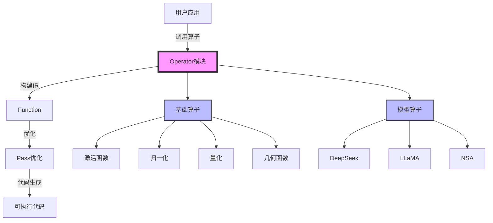

**Operator 模块职责：**

| 层次 | 职责 | 关键组件 |
|------|------|---------|
| **基础算子** | 提供基础数学和神经网络算子 | 激活函数、归一化、量化、几何函数 |
| **模型算子** | 提供复杂模型组件算子 | DeepSeek、LLaMA、NSA 等模型算子 |
| **算子接口** | 统一的算子调用接口 | 基于 Tensor API 的算子接口 |

### 类图

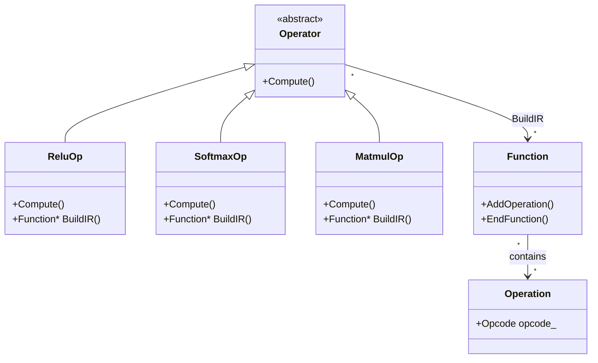

### 算子调用流程

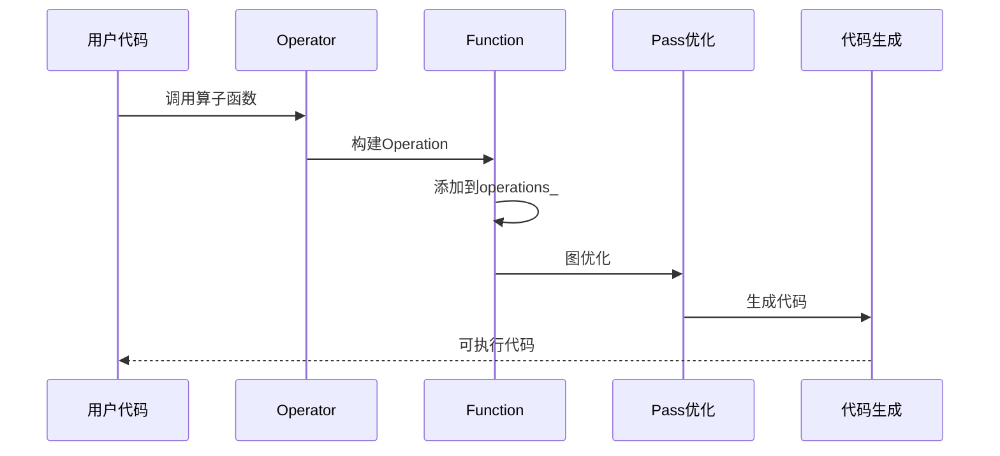

---

## 模块组织

### 模块结构

根据 [`CMakeLists.txt`](../../../framework/src/operator/CMakeLists.txt)，`operator` 模块包含以下子模块：

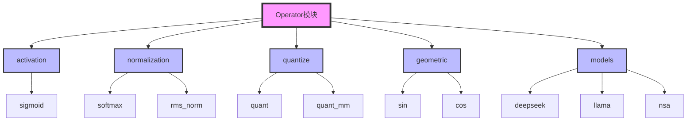

### 模块分类

#### 1. Activation 模块（激活函数）

**功能概述：** 提供各种激活函数算子。

**核心算子：**

- **`Sigmoid`**：Sigmoid 激活函数
  - **文件位置：** [`activation/sigmoid.cpp`](../../../framework/src/operator/activation/sigmoid.cpp)
  - **数学公式：** `sigmoid(x) = 1 / (1 + exp(-x))`
  - **实现方式：** 基于 Tensor API 的组合操作

#### 2. Normalization 模块（归一化函数）

**功能概述：** 提供各种归一化函数算子。

**核心算子：**

- **`Softmax`**：Softmax 归一化函数
  - **文件位置：** [`normalization/soft_max.cpp`](../../../framework/src/operator/normalization/soft_max.cpp)
  - **数学公式：** `softmax(x_i) = exp(x_i - M) / sum(exp(x_j - M))`，其中 `M = max(x_j)`
  - **实现方式：** 数值稳定的 Softmax 实现

- **`RMSNorm`**：RMS 归一化函数
  - **文件位置：** [`normalization/rms_norm.cpp`](../../../framework/src/operator/normalization/rms_norm.cpp)
  - **功能：** Root Mean Square 归一化

#### 3. Quantize 模块（量化函数）

**功能概述：** 提供量化相关算子。

**核心算子：**

- **`Quant`**：量化函数
  - **文件位置：** [`quantize/quant.cpp`](../../../framework/src/operator/quantize/quant.cpp)
  - **功能：** 将 FP32 张量量化为 INT8，支持对称和非对称量化

- **`QuantMM`**：量化矩阵乘法
  - **文件位置：** [`quantize/quant.cpp`](../../../framework/src/operator/quantize/quant.cpp)
  - **功能：** 量化矩阵乘法，提高计算效率

#### 4. Geometric 模块（几何函数）

**功能概述：** 提供几何函数算子。

**核心算子：**

- **`Sin`**：正弦函数
  - **文件位置：** [`geometric/sin.cpp`](../../../framework/src/operator/geometric/sin.cpp)

- **`Cos`**：余弦函数
  - **文件位置：** [`geometric/cos.cpp`](../../../framework/src/operator/geometric/cos.cpp)

#### 5. Models 模块（模型算子）

**功能概述：** 提供复杂模型组件算子。

**核心子模块：**

- **`deepseek`**：DeepSeek 模型算子
  - **核心算子：** `DynamicMLA`、`PageAttention` 等

- **`llama`**：LLaMA 模型算子
  - **核心算子：** Flash Attention 等

- **`nsa`**：NSA（Neural Sparse Attention）模型算子
  - **核心算子：** `DynamicNSA`、`SelectedAttention` 等

---

## 核心算子分类

### 基础算子

基础算子提供常用的数学和神经网络操作：

| 算子类型 | 算子名称 | 文件位置 | 功能说明 |
|---------|---------|---------|---------|
| **激活函数** | `Sigmoid` | [`activation/sigmoid.cpp`](../../../framework/src/operator/activation/sigmoid.cpp) | Sigmoid 激活函数 |
| **归一化** | `Softmax` | [`normalization/soft_max.cpp`](../../../framework/src/operator/normalization/soft_max.cpp) | Softmax 归一化 |
| **归一化** | `RMSNorm` | [`normalization/rms_norm.cpp`](../../../framework/src/operator/normalization/rms_norm.cpp) | RMS 归一化 |
| **量化** | `Quant` | [`quantize/quant.cpp`](../../../framework/src/operator/quantize/quant.cpp) | 量化函数 |
| **量化** | `QuantMM` | [`quantize/quant.cpp`](../../../framework/src/operator/quantize/quant.cpp) | 量化矩阵乘法 |
| **几何函数** | `Sin` | [`geometric/sin.cpp`](../../../framework/src/operator/geometric/sin.cpp) | 正弦函数 |
| **几何函数** | `Cos` | [`geometric/cos.cpp`](../../../framework/src/operator/geometric/cos.cpp) | 余弦函数 |

### 模型算子

模型算子提供复杂模型组件的实现：

| 模型 | 核心算子 | 功能说明 |
|------|---------|---------|
| **DeepSeek** | `DynamicMLA` | 动态 MLA（Multi-head Latent Attention） |
| **DeepSeek** | `PageAttention` | 分页注意力机制 |
| **LLaMA** | Flash Attention | Flash Attention 实现 |
| **NSA** | `DynamicNSA` | 动态神经稀疏注意力 |
| **NSA** | `SelectedAttention` | 选择注意力机制 |

---

## 关键算子详解

### Sigmoid 算子

**文件位置：** [`activation/sigmoid.cpp`](../../../framework/src/operator/activation/sigmoid.cpp)

**函数签名：** `Tensor Sigmoid(Tensor &input)`

**功能概述：** 计算 Sigmoid 激活函数，数学公式为 `sigmoid(x) = 1 / (1 + exp(-x))`。

**实现流程：**

```mermaid
flowchart TD
    A[输入Tensor] --> B{数据类型检查}
    B -->|非FP32| C[转换为FP32]
    B -->|FP32| D[计算exp(-x)]
    C --> D
    D --> E[计算1 + exp(-x)]
    E --> F[计算1 / (1 + exp(-x))]
    F --> G{输出类型检查}
    G -->|需要转换| H[转换回原类型]
    G -->|无需转换| I[返回结果]
    H --> I
    
    style A fill:#f9f,stroke:#333,stroke-width:4px
    style I fill:#9f9,stroke:#333,stroke-width:4px
```

**代码实现：**

```cpp
Tensor Sigmoid(Tensor &input) {
    // 1/(1+exp(-x))
    auto dtype = input.GetStorage()->Datatype();
    if (dtype != DT_FP32) {
        input = Cast(input, DataType::DT_FP32);
    }
    auto expRes = Exp(Mul(input, Element(DataType::DT_FP32, F_NEGA_1)));
    auto res = Add(expRes, Element(DataType::DT_FP32, F_1));
    Element src(DataType::DT_FP32, 1.0f);
    auto ones = Full(src, DataType::DT_FP32, res.GetShape());
    res = Div(ones, res);
    if (dtype != DT_FP32) {
        res = Cast(res, dtype);
    }
    return res;
}
```

**关键概念：**

- **`Cast()`**：类型转换函数，将张量转换为指定数据类型
- **`Exp()`**：指数函数，计算 `exp(x)`
- **`Mul()`**：乘法函数，计算两个张量的乘积
- **`Add()`**：加法函数，计算两个张量的和
- **`Div()`**：除法函数，计算两个张量的商
- **`Element()`**：创建标量元素
- **`Full()`**：创建全填充张量

**数值稳定性：**

- 使用 FP32 进行计算，避免精度损失
- 计算 `exp(-x)` 而非 `exp(x)`，避免溢出
- 最后转换回原始数据类型

### Softmax 算子

**文件位置：** [`normalization/soft_max.cpp`](../../../framework/src/operator/normalization/soft_max.cpp)

**函数签名：** `Tensor Softmax(const Tensor &operand)`

**功能概述：** 计算 Softmax 归一化函数，数学公式为 `softmax(x_i) = exp(x_i - M) / sum(exp(x_j - M))`，其中 `M = max(x_j)`。

**实现流程：**

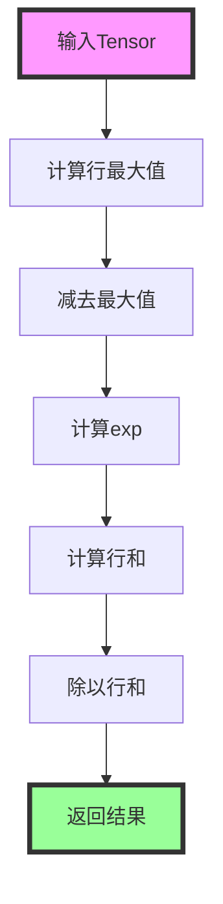

**代码实现（Softmax）：**

```cpp
Tensor Softmax(const Tensor &operand) {
    auto tRowmax = RowMaxExpand(operand);
    auto tSub = Sub(operand, tRowmax);
    auto tExp = Exp(tSub);
    auto tEsum = RowSumExpand(tExp);
    auto tSoftmax = Div(tExp, tEsum);
    return tSoftmax;
}
```

**代码实现（SoftmaxNew，数值稳定版本）：**

```cpp
Tensor SoftmaxNew(const Tensor &operand) {
    // 获取输入数据类型
    auto inputDtype = operand.GetStorage()->Datatype();
    Tensor castOperand = operand;
    // 如果输入数据类型不是FP32，则将其转换为FP32
    if (inputDtype != DataType::DT_FP32) {
        castOperand = Cast(operand, DataType::DT_FP32);
    }
    // 描述计算逻辑
    // M=rowMax(xi)
    auto rowmax = Amax(castOperand, -1, true);
    // S=rowSum(exp(xi-M))
    auto sub = Sub(castOperand, rowmax);
    auto exp = Exp(sub);
    auto esum = Sum(exp, -1, true);
    // softmax(zi)=exp(xi-M)/S
    auto softmax = Div(exp, esum);
    // 如果输出数据类型与输入不同，则进行类型转换
    if (inputDtype != softmax.GetStorage()->Datatype()) {
        softmax = Cast(softmax, inputDtype);
    }
    return softmax;
}
```

**关键概念：**

- **`RowMaxExpand()`**：计算每行的最大值并扩展维度
- **`RowSumExpand()`**：计算每行的和并扩展维度
- **`Amax()`**：计算指定维度的最大值
- **`Sum()`**：计算指定维度的和
- **数值稳定性**：通过减去最大值 `M` 来避免 `exp(x)` 溢出

**数值稳定性原理：**

- **问题**：直接计算 `exp(x_i)` 可能导致溢出
- **解决方案**：计算 `exp(x_i - M)`，其中 `M = max(x_j)`
- **数学等价性**：`exp(x_i - M) / sum(exp(x_j - M)) = exp(x_i) / sum(exp(x_j))`

### Quant 算子

**文件位置：** [`quantize/quant.cpp`](../../../framework/src/operator/quantize/quant.cpp)

**函数签名：** `std::tuple<Tensor, Tensor> Quant(const Tensor &input, bool isSymmetry, bool hasSmoothFactor, const Tensor &smoothFactor)`

**功能概述：** 将 FP32 张量量化为 INT8，支持对称和非对称量化。

**实现流程：**

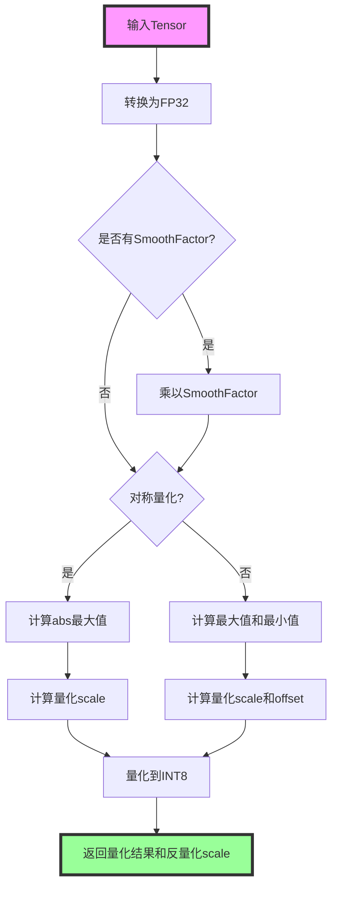

**代码实现：**

```cpp
std::tuple<Tensor, Tensor> Quant(
    const Tensor &input, bool isSymmetry, bool hasSmoothFactor, const Tensor &smoothFactor) {
    auto inputFp32 = Cast(input, DataType::DT_FP32, CAST_NONE);
    if (hasSmoothFactor) {
        inputFp32 = Mul(inputFp32, smoothFactor);
    }
    // perToken
    if (isSymmetry) {
        // 对称量化
        auto absRes = Abs(inputFp32);
        auto maxValue = Amax(absRes, -1, true);
        auto scaleQuant = ScalarDivS(maxValue, Element(DataType::DT_FP32, F_127), true);
        auto outFp32 = Mul(inputFp32, scaleQuant);
        auto outInt32 = Cast(outFp32, DataType::DT_INT32, CAST_RINT);
        auto outHalf = Cast(outInt32, DataType::DT_FP16, CAST_ROUND);
        auto outInt8 = Cast(outHalf, DataType::DT_INT8, CAST_TRUNC);
        auto scaleDeQuant = ScalarDivS(scaleQuant, Element(DataType::DT_FP32, F_1), true);
        return std::tie(outInt8, scaleDeQuant);
    } else {
        // 非对称量化
        auto maxValue = Amax(inputFp32, -1, true);
        auto minValue = Amin(inputFp32, -1, true);
        auto scaleDeQuant = ScalarMaxS(ScalarDivS(ScalarSub(maxValue, minValue),
            Element(DataType::DT_FP32, F_255)),
            Element(DataType::DT_FP32, F_1E_12));
        auto offset = ScalarSubS(ScalarDiv(maxValue, scaleDeQuant),
            Element(DataType::DT_FP32, F_127), true);
        auto scaleQuant = ScalarDivS(scaleDeQuant, Element(DataType::DT_FP32, F_1), true);
        auto outFp32 = Mul(inputFp32, scaleQuant);
        auto outInt32 = Cast(outFp32, DataType::DT_INT32, CAST_RINT);
        auto outHalf = Cast(outInt32, DataType::DT_FP16, CAST_ROUND);
        auto outInt8 = Cast(outHalf, DataType::DT_INT8, CAST_TRUNC);
        return std::tie(outInt8, scaleDeQuant);
    }
}
```

**关键概念：**

- **对称量化**：量化范围关于 0 对称，使用 `[-127, 127]` 范围
  - **量化公式**：`q = round(x / scale)`，其中 `scale = max(|x|) / 127`
  - **反量化公式**：`x = q * scale`

- **非对称量化**：量化范围不对称，使用 `[0, 255]` 范围
  - **量化公式**：`q = round((x - offset) / scale)`，其中 `scale = (max - min) / 255`
  - **反量化公式**：`x = q * scale + offset`

- **SmoothFactor**：平滑因子，用于量化前对输入进行缩放

- **PerToken 量化**：对每个 token（最后一个维度）独立计算量化参数

**量化流程：**

1. **类型转换**：将输入转换为 FP32
2. **SmoothFactor 处理**：如果提供，乘以平滑因子
3. **计算量化参数**：
   - 对称量化：计算绝对值的最大值
   - 非对称量化：计算最大值和最小值
4. **量化**：将 FP32 转换为 INT8
5. **返回结果**：返回量化后的张量和反量化 scale

### QuantMM 算子

**文件位置：** [`quantize/quant.cpp`](../../../framework/src/operator/quantize/quant.cpp)

**函数签名：** `Tensor QuantMM(const Tensor &operand1, const Tensor &operand2, const Tensor &dequantScaleW)`

**功能概述：** 量化矩阵乘法，提高计算效率。

**实现流程：**

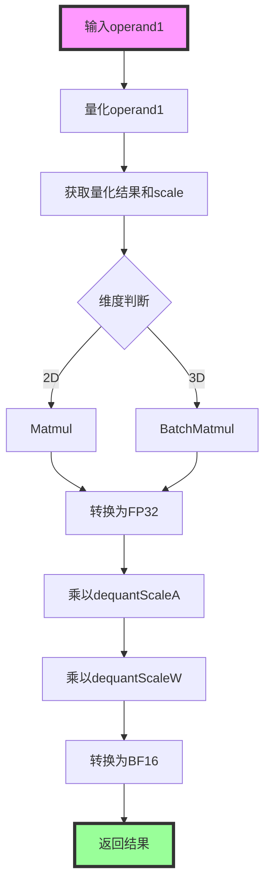

**代码实现：**

```cpp
Tensor QuantMM(const Tensor &operand1, const Tensor &operand2, const Tensor &dequantScaleW) {
    auto quantA = Quant(operand1);
    auto quantizedA = std::get<0>(quantA);
    auto dequantScaleA = std::get<1>(quantA);
    Tensor res;
    if (operand1.GetShape().size() == NUM_VALUE_2) {
        res = Matmul<false, false>(DataType::DT_INT32, quantizedA, operand2);
    } else if (operand1.GetShape().size() == NUM_VALUE_3) {
        res = BatchMatmul(DataType::DT_INT32, quantizedA, operand2);
    } else {
        assert(operand1.GetShape().size() <= NUM_VALUE_3);
    }
    res = Cast(res, DataType::DT_FP32);
    res = Mul(res, dequantScaleA);
    res = Mul(res, dequantScaleW);
    res = Cast(res, DataType::DT_BF16, CAST_RINT);
    return res;
}
```

**关键概念：**

- **量化矩阵乘法**：将输入矩阵量化为 INT8，使用 INT32 进行矩阵乘法，然后反量化
- **性能优势**：INT8 矩阵乘法比 FP32 矩阵乘法快得多
- **精度保持**：通过反量化 scale 保持计算精度

**计算流程：**

1. **量化输入**：将 `operand1` 量化为 INT8
2. **矩阵乘法**：使用 INT32 进行矩阵乘法（`quantizedA * operand2`）
3. **反量化**：将结果转换为 FP32，并乘以反量化 scale
4. **类型转换**：转换为 BF16 返回

### RMSNorm 算子

**文件位置：** [`normalization/rms_norm.cpp`](../../../framework/src/operator/normalization/rms_norm.cpp)

**函数签名：** `Tensor RmsNorm(const Tensor &operand)` 或 `Tensor RmsNorm(const Tensor &operand, const Tensor &gamma, float epsilon)`

**功能概述：** 计算 RMS（Root Mean Square）归一化，数学公式为 `rms_norm(x) = x / sqrt(mean(x^2) + epsilon)`。

**实现流程：**

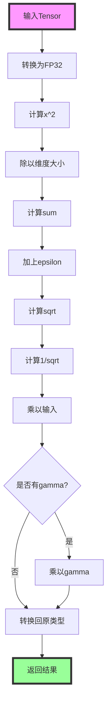

**代码实现（无gamma版本）：**

```cpp
Tensor RmsNorm(const Tensor &operand) {
    constexpr float epsilon = 1e-6f;
    
    auto fp32Operand = Cast(operand, DataType::DT_FP32);
    // y = x^2 / n
    auto y = Mul(fp32Operand, fp32Operand);
    y = Mul(y, Element(DataType::DT_FP32, 1.0f / operand.GetShape()[operand.GetShape().size() - 1]));
    
    // ReduceSum(x^2 / n) + Eps
    y = Sum(y, -1, true);
    y = Add(y, Element(DataType::DT_FP32, epsilon));
    
    // sqrt rstd
    y = Sqrt(y);
    Element src(DataType::DT_FP32, 1.0f);
    auto ones = Full(src, DT_FP32, y.GetShape());
    y = Div(ones, y);
    return Cast(Mul(fp32Operand, y), operand.GetStorage()->Datatype());
}
```

**关键概念：**

- **RMS归一化**：Root Mean Square 归一化，对最后一个维度进行归一化
- **epsilon**：防止除零的小常数（默认 `1e-6f`）
- **gamma**：可选的缩放参数，用于学习归一化后的缩放因子

**数学公式：**

- **无gamma版本**：`y = x / sqrt(mean(x^2) + epsilon)`
- **有gamma版本**：`y = gamma * x / sqrt(mean(x^2) + epsilon)`

### Sin 算子

**文件位置：** [`geometric/sin.cpp`](../../../framework/src/operator/geometric/sin.cpp)

**函数签名：** `Tensor Sin(Tensor operand)`

**功能概述：** 计算正弦函数，使用高精度算法保证从 `-10^10` 到 `10^10` 范围内的数据精度。

**实现特点：**

- **高精度算法**：使用多项式近似和范围缩减技术
- **数值稳定性**：通过多级范围缩减避免精度损失
- **精度保证**：在 `-10^10` 到 `10^10` 范围内保证精度

**关键概念：**

- **范围缩减**：将输入值缩减到 `[-π/2, π/2]` 范围内
- **多项式近似**：使用泰勒级数多项式近似计算 sin 和 cos
- **符号处理**：根据象限确定结果的符号

**实现流程：**

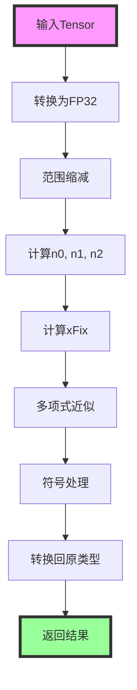

### PageAttention 算子

**文件位置：** [`models/deepseek/page_attention.cpp`](../../../framework/src/operator/models/deepseek/page_attention.cpp)

**函数签名：** `void PageAttention(Tensor &qNope, Tensor &kNopeCache, Tensor &vNopeCache, Tensor &qRope, Tensor &kRopeCache, Tensor &blockTable, Tensor &actSeqs, int blockSize, float softmaxScale, Tensor &attentionOut, PaTileShapeConfig &tileConfig, int maxUnrollTimes, bool isNzFormat)`

**功能概述：** 实现分页注意力机制（Page Attention），用于高效处理长序列注意力计算。

**关键概念：**

- **分页注意力**：将 KV Cache 分页存储，按需加载
- **Block Table**：块表，记录每个 batch 的块索引
- **动态循环**：使用 `LOOP()` 处理动态 batch 和序列长度
- **在线 Softmax**：使用在线 Softmax 算法，避免存储完整的注意力矩阵

**实现流程：**

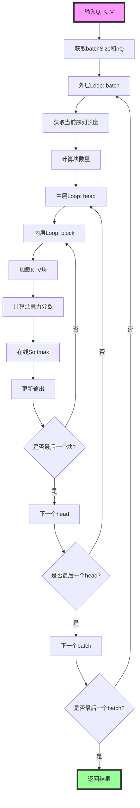

**关键代码片段：**

```cpp
void PageAttention(...) {
    FUNCTION("main", {qNope, kNopeCache, vNopeCache, qRope, kRopeCache, blockTable, actSeqs}, {attentionOut}) {
        SymbolicScalar batchSize = blockTable.GetShape()[0];
        SymbolicScalar nQ = qNope.GetShape()[0] / batchSize;
        SymbolicScalar nLoop = nQ / nTile;
        
        LOOP("LOOP_L0_bIdx", FunctionType::DYNAMIC_LOOP, bIdx, LoopRange(0, batchSize, 1)) {
            SymbolicScalar curSeq = GetTensorData(actSeqs, {bIdx});
            SymbolicScalar bnPerBatch = (curSeq + blockSize - 1) / blockSize;
            // ...
        }
    }
}
```

**关键概念：**

- **`GetTensorData()`**：获取张量数据，用于获取动态序列长度
- **`SymbolicScalar`**：符号标量，用于表示动态维度
- **在线Softmax**：使用在线算法计算 Softmax，避免存储完整的注意力矩阵
- **`View()`**：创建张量视图，用于访问 KV Cache 的特定块

### DynamicNSA 算子

**文件位置：** [`models/nsa/dynamic_nsa_v1.h`](../../../framework/src/operator/models/nsa/dynamic_nsa_v1.h), [`models/nsa/dynamic_nsa_v1.cpp`](../../../framework/src/operator/models/nsa/dynamic_nsa_v1.cpp)

**函数签名：** `void DynamicNsa(...)`

**功能概述：** 实现动态神经稀疏注意力（Dynamic Neural Sparse Attention），支持多种注意力模式的组合。

**关键特性：**

- **多模式注意力**：支持压缩注意力（Cmp Attention）、选择注意力（Sel Attention）、窗口注意力（Win Attention）
- **门控机制**：使用门控分数（Gating Score）选择注意力模式
- **动态Shape**：支持动态 batch 和序列长度
- **子图切分**：将整个 NSA 分为多个子图，通过 `loop_barrier` 管理依赖关系

**子图结构：**

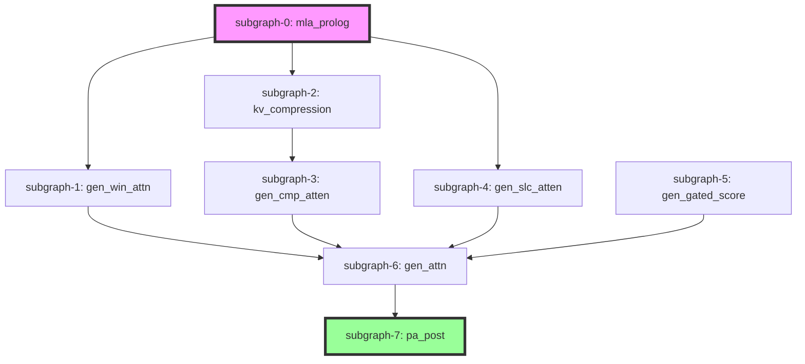

**关键概念：**

- **`loop_barrier`**：循环屏障，用于管理有数据依赖的子图之间的同步
- **门控分数**：用于选择不同注意力模式的分数
- **KV压缩**：压缩 KV Cache，减少内存使用
- **选择注意力**：基于 TopK 选择重要的注意力位置

---

## 算子开发模式

### 基础算子开发模式

基础算子通常遵循以下模式：

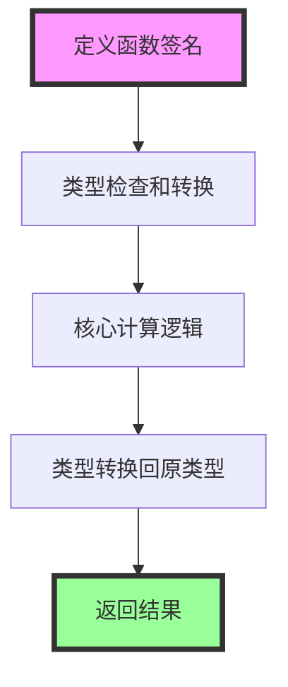

**开发步骤：**

1. **定义函数签名**：使用 `Tensor` 作为输入输出类型
2. **类型检查**：检查输入数据类型，必要时转换为 FP32
3. **核心计算**：使用 Tensor API 组合实现计算逻辑
4. **类型转换**：将结果转换回原始数据类型
5. **返回结果**：返回计算后的 Tensor

### 动态Shape算子开发模式

动态Shape算子需要支持运行时确定形状：

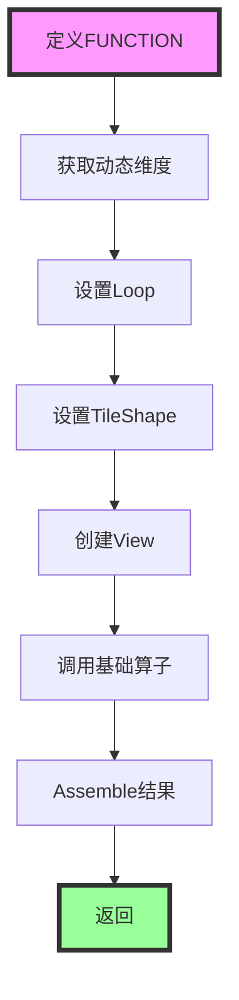

**示例：SoftmaxDynamic**

```cpp
void SoftmaxDynamic(Tensor &input, Tensor &output) {
    FUNCTION("SOFTMAX_DYNAMIC_EXAMPLE", {input}, {output}) {
        SoftmaxDynamicCompute(input, output);
    }
}

void SoftmaxDynamicCompute(Tensor &input, Tensor &output) {
    // 获取输入形状信息[b, n1, n2, dim], batch轴动态
    SymbolicScalar b = GetInputShape(input, 0);
    int n1 = input.GetShape()[1];
    int n2 = input.GetShape()[2];
    int dim = input.GetShape()[3];
    //设置Loop处理的batch大小及循环次数
    int tileB = 1;
    SymbolicScalar bLoop = b / tileB;
    // 定义循环，用于处理每个batch块
    LOOP("SOFTMAX_LOOP_L0_bIdx", FunctionType::DYNAMIC_LOOP, bIdx, LoopRange(0, bLoop, 1), {}, true) {
        // 计算偏移量
        SymbolicScalar bOffset = bIdx * tileB;
        std::vector<SymbolicScalar> outOffset = {bOffset, 0, 0, 0};
        // 对每个batch块进行tile切分
        TileShape::Current().SetVecTile({1, 4, 1, 64});
        // 创建输入视图
        auto inputView = View(input, {tileB, n1, n2, dim}, {bOffset, 0, 0, 0});
        // 调用Softmax算子函数
        auto outputView = SoftmaxNew(inputView);
        // 将输出结果组装到输出Tensor中
        Assemble(outputView, outOffset, output);
    }
}
```

**关键概念：**

- **`FUNCTION()`**：定义函数宏，用于创建 [`Function`](../../../framework/src/interface/function/function.h) 对象
  - **语法**：`FUNCTION("函数名", {输入列表}, {输出列表}) { ... }`
  - **作用**：创建一个新的 Function，用于封装算子逻辑
  
- **`SymbolicScalar`**：符号标量，用于表示动态维度
  - **创建方式**：`SymbolicScalar b = GetInputShape(input, 0);`
  - **运算支持**：支持加减乘除等基本运算
  - **用途**：表示运行时确定的维度大小
  
- **`GetInputShape()`**：获取输入张量的动态形状
  - **函数签名**：`SymbolicScalar GetInputShape(const Tensor &tensor, int dim)`
  - **功能**：获取指定维度的动态大小
  
- **`LOOP()`**：定义动态循环
  - **语法**：`LOOP("循环名", FunctionType::DYNAMIC_LOOP, 循环变量, LoopRange(起始, 结束, 步长), 展开提示, 是否barrier)`
  - **功能**：创建动态循环，用于处理动态维度
  
- **`View()`**：创建张量视图
  - **函数签名**：`Tensor View(const Tensor &tensor, const Shape &shape, const Offset &offset)`
  - **功能**：创建一个新的 LogicalTensor，指向原张量的特定视图
  - **内存优化**：避免数据拷贝，实现内存复用
  
- **`Assemble()`**：将结果组装到输出张量
  - **函数签名**：`void Assemble(const Tensor &source, const Offset &offset, Tensor &target)`
  - **功能**：将源张量的数据组装到目标张量的指定位置
  - **用途**：在循环中逐步组装最终结果

---

## 动态Shape支持

### 动态维度处理

PyPTO 支持动态Shape，算子需要正确处理动态维度：

**关键API：**

- **`GetInputShape()`**：获取输入张量的动态形状
  - **文件位置**：[`interface/inner/tilefwk.h`](../../../framework/src/interface/inner/tilefwk.h)
  - **功能**：获取指定维度的动态大小，返回 `SymbolicScalar`
  
- **`SymbolicScalar`**：符号标量类型，用于表示动态维度
  - **定义**：表示运行时确定的标量值
  - **运算**：支持加减乘除、比较等基本运算
  - **用途**：在编译时表示动态维度，运行时替换为实际值
  
- **`LOOP()`**：动态循环宏，用于处理动态维度
  - **文件位置**：[`interface/inner/tilefwk.h`](../../../framework/src/interface/inner/tilefwk.h)
  - **功能**：创建动态循环，循环次数在运行时确定

**处理模式：**

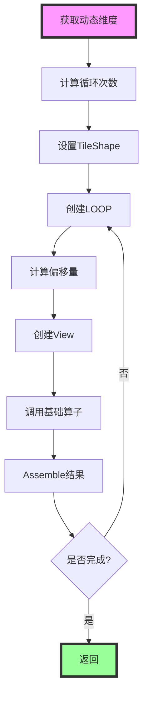

**处理步骤：**

1. **获取动态维度**：使用 `GetInputShape()` 获取动态维度
2. **计算循环次数**：根据动态维度和Tile大小计算循环次数
3. **设置TileShape**：使用 `TileShape::Current().SetVecTile()` 设置Tile大小
4. **循环处理**：使用 `LOOP()` 宏处理每个Tile
5. **View和Assemble**：使用 `View()` 和 `Assemble()` 处理数据

**示例：动态Softmax**

```cpp
void SoftmaxDynamicCompute(Tensor &input, Tensor &output) {
    // 1. 获取动态维度
    SymbolicScalar b = GetInputShape(input, 0);
    int n1 = input.GetShape()[1];
    int n2 = input.GetShape()[2];
    int dim = input.GetShape()[3];
    
    // 2. 计算循环次数
    int tileB = 1;
    SymbolicScalar bLoop = b / tileB;
    
    // 3. 创建动态循环
    LOOP("SOFTMAX_LOOP_L0_bIdx", FunctionType::DYNAMIC_LOOP, bIdx, LoopRange(0, bLoop, 1), {}, true) {
        // 4. 计算偏移量
        SymbolicScalar bOffset = bIdx * tileB;
        std::vector<SymbolicScalar> outOffset = {bOffset, 0, 0, 0};
        
        // 5. 设置TileShape
        TileShape::Current().SetVecTile({1, 4, 1, 64});
        
        // 6. 创建View
        auto inputView = View(input, {tileB, n1, n2, dim}, {bOffset, 0, 0, 0});
        
        // 7. 调用基础算子
        auto outputView = SoftmaxNew(inputView);
        
        // 8. Assemble结果
        Assemble(outputView, outOffset, output);
    }
}
```

**关键概念详解：**

- **`SymbolicScalar`**：符号标量
  - **创建**：通过 `GetInputShape()` 或 `GetTensorData()` 创建
  - **运算**：支持 `+`, `-`, `*`, `/`, `%` 等运算
  - **中间变量**：使用 `AsIntermediateVariable()` 标记为中间变量，优化代码生成
  
- **`LOOP()` 宏参数**：
  - **循环名**：字符串，用于标识循环
  - **函数类型**：`FunctionType::DYNAMIC_LOOP` 表示动态循环
  - **循环变量**：循环索引变量名
  - **循环范围**：`LoopRange(起始, 结束, 步长)`
  - **展开提示**：`PowersOf2(n)` 表示展开提示
  - **是否barrier**：`true` 表示循环屏障，用于同步
  
- **`View()` 和 `Assemble()`**：
  - **`View()`**：创建视图，不拷贝数据
  - **`Assemble()`**：组装数据，将源张量数据写入目标张量
  - **内存优化**：通过视图和组装减少内存拷贝

---

## 最佳实践

### 1. 算子实现

**推荐做法：**

- 使用 FP32 进行中间计算，避免精度损失
- 实现数值稳定的算法（如 Softmax 减去最大值）
- 支持动态Shape，使用 `SymbolicScalar` 和 `LOOP()`
- 合理使用 `View()` 和 `Assemble()` 进行内存优化

### 2. 类型处理

**推荐做法：**

- 检查输入数据类型，必要时转换为 FP32
- 计算完成后转换回原始数据类型
- 使用 `Cast()` 函数进行类型转换

### 3. 性能优化

**推荐做法：**

- 使用量化算子提高计算效率
- 合理设置 TileShape，充分利用硬件并行性
- 使用 `View()` 和 `Assemble()` 减少内存拷贝

---

## 常见问题

### 1. 精度问题

**问题：** 算子计算结果精度不准确。

**可能原因：**
- 中间计算精度不足
- 数值不稳定

**解决方案：**
- 使用 FP32 进行中间计算
- 实现数值稳定的算法（如 Softmax 减去最大值）

### 2. 动态Shape问题

**问题：** 动态Shape算子执行失败。

**可能原因：**
- 动态维度处理错误
- Loop范围计算错误

**解决方案：**
- 正确使用 `GetInputShape()` 获取动态维度
- 正确计算Loop范围和偏移量

### 3. 性能问题

**问题：** 算子执行性能不理想。

**可能原因：**
- TileShape设置不合理
- 内存访问模式不佳

**解决方案：**
- 优化 TileShape 设置
- 使用 `View()` 和 `Assemble()` 优化内存访问

---

## 相关文档

- [Function 类详细文档](03-function.md)
- [Interface 模块文档](02-interface.md)
- [Framework 模块文档](01-framework.md)
- 示例体系与选型建议见：[仓库 examples/ 全景速览](../01-examples/01-examples-catalog.md)

---

## 总结

`operator` 模块是 PyPTO 编译框架的算子实现层，提供了：

1. **完整的算子库**：从基础算子到复杂模型算子
2. **统一的接口**：基于 Tensor API 的统一算子接口
3. **动态Shape支持**：支持运行时确定形状的算子
4. **性能优化**：量化算子等性能优化算子
5. **易于扩展**：清晰的算子开发模式，便于添加新算子

通过深入理解 `operator` 模块的设计和实现，开发者可以更好地使用现有算子，开发新的算子，优化算子性能。

