# Machine 模块技术文档

> **适用对象：** 想要理解执行调度的开发者、性能优化人员  
> **学习时间：** 50-70分钟  
> **前置知识：** 已阅读[Passes模块](07-passes.md)和[Codegen模块](08-codegen.md)  
> **学习目标：** 理解MPMD执行模型、设备任务调度和运行时管理

## 概述

`machine` 模块是 PyPTO 编译框架的执行层核心组件，负责将编译后的 IR 转换为可在 NPU 设备上执行的代码，并管理设备端的任务调度和执行。该模块连接了编译层和硬件执行层，实现了从高级 IR 到底层硬件指令的转换和执行。

**模块职责：**
- 🖥️ **主机端编译**：计算工作空间大小、准备编译信息
- 💾 **运行时管理**：管理设备内存、流等运行时资源
- 📡 **设备端调度**：MPMD模式的任务调度和执行
- ⚡ **性能优化**：通过高效调度提升执行性能

**模块位置：**
- 目录路径：[`framework/src/machine`](../../../framework/src/machine)
- 构建目标：`tile_fwk_compiler`（共享库）
- 相关文档：[Interface 模块文档](02-interface.md)、[Function 类详细文档](03-function.md)

### 实现细节速查（把“能跑起来”与“能定位问题”对齐）

**Python 侧的执行入口（你调试 most likely 会从这里开始）：**
- 旧版 `@pypto.jit`：`python/pypto/runtime.py::_JIT.run_with_npu()` / `dispatch_with_run_mode()`
- 新版 `@pypto.frontend.jit`：`python/pypto/frontend/parser/entry.py::JitCallableWrapper._run()` / `_dispatch_with_run_mode()`

**Python 入口/后端 API 调用链（调试入口图）：**

```mermaid
graph LR
    A[Python 入口] --> B[后端 API]
    B --> C[C++ 实现]
    
    A1[@pypto.jit] --> B1[pypto_impl.GetWorkSpaceSize]
    A2[@pypto.frontend.jit] --> B2[pypto_impl.OperatorDeviceRunOnce]
    
    B1 --> C1[framework/src/machine/host/]
    B2 --> C2[framework/src/machine/runtime/]
    
    style A fill:#e1f5fe
    style B fill:#f3e5f5
    style C fill:#fff3e0
```

**关键后端 API（pypto_impl）调用链：**
- 工作空间查询：`pypto_impl.GetWorkSpaceSize(handler, in, out)`
- 设备执行：`pypto_impl.OperatorDeviceRunOnceDataFromDevice(...)`
- Host 侧一次性执行（CPU tensor）：`pypto_impl.DeviceRunOnceDataFromHost(...)`

**设备选择/流：**
- `torch.npu.set_device()` / `torch.npu.current_stream().npu_stream`（见 `python/pypto/runtime.py` 与 `python/pypto/frontend/parser/entry.py`）

**与 MPMD 的关系（你在 C++ 层应该找哪里）：**
- 主机端编译信息准备：`framework/src/machine/host/`
- 运行时/任务准备：`framework/src/machine/runtime/`
- 设备端调度：`framework/src/machine/device/`

---

## 目录

- [架构定位](#架构定位)
- [模块组织](#模块组织)
- [核心模块详解](#核心模块详解)
- [执行流程](#执行流程)
- [关键概念详解](#关键概念详解)
- [内存管理](#内存管理)
- [任务调度](#任务调度)
- [最佳实践](#最佳实践)
- [常见问题](#常见问题)

---

## 架构定位

### 在编译框架中的位置

`machine` 模块在 PyPTO 编译框架中处于执行层，负责将编译后的 IR 转换为可执行代码并调度执行：

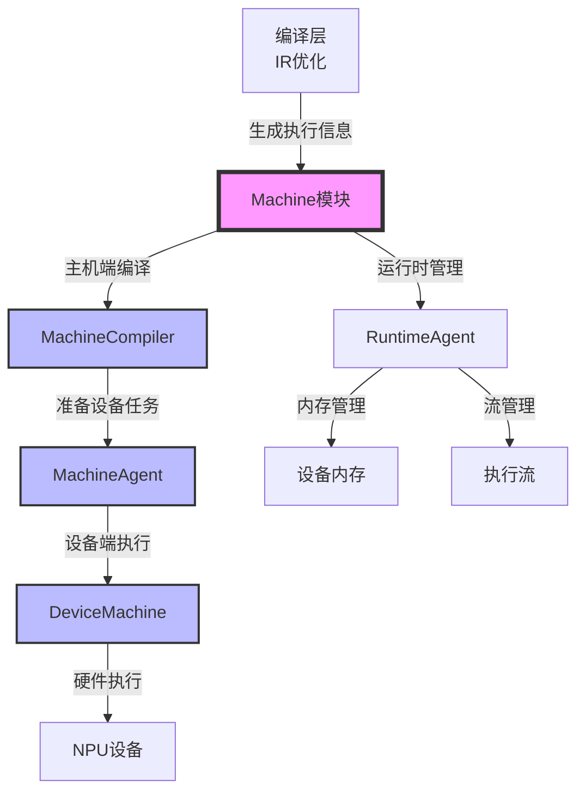

**执行层职责：**

| 阶段 | Machine 模块职责 | 关键组件 |
|------|----------------|---------|
| **编译阶段** | 准备编译信息，计算工作空间大小 | [`MachineCompiler`](../../../framework/src/machine/host/machine_compiler.h), [`MachineCompileInfo`](../../../framework/src/machine/host/machine_compiler.h#L27) |
| **准备阶段** | 分配内存，准备设备任务 | [`MachineAgent`](../../../framework/src/machine/runtime/machine_agent.h), [`DeviceAgentTask`](../../../framework/src/machine/host/device_agent_task.h) |
| **执行阶段** | 调度任务到设备，管理执行流 | [`DeviceMachine`](../../../framework/src/machine/device/device_machine.h), [`AiCoreManager`](../../../framework/src/machine/device/aicore_manager.h) |
| **运行时** | 内存管理，流管理，错误处理 | [`RuntimeAgent`](../../../framework/src/machine/runtime/runtime.h), [`RuntimeAgentMemory`](../../../framework/src/machine/runtime/runtime.h#L132) |

### 类图

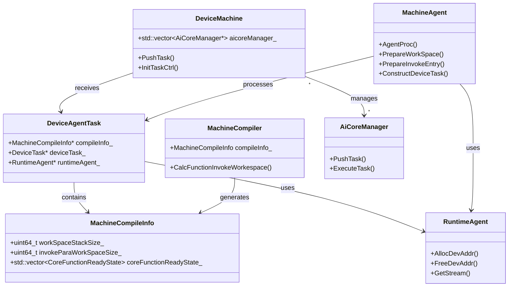

### 执行流程概览


---

## 模块组织

### 模块结构

根据 [`CMakeLists.txt`](../../../framework/src/machine/CMakeLists.txt)，`machine` 模块包含以下子模块：

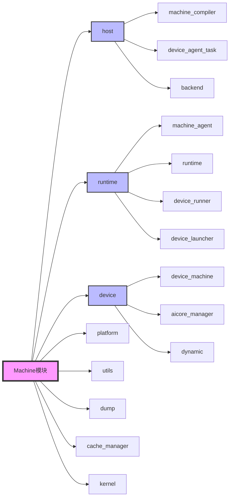

### 模块分类

#### 1. Host 模块（主机端）

**核心组件：**

- **`machine_compiler`**：编译信息准备
  - [`MachineCompiler`](../../../framework/src/machine/host/machine_compiler.h)：编译信息计算
  - [`MachineCompileInfo`](../../../framework/src/machine/host/machine_compiler.h#L27)：编译信息结构

- **`device_agent_task`**：设备代理任务
  - [`DeviceAgentTask`](../../../framework/src/machine/host/device_agent_task.h)：设备任务封装

- **`backend`**：后端接口
  - 提供编译和执行的后端接口

#### 2. Runtime 模块（运行时）

**核心组件：**

- **`machine_agent`**：机器代理
  - [`MachineAgent`](../../../framework/src/machine/runtime/machine_agent.h)：设备任务准备和执行
  - [`MachinePipe`](../../../framework/src/machine/runtime/machine_agent.h#L58)：任务管道处理

- **`runtime`**：运行时环境
  - [`RuntimeAgent`](../../../framework/src/machine/runtime/runtime.h#L238)：运行时代理（单例）
  - [`RuntimeAgentMemory`](../../../framework/src/machine/runtime/runtime.h#L132)：内存管理
  - [`RuntimeAgentStream`](../../../framework/src/machine/runtime/runtime.h#L214)：流管理

- **`device_runner`**：设备运行器
  - 负责将任务提交到设备执行

#### 3. Device 模块（设备端）

**核心组件：**

- **`device_machine`**：设备机器
  - [`DeviceMachine`](../../../framework/src/machine/device/device_machine.h#L31)：设备端任务调度和执行

- **`aicore_manager`**：AI Core 管理器
  - [`AiCoreManager`](../../../framework/src/machine/device/aicore_manager.h)：AI Core 任务管理

- **`dynamic`**：动态执行
  - 支持动态形状和动态调度的设备端实现

---

## 核心模块详解

### MachineCompiler 模块

**文件位置：** [`host/machine_compiler.h`](../../../framework/src/machine/host/machine_compiler.h), [`host/machine_compiler.cpp`](../../../framework/src/machine/host/machine_compiler.cpp)

**核心结构：** [`MachineCompileInfo`](../../../framework/src/machine/host/machine_compiler.h#L27)

**功能概述：** `MachineCompiler` 负责计算函数调用的工作空间大小、参数偏移等信息，为设备端执行做准备。

#### MachineCompileInfo 结构

```cpp
struct MachineCompileInfo {
    uint32_t aicoreCnt{AICORE_NUM};              // AI Core数量
    uint64_t programFunctionCnt;                 // 程序函数数量（同构后）
    uint64_t coreFunctionCnt;                     // 核心函数数量
    uint64_t workSpaceStackSize{0};              // 工作空间栈大小（OOO调度使用）
    uint64_t invokeParaWorkSpaceSize{0};         // 调用参数工作空间大小
    size_t invokeOffsetSize{0};                  // 调用偏移大小
    std::vector<std::string> commGroups;         // 通信组列表
    std::map<uint64_t, std::list<InvokeParaOffset>> invokeParaOffset;  // 调用参数偏移映射
    std::map<uint64_t, uint64_t> coreFunctionIdToProgramId;  // 核心函数ID到程序函数ID的映射
    std::vector<CoreFunctionReadyState> coreFunctionReadyState;  // 核心函数就绪状态
    std::vector<uint64_t> readyAicIdVec;        // 就绪的AIC ID列表
    std::vector<uint64_t> readyAivIdVec;         // 就绪的AIV ID列表
    std::vector<uint64_t> readyAicpuIdVec;       // 就绪的AICPU ID列表
    std::vector<uint64_t> coreFuncBinOffset;     // 核心函数二进制偏移
    std::vector<std::vector<uint64_t>> invokeArgsOffset;  // 调用参数偏移
    std::vector<std::vector<int64_t>> invokeTensorsIdx;   // 调用张量索引
    std::vector<uint64_t> coreFunctionInvokeEntryOffset;  // 核心函数调用入口偏移
    std::vector<TensorInfo> coreTensorInfoVec;   // 核心张量信息列表
    std::vector<uint64_t> coreFunctionTensorInfoOffset;  // 核心函数张量信息偏移
    std::vector<uint64_t> coreTensorNum;         // 核心张量数量
    std::shared_ptr<Distributed::TilingManager> distTilingManager;  // 分布式Tiling管理器
};
```

**关键概念：**

- **`aicoreCnt`**：AI Core 数量，默认值为 `AICORE_NUM`（75），用于计算工作空间大小
- **`programFunctionCnt`**：程序函数数量，表示同构后的函数数量
- **`coreFunctionCnt`**：核心函数数量，表示编译后的核心函数数量
- **`workSpaceStackSize`**：工作空间栈大小，用于 OOO（Out-of-Order）调度
- **`invokeParaWorkSpaceSize`**：调用参数工作空间大小，用于存储函数调用的参数
- **`invokeParaOffset`**：调用参数偏移映射，key 为 `esgid`（Execute Graph ID），value 为参数偏移列表

#### CalcFunctionInvokeWorkespace 函数

**函数签名：** [`void CalcFunctionInvokeWorkespace(Function* cacheFunction, Function* function, MachineCompileInfo& compileInfo)`](../../../framework/src/machine/host/machine_compiler.cpp#L32)

**功能：** 计算函数调用的工作空间大小和参数偏移。

**代码位置：** [`machine_compiler.cpp:32`](../../../framework/src/machine/host/machine_compiler.cpp#L32)

**执行流程（层层递进）：**

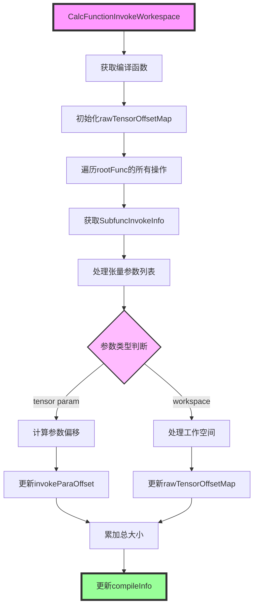

**代码详解：**

**第一层：获取编译函数**

```cpp
Function *compiledFunction = cacheFunction ? cacheFunction : function;
```

**关键点：**
- 优先使用 `cacheFunction`（缓存函数），如果不存在则使用 `function`
- `cacheFunction` 是编译后的函数，包含完整的执行信息

**第二层：初始化偏移映射表**

```cpp
std::map<int, std::pair<uint64_t, uint64_t>> rawTensorOffsetMap;
```

**关键概念：**
- **`rawTensorOffsetMap`**：RawTensor 偏移映射表
  - **key**：`storageId`（存储ID，通常是 `rawmagic` 或 `storage->id_`）
  - **value**：`(offset, size)` 对，表示在工作空间中的偏移和大小
- **作用**：避免重复分配相同 RawTensor 的内存，实现内存复用

**第三层：计算偏移量的核心函数**

```cpp
auto calcOffsetFunc = [](const std::vector<int64_t> &offset, 
                         const std::vector<int64_t> &shape) -> uint64_t {
    uint64_t offSetSize = 0;
    auto strideShapeFunc = [&shape](size_t i) -> auto {
        uint64_t stride = 1;
        for (size_t j = i; j < shape.size(); j++) {
            stride *= shape[j];
        }
        return stride;
    };
    for (size_t i = 0; i < shape.size(); i++) {
        offSetSize += offset[i] * strideShapeFunc(i + 1);
    }
    return offSetSize;
};
```

**计算原理：**
- **步长计算**：对于维度 `i`，步长 = `shape[i+1] * shape[i+2] * ... * shape[n-1]`
- **偏移计算**：`offset[i] * stride[i+1]`，累加所有维度的贡献
- **示例**：`offset=[2,3]`, `shape=[10,20]`
  - 维度0步长：`20`
  - 维度1步长：`1`
  - 总偏移：`2 * 20 + 3 * 1 = 43`

**第四层：工作空间偏移处理函数**

```cpp
auto workSpaceOffsetProcFunc = [&](const LogicalTensorPtr& tensor, int rawMagic,
                                   const std::vector<int64_t>& rawShape, 
                                   const std::vector<int64_t>& offset,
                                   std::list<InvokeParaOffset>& curSubFuncParaOffset,
                                   bool isTensorPara) {
    // 1. 获取RawTensor
    auto rawTensor = getRawTensorByTensorMagic(rawMagic);
    
    // 2. 确定storageId和alignSize
    int storageId = rawTensor->GetRawMagic();
    uint64_t alignSize = 0;
    if (storage != nullptr) {
        storageId = storage->id_;
        alignSize = storage->length_;
    } else {
        alignSize = (CalcShapeSizeFunc(rawShape) * BytesOf(rawTensor->GetDataType()) + 511) / 512 * 512;
    }
    
    // 3. 查找或插入rawTensorOffsetMap
    auto iter = rawTensorOffsetMap.find(storageId);
    if (iter != rawTensorOffsetMap.end()) {
        // 复用已有偏移
        rawTensorOffset = iter->second.first;
    } else {
        // 插入新偏移
        rawTensorOffset = totalSize;
        totalSize += alignSize;
        rawTensorOffsetMap[storageId] = std::make_pair(rawTensorOffset, alignSize);
    }
    
    // 4. 计算视图偏移
    uint64_t offSetSize = calcOffsetFunc(offset, rawShape) * BytesOf(rawTensor->GetDataType());
    
    // 5. 创建InvokeParaOffset
    paraOffset.offset = rawTensorOffset + offSetSize;
    paraOffset.rawTensorOffset = rawTensorOffset;
    // ...
};
```

**关键概念：**

- **`storage`**：存储对象，如果存在则使用其 `id_` 和 `length_`
- **`alignSize`**：对齐后的大小，512字节对齐
- **内存复用**：相同 `storageId` 的 RawTensor 共享工作空间偏移
- **视图偏移**：`offset` 表示 LogicalTensor 在 RawTensor 中的视图偏移

**第五层：遍历所有操作**

```cpp
for (uint64_t i = 0; i < compiledFunction->rootFunc_->Operations().size(); ++i) {
    const SubfuncInvokeInfoTy &subfuncInvoke = compiledFunction->rootFunc_->GetSubFuncInvokeInfo(i);
    auto &curSubFuncParaOffset = compileInfo.invokeParaOffset[i];
    
    // 处理张量参数列表
    for (const auto &elm : subfuncInvoke.GetTensorParamList()) {
        // ...
    }
}
```

**关键概念：**

- **`SubfuncInvokeInfo`**：子函数调用信息，包含该操作的参数列表
- **`GetTensorParamList()`**：获取张量参数列表
- **`invokeParaOffset[i]`**：第 `i` 个操作的参数偏移列表

**第六层：处理张量参数**

```cpp
for (const auto &elm : subfuncInvoke.GetTensorParamList()) {
    InvokeParaOffset paraOffset;
    auto rawTensor = getRawTensorByTensorMagic(elm.ddrId);
    
    // 计算偏移
    paraOffset.offset = calcOffsetFunc(elm.offset, elm.rawShape) * BytesOf(elm.dType);
    
    // 设置参数信息
    paraOffset.paramType = elm.isOutputToGM ? 0 : 1;
    paraOffset.tensorShape = elm.shape;
    paraOffset.rawTensorShape = elm.rawShape;
    paraOffset.opOriginArgsSeq = function->GetParamIndex(rawTensor);
    paraOffset.isTensorParam = true;
    
    // 如果无法映射到原始参数，则使用工作空间
    if (paraOffset.rawTensorAddr == nullptr && 
        paraOffset.opOriginArgsSeq == INVALID_IN_OUT_INDEX) {
        workSpaceOffsetProcFunc(elm.tensor, elm.ddrId, elm.rawShape, elm.offset,
                               curSubFuncParaOffset, true);
    }
}
```

**关键概念：**

- **`ddrId`**：DDR ID，即 RawTensor 的 `rawmagic`
- **`isOutputToGM`**：是否输出到全局内存（Global Memory）
- **`GetParamIndex()`**：获取参数在原始参数列表中的索引
- **`INVALID_IN_OUT_INDEX`**：无效的输入输出索引，表示无法映射到原始参数

**关键概念总结：**

- **`rawTensorOffsetMap`**：RawTensor 偏移映射表，key 为 `storageId`，value 为 `(offset, size)` 对
- **`InvokeParaOffset`**：调用参数偏移结构，包含参数在工作空间中的偏移信息
- **存储对齐**：设备内存分配需要 512 字节对齐，用于性能优化
- **内存复用**：相同 `storageId` 的 RawTensor 共享工作空间，减少内存使用

### MachineAgent 模块

**文件位置：** [`runtime/machine_agent.h`](../../../framework/src/machine/runtime/machine_agent.h), [`runtime/machine_agent.cpp`](../../../framework/src/machine/runtime/machine_agent.cpp)

**核心类：** [`MachineAgent`](../../../framework/src/machine/runtime/machine_agent.h#L36)

**功能概述：** `MachineAgent` 负责准备设备任务，包括内存分配、参数准备、拓扑准备等，是连接主机端和设备端的关键组件。

#### AgentProc 函数

**函数签名：** [`static void AgentProc(DeviceAgentTask* task)`](../../../framework/src/machine/runtime/machine_agent.h#L39)

**功能：** 设备代理处理函数，准备设备任务的所有必要信息。

**执行流程：**

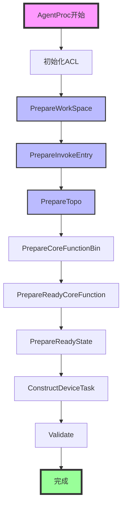

**关键步骤详解：**

#### 1. PrepareWorkSpace - 准备工作空间

**函数签名：** [`static int PrepareWorkSpace(DeviceAgentTask* task)`](../../../framework/src/machine/runtime/machine_agent.h#L43)

**功能：** 分配设备端工作空间内存。

**代码位置：** [`machine_agent.cpp:90`](../../../framework/src/machine/runtime/machine_agent.cpp#L90)

**执行逻辑：**

```cpp
int MachineAgent::PrepareWorkSpace(DeviceAgentTask *task) {
    // 如果工作空间地址已提供（API模式），直接返回
    if (task->deviceInfo.workspaceGmAddr != nullptr) {
        return MACHINE_OK;
    }
    
    // 计算工作空间大小
    uint64_t workSpaceSize =
        task->compileInfo.invokeParaWorkSpaceSize +
        task->compileInfo.aicoreCnt * task->compileInfo.workSpaceStackSize;
    
    // 分配设备内存
    uint8_t *workSpaceAddr = nullptr;
    machine::GetRA()->AllocDevAddr(&workSpaceAddr, workSpaceSize);
    task->deviceInfo.workspaceGmAddr = workSpaceAddr;
    
    return MACHINE_OK;
}
```

**关键概念：**

- **`workspaceGmAddr`**：工作空间全局内存地址（Global Memory Address）
- **`invokeParaWorkSpaceSize`**：调用参数工作空间大小
- **`workSpaceStackSize`**：每个 AI Core 的工作空间栈大小
- **总大小计算**：`invokeParaWorkSpaceSize + aicoreCnt * workSpaceStackSize`

#### 2. PrepareInvokeEntry - 准备调用入口

**函数签名：** [`static int PrepareInvokeEntry(DeviceAgentTask* task)`](../../../framework/src/machine/runtime/machine_agent.h#L44)

**功能：** 准备函数调用的入口参数，将参数地址写入工作空间。

**代码位置：** [`machine_agent.cpp:150`](../../../framework/src/machine/runtime/machine_agent.cpp#L150)

**执行逻辑（层层递进）：**

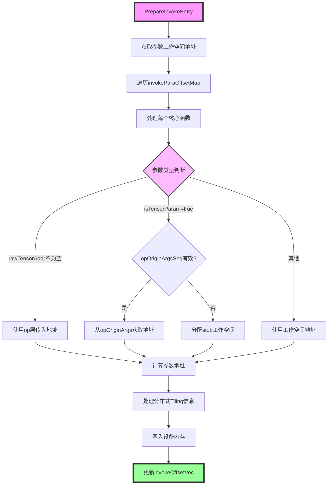

**代码详解：**

**第一层：获取工作空间地址**

```cpp
uint8_t *paraWorkSpaceAddr = task->deviceInfo.workspaceGmAddr;
```

**关键点：**
- `workspaceGmAddr` 是在 `PrepareWorkSpace()` 中分配的全局内存地址
- 这是所有参数和工作空间的基地址

**第二层：遍历调用参数偏移映射**

```cpp
std::map<uint64_t, std::list<InvokeParaOffset>> &invokeParaOffsetMap =
    task->compileInfo.invokeParaOffset;
for (auto &mapEntry : invokeParaOffsetMap) {
    uint64_t coreFuncId = mapEntry.first;  // Execute Graph ID
    std::list<InvokeParaOffset> &invokeParaOffsetList = mapEntry.second;
    // ...
}
```

**关键概念：**
- **`esgid`（Execute Graph ID）**：执行图ID，标识一个核心函数
- **`invokeParaOffsetList`**：该核心函数的所有参数偏移列表

**第三层：处理每个参数（三种情况）**

**情况1：`rawTensorAddr` 不为空**

```cpp
if (elm.rawTensorAddr != nullptr) {
    // 直接使用op层传入的workspace地址
    value = reinterpret_cast<uint64_t>(elm.rawTensorAddr) + elm.offset;
    invokeOffsetVec.push_back(value);
}
```

**使用场景：** 操作层已经提供了张量地址（如显式参数模式）

**情况2：`isTensorParam = true`**

```cpp
if (elm.isTensorParam) {
    if (elm.opOriginArgsSeq != INVALID_IN_OUT_INDEX) {
        // 从opOriginArgs获取地址
        elm.rawTensorAddr = task->GetOpOriginArgsRawTensorAddr(elm.opOriginArgsSeq);
        value = reinterpret_cast<uint64_t>(elm.rawTensorAddr) + elm.offset;
    } else {
        // 分配stub工作空间
        auto addr = task->deviceInfo.stubOutRawTensorAddr.find(elm.rawMagic);
        if (addr == task->deviceInfo.stubOutRawTensorAddr.end()) {
            elm.rawTensorAddr = paraWorkSpaceAddr + elm.rawTensorOffset;
            task->deviceInfo.stubOutRawTensorAddr[elm.rawMagic] = elm.rawTensorAddr;
        }
        value = reinterpret_cast<uint64_t>(paraWorkSpaceAddr) + elm.offset;
    }
}
```

**关键概念：**
- **`opOriginArgsSeq`**：操作原始参数序列号，用于从 `opOriginArgs_` 中获取地址
- **`stubOutRawTensorAddr`**：Stub输出RawTensor地址映射，用于管理stub输出的内存
- **Stub输出**：某些函数的输出需要在工作空间中分配

**情况3：其他（InCast/OutCast）**

```cpp
else {
    // 使用工作空间地址
    value = reinterpret_cast<uint64_t>(paraWorkSpaceAddr) + elm.offset;
    invokeOffsetVec.push_back(value);
}
```

**使用场景：** InCast（输入）和 OutCast（输出）参数，使用工作空间地址

**第四层：处理分布式Tiling信息**

```cpp
PrepareDistTilingInfo(task, elm, invokeOffsetVec);
```

**功能：** 如果参数需要分布式Tiling信息，将Tiling数据复制到设备内存。

**第五层：写入设备内存**

```cpp
// 分配设备内存
machine::GetRA()->AllocDevAddr(&invokeEntyDev, invokeOffsetVecSize);
// 复制数据到设备
machine::GetRA()->CopyToDev(
    invokeEntyDev, 
    reinterpret_cast<uint8_t *>(invokeOffsetVec.data()), 
    invokeOffsetVecSize);
```

**关键概念：**

- **`invokeParaOffsetMap`**：调用参数偏移映射，key 为 `esgid`（Execute Graph ID），value 为参数偏移列表
- **`InvokeParaOffset`**：调用参数偏移结构，包含：
  - `rawMagic`：RawTensor 的 magic ID
  - `offset`：在工作空间中的偏移
  - `rawTensorOffset`：在 RawTensor 中的偏移
  - `rawSymbol`：RawTensor 的符号名称
  - `rawTensorAddr`：RawTensor 的地址（可能为nullptr）
  - `isTensorParam`：是否为张量参数
  - `opOriginArgsSeq`：操作原始参数序列号

#### 3. PrepareTopo - 准备拓扑

**函数签名：** [`static int PrepareTopo(DeviceAgentTask* task)`](../../../framework/src/machine/runtime/machine_agent.h#L45)

**功能：** 准备执行图的拓扑信息，包括依赖关系和调度顺序。

**关键概念：**

- **拓扑信息**：描述函数之间的依赖关系
- **调度顺序**：根据依赖关系确定的执行顺序

#### 4. PrepareCoreFunctionBin - 准备核心函数二进制

**函数签名：** [`static int PrepareCoreFunctionBin(DeviceAgentTask* task)`](../../../framework/src/machine/runtime/machine_agent.h#L46)

**功能：** 准备核心函数的二进制代码，将编译后的代码复制到设备内存。

**关键概念：**

- **`coreFuncBinOffset`**：核心函数二进制偏移列表
- **二进制代码**：编译后的可执行代码

#### 5. ConstructDeviceTask - 构建设备任务

**函数签名：** [`static int ConstructDeviceTask(DeviceAgentTask* task)`](../../../framework/src/machine/runtime/machine_agent.h#L53)

**功能：** 构建最终的设备任务结构，包括填充设备任务的所有字段。

**代码位置：** [`machine_agent.cpp:450`](../../../framework/src/machine/runtime/machine_agent.cpp#L450)

**执行流程（层层递进）：**

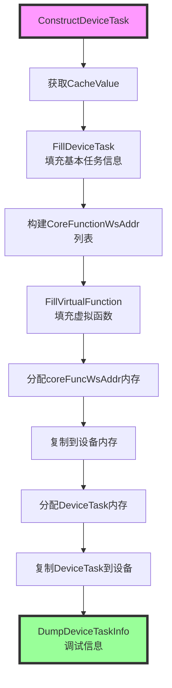

**代码详解：**

**第一层：获取缓存值和填充基本任务信息**

```cpp
CacheValue cacheValue = task->GetFuncCacheValue().value();
MachineDeviceAgentInfo &devInfo = task->deviceInfo;
DeviceTask &devTask = devInfo.devceTask;
FillDeviceTask(task, devTask, devInfo);
```

**关键点：**
- 从 `DeviceAgentTask` 获取缓存值（包含编译后的函数信息）
- 调用 `FillDeviceTask()` 填充设备任务的基本信息

**第二层：构建核心函数工作空间地址列表**

```cpp
for (uint64_t i = 0; i < devInfo.coreFunctionInvokeEntryAddr.size(); i++) {
    devInfo.coreFunctionWsAddr.push_back(
        CoreFunctionWsAddr(
            devInfo.coreFuncBinAddr.at(i),                    // 函数二进制地址
            devInfo.coreFunctionInvokeEntryAddr.at(i),         // 调用入口地址
            task->compileInfo.coreFunctionIdToProgramId[i],    // 程序函数ID
            devInfo.coreFunctionTopoAddr.at(i),                // 拓扑地址
            devInfo.coreFunctionInvokeEntryInfo.at(i),         // 调用入口信息
            task->compileInfo.coreTensorNum.at(i),            // 张量数量
            devInfo.coreFunctionInvokeEntryOriAddr.at(i)      // 原始调用入口地址
        ));
}
```

**关键概念：**

- **`CoreFunctionWsAddr`**：核心函数工作空间地址结构，包含函数执行所需的所有地址信息
- **`coreFuncBinAddr`**：函数二进制代码地址，指向编译后的可执行代码
- **`coreFunctionInvokeEntryAddr`**：调用入口地址，指向参数地址列表
- **`coreFunctionIdToProgramId`**：核心函数ID到程序函数ID的映射（`esgid` -> `psgid`）
- **`coreFunctionTopoAddr`**：拓扑地址，指向依赖关系信息
- **`coreTensorNum`**：张量数量，该函数使用的张量数量

**第三层：填充虚拟函数**

```cpp
FillVirtualFunction(task);
```

**功能：** 为虚拟函数（Virtual Function）创建工作空间地址，虚拟函数用于子图切分等场景。

**第四层：分配和复制核心函数工作空间地址**

```cpp
uint8_t *coreFuncWsGmAddr = nullptr;
uint64_t allocSize = devInfo.coreFunctionWsAddr.size() * sizeof(CoreFunctionWsAddr);
machine::GetRA()->AllocDevAddr(&coreFuncWsGmAddr, allocSize);
task->deviceInfo.coreFuncWsAddrGmAddr = coreFuncWsGmAddr;
devTask.coreFuncData.coreFunctionWsAddr = reinterpret_cast<uint64_t>(coreFuncWsGmAddr);
machine::GetRA()->CopyToDev(
    coreFuncWsGmAddr, 
    reinterpret_cast<uint8_t *>(devInfo.coreFunctionWsAddr.data()), 
    allocSize);
```

**关键点：**
- 分配设备内存存储所有核心函数的工作空间地址
- 将地址列表复制到设备内存
- 在 `DeviceTask` 中设置地址指针

**第五层：分配和复制设备任务**

```cpp
uint8_t *deviceTaskGmAddr = nullptr;
machine::GetRA()->AllocDevAddr(&deviceTaskGmAddr, sizeof(DeviceTask));
task->deviceInfo.deviceTaskGmAddr = deviceTaskGmAddr;
machine::GetRA()->CopyToDev(deviceTaskGmAddr, reinterpret_cast<uint8_t *>(&devTask), sizeof(DeviceTask));
```

**关键点：**
- 分配设备内存存储 `DeviceTask` 结构
- 将完整的设备任务结构复制到设备内存
- 设备端通过这个地址访问任务信息

**FillDeviceTask 函数详解：**

```cpp
void MachineAgent::FillDeviceTask(DeviceAgentTask *task, DeviceTask &devTask, MachineDeviceAgentInfo &devInfo) {
    devTask.coreFunctionCnt = task->compileInfo.coreFunctionCnt;
    devTask.coreFuncData.stackWorkSpaceAddr =
        reinterpret_cast<uint64_t>(devInfo.workspaceGmAddr + task->compileInfo.invokeParaWorkSpaceSize);
    devTask.coreFuncData.stackWorkSpaceSize = task->compileInfo.workSpaceStackSize;
    devTask.coreFunctionReadyStateAddr = reinterpret_cast<uint64_t>(devInfo.readyStateGmAddr);
    devTask.readyAicCoreFunctionQue = reinterpret_cast<uint64_t>(devInfo.readyAicQueGmAddr);
    devTask.readyAivCoreFunctionQue = reinterpret_cast<uint64_t>(devInfo.readyAivQueGmAddr);
    devTask.readyAicpuFunctionQue = reinterpret_cast<uint64_t>(devInfo.readyAicpuQueGmAddr);
    FillL2PrefetchInfo(task, devTask);
}
```

**关键概念：**

- **`stackWorkSpaceAddr`**：栈工作空间地址 = `workspaceGmAddr + invokeParaWorkSpaceSize`
  - 前 `invokeParaWorkSpaceSize` 字节用于参数工作空间
  - 后续空间用于栈工作空间（OOO调度使用）
- **`stackWorkSpaceSize`**：每个 AI Core 的栈工作空间大小
- **`coreFunctionReadyStateAddr`**：核心函数就绪状态地址
- **`readyAicCoreFunctionQue`**：就绪的 AIC 核心函数队列地址
- **`readyAivCoreFunctionQue`**：就绪的 AIV 核心函数队列地址
- **`readyAicpuFunctionQue`**：就绪的 AICPU 函数队列地址

**FillL2PrefetchInfo 函数详解：**

```cpp
void MachineAgent::FillL2PrefetchInfo(DeviceAgentTask *task, DeviceTask &devTask) {
    size_t num = 0;
    for (size_t i = 0; i < task->opOriginArgs_.size(); ++i) {
      if (num >= MAX_PREFETCH_NUM) {
        break;  // 最多支持4个预取
      }
      if (task->opOriginArgs_[i].needPrefetch && (task->opOriginArgs_[i].size != 0)) {
        devTask.l2Info.prefetchAddrs[num] = reinterpret_cast<uint64_t>(task->opOriginArgs_[i].addr);
        devTask.l2Info.prefetchSizes[num] = task->opOriginArgs_[i].size;
        ++num;
      }
    }
    devTask.l2Info.prefetchNum = num;
}
```

**关键概念：**

- **L2 预取**：将数据预取到 L2 缓存，提高访问性能
- **`MAX_PREFETCH_NUM`**：最大预取数量（通常为4）
- **`needPrefetch`**：是否需要预取的标志
- **`prefetchAddrs`**：预取地址数组
- **`prefetchSizes`**：预取大小数组

### RuntimeAgent 模块

**文件位置：** [`runtime/runtime.h`](../../../framework/src/machine/runtime/runtime.h), [`runtime/runtime.cpp`](../../../framework/src/machine/runtime/runtime.cpp)

**核心类：** [`RuntimeAgent`](../../../framework/src/machine/runtime/runtime.h#L238)

**功能概述：** `RuntimeAgent` 是运行时环境的单例代理，负责设备内存管理、流管理等运行时资源。

#### RuntimeAgentMemory

**功能：** 管理设备端内存分配和释放。

**关键方法：**

**`AllocDevAddr()`** - 分配设备地址

```cpp
void AllocDevAddr(uint8_t **devAddr, uint64_t size) {
    auto alignSize = MemSizeAlign(size);
    // 尝试从大页内存池获取
    if (TryGetHugePageMem(devAddr, alignSize)) {
        return;
    }
    // 分配新的大页内存
    size_t allocSize = ((alignSize - 1) / ONT_GB_SIZE + 1) * ONT_GB_SIZE;
    int res = rtMalloc((void **)devAddr, allocSize, ONG_GB_HUGE_PAGE_FLAGS, 0);
    // 如果1G大页失败，回退到2M大页
    if (res != 0) {
        res = rtMalloc((void **)devAddr, alignSize, TWO_MB_HUGE_PAGE_FLAGS, 0);
    }
}
```

**关键概念：**

- **大页内存（HugePage）**：使用大页内存可以提高内存访问性能
  - **1G 大页**：`RT_MEMORY_HBM | RT_MEMORY_POLICY_HUGE1G_PAGE_ONLY`
  - **2M 大页**：`RT_MEMORY_HBM | RT_MEMORY_POLICY_HUGE_PAGE_FIRST`
- **内存对齐**：设备内存分配需要对齐（默认 512 字节）
- **内存池管理**：通过 `hugePageVec` 管理大页内存池，实现内存复用

**内存对齐函数：**

```cpp
inline size_t MemSizeAlign(const size_t bytes, const uint32_t aligns = 512U) {
    const size_t alignSize = (aligns == 0U) ? sizeof(uintptr_t) : aligns;
    return (((bytes + alignSize) - 1U) / alignSize) * alignSize;
}
```

#### RuntimeAgentStream

**功能：** 管理执行流（Stream）。

**关键方法：**

- **`GetStream()`**：获取默认执行流
- **`GetScheStream()`**：获取调度流
- **`GetCtrlStream()`**：获取控制流
- **`CreateStream()`**：创建流
- **`DestroyStream()`**：销毁流

**关键概念：**

- **执行流（Stream）**：用于异步执行和任务调度
- **调度流**：用于任务调度
- **控制流**：用于控制操作

### DeviceMachine 模块

**文件位置：** [`device/device_machine.h`](../../../framework/src/machine/device/device_machine.h), [`device/device_machine.cpp`](../../../framework/src/machine/device/device_machine.cpp)

**核心类：** [`DeviceMachine`](../../../framework/src/machine/device/device_machine.h#L31)

**功能概述：** `DeviceMachine` 是设备端的任务调度和执行管理器，负责将任务分发到各个 AI Core 执行。

#### 关键成员变量

```cpp
class DeviceMachine {
    std::vector<std::unique_ptr<AiCoreManager>> aicoreManager_;  // AI Core管理器列表
    AicpuTaskManager aicpuTaskManager_;                          // AICPU任务管理器
    TaskCtrl taskctrl_[MAX_DEVICE_TASK_NUM];                     // 任务控制块数组
    uint32_t coreNum_;                                            // 核心数量
    bool serverMode_;                                             // 服务器模式
    void *sharedBuffer_;                                         // 共享缓冲区
    // ...
};
```

**关键概念：**

- **`aicoreManager_`**：AI Core 管理器列表，每个调度线程对应一个管理器
- **`taskctrl_`**：任务控制块数组，用于管理任务状态
- **`coreNum_`**：核心数量 = `nrAic + nrAiv`（AI Core + AI Vector）
- **`serverMode_`**：服务器模式，如果 `devQueueAddr != 0` 则启用

#### 关键方法

**`PushTask()`** - 推送任务

**函数签名：** [`int PushTask(int type, uint64_t taskId, void *devTask, void (*finish)(void *) = nullptr)`](../../../framework/src/machine/device/device_machine.h#L86)

**功能：** 将任务推送到所有 AI Core 管理器执行。

**执行流程：**

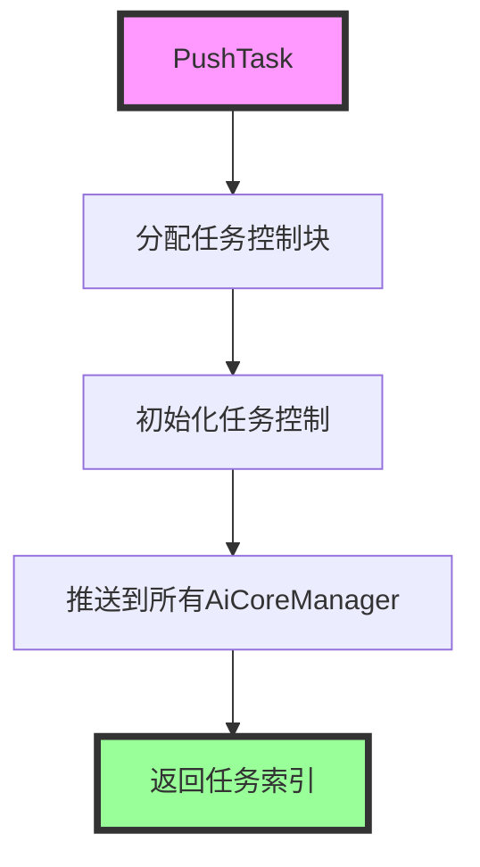

**代码细节：**

```cpp
int PushTask(int type, uint64_t taskId, void *devTask, void (*finish)(void *) = nullptr) {
    // 分配新的任务控制块
    auto idx = allocNewTaskCtrl();
    
    // 初始化任务控制
    InitTaskCtrl(idx, type, taskId, devTask, finish);
    
    // 推送到所有AI Core管理器
    for (auto &m : aicoreManager_) {
        m->PushTask(&taskctrl_[idx]);
    }
    
    return idx;
}
```

**关键概念：**

- **`TaskCtrl`**：任务控制块，包含任务类型、任务ID、设备任务指针、完成回调等
- **`refcnt`**：引用计数，等于 `aicoreManager_.size()`，表示有多少个 AI Core 管理器在使用该任务
- **`isAicpuIdle`**：AICPU 空闲状态数组，用于跟踪 AICPU 的空闲状态

**`Run()`** - 运行任务

**函数签名：** [`int Run(int threadIdx, DeviceArgs *args)`](../../../framework/src/machine/device/device_machine.h#L117)

**功能：** 在指定线程上运行设备任务。

**执行流程：**

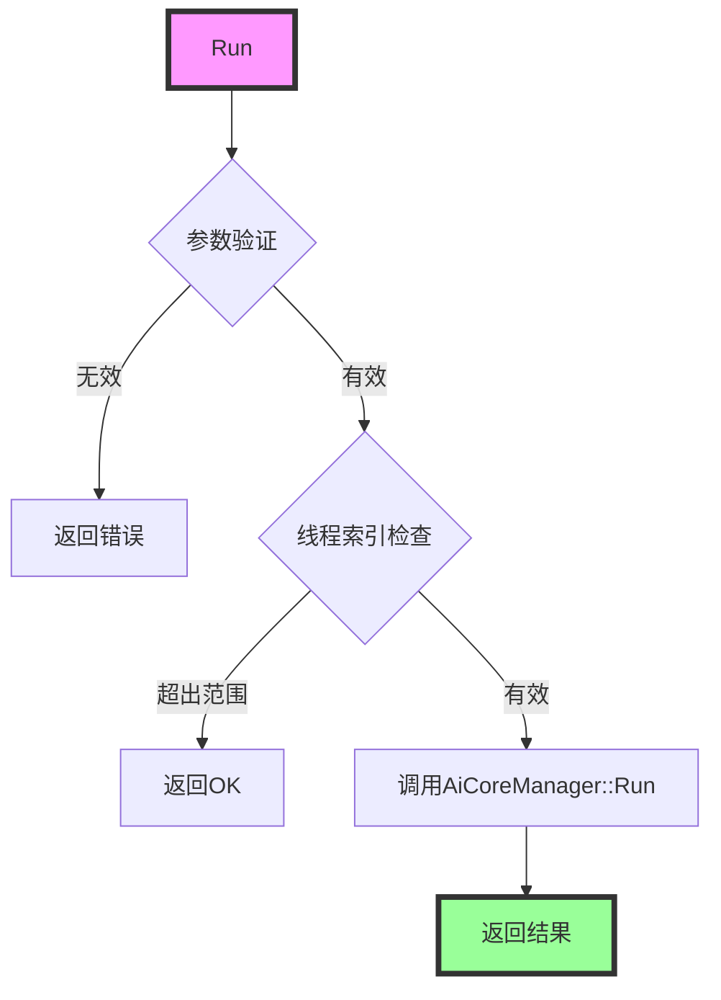

**代码细节：**

```cpp
int Run(int threadIdx, DeviceArgs *args) {
    // 参数验证
    if (args->nrAic == 0) {
        return DEVICE_MACHINE_ERROR;
    }
    
    // 线程索引检查
    if (threadIdx >= START_AICPU_NUM) {
        return DEVICE_MACHINE_OK;  // 忽略超出范围的线程
    }
    
    // 调用AI Core管理器运行
    ret = aicoreManager_[threadIdx]->Run(threadIdx, args, initTaskCtrl);
    
    return ret;
}
```

---

## 执行流程

### 完整执行流程

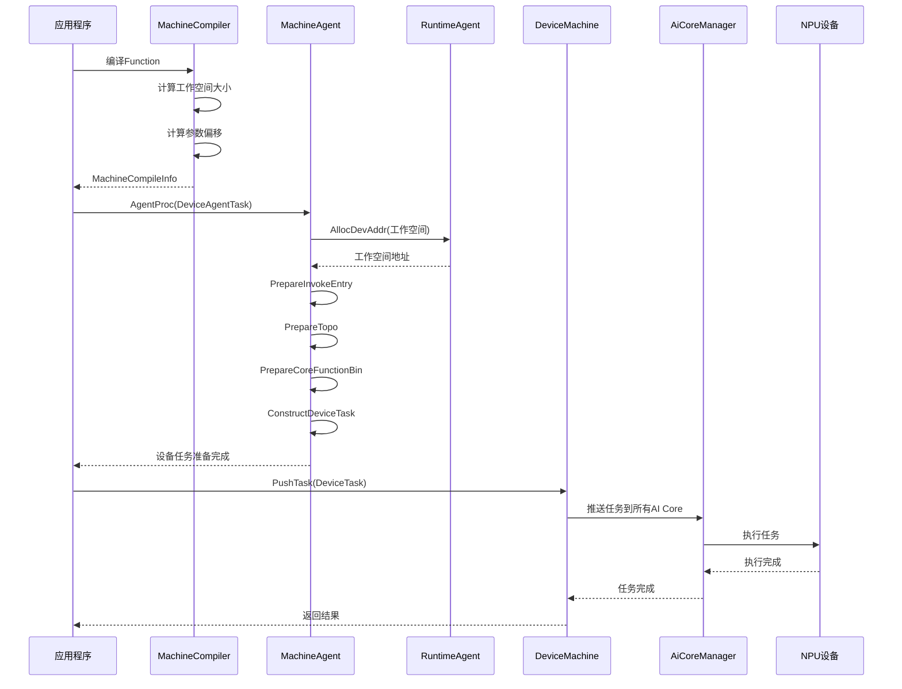

### 任务准备流程

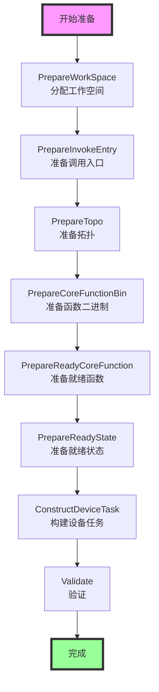

---

## 关键概念详解

### DeviceAgentTask

**定义：** 设备代理任务，封装了设备执行所需的所有信息。

**文件位置：** [`host/device_agent_task.h`](../../../framework/src/machine/host/device_agent_task.h#L45)

**关键成员：**

```cpp
class DeviceAgentTask {
    std::shared_ptr<MachineTask> compileTask;  // 编译任务（原始任务）
    MachineCompileInfo compileInfo;             // 编译信息
    MachineDeviceAgentInfo deviceInfo;         // 设备信息
    std::vector<OriArgInfo> opOriginArgs_;      // 操作原始参数信息
    void* aicpuStream_;                        // AICPU流
    bool isAsync_;                            // 是否异步执行
    std::optional<CacheValue> cacheValue_;     // 缓存值
    // ...
};
```

**关键概念：**

- **`compileTask`**：编译任务，指向原始的 [`MachineTask`](../../../framework/src/interface/machine/host/machine_task.h) 对象
- **`compileInfo`**：编译信息，包含工作空间大小、参数偏移等（[`MachineCompileInfo`](../../../framework/src/machine/host/machine_compiler.h#L27)）
- **`deviceInfo`**：设备信息，包含工作空间地址、设备任务地址等（[`MachineDeviceAgentInfo`](../../../framework/src/machine/host/device_agent_task.h#L19)）
- **`opOriginArgs_`**：操作原始参数信息列表，用于参数地址映射
- **`aicpuStream_`**：AICPU 执行流，用于异步执行
- **`isAsync_`**：是否异步执行标志

**MachineDeviceAgentInfo 结构：**

```cpp
struct MachineDeviceAgentInfo {
    uint8_t* workspaceGmAddr{nullptr};              // 工作空间全局内存地址
    uint8_t* invokeEntryOffsetsGmAddr{nullptr};     // 调用入口偏移地址
    uint8_t* topoGmAddr{nullptr};                   // 拓扑地址
    uint8_t* functionBinGmAddr{nullptr};            // 函数二进制地址
    uint8_t* readyStateGmAddr{nullptr};             // 就绪状态地址
    uint8_t* deviceTaskGmAddr{nullptr};             // 设备任务地址
    uint8_t* readyAicQueGmAddr{nullptr};            // 就绪AIC队列地址
    uint8_t* readyAivQueGmAddr{nullptr};            // 就绪AIV队列地址
    uint8_t* readyAicpuQueGmAddr{nullptr};           // 就绪AICPU队列地址
    std::vector<uint64_t> coreFunctionInvokeEntryAddr;  // 核心函数调用入口地址列表
    std::vector<uint64_t> coreFunctionTopoAddr;         // 核心函数拓扑地址列表
    std::vector<uint64_t> coreFuncBinAddr;              // 核心函数二进制地址列表
    std::map<int, uint8_t *> stubOutRawTensorAddr;      // Stub输出RawTensor地址映射
    // ...
};
```

**关键方法：**

- **`GetTaskId()`**：获取任务ID
- **`GetFunction()`**：获取函数指针
- **`GetWorkSpaceSize()`**：获取工作空间大小
- **`GetDeviceTaskGmAddr()`**：获取设备任务全局内存地址
- **`SetDeviceWorkSpaceAddr()`**：设置设备工作空间地址
- **`SetAicpuStream()`**：设置AICPU流
- **`SetOpOriginArgsInfo()`**：设置操作原始参数信息
- **`GetOpOriginArgsRawTensorAddr()`**：获取操作原始参数的RawTensor地址

### InvokeParaOffset

**定义：** 调用参数偏移结构，描述函数调用参数在工作空间中的位置。

**关键字段：**

- **`rawMagic`**：RawTensor 的 magic ID（全局唯一标识符）
- **`offset`**：在工作空间中的偏移（字节），这是参数的实际地址偏移
- **`rawTensorOffset`**：在 RawTensor 中的偏移，表示 LogicalTensor 在 RawTensor 中的位置
- **`rawSymbol`**：RawTensor 的符号名称，用于调试和日志
- **`rawTensorAddr`**：RawTensor 的地址指针（可能为 `nullptr`）
  - 如果为 `nullptr`，表示使用工作空间地址
  - 如果不为 `nullptr`，表示使用操作层传入的地址
- **`isTensorParam`**：是否为张量参数标志
- **`opOriginArgsSeq`**：操作原始参数序列号，用于从 `opOriginArgs_` 中获取地址
- **`paramType`**：参数类型（0=输出到GM，1=其他）
- **`tensorShape`**：张量形状（LogicalTensor的形状）
- **`rawTensorShape`**：原始张量形状（RawTensor的形状）
- **`funcitonMagic`**：函数 magic ID
- **`opMagic`**：操作 magic ID

### DeviceTask

**定义：** 设备任务结构，包含设备端执行所需的所有信息。

**关键字段：**

- **`coreFunctionCnt`**：核心函数数量
- **`coreFuncData`**：核心函数数据
  - **`stackWorkSpaceAddr`**：栈工作空间地址
  - **`stackWorkSpaceSize`**：栈工作空间大小
  - **`coreFunctionWsAddr`**：核心函数工作空间地址列表
- **`coreFunctionReadyStateAddr`**：核心函数就绪状态地址
- **`readyAicCoreFunctionQue`**：就绪的 AIC 核心函数队列地址
- **`readyAivCoreFunctionQue`**：就绪的 AIV 核心函数队列地址
- **`readyAicpuFunctionQue`**：就绪的 AICPU 函数队列地址
- **`l2Info`**：L2 缓存预取信息
  - **`prefetchNum`**：预取数量
  - **`prefetchAddrs`**：预取地址数组
  - **`prefetchSizes`**：预取大小数组

**关键概念：**

- **工作空间布局**：
  ```
  workspaceGmAddr
  ├── [0, invokeParaWorkSpaceSize)        : 参数工作空间
  └── [invokeParaWorkSpaceSize, ...)      : 栈工作空间（每个AI Core独立）
  ```
- **就绪队列**：用于 OOO 调度，存储可以立即执行的函数ID
- **就绪状态**：跟踪每个函数的依赖关系，判断是否可以执行

### AiCoreManager

**定义：** AI Core 管理器，负责管理单个 AI Core 的任务执行。

**文件位置：** [`device/aicore_manager.h`](../../../framework/src/machine/device/aicore_manager.h#L134)

**关键功能：**

- **任务调度**：将任务分发到 AI Core 执行
- **状态管理**：管理 AI Core 的执行状态
- **性能分析**：收集 AI Core 的性能数据

**关键方法：**

**`Run()`** - 运行任务

**函数签名：** [`int Run(int threadIdx, DeviceArgs *deviceArgs, DeviceTaskCtrl *taskCtrl = nullptr)`](../../../framework/src/machine/device/aicore_manager.h#L193)

**功能：** 在指定线程上运行设备任务，调度函数到 AI Core 执行。

**执行流程：**

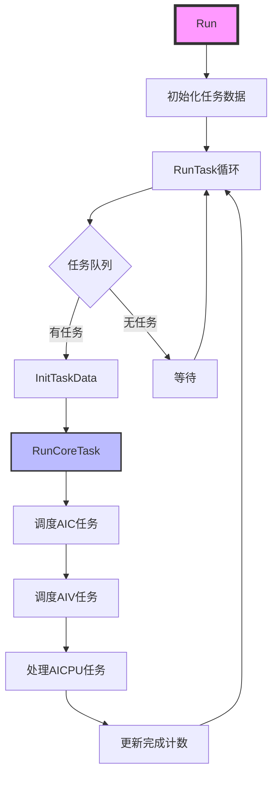

**关键概念：**

- **`taskQueue_`**：任务队列，使用 SPSC（Single Producer Single Consumer）队列
- **`DispatchAiCoreTask()`**：分发 AI Core 任务，从就绪队列中取出函数并发送到 AI Core
- **`RunCoreTask()`**：运行核心任务，调度 AIC、AIV 和 AICPU 任务
- **`finishedFunctionCnt`**：完成的函数计数，使用原子操作保证线程安全

**任务控制块（DeviceTaskCtrl）详解：**

```cpp
struct DeviceTaskCtrl {
    int taskType;                              // 任务类型
    uint64_t taskId;                           // 任务ID
    void *devTask;                             // 设备任务指针
    uint64_t finishedAicFunctionCnt;          // 完成的AIC函数数量
    uint64_t finishedAivFunctionCnt;          // 完成的AIV函数数量
    uint64_t finishedAicpuFunctionCnt;        // 完成的AICPU函数数量
    std::atomic<uint64_t> finishedFunctionCnt; // 完成的函数总数（原子操作）
    std::atomic<int> refcnt;                   // 引用计数（原子操作）
    void (*finishFunc)(void *devTask);        // 完成回调函数
    int retCode;                               // 返回码
    std::array<std::array<std::atomic<bool>, MAX_SCHEDULE_AICPU_NUM>, AICORE_TYPE_NUM> isAicpuIdle;  // AICPU空闲状态
};
```

**关键概念：**

- **`refcnt`**：引用计数，初始值为 `aicoreManager_.size()`，每个 AI Core 管理器完成时递减
- **`IsFree()`**：判断任务是否空闲（`refcnt == -1`）
- **`PutTask()`**：完成任务，递减引用计数，当计数为1时调用完成回调
- **`isAicpuIdle`**：AICPU 空闲状态数组，用于跟踪 AICPU 的空闲状态

---

## 内存管理

### 内存分配策略

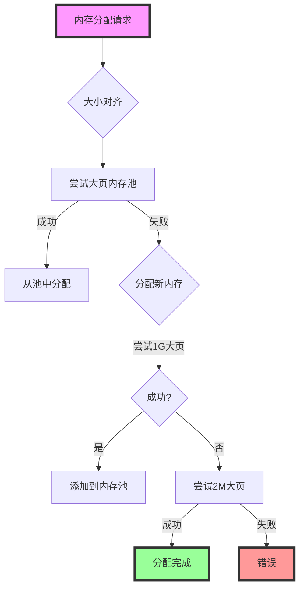

### 内存对齐

**对齐规则：**

- **设备内存**：512 字节对齐（`DEVICE_ALLOC_ALIGN = 512`）
- **主机内存**：512 字节对齐（用于设备分配的主机内存）

**对齐函数：**

```cpp
inline size_t MemSizeAlign(const size_t bytes, const uint32_t aligns = 512U) {
    const size_t alignSize = (aligns == 0U) ? sizeof(uintptr_t) : aligns;
    return (((bytes + alignSize) - 1U) / alignSize) * alignSize;
}
```

### 大页内存管理

**大页类型：**

- **1G 大页**：`RT_MEMORY_HBM | RT_MEMORY_POLICY_HUGE1G_PAGE_ONLY`
- **2M 大页**：`RT_MEMORY_HBM | RT_MEMORY_POLICY_HUGE_PAGE_FIRST`

**内存池管理：**

```cpp
struct HugePageDesc {
    uint8_t *baseAddr;    // 基地址
    size_t allSize;       // 总大小
    size_t current;       // 当前使用位置
};
```

**内存复用：**

通过 `hugePageVec` 管理大页内存池，实现内存复用，减少内存分配次数。

---

## 任务调度

### 任务调度流程


### 任务控制块（TaskCtrl）

**关键字段：**

- **`taskType`**：任务类型（STATIC、DYNAMIC 等）
- **`taskId`**：任务ID
- **`devTask`**：设备任务指针
- **`refcnt`**：引用计数
- **`finishedFunctionCnt`**：完成的函数数量
- **`isAicpuIdle`**：AICPU 空闲状态

### MPMD 调度

**MPMD（Multiple Program Multiple Data）**：多个程序多个数据，支持并行执行。

**调度特点：**

- 多个 AI Core 可以并行执行不同的函数
- 通过依赖关系管理执行顺序
- 支持乱序调度（OOO）优化

---

## 最佳实践

### 1. 工作空间管理

**推荐做法：**

- 合理设置工作空间大小，避免过大或过小
- 使用工作空间栈进行 OOO 调度优化
- 注意工作空间的内存对齐

### 2. 内存分配

**推荐做法：**

- 优先使用大页内存，提高性能
- 合理管理内存池，实现内存复用
- 注意内存对齐，避免性能损失

### 3. 任务调度

**推荐做法：**

- 合理设置 AI Core 数量
- 使用 MPMD 调度实现并行执行
- 注意任务依赖关系，避免死锁

---

## 常见问题

### 1. 工作空间分配失败

**问题：** 工作空间内存分配失败。

**原因：** 设备内存不足或内存碎片化。

**解决方案：**
- 检查设备内存使用情况
- 减少工作空间大小
- 使用内存池管理

### 2. 参数偏移计算错误

**问题：** 函数调用时参数地址错误。

**原因：** 参数偏移计算错误或工作空间布局不一致。

**解决方案：**
- 检查 `CalcFunctionInvokeWorkespace` 的计算逻辑
- 确保工作空间布局一致
- 验证参数偏移映射

### 3. 任务执行失败

**问题：** 设备端任务执行失败。

**原因：** 设备任务结构错误或设备状态异常。

**解决方案：**
- 检查设备任务结构
- 验证设备状态
- 查看设备日志

---

## 相关文档

- [Interface 模块文档](02-interface.md)
- [Function 类详细文档](03-function.md)
- [PyPTO 编程指南](../../../docs/tutorials/README.md)

---

## 总结

`machine` 模块是 PyPTO 编译框架的执行层核心，提供了：

1. **完整的执行流程**：从编译信息准备到设备端执行的完整流程
2. **高效的内存管理**：大页内存、内存池、内存对齐等优化
3. **灵活的任务调度**：MPMD 调度、OOO 调度等高级特性
4. **强大的运行时支持**：内存管理、流管理、错误处理等
5. **设备端执行**：AI Core 管理、任务分发、状态管理等

通过深入理解 `machine` 模块的设计和实现，开发者可以更好地优化执行性能，解决执行过程中的问题。

