# Passes 模块技术文档

> **适用对象：** 想要深入理解编译优化的开发者、框架贡献者  
> **学习时间：** 60-90分钟  
> **前置知识：** 已阅读[核心概念](10-concepts.md)和[Function模块](03-function.md)  
> **学习目标：** 理解Pass框架、掌握各类Pass的优化策略、学会开发自定义Pass

## 概述

`passes` 模块是 PyPTO 编译框架的优化层，负责对多层级 IR 进行优化和转换。该模块实现了从 Tensor Graph 到 Execute Graph 的完整优化流程，包括图优化、内存优化、调度优化等多个方面，是 PyPTO 编译框架的核心优化引擎。

**模块职责：**
- 🎯 **图优化**：Tensor Graph层级的图级优化（融合、消除等）
- 🔧 **Lowering**：多层级IR转换（Tensor → Tile → Block → Execute）
- 💾 **内存优化**：内存重用、内存类型分配
- ⚡ **调度优化**：乱序调度、同步优化

**模块位置：**
- 目录路径：[`framework/src/passes`](../../../framework/src/passes)
- 构建目标：`tile_fwk_passes`（共享库）
- 相关文档：[Function 类详细文档](03-function.md)、[Interface 模块文档](02-interface.md)、[Framework 模块文档](01-framework.md)、[核心概念详解](10-concepts.md)

### 实现细节速查（建议先看这段再往下读）

**Pass 框架核心入口（C++）：**
- `Pass` 抽象基类：`framework/src/passes/pass_interface/pass.h`
- `PassManager`：`framework/src/passes/pass_mgr/pass_manager.h`
- Pass 注册/工厂：通常在 `framework/src/passes/**` 子目录中以注册表/工厂方式组织（具体以源码为准）

**Python 侧如何影响 Pass 行为：**
- `pypto.set_pass_options(...)`：`python/pypto/config.py::set_pass_options`
  - 底层通过 `pypto_impl.SetOption("pass.xxx", value)` 写入后端 options（见 `python/pypto/config.py::_CachedOptions.set_options`）
  - options 的合法性/范围由 `framework/src/interface/configs/tile_fwk_config_schema.json` 约束（不在 schema 的 key 会被忽略）

**调试/验证 Pass 的最短路径：**
- 你想确认“Pass 顺序/是否执行”：优先看 `output/` 产物中的图 dump（以及 `pypto.Function.Dump*` 系列）
  - `python/pypto/functions.py`：`Function.Dump()` / `DumpSSA()` / `DumpJsonFile()`
- 你想确认“Pass 前后 IR 差异”：在同一个算子/输入形状下，对比 Pass 前后 dump（建议固定随机种子）

---

## 目录

- [架构定位](#架构定位)
- [模块组织](#模块组织)
- [Pass 框架](#pass-框架)
- [Pass 分类详解](#pass-分类详解)
- [Tensor Graph Pass 详细说明](#tensor-graph-pass-详细说明)
- [Tile Graph Pass 详细说明](#tile-graph-pass-详细说明)
- [Block Graph Pass 详细说明](#block-graph-pass-详细说明)
- [关键 Pass 详解](#关键-pass-详解)
- [Pass 开发模式](#pass-开发模式)
- [Pass 执行完整流程](#pass-执行完整流程)
- [最佳实践](#最佳实践)
- [常见问题](#常见问题)
- [总结](#总结)

---

## 架构定位

### 在编译流程中的位置

`passes` 模块在 PyPTO 编译框架中处于优化层，负责对多层级 IR 进行优化：

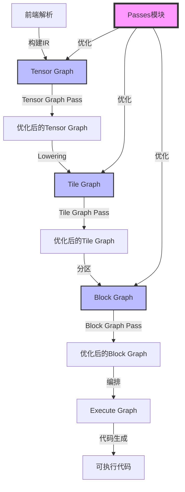

**Pass 模块职责：**

| 编译阶段 | Pass 类型 | 主要职责 | 关键 Pass |
|---------|---------|---------|---------|
| **Tensor Graph** | Tensor Graph Pass | 图级优化、内存冲突推断 | `InferMemoryConflict`, `RemoveRedundantReshape`, `AutoCast` |
| **Tile Graph** | Tile Graph Pass | Tile 级优化、图分区 | `GraphPartition`, `SubgraphToFunction`, `GenerateMoveOp` |
| **Block Graph** | Block Graph Pass | 内存重用、调度优化 | `GlobalMemoryReuse`, `OoOSchedule`, `InsertSync` |

### 类图

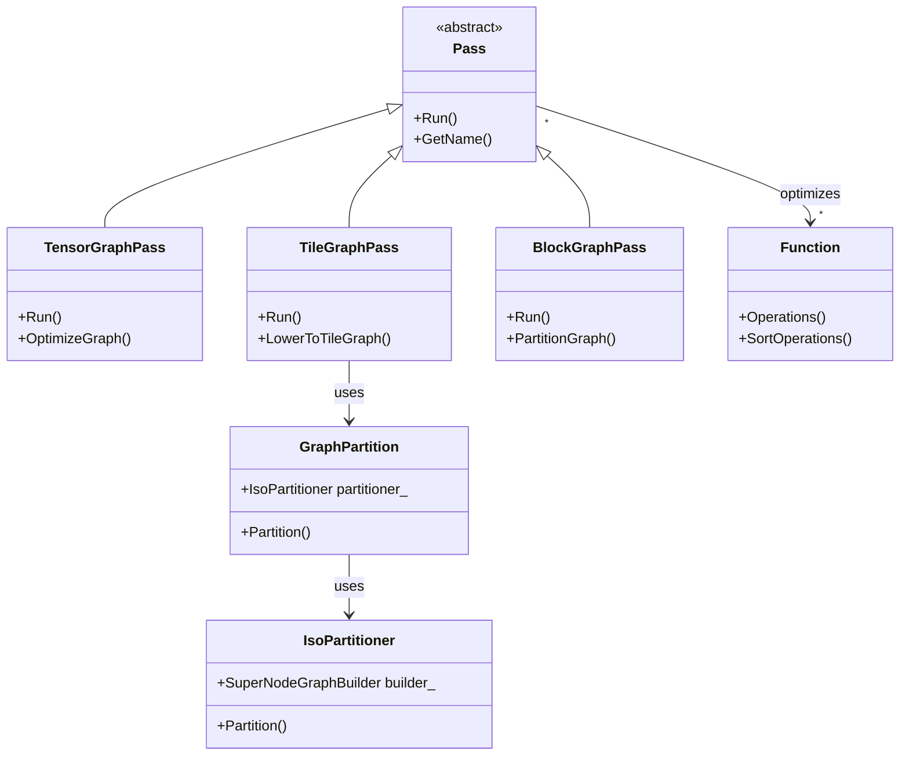

### Pass 执行流程

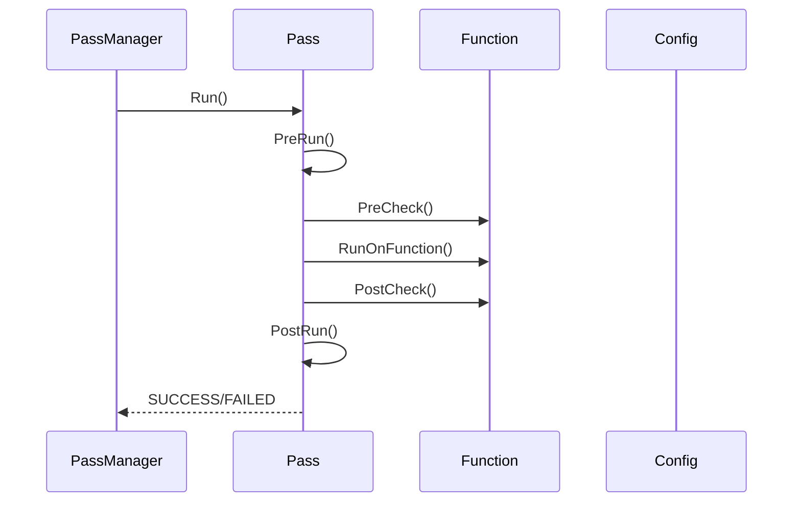

### Pass 执行顺序图（PVC2_OOO 策略）

根据 [`pass_manager.cpp`](../../../framework/src/passes/pass_mgr/pass_manager.cpp#L100) 中定义的 `PVC2_OOO` 策略，Pass 的执行顺序如下：

```mermaid
graph TB
    subgraph "Tensor Graph Pass 阶段"
        P1[1. RemoveRedundantReshape] --> P2[2. AutoCast]
        P2 --> P3[3. InferMemoryConflict]
        P3 --> P4[4. RemoveUndrivenView]
        P4 --> P5[5. ExpandFunction]
        P5 --> P6[6. MergeViewAssemble]
        P6 --> P7[7. SplitReshape]
        P7 --> P8[8. SplitRawTensor]
        P8 --> P9[9. SplitLargeFanoutTensor]
        P9 --> P10[10. DuplicateOp]
        P10 --> P11[11. AssignMemoryType]
        P11 --> P12[12. InferDiscontinuousInput]
        P12 --> P13[13. RemoveRedundantOp]
        P13 --> P14[14. SplitK]
    end
    
    subgraph "Tile Graph Pass 阶段"
        P14 --> P15[15. GraphPartition]
        P15 --> P16[16. ReduceCopyMerge]
        P16 --> P17[17. NBufferMerge]
        P17 --> P18[18. L1CopyInReuseMerge]
        P18 --> P19[19. IntraSubgraphAdapter]
        P19 --> P20[20. GenerateMoveOp]
        P20 --> P21[21. CommonOperationEliminate]
        P21 --> P22[22. AxisCombine]
        P22 --> P23[23. PadLocalBuffer]
        P23 --> P24[24. RemoveUnalignedReshape]
        P24 --> P25[25. ReplaceTensor]
        P25 --> P26[26. PreGraphProcess]
        P26 --> P27[27. InferDynShape]
        P27 --> P28[28. SubgraphToFunction]
    end
    
    subgraph "Block Graph Pass 阶段"
        P28 --> P29[29. InferParamIndex]
        P29 --> P30[30. SrcDstBufferMerge]
        P30 --> P31[31. AddAlloc]
        P31 --> P32[32. OoOSchedule]
        P32 --> P33[33. GlobalMemoryReuse]
        P33 --> P34[34. RemoveAlloc]
        P34 --> P35[35. CopyOutResolve]
        P35 --> P36[36. InsertSync]
        P36 --> P37[37. MixSubgraphSplit]
        P37 --> P38[38. CodegenPreproc]
    end
    
    style P1 fill:#e1f5ff,stroke:#333,stroke-width:2px
    style P14 fill:#fff4e1,stroke:#333,stroke-width:2px
    style P15 fill:#fff4e1,stroke:#333,stroke-width:2px
    style P28 fill:#ffe1f5,stroke:#333,stroke-width:2px
    style P29 fill:#ffe1f5,stroke:#333,stroke-width:2px
    style P38 fill:#e1ffe1,stroke:#333,stroke-width:2px
```

**Pass 执行顺序说明：**

- **Tensor Graph Pass（1-14）**：在 Tensor Graph 阶段执行，主要进行图级优化
  - **阶段目标**：优化 Tensor Graph 结构，为 Lowering 到 Tile Graph 做准备
  - **关键 Pass**：
    - `RemoveRedundantReshape`（1）：移除冗余 Reshape，简化图结构
    - `AutoCast`（2）：自动类型转换，确保类型兼容
    - `InferMemoryConflict`（3）：推断内存冲突，插入必要的 Copy
    - `ExpandFunction`（5）：展开函数调用，内联函数
    - `SplitK`（14）：K 维度切分，优化矩阵乘法
  
- **Tile Graph Pass（15-28）**：在 Tile Graph 阶段执行，主要进行 Tile 级优化和图分区
  - **阶段目标**：优化 Tile Graph，进行图分区和子图转换
  - **关键 Pass**：
    - `GraphPartition`（15）：图分区，将图分为多个子图
    - `SubgraphToFunction`（28）：子图转函数，支持函数调用
    - `GenerateMoveOp`（20）：生成移动操作，优化数据传输
    - `CommonOperationEliminate`（21）：公共操作消除，减少重复计算
  
- **Block Graph Pass（29-38）**：在 Block Graph 阶段执行，主要进行内存重用和调度优化
  - **阶段目标**：优化 Block Graph，进行内存重用和调度优化
  - **关键 Pass**：
    - `OoOSchedule`（32）：乱序调度，提高并行度
    - `GlobalMemoryReuse`（33）：全局内存重用，减少内存占用
    - `InsertSync`（36）：插入同步点，确保数据依赖正确性
    - `CodegenPreproc`（38）：代码生成预处理，为代码生成做准备

**Pass 执行依赖关系：**

```mermaid
graph TB
    subgraph "Tensor Graph Pass 依赖"
        P1[RemoveRedundantReshape] --> P2[AutoCast]
        P2 --> P3[InferMemoryConflict]
        P3 --> P4[RemoveUndrivenView]
        P4 --> P5[ExpandFunction]
        P5 --> P6[MergeViewAssemble]
        P6 --> P7[SplitReshape]
        P7 --> P8[SplitRawTensor]
        P8 --> P9[SplitLargeFanoutTensor]
        P9 --> P10[DuplicateOp]
        P10 --> P11[AssignMemoryType]
        P11 --> P12[InferDiscontinuousInput]
        P12 --> P13[RemoveRedundantOp]
        P13 --> P14[SplitK]
    end
    
    subgraph "Tile Graph Pass 依赖"
        P14 --> P15[GraphPartition]
        P15 --> P16[ReduceCopyMerge]
        P16 --> P17[NBufferMerge]
        P17 --> P18[L1CopyInReuseMerge]
        P18 --> P19[IntraSubgraphAdapter]
        P19 --> P20[GenerateMoveOp]
        P20 --> P21[CommonOperationEliminate]
        P21 --> P22[AxisCombine]
        P22 --> P23[PadLocalBuffer]
        P23 --> P24[RemoveUnalignedReshape]
        P24 --> P25[ReplaceTensor]
        P25 --> P26[PreGraphProcess]
        P26 --> P27[InferDynShape]
        P27 --> P28[SubgraphToFunction]
    end
    
    subgraph "Block Graph Pass 依赖"
        P28 --> P29[InferParamIndex]
        P29 --> P30[SrcDstBufferMerge]
        P30 --> P31[AddAlloc]
        P31 --> P32[OoOSchedule]
        P32 --> P33[GlobalMemoryReuse]
        P33 --> P34[RemoveAlloc]
        P34 --> P35[CopyOutResolve]
        P35 --> P36[InsertSync]
        P36 --> P37[MixSubgraphSplit]
        P37 --> P38[CodegenPreproc]
    end
    
    style P1 fill:#e1f5ff,stroke:#333,stroke-width:2px
    style P14 fill:#fff4e1,stroke:#333,stroke-width:2px
    style P15 fill:#fff4e1,stroke:#333,stroke-width:2px
    style P28 fill:#ffe1f5,stroke:#333,stroke-width:2px
    style P29 fill:#ffe1f5,stroke:#333,stroke-width:2px
    style P38 fill:#e1ffe1,stroke:#333,stroke-width:2px
```

**Pass 执行流程详解：**

1. **PassManager::RunPass()** 被调用，传入 `strategy` 参数（如 `"PVC2_OOO"`）
2. **获取策略 Pass 列表**：通过 `GetStrategyPasses()` 获取该策略下的 Pass 列表
3. **遍历执行 Pass**：
   - 从 `startIdx` 开始（支持断点续传）
   - 对每个 Pass：
     - 创建 Pass 实例（通过 `PassRegistry::CreatePass()`）
     - 设置日志文件路径
     - 获取 Pass 配置（通过 `ConfigManager::GetPassConfigs()`）
     - 执行 Pass（调用 `Pass::Run()`）
     - 记录执行时间（如果启用）
     - 验证 Pass 结果（如果启用）
4. **返回执行结果**：所有 Pass 执行成功返回 `SUCCESS`，否则返回 `FAILED`

### Pass 调用关系图

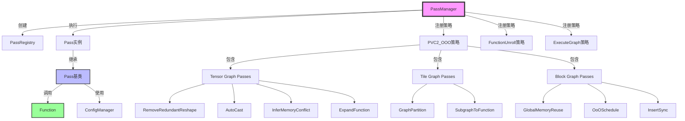

### Pass 分类图

根据 Pass 的功能和优化目标，可以将 Pass 分为以下几类：

```mermaid
graph TB
    A[Pass分类] --> B[图优化类]
    A --> C[内存优化类]
    A --> D[调度优化类]
    A --> E[类型转换类]
    A --> F[图转换类]
    A --> G[代码生成类]
    
    B --> B1[RemoveRedundantReshape<br/>移除冗余Reshape]
    B --> B2[RemoveRedundantOp<br/>移除冗余操作]
    B --> B3[CommonOperationEliminate<br/>公共操作消除]
    B --> B4[RemoveUndrivenView<br/>移除无驱动View]
    
    C --> C1[GlobalMemoryReuse<br/>全局内存重用]
    C --> C2[SrcDstBufferMerge<br/>源目标缓冲区合并]
    C --> C3[NBufferMerge<br/>N缓冲区合并]
    C --> C4[L1CopyInReuseMerge<br/>L1拷贝输入重用合并]
    
    D --> D1[OoOSchedule<br/>乱序调度]
    D --> D2[InsertSync<br/>插入同步点]
    D --> D3[InferParamIndex<br/>推断参数索引]
    
    E --> E1[AutoCast<br/>自动类型转换]
    E --> E2[InferMemoryConflict<br/>推断内存冲突]
    
    F --> F1[ExpandFunction<br/>展开函数]
    F --> F2[SubgraphToFunction<br/>子图转函数]
    F --> F3[GraphPartition<br/>图分区]
    
    G --> G1[CodegenPreproc<br/>代码生成预处理]
    G --> G2[InferDynShape<br/>推断动态形状]
    G --> G3[DynAttrToStatic<br/>动态属性转静态]
    
    style A fill:#f9f,stroke:#333,stroke-width:4px
    style B fill:#e1f5ff,stroke:#333,stroke-width:2px
    style C fill:#fff4e1,stroke:#333,stroke-width:2px
    style D fill:#ffe1f5,stroke:#333,stroke-width:2px
    style E fill:#e1ffe1,stroke:#333,stroke-width:2px
    style F fill:#f5e1ff,stroke:#333,stroke-width:2px
    style G fill:#ffe1e1,stroke:#333,stroke-width:2px
```

---

## 模块组织

### 模块结构

根据 [`CMakeLists.txt`](../../../framework/src/passes/CMakeLists.txt)，`passes` 模块包含以下子模块：

```mermaid
graph TB
    A[Passes模块] --> B[pass_interface]
    A --> C[pass_mgr]
    A --> D[tensor_graph_pass]
    A --> E[tile_graph_pass]
    A --> F[block_graph_pass]
    A --> G[pass_utils]
    A --> H[pass_check]
    A --> I[pass_log]
    A --> J[statistics]
    
    B --> B1[Pass基类]
    B --> B2[PassType]
    B --> B3[PassName]
    
    C --> C1[PassManager]
    C --> C2[PassRegistry]
    
    D --> D1[InferMemoryConflict]
    D --> D2[RemoveRedundantReshape]
    D --> D3[AutoCast]
    D --> D4[ExpandFunction]
    D --> D5[LoopUnroll]
    
    E --> E1[GraphPartition]
    E --> E2[SubgraphToFunction]
    E --> E3[GenerateMoveOp]
    E --> E4[GraphOptimization]
    
    F --> F1[GlobalMemoryReuse]
    F --> F2[OoOSchedule]
    F --> F3[InsertSync]
    F --> F4[CodegenPreproc]
    
    style A fill:#f9f,stroke:#333,stroke-width:4px
    style B fill:#bbf,stroke:#333,stroke-width:2px
    style C fill:#bbf,stroke:#333,stroke-width:2px
    style D fill:#bbf,stroke:#333,stroke-width:2px
    style E fill:#bbf,stroke:#333,stroke-width:2px
    style F fill:#bbf,stroke:#333,stroke-width:2px
```

### 模块分类

#### 1. pass_interface 模块（Pass 接口）

**功能概述：** 定义 Pass 基类和接口。

**核心组件：**

- **`Pass`**：Pass 基类
  - **文件位置：** [`pass_interface/pass.h`](../../../framework/src/passes/pass_interface/pass.h)
  - **功能**：定义 Pass 的通用接口和生命周期管理

- **`PassType`**：Pass 类型枚举
  - **文件位置：** [`pass_interface/pass_type.h`](../../../framework/src/passes/pass_interface/pass_type.h)
  - **类型**：`TYPE_TENSOR_GRAPH`, `TYPE_TILE_GRAPH`, `TYPE_BLOCK_GRAPH`

- **`PassName`**：Pass 名称枚举
  - **文件位置**：[`pass_interface/pass_type.h`](../../../framework/src/passes/pass_interface/pass_type.h)
  - **功能**：定义所有 Pass 的名称
  - **枚举值**：
    ```cpp
    enum class PassName {
        LOOP_UNROLL,
        REMOVE_REDUNDANT_RESHAPE,
        INFER_MEMORY_CONFLICT,
        EXPAND_FUNCTION,
        DUPLICATE_OP,
        MERGE_VIEW_ASSEMBLE,
        SPLIT_RESHAPE,
        SPLIT_RAW_TENSOR,
        SPLIT_LARGE_FANOUT_TENSOR,
        ASSIGN_MEMORY_TYPE,
        INFER_DISCONTINUOUS_INPUT,
        REMOVE_REDUNDANT_OP,
        SPLIT_K,
        GRAPH_PARTITION,
        N_BUFFER_MERGE,
        INTRA_SUBGRAPH_ADAPTER,
        GENERATE_MOVE_OP,
        COMMON_OPERATION_ELIMINATE,
        L1_COPY_IN_REUSE_MERGE,
        PAD_LOCAL_BUFFER,
        REMOVE_UNALIGNED_RESHAPE,
        INPLACE_PROCESS,
        PRE_GRAPH_PROCESS,
        INFER_DYN_SHAPE,
        SUBGRAPH_TO_FUNCTION,
        INFER_PARAM_INDEX,
        SRC_DST_BUFFER_MERGE,
        ADD_ALLOC,
        OOO_SCHEDULE,
        GLOBAL_MEMORY_REUSE,
        REMOVE_ALLOC,
        COPY_OUT_RESOLVE,
        INSERT_SYNC,
        CODEGEN_PREPROC,
        DYN_ATTR_TO_STATIC
    };
    ```
  - **PassNameStr()**：Pass 名称字符串转换函数
    - **功能**：将 `PassName` 枚举值转换为字符串
    - **实现位置**：[`pass_interface/pass_type.h`](../../../framework/src/passes/pass_interface/pass_type.h#L66)
    - **使用方式**：
      ```cpp
      const char *name = PassNameStr(PassName::INFER_MEMORY_CONFLICT);
      // name = "InferMemoryConflict"
      ```

#### 2. pass_mgr 模块（Pass 管理）

**功能概述：** 管理 Pass 的注册和执行。

**核心组件：**

- **`PassManager`**：Pass 管理器
  - **文件位置：** [`pass_mgr/pass_manager.h`](../../../framework/src/passes/pass_mgr/pass_manager.h)
  - **功能**：管理 Pass 的注册、策略和执行

- **`PassRegistry`**：Pass 注册表
  - **文件位置**：[`pass_mgr/pass_registry.h`](../../../framework/src/passes/pass_mgr/pass_registry.h)
  - **功能**：注册和查找 Pass
  - **类定义**：
    ```cpp
    class PassRegistry {
    public:
        using CreateFn = std::function<std::unique_ptr<Pass>()>;
        static PassRegistry &GetInstance();
        void RegisterPass(const std::string &passName, CreateFn createFn);
        std::unique_ptr<Pass> CreatePass(const std::string &passName) const;
        
    private:
        mutable std::mutex mtx_;
        std::map<std::string, CreateFn> passCreators_;
    };
    ```
  - **关键方法**：
    - **`RegisterPass()`**：注册 Pass
      - **功能**：将 Pass 的创建函数注册到注册表中
      - **参数**：`passName`（Pass 名称）、`createFn`（创建函数）
      - **实现位置**：[`pass_mgr/pass_registry.cpp`](../../../framework/src/passes/pass_mgr/pass_registry.cpp)
    
    - **`CreatePass()`**：创建 Pass 实例
      - **功能**：根据 Pass 名称创建 Pass 实例
      - **参数**：`passName`（Pass 名称）
      - **返回**：`std::unique_ptr<Pass>`（Pass 实例）
      - **实现位置**：[`pass_mgr/pass_registry.cpp`](../../../framework/src/passes/pass_mgr/pass_registry.cpp)
  
  - **Pass 注册宏**：`REG_PASS(DerivedPass)`
    - **功能**：自动注册 Pass 到注册表
    - **使用方式**：
      ```cpp
      REG_PASS(MyPass);
      ```
    - **实现原理**：
      1. 创建一个静态 `PassRegistrar` 对象
      2. 在对象构造时调用 `PassRegistry::RegisterPass()`
      3. 注册 Pass 的创建函数
      4. 进行类型检查，确保 Pass 继承自 `Pass` 基类
  
  - **关键概念**：
    - **`passCreators_`**：Pass 创建函数映射表
      - **类型**：`std::map<std::string, CreateFn>`
      - **键**：Pass 名称
      - **值**：Pass 创建函数
      - **用途**：存储所有注册的 Pass 创建函数
    
    - **`mtx_`**：互斥锁
      - **类型**：`std::mutex`
      - **用途**：保护 `passCreators_` 的并发访问

#### 3. tensor_graph_pass 模块（Tensor Graph Pass）

**功能概述：** 实现 Tensor Graph 阶段的优化 Pass。

**核心 Pass：**

- **`InferMemoryConflict`**：推断内存冲突
- **`RemoveRedundantReshape`**：移除冗余 Reshape
- **`AutoCast`**：自动类型转换
- **`ExpandFunction`**：展开函数调用
- **`LoopUnroll`**：循环展开

#### 4. tile_graph_pass 模块（Tile Graph Pass）

**功能概述：** 实现 Tile Graph 阶段的优化 Pass。

**核心 Pass：**

- **`GraphPartition`**：图分区
- **`SubgraphToFunction`**：子图转函数
- **`GenerateMoveOp`**：生成移动操作
- **`GraphOptimization`**：图优化

#### 5. block_graph_pass 模块（Block Graph Pass）

**功能概述：** 实现 Block Graph 阶段的优化 Pass。

**核心 Pass：**

- **`GlobalMemoryReuse`**：全局内存重用
- **`OoOSchedule`**：乱序调度
- **`InsertSync`**：插入同步点
- **`CodegenPreproc`**：代码生成预处理

---

## Pass 框架

### Pass 基类

**文件位置：** [`pass_interface/pass.h`](../../../framework/src/passes/pass_interface/pass.h)

**类定义：**

```cpp
class Pass {
public:
    explicit Pass(std::string name);
    virtual ~Pass() = default;
    Status Run(Function &function, const std::string &strategy,
               const std::string &identifier, size_t runtimeIdx = 0);
    virtual Status PreCheck(Function &function);
    virtual Status PostCheck(Function &function);
    
protected:
    virtual Status RunOnFunction(Function &function) = 0;
    virtual Status PreRun(Function &function);
    virtual Status PostRun(Function &function);
    virtual void DoHealthCheckBefore(Function &function, const std::string &folderPath);
    virtual void DoHealthCheckAfter(Function &function, const std::string &folderPath);
    
private:
    std::string name_;
    mutable std::string identifier_;
    mutable std::string strategy_;
    size_t passRuntimeIndex_;
    mutable std::string passFolder_{"."};
};
```

**Pass 生命周期：**

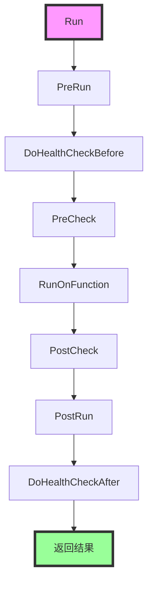

**关键方法：**

- **`Run()`**：执行 Pass 的主入口
  - **功能**：管理 Pass 的完整执行流程
  - **参数**：`function`（要优化的函数）、`strategy`（策略名称）、`identifier`（Pass 标识符）、`runtimeIdx`（运行时索引）
  - **实现位置**：[`pass_interface/pass.cpp`](../../../framework/src/passes/pass_interface/pass.cpp#L62)
  
- **`RunOnFunction()`**：Pass 的核心逻辑
  - **功能**：子类必须实现的纯虚函数，包含 Pass 的具体优化逻辑
  
- **`PreCheck()`** / **`PostCheck()`**：Pass 的前后检查
  - **功能**：验证 Function 在 Pass 执行前后的正确性
  
- **`PreRun()`** / **`PostRun()`**：Pass 的前后处理
  - **功能**：执行 Pass 前后的通用处理（如日志、调试信息等）
  - **实现位置**：[`pass_interface/pass.cpp`](../../../framework/src/passes/pass_interface/pass.cpp#L185)
  - **`PreRun()` 详细实现**：
    ```cpp
    Status Pass::PreRun(Function &function) {
        // 1. 打印 Pass 执行前的函数信息
        if (passDfxconfigs_.printGraph) {
            if (PrintFunction(function, passFolder_, true) != SUCCESS) {
                ALOG_WARN_F("Print function before pass failed.");
            }
        }
        
        // 2. 创建图文件夹
        if (CreateGraphFolder(function) != SUCCESS) {
            ALOG_WARN_F("Create graph directory failed.");
        }
        
        // 3. 导出特定阶段的图 JSON
        if (passDfxconfigs_.dumpGraph) {
            if (name_ == "ExpandFunction") {
                // 导出 Tensor Graph 结束时的图
                std::string fileName = graphFolder_ + "/End_TensorGraph";
                if (DumpGraphJson(function, fileName) != SUCCESS) {
                    ALOG_WARN_F("Dump End TensorGraph json failed.");
                }
            }
            if (name_ == "RemoveRedundantReshape") {
                // 导出 Tensor Graph 开始时的图
                std::string fileName = graphFolder_ + "/Begin_TensorGraph";
                if (DumpGraphJson(function, fileName) != SUCCESS) {
                    ALOG_WARN_F("Dump Begin TensorGraph json failed.");
                }
            }
        }
        
        // 4. 导出 Pass 执行前的函数 JSON
        if (passDfxconfigs_.dumpGraph) {
            if (DumpFunctionJson(function, passFolder_, true) != SUCCESS) {
                ALOG_WARN_F("Dump function json before pass failed.");
            }
        }
        
        // 5. 执行前检查
        if (passDfxconfigs_.preCheck) {
            if (PreCheck(function) != SUCCESS) {
                ALOG_ERROR_F("Precheck of pass [%s] failed.", identifier_.c_str());
                return FAILED;
            }
        }
        
        // 6. 健康检查
        if (passDfxconfigs_.healthCheck) {
            DoHealthCheckBefore(function, passFolder_);
        }
        
        return SUCCESS;
    }
    ```
    - **关键步骤**：
      1. **打印函数信息**：如果启用 `printGraph`，打印 Pass 执行前的函数信息
      2. **创建图文件夹**：如果启用 `dumpGraph`，创建图文件夹
      3. **导出图 JSON**：导出特定阶段的图 JSON（如 Tensor Graph 开始/结束）
      4. **导出函数 JSON**：导出 Pass 执行前的函数 JSON
      5. **执行前检查**：如果启用 `preCheck`，执行前检查
      6. **健康检查**：如果启用 `healthCheck`，执行健康检查
  
  - **`PostRun()` 详细实现**：
    ```cpp
    Status Pass::PostRun(Function &function) {
        // 1. 打印 Pass 执行后的函数信息
        if (passDfxconfigs_.printGraph) {
            if (PrintFunction(function, passFolder_, false) != SUCCESS) {
                ALOG_WARN_F("Print function after pass failed.");
            }
        }
        
        // 2. 导出特定阶段的图 JSON
        if (passDfxconfigs_.dumpGraph && name_ == "ExpandFunction") {
            // 导出 Tile Graph 开始时的图
            std::string fileName = graphFolder_ + "/Begin_TileGraph";
            if (DumpGraphJson(function, fileName) != SUCCESS) {
                ALOG_WARN_F("Dump Begin TileGraph json failed.");
            }
        }
        if (passDfxconfigs_.dumpGraph) {
            if (name_ == "SubgraphToFunction") {
                // 导出 Block Graph 开始时的图
                std::string fileName = graphFolder_ + "/Begin_BlockGraph";
                if (DumpGraphJson(function, fileName) != SUCCESS) {
                    ALOG_WARN_F("Dump Begin BlockGraph json failed.");
                }
            }
            if (name_ == "CodegenPreproc") {
                // 导出 Block Graph 结束时的图
                std::string fileName = graphFolder_ + "/End_BlockGraph";
                if (DumpGraphJson(function, fileName) != SUCCESS) {
                    ALOG_WARN_F("Dump End BlockGraph json failed.");
                }
            }
        }
        
        // 3. 导出 Pass 执行后的函数 JSON
        if (passDfxconfigs_.dumpGraph) {
            if (DumpFunctionJson(function, passFolder_, false) != SUCCESS) {
                ALOG_WARN_F("Dump function json after pass failed.");
            }
        }
        
        // 4. 执行后检查
        if (passDfxconfigs_.postCheck) {
            if (PostCheck(function) != SUCCESS) {
                ALOG_ERROR_F("Postcheck of pass [%s] failed.", identifier_.c_str());
                return FAILED;
            }
        }
        
        // 5. 健康检查
        if (passDfxconfigs_.healthCheck) {
            DoHealthCheckAfter(function, passFolder_);
        }
        
        return SUCCESS;
    }
    ```
    - **关键步骤**：
      1. **打印函数信息**：如果启用 `printGraph`，打印 Pass 执行后的函数信息
      2. **导出图 JSON**：导出特定阶段的图 JSON（如 Tile Graph 开始、Block Graph 开始/结束）
      3. **导出函数 JSON**：导出 Pass 执行后的函数 JSON
      4. **执行后检查**：如果启用 `postCheck`，执行后检查
      5. **健康检查**：如果启用 `healthCheck`，执行健康检查

**关键概念：**

- **`strategy`**：Pass 执行策略，定义了 Pass 的执行顺序和配置
  - **创建**：通过 `PassManager::RegisterStrategy()` 注册
  - **使用**：通过 `PassManager::RunPass()` 执行
  - **作用**：控制 Pass 的执行顺序和配置
  
- **`identifier`**：Pass 标识符，用于区分不同的 Pass 实例
  - **格式**：通常与 Pass 名称相同
  - **用途**：用于日志记录和配置查找
  
- **`passRuntimeIndex_`**：运行时索引，用于支持 Pass 的多次执行
  - **用途**：当同一个 Pass 需要执行多次时，用于区分不同的执行实例
  
- **`passFolder_`**：Pass 日志文件夹，用于存储 Pass 的调试信息
  - **创建**：通过 `CreateLogFolder()` 创建
  - **格式**：`{topFolder}/Pass_{索引:02d}_{Pass名称}`
  - **用途**：存储 Pass 执行前后的函数信息、图信息等
  - **内容**：
    - Pass 执行前后的函数 JSON 文件
    - Pass 执行前后的图文件（`.tifwkgr`）
    - Pass 日志文件（`.log`）

- **`passDfxconfigs_`**：Pass 调试配置
  - **类型**：`PassConfigs`
  - **成员变量**：
    - `disablePass`：是否禁用 Pass
    - `printGraph`：是否打印图
    - `dumpGraph`：是否导出图
    - `preCheck`：是否执行前检查
    - `postCheck`：是否执行后检查
    - `healthCheck`：是否执行健康检查
    - `dumpPassTimeCost`：是否导出 Pass 执行时间
    - `resumePath`：断点续传路径
  - **获取**：通过 `ConfigManager::Instance().GetPassConfigs(strategy, identifier)` 获取
  - **设置**：通过 `SetPassConfigs()` 设置

### PassManager

**文件位置：** [`pass_mgr/pass_manager.h`](../../../framework/src/passes/pass_mgr/pass_manager.h)

**类定义：**

```cpp
class PassManager {
public:
    static PassManager &Instance();
    Status RunPass(Program &program, Function &function, const std::string &strategy) const;
    void RegisterStrategy(const std::string &strategy, const std::vector<PassEntry> &passEntries);
    
private:
    std::unordered_map<std::string, std::vector<PassEntry>> strategies_;
    size_t startIdx{0};
};
```

**PassManager 功能：**

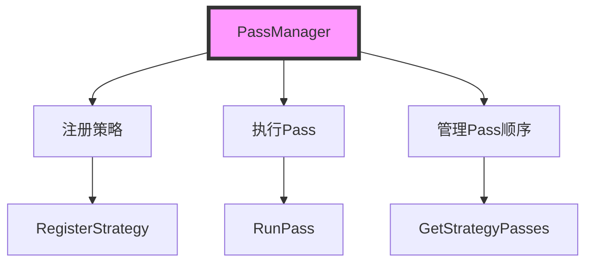

**关键方法：**

- **`Instance()`**：获取 PassManager 单例
  - **功能**：返回 PassManager 的唯一实例
  - **实现位置**：[`pass_mgr/pass_manager.cpp`](../../../framework/src/passes/pass_mgr/pass_manager.cpp#L52)
  - **设计模式**：单例模式，确保全局只有一个 PassManager 实例
  
- **`RegisterStrategy()`**：注册 Pass 策略
  - **功能**：注册一个 Pass 执行策略，包含 Pass 的执行顺序
  - **参数**：`strategy`（策略名称）、`passEntries`（Pass 条目列表）
  - **实现位置**：[`pass_mgr/pass_manager.cpp`](../../../framework/src/passes/pass_mgr/pass_manager.cpp)
  
- **`RunPass()`**：执行 Pass
  - **功能**：根据策略执行 Pass 序列
  - **参数**：`program`（程序对象）、`function`（要优化的函数）、`strategy`（策略名称）
  - **实现位置**：[`pass_mgr/pass_manager.cpp`](../../../framework/src/passes/pass_mgr/pass_manager.cpp#L211)
  - **详细实现**：
    ```cpp
    Status PassManager::RunPass(Program &program, Function &function, const std::string &strategy) const {
        // 1. 获取平台信息
        Platform::Instance().ObtainPlatformInfo();
        
        // 2. 获取策略中的 Pass 列表
        auto strategyPasses = GetStrategyPasses(strategy);
        
        // 3. 提取 Pass 标识符列表
        std::vector<std::string> identifiers;
        std::transform(strategyPasses.begin(), strategyPasses.end(), std::back_inserter(identifiers),
            [](const PassEntry &elem) { return elem.identifier; });
        
        // 4. 输出 Pass 配置调试信息
        ConfigManager::Instance().PassConfigsDebugInfo(strategy, identifiers);
        
        // 5. 遍历执行每个 Pass
        for (size_t i = startIdx; i < strategyPasses.size(); i++) {
            const auto &identifier = strategyPasses[i].identifier;
            const auto &passName = strategyPasses[i].passName;
            
            // 5.1 创建 Pass 实例
            auto pass = PassRegistry::GetInstance().CreatePass(passName);
            if (pass == nullptr) {
                ALOG_ERROR_F("Pass [%s] does not exist.", passName.c_str());
                return FAILED;
            }
            
            // 5.2 设置日志文件
            std::string originLogOutPath = config::LogFile();
            std::string logFolder = pass->LogFolder(config::LogTopFolder(), i);
            std::string logfilePath = logFolder + "/" + (pass->GetName() + function.GetMagicName() + ".log");
            LoggerManager::FileLoggerReplace(originLogOutPath, logfilePath, true);
            
            // 5.3 获取 Pass 配置
            auto passDfxCfg = ConfigManager::Instance().GetPassConfigs(strategy, identifier);
            if (config::GetDebugOption<int64_t>(CFG_COMPILE_DBEUG_MODE) == CFG_DEBUG_ALL) {
                passDfxCfg.printGraph = true;
                passDfxCfg.dumpGraph = true;
            }
            pass->SetPassConfigs(passDfxCfg);
            
            // 5.4 执行 Pass
            ALOG_INFO_F("[PassManager] Apply pass <%s> on function: %s.", identifier.c_str(), function.GetMagicName().c_str());
            auto start = std::chrono::high_resolution_clock::now();
            if (pass->Run(function, strategy, identifier, i) != SUCCESS) {
                ALOG_ERROR_F("Run pass <%s> failed.", identifier.c_str());
                return FAILED;
            }
            
            // 5.5 记录执行时间
            if (passDfxCfg.dumpPassTimeCost) {
                auto end = std::chrono::high_resolution_clock::now();
                auto duration = std::chrono::duration_cast<std::chrono::microseconds>(end - start);
                ALOG_INFO_F("Runtime of pass %s for program %s function %s is %ld us.", 
                    identifier.c_str(), program.Name().c_str(), function.GetMagicName().c_str(), duration.count());
            }
            
            // 5.6 验证 Pass 结果
            if (config::GetVerifyOption<bool>(KEY_ENABLE_PASS_VERIFY)) {
                Program::GetInstance().VerifyPass(&function, i, identifier);
            }
        }
        return SUCCESS;
    }
    ```

**Pass 策略示例：**

```cpp
void PassManager::RegDefaultStrategy() {
    RegisterStrategy("PVC2_OOO", {
        {"RemoveRedundantReshape", "RemoveRedundantReshape"},
        {"AutoCast", "AutoCast"},
        {"InferMemoryConflict", "InferMemoryConflict"},
        // ... 更多 Pass
    });
}
```

**关键概念：**

- **`strategy`**：Pass 执行策略，定义了 Pass 的执行顺序
  - **创建**：通过 `RegisterStrategy()` 注册
  - **使用**：通过 `RunPass()` 执行
  - **作用**：控制 Pass 的执行顺序和配置
  
- **`PassEntry`**：Pass 条目，包含 Pass 的标识符和名称
  - **结构**：`{identifier, passName}`
  - **用途**：定义策略中的 Pass 执行顺序
  
- **`strategies_`**：策略映射表，存储所有注册的策略
  - **类型**：`std::unordered_map<std::string, std::vector<PassEntry>>`
  - **键**：策略名称（如 `"PVC2_OOO"`, `"FunctionUnroll"`, `"ExecuteGraph"`）
  - **值**：Pass 条目列表，按执行顺序排列
  - **创建时机**：在 `PassManager` 构造函数中通过 `RegDefaultStrategy()` 创建
  - **使用时机**：在 `RunPass()` 中通过 `GetStrategyPasses()` 获取

- **`startIdx`**：Pass 执行起始索引
  - **类型**：`size_t`
  - **默认值**：`0`
  - **用途**：支持从指定 Pass 开始执行，用于断点续传
  - **设置**：通过 `GetResumePath()` 根据配置文件中的 `resumePath` 设置

---

## Pass 分类详解

### 图优化类 Pass

图优化类 Pass 主要进行图级别的优化，包括移除冗余操作、消除公共操作等。

#### RemoveRedundantReshape

**文件位置：** [`tensor_graph_pass/remove_redundant_reshape.h`](../../../framework/src/passes/tensor_graph_pass/remove_redundant_reshape.h)

**功能概述：** 移除冗余的 Reshape 操作，优化图结构。

**优化场景：**

1. **连续 Reshape 合并**：多个连续的 Reshape 操作可以合并为一个
2. **无效 Reshape 移除**：形状不变的 Reshape 操作可以直接移除
3. **Reshape 传播**：将 Reshape 操作传播到更合适的位置

**关键概念：**

- **Reshape 操作**：改变张量形状但不改变数据的操作
  - **作用**：调整张量的维度布局
  - **优化**：移除不必要的 Reshape 可以减少内存拷贝和计算开销

#### RemoveRedundantOp

**功能概述：** 移除冗余的操作，简化图结构。

**优化场景：**

- 移除无用的操作（没有消费者的操作）
- 移除重复的操作
- 移除恒等操作（如 `Add(0)`, `Mul(1)`）

#### CommonOperationEliminate

**功能概述：** 消除公共操作，减少重复计算。

**优化场景：**

- 识别相同的操作（相同的输入和参数）
- 合并公共操作，共享计算结果
- 减少重复计算，提高执行效率

#### RemoveUndrivenView

**文件位置：** [`tensor_graph_pass/remove_undriven_view.h`](../../../framework/src/passes/tensor_graph_pass/remove_undriven_view.h)

**功能概述：** 移除无驱动的 View 操作。

**优化场景：**

- 移除没有消费者的 View 操作
- 清理无用的视图操作，简化图结构

### 内存优化类 Pass

内存优化类 Pass 主要进行内存重用和缓冲区优化，减少内存占用。

#### GlobalMemoryReuse

**文件位置：** [`block_graph_pass/memory_reuse/global_memory_reuse.h`](../../../framework/src/passes/block_graph_pass/memory_reuse/global_memory_reuse.h)

**功能概述：** 全局内存重用优化，最大化内存利用率。

**实现原理：**

1. **连接矩阵构建**：构建张量之间的连接关系矩阵
   - **文件位置**：[`block_graph_pass/memory_reuse/connection_matrix.h`](../../../framework/src/passes/block_graph_pass/memory_reuse/connection_matrix.h)
   - **功能**：描述张量之间的连接关系，用于判断是否可以共享内存

2. **内存桶分配**：基于连接矩阵分配内存桶
   - **关键数据结构**：`TensorBucket` - 内存桶，用于存储可以共享内存的张量组
   - **分配策略**：最大化内存重用，减少内存占用

**关键数据结构：**

- **`TensorBucket`**：内存桶
  - **成员变量**：
    - `offset_`：内存偏移量
    - `size_`：内存大小
    - `tensorGroups_`：张量组列表，每个组包含可以共享内存的张量
    - `consumerOpIdxs_`：消费者操作索引集合
  - **方法**：
    - `AddTensorGroup()`：添加张量组到内存桶
    - `HasTopoDependency()`：检查拓扑依赖关系

- **`Allocator`**：内存分配器
  - **功能**：负责全局内存分配和重用
  - **关键方法**：
    - `Allocate()`：执行内存分配
    - `ProcessOperations()`：处理操作，分配内存

**关键方法详解：**

```cpp
Status Allocator::Allocate() {
    // 1. 初始化根函数的输入输出
    InitializeRootCasts();
    
    // 2. 处理所有操作
    ProcessOperations();
    
    // 3. 更新存储ID
    UpdateStorageId();
    
    return SUCCESS;
}
```

**关键概念：**

- **连接矩阵（Connection Matrix）**：描述张量之间连接关系的矩阵
  - **构建**：通过分析数据流图构建
  - **用途**：判断哪些张量可以共享内存
  - **实现**：使用位图（Bitmap）表示连接关系，提高查询效率

- **内存桶（Tensor Bucket）**：用于存储可以共享内存的张量组
  - **特点**：桶内的张量可以共享同一块内存
  - **条件**：张量之间没有数据依赖关系
  - **效果**：减少内存占用，提高内存利用率

#### SrcDstBufferMerge

**功能概述：** 合并源和目标缓冲区，减少内存拷贝。

**优化场景：**

- 当源缓冲区和目标缓冲区可以合并时，减少内存拷贝
- 优化数据传输路径，提高执行效率

#### NBufferMerge

**功能概述：** 合并 N 缓冲区，减少缓冲区数量。

**优化场景：**

- 合并多个缓冲区，减少内存占用
- 优化缓冲区管理，提高内存利用率

#### L1CopyInReuseMerge

**功能概述：** 合并 L1 拷贝输入重用，减少内存拷贝。

**优化场景：**

- 重用 L1 拷贝输入，减少内存拷贝次数
- 优化内存访问模式，提高执行效率

### 调度优化类 Pass

调度优化类 Pass 主要进行操作调度和同步优化，提高并行度。

#### OoOSchedule

**文件位置：** [`block_graph_pass/schedule_ooo/schedule_ooo.h`](../../../framework/src/passes/block_graph_pass/schedule_ooo/schedule_ooo.h), [`block_graph_pass/schedule_ooo/schedule_ooo.cpp`](../../../framework/src/passes/block_graph_pass/schedule_ooo/schedule_ooo.cpp)

**功能概述：** 乱序调度优化，提高操作并行度，减少等待时间。

**实现原理：**

1. **依赖分析**：分析操作之间的依赖关系
   - **数据依赖**：RAW、WAR、WAW 依赖
   - **控制依赖**：条件执行依赖
   - **资源依赖**：硬件资源依赖

2. **调度优化**：基于依赖关系进行乱序调度
   - **调度算法**：基于依赖关系图进行调度
   - **调度策略**：最大化并行度，最小化等待时间

3. **缓冲区管理**：管理操作执行所需的缓冲区
   - **缓冲区分配**：为操作分配缓冲区
   - **缓冲区重用**：重用缓冲区，减少内存占用

**关键数据结构：**

- **`OoOScheduler`**：乱序调度器
  - **功能**：执行乱序调度
  - **成员变量**：
    - `schedulerMap`：调度器映射表，按函数分组
  - **方法**：
    - `Schedule()`：执行调度
    - `SortOps()`：排序操作

- **`BufferPool`**：缓冲区池
  - **功能**：管理缓冲区分配和重用
  - **文件位置**：[`block_graph_pass/schedule_ooo/buffer_pool.h`](../../../framework/src/passes/block_graph_pass/schedule_ooo/buffer_pool.h)

- **`OoOScheduleChecker`**：调度检查器
  - **功能**：检查调度结果的正确性
  - **方法**：
    - `Check()`：检查调度结果

**关键方法详解：**

```cpp
Status OoOSchedule::RunOnFunction(Function &function) {
    // 1. 检查是否为 AICPU 程序
    if (IsAicpuProgram(opList)) {
        return SUCCESS; // AICPU 程序不需要调度
    }
    
    // 2. 创建调度器
    OoOScheduler scheduler(function);
    
    // 3. 执行调度
    if (scheduler.Schedule() != SUCCESS) {
        return FAILED;
    }
    
    // 4. 更新操作顺序
    function.ResetOperations();
    for (auto op : scheduler.GetScheduledOps()) {
        function.AddOperation(*op);
    }
    
    return SUCCESS;
}
```
- **实现位置**：[`block_graph_pass/schedule_ooo/schedule_ooo.cpp`](../../../framework/src/passes/block_graph_pass/schedule_ooo/schedule_ooo.cpp)

**关键概念：**

- **乱序调度（Out-of-Order Scheduling）**：不严格按照顺序执行，而是基于依赖关系进行调度
  - **优势**：提高并行度，减少等待时间
  - **实现**：基于依赖关系图进行调度
  - **算法**：使用拓扑排序和优先级队列进行调度

- **依赖关系**：操作之间的数据依赖和控制依赖
  - **类型**：
    - **RAW（Read After Write）**：读后写依赖，读操作需要等待写操作完成
    - **WAR（Write After Read）**：写后读依赖，写操作需要等待读操作完成
    - **WAW（Write After Write）**：写后写依赖，写操作需要等待前一个写操作完成
  - **用途**：确定操作的执行顺序

- **缓冲区管理**：管理操作执行所需的缓冲区
  - **分配策略**：基于操作的生命周期分配缓冲区
  - **重用策略**：重用不再使用的缓冲区，减少内存占用
  - **效果**：减少内存占用，提高内存利用率

#### InsertSync

**文件位置：** [`block_graph_pass/insert_sync.h`](../../../framework/src/passes/block_graph_pass/insert_sync.h)

**功能概述：** 插入同步点，确保数据依赖的正确性。

**实现原理：**

1. **数据依赖分析**：分析操作之间的数据依赖关系（RAW、WAR、WAW）
2. **Pipe 分配**：将操作分配到不同的 Pipe 上执行
3. **同步点插入**：在需要同步的位置插入 SetFlag 和 WaitFlag 操作
4. **死锁检测**：检测并解决可能的死锁问题

**关键数据结构：**

- **`DepOp`**：依赖操作
  - **成员变量**：
    - `idx`：操作在日志中的索引
    - `selfPipeCore`：操作所属的 Pipe 和 Core
    - `setPipe`：该操作需要设置标志的操作列表
    - `waitPipe`：该操作需要等待标志的操作列表

- **`IssueQueue`**：Issue 队列
  - **功能**：管理每个 Pipe 的操作队列
  - **成员变量**：
    - `selfPipeCore`：队列所属的 Pipe 和 Core
    - `ops`：操作索引列表

- **`DataDependencySearcher`**：数据依赖搜索器
  - **功能**：搜索操作之间的数据依赖关系
  - **方法**：
    - `Find()`：查找依赖关系
    - `Insert()`：插入依赖关系

**关键方法详解：**

```cpp
Status PipeSync::InsertSync(Function &function, std::vector<Operation *> &syncedOpLog) {
    // 1. 初始化 Issue 队列
    InitIssueQueue();
    
    // 2. 分析数据依赖
    for (size_t idx = 0; idx < opLogPtr.size(); ++idx) {
        FindDep(depOps_[idx], opLogPtr, idx, dataDependencySearcher);
    }
    
    // 3. Pipe 调度
    PipeDispatch(opLogPtr, syncedOpLog);
    
    // 4. 插入同步点
    IssueSyncOp(function, opLogPtr, syncedOpLog, totalIssued, allIssued);
    
    return SUCCESS;
}
```

**关键概念：**

- **Pipe**：硬件执行管道，不同的操作类型使用不同的 Pipe
  - **类型**：
    - `AIC_MTE2`、`AIC_MTE1`、`AIC_M`、`AIC_FIX`：Cube 操作管道
    - `AIV_MTE2`、`AIV_V`、`AIV_MTE3`：Vector 操作管道
  - **用途**：将操作分配到不同的 Pipe 上执行，提高并行度

- **SetFlag/WaitFlag**：同步标志，用于实现操作之间的同步
  - **SetFlag**：设置标志，表示操作已完成
  - **WaitFlag**：等待标志，表示操作需要等待其他操作完成
  - **Event ID**：事件 ID，用于标识不同的同步事件（最多 8 个）

- **数据依赖类型**：
  - **RAW（Read After Write）**：读后写依赖，读操作需要等待写操作完成
  - **WAR（Write After Read）**：写后读依赖，写操作需要等待读操作完成
  - **WAW（Write After Write）**：写后写依赖，写操作需要等待前一个写操作完成

#### InferParamIndex

**文件位置：** [`block_graph_pass/infer_param_index.h`](../../../framework/src/passes/block_graph_pass/infer_param_index.h)

**功能概述：** 推断参数索引，用于参数传递。

**功能说明：**

- 推断函数参数的索引位置
- 用于参数传递和内存分配
- 支持动态 Shape 的参数索引推断

### 类型转换类 Pass

类型转换类 Pass 主要进行类型转换和内存冲突推断。

#### AutoCast

**文件位置：** [`tensor_graph_pass/auto_cast.h`](../../../framework/src/passes/tensor_graph_pass/auto_cast.h)

**功能概述：** 自动插入类型转换操作。

**优化场景：**

- 当操作需要特定数据类型时，自动插入 Cast 操作
- 优化类型转换的位置，减少转换次数
- 支持类型提升和类型降级

#### InferMemoryConflict

**文件位置：** [`tensor_graph_pass/infer_memory_conflict.h`](../../../framework/src/passes/tensor_graph_pass/infer_memory_conflict.h)

**功能概述：** 推断 Tensor Graph 中的内存冲突，并插入必要的 Copy 操作。

**实现原理：**

1. **前向传播**：从输入到输出传播 Tile Shape 信息
2. **后向传播**：从输出到输入传播 Tile Shape 信息
3. **冲突检查**：检查操作输入输出是否存在内存冲突
4. **插入 Copy**：在冲突位置插入 Copy 操作

**关键数据结构：**

- **`memoryInfo`**：内存信息映射表
  - **类型**：`std::unordered_map<LogicalTensorPtr, LogicalTensorPtr>`
  - **功能**：记录每个张量的内存信息

- **`preregcopys`**：需要前置 Copy 的操作集合
  - **类型**：`std::set<Operation*>`
  - **功能**：记录需要在操作前插入 Copy 的操作

- **`postregcopys`**：需要后置 Copy 的操作集合
  - **类型**：`std::set<Operation*>`
  - **功能**：记录需要在操作后插入 Copy 的操作

**关键方法详解：**

- **`RunOnFunction()`**：Pass 的核心执行逻辑
  ```cpp
  Status InferMemoryConflict::RunOnFunction(Function &function) {
      APASS_LOG_INFO_F(Elements::Operation, "Start InferMemoryConflict for function [%s].", function.GetRawName().c_str());
      
      // 1. 初始化：初始化内存信息映射表和默认 Tile Shape
      if (Init(function) != SUCCESS) {
          APASS_LOG_ERROR_F(Elements::Operation, "Init failed.");
          return FAILED;
      }
      
      // 2. 前向传播：从输入到输出传播 Tile Shape 信息
      if (ForwardPropagation(function) != SUCCESS) {
          APASS_LOG_ERROR_F(Elements::Operation, "ForwardPropagation failed.");
          return FAILED;
      }
      
      // 3. 后向传播：从输出到输入传播 Tile Shape 信息
      if (BackwardPropagation(function) != SUCCESS) {
          APASS_LOG_ERROR_F(Elements::Operation, "BackwardPropagation failed.");
          return FAILED;
      }
      
      // 4. 插入 Copy 操作：在冲突位置插入 Copy 操作
      if (InsertCopys(function) != SUCCESS) {
          APASS_LOG_ERROR_F(Elements::Operation, "InsertCopys failed.");
          return FAILED;
      }
      
      // 5. 处理 ViewType 操作的特殊情况
      for (auto &op : function.Operations()) {
          if (op.GetOpcode() == Opcode::OP_VIEW_TYPE) {
              // 处理 ViewType 操作的 Tile Shape
              // ...
          }
      }
      
      APASS_LOG_INFO_F(Elements::Operation, "End InferMemoryConflict for function [%s].", function.GetRawName().c_str());
      return SUCCESS;
  }
  ```
  - **实现位置**：[`tensor_graph_pass/infer_memory_conflict.cpp`](../../../framework/src/passes/tensor_graph_pass/infer_memory_conflict.cpp#L33)

- **`ForwardPropagation()`**：前向传播 Tile Shape
  ```cpp
  Status InferMemoryConflict::ForwardPropagation(Function &function) {
      // 1. 初始化队列，从输入张量开始
      std::queue<LogicalTensorPtr> curTensors;
      for (auto &inCast : function.GetInCasts()) {
          curTensors.push(inCast);
      }
      
      // 2. 前向传播
      while (!curTensors.empty()) {
          auto curTensor = curTensors.front();
          curTensors.pop();
          
          // 3. 更新当前张量的 Tile Shape
          // 4. 传播到消费者操作
          for (auto consumer : curTensor->GetConsumers()) {
              UpdateForwardTensor(function, curTensor, consumer, curTensors);
          }
      }
      
      return SUCCESS;
  }
  ```
  - **功能**：从输入张量开始，前向传播 Tile Shape 信息到所有消费者操作
  - **关键步骤**：
    1. 初始化队列，将所有输入张量加入队列
    2. 从队列中取出张量，更新其 Tile Shape
    3. 将 Tile Shape 传播到所有消费者操作
    4. 将消费者操作的输出张量加入队列
    5. 重复步骤 2-4，直到队列为空

- **`BackwardPropagation()`**：后向传播 Tile Shape
  ```cpp
  Status InferMemoryConflict::BackwardPropagation(Function &function) {
      // 1. 初始化队列，从输出张量开始
      std::queue<LogicalTensorPtr> curTensors;
      for (auto &outCast : function.GetOutCasts()) {
          curTensors.push(outCast);
      }
      
      // 2. 后向传播
      while (!curTensors.empty()) {
          auto curTensor = curTensors.front();
          curTensors.pop();
          
          // 3. 更新当前张量的 Tile Shape
          // 4. 传播到生产者操作
          for (auto producer : curTensor->GetProducers()) {
              UpdateBackwardTensor(curTensor, producer, curTensors);
          }
      }
      
      return SUCCESS;
  }
  ```
  - **功能**：从输出张量开始，后向传播 Tile Shape 信息到所有生产者操作
  - **关键步骤**：
    1. 初始化队列，将所有输出张量加入队列
    2. 从队列中取出张量，更新其 Tile Shape
    3. 将 Tile Shape 传播到所有生产者操作
    4. 将生产者操作的输入张量加入队列
    5. 重复步骤 2-4，直到队列为空

- **`CheckConflict()`**：检查内存冲突
  ```cpp
  bool InferMemoryConflict::CheckConflict(const LogicalTensorPtr &inTensor, const LogicalTensorPtr &outTensor) {
      // 1. 检查是否为同一个符号（同一个 LogicalTensor）
      if (inTensor->Symbol() == outTensor->Symbol()) {
          return false; // 同一个符号，无冲突
      }
      
      // 2. 检查是否为同一个 RawTensor
      if (inTensor->GetRawTensor()->memoryId == outTensor->GetRawTensor()->memoryId) {
          return false; // 同一个 RawTensor，无冲突
      }
      
      // 3. 检查 Raw Shape 冲突
      return CheckRawShapeConflict(inTensor, outTensor);
  }
  ```
  - **功能**：检查两个张量之间是否存在内存冲突
  - **冲突条件**：
    1. 不是同一个符号（不是同一个 LogicalTensor）
    2. 不是同一个 RawTensor
    3. Raw Shape 不兼容（通过 `CheckRawShapeConflict()` 检查）

- **`InsertCopys()`**：插入 Copy 操作
  ```cpp
  Status InferMemoryConflict::InsertCopys(Function &function) {
      // 1. 插入前置 Copy
      if (InsertPrecededCopys(function) != SUCCESS) {
          return FAILED;
      }
      
      // 2. 插入后置 Copy
      if (InsertPostCopys(function) != SUCCESS) {
          return FAILED;
      }
      
      return SUCCESS;
  }
  ```
  - **功能**：在冲突位置插入 Copy 操作
  - **插入位置**：
    - **前置 Copy**：在操作输入前插入，解决输入冲突
    - **后置 Copy**：在操作输出后插入，解决输出冲突

**关键概念：**

- **内存冲突**：当两个操作需要访问同一块内存但 Tile Shape 不兼容时，会发生内存冲突
  - **原因**：不同的操作可能需要不同的数据布局
  - **解决**：在冲突位置插入 Copy 操作，创建新的内存副本

- **Tile Shape**：Tile 的形状，用于描述数据在内存中的布局
  - **作用**：决定数据在内存中的排列方式
  - **传播**：通过数据流图传播 Tile Shape 信息

### 图转换类 Pass

图转换类 Pass 主要进行图类型转换和函数展开。

#### ExpandFunction

**文件位置：** [`tensor_graph_pass/expand_function.h`](../../../framework/src/passes/tensor_graph_pass/expand_function.h), [`tensor_graph_pass/expand_function.cpp`](../../../framework/src/passes/tensor_graph_pass/expand_function.cpp)

**功能概述：** 展开函数调用，将函数调用内联到调用点，减少函数调用开销。

**实现原理：**

1. **识别 Call 操作**：识别函数中的 Call 操作
2. **获取被调用函数**：获取 Call 操作调用的函数
3. **内联函数**：将被调用函数的操作内联到调用点
4. **更新数据流**：更新数据流图，连接输入输出

**关键方法：**

- **`Expandfunction()`**：展开函数
  ```cpp
  Status ExpandFunction::Expandfunction(Function &function) const {
      // 1. 获取所有操作
      auto operations = function.GetSortedOperations();
      
      // 2. 识别 Call 操作
      for (auto &op : operations) {
          if (op.GetOpcode() == Opcode::OP_CALL) {
              // 3. 获取被调用函数
              Function *calledFunc = op.GetCallFunction();
              
              // 4. 内联函数操作
              for (auto &calledOp : calledFunc->GetSortedOperations()) {
                  // 创建新的操作，替换输入输出
                  Operation *newOp = function.AddOperation(calledOp.GetOpcode(), ...);
                  // ...
              }
              
              // 5. 删除 Call 操作
              function.EraseOperation(op);
          }
      }
      
      return SUCCESS;
  }
  ```
  - **实现位置**：[`tensor_graph_pass/expand_function.cpp`](../../../framework/src/passes/tensor_graph_pass/expand_function.cpp)

**优化场景：**

- **函数内联**：将函数调用内联到调用点，减少函数调用开销
- **图简化**：简化图结构，便于后续优化
- **性能提升**：减少函数调用开销，提高执行效率

**关键概念：**

- **函数内联**：将函数调用的操作直接插入到调用点
  - **优势**：减少函数调用开销，提高执行效率
  - **劣势**：可能增加代码大小，需要权衡

- **Call 操作**：函数调用操作
  - **识别**：通过 `Opcode::OP_CALL` 识别
  - **处理**：获取被调用函数，内联其操作

#### SubgraphToFunction

**文件位置：** [`tile_graph_pass/subgraph_to_function.h`](../../../framework/src/passes/tile_graph_pass/subgraph_to_function.h)

**功能概述：** 将子图转换为独立的 Function，支持函数调用和代码复用。

**实现原理：**

1. **子图识别**：识别数据流图中的独立子图（Island）
2. **Function 创建**：为每个子图创建独立的 Function
3. **输入输出记录**：记录子图的输入输出信息
4. **符号化**：将函数的参数符号化，支持动态 Shape
5. **Call 操作插入**：在原图中插入 Call 操作

**关键数据结构：**

- **`nLIST`**：子图列表
  - **类型**：`std::vector<std::vector<OperationPtr>>`
  - **功能**：存储识别出的子图

- **`mergedFuncList`**：合并后的函数列表
  - **类型**：`std::vector<Function *>`
  - **功能**：存储创建的函数

- **`subFuncInvokeInfos`**：子函数调用信息列表
  - **类型**：`std::vector<SubfuncInvokeInfoTy>`
  - **功能**：存储子函数的调用信息

**关键方法详解：**

```cpp
Status SubgraphToFunction::RunOnFunction(Function &function) {
    // 1. 识别子图
    ConstructnList(function);
    
    // 2. 将子图转换为 Function
    IslandToFunction(function);
    
    // 3. 符号化函数
    SymbolizeFunction(function, mergedFuncList);
    
    return SUCCESS;
}
```

**关键概念：**

- **Island**：数据流图中的独立子图
  - **特点**：内部操作之间有数据依赖，与外部操作之间没有数据依赖
  - **用途**：可以作为独立的执行单元

- **Incast/Outcast**：函数的输入输出
  - **Incast**：函数输入，对应子图的输入张量
  - **Outcast**：函数输出，对应子图的输出张量

- **符号化**：将具体的形状值替换为符号变量，支持动态 Shape
  - **实现**：通过 `SymbolizeFunction()` 实现
  - **用途**：支持运行时确定形状的函数

#### GraphPartition

**文件位置：** [`tile_graph_pass/graph_partition/graph_partition.h`](../../../framework/src/passes/tile_graph_pass/graph_partition/graph_partition.h)

**功能概述：** 将 Tile Graph 分区为多个子图。

**分区策略：**

- **Island 分区**：基于数据依赖关系进行分区
- **Supernode 分区**：基于 Supernode 进行分区

**关键概念：**

- **Supernode**：可以合并的节点集合
  - **特点**：节点之间可以合并执行
  - **用途**：提高执行效率

### 代码生成类 Pass

代码生成类 Pass 主要进行代码生成预处理和动态属性转换。

#### CodegenPreproc

**文件位置：** [`block_graph_pass/codegen_preproc.h`](../../../framework/src/passes/block_graph_pass/codegen_preproc.h)

**功能概述：** 代码生成预处理，为代码生成做准备。

**功能说明：**

- 准备代码生成所需的信息
- 优化代码生成的结构
- 处理代码生成的特殊情况

#### InferDynShape

**功能概述：** 推断动态形状，支持动态 Shape 计算。

**功能说明：**

- 推断动态形状信息
- 支持运行时形状计算
- 优化动态形状的处理

#### DynAttrToStatic

**文件位置：** [`block_graph_pass/dyn_attr_to_static.h`](../../../framework/src/passes/block_graph_pass/dyn_attr_to_static.h)

**功能概述：** 将动态属性转换为静态属性。

**功能说明：**

- 将动态属性转换为静态属性
- 优化代码生成
- 支持静态优化

---

## Tensor Graph Pass 详细说明

### 概述

Tensor Graph Pass 在 Tensor Graph 阶段执行，主要进行图级优化和内存冲突推断。该阶段的 Pass 在 Tensor Graph 层级上工作，优化图结构，为 Lowering 到 Tile Graph 做准备。

### Pass 执行顺序和依赖关系

根据 `PVC2_OOO` 策略，Tensor Graph Pass 的执行顺序如下：

```mermaid
graph LR
    P1[1. RemoveRedundantReshape] --> P2[2. AutoCast]
    P2 --> P3[3. InferMemoryConflict]
    P3 --> P4[4. RemoveUndrivenView]
    P4 --> P5[5. ExpandFunction]
    P5 --> P6[6. MergeViewAssemble]
    P6 --> P7[7. SplitReshape]
    P7 --> P8[8. SplitRawTensor]
    P8 --> P9[9. SplitLargeFanoutTensor]
    P9 --> P10[10. DuplicateOp]
    P10 --> P11[11. AssignMemoryType]
    P11 --> P12[12. InferDiscontinuousInput]
    P12 --> P13[13. RemoveRedundantOp]
    P13 --> P14[14. SplitK]
    
    style P1 fill:#e1f5ff,stroke:#333,stroke-width:2px
    style P14 fill:#fff4e1,stroke:#333,stroke-width:2px
```

### 核心 Pass 详解

#### RemoveRedundantReshape

**文件位置：** [`tensor_graph_pass/remove_redundant_reshape.h`](../../../framework/src/passes/tensor_graph_pass/remove_redundant_reshape.h), [`tensor_graph_pass/remove_redundant_reshape.cpp`](../../../framework/src/passes/tensor_graph_pass/remove_redundant_reshape.cpp)

**功能概述：** 移除冗余的 Reshape 操作，优化图结构。

**优化场景：**

1. **连续 Reshape 合并**：多个连续的 Reshape 操作可以合并为一个
   - **示例**：`Reshape(A, shape1) -> Reshape(shape2)` 可以合并为 `Reshape(A, shape2)`
   - **效果**：减少操作数量，提高执行效率

2. **无效 Reshape 移除**：形状不变的 Reshape 操作可以直接移除
   - **示例**：`Reshape(A, A.shape)` 可以直接移除
   - **效果**：减少不必要的操作

3. **Reshape 传播**：将 Reshape 操作传播到更合适的位置
   - **示例**：将 Reshape 操作提前或延后，减少内存拷贝
   - **效果**：优化内存访问模式

**关键概念：**

- **Reshape 操作**：改变张量形状但不改变数据的操作
  - **作用**：调整张量的维度布局
  - **优化**：移除不必要的 Reshape 可以减少内存拷贝和计算开销

#### AutoCast

**文件位置：** [`tensor_graph_pass/auto_cast.h`](../../../framework/src/passes/tensor_graph_pass/auto_cast.h), [`tensor_graph_pass/auto_cast.cpp`](../../../framework/src/passes/tensor_graph_pass/auto_cast.cpp)

**功能概述：** 自动插入类型转换操作，确保类型兼容。

**优化场景：**

- 当操作需要特定数据类型时，自动插入 Cast 操作
- 优化类型转换的位置，减少转换次数
- 支持类型提升和类型降级

**关键概念：**

- **类型转换**：将张量从一种数据类型转换为另一种数据类型
  - **类型提升**：从低精度类型转换为高精度类型（如 INT8 -> FP32）
  - **类型降级**：从高精度类型转换为低精度类型（如 FP32 -> INT8）
  - **优化**：减少不必要的类型转换，提高执行效率

#### InferMemoryConflict

**文件位置：** [`tensor_graph_pass/infer_memory_conflict.h`](../../../framework/src/passes/tensor_graph_pass/infer_memory_conflict.h)

**功能概述：** 推断 Tensor Graph 中的内存冲突，并插入必要的 Copy 操作。

**实现流程：**

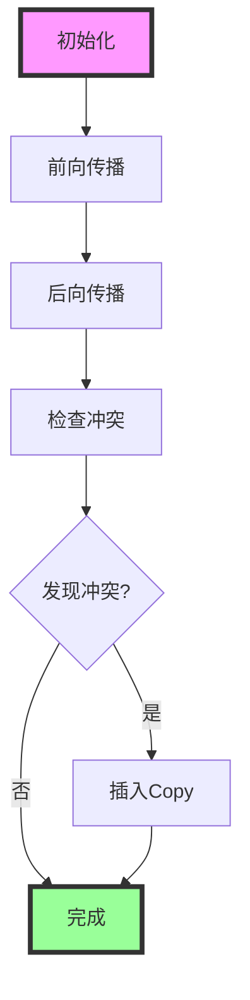

**关键方法：**

- **`ForwardPropagation()`**：前向传播
  - **功能**：从输入到输出传播 Tile Shape 信息
  - **实现位置**：[`tensor_graph_pass/infer_memory_conflict.cpp`](../../../framework/src/passes/tensor_graph_pass/infer_memory_conflict.cpp)
  
- **`BackwardPropagation()`**：后向传播
  - **功能**：从输出到输入传播 Tile Shape 信息
  
- **`CheckConflict()`**：检查冲突
  - **功能**：检查两个张量之间是否存在内存冲突
  
- **`InsertCopys()`**：插入 Copy
  - **功能**：在冲突位置插入 Copy 操作

**关键概念：**

- **内存冲突**：当两个操作需要访问同一块内存但 Tile Shape 不兼容时，会发生内存冲突
  - **原因**：不同的操作可能需要不同的数据布局
  - **解决**：在冲突位置插入 Copy 操作，创建新的内存副本
  
- **Tile Shape**：Tile 的形状，用于描述数据在内存中的布局
  - **作用**：决定数据在内存中的排列方式
  - **传播**：通过数据流图传播 Tile Shape 信息
  
- **前向/后向传播**：通过数据流图传播 Tile Shape 信息
  - **前向传播**：从输入到输出传播
  - **后向传播**：从输出到输入传播
  - **目的**：确定每个操作的输入输出 Tile Shape

#### RemoveRedundantReshape

**功能概述：** 移除冗余的 Reshape 操作。

**优化场景：**

- 连续的 Reshape 操作可以合并
- 无效的 Reshape 操作（形状不变）可以移除

#### AutoCast

**功能概述：** 自动插入类型转换操作。

**优化场景：**

- 当操作需要特定数据类型时，自动插入 Cast 操作
- 优化类型转换的位置，减少转换次数

---

## Tile Graph Pass 详细说明

### 概述

Tile Graph Pass 在 Tile Graph 阶段执行，主要进行 Tile 级优化和图分区。该阶段的 Pass 在 Tile Graph 层级上工作，进行硬件感知的优化，为转换为 Block Graph 做准备。

### Pass 执行顺序和依赖关系

根据 `PVC2_OOO` 策略，Tile Graph Pass 的执行顺序如下：

```mermaid
graph LR
    P15[15. GraphPartition] --> P16[16. ReduceCopyMerge]
    P16 --> P17[17. NBufferMerge]
    P17 --> P18[18. L1CopyInReuseMerge]
    P18 --> P19[19. IntraSubgraphAdapter]
    P19 --> P20[20. GenerateMoveOp]
    P20 --> P21[21. CommonOperationEliminate]
    P21 --> P22[22. AxisCombine]
    P22 --> P23[23. PadLocalBuffer]
    P23 --> P24[24. RemoveUnalignedReshape]
    P24 --> P25[25. ReplaceTensor]
    P25 --> P26[26. PreGraphProcess]
    P26 --> P27[27. InferDynShape]
    P27 --> P28[28. SubgraphToFunction]
    
    style P15 fill:#fff4e1,stroke:#333,stroke-width:2px
    style P28 fill:#ffe1f5,stroke:#333,stroke-width:2px
```

### 核心 Pass 详解

#### GraphPartition

**文件位置：** [`tile_graph_pass/graph_partition/graph_partition.h`](../../../framework/src/passes/tile_graph_pass/graph_partition/graph_partition.h)

**功能概述：** 将 Tile Graph 分区为多个子图，支持并行执行和资源管理。

**分区策略：**

1. **Island 分区**：基于数据依赖关系进行分区
   - **算法**：识别数据流图中的独立子图（Island）
   - **特点**：Island 内部操作之间有数据依赖，与外部操作之间没有数据依赖
   - **用途**：可以作为独立的执行单元
   - **实现**：通过 `IsoPartitioner` 实现

2. **Supernode 分区**：基于 Supernode 进行分区
   - **算法**：识别可以合并的节点集合（Supernode）
   - **特点**：Supernode 内的节点可以合并执行
   - **用途**：提高执行效率，减少调度开销
   - **实现**：通过 `SupernodeGraphBuilder` 构建 Supernode 图

**关键数据结构：**

- **`SubGraph`**：子图
  - **成员变量**：
    - `nodeList_`：节点列表
    - `nodeSet_`：节点集合
    - `inNodes_`：输入节点集合
    - `outNodes_`：输出节点集合
    - `cycle_`：子图的周期数
    - `coreType_`：子图的核心类型
  - **方法**：
    - `AddNode()`：添加节点到子图
    - `Merge()`：合并子图
    - `GetLatency()`：获取子图的延迟

- **`IsomorphismGraphGroup`**：同构图组
  - **功能**：识别同构的子图，可以合并执行
  - **方法**：
    - `BuildGraphGroup()`：构建图组
    - `ExpandIsoGraphs()`：扩展同构图

**关键概念：**

- **Island**：数据流图中的独立子图
  - **识别方法**：通过深度优先搜索（DFS）识别连通分量
  - **特点**：
    - 内部操作之间有数据依赖
    - 与外部操作之间没有数据依赖
    - 可以作为独立的执行单元
  - **用途**：支持并行执行和资源管理

- **Supernode**：可以合并的节点集合
  - **识别方法**：基于操作类型和数据依赖关系识别
  - **特点**：
    - 节点之间可以合并执行
    - 减少调度开销
    - 提高执行效率
  - **用途**：优化执行性能

- **同构图**：具有相同结构的子图
  - **识别**：通过图同构算法识别
  - **合并**：同构的子图可以合并执行
  - **效果**：减少代码大小，提高执行效率

**关键概念：**

- **Island**：数据流图中的独立子图
  - **识别方法**：通过深度优先搜索（DFS）识别连通分量
  - **特点**：
    - 内部操作之间有数据依赖
    - 与外部操作之间没有数据依赖
    - 可以作为独立的执行单元
  - **用途**：支持并行执行和资源管理

- **Supernode**：可以合并的节点集合
  - **识别方法**：基于操作类型和数据依赖关系识别
  - **特点**：
    - 节点之间可以合并执行
    - 减少调度开销
    - 提高执行效率
  - **用途**：优化执行性能

**分区流程：**

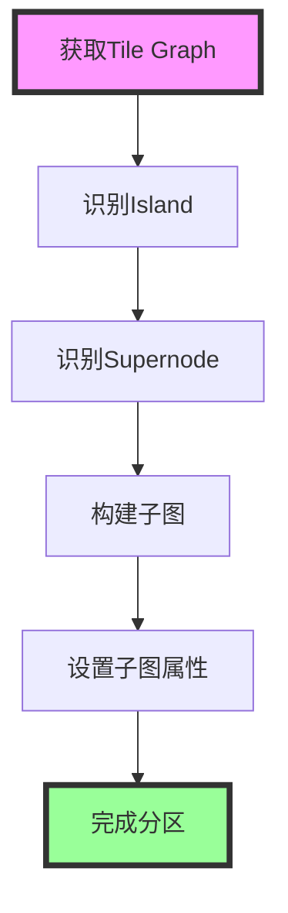

#### GenerateMoveOp

**功能概述：** 生成移动操作，优化数据传输。

**优化场景：**

- 生成 CopyIn 操作，将数据从全局内存拷贝到局部内存
- 生成 CopyOut 操作，将数据从局部内存拷贝到全局内存
- 优化数据传输路径，减少内存拷贝次数

**关键概念：**

- **CopyIn**：从全局内存拷贝到局部内存的操作
  - **用途**：将输入数据拷贝到局部内存，供计算使用
  - **优化**：减少不必要的 CopyIn 操作

- **CopyOut**：从局部内存拷贝到全局内存的操作
  - **用途**：将计算结果拷贝到全局内存，供后续使用
  - **优化**：减少不必要的 CopyOut 操作

#### CommonOperationEliminate

**功能概述：** 消除公共操作，减少重复计算。

**优化场景：**

- 识别相同的操作（相同的输入和参数）
- 合并公共操作，共享计算结果
- 减少重复计算，提高执行效率

**关键概念：**

- **公共操作**：具有相同输入和参数的操作
  - **识别**：通过操作哈希值识别
  - **合并**：将公共操作合并为一个，共享计算结果
  - **效果**：减少重复计算，提高执行效率

#### IntraSubgraphAdapter

**功能概述：** 子图内部适配器，优化子图内部结构。

**优化场景：**

- 优化子图内部的操作顺序
- 优化子图内部的内存布局
- 优化子图内部的资源分配

#### PadLocalBuffer

**功能概述：** 填充局部缓冲区，优化内存对齐。

**优化场景：**

- 填充局部缓冲区，使其对齐到硬件要求的大小
- 优化内存访问模式，提高执行效率

#### PreGraphProcess

**功能概述：** 图预处理，为后续优化做准备。

**优化场景：**

- 预处理图结构，为后续优化做准备
- 优化图的基本结构
- 处理图的特殊情况

#### SubgraphToFunction

**文件位置：** [`tile_graph_pass/subgraph_to_function.h`](../../../framework/src/passes/tile_graph_pass/subgraph_to_function.h)

**功能概述：** 将子图转换为独立的 Function，支持函数调用和代码复用。

**实现流程：**

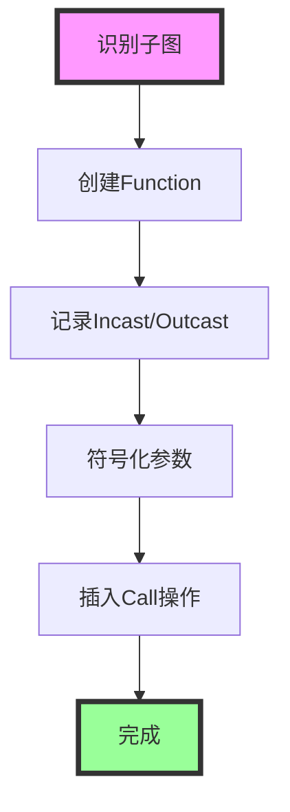

**关键方法：**

- **`IslandToFunction()`**：将 Island 转换为 Function
  - **功能**：将识别出的子图转换为独立的 Function
  - **实现位置**：[`tile_graph_pass/subgraph_to_function.cpp`](../../../framework/src/passes/tile_graph_pass/subgraph_to_function.cpp)
  
- **`RecordIncastOutcast()`**：记录输入输出
  - **功能**：记录子图的输入输出信息
  
- **`SymbolizeFunction()`**：符号化函数
  - **功能**：将函数的参数符号化，支持动态 Shape

**关键概念：**

- **Incast**：函数输入，对应子图的输入张量
  - **创建**：通过 `RecordIncastInfo()` 创建
  - **用途**：作为函数的输入参数
  
- **Outcast**：函数输出，对应子图的输出张量
  - **创建**：通过 `RecordOutcastInfo()` 创建
  - **用途**：作为函数的输出参数
  
- **符号化**：将具体的形状值替换为符号变量，支持动态 Shape
  - **实现**：通过 `SymbolizeFunction()` 实现
  - **用途**：支持运行时确定形状的函数

---

## Block Graph Pass 详细说明

### 概述

Block Graph Pass 在 Block Graph 阶段执行，主要进行内存重用和调度优化。该阶段的 Pass 在 Block Graph 层级上工作，进行执行优化，为代码生成做准备。

### Pass 执行顺序和依赖关系

根据 `PVC2_OOO` 策略，Block Graph Pass 的执行顺序如下：

```mermaid
graph LR
    P29[29. InferParamIndex] --> P30[30. SrcDstBufferMerge]
    P30 --> P31[31. AddAlloc]
    P31 --> P32[32. OoOSchedule]
    P32 --> P33[33. GlobalMemoryReuse]
    P33 --> P34[34. RemoveAlloc]
    P34 --> P35[35. CopyOutResolve]
    P35 --> P36[36. InsertSync]
    P36 --> P37[37. MixSubgraphSplit]
    P37 --> P38[38. CodegenPreproc]
    
    style P29 fill:#ffe1f5,stroke:#333,stroke-width:2px
    style P38 fill:#e1ffe1,stroke:#333,stroke-width:2px
```

### 核心 Pass 详解

#### InferParamIndex

**文件位置：** [`block_graph_pass/infer_param_index.h`](../../../framework/src/passes/block_graph_pass/infer_param_index.h), [`block_graph_pass/infer_param_index.cpp`](../../../framework/src/passes/block_graph_pass/infer_param_index.cpp)

**功能概述：** 推断参数索引，用于参数传递和内存分配。

**功能说明：**

- 推断函数参数的索引位置
- 用于参数传递和内存分配
- 支持动态 Shape 的参数索引推断

**关键概念：**

- **参数索引**：函数参数在参数列表中的位置
  - **用途**：用于参数传递和内存分配
  - **推断**：通过分析函数调用关系推断

#### AddAlloc / RemoveAlloc

**文件位置：** 
- [`block_graph_pass/schedule_ooo/add_alloc.h`](../../../framework/src/passes/block_graph_pass/schedule_ooo/add_alloc.h)
- [`block_graph_pass/schedule_ooo/remove_alloc.h`](../../../framework/src/passes/block_graph_pass/schedule_ooo/remove_alloc.h)

**功能概述：** 添加和移除内存分配操作。

**功能说明：**

- **AddAlloc**：添加内存分配操作，为操作分配内存
- **RemoveAlloc**：移除冗余的内存分配操作，优化内存使用

**关键概念：**

- **Alloc 操作**：内存分配操作，用于分配内存
  - **添加**：在需要内存的操作前添加 Alloc 操作
  - **移除**：移除冗余的 Alloc 操作，优化内存使用

#### GlobalMemoryReuse

**文件位置：** [`block_graph_pass/memory_reuse/global_memory_reuse.h`](../../../framework/src/passes/block_graph_pass/memory_reuse/global_memory_reuse.h), [`block_graph_pass/memory_reuse/global_memory_reuse.cpp`](../../../framework/src/passes/block_graph_pass/memory_reuse/global_memory_reuse.cpp)

**功能概述：** 全局内存重用优化，最大化内存利用率。

**实现原理：**

1. **连接矩阵构建**：构建张量之间的连接关系矩阵
   - **文件位置**：[`block_graph_pass/memory_reuse/connection_matrix.h`](../../../framework/src/passes/block_graph_pass/memory_reuse/connection_matrix.h)
   - **功能**：描述张量之间的连接关系，用于判断是否可以共享内存
   - **实现**：使用位图（Bitmap）表示连接关系，提高查询效率

2. **内存桶分配**：基于连接矩阵分配内存桶
   - **关键数据结构**：`TensorBucket` - 内存桶，用于存储可以共享内存的张量组
   - **分配策略**：最大化内存重用，减少内存占用

**关键数据结构：**

- **`TensorBucket`**：内存桶
  - **成员变量**：
    - `offset_`：内存偏移量，表示内存桶在全局内存中的起始位置
    - `size_`：内存大小，表示内存桶的大小
    - `tensorGroups_`：张量组列表，每个组包含可以共享内存的张量
    - `consumerOpIdxs_`：消费者操作索引集合，用于判断新张量是否可以复用本桶
  - **方法**：
    - `AddTensorGroup()`：添加张量组到内存桶
    - `HasTopoDependency()`：检查拓扑依赖关系，确保内存安全

- **`Allocator`**：内存分配器
  - **功能**：负责全局内存分配和重用
  - **关键方法**：
    - `Allocate()`：执行内存分配
    - `ProcessOperations()`：处理操作，分配内存
    - `HandleNewTensor()`：处理新张量，尝试重用内存

**关键方法详解：**

```cpp
Status Allocator::Allocate() {
    // 1. 初始化根函数的输入输出
    InitializeRootCasts();
    
    // 2. 处理所有操作
    ProcessOperations();
    
    // 3. 更新存储ID
    UpdateStorageId();
    
    return SUCCESS;
}

void Allocator::ProcessOperations() {
    // 遍历所有操作
    for (auto &op : function_->Operations()) {
        // 处理操作的输出张量
        for (size_t outputIdx = 0; outputIdx < op.GetOOperands().size(); ++outputIdx) {
            auto outputTensor = op.GetOOperands()[outputIdx];
            HandleNewTensor(op, outputIdx, outputTensor);
        }
    }
}

void Allocator::HandleNewTensor(Operation& callOp, size_t outputIdx, LogicalTensorPtr& outputTensor) {
    // 1. 创建张量描述
    TensorsDesc tensorsDesc(function_);
    tensorsDesc.tensors.insert(outputTensor);
    
    // 2. 收集连接操作
    CollectConnectionOps(tensorsDesc);
    
    // 3. 收集消费者操作
    CollectComsuerOpDesc(tensorsDesc);
    
    // 4. 尝试重用内存桶
    bool reused = false;
    for (auto &bucket : tensorBuckets_) {
        if (bucket.HasTopoDependency(tensorsDesc.connectionOpsBitmap)) {
            if (bucket.AddTensorGroup(tensorsDesc)) {
                reused = true;
                break;
            }
        }
    }
    
    // 5. 如果无法重用，创建新的内存桶
    if (!reused) {
        TensorBucket newBucket;
        newBucket.AddTensorGroup(tensorsDesc);
        tensorBuckets_.push_back(newBucket);
    }
}
```

**关键概念：**

- **连接矩阵（Connection Matrix）**：描述张量之间连接关系的矩阵
  - **构建**：通过分析数据流图构建
  - **用途**：判断哪些张量可以共享内存
  - **实现**：使用位图（Bitmap）表示连接关系，提高查询效率
  - **文件位置**：[`block_graph_pass/memory_reuse/connection_matrix.h`](../../../framework/src/passes/block_graph_pass/memory_reuse/connection_matrix.h)

- **内存桶（Tensor Bucket）**：用于存储可以共享内存的张量组
  - **特点**：桶内的张量可以共享同一块内存
  - **条件**：张量之间没有数据依赖关系
  - **效果**：减少内存占用，提高内存利用率
  - **分配策略**：基于连接矩阵和拓扑依赖关系分配

- **拓扑依赖关系**：张量之间的依赖关系
  - **检查**：通过 `HasTopoDependency()` 检查
  - **用途**：确保内存重用的安全性
  - **条件**：新张量的生产者操作必须在旧张量的所有消费者操作之后执行

#### CopyOutResolve

**文件位置：** [`block_graph_pass/copy_out_resolve.h`](../../../framework/src/passes/block_graph_pass/copy_out_resolve.h)

**功能概述：** 解决 CopyOut 操作，优化输出数据拷贝。

**功能说明：**

- 解决 CopyOut 操作的特殊情况
- 优化输出数据拷贝路径
- 减少不必要的 CopyOut 操作

#### MixSubgraphSplit

**文件位置：** [`block_graph_pass/mix_subgraph_split.h`](../../../framework/src/passes/block_graph_pass/mix_subgraph_split.h)

**功能概述：** 混合子图切分，优化子图结构。

**功能说明：**

- 切分混合子图，优化子图结构
- 支持静态和动态子图的混合切分
- 优化子图的执行效率

#### OoOSchedule

**功能概述：** 乱序调度优化。

**调度策略：**

- **依赖分析**：分析操作之间的依赖关系
- **调度优化**：基于依赖关系进行乱序调度，提高并行度

**关键概念：**

- **乱序调度**：不严格按照顺序执行，而是基于依赖关系进行调度
  - **优势**：提高并行度，减少等待时间
  - **实现**：基于依赖关系进行调度
  
- **依赖关系**：操作之间的数据依赖和控制依赖
  - **类型**：RAW（Read After Write）、WAR（Write After Read）、WAW（Write After Write）
  - **用途**：确定操作的执行顺序

#### InsertSync

**文件位置：** [`block_graph_pass/insert_sync.h`](../../../framework/src/passes/block_graph_pass/insert_sync.h)

**功能概述：** 插入同步点，确保数据依赖的正确性。

**实现流程：**

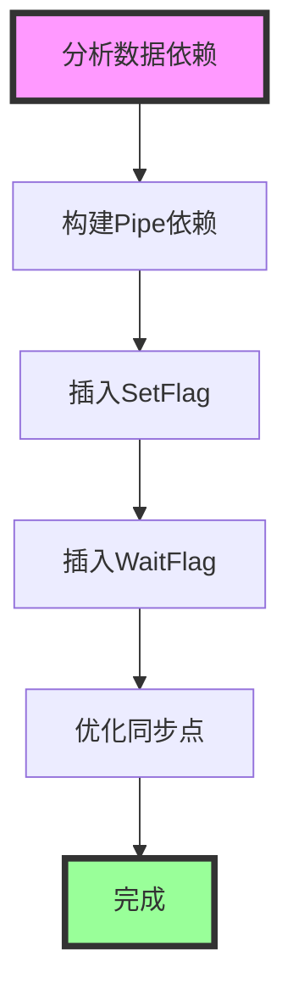

**关键方法：**

- **`InsertSync()`**：插入同步点
  - **功能**：在需要同步的位置插入 SetFlag 和 WaitFlag 操作
  - **实现位置**：[`block_graph_pass/insert_sync.cpp`](../../../framework/src/passes/block_graph_pass/insert_sync.cpp)
  
- **`PipeDispatch()`**：Pipe 调度
  - **功能**：将操作分配到不同的 Pipe 上执行
  
- **`FindDataDep()`**：查找数据依赖
  - **功能**：查找操作之间的数据依赖关系

**关键概念：**

- **Pipe**：硬件执行管道，不同的操作类型使用不同的 Pipe
  - **类型**：AIC_MTE2、AIC_MTE1、AIC_M、AIC_FIX、AIV_MTE2、AIV_V、AIV_MTE3 等
  - **用途**：将操作分配到不同的 Pipe 上执行，提高并行度
  
- **SetFlag/WaitFlag**：同步标志，用于实现操作之间的同步
  - **SetFlag**：设置标志，表示操作已完成
  - **WaitFlag**：等待标志，表示操作需要等待其他操作完成
  - **用途**：确保数据依赖的正确性
  
- **数据依赖**：操作之间的数据依赖关系（RAW、WAR、WAW）
  - **RAW**：Read After Write，读后写依赖
  - **WAR**：Write After Read，写后读依赖
  - **WAW**：Write After Write，写后写依赖

---

## 关键 Pass 详解

### InferMemoryConflict Pass

**文件位置：** [`tensor_graph_pass/infer_memory_conflict.h`](../../../framework/src/passes/tensor_graph_pass/infer_memory_conflict.h), [`tensor_graph_pass/infer_memory_conflict.cpp`](../../../framework/src/passes/tensor_graph_pass/infer_memory_conflict.cpp)

**功能概述：** 推断 Tensor Graph 中的内存冲突，并插入必要的 Copy 操作。

**实现细节：**

1. **初始化阶段**：
   - 初始化内存信息映射表 `memoryInfo`
   - 设置默认 Tile Shape

2. **前向传播阶段**：
   - 从输入张量开始，前向传播 Tile Shape 信息
   - 更新每个操作的输出 Tile Shape
   - 实现方法：`ForwardPropagation()`

3. **后向传播阶段**：
   - 从输出张量开始，后向传播 Tile Shape 信息
   - 更新每个操作的输入 Tile Shape
   - 实现方法：`BackwardPropagation()`

4. **冲突检查阶段**：
   - 检查每个操作的输入输出是否存在内存冲突
   - 记录需要插入 Copy 的位置
   - 实现方法：`CheckConflict()`

5. **插入 Copy 阶段**：
   - 在冲突位置插入 Copy 操作
   - 更新数据流图
   - 实现方法：`InsertCopys()`

**关键数据结构：**

- **`memoryInfo`**：内存信息映射表，记录每个张量的内存信息
  - **类型**：`std::unordered_map<LogicalTensorPtr, LogicalTensorPtr>`
  - **键**：原始张量
  - **值**：内存信息张量
  
- **`preregcopys`**：需要前置 Copy 的操作集合
  - **类型**：`std::set<Operation*>`
  - **用途**：记录需要在操作前插入 Copy 的操作
  
- **`postregcopys`**：需要后置 Copy 的操作集合
  - **类型**：`std::set<Operation*>`
  - **用途**：记录需要在操作后插入 Copy 的操作

**关键方法详解：**

- **`ForwardPropagation()`**：前向传播 Tile Shape
  ```cpp
  Status ForwardPropagation(Function &function) {
      // 从输入张量开始，前向传播 Tile Shape
      std::queue<LogicalTensorPtr> curTensors;
      // 初始化队列
      for (auto &inCast : function.GetInCasts()) {
          curTensors.push(inCast);
      }
      // 前向传播
      while (!curTensors.empty()) {
          auto curTensor = curTensors.front();
          curTensors.pop();
          // 更新当前张量的 Tile Shape
          // 传播到消费者操作
          for (auto consumer : GetConsumers(curTensor)) {
              UpdateForwardTensor(function, curTensor, consumer, curTensors);
          }
      }
  }
  ```

- **`CheckConflict()`**：检查内存冲突
  ```cpp
  bool CheckConflict(const LogicalTensorPtr &inTensor, const LogicalTensorPtr &outTensor) {
      // 检查两个张量的 Tile Shape 是否兼容
      // 如果不兼容，则存在内存冲突
      return CheckRawShapeConflict(inTensor, outTensor);
  }
  ```

### SubgraphToFunction Pass

**文件位置：** [`tile_graph_pass/subgraph_to_function.h`](../../../framework/src/passes/tile_graph_pass/subgraph_to_function.h), [`tile_graph_pass/subgraph_to_function.cpp`](../../../framework/src/passes/tile_graph_pass/subgraph_to_function.cpp)

**功能概述：** 将子图转换为独立的 Function，支持函数调用和代码复用。

**实现细节：**

1. **子图识别阶段**：
   - 识别数据流图中的独立子图（Island）
   - 构建子图列表 `nLIST`
   - 实现方法：`ConstructnList()`

2. **Function 创建阶段**：
   - 为每个子图创建独立的 Function
   - 设置 Function 的类型和属性
   - 实现方法：`ProcessSubgraph()`

3. **输入输出记录阶段**：
   - 记录子图的输入输出信息
   - 创建 Incast 和 Outcast
   - 实现方法：`RecordIncastOutcast()`

4. **符号化阶段**：
   - 将函数的参数符号化
   - 支持动态 Shape
   - 实现方法：`SymbolizeFunction()`

5. **Call 操作插入阶段**：
   - 在原图中插入 Call 操作
   - 替换原子图
   - 实现方法：`ProcessSubgraph()`

**关键数据结构：**

- **`nLIST`**：子图列表，每个元素是一个操作列表
  - **类型**：`std::vector<std::vector<OperationPtr>>`
  - **用途**：存储识别出的子图
  
- **`mergedFuncList`**：合并后的函数列表
  - **类型**：`std::vector<Function *>`
  - **用途**：存储创建的函数
  
- **`subFuncInvokeInfos`**：子函数调用信息列表
  - **类型**：`std::vector<SubfuncInvokeInfoTy>`
  - **用途**：存储子函数的调用信息

**关键方法详解：**

- **`RunOnFunction()`**：Pass 的核心执行逻辑
  ```cpp
  Status SubgraphToFunction::RunOnFunction(Function &function) {
      // 1. 初始化
      Init();
      
      // 2. 将 View 转换为 CopyIn（用于 COA 记录）
      if (TransViewToCopyInBeforeGenSubgraph(function) != SUCCESS) {
          return FAILED;
      }
      
      // 3. 将 Island 转换为 Function
      if (IslandToFunction(function) != SUCCESS) {
          return FAILED;
      }
      
      // 4. 将 CopyIn 转换回 View
      if (RecoverCopyInToViewAfterGenSubgraph(function) != SUCCESS) {
          return FAILED;
      }
      
      return SUCCESS;
  }
  ```
  - **实现位置**：[`tile_graph_pass/subgraph_to_function.cpp`](../../../framework/src/passes/tile_graph_pass/subgraph_to_function.cpp)

- **`IslandToFunction()`**：将 Island 转换为 Function
  ```cpp
  Status SubgraphToFunction::IslandToFunction(Function &function) {
      // 1. 构建子图列表（nLIST）
      ConstructnList(function);
      
      // 2. 为每个子图创建 Function
      size_t programIdx = 0;
      std::vector<Function*> outputFuncList;
      for (size_t i = 0; i < nLIST.size(); ++i) {
          if (ProcessSubgraph(function, i, programIdx, outputFuncList) != SUCCESS) {
              return FAILED;
          }
      }
      
      // 3. 记录输入输出信息
      RecordIncastOutcast(function);
      
      // 4. 符号化函数
      SymbolizeFunction(function, mergedFuncList);
      
      return SUCCESS;
  }
  ```
  - **功能**：将识别出的子图（Island）转换为独立的 Function
  - **关键步骤**：
    1. **构建子图列表**：通过 `ConstructnList()` 识别所有独立子图
    2. **创建 Function**：为每个子图创建独立的 Function
    3. **记录输入输出**：记录子图的输入输出信息，创建 Incast 和 Outcast
    4. **符号化**：将函数的参数符号化，支持动态 Shape

- **`ConstructnList()`**：构建子图列表
  ```cpp
  void SubgraphToFunction::ConstructnList(Function &function) {
      // 1. 获取所有操作
      auto operations = function.GetSortedOperations();
      
      // 2. 识别独立子图（Island）
      // Island 的特点：内部操作之间有数据依赖，与外部操作之间没有数据依赖
      // ...
      
      // 3. 构建子图列表
      nLIST.clear();
      for (auto &island : islands) {
          nLIST.push_back(island.operations);
      }
  }
  ```
  - **功能**：识别数据流图中的独立子图（Island）
  - **Island 识别算法**：
    1. 从任意操作开始，进行深度优先搜索（DFS）
    2. 收集所有可达的操作，形成一个 Island
    3. 重复步骤 1-2，直到所有操作都被分配到某个 Island

- **`ProcessSubgraph()`**：处理子图
  ```cpp
  Status SubgraphToFunction::ProcessSubgraph(Function& function, size_t i, size_t& programIdx, std::vector<Function*>& outputFuncList) {
      // 1. 获取子图操作列表
      auto &subgraphOps = nLIST[i];
      
      // 2. 创建新的 Function
      Function *leafFunc = new Function(function.GetBelongTo(), ...);
      
      // 3. 将子图操作添加到新 Function
      for (auto op : subgraphOps) {
          leafFunc->AddOperation(*op);
      }
      
      // 4. 设置 Function 属性
      leafFunc->SetGraphType(GraphType::LEAF_VF_GRAPH);
      leafFunc->SetFunctionType(FunctionType::STATIC);
      
      // 5. 记录 Function
      mergedFuncList.push_back(leafFunc);
      outputFuncList.push_back(leafFunc);
      
      // 6. 在原图中插入 Call 操作
      Operation *callOp = function.AddOperation(Opcode::OP_CALL, ...);
      callOp->SetCallFunction(leafFunc);
      
      // 7. 处理缓存结果
      ProcessCacheResult(result, i, programIdx, outputFuncList, *callOp);
      
      return SUCCESS;
  }
  ```
  - **功能**：为子图创建独立的 Function，并在原图中插入 Call 操作
  - **关键步骤**：
    1. 创建新的 Function 对象
    2. 将子图操作添加到新 Function
    3. 设置 Function 的类型和属性
    4. 在原图中插入 Call 操作，替换原子图

- **`RecordIncastOutcast()`**：记录输入输出
  ```cpp
  void SubgraphToFunction::RecordIncastOutcast(Function &function) {
      // 1. 记录所有子图的输入输出信息
      RecordEsgIncastOutcast(function);
      
      // 2. 为每个子函数创建 Incast 和 Outcast
      for (size_t i = 0; i < mergedFuncList.size(); ++i) {
          Function *leafFunc = mergedFuncList[i];
          
          // 2.1 创建 Incast
          for (auto &inTensor : subFuncInvokeInfos[i].inputTensors) {
              LogicalTensorPtr incast = leafFunc->MakeIncast(inTensor);
              // ...
          }
          
          // 2.2 创建 Outcast
          for (auto &outTensor : subFuncInvokeInfos[i].outputTensors) {
              LogicalTensorPtr outcast = leafFunc->MakeOutcast(outTensor);
              // ...
          }
      }
  }
  ```
  - **功能**：记录子图的输入输出信息，创建 Incast 和 Outcast
  - **Incast/Outcast 创建**：
    - **Incast**：通过 `Function::MakeIncast()` 创建，对应子图的输入张量
    - **Outcast**：通过 `Function::MakeOutcast()` 创建，对应子图的输出张量

- **`SymbolizeFunction()`**：符号化函数
  ```cpp
  void SubgraphToFunction::SymbolizeFunction(Function &rootFunc, std::vector<Function*> &mergedFuncList1) const {
      // 1. 为每个函数符号化参数
      for (size_t i = 0; i < mergedFuncList1.size(); ++i) {
          SymbolizeEachFunction(rootFunc, mergedFuncList1, i);
      }
  }
  
  void SubgraphToFunction::SymbolizeEachFunction(Function &rootFunc, std::vector<Function*> &mergedFuncList1, size_t i) const {
      Function *func = mergedFuncList1[i];
      
      // 1. 符号化输入参数
      for (auto &incast : func->GetInCasts()) {
          // 将具体的形状值替换为符号变量
          std::string symbolName = FindSymbolName(incast, incast->GetMagic());
          // ...
      }
      
      // 2. 符号化输出参数
      for (auto &outcast : func->GetOutCasts()) {
          // 将具体的形状值替换为符号变量
          std::string symbolName = FindSymbolName(outcast, outcast->GetMagic());
          // ...
      }
  }
  ```
  - **功能**：将函数的参数符号化，支持动态 Shape
  - **符号化过程**：
    1. 遍历函数的输入输出参数
    2. 将具体的形状值替换为符号变量（如 `SymbolicScalar`）
    3. 支持运行时确定形状的函数

### InsertSync Pass

**文件位置：** [`block_graph_pass/insert_sync.h`](../../../framework/src/passes/block_graph_pass/insert_sync.h), [`block_graph_pass/insert_sync.cpp`](../../../framework/src/passes/block_graph_pass/insert_sync.cpp)

**功能概述：** 插入同步点，确保数据依赖的正确性。

**实现细节：**

1. **数据依赖分析阶段**：
   - 分析操作之间的数据依赖关系（RAW、WAR、WAW）
   - 构建依赖图
   - 实现方法：`FindDep()`

2. **Pipe 分配阶段**：
   - 将操作分配到不同的 Pipe 上执行
   - 确定操作的执行顺序
   - 实现方法：`PipeDispatch()`

3. **同步点插入阶段**：
   - 在需要同步的位置插入 SetFlag 和 WaitFlag 操作
   - 优化同步点的数量和位置
   - 实现方法：`IssueSyncOp()`

4. **死锁检测阶段**：
   - 检测是否存在死锁
   - 如果存在死锁，进行调整
   - 实现方法：`ProcessDeadLock()`

**关键数据结构：**

- **`depOps_`**：依赖操作列表
  - **类型**：`std::vector<DepOp>`
  - **用途**：存储操作的依赖信息
  
- **`issueState_`**：Issue 队列状态
  - **类型**：`std::vector<IssueQueue>`
  - **用途**：存储每个 Pipe 的 Issue 队列状态
  
- **`freeEventId_`**：空闲事件 ID 队列
  - **类型**：`std::unordered_map<PipePair, std::deque<int>, PipePairHash>`
  - **用途**：存储每个 Pipe 对的空闲事件 ID

**关键方法详解：**

- **`RunOnFunction()`**：Pass 的核心执行逻辑
  ```cpp
  Status InsertSync::RunOnFunction(Function &function) {
      // 1. 对每个子图函数插入同步点
      if (function.rootFunc_ != nullptr) {
          for (auto &subProgram : function.rootFunc_->programs_) {
              InsertPipeAll(subProgram.second);
          }
      } else {
          InsertPipeAll(&function);
      }
      
      return SUCCESS;
  }
  ```
  - **实现位置**：[`block_graph_pass/insert_sync.cpp`](../../../framework/src/passes/block_graph_pass/insert_sync.cpp)

- **`InsertPipeAll()`**：为函数插入所有 Pipe 同步点
  ```cpp
  void InsertSync::InsertPipeAll(Function *subGraphFunc) {
      // 1. 生成新的操作列表
      std::vector<Operation *> opListNew;
      if (GenNewOpList(subGraphFunc, opListNew) != SUCCESS) {
          return;
      }
      
      // 2. 检查新操作列表的顺序
      auto oriOpList = subGraphFunc->GetSortedOperations();
      if (CheckNewOpListSeq(oriOpList, opListNew) != SUCCESS) {
          return;
      }
      
      // 3. 插入同步点主循环
      InsertSyncMainLoop(subGraphFunc);
  }
  ```
  - **功能**：为函数插入所有 Pipe 同步点
  - **关键步骤**：
    1. 生成新的操作列表（包含同步操作）
    2. 检查新操作列表的顺序是否正确
    3. 执行插入同步点主循环

- **`InsertSyncMainLoop()`**：插入同步点主循环
  ```cpp
  Status InsertSync::InsertSyncMainLoop(Function *subGraphFunc) {
      // 1. 创建 PipeSync 对象
      PipeSync pipeSync;
      
      // 2. 获取操作列表
      auto opList = subGraphFunc->GetSortedOperations();
      std::vector<Operation *> syncedOpLog;
      
      // 3. 插入同步点
      if (pipeSync.InsertSync(*subGraphFunc, syncedOpLog) != SUCCESS) {
          return FAILED;
      }
      
      // 4. 更新操作列表
      subGraphFunc->ResetOperations();
      for (auto op : syncedOpLog) {
          subGraphFunc->AddOperation(*op);
      }
      
      return SUCCESS;
  }
  ```
  - **功能**：执行插入同步点的主循环
  - **关键步骤**：
    1. 创建 `PipeSync` 对象
    2. 获取操作列表
    3. 调用 `PipeSync::InsertSync()` 插入同步点
    4. 更新函数中的操作列表

- **`PipeSync::InsertSync()`**：插入同步点
  ```cpp
  Status PipeSync::InsertSync(Function &function, std::vector<Operation *> &syncedOpLog) {
      // 1. 初始化 Issue 队列
      InitIssueQueue();
      
      // 2. 分析数据依赖
      for (size_t idx = 0; idx < opLogPtr.size(); ++idx) {
          FindDep(depOps_[idx], opLogPtr, idx, dataDependencySearcher);
      }
      
      // 3. Pipe 调度
      PipeDispatch(opLogPtr, syncedOpLog);
      
      // 4. 插入同步点
      IssueSyncOp(function, opLogPtr, syncedOpLog, totalIssued, allIssued);
      
      return SUCCESS;
  }
  ```
  - **功能**：在需要同步的位置插入 SetFlag 和 WaitFlag 操作
  - **关键步骤**：
    1. **初始化 Issue 队列**：为每个 Pipe 创建 Issue 队列
    2. **分析数据依赖**：查找操作之间的数据依赖关系
    3. **Pipe 调度**：将操作分配到不同的 Pipe 上执行
    4. **插入同步点**：在需要同步的位置插入 SetFlag 和 WaitFlag 操作

- **`FindDep()`**：查找依赖关系
  ```cpp
  void PipeSync::FindDep(DepOp &op, const std::vector<Operation *> opLogPtr, size_t idx, DataDependencySearcher& dataDependencySearcher) {
      // 1. 查找数据依赖
      std::set<int> depIndices = dataDependencySearcher.Find(opLogPtr[idx]);
      
      // 2. 记录依赖关系
      for (auto depIdx : depIndices) {
          op.waitPipe.push_back(depIdx);
          depOps_[depIdx].setPipe.push_back(idx);
      }
      
      // 3. 插入到依赖搜索器
      dataDependencySearcher.Insert(opLogPtr[idx], idx);
  }
  ```
  - **功能**：查找操作之间的数据依赖关系
  - **依赖类型**：
    - **RAW（Read After Write）**：读操作需要等待写操作完成
    - **WAR（Write After Read）**：写操作需要等待读操作完成
    - **WAW（Write After Write）**：写操作需要等待前一个写操作完成

- **`PipeDispatch()`**：Pipe 调度
  ```cpp
  Status PipeSync::PipeDispatch(const std::vector<Operation *> opLogPtr, std::vector<IndexOp> &syncedOpLog) {
      // 1. 初始化同步操作日志
      syncedOpLog.clear();
      for (size_t i = 0; i < opLogPtr.size(); ++i) {
          syncedOpLog.push_back({i, std::ref(*opLogPtr[i])});
      }
      
      // 2. 处理 View 和 Assemble 操作的顺序
      ProcessViewAssembleOrder(opLogPtr, syncedOpLog);
      
      // 3. Issue 操作
      IssueOp(function, opLogPtr, syncedOpLog);
      
      return SUCCESS;
  }
  ```
  - **功能**：将操作分配到不同的 Pipe 上执行
  - **关键步骤**：
    1. 初始化同步操作日志
    2. 处理 View 和 Assemble 操作的顺序
    3. Issue 操作到不同的 Pipe

- **`IssueSyncOp()`**：插入同步操作
  ```cpp
  Status PipeSync::IssueSyncOp(Function &function, std::vector<Operation *> opLogPtr, std::vector<IndexOp> &syncedOpLog, size_t &totalIssued, size_t &allIssued) {
      bool eventIdDeadlock = false;
      size_t issued = 0;
      
      // 1. 按 Pipe 序列 Issue 操作
      if (IssueOpPipeSeq(function, opLogPtr, syncedOpLog, eventIdDeadlock, issued) != SUCCESS) {
          return FAILED;
      }
      
      // 2. 处理死锁
      if (ProcessDeadLock(eventIdDeadlockEnterTimes, eventIdDeadlock, syncedOpLog) != SUCCESS) {
          return FAILED;
      }
      
      // 3. 同步依赖
      if (SynDependency(maxOverlapDepIdx, depInfo, pipePair, syncedOpLog) != SUCCESS) {
          return FAILED;
      }
      
      return SUCCESS;
  }
  ```
  - **功能**：插入同步操作（SetFlag 和 WaitFlag）
  - **关键步骤**：
    1. 按 Pipe 序列 Issue 操作
    2. 处理死锁情况
    3. 同步依赖关系

- **`FindDataDep()`**：查找数据依赖
  ```cpp
  bool PipeSync::FindDataDep(DataDepInfo &depInfo, std::vector<IndexOp> &syncedOpLog, int i) {
      // 1. 查找数据依赖
      for (int j = i - 1; j >= 0; --j) {
          // 2. 检查 RAW 依赖
          if (CheckRawDependency(syncedOpLog[j].second, syncedOpLog[i].second, k, idx)) {
              depInfo.opDepList.push_back({j, i});
              // ...
          }
          
          // 3. 检查 WAR 依赖
          if (CheckWarDependency(syncedOpLog[j].second, syncedOpLog[i].second, k, idx)) {
              depInfo.opDepList.push_back({j, i});
              // ...
          }
          
          // 4. 检查 WAW 依赖
          if (CheckWawDependency(syncedOpLog[j].second, syncedOpLog[i].second, k, idx)) {
              depInfo.opDepList.push_back({j, i});
              // ...
          }
      }
      
      return !depInfo.opDepList.empty();
  }
  ```
  - **功能**：查找操作之间的数据依赖关系
  - **依赖检查**：
    - **`CheckRawDependency()`**：检查 RAW 依赖（读后写）
    - **`CheckWarDependency()`**：检查 WAR 依赖（写后读）
    - **`CheckWawDependency()`**：检查 WAW 依赖（写后写）

---

## Pass 开发模式

### Pass 开发步骤

1. **继承 Pass 基类**：
   ```cpp
   class MyPass : public Pass {
   public:
       MyPass() : Pass("MyPass") {}
   private:
       Status RunOnFunction(Function &function) override;
   };
   ```

2. **实现 RunOnFunction()**：
   ```cpp
   Status MyPass::RunOnFunction(Function &function) {
       // Pass 的核心逻辑
       return SUCCESS;
   }
   ```

3. **注册 Pass**：
   ```cpp
   REG_PASS(MyPass);
   ```

4. **添加到策略**：
   ```cpp
   RegisterStrategy("MyStrategy", {
       {"MyPass", "MyPass"},
   });
   ```

### Pass 开发最佳实践

1. **错误处理**：
   - 使用 `Status` 返回执行结果
   - 在关键位置进行错误检查

2. **日志记录**：
   - 使用 `PrintFunction()` 记录优化前后的函数
   - 使用 `DumpFunctionJson()` 导出 JSON 格式的函数信息

3. **健康检查**：
   - 实现 `PreCheck()` 和 `PostCheck()` 验证函数的正确性
   - 实现 `DoHealthCheckBefore()` 和 `DoHealthCheckAfter()` 进行健康检查

4. **配置管理**：
   - 使用 `GetConfig()` 获取 Pass 配置
   - 支持通过配置文件调整 Pass 行为

---

## 最佳实践

### 1. Pass 开发

**推荐做法：**

- 继承 `Pass` 基类，实现 `RunOnFunction()` 方法
- 实现 `PreCheck()` 和 `PostCheck()` 进行验证
- 使用 `GetConfig()` 获取配置，支持灵活配置
- 使用日志和调试工具进行问题排查

### 2. Pass 注册

**推荐做法：**

- 使用 `REG_PASS()` 宏注册 Pass
- 在 `RegDefaultStrategy()` 中添加 Pass 到策略
- 确保 Pass 的执行顺序正确

### 3. Pass 调试

**推荐做法：**

- 使用 `PrintFunction()` 打印函数信息
- 使用 `DumpFunctionJson()` 导出 JSON 格式的函数信息
- 使用 `DoHealthCheckBefore()` 和 `DoHealthCheckAfter()` 进行健康检查

---

## 常见问题

### 1. Pass 执行失败

**问题：** Pass 执行失败，返回 `FAILED`。

**可能原因：**
- Pass 逻辑错误
- 函数状态不正确
- 配置错误

**解决方案：**
- 检查 Pass 的逻辑实现
- 使用 `PreCheck()` 和 `PostCheck()` 验证函数状态
- 检查 Pass 配置是否正确

### 2. Pass 优化效果不佳

**问题：** Pass 优化后性能提升不明显。

**可能原因：**
- Pass 优化策略不当
- Pass 执行顺序不合理
- 配置参数不合适

**解决方案：**
- 调整 Pass 的优化策略
- 调整 Pass 的执行顺序
- 优化配置参数

### 3. Pass 死锁

**问题：** Pass 执行时出现死锁。

**可能原因：**
- 依赖关系分析错误
- 同步点插入不当

**解决方案：**
- 检查依赖关系分析逻辑
- 优化同步点插入策略
- 使用死锁检测机制

---

## 相关文档

- [Function 类详细文档](03-function.md)
- [Interface 模块文档](02-interface.md)
- [Framework 模块文档](01-framework.md)
- 示例体系与选型建议见：[仓库 examples/ 全景速览](../01-examples/01-examples-catalog.md)

---

## Pass 执行完整流程

### PassManager::RunPass() 详细流程

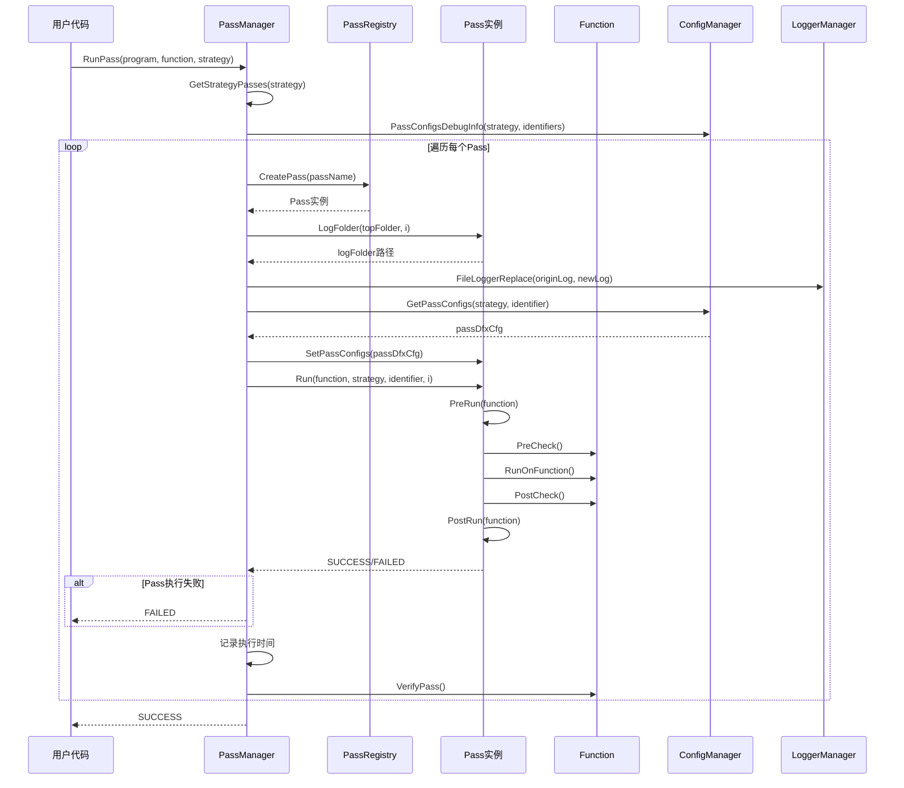

### Pass 执行时间线

```mermaid
gantt
    title Pass 执行时间线（PVC2_OOO 策略）
    dateFormat X
    axisFormat %s
    
    section Tensor Graph Pass
    RemoveRedundantReshape    :0, 1s
    AutoCast                  :1s, 1s
    InferMemoryConflict       :2s, 2s
    RemoveUndrivenView        :4s, 1s
    ExpandFunction            :5s, 2s
    MergeViewAssemble         :7s, 1s
    SplitReshape              :8s, 1s
    SplitRawTensor            :9s, 1s
    SplitLargeFanoutTensor    :10s, 1s
    DuplicateOp               :11s, 1s
    AssignMemoryType          :12s, 1s
    InferDiscontinuousInput   :13s, 1s
    RemoveRedundantOp         :14s, 1s
    SplitK                    :15s, 1s
    
    section Tile Graph Pass
    GraphPartition            :16s, 3s
    ReduceCopyMerge           :19s, 1s
    NBufferMerge              :20s, 1s
    L1CopyInReuseMerge        :21s, 1s
    IntraSubgraphAdapter      :22s, 1s
    GenerateMoveOp            :23s, 2s
    CommonOperationEliminate  :25s, 1s
    AxisCombine              :26s, 1s
    PadLocalBuffer           :27s, 1s
    RemoveUnalignedReshape   :28s, 1s
    ReplaceTensor            :29s, 1s
    PreGraphProcess          :30s, 1s
    InferDynShape            :31s, 1s
    SubgraphToFunction       :32s, 3s
    
    section Block Graph Pass
    InferParamIndex          :35s, 1s
    SrcDstBufferMerge       :36s, 1s
    AddAlloc                :37s, 1s
    OoOSchedule             :38s, 3s
    GlobalMemoryReuse       :41s, 2s
    RemoveAlloc             :43s, 1s
    CopyOutResolve          :44s, 1s
    InsertSync              :45s, 2s
    MixSubgraphSplit        :47s, 1s
    CodegenPreproc          :48s, 1s
```

### Pass 依赖关系图


**依赖关系说明：**

- **顺序依赖**：Pass 按照策略中定义的顺序执行，前一个 Pass 的输出是后一个 Pass 的输入
- **数据依赖**：某些 Pass 依赖于前一个 Pass 的结果（如 `InferMemoryConflict` 依赖于 `AutoCast` 的结果）
- **功能依赖**：某些 Pass 的功能依赖于前一个 Pass 的优化（如 `GlobalMemoryReuse` 依赖于 `OoOSchedule` 的调度结果）

## 总结

`passes` 模块是 PyPTO 编译框架的优化层，提供了：

1. **完整的 Pass 框架**：基于 `Pass` 基类的 Pass 开发框架
   - **生命周期管理**：提供完整的 Pass 生命周期管理（PreRun、RunOnFunction、PostRun）
   - **配置管理**：支持灵活的 Pass 配置管理
   - **日志和调试**：提供完善的日志和调试工具

2. **多层级优化**：支持 Tensor Graph、Tile Graph、Block Graph 三个层级的优化
   - **Tensor Graph Pass**：图级优化，优化图结构
   - **Tile Graph Pass**：Tile 级优化，进行硬件感知优化
   - **Block Graph Pass**：执行优化，进行内存重用和调度优化

3. **丰富的优化 Pass**：包括图优化、内存优化、调度优化等多个方面
   - **图优化类**：移除冗余操作、消除公共操作等
   - **内存优化类**：全局内存重用、缓冲区合并等
   - **调度优化类**：乱序调度、同步点插入等
   - **类型转换类**：自动类型转换、内存冲突推断等
   - **图转换类**：函数展开、子图转函数等
   - **代码生成类**：代码生成预处理、动态属性转换等

4. **灵活的 Pass 管理**：支持 Pass 注册、策略管理和执行控制
   - **Pass 注册**：通过 `REG_PASS()` 宏注册 Pass
   - **策略管理**：通过 `RegisterStrategy()` 注册 Pass 执行策略
   - **执行控制**：支持 Pass 的启用/禁用、断点续传等

5. **完善的调试支持**：提供日志、健康检查等调试工具
   - **日志记录**：记录 Pass 执行前后的函数信息
   - **健康检查**：提供 Pass 执行前后的健康检查
   - **性能分析**：记录 Pass 执行时间，支持性能分析

**Pass 执行统计：**

根据 `PVC2_OOO` 策略，共包含 **38 个 Pass**：
- **Tensor Graph Pass**：14 个
- **Tile Graph Pass**：14 个
- **Block Graph Pass**：10 个

**关键优化效果：**

- **图优化**：减少操作数量，简化图结构
- **内存优化**：减少内存占用，提高内存利用率
- **调度优化**：提高并行度，减少等待时间
- **代码生成**：优化代码结构，提高执行效率

通过深入理解 `passes` 模块的设计和实现，开发者可以更好地开发新的 Pass，优化编译流程，提升代码性能。
