# Codegen 模块技术文档

> **适用对象：** 想要理解代码生成的开发者、编译器专家  
> **学习时间：** 50-70分钟  
> **前置知识：** 已阅读[Passes模块](07-passes.md)和[核心概念](10-concepts.md)  
> **学习目标：** 理解IR到CCE代码的转换过程、符号管理机制和编译优化策略

## 概述

`codegen` 模块是 PyPTO 编译框架的代码生成层，负责将优化后的 IR（Intermediate Representation）转换为可执行的 CCE（Cube Core Engine）代码。该模块实现了从 Block Graph 到 CCE 代码的完整转换流程，包括符号管理、操作代码生成、函数体生成、编译等多个方面，是 PyPTO 编译框架的最终输出层。

**模块职责：**
- 🔤 **符号管理**：管理变量名和类型绑定
- 🔧 **操作代码生成**：为每个Operation生成对应的CCE代码
- 📝 **函数体生成**：生成完整的CCE函数实现
- ⚙️ **编译优化**：调用CCE编译器进行优化

**模块位置：**
- 目录路径：[`framework/src/codegen`](../../../framework/src/codegen)
- 构建目标：`tile_fwk_codegen`（共享库）
- 相关文档：[Function 类详细文档](03-function.md)、[Passes 模块文档](07-passes.md)、[Framework 模块文档](01-framework.md)

### 实现细节速查（从这里开始能最快建立“代码生成心智模型”）

**代码生成主入口（C++）：**
- `CodeGen`：`framework/src/codegen/codegen.h`
- `CodeGenCCE`：`framework/src/codegen/codegen_cce.h`
- CloudNPU 实现：`framework/src/codegen/cloudnpu/`（例如 `codegen_cloudnpu.h`）
- 符号管理：`framework/src/codegen/symbol_mgr/`（例如 `codegen_symbol.h`）

**Python 侧能影响 Codegen 的选项：**
- `pypto.set_codegen_options(...)`：`python/pypto/config.py::set_codegen_options`
  - 通过 `pypto_impl.SetOption("codegen.xxx", value)` 作用到后端（同样受 schema 限制）

**产物/输出你应该看什么：**
- `CCE 源文件`（是否生成、是否包含预期 kernel/内联逻辑）
- `二进制`（是否生成、大小是否异常、是否与输入形状/动态轴匹配）

**调试切入点（建议断点/日志位置）：**
- Python 编译边界：`python/pypto/runtime.py::_JIT.compile()` 或 `python/pypto/frontend/parser/entry.py::JitCallableWrapper._compile_if_needed()`
- 后端编译边界：`pypto_impl.OperatorEnd(handler)` 之后的后端流程（需要在 C++ 侧配合日志/断点）

## TileOp 与 Codegen 的关系

**本节说明：** TileOp 是 Codegen 生成代码时调用的底层模板函数，理解其关系有助于定位代码生成问题。

### TileOp 的定义

在某些后端/仿真/代价模型场景下，你会看到 Codegen 输出落到更底层的 TileOp（本质上是"面向 tile 的内联算子/指令库"），典型特征：
- 以 `TileOp::Tadd/Tsub/Tmul/...` 这类模板函数形式出现
- 访问的是片上缓存/UB buffer（例如参数带 `__ubuf__` 指针）

### TileOp 签名示例（示意签名）

以 Vector TileOp 的 `Tadd` 为例（**注意：这是示意签名，实际签名可能因平台不同而变化**）：

```cpp
template <typename T,
          unsigned TShape0, unsigned TShape1,
          unsigned src1Shape0, unsigned src1Shape1,
          unsigned oriShape0, unsigned oriShape1>
TILEOP void Tadd(__ubuf__ T *dst, __ubuf__ T *src0, __ubuf__ T *src1);
```

**要点：**
- `TShape0/TShape1`：目标（以及 `src0`）tile 的 shape
- `src1Shape0/src1Shape1`：`src1` tile 的 shape（部分实现支持广播）
- `dst/src0/src1`：指向 UB buffer 的指针（`__ubuf__` 表示统一缓冲区指针）
- **形状绑定**：Codegen 会将 IR 中的 tile shape 绑定到模板参数

### 如何定位 TileOp 相关问题

你在定位"Codegen 为什么生成了某个 tile 级算子/为什么 tile shape 不匹配/为什么出现广播"时，通常需要对照：
- 上游 Tile/Block IR 的形状推导结果（Pass 之后的 tile shape）
- Codegen 的 shape 绑定逻辑（符号/shape→模板参数）

---

## 目录

- [架构定位](#架构定位)
- [模块组织](#模块组织)
- [核心概念与数据结构](#核心概念与数据结构)
- [代码生成流程](#代码生成流程)
- [关键组件详解](#关键组件详解)
- [符号管理](#符号管理)
- [操作代码生成](#操作代码生成)
- [函数体生成](#函数体生成)
- [编译与优化](#编译与优化)
- [最佳实践](#最佳实践)
- [常见问题](#常见问题)

---

## 架构定位

### 在编译流程中的位置

`codegen` 模块在 PyPTO 编译框架中处于代码生成层，是编译流程的最后阶段：

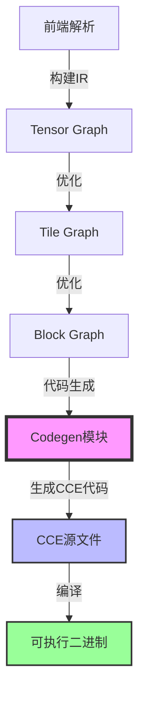

**编译阶段职责：**

| 编译阶段 | Codegen 模块职责 | 关键组件 |
|---------|-----------------|---------|
| **IR 输入** | 接收优化后的 Block Graph | `Function`、`Operation` |
| **符号管理** | 管理张量符号和变量名 | `SymbolManager`、`TileTensor` |
| **代码生成** | 生成 CCE 操作代码 | `CodeGenOp`、`CodeGenOpCloudNPU` |
| **函数生成** | 生成完整的 CCE 函数 | `CodeGenCloudNPU` |
| **编译** | 编译 CCE 代码为二进制 | `CompileCCE()` |

### 类图

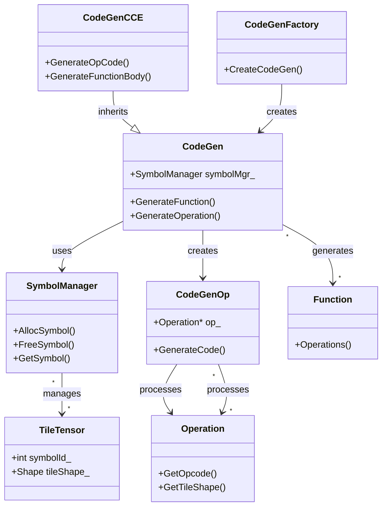

### 代码生成流程概览

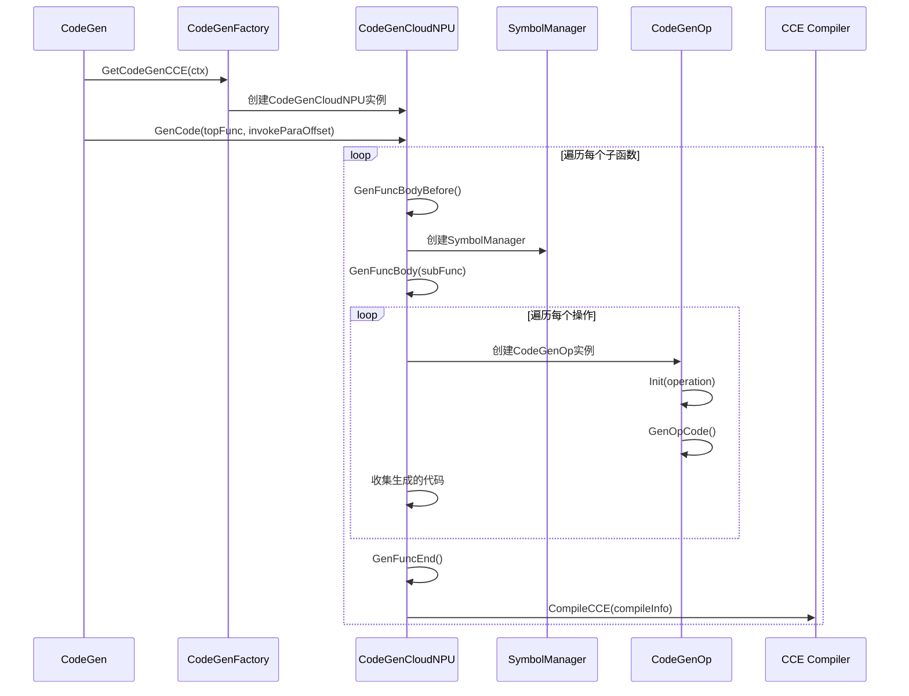

---

## 模块组织

### 模块结构

根据 [`CMakeLists.txt`](../../../framework/src/codegen/CMakeLists.txt)，`codegen` 模块包含以下子模块：

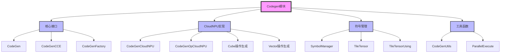

### 模块分类

#### 1. 核心接口模块

**功能概述：** 定义代码生成的抽象接口和工厂类。

**核心组件：**

- **`CodeGen`**：代码生成入口类
  - **文件位置**：[`codegen.h`](../../../framework/src/codegen/codegen.h)
  - **功能**：提供统一的代码生成接口，隐藏底层实现细节

- **`CodeGenCCE`**：CCE 代码生成基类
  - **文件位置**：[`codegen_cce.h`](../../../framework/src/codegen/codegen_cce.h)
  - **功能**：定义 CCE 代码生成的抽象接口

- **`CodeGenFactory`**：代码生成工厂类
  - **文件位置**：[`codegen_factory.h`](../../../framework/src/codegen/codegen_factory.h)
  - **功能**：根据平台类型创建相应的代码生成器

#### 2. CloudNPU 实现模块

**功能概述：** 实现 CloudNPU 平台的代码生成。

**核心组件：**

- **`CodeGenCloudNPU`**：CloudNPU 代码生成器
  - **文件位置**：[`cloudnpu/codegen_cloudnpu.h`](../../../framework/src/codegen/cloudnpu/codegen_cloudnpu.h)
  - **功能**：生成 CloudNPU 平台的 CCE 代码

- **`CodeGenOpCloudNPU`**：CloudNPU 操作代码生成器
  - **文件位置**：[`cloudnpu/codegen_op_cloudnpu.h`](../../../framework/src/codegen/cloudnpu/codegen_op_cloudnpu.h)
  - **功能**：生成单个操作的 CCE 代码

#### 3. 符号管理模块

**功能概述：** 管理代码生成过程中的符号和变量名。

**核心组件：**

- **`SymbolManager`**：符号管理器
  - **文件位置**：[`symbol_mgr/codegen_symbol.h`](../../../framework/src/codegen/symbol_mgr/codegen_symbol.h)
  - **功能**：管理张量符号、变量名、TileTensor 等

- **`TileTensor`**：Tile 张量结构
  - **功能**：表示 CCE 代码中的 Tile 张量对象

#### 4. 工具函数模块

**功能概述：** 提供代码生成过程中的工具函数。

**核心组件：**

- **`CodeGenUtils`**：代码生成工具函数
  - **文件位置**：[`utils/codegen_utils.h`](../../../framework/src/codegen/utils/codegen_utils.h)
  - **功能**：提供字符串格式化、类型转换等工具函数

- **`ParallelExecute`**：并行执行工具
  - **文件位置**：[`utils/parallel_execute.h`](../../../framework/src/codegen/utils/parallel_execute.h)
  - **功能**：支持并行编译多个子函数

---

## 核心概念与数据结构

### CodeGenCtx（代码生成上下文）

**定义位置：** [`codegen_common.h`](../../../framework/src/codegen/codegen_common.h#L113)

**功能概述：** 存储代码生成所需的上下文信息。

**数据结构：**

```cpp
struct CodeGenCtx {
    std::string includePath = "";  // 头文件路径
    std::string cceDir = "";       // CCE 代码输出目录
    
    bool IsCCEPathEmpty() const { return cceDir.empty(); }
    bool IsIncludePathEmpty() const { return includePath.empty(); }
};
```

**关键概念：**

- **`includePath`**：头文件路径
  - **用途**：指定 CCE 代码中需要包含的头文件路径
  - **设置**：通过构造函数或配置管理器设置
  - **使用**：在生成 `#include` 语句时使用

- **`cceDir`**：CCE 代码输出目录
  - **用途**：指定生成的 CCE 源文件和二进制文件的输出目录
  - **默认值**：如果为空，会自动创建 `./kernel_aicore` 目录
  - **设置**：通过 `PrepareDefaultOutputPath()` 自动设置

### CompileInfo（编译信息）

**定义位置：** [`cloudnpu/codegen_cloudnpu.h`](../../../framework/src/codegen/cloudnpu/codegen_cloudnpu.h#L31)

**功能概述：** 存储单个子函数的编译信息，包括文件路径、内核名称等。

**关键成员变量：**

- **`cceFileName_`**：CCE 文件名
  - **格式**：`{topFuncName}_{hash}_{programId}_{coreType}.cpp`
  - **示例**：`func_abc123_0_aic.cpp`
  - **生成**：通过 `Init()` 方法生成

- **`cceAbsPath_`**：CCE 源文件绝对路径
  - **格式**：`{cceDir}/{cceFileName_}.cpp`
  - **用途**：用于写入生成的 CCE 代码

- **`binAbsPath_`**：二进制文件绝对路径
  - **格式**：`{cceDir}/{cceFileName_}.o`
  - **用途**：存储编译后的二进制文件

- **`kernelName_`**：内核函数名称
  - **格式**：由函数名和哈希值组成
  - **用途**：作为 CCE 函数的主函数名

- **`isCube_`**：是否为 Cube 操作
  - **类型**：`bool`
  - **用途**：区分 Cube 操作和 Vector 操作，影响代码生成策略

- **`isUnderDyn_`**：是否在动态函数下
  - **类型**：`bool`
  - **用途**：影响参数类型和代码生成方式

### TileTensor（Tile 张量）

**定义位置：** [`symbol_mgr/codegen_symbol.h`](../../../framework/src/codegen/symbol_mgr/codegen_symbol.h#L48)

**功能概述：** 表示 CCE 代码中的 Tile 张量对象，封装了张量的类型、形状、步长等信息。

**关键成员变量：**

- **`magic`**：张量魔法数
  - **类型**：`int`
  - **用途**：唯一标识一个张量

- **`dim`**：张量维度
  - **类型**：`int`
  - **用途**：张量的维度数

- **`dtype`**：数据类型
  - **类型**：`DataType`
  - **用途**：张量的数据类型（如 FP32、FP16、INT8 等）

- **`bufType`**：缓冲区类型
  - **类型**：`BufferType`（即 `OperandType`）
  - **用途**：张量所在的缓冲区类型（如 UB、L1、DDR 等）

- **`bufVar`**：缓冲区变量名
  - **类型**：`std::string`
  - **用途**：缓冲区在 CCE 代码中的变量名（如 `UB_S0_E16384`）
  - **生成规则**：
    - **格式**：`{BufferType}_{Start}_{End}`
    - **示例**：
      - `UB_S0_E16384`：UB 缓冲区，起始地址 0，结束地址 16384
      - `L1_S16384_E32768`：L1 缓冲区，起始地址 16384，结束地址 32768
      - `GET_PARAM_ADDR(param, idx)`：DDR 缓冲区，通过参数获取地址
  - **查询**：通过 `SymbolManager::QueryVariableName()` 或 `QueryVariableNameTileTensor()` 查询
  - **绑定**：通过 `SymbolManager::BindAddrWithVariableName()` 绑定

- **`tensorName`**：张量变量名
  - **类型**：`std::string`
  - **用途**：TileTensor 对象在 CCE 代码中的变量名（如 `ubTile_0`）

- **`shape`**：有效形状
  - **类型**：`std::vector<std::string>`
  - **用途**：张量的有效形状，支持符号变量（如 `["sym_18_dim_0", "sym_18_dim_1"]`）

- **`stride`**：步长
  - **类型**：`std::vector<std::string>`
  - **用途**：张量的步长，支持符号变量

- **`rawShape`**：原始形状
  - **类型**：`std::vector<int64_t>`
  - **用途**：张量的原始形状（内存布局形状）

- **`isStatic`**：是否为静态形状
  - **类型**：`bool`
  - **用途**：区分静态形状和动态形状，影响代码生成方式

**关键方法：**

- **`GenInitParam()`**：生成初始化参数
  - **功能**：生成 TileTensor 对象的初始化参数
  - **示例**：
    ```cpp
    // DDR 张量
    "((__gm__ float*)GET_PARAM_ADDR(...), DynLayout2Dim(Shape2Dim<int, int>(sym_18_dim_0, sym_18_dim_1), Stride2Dim<int, int>(64, 1)))"
    
    // 局部缓冲区张量
    "((uint64_t)UB_S0_E16384, Shape2Dim(sym_18_dim_0, sym_18_dim_1))"
    ```

- **`ToString()`**：转换为字符串
  - **功能**：生成 TileTensor 对象的声明和初始化代码
  - **示例**：
    ```cpp
    "UBTileTensorFP32Dim2 ubTile_0((uint64_t)UB_S0_E16384, Shape2Dim(sym_18_dim_0, sym_18_dim_1));\n"
    ```

### SymbolManager（符号管理器）

**定义位置：** [`symbol_mgr/codegen_symbol.h`](../../../framework/src/codegen/symbol_mgr/codegen_symbol.h#L193)

**功能概述：** 管理代码生成过程中的符号和变量名，包括缓冲区变量名、TileTensor 对象等。

**关键数据结构：**

- **`key2VariableName_`**：AllocKey 到变量名的映射
  - **类型**：`std::map<AllocKey, std::string>`
  - **用途**：存储缓冲区分配键到变量名的映射
  - **AllocKey**：`std::tuple<BufferType, int64_t, int64_t>`（缓冲区类型、范围起始、范围结束）

- **`key2VariableNameTileTensor_`**：AllocKey 到 TileTensor 变量名的映射
  - **类型**：`std::map<AllocKey, std::string>`
  - **用途**：存储缓冲区分配键到 TileTensor 变量名的映射

- **`tensorMap_`**：魔法数到 LogicalTensor 的映射
  - **类型**：`std::unordered_map<int, std::shared_ptr<LogicalTensor>>`
  - **用途**：存储魔法数到 LogicalTensor 的映射，用于查询张量信息

- **`tileTensor_`**：TileTensor 到变量名的映射
  - **类型**：`std::unordered_map<TileTensor, std::string, TileTensorHash>`
  - **用途**：存储 TileTensor 对象到变量名的映射，用于去重

- **`tileTensorByMagic_`**：魔法数到 TileTensor 变量名的映射
  - **类型**：`std::unordered_map<int, std::string>`
  - **用途**：快速查询魔法数对应的 TileTensor 变量名

- **`tileTensorUsing_`**：using 类型到 TileTensorUsing 的映射
  - **类型**：`std::unordered_map<std::string, TileTensorUsing>`
  - **用途**：存储 TileTensor 的 using 类型定义

**关键方法：**

- **`QueryVariableName()`**：查询变量名
  - **功能**：根据 AllocKey 查询缓冲区变量名
  - **参数**：`AllocKey`（缓冲区分配键）
  - **返回**：`std::string`（变量名）

- **`QueryVarNameByTensorMagic()`**：根据魔法数查询变量名
  - **功能**：根据张量魔法数查询变量名
  - **参数**：`magic`（魔法数）、`isTileTensor`（是否为 TileTensor）
  - **返回**：`std::string`（变量名）

- **`AddTileTensor()`**：添加 TileTensor
  - **功能**：添加 TileTensor 对象到管理器
  - **参数**：`TileTensor`（TileTensor 对象）
  - **功能**：自动去重，相同的 TileTensor 只生成一次

- **`GenUsingList()`**：生成 using 列表
  - **功能**：生成所有 TileTensor 的 using 类型定义
  - **返回**：`std::string`（using 列表代码）

- **`GenTileTensorDefList()`**：生成 TileTensor 定义列表
  - **功能**：生成所有 TileTensor 对象的声明和初始化代码
  - **返回**：`std::string`（TileTensor 定义列表代码）

### OperandType（操作数类型）

**定义位置：** [`codegen_common.h`](../../../framework/src/codegen/codegen_common.h#L66)

**功能概述：** 定义操作数的缓冲区类型，用于区分不同的内存层级。

**类型映射：**

| OperandType | 地址类型前缀 | 缓冲区前缀 | 说明 |
|------------|------------|-----------|------|
| `BUF_DDR` | `__gm__` | `GM` | 全局内存（DDR） |
| `BUF_UB` | `__ubuf__` | `UB` | 统一缓冲区（UB） |
| `BUF_L1` | `__cbuf__` | `L1` | L1 缓冲区 |
| `BUF_L0A` | `__ca__` | `L0A` | L0A 缓冲区（Cube 输入 A） |
| `BUF_L0B` | `__cb__` | `L0B` | L0B 缓冲区（Cube 输入 B） |
| `BUF_L0C` | `__cc__` | `L0C` | L0C 缓冲区（Cube 输出 C） |
| `BUF_FIX` | `__fbuf__` | `FBUF` | 固定缓冲区 |
| `BUF_BT` | `__cc__` | `BIAS` | 偏置缓冲区 |

**关键概念：**

- **地址类型前缀**：用于 CCE 代码中的指针类型声明
  - **示例**：`__gm__ float*`、`__ubuf__ float*`
  - **用途**：告诉编译器指针指向的内存类型

- **缓冲区前缀**：用于生成变量名和类型名
  - **示例**：`UBTileTensorFP32Dim2`、`GMTensorInfo`
  - **用途**：区分不同类型的缓冲区

---

## 代码生成流程

### 整体流程

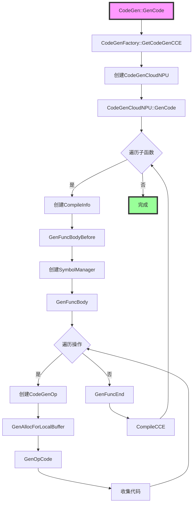

### 详细流程说明

#### 1. 初始化阶段

**入口：** `CodeGen::GenCode()`

```cpp
void CodeGen::GenCode(Function &topFunc, const std::map<uint64_t, std::list<InvokeParaOffset>> &invokeParaOffset) {
    ASSERT(topFunc.rootFunc_ != nullptr) << "rootFunc can not be nullptr";
    
    // 1. 通过工厂类获取代码生成器
    auto cg = CodeGenFactory::GetCodeGenCCE(ctx_);
    
    // 2. 调用代码生成器的 GenCode 方法
    cg->GenCode(topFunc, invokeParaOffset);
}
```

**关键步骤：**

1. **验证输入**：检查 `topFunc.rootFunc_` 不为空
2. **获取代码生成器**：通过 `CodeGenFactory::GetCodeGenCCE()` 根据平台类型获取相应的代码生成器
3. **执行代码生成**：调用代码生成器的 `GenCode()` 方法

**关键概念：**

- **`topFunc`**：顶层函数，包含所有子函数
  - **结构**：`topFunc.rootFunc_->programs_` 包含所有子函数
  - **用途**：作为代码生成的入口

- **`invokeParaOffset`**：调用参数偏移映射
  - **类型**：`std::map<uint64_t, std::list<InvokeParaOffset>>`
  - **键**：子函数 ID
  - **值**：参数偏移列表
  - **用途**：用于生成函数调用时的参数传递代码

#### 2. 工厂类创建代码生成器

**入口：** `CodeGenFactory::GetCodeGenCCE()`

```cpp
static std::shared_ptr<CodeGenCCE> GetCodeGenCCE(const CodeGenCtx &ctx) {
    // 1. 获取平台架构
    auto platform = Platform::Instance().GetSoc().GetNPUArch();
    
    // 2. 根据平台类型创建相应的代码生成器
    if (platform == NPUArch::DAV_2201 || platform == NPUArch::DAV_3510) {
        return std::make_shared<CodeGenCloudNPU>(ctx);
    }
    
    ASSERT(false) << "can not support this platform";
    return nullptr;
}
```

**关键概念：**

- **平台架构**：通过 `Platform::Instance().GetSoc().GetNPUArch()` 获取
  - **支持平台**：`DAV_2201`、`DAV_3510`（CloudNPU）
  - **扩展性**：可以添加其他平台的代码生成器

#### 3. 代码生成主流程

**入口：** `CodeGenCloudNPU::GenCode()`

```cpp
void CodeGenCloudNPU::GenCode(
    Function &topFunc, const std::map<uint64_t, std::list<InvokeParaOffset>> &invokeParaOffset) {
    // 1. 创建任务队列
    std::deque<std::function<void(void)>> tasks;
    
    // 2. 为每个子函数创建代码生成任务
    for (auto &subFuncPair : topFunc.rootFunc_->programs_) {
        std::function task = [this, subFuncPair, &topFunc]() {
            auto subFunc = subFuncPair.second;
            
            // 2.1 处理 AICPU 子函数
            if (HandleForAICpuSubFunc(*subFunc)) {
                return;
            }
            
            // 2.2 创建编译信息
            bool isCube = subFunc->IsCube();
            CompileInfo compileInfo(topFunc, ctx.cceDir, subFuncPair, isCube, subFunc->IsUnderDynamicFunction());
            
            // 2.3 生成函数体
            std::ostringstream leafKernelFunc;
            leafKernelFunc << GenFuncBodyBefore(subFuncPair, topFunc, compileInfo);
            leafKernelFunc << GenFuncBody(*subFunc, topFunc);
            leafKernelFunc << GenFuncEnd();
            
            // 2.4 编译 CCE 代码
            #ifdef BUILD_WITH_CANN
            if (config::GetRuntimeOption<int64_t>(CFG_RUN_MODE) != CFG_RUN_MODE_SIM) {
                DumpCCE(compileInfo.GetCCEAbsPath(), leafKernelFunc.str());
                DoCompileCCE(compileInfo, "");
            }
            #endif
            
            // 2.5 更新子函数信息
            UpdateSubFunc(subFuncPair, compileInfo);
        };
        tasks.push_back(task);
    }
    
    // 3. 并行执行代码生成任务
    unsigned threadNum = ConfigManager::Instance().GetCodeGenConfig(KEY_PARALLEL_COMPILE, 1u);
    ParallelExecuteAndWait(threadNum, tasks);
}
```

**关键步骤：**

1. **创建任务队列**：为每个子函数创建代码生成任务
2. **生成函数体**：
   - `GenFuncBodyBefore()`：生成函数体前部分（include、using、函数声明等）
   - `GenFuncBody()`：生成函数体主体（操作代码）
   - `GenFuncEnd()`：生成函数体结束部分
3. **编译 CCE 代码**：如果启用编译，调用 `DoCompileCCE()` 编译生成的代码
4. **并行执行**：使用 `ParallelExecuteAndWait()` 并行执行多个子函数的代码生成

**关键概念：**

- **子函数（Sub Function）**：`topFunc.rootFunc_->programs_` 中的每个子函数
  - **类型**：`std::pair<uint64_t, Function*>`
  - **键**：子函数 ID（program ID）
  - **值**：子函数指针
  - **用途**：每个子函数对应一个独立的 CCE 源文件

- **并行编译**：支持并行编译多个子函数
  - **配置**：通过 `KEY_PARALLEL_COMPILE` 配置线程数
  - **实现**：使用 `ParallelExecuteAndWait()` 实现
  - **优势**：提高编译效率，特别是对于包含多个子函数的大型模型

---

## 关键组件详解

### CodeGen 类

**文件位置：** [`codegen.h`](../../../framework/src/codegen/codegen.h), [`codegen.cpp`](../../../framework/src/codegen/codegen.cpp)

**功能概述：** 代码生成的入口类，提供统一的代码生成接口。

**类定义：**

```cpp
class CodeGen {
public:
    CodeGen() = default;
    explicit CodeGen(const CodeGenCtx &ctx) : ctx_(ctx.includePath, ctx.cceDir) {};
    
    void GenCode(Function &topFunc, const std::map<uint64_t, std::list<InvokeParaOffset>> &invokeParaOffset);
    void GenCode(const std::string &jsonPath, const std::map<uint64_t, std::list<InvokeParaOffset>> &invokeParaOffset);
    
private:
    CodeGenCtx ctx_;
};
```

**关键方法：**

- **`GenCode(Function&, ...)`**：从 Function 对象生成代码
  - **功能**：接收优化后的 Function 对象，生成 CCE 代码
  - **参数**：
    - `topFunc`：顶层函数对象
    - `invokeParaOffset`：调用参数偏移映射
  - **实现位置**：[`codegen.cpp`](../../../framework/src/codegen/codegen.cpp#L20)

- **`GenCode(string, ...)`**：从 JSON 文件生成代码
  - **功能**：从 JSON 文件加载 Function 对象，然后生成代码
  - **参数**：
    - `jsonPath`：JSON 文件路径
    - `invokeParaOffset`：调用参数偏移映射
  - **用途**：支持从序列化的 IR 文件生成代码

### CodeGenCloudNPU 类

**文件位置：** [`cloudnpu/codegen_cloudnpu.h`](../../../framework/src/codegen/cloudnpu/codegen_cloudnpu.h), [`cloudnpu/codegen_cloudnpu.cpp`](../../../framework/src/codegen/cloudnpu/codegen_cloudnpu.cpp)

**功能概述：** CloudNPU 平台的代码生成器，负责生成 CloudNPU 平台的 CCE 代码。

**类定义：**

```cpp
class CodeGenCloudNPU : public CodeGenCCE {
public:
    explicit CodeGenCloudNPU(const CodeGenCtx &cgCtx) : CodeGenCCE(cgCtx) {
        platform_ = Platform::Instance().GetSoc().GetNPUArch();
    };
    
    void GenCode(Function &topFunc, const std::map<uint64_t, std::list<InvokeParaOffset>> &invokeParaOffset) override;
    
    std::pair<int, std::string> CompileCCE(const CompileInfo &compileInfo, const std::string &compileOptions) const;
    
private:
    std::string GenFuncBodyBefore(const std::pair<uint64_t, Function *> &subFuncPair, Function &topFunc, CompileInfo &compileInfo) const;
    std::string GenFuncBody(Function &subFunc, Function &topFunc) const;
    static std::string GenFuncEnd();
    void DoCompileCCE(const CompileInfo &compileInfo, const std::string &compileOptions) const;
    
    NPUArch platform_;
};
```

**关键方法详解：**

- **`GenFuncBodyBefore()`**：生成函数体前部分
  ```cpp
  std::string CodeGenCloudNPU::GenFuncBodyBefore(
      const std::pair<uint64_t, Function *> &subFuncPair, Function &topFunc, CompileInfo &compileInfo) const {
      std::ostringstream oss;
      
      // 1. 生成 include 语句
      oss << GenInclude();
      
      // 2. 生成函数注释
      oss << GenCommentBeforeFuncHeader(*subFuncPair.second);
      
      // 3. 生成函数声明
      oss << GenFuncHeader(subFuncPair.first, topFunc, compileInfo);
      
      return oss.str();
  }
  ```
  - **功能**：生成函数体的前部分，包括 include、using、函数声明等
  - **关键步骤**：
    1. **生成 include 语句**：包含必要的头文件
    2. **生成函数注释**：添加函数说明注释
    3. **生成函数声明**：生成函数签名

- **`GenFuncBody()`**：生成函数体主体
  ```cpp
  std::string CodeGenCloudNPU::GenFuncBody(Function &subFunc, Function &topFunc) const {
      // 1. 获取操作列表
      OperationsViewer operationList = subFunc.Operations(false);
      
      // 2. 创建符号管理器
      std::shared_ptr<SymbolManager> symbolMgr = std::make_shared<SymbolManager>();
      
      // 3. 生成参数映射
      auto locToOffsetMap = GenRealizeIdMap(subFunc.GetParameter());
      
      // 4. 初始化浮点饱和状态
      FloatSaturateStatus fs;
      
      // 5. 遍历操作，生成代码
      std::string allocSourceRegion;
      std::string tileOpSourceRegion;
      for (const auto &op : operationList) {
          // 5.1 跳过不需要生成代码的操作
          if (SKIP_OPCODE.find(op.GetOpcode()) != SKIP_OPCODE.end()) {
              continue;
          }
          
          // 5.2 生成本地缓冲区分配代码
          std::string allocSourceCode = GenAllocForLocalBuffer(op, symbolMgr);
          
          // 5.3 创建操作代码生成器
          CodeGenOpCloudNPU cop({symbolMgr, topFunc, subFunc, op, locToOffsetMap});
          
          // 5.4 更新浮点饱和状态
          cop.UpdateSaturateStatus(fs);
          
          // 5.5 生成操作代码
          std::string tileOpSourceCode = cop.GenOpCode();
          
          // 5.6 收集生成的代码
          allocSourceRegion += allocSourceCode;
          for (auto &c : op.GetCommentList()) {
              tileOpSourceRegion += "/*" + c + "*/\n";
          }
          tileOpSourceRegion += tileOpSourceCode;
      }
      
      // 6. 生成完整的函数体
      std::ostringstream oss;
      oss << GenLimitValue(fs) << "\n";
      oss << symbolMgr->GenUsingList() << "\n";
      oss << symbolMgr->GenTileTensorDefList() << "\n";
      oss << allocSourceRegion << "\n";
      oss << tileOpSourceRegion << "\n";
      
      return oss.str();
  }
  ```
  - **功能**：生成函数体的主体部分，包括操作代码、缓冲区分配等
  - **关键步骤**：
    1. **创建符号管理器**：用于管理变量名和 TileTensor
    2. **遍历操作**：为每个操作生成代码
    3. **生成分配代码**：生成本地缓冲区的分配代码
    4. **生成操作代码**：生成每个操作的 CCE 代码
    5. **收集代码**：将所有生成的代码收集起来
    6. **生成完整函数体**：包括 using 列表、TileTensor 定义、分配代码、操作代码

- **`GenFuncEnd()`**：生成函数体结束部分
  ```cpp
  static std::string GenFuncEnd() {
      return "}\n";
  }
  ```
  - **功能**：生成函数体的结束部分（右大括号）

- **`DoCompileCCE()`**：编译 CCE 代码
  ```cpp
  void CodeGenCloudNPU::DoCompileCCE(const CompileInfo &compileInfo, const std::string &compileOptions) const {
      // 1. 构建编译选项
      std::string fullCompileOptions = BuildCompileOptions(compileInfo, compileOptions);
      
      // 2. 执行编译命令
      std::string compileCmd = "ccec " + fullCompileOptions + " " + compileInfo.GetCCEAbsPath();
      int ret = system(compileCmd.c_str());
      
      // 3. 检查编译结果
      if (ret != 0) {
          ALOG_ERROR_F("Compile CCE code failed: %s", compileCmd.c_str());
      }
  }
  ```
  - **功能**：编译生成的 CCE 代码为二进制文件
  - **关键步骤**：
    1. **构建编译选项**：包括 include 路径、LLVM 参数等
    2. **执行编译命令**：调用 `ccec` 编译器
    3. **检查编译结果**：验证编译是否成功

### CodeGenOp 类

**文件位置：** [`codegen_op.h`](../../../framework/src/codegen/codegen_op.h), [`codegen_op.cpp`](../../../framework/src/codegen/codegen_op.cpp)

**功能概述：** 操作代码生成基类，负责从 Operation 对象提取信息并生成 CCE 操作代码。

**类定义：**

```cpp
class CodeGenOp {
public:
    CodeGenOp(const std::shared_ptr<SymbolManager> &symbolManager, FunctionType funcType,
        const std::map<int, int> &locToOffset = {}, bool isUnderDynamicFunc = false);
    
    virtual void Init(const Operation &ops);
    virtual std::string GenOpCode() const = 0;
    
protected:
    std::string GenOpAttr(bool hasExistingParam = true) const;
    
    // 操作信息
    Opcode opCode{Opcode::OP_UNKNOWN};
    std::string opCodeStr;
    std::string aliasOp;
    
    // 操作数信息
    int operand[MAX_OPERANDS] = {};  // 缓冲区 ID
    OperandType operandType[MAX_OPERANDS] = {};
    DataType operandDtype[MAX_OPERANDS] = {};
    std::vector<int64_t> offset[MAX_OPERANDS] = {};
    std::vector<int64_t> shape[MAX_OPERANDS] = {};
    std::vector<int64_t> rawShape[MAX_OPERANDS] = {};
    std::vector<SymbolicScalar> dynamicValidShape[MAX_OPERANDS] = {};
    
    // 符号管理器
    std::shared_ptr<SymbolManager> sm{nullptr};
    
    // 函数类型
    const FunctionType functionType;
    const std::map<int, int> &paramLocToParamListOffset{};
    bool isUnderDynamicFunction{false};
};
```

**关键方法详解：**

- **`Init()`**：初始化操作信息
  ```cpp
  void CodeGenOp::Init(const Operation &ops) {
      // 1. 获取操作码
      opCode = ops.GetOpcode();
      opCodeStr = ops.GetOpcodeStr();
      
      // 2. 更新 Tile 操作信息
      UpdateTileOpInfo(ops);
      
      // 3. 处理输入操作数
      operandCnt = 0;
      for (size_t i = 0; i < ops.GetIOperands().size(); ++i) {
          auto tensor = ops.GetIOperands()[i];
          UpdateCodegenOpInfoByTensor(ops, true, tensor, operandCnt, i);
          operandCnt++;
      }
      
      // 4. 处理输出操作数
      for (size_t i = 0; i < ops.GetOOperands().size(); ++i) {
          auto tensor = ops.GetOOperands()[i];
          UpdateCodegenOpInfoByTensor(ops, false, tensor, operandCnt, i);
          operandCnt++;
      }
      
      // 5. 更新标量值
      UpdateScalarValue(ops);
      
      // 6. 更新操作属性
      UpdateOpAttribute(ops);
      
      // 7. 获取 GM 参数索引
      GetGmParamIdx(ops);
  }
  ```
  - **功能**：从 Operation 对象提取信息，初始化 CodeGenOp 的成员变量
  - **关键步骤**：
    1. **获取操作码**：提取操作类型
    2. **更新 Tile 操作信息**：获取 Tile 操作名称
    3. **处理输入操作数**：提取输入张量的信息（形状、偏移、类型等）
    4. **处理输出操作数**：提取输出张量的信息
    5. **更新标量值**：提取操作的标量参数
    6. **更新操作属性**：提取操作的属性信息
    7. **获取 GM 参数索引**：处理全局内存参数

- **`UpdateCodegenOpInfoByTensor()`**：更新操作数信息
  ```cpp
  void CodeGenOp::UpdateCodegenOpInfoByTensor(const Operation &ops, bool isInput, 
      const std::shared_ptr<LogicalTensor> &tensor, int &operandIdx, size_t ioIdx) {
      // 1. 查询变量名
      operand[operandIdx] = sm->QueryVarNameByTensorMagic(tensor->GetMagic(), false);
      
      // 2. 更新形状
      UpdateShape(ops, *tensor, operandIdx, isInput, ioIdx);
      
      // 3. 更新偏移
      if (isInput) {
          UpdateOffsetForInput(ops, *tensor, operandIdx);
      } else {
          UpdateOffsetForOutput(ops, *tensor, operandIdx);
      }
      
      // 4. 更新操作数类型
      operandType[operandIdx] = OPERAND_TYPE_TO_MEMORY_TYPE.at(tensor->GetMemoryType());
      operandDtype[operandIdx] = tensor->tensor->datatype;
      
      // 5. 更新参数位置
      paramLocation[operandIdx] = tensor->GetParamLocation();
  }
  ```
  - **功能**：从 LogicalTensor 提取信息，更新操作数的相关信息
  - **关键步骤**：
    1. **查询变量名**：通过 SymbolManager 查询张量的变量名
    2. **更新形状**：提取张量的形状信息
    3. **更新偏移**：提取张量的偏移信息
    4. **更新操作数类型**：根据内存类型确定操作数类型
    5. **更新参数位置**：记录参数在参数列表中的位置

- **`UpdateShape()`**：更新形状信息
  ```cpp
  void CodeGenOp::UpdateShape(const Operation &oper, const LogicalTensor &logicalTensor, 
      int operandIdx, bool isInput, size_t ioIdx) {
      // 1. 更新原始形状
      rawShape[operandIdx] = logicalTensor.tensor->rawshape;
      originShape[operandIdx] = logicalTensor.oriShape;
      
      // 2. 更新动态有效形状
      if (isDynamicFunction) {
          dynamicValidShape[operandIdx] = logicalTensor.GetDynValidShape();
      }
      
      // 3. 确定使用的形状
      Opcode opcode = oper.GetOpcode();
      bool useAttrForGM = IsCopyOpWithShapeOffsetAttr(opcode);
      
      if (!useAttrForGM || logicalTensor.GetMemoryTypeOriginal() != MEM_DEVICE_DDR) {
          // 局部张量直接使用 LogicalTensor 的形状
          shape[operandIdx] = logicalTensor.shape;
      } else {
          // GM 张量使用 CopyOpAttribute 中指定的形状
          std::shared_ptr<CopyOpAttribute> attr = 
              std::static_pointer_cast<CopyOpAttribute>(oper.GetOpAttribute());
          shape[operandIdx] = attr->GetSpecifiedShape(1);
      }
      
      // 4. 合并轴（如果需要）
      CombineAxis(oper, operandIdx, isInput, ioIdx);
  }
  ```
  - **功能**：更新操作数的形状信息
  - **关键概念**：
    - **原始形状（rawShape）**：张量在内存中的实际形状
    - **有效形状（shape）**：张量的逻辑形状
    - **动态有效形状（dynamicValidShape）**：动态形状的有效形状
    - **轴合并（CombineAxis）**：根据操作属性合并某些维度

### CodeGenOpCloudNPU 类

**文件位置：** [`cloudnpu/codegen_op_cloudnpu.h`](../../../framework/src/codegen/cloudnpu/codegen_op_cloudnpu.h)

**功能概述：** CloudNPU 平台的操作代码生成器，继承自 `CodeGenOp`，实现具体的 CCE 代码生成。

**关键方法：**

- **`GenOpCode()`**：生成操作代码
  - **功能**：根据操作类型生成相应的 CCE 代码
  - **实现**：针对不同的操作类型（Cube、Vector、Copy 等）调用相应的代码生成方法
  - **示例**：
    ```cpp
    // Matmul 操作
    "aicore::Matmul(ubTile_0, ubTile_1, ubTile_2);\n"
    
    // Vector Add 操作
    "aiv::Add(ubTile_0, ubTile_1, ubTile_2);\n"
    ```

---

## 符号管理

### SymbolManager 工作原理

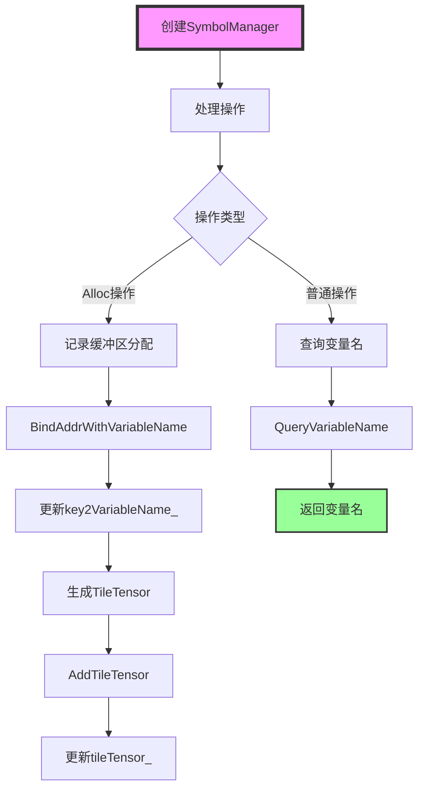

### 变量名生成规则

**缓冲区变量名：**

- **格式**：`{BufferType}_{Start}_{End}`
- **示例**：
  - `UB_S0_E16384`：UB 缓冲区，起始地址 0，结束地址 16384
  - `L1_S16384_E32768`：L1 缓冲区，起始地址 16384，结束地址 32768

**TileTensor 变量名：**

- **格式**：`{BufferType}TileTensor{DataType}Dim{Dim}_{Id}`
- **示例**：
  - `UBTileTensorFP32Dim2_0`：UB 缓冲区，FP32 类型，2 维，ID 0
  - `GMTileTensorFP16Dim4_1`：GM 缓冲区，FP16 类型，4 维，ID 1

### TileTensor 生成流程

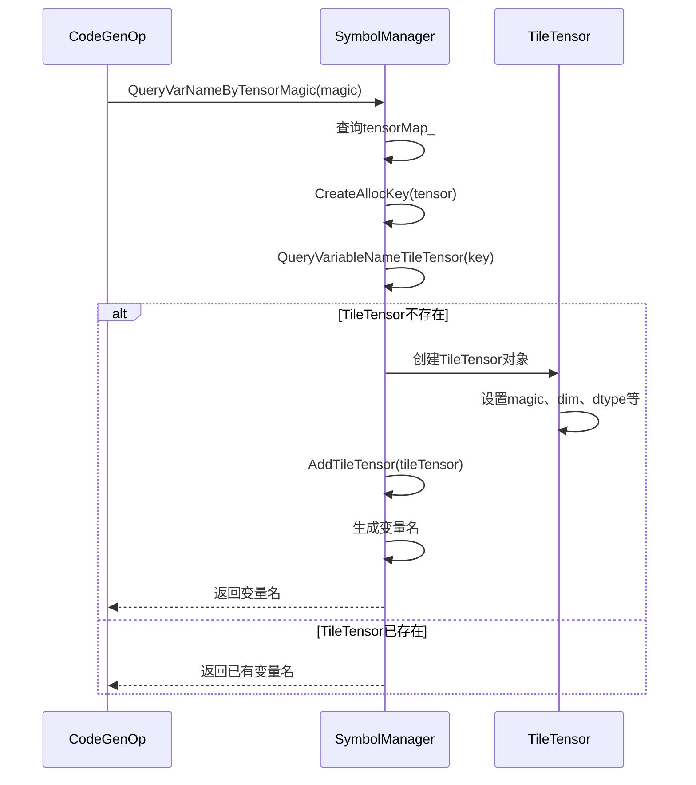

---

## 操作代码生成

### 操作代码生成流程

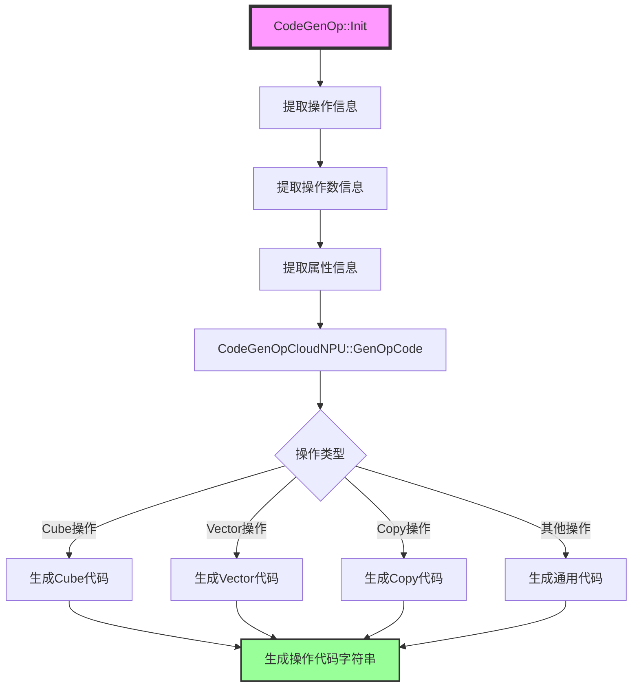

### CodeGenOpCloudNPU::GenOpCode() 详解

**文件位置：** [`cloudnpu/codegen_op_cloudnpu.cpp`](../../../framework/src/codegen/cloudnpu/codegen_op_cloudnpu.cpp)

**功能概述：** 根据操作类型生成相应的 CCE 代码。

**实现原理：**

`CodeGenOpCloudNPU` 使用操作码映射表（`mteFixPipeOps_`、`vectorOps_`、`cubeOps_` 等）将操作码映射到相应的代码生成函数。

**关键数据结构：**

- **`mteFixPipeOps_`**：MTE/FIX Pipe 操作映射表
  - **类型**：`std::unordered_map<Opcode, std::function<std::string()>>`
  - **包含操作**：Copy 操作、Gather 操作、Load 操作等
  - **用途**：将操作码映射到代码生成函数

- **`vectorOps_`**：Vector 操作映射表
  - **包含操作**：一元操作（Add、Sub、Mul、Div 等）、二元操作、标量操作等
  - **用途**：生成 Vector 操作的 CCE 代码

- **`cubeOps_`**：Cube 操作映射表
  - **包含操作**：Matmul、MatmulAcc 等
  - **用途**：生成 Cube 操作的 CCE 代码

**关键方法：**

- **`GenCubeOpMatmul()`**：生成 Matmul 操作代码
  ```cpp
  std::string CodeGenOpCloudNPU::GenCubeOpMatmul() const {
      // 1. 获取操作数变量名
      std::string src0 = QueryTileTensorByMagic(operandWithMagic[1]);
      std::string src1 = QueryTileTensorByMagic(operandWithMagic[2]);
      std::string dst = QueryTileTensorByMagic(operandWithMagic[0]);
      
      // 2. 生成 CCE 代码
      std::ostringstream oss;
      oss << "aicore::Matmul(" << src0 << ", " << src1 << ", " << dst << ");\n";
      return oss.str();
  }
  ```
  - **功能**：生成矩阵乘法的 CCE 代码
  - **生成的代码示例**：
    ```cpp
    aicore::Matmul(ubTile_0, ubTile_1, ubTile_2);
    ```

- **`GenBinaryOp()`**：生成二元操作代码
  ```cpp
  std::string CodeGenOpCloudNPU::GenBinaryOp() const {
      // 1. 获取操作数变量名
      std::string src0 = QueryTileTensorByMagic(operandWithMagic[1]);
      std::string src1 = QueryTileTensorByMagic(operandWithMagic[2]);
      std::string dst = QueryTileTensorByMagic(operandWithMagic[0]);
      
      // 2. 获取操作名称
      std::string opName = GetTileOpName(opCode);
      
      // 3. 生成 CCE 代码
      std::ostringstream oss;
      oss << "aiv::" << opName << "(" << src0 << ", " << src1 << ", " << dst << ");\n";
      return oss.str();
  }
  ```
  - **功能**：生成二元操作的 CCE 代码（如 Add、Sub、Mul、Div 等）
  - **生成的代码示例**：
    ```cpp
    aiv::Add(ubTile_0, ubTile_1, ubTile_2);
    aiv::Mul(ubTile_0, ubTile_1, ubTile_2);
    ```

- **`GenUBCopyIn()`**：生成 UB CopyIn 操作代码
  ```cpp
  std::string CodeGenOpCloudNPU::GenUBCopyIn() const {
      // 1. 获取源和目标变量名
      std::string src = QueryVarNameByTensorMagic(operandWithMagic[1], false);
      std::string dst = QueryVarNameByTensorMagic(operandWithMagic[0], false);
      
      // 2. 生成 CCE 代码
      std::ostringstream oss;
      oss << "aiv::Copy(" << src << ", " << dst << ");\n";
      return oss.str();
  }
  ```
  - **功能**：生成从全局内存拷贝到 UB 的 CCE 代码
  - **生成的代码示例**：
    ```cpp
    aiv::Copy(GM_S0_E16384, UB_S0_E16384);
    ```

### 操作代码生成示例

**Matmul 操作：**

```cpp
// 输入：两个输入张量 ubTile_0, ubTile_1，一个输出张量 ubTile_2
// 生成的代码：
"aicore::Matmul(ubTile_0, ubTile_1, ubTile_2);\n"
```

**Vector Add 操作：**

```cpp
// 输入：两个输入张量 ubTile_0, ubTile_1，一个输出张量 ubTile_2
// 生成的代码：
"aiv::Add(ubTile_0, ubTile_1, ubTile_2);\n"
```

**Copy 操作：**

```cpp
// 输入：源张量 ubTile_0，目标张量 ubTile_1
// 生成的代码：
"aiv::Copy(ubTile_0, ubTile_1);\n"
```

### 操作类型分类

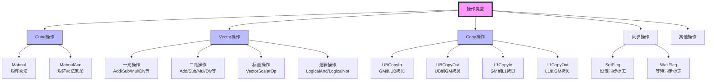

### SKIP_OPCODE（跳过的操作码）

**定义位置：** [`codegen_op.h`](../../../framework/src/codegen/codegen_op.h#L36)

**功能概述：** 定义不需要生成代码的操作码集合。

**包含的操作：**

```cpp
const std::unordered_set<Opcode> SKIP_OPCODE = {
    Opcode::OP_VIEW,           // View 操作（视图操作，不改变数据）
    Opcode::OP_ASSEMBLE,       // Assemble 操作（组装操作）
    Opcode::OP_RESHAPE,        // Reshape 操作（形状变换）
    Opcode::OP_UB_ALLOC,       // UB 分配操作
    Opcode::OP_L1_ALLOC,       // L1 分配操作
    Opcode::OP_L0A_ALLOC,      // L0A 分配操作
    Opcode::OP_L0B_ALLOC,      // L0B 分配操作
    Opcode::OP_L0C_ALLOC,      // L0C 分配操作
    Opcode::OP_FIX_ALLOC,      // FIX 分配操作
    Opcode::OP_BT_ALLOC,       // BT 分配操作
    Opcode::OP_BIND_TENSOR,    // 绑定张量操作
    Opcode::OP_NOP,            // 空操作
    Opcode::OP_HUB,            // HUB 操作
};
```

**关键概念：**

- **View 操作**：视图操作，不改变数据，只是改变数据的视图
  - **特点**：不涉及实际的数据拷贝
  - **处理**：在代码生成时跳过，因为不需要生成实际的代码

- **Assemble 操作**：组装操作，将多个数据块组装成一个
  - **特点**：在编译时已经处理，运行时不需要额外代码
  - **处理**：在代码生成时跳过

- **Alloc 操作**：分配操作，用于分配缓冲区
  - **特点**：在代码生成时单独处理，不生成操作代码
  - **处理**：通过 `GenAllocForLocalBuffer()` 单独生成分配代码

---

## 函数体生成

### 函数体结构

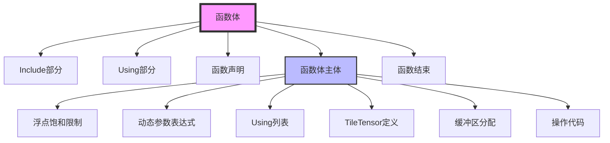

### 函数体生成详细流程

**入口：** `CodeGenCloudNPU::GenFuncBody()`

```cpp
std::string CodeGenCloudNPU::GenFuncBody(Function &subFunc, Function &topFunc) const {
    // 1. 获取操作列表
    OperationsViewer operationList = subFunc.Operations(false);
    if (operationList.IsEmpty()) {
        ALOG_ERROR("operationList is empty");
        return {};
    }
    
    // 2. 创建符号管理器
    std::shared_ptr<SymbolManager> symbolMgr = std::make_shared<SymbolManager>();
    
    // 3. 生成参数映射
    auto locToOffsetMap = GenRealizeIdMap(subFunc.GetParameter());
    
    // 4. 初始化浮点饱和状态
    FloatSaturateStatus fs;
    
    // 5. 遍历操作，生成代码
    std::string allocSourceRegion;
    std::string tileOpSourceRegion;
    for (const auto &op : operationList) {
        Opcode opcode = op.GetOpcode();
        
        // 5.1 跳过不需要生成代码的操作
        if (SKIP_OPCODE.find(opcode) != SKIP_OPCODE.end()) {
            continue;
        }
        
        // 5.2 生成本地缓冲区分配代码
        std::string allocSourceCode = GenAllocForLocalBuffer(op, symbolMgr);
        
        // 5.3 创建操作代码生成器
        CodeGenOpCloudNPU cop({symbolMgr, topFunc, subFunc, op, locToOffsetMap});
        
        // 5.4 更新浮点饱和状态
        cop.UpdateSaturateStatus(fs);
        
        // 5.5 生成操作代码
        std::string tileOpSourceCode = cop.GenOpCode();
        ASSERT(tileOpSourceCode.find("CG_ERROR") == tileOpSourceCode.npos) 
            << "gen op invalid" << op.Dump();

        // 5.6 收集代码
        allocSourceRegion += allocSourceCode;
        
        // 5.7 添加操作注释
        for (auto &c : op.GetCommentList()) {
            tileOpSourceRegion += "/*" + c + "*/\n";
        }
        tileOpSourceRegion += tileOpSourceCode;
    }
    
    // 6. 组合所有代码
    std::ostringstream oss;
    oss << GenLimitValue(fs)                    // 浮点饱和限制
        << allocSourceRegion                     // 局部缓冲区分配代码
        << GenDynParamForExpr(subFunc)           // 动态参数表达式
        << symbolMgr->GenUsingList()             // using 类型定义
        << symbolMgr->GenTileTensorDefList()     // TileTensor 定义列表
        << tileOpSourceRegion;                   // 操作代码
    
    std::string programCode = oss.str();
    return programCode;
}
```

**关键步骤说明：**

1. **获取操作列表**：通过 `subFunc.Operations(false)` 获取所有操作
2. **创建符号管理器**：为每个子函数创建独立的 `SymbolManager` 实例
3. **生成参数映射表**：通过 `GenRealizeIdMap()` 生成参数位置到参数列表偏移的映射
4. **遍历操作**：
   - **跳过操作**：跳过 `SKIP_OPCODE` 中的操作（如 `OP_VIEW`、`OP_ASSEMBLE` 等）
   - **生成分配代码**：为操作的操作数生成局部缓冲区分配代码
   - **生成操作代码**：为操作生成 CCE 代码
5. **组合代码**：按照固定顺序组合所有代码片段

**代码区域说明：**

- **`allocSourceRegion`**：局部缓冲区分配代码区域
  - **内容**：所有局部缓冲区的分配代码（如 `float __ubuf__ *UB_S0_E16384 = ...`）
  - **位置**：在函数体开头，在所有操作代码之前
  - **生成**：通过 `GenAllocForLocalBuffer()` 生成

- **`tileOpSourceRegion`**：操作代码区域
  - **内容**：所有操作的 CCE 代码（如 `aicore::Add(ubTile_0, ubTile_1, ubTile_2);`）
  - **位置**：在局部缓冲区分配代码之后
  - **生成**：通过 `CodeGenOpCloudNPU::GenOpCode()` 生成

### GenAllocForLocalBuffer（生成局部缓冲区分配代码）

**文件位置：** [`cloudnpu/codegen_cloudnpu.cpp`](../../../framework/src/codegen/cloudnpu/codegen_cloudnpu.cpp#L179)

**功能概述：** 为操作的操作数生成局部缓冲区分配代码。

**实现详解：**

```cpp
std::string CodeGenCloudNPU::GenAllocForLocalBuffer(
    const Operation &op, const std::shared_ptr<SymbolManager> &symbolMgr) const {
    std::string allocSourceCode{};
    
    // 定义生成额外分配的 Lambda 函数
    auto genExtraAllocForTensor = [this, &symbolMgr](
        const std::shared_ptr<LogicalTensor> &operand) -> std::string {
        // 检查操作数是否有分配属性
        if (HasAllocAttr(operand)) {
            ALOG_INFO_F("operand has an alloc attr, need to gen extra alloc\n%s", 
                operand->Dump().c_str());
            
            // 生成额外分配代码
            std::optional<std::string> allocCodeMaybe = GenExtraAlloc(symbolMgr, operand);
            if (allocCodeMaybe.has_value()) {
                return allocCodeMaybe.value();
            }
        }
        return "";
    };
    
    // 处理输入操作数
    for (const std::shared_ptr<LogicalTensor> &operand : op.GetIOperands()) {
        // 添加到符号管理器的张量映射
        symbolMgr->AddToTensorMap(operand->GetMagic(), operand);
        
        // 生成额外分配代码
        allocSourceCode += genExtraAllocForTensor(operand);
    }
    
    // 处理输出操作数
    for (const std::shared_ptr<LogicalTensor> &operand : op.GetOOperands()) {
        // 添加到符号管理器的张量映射
        symbolMgr->AddToTensorMap(operand->GetMagic(), operand);
        
        // 生成额外分配代码
        allocSourceCode += genExtraAllocForTensor(operand);
    }

    return allocSourceCode;
}
```

**关键概念：**

- **分配属性（Alloc Attribute）**：`LogicalTensor` 上的属性，表示需要为张量分配局部缓冲区
  - **检查**：通过 `HasAllocAttr()` 检查
  - **用途**：标识需要分配局部缓冲区的张量
  - **生成**：通过 Pass 阶段添加（如 `InferMemoryConflict` Pass）

- **额外分配（Extra Allocation）**：为具有分配属性的张量生成缓冲区分配代码
  - **生成**：通过 `GenExtraAlloc()` 生成
  - **内容**：局部缓冲区的分配代码（如 `float __ubuf__ *UB_S0_E16384 = ...`）
  - **去重**：通过 `SymbolManager` 确保相同的缓冲区只分配一次

- **符号管理器集成**：将操作数添加到符号管理器的张量映射
  - **目的**：使符号管理器能够查询操作数的信息
  - **方法**：`symbolMgr->AddToTensorMap(operand->GetMagic(), operand)`

**生成的代码示例：**

```cpp
// 为 UB 缓冲区生成分配代码
float __ubuf__ *UB_S0_E16384 = (float __ubuf__ *)get_imm(0x0); // size: 0x4000

// 为 L1 缓冲区生成分配代码
float __cbuf__ *L1_S16384_E32768 = (float __cbuf__ *)get_imm(0x4000); // size: 0x4000
```
    oss << GenLimitValue(fs) << "\n";                    // 浮点饱和限制
    oss << GenDynParamForExpr(subFunc) << "\n";          // 动态参数表达式
    oss << symbolMgr->GenUsingList() << "\n";            // Using 列表
    oss << symbolMgr->GenTileTensorDefList() << "\n";    // TileTensor 定义
    oss << allocSourceRegion << "\n";                     // 缓冲区分配
    oss << tileOpSourceRegion << "\n";                    // 操作代码
    
    return oss.str();
}
```

**关键步骤说明：**

1. **获取操作列表**：从子函数中获取所有操作
2. **创建符号管理器**：用于管理变量名和 TileTensor
3. **生成参数映射**：将参数位置映射到参数列表偏移
4. **遍历操作**：
   - 跳过不需要生成代码的操作（如 View、Assemble 等）
   - 生成本地缓冲区分配代码
   - 生成操作代码
   - 收集所有生成的代码
5. **组装函数体**：按照固定顺序组装函数体的各个部分

### 函数体各部分详解

#### 1. Include 部分

**生成方法：** `GenInclude()`

```cpp
std::string CodeGenCloudNPU::GenInclude() const {
    std::ostringstream include;
    
    // 1. 表达式融合（如果启用）
    if (config::GetCodeGenOption<bool>(CODEGEN_EXPRESSION_FUSION)) {
        uint64_t tilingKey = OpInfoManager::GetInstance().GetOpTilingKey();
        std::string expFileName = "../kernel_aicpu/expression_" + std::to_string(tilingKey) + ".h";
        include << "#define __TILE_FWK_AICORE__ 1\n";
        include << "#include \"" << expFileName << "\"\n";
    }
    
    // 2. 包含 TileOpImpl.h
    include << "#include \"TileOpImpl.h\"\n\n";
    
    return include.str();
}
```

**生成的代码示例：**

```cpp
#include "TileOpImpl.h"
```

#### 2. 函数声明部分

**生成方法：** `GenFuncHeader()`

```cpp
std::string CodeGenCloudNPU::GenFuncHeader(uint64_t programId, Function &topFunc, CompileInfo &compileInfo) const {
    std::ostringstream funcHeader;
    
    // 1. 函数声明前缀
    funcHeader << "extern \"C\" [aicore] void ";
    
    // 2. 内核函数名
    auto kernelName = GenKernelName(topFunc, programId);
    compileInfo.SetKernelName(kernelName);
    funcHeader << kernelName;
    
    // 3. 函数参数
    std::string paramType = GetParamType(topFunc, compileInfo.isUnderDyn());
    funcHeader << "(" << paramType << "* param, int64_t GMStackBase, "
               << "__gm__ int64_t *hcclContext, __gm__ GMTensorInfo* oriAddrParam)";
    
    // 4. 保存函数声明
    auto funcDec = funcHeader.str() + ";";
    compileInfo.SetFuncDeclare(funcDec);
    
    // 5. 函数体开始
    funcHeader << " {\n";
    
    return funcHeader.str();
}
```

**生成的代码示例：**

```cpp
extern "C" [aicore] void func_abc123_0_aic(
    __gm__ GMTensorInfo* param, int64_t GMStackBase, 
    __gm__ int64_t *hcclContext, __gm__ GMTensorInfo* oriAddrParam) {
```

**关键概念：**

- **内核函数名**：由函数名、哈希值、程序 ID、Tiling Key 组成
  - **格式**：`{funcName}_{hash}_{programId}_{tilingKey}`
  - **示例**：`func_abc123_0_12345`

- **参数类型**：
  - **静态函数**：`__gm__ GMTensorInfo*`
  - **动态函数**：`CoreFuncParam*`

#### 3. 浮点饱和限制

**生成方法：** `GenLimitValue()`

```cpp
std::string CodeGenCloudNPU::GenLimitValue(FloatSaturateStatus &fs) const {
    std::ostringstream define;
    const std::map<std::string, std::pair<bool, std::string>> constants = {
        {"inf", {fs.hasInf, "0x7f800000"}},
        {"nan", {fs.hasNan, "0x7fc00000"}}
    };
    
    for (const auto &[name, value] : constants) {
        if (value.first) {
            define << "static const float " << name << " = " << value.second << ";\n";
        }
    }
    
    return define.str();
}
```

**生成的代码示例：**

```cpp
static const float inf = 0x7f800000;
static const float nan = 0x7fc00000;
```

**关键概念：**

- **浮点饱和状态**：记录操作中是否包含 NaN 或 Inf
  - **`hasNan`**：是否包含 NaN
  - **`hasInf`**：是否包含 Inf
  - **用途**：在代码生成时添加相应的常量定义

#### 4. 动态参数表达式

**生成方法：** `GenDynParamForExpr()`

```cpp
std::string CodeGenCloudNPU::GenDynParamForExpr(const Function &func) const {
    if (!func.IsUnderDynamicFunction()) {
        return {};
    }
    
    std::string dynParamList;
    for (const auto &dynParam : func.GetDynParamTable()) {
        if (dynParam.second.replacedSymbol.empty()) {
            std::string dynParamExpr = "uint64_t " + dynParam.first + " = ";
            DynParamInfo info = dynParam.second;
            
            if (info.dim.IsValid()) {
                dynParamExpr += SymbolicExpressionTable::BuildExpression(info.dim) + "; //";
            }
            
            if (info.type == DynParamInfoType::VALID_SHAPE) {
                dynParamExpr += GET_PARAM_VALID_SHAPE_BY_IDX;
            } else if (info.type == DynParamInfoType::OFFSET) {
                dynParamExpr += GET_PARAM_OFFSET_BY_IDX;
            }
            
            std::string params = BuildDynParamInfo(info);
            dynParamExpr.append(params).append(";\n");
            dynParamList += dynParamExpr;
        }
    }
    
    return dynParamList;
}
```

**生成的代码示例：**

```cpp
uint64_t sym_0 = GET_PARAM_VALID_SHAPE_BY_IDX(param, 0, 0, 0, 0);
uint64_t sym_1 = GET_PARAM_OFFSET_BY_IDX(param, 0, 0, 0, 0);
```

**关键概念：**

- **动态参数表**：存储动态形状参数的映射表
  - **键**：符号变量名（如 `sym_0`）
  - **值**：`DynParamInfo`（包含张量索引、维度索引等信息）
  - **用途**：在动态函数中，用于获取运行时确定的形状和偏移

#### 5. Using 列表

**生成方法：** `SymbolManager::GenUsingList()`

```cpp
std::string SymbolManager::GenUsingList() {
    std::ostringstream oss;
    for (const auto &usingPair : tileTensorUsing_) {
        oss << "using " << usingPair.first << " = " << usingPair.second.ToString();
    }
    return oss.str();
}
```

**生成的代码示例：**

```cpp
using UBTileTensorFP32Dim2_0 = TileTensor<float, LocalLayout2Dim<16, 16>, Hardware::UB>;
using GMTileTensorFP16Dim4_1 = TileTensor<__gm__ half, DynLayout4Dim, Hardware::GM>;
```

**关键概念：**

- **TileTensorUsing**：TileTensor 的 using 类型定义
  - **格式**：`TileTensor<DataType, LayoutType, Hardware::BufferType>`
  - **用途**：定义 TileTensor 的类型别名

#### 6. TileTensor 定义

**生成方法：** `SymbolManager::GenTileTensorDefList()`

```cpp
std::string SymbolManager::GenTileTensorDefList() {
    std::ostringstream oss;
    for (const auto &tileTensorPair : tileTensor_) {
        oss << tileTensorPair.first.ToString();
    }
    return oss.str();
}
```

**生成的代码示例：**

```cpp
UBTileTensorFP32Dim2_0 ubTile_0((uint64_t)UB_S0_E16384, Shape2Dim(16, 16));
GMTileTensorFP16Dim4_1 gmTile_1((__gm__ half*)GET_PARAM_ADDR(param, 0), 
    DynLayout4Dim(Shape4Dim(sym_0, sym_1, sym_2, sym_3), 
    Stride4Dim(64, 32, 16, 1)));
```

#### 7. 缓冲区分配

**生成方法：** `GenAllocForLocalBuffer()`

```cpp
std::string CodeGenCloudNPU::GenAllocForLocalBuffer(
    const Operation &op, const std::shared_ptr<SymbolManager> &symbolMgr) const {
    std::string allocSourceCode{};
    
    // 1. 处理输入操作数
    for (const std::shared_ptr<LogicalTensor> &operand : op.GetIOperands()) {
        symbolMgr->AddToTensorMap(operand->GetMagic(), operand);
        
        // 检查是否需要分配
        if (HasAllocAttr(operand)) {
            std::optional<std::string> allocCodeMaybe = GenExtraAlloc(symbolMgr, operand);
            if (allocCodeMaybe.has_value()) {
                allocSourceCode += allocCodeMaybe.value();
            }
        }
    }
    
    // 2. 处理输出操作数
    for (const std::shared_ptr<LogicalTensor> &operand : op.GetOOperands()) {
        symbolMgr->AddToTensorMap(operand->GetMagic(), operand);
        
        // 检查是否需要分配
        if (HasAllocAttr(operand)) {
            std::optional<std::string> allocCodeMaybe = GenExtraAlloc(symbolMgr, operand);
            if (allocCodeMaybe.has_value()) {
                allocSourceCode += allocCodeMaybe.value();
            }
        }
    }
    
    return allocSourceCode;
}
```

**生成的代码示例：**

```cpp
__ubuf__ float* UB_S0_E16384 = AllocUB<float>(16384);
__cbuf__ half* L1_S16384_E32768 = AllocL1<half>(16384);
```

**关键概念：**

- **Alloc 属性**：通过 `OpAttributeKey::needAlloc` 标记
  - **用途**：标识需要额外分配缓冲区的张量
  - **处理**：在代码生成时生成相应的分配代码

#### 8. 操作代码

**生成方法：** `CodeGenOpCloudNPU::GenOpCode()`

操作代码的生成已经在"操作代码生成"章节详细说明，这里不再重复。

### 生成的完整 CCE 代码示例

```cpp
#include "TileOpImpl.h"

// funcHash: abc123def456

extern "C" [aicore] void func_abc123_0_aic(
    __gm__ GMTensorInfo* param, int64_t GMStackBase, 
    __gm__ int64_t *hcclContext, __gm__ GMTensorInfo* oriAddrParam) {
    
    // 浮点饱和限制
    static const float inf = 0x7f800000;
    
    // 动态参数表达式（如果是动态函数）
    uint64_t sym_0 = GET_PARAM_VALID_SHAPE_BY_IDX(param, 0, 0, 0, 0);
    
    // Using 列表
    using UBTileTensorFP32Dim2_0 = TileTensor<float, LocalLayout2Dim<16, 16>, Hardware::UB>;
    using GMTileTensorFP16Dim4_1 = TileTensor<__gm__ half, DynLayout4Dim, Hardware::GM>;
    
    // TileTensor 定义
    UBTileTensorFP32Dim2_0 ubTile_0((uint64_t)UB_S0_E16384, Shape2Dim(16, 16));
    GMTileTensorFP16Dim4_1 gmTile_1((__gm__ half*)GET_PARAM_ADDR(param, 0), 
        DynLayout4Dim(Shape4Dim(sym_0, sym_1, sym_2, sym_3), 
        Stride4Dim(64, 32, 16, 1)));
    
    // 缓冲区分配
    __ubuf__ float* UB_S0_E16384 = AllocUB<float>(16384);
    
    // 操作代码
    /* Matmul operation */
    aicore::Matmul(ubTile_0, ubTile_1, ubTile_2);
    
    /* Add operation */
    aiv::Add(ubTile_2, ubTile_3, ubTile_4);
}
```

---

## 编译与优化

### 编译流程

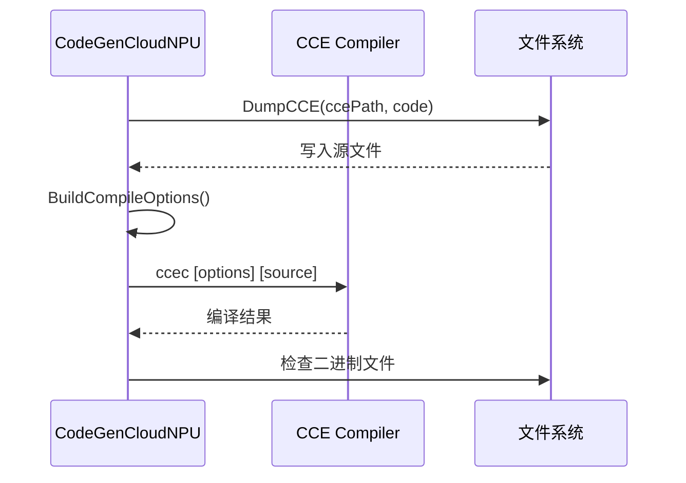

### 编译流程详解

#### 1. 写入源文件

**入口：** `DumpCCE()`

```cpp
void CodeGenCloudNPU::DumpCCE(const std::string &fileName, const std::string &code) const {
    // 1. 检查是否需要写入
    if (!IsNeedDumpCCE(fileName)) {
        return;
    }
    
    // 2. 打开文件并写入
    std::ofstream file;
    file.open(fileName);
    file << code;
    bool ret = !file.fail();
    file.close();
    
    // 3. 检查写入结果
    if (!ret) {
        ALOG_ERROR_F("Failed to dump CCE code to file: %s", fileName.c_str());
    }
}
```

**关键概念：**

- **`IsNeedDumpCCE()`**：检查是否需要写入文件
  - **逻辑**：
    - 如果 `KEY_FORCE_OVERWRITE` 为 true，强制写入
    - 如果文件不存在，需要写入
    - 如果文件存在且不强制覆盖，不写入

#### 2. 编译 CCE 代码

**入口：** `DoCompileCCE()`

```cpp
void CodeGenCloudNPU::DoCompileCCE(const CompileInfo &compileInfo, const std::string &compileOptions) const {
    // 1. 构建完整的编译选项
    std::string fullCompileOptions = BuildCompileOptions(compileInfo, compileOptions);
    
    // 2. 构建编译命令
    std::ostringstream compileCmd;
    compileCmd << "ccec " << fullCompileOptions << " " << compileInfo.GetCCEAbsPath();
    
    // 3. 执行编译命令
    int ret = system(compileCmd.str().c_str());
    
    // 4. 检查编译结果
    if (ret != 0) {
        ALOG_ERROR_F("Compile CCE code failed: %s", compileCmd.str().c_str());
        return;
    }
    
    // 5. 验证二进制文件是否存在
    if (!FileExist(compileInfo.GetBinAbsPath())) {
        ALOG_ERROR_F("Binary file not found after compilation: %s", compileInfo.GetBinAbsPath().c_str());
    }
}
```

**关键方法：**

- **`BuildCompileOptions()`**：构建编译选项
  ```cpp
  std::string CodeGenCloudNPU::BuildCompileOptions(const CompileInfo &compileInfo, const std::string &compileOptions) const {
      std::ostringstream oss;
      
      // 1. 添加 include 路径
      BuildIncludes(oss);
      
      // 2. 添加 LLVM 参数
      BuildLLVMParams(oss);
      
      // 3. 添加平台架构
      std::string arch = GetCoreArch(compileInfo);
      oss << " --target=" << arch;
      
      // 4. 添加优化级别
      oss << " -O2";
      
      // 5. 添加输出文件
      oss << " -o " << compileInfo.GetBinAbsPath();
      
      // 6. 添加用户指定的编译选项
      if (!compileOptions.empty()) {
          oss << " " << compileOptions;
      }
      
      return oss.str();
  }
  ```
  - **功能**：构建完整的编译选项字符串
  - **关键步骤**：
    1. **添加 include 路径**：通过 `BuildIncludes()` 添加
    2. **添加 LLVM 参数**：通过 `BuildLLVMParams()` 添加
    3. **添加平台架构**：根据 CompileInfo 确定
    4. **添加优化级别**：默认使用 `-O2`
    5. **添加输出文件**：指定二进制文件路径

- **`BuildIncludes()`**：构建 include 路径
  ```cpp
  void CodeGenCloudNPU::BuildIncludes(std::ostringstream &oss) const {
      // 1. 添加用户指定的 include 路径
      if (!ctx.IsIncludePathEmpty()) {
          oss << " -I " << ctx.includePath;
      }
      
      // 2. 添加默认的 include 路径
      std::string defaultIncludePath = GetIncludePathForCompileCCE();
      if (!defaultIncludePath.empty()) {
          oss << " -I " << defaultIncludePath;
      }
      
      // 3. 添加 PTO Tile 库路径
      std::string ptoTileLibPath = GetPtoTileLibPathByEnv();
      if (!ptoTileLibPath.empty()) {
          oss << " -I " << ptoTileLibPath;
      }
  }
  ```
  - **功能**：构建 include 路径选项
  - **关键概念**：
    - **用户指定路径**：通过 `CodeGenCtx::includePath` 设置
    - **默认路径**：通过 `GetIncludePathForCompileCCE()` 获取
    - **PTO Tile 库路径**：通过环境变量 `PTO_TILE_LIB_CODE_PATH` 获取

- **`GetCoreArch()`**：获取核心架构
  ```cpp
  std::string CodeGenCloudNPU::GetCoreArch(const CompileInfo &compileInfo) const {
      if (compileInfo.IsCube()) {
          return "aicore";
      } else {
          return "aiv";
      }
  }
  ```
  - **功能**：根据 CompileInfo 确定核心架构
  - **返回值**：
    - Cube 操作：`"aicore"`
    - Vector 操作：`"aiv"`

### 编译选项详解

**关键编译选项：**

- **Include 路径**：`-I {includePath}`
  - **用途**：指定头文件搜索路径
  - **来源**：用户配置、默认路径、环境变量

- **LLVM 参数**：`-mllvm {llvmParams}`
  - **用途**：传递给 LLVM 编译器的参数
  - **示例**：`-mllvm -opt-level=2`

- **优化级别**：`-O2` 或 `-O3`
  - **用途**：控制编译优化级别
  - **默认值**：`-O2`

- **平台架构**：`--target={arch}`
  - **取值**：`aicore` 或 `aiv`
  - **确定方式**：根据 CompileInfo 中的 `isCube_` 标志

- **输出文件**：`-o {binPath}`
  - **用途**：指定编译后的二进制文件路径
  - **格式**：`.o` 文件

### 并行编译

**实现：** `ParallelExecuteAndWait()`

```cpp
void ParallelExecuteAndWait(unsigned threadNum, std::deque<Task> tasks) {
    // 1. 创建线程池
    std::vector<std::thread> threads;
    
    // 2. 启动线程
    for (unsigned i = 0; i < threadNum; ++i) {
        threads.emplace_back([&tasks]() {
            while (true) {
                Task task;
                {
                    std::lock_guard<std::mutex> lock(mutex);
                    if (tasks.empty()) {
                        break;
                    }
                    task = tasks.front();
                    tasks.pop_front();
                }
                task();
            }
        });
    }
    
    // 3. 等待所有线程完成
    for (auto &thread : threads) {
        thread.join();
    }
}
```

**关键概念：**

- **并行编译**：支持并行编译多个子函数
  - **配置**：通过 `KEY_PARALLEL_COMPILE` 配置线程数
  - **优势**：提高编译效率，特别是对于包含多个子函数的大型模型
  - **实现**：使用线程池并行执行编译任务

---

## 最佳实践

### 1. 代码生成配置

**推荐做法：**

- 设置合适的输出目录，避免覆盖已有文件
- 配置并行编译线程数，提高编译效率
- 启用编译选项，确保生成可执行代码

### 2. 符号管理

**推荐做法：**

- 合理使用 SymbolManager，避免重复生成相同的 TileTensor
- 注意变量名的唯一性，避免命名冲突
- 及时清理不再使用的符号

### 3. 操作代码生成

**推荐做法：**

- 确保操作数信息正确，特别是形状和偏移
- 处理动态形状时，使用符号变量
- 注意操作属性的正确传递

---

## 常见问题

### 1. 代码生成失败

**问题：** 代码生成过程中出现错误。

**可能原因：**
- Function 对象状态不正确
- 操作信息不完整
- 符号管理错误

**解决方案：**
- 检查 Function 对象的完整性
- 验证操作信息的正确性
- 检查符号管理器的状态

### 2. 编译失败

**问题：** 生成的 CCE 代码编译失败。

**可能原因：**
- 代码语法错误
- 缺少必要的头文件
- 编译选项不正确

**解决方案：**
- 检查生成的代码语法
- 验证 include 路径
- 调整编译选项

### 3. 性能问题

**问题：** 生成的代码执行性能不佳。

**可能原因：**
- 代码生成策略不当
- 缓冲区分配不合理
- 操作顺序不优化

**解决方案：**
- 优化代码生成策略
- 调整缓冲区分配
- 优化操作顺序

---

## 相关文档

- [Function 类详细文档](03-function.md)
- [Passes 模块文档](07-passes.md)
- [Framework 模块文档](01-framework.md)
- 示例体系与选型建议见：[仓库 examples/ 全景速览](../01-examples/01-examples-catalog.md)

---

## 总结

`codegen` 模块是 PyPTO 编译框架的代码生成层，提供了：

1. **完整的代码生成框架**：从 IR 到 CCE 代码的完整转换流程
2. **平台抽象**：支持不同平台的代码生成器
3. **符号管理**：完善的符号和变量名管理机制
4. **操作代码生成**：支持各种操作类型的代码生成
5. **并行编译**：支持并行编译多个子函数

通过深入理解 `codegen` 模块的设计和实现，开发者可以更好地理解代码生成流程，优化生成的代码质量，提升执行性能。

