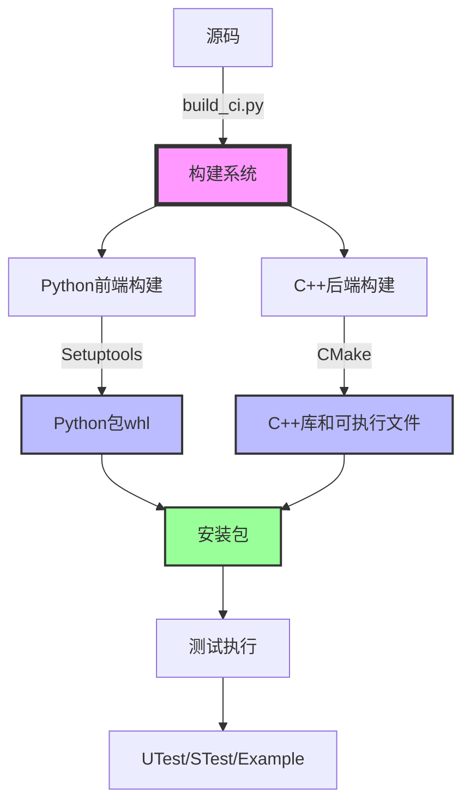
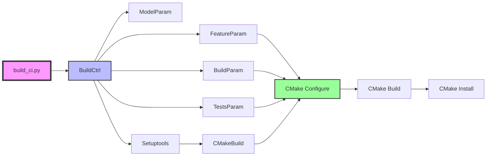
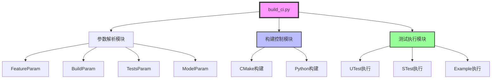
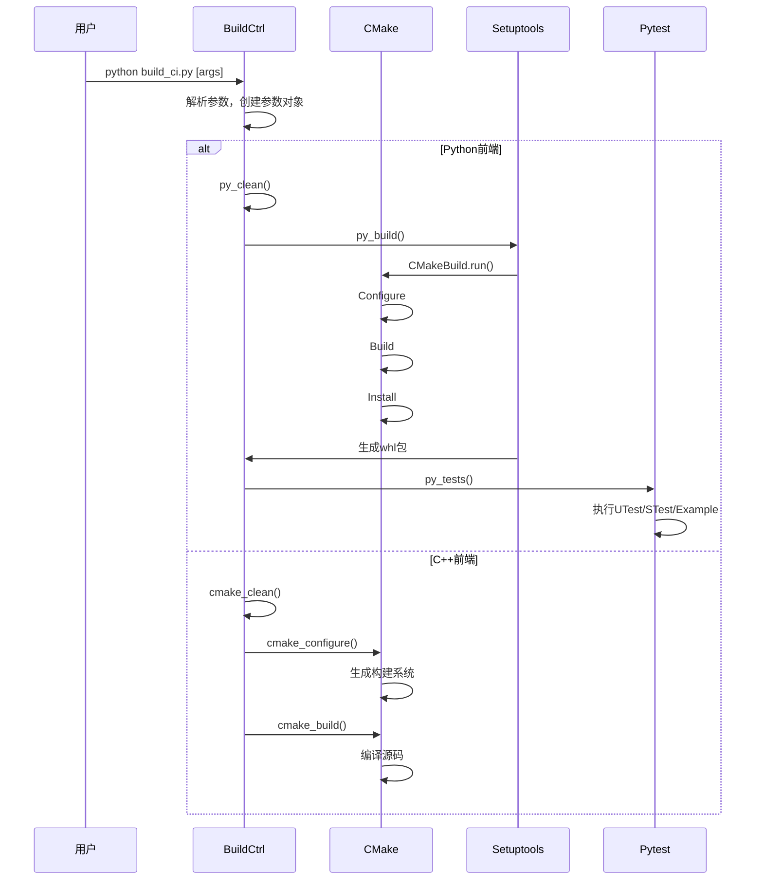
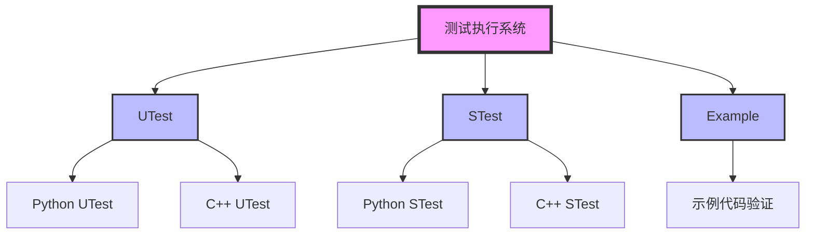
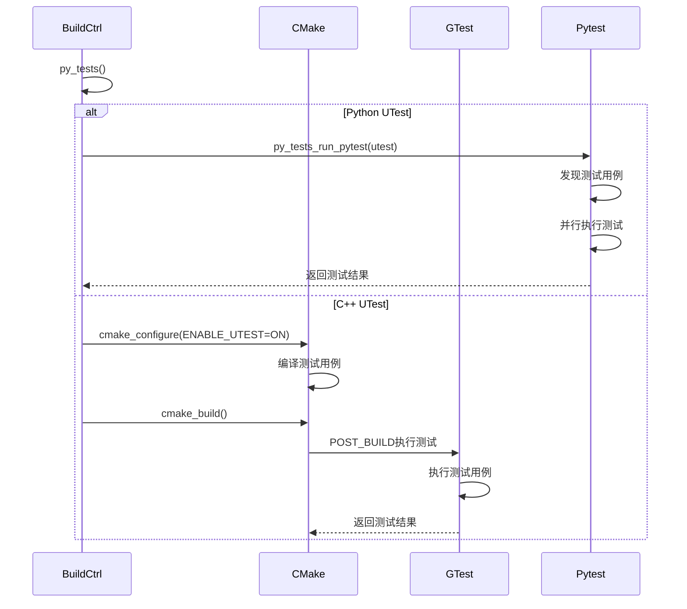
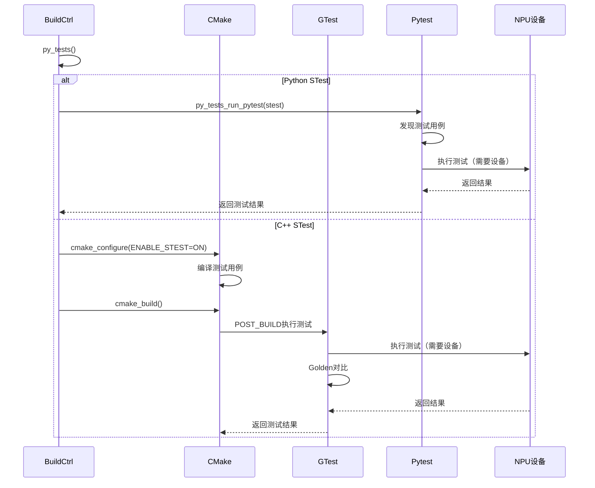
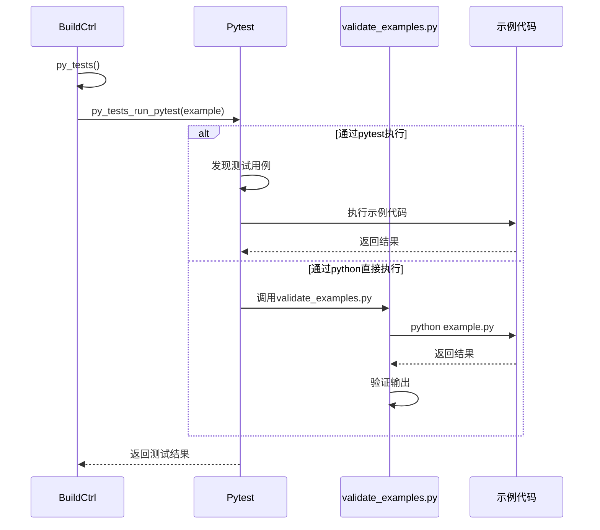

# PyPTO 构建系统技术文档

> **适用对象：** 想要编译安装PyPTO的开发者、CI/CD维护者  
> **学习时间：** 20-30分钟  
> **前置知识：** 基本的CMake和Python知识  
> **学习目标：** 掌握PyPTO的编译安装方法、理解构建系统的架构

## 概述

PyPTO 构建系统是一个基于 **Python + CMake + Setuptools** 的混合构建框架，支持 Python 前端和 C++ 后端的统一构建流程。该构建系统实现了从源码到可执行二进制和 Python 包的完整构建链路，包括编译、测试、安装等多个阶段，是 PyPTO 项目开发和部署的核心基础设施。

**构建系统特点：**
- 🔧 **混合构建**：Python前端 + C++后端的无缝集成
- 🚀 **快速编译**：支持并行编译和增量编译
- 📦 **统一打包**：生成whl包，便于分发和安装
- 🔄 **开发模式**：支持可编辑安装，便于调试

**构建系统特点：**
- **混合构建**：Python 前端通过 Setuptools 构建，C++ 后端通过 CMake 构建
- **统一入口**：`build_ci.py` 作为统一的构建入口，支持多种构建模式
- **测试集成**：内置 UTest（单元测试）、STest（系统测试）、Example（示例）的执行支持
- **灵活配置**：支持多种构建类型、编译器选项、测试过滤等配置
- **并行构建**：支持多线程并行编译和测试执行

**关键文件：**
- **构建入口**：[`build_ci.py`](../../../build_ci.py) - 构建总入口脚本
- **Setuptools 配置**：[`setup.py`](../../../setup.py) - Python 包构建配置
- **项目配置**：[`pyproject.toml`](../../../pyproject.toml) - Python 项目元数据
- **CMake 配置**：[`CMakeLists.txt`](../../../CMakeLists.txt) - CMake 顶层配置

---

## 目录

- [架构定位](#架构定位)
- [构建系统组织](#构建系统组织)
- [核心概念与数据结构](#核心概念与数据结构)
- [构建流程详解](#构建流程详解)
- [测试执行系统](#测试执行系统)
- [关键组件详解](#关键组件详解)
- [最佳实践](#最佳实践)
- [常见问题](#常见问题)

---

## 架构定位

### 构建系统在项目中的位置

PyPTO 构建系统是项目的基础设施层，负责将源码转换为可执行程序和 Python 包：



### 构建系统架构



**构建系统职责：**

| 构建阶段 | 构建系统职责 | 关键组件 |
|---------|------------|---------|
| **参数解析** | 解析命令行参数，构建参数对象 | `BuildCtrl`、`FeatureParam`、`BuildParam` |
| **CMake 配置** | 生成 CMake 配置命令 | `CMakeParam`、`get_cfg_cmd()` |
| **CMake 构建** | 执行 CMake Configure、Build、Install | `cmake_configure()`、`cmake_build()` |
| **Python 构建** | 构建 Python 包（whl） | `py_build()`、`CMakeBuild` |
| **测试执行** | 执行 UTest、STest、Example | `py_tests()`、`py_tests_run_pytest()` |

---

## 构建系统组织

### 文件结构

根据项目结构，构建系统包含以下关键文件：

```
pypto/
├── build_ci.py              # 构建总入口
├── setup.py                 # Setuptools 配置
├── pyproject.toml           # Python 项目元数据
├── CMakeLists.txt           # CMake 顶层配置
├── cmake/                   # CMake 公共配置
│   ├── func.cmake          # CMake 函数库
│   ├── config.cmake        # 配置管理
│   └── ...
├── framework/               # C++ 源码
│   ├── CMakeLists.txt      # Framework CMake 配置
│   ├── tests/              # 测试用例
│   │   ├── ut/             # 单元测试
│   │   ├── st/             # 系统测试
│   │   └── cmake/          # 测试 CMake 函数
│   └── ...
├── python/                  # Python 源码
│   ├── pypto/              # Python 包源码
│   ├── tests/              # Python 测试用例
│   │   ├── ut/             # 单元测试
│   │   └── st/             # 系统测试
│   └── ...
└── examples/                # 示例代码
    ├── 01_beginner/        # 初级示例
    ├── 02_intermediate/    # 中级示例
    ├── 03_advanced/        # 高级示例
    └── models/             # 模型示例
```

### 构建系统模块



---

## 核心概念与数据结构

### BuildCtrl（构建控制类）

**定义位置：** [`build_ci.py`](../../../build_ci.py#L752)

**功能概述：** 构建过程控制类，包含由命令行指定或解析出的控制标记/参数，以控制构建过程执行。

**关键成员变量：**

- **`src_root`**：源码根目录
  - **类型**：`Path`
  - **默认值**：`Path(__file__).parent.resolve()`
  - **用途**：指向项目根目录

- **`build_root`**：构建目录
  - **类型**：`Path`
  - **默认值**：`Path(Path.cwd(), "build")`
  - **用途**：CMake 构建树根目录

- **`install_root`**：安装目录
  - **类型**：`Path`
  - **默认值**：`Path(self.build_root.parent, "build_out")`
  - **用途**：CMake Install 和 whl 包输出目录

- **`feature`**：特性参数
  - **类型**：`FeatureParam`
  - **用途**：控制前端类型、后端类型、whl 包配置等

- **`build`**：构建参数
  - **类型**：`BuildParam`
  - **用途**：控制构建类型、编译器选项、并行度等

- **`tests`**：测试参数
  - **类型**：`TestsParam`
  - **用途**：控制测试执行、过滤、Golden 等

- **`model`**：模型参数
  - **类型**：`ModelParam`
  - **用途**：控制性能分析、仿真等

**关键方法：**

- **`cmake_configure()`**：CMake Configure 阶段
  - **功能**：执行 CMake 配置，生成构建系统文件
  - **实现**：调用 `cmake -S {src_root} -B {build_root}` 并传入配置参数

- **`cmake_build()`**：CMake Build 阶段
  - **功能**：执行 CMake 构建，编译源码
  - **实现**：调用 `cmake --build {build_root}` 并支持并行构建

- **`py_build()`**：Python 包构建
  - **功能**：构建 Python whl 包
  - **实现**：支持 `build` 库和 `pip install` 两种模式

- **`py_tests()`**：Python 测试执行
  - **功能**：执行 UTest、STest、Example
  - **实现**：通过 `pytest` 执行测试用例

### FeatureParam（特性参数）

**定义位置：** [`build_ci.py`](../../../build_ci.py#L89)

**功能概述：** 特性控制相关参数，控制前端类型、后端类型、whl 包配置等。

**关键成员变量：**

- **`frontend_type`**：前端类型
  - **类型**：`Optional[str]`
  - **可选值**：`"python3"`、`"cpp"`
  - **默认值**：`"python3"`
  - **用途**：指定构建的前端类型

- **`backend_type`**：后端类型
  - **类型**：`Optional[str]`
  - **可选值**：`"npu"`、`"cost_model"`
  - **默认值**：`"npu"`（如果 `ASCEND_HOME_PATH` 未设置，则回退到 `"cost_model"`）
  - **用途**：指定构建的后端类型

- **`whl_plat_name`**：whl 包平台名称
  - **类型**：`Optional[str]`
  - **可选值**：`"manylinux2014"`、`"manylinux_2_24"`、`"manylinux_2_28"`
  - **用途**：指定 whl 包的平台名称

- **`whl_isolation`**：whl 包隔离模式
  - **类型**：`bool`
  - **默认值**：`True`
  - **用途**：是否在隔离的虚拟环境中构建 whl 包

- **`whl_editable`**：whl 包可编辑模式
  - **类型**：`bool`
  - **默认值**：`False`
  - **用途**：是否以可编辑模式安装 whl 包（`pip install -e`）

**CMake 配置映射：**

```python
def get_cfg_cmd(self, ext: Optional[Any] = None) -> str:
    cmd: str = ""
    # 启用 Python 前端
    cmd += self._cfg_require(opt="ENABLE_FEATURE_PYTHON_FRONT_END", 
                            ctr=self.frontend_type_python3)
    # 启用 CANN 后端
    cmd += self._cfg_require(opt="BUILD_WITH_CANN", 
                            ctr=self.backend_type in ["npu"])
    return cmd
```

### BuildParam（构建参数）

**定义位置：** [`build_ci.py`](../../../build_ci.py#L150)

**功能概述：** 构建相关参数，控制构建类型、编译器选项、并行度等。

**关键成员变量：**

- **`clean`**：强制清理标记
  - **类型**：`bool`
  - **默认值**：`False`
  - **用途**：是否在构建前清理 Build-Tree 和 Install-Tree

- **`timeout`**：构建超时时长
  - **类型**：`Optional[int]`
  - **默认值**：`None`（无超时）
  - **用途**：构建任务的超时时长（秒）

- **`generator`**：CMake Generator
  - **类型**：`Optional[str]`
  - **可选值**：`"Unix Makefiles"`、`"Ninja"` 等

## 常用构建开关与环境变量表格

### 构建开关（build_ci.py 参数）

| 开关 | 类型 | 说明 | 示例 |
|------|------|------|------|
| `--build_type` | Release/Debug | 构建类型 | `--build_type Debug` |
| `--editable` | bool | 可编辑模式安装 | `--editable` |
| `--clean` | bool | 清理构建产物 | `--clean` |
| `--skip_tests` | bool | 跳过测试 | `--skip_tests` |
| `-j` / `--jobs` | int | 并行编译线程数 | `-j 8` |

### 环境变量

| 环境变量 | 说明 | 示例 | 用途 |
|---------|------|------|------|
| `PYPTO_THIRD_PARTY_PATH` | 第三方源码包路径 | `export PYPTO_THIRD_PARTY_PATH=/path/to/third-party` | 无法访问 cann-src-third-party 时使用 |
| `CMAKE_BUILD_TYPE` | CMake 构建类型 | `export CMAKE_BUILD_TYPE=Debug` | 直接控制 CMake 构建类型 |
| `CC` / `CXX` | 编译器路径 | `export CC=gcc` | 指定 C/C++ 编译器 |
| `ASCEND_HOME_PATH` | CANN 安装路径 | `export ASCEND_HOME_PATH=/usr/local/Ascend` | CANN 后端构建时使用 |
| `BUILD_WITH_CANN` | 是否启用 CANN | `export BUILD_WITH_CANN=ON` | 启用 CANN 后端（通常自动检测） |
| `ENABLE_FEATURE_PYTHON_FRONT_END` | 启用 Python 前端 | `export ENABLE_FEATURE_PYTHON_FRONT_END=ON` | 启用 Python 前端（默认启用） |

**注意：** 环境变量优先级低于 `build_ci.py` 命令行参数，建议优先使用 `build_ci.py` 参数。
  - **用途**：指定 CMake 构建系统生成器

- **`build_type`**：构建类型
  - **类型**：`Optional[str]`
  - **可选值**：`"Debug"`、`"Release"`、`"MinSizeRel"`、`"RelWithDebInfo"`
  - **默认值**：`"Release"`
  - **用途**：指定构建类型

- **`asan`**：AddressSanitizer
  - **类型**：`bool`
  - **默认值**：`False`
  - **用途**：是否启用 AddressSanitizer

- **`ubsan`**：UndefinedBehaviorSanitizer
  - **类型**：`bool`
  - **默认值**：`False`
  - **用途**：是否启用 UndefinedBehaviorSanitizer

- **`gcov`**：GNU Coverage
  - **类型**：`bool`
  - **默认值**：`False`
  - **用途**：是否启用 GNU Coverage 工具

- **`clang_install_path`**：Clang 安装路径
  - **类型**：`Optional[Path]`
  - **用途**：指定 Clang 编译器安装路径

- **`targets`**：编译目标
  - **类型**：`Optional[List[str]]`
  - **用途**：指定要编译的 CMake 目标

- **`job_num`**：编译并行度
  - **类型**：`Optional[int]`
  - **默认值**：`min(int(math.ceil(float(multiprocessing.cpu_count()) * 0.9)), 48)`
  - **用途**：编译阶段使用的线程数

**CMake 配置映射：**

```python
def get_cfg_cmd(self, ext: Optional[Any] = None) -> str:
    cmd: str = ""
    # 构建类型
    cmd += self._cfg_require(opt="CMAKE_BUILD_TYPE", tv=self.build_type)
    # AddressSanitizer
    cmd += self._cfg_require(opt="ENABLE_ASAN", ctr=self.asan)
    # UndefinedBehaviorSanitizer
    cmd += self._cfg_require(opt="ENABLE_UBSAN", ctr=self.ubsan)
    # GNU Coverage
    cmd += self._cfg_require(opt="ENABLE_GCOV", ctr=self.gcov)
    # Clang 工具链
    if self.clang_install_path is not None:
        cmd += self._cfg_require(opt="CMAKE_C_COMPILER", tv=str(clang_path))
        cmd += self._cfg_require(opt="CMAKE_CXX_COMPILER", tv=str(clang++_path))
    return cmd
```

### TestsParam（测试参数）

**定义位置：** [`build_ci.py`](../../../build_ci.py#L511)

**功能概述：** 测试执行相关参数，控制 UTest、STest、Example 的执行和过滤。

**关键成员变量：**

- **`exec`**：测试执行参数
  - **类型**：`TestsExecuteParam`
  - **用途**：控制测试自动执行、并行执行、变更文件等

- **`golden`**：Golden 参数
  - **类型**：`TestsGoldenParam`
  - **用途**：控制 STest Golden 路径和清理

- **`utest`**：UTest 过滤参数
  - **类型**：`TestsFilterParam`
  - **用途**：控制 UTest 的启用和过滤

- **`stest`**：STest 过滤参数
  - **类型**：`TestsFilterParam`
  - **用途**：控制 STest 的启用和过滤

- **`stest_group`**：STest 组过滤参数
  - **类型**：`TestsFilterParam`
  - **用途**：控制 STest 组的过滤

- **`stest_distributed`**：分布式 STest 过滤参数
  - **类型**：`TestsFilterParam`
  - **用途**：控制分布式 STest 的过滤

- **`example`**：Example 过滤参数
  - **类型**：`TestsFilterParam`
  - **用途**：控制 Example 的启用和过滤

- **`stest_exec`**：STest 执行参数
  - **类型**：`STestExecuteParam`
  - **用途**：控制 STest 的设备 ID、JSON 导出、解释器配置等

- **`stest_tools`**：STest 工具参数
  - **类型**：`STestToolsParam`
  - **用途**：控制 STest 工具（如 Profiling）的配置

**启用判断：**

```python
@property
def enable(self) -> bool:
    return self.utest.enable or self.stest.enable or \
           self.stest_distributed.enable or self.example.enable
```

### CMakeParam（CMake 参数基类）

**定义位置：** [`build_ci.py`](../../../build_ci.py#L40)

**功能概述：** 需要向 CMake 传入 Option 的参数的抽象基类。

**关键方法：**

- **`_cfg_require()`**：获取 CMake Config 阶段的必选 Option 配置
  - **参数**：
    - `opt`：CMake 选项名称
    - `ctr`：控制变量（布尔值）
    - `tv`：控制变量为 `True` 时设置的值（默认：`"ON"`）
    - `fv`：控制变量为 `False` 时设置的值（默认：`"OFF"`）
  - **返回**：CMake 配置字符串（如 `" -DENABLE_ASAN=ON"`）

- **`_cfg_optional()`**：获取 CMake Config 阶段的可选 Option 配置
  - **参数**：
    - `opt`：CMake 选项名称
    - `ctr`：控制变量（布尔值）
    - `v`：控制变量为 `True` 时设置的值
  - **返回**：CMake 配置字符串（如果 `ctr` 为 `False`，返回空字符串）

- **`get_cfg_cmd()`**：获取 CMake 配置命令
  - **抽象方法**：子类必须实现
  - **返回**：CMake 配置命令字符串

---

## 构建流程详解

### 整体构建流程



### Python 前端构建流程

**入口：** `BuildCtrl.py_build()`

**文件位置：** [`build_ci.py`](../../../build_ci.py#L1108)

**功能概述：** whl 包编译处理，支持正式编译和 pip 编译两种模式。

**实现详解：**

```python
def py_build(self):
    """whl 包编译处理
    
    支持:
        1. 正式编译, 调用 build 库触发 setuptools(bdist_wheel 命令) 
           进而触发 CMake 完成编译;
        2. pip编译, 调用 pip install 命令触发 setuptools(editable_wheel 命令) 
           进而触发 CMake 完成编译, 有两种模式:
            1. 常规安装: 适用于生产环境或代码稳定后使用, 
               其安装后对源码的修改不会反映到已安装的包中;
            2. 可编辑安装: 便于开发调试. 它在 site-packages 中创建指向本地的链接, 
               对 Python 源码的修改会即时生效, 无需重新安装;
    """
    update_env: Dict[str, str] = self.get_cfg_update_env()
    
    # 判断是否使用 pip install 模式
    if self._use_pip_install_mode() or self.feature.whl_editable:
        # pip install 模式
        opt: str = f" --no-compile --no-deps"
        opt += f" --no-build-isolation" if not self.feature.whl_isolation else ""
        
        # 获取 setuptools build_ext 配置
        cmd_config_setting, env_config_setting = \
            self._get_setuptools_build_ext_config_setting()
        
        if self.feature.whl_editable:
            # 可编辑模式：通过环境变量传递配置
            update_env["PYPTO_BUILD_EXT_ARGS"] = env_config_setting
        else:
            # 常规安装模式：通过 --config-setting 传递配置
            if self.pip_support_config_setting:
                opt += f" {cmd_config_setting}" if cmd_config_setting else ""
            else:
                # pip 低版本无 --config-setting 参数, 此时以环境变量方式传入
                update_env["PYPTO_BUILD_EXT_ARGS"] = env_config_setting
        
        # 重装 whl 包
        dist: Optional[Path] = self._get_pip_install_dist()
        self.pip_uninstall(name=self.feature.whl_name, path=dist)
        self.pip_install(whl=self.src_root, dest=dist, opt=opt, update_env=update_env)
    else:
        # 正式编译模式：使用 build 库
        self.check_pip_dependencies(deps={"build": ">=1.0.3"}, raise_err=True, log_err=True)
        cmd: str = f"{sys.executable} -m build --outdir={self.install_root}"
        cmd += f" --no-isolation" if not self.feature.whl_isolation else ""
        cmd += f" {self._get_setuptools_bdist_wheel_config_setting()}"
        ts = datetime.now(tz=timezone.utc)
        logging.info("Begin Build whl, Cmd: %s", cmd)
        ret = self.run_build_cmd(cmd=cmd, update_env=update_env, check=True, 
                                 timeout=self.build.timeout)
        ret.check_returncode()
        duration: int = int((datetime.now(tz=timezone.utc) - ts).seconds)
        logging.info("Success Build whl, Cmd: %s, Duration %s sec", cmd, duration)
```

**关键概念：**

- **正式编译模式**：使用 `build` 库构建 whl 包
  - **命令**：`python -m build --outdir={install_root}`
  - **触发**：`setuptools` 的 `bdist_wheel` 命令
  - **适用场景**：生产环境或代码稳定后使用

- **pip 安装模式**：使用 `pip install` 构建 whl 包
  - **命令**：`pip install {src_root} [options]`
  - **触发**：`setuptools` 的 `editable_wheel` 命令（如果使用 `-e`）
  - **适用场景**：开发调试场景

- **可编辑安装模式**：`pip install -e`
  - **特点**：在 `site-packages` 中创建指向本地的链接
  - **优势**：对 Python 源码的修改会即时生效，无需重新安装
  - **限制**：C++ 代码修改后仍需重新编译

- **隔离模式**：`--no-build-isolation`
  - **作用**：禁用构建隔离，使用当前环境的依赖
  - **使用场景**：当需要自定义构建依赖时

### CMake 构建流程

**入口：** `BuildCtrl.cmake_configure()` 和 `BuildCtrl.cmake_build()`

**文件位置：** [`build_ci.py`](../../../build_ci.py#L1059) 和 [`build_ci.py`](../../../build_ci.py#L1075)

**功能概述：** 执行 CMake 的 Configure、Build、Install 三个阶段。

#### 1. CMake Configure 阶段

**实现详解：**

```python
def cmake_configure(self):
    """CMake Configure 阶段流程.
    """
    # 基本配置, 当前 CMake 中有调用 python3 的情况, 传入 python3 解释器, 
    # 保证所使用的 python3 版本一致
    cmd: str = f"{self.cmake} -S {self.src_root} -B {self.build_root}"
    cmd += f" -G {self.build.generator}" if self.build.generator else ""
    cmd += f" -DPython3_EXECUTABLE={sys.executable}"
    cmd += self.feature.get_cfg_cmd()      # 特性配置
    cmd += self.build.get_cfg_cmd()        # 构建配置
    cmd += self.tests.get_cfg_cmd()        # 测试配置
    cmd += self.get_cfg_cmd()              # 构建控制配置
    
    # 执行
    update_env: Dict[str, str] = self.get_cfg_update_env()
    logging.info("CMake Configure, Cmd: %s", cmd)
    ret = self.run_build_cmd(cmd=cmd, update_env=update_env, check=True)
    ret.check_returncode()
```

**关键步骤：**

1. **构建命令**：`cmake -S {src_root} -B {build_root}`
2. **指定 Generator**：`-G {generator}`（可选）
3. **指定 Python 解释器**：`-DPython3_EXECUTABLE={sys.executable}`
4. **传入配置参数**：通过 `-D` 选项传入各种配置
5. **执行命令**：调用 `run_build_cmd()` 执行

#### 2. CMake Build 阶段

**实现详解：**

```python
def cmake_build(self):
    """CMake Build 阶段流程.
    """
    # prof使能初始化
    update_env = {}
    if self.model.prof == 1 or self.model.prof == 2:
        update_env = wf.ini(self.build_root, self.model.prof, self.model.pe)
    if self.build.job_num:
        update_env["PYPTO_UTEST_PARALLEL_NUM"] = str(self.build.job_num)
    
    # 构建命令列表
    cmd_list: List[str] = self.build.get_build_cmd_lst(
        cmake=self.cmake, binary_path=self.build_root)
    
    # 执行每个构建命令
    for i, c in enumerate(cmd_list, start=1):
        ts = datetime.now(tz=timezone.utc)
        c += " --verbose" if self.verbose else ""
        logging.info("CMake Build(%s/%s), Cmd: %s", i, len(cmd_list), c)
        try:
            ret = self.run_build_cmd(cmd=c, update_env=update_env, check=True, 
                                     timeout=self.build.timeout)
        except subprocess.CalledProcessError as e:
            logging.info(f"Run cmd {c} failed, ERROR CODE: {e.returncode}")
            # 一键绘图
            if self.model.prof == 1 or self.model.prof == 2:
                wf.work_flow_plot(self.build_root, self.model.prof, self.model.pe)
            raise
        ret.check_returncode()
        duration: int = int((datetime.now(tz=timezone.utc) - ts).seconds)
        duration_str: str = f"{duration}/{self.build.timeout}" if self.build.timeout else f"{duration}"
        logging.info("CMake Build(%s/%s), Cmd: %s, Duration %s sec",
                     i, len(cmd_list), c, duration_str)
        # 超时时长更新, 当指定多 target 时, 各 target 共享总超时时长
        self.build.timeout = self.build.timeout - duration if self.build.timeout else self.build.timeout
    
    # 一键绘图
    if self.model.prof == 1 or self.model.prof == 2:
        wf.work_flow_plot(self.build_root, self.model.prof, self.model.pe)
```

**关键步骤：**

1. **性能分析初始化**：如果启用性能分析，初始化相关环境
2. **构建命令生成**：通过 `get_build_cmd_lst()` 生成构建命令列表
3. **并行构建**：支持 `-j {job_num}` 并行构建
4. **超时管理**：支持构建超时，多 target 共享总超时时长
5. **性能分析绘图**：构建完成后，如果启用性能分析，生成性能图表

**构建命令生成：**

```python
def get_build_cmd_lst(self, cmake: Path, binary_path: Path) -> List[str]:
    cmd_list: List[str] = []
    if self.targets:
        # 指定了目标，为每个目标生成构建命令
        for t in self.targets:
            cmd: str = f"{cmake} --build {binary_path} --target {t}"
            cmd += f" -j {self.job_num}" if self.job_num else ""
            cmd_list.append(cmd)
    else:
        # 未指定目标，构建所有目标
        cmd: str = f"{cmake} --build {binary_path}"
        cmd += f" -j {self.job_num}" if self.job_num else ""
        cmd_list.append(cmd)
    return cmd_list
```

### Setuptools 集成

**入口：** `CMakeBuild.run()`

**文件位置：** [`setup.py`](../../../setup.py#L305)

**功能概述：** 自定义 Setuptools `build_ext` 命令，调用 CMake 构建系统。

**实现详解：**

```python
class CMakeBuild(build_ext, CMakeUserOption, EditModeHelper):
    """自定义构建命令, 调用 CMake 构建系统
    """
    
    def run(self):
        """执行构建流程
        """
        logging.info("%s", self)
        # 源码根目录
        src: Path = Path(__file__).parent.resolve()
        # 准备构建目录, 使用扩展名创建唯一的构建目录
        build_dir: Path = Path(self.build_temp).resolve()
        build_dir.mkdir(parents=True, exist_ok=True)
        # 获取 cmake install prefix
        cmake_install_prefix: Path = self._get_cmake_install_prefix()

        # CMake Configure
        cmd: str = f"{self.cmake} -S {src} -B {build_dir}"
        cmd += f" -G {self.cmake_generator}" if self.cmake_generator else ""
        cmd += f" -DCMAKE_BUILD_TYPE={self.cmake_build_type}" if self.cmake_build_type else ""
        cmd += f" -DPython3_EXECUTABLE={sys.executable} -DCMAKE_INSTALL_PREFIX={cmake_install_prefix}"
        cmd += f" {self.cmake_options}" if self.cmake_options else ""
        logging.info("CMake Configure, Cmd: %s", cmd)
        ret = subprocess.run(shlex.split(cmd), capture_output=False, check=True, 
                            text=True, encoding='utf-8')
        ret.check_returncode()

        # CMake Build
        job_num: Optional[int] = self._get_job_num(
            job_num=self.parallel, generator=self.cmake_generator)
        cmd: str = f"{self.cmake} --build {build_dir}" + (f" -j {job_num}" if job_num else "")
        cmd += f" --verbose" if self.cmake_verbose else ""
        logging.info("CMake Build, Cmd: %s", cmd)
        ret = subprocess.run(shlex.split(cmd), capture_output=False, check=True, 
                            text=True, encoding='utf-8')
        ret.check_returncode()

        # CMake Install
        cmake_install_prefix: Path = self._get_cmake_install_prefix()  # 重复获取触发提示
        cmd: str = f"{self.cmake} --install {build_dir} --prefix {cmake_install_prefix}"
        logging.info("CMake Install, Cmd: %s", cmd)
        ret = subprocess.run(shlex.split(cmd), capture_output=False, check=True, 
                            text=True, encoding='utf-8')
        ret.check_returncode()
        
        # 可编辑模式：传递安装文件列表给 editable_wheel
        if self._edit_mode():
            installed_files: List[str] = self._get_cmake_install_manifest(build_dir=build_dir)
            if installed_files:
                # 向 editable_wheel 命令传递
                editable_wheel_cmd = self.distribution.get_command_obj("editable_wheel")
                editable_wheel_cmd.pypto_install_manifest_lst = installed_files
                logging.info("Command build_ext passes %s CMake install files to editable_wheel command",
                             len(editable_wheel_cmd.pypto_install_manifest_lst))
```

**关键概念：**

- **CMakeExtension**：空的 Extension 对象，实际构建由 CMake 处理
- **CMakeBuild**：自定义 `build_ext` 命令，调用 CMake 完成构建
- **CustomEditableWheel**：自定义 `editable_wheel` 命令，处理可编辑安装模式
- **CMake Install Prefix**：
  - **常规模式**：`self.build_lib`（构建库目录）
  - **可编辑模式**：`{src_root}/python`（源码目录）

---

## 测试执行系统

### 测试系统架构

PyPTO 构建系统支持三种类型的测试：



### UTest（单元测试）

**定义：** 单元测试，用于测试单个函数或模块的功能正确性。

**执行方式：**

1. **Python UTest**：通过 `pytest` 执行
   - **位置**：`python/tests/ut/`
   - **执行命令**：`pytest {python/tests/ut} -v --durations=0 -s --capture=no`
   - **并行执行**：支持 `-n {n_workers} --forked` 并行执行

2. **C++ UTest**：通过 `GTest` 执行
   - **位置**：`framework/tests/ut/`
   - **执行方式**：CMake 构建时自动执行（如果 `ENABLE_TESTS_EXECUTE=ON`）
   - **过滤**：通过 `ENABLE_UTEST` 选项指定过滤条件

**执行流程：**



**Python UTest 执行详解：**

**入口：** `BuildCtrl.py_tests_run_pytest()`

**文件位置：** [`build_ci.py`](../../../build_ci.py#L1178)

**实现详解：**

```python
def py_tests_run_pytest(self, dist: Optional[Path], tests: TestsFilterParam, 
                        def_filter: str, ext: str = ""):
    if not tests.enable or not self.tests.exec.auto_execute:
        return
    
    # cmd 拼接
    cmd: str = f"{sys.executable} -m pytest"
    def_filter = def_filter if tests.filter_str in ["ON"] else tests.filter_str
    def_filter = def_filter.replace(',', ' ')
    cmd += f" {def_filter} -v --durations=0 -s --capture=no --rootdir={self.src_root} {ext}"
    
    # cmd 执行
    origin_env = os.environ.copy()
    update_env: Dict[str, str] = {}
    if dist:
        ori_env_python_path: str = origin_env.get(self._PYTHONPATH, "")
        act_env_python_path: str = f"{dist}:{ori_env_python_path}" if ori_env_python_path else f"{dist}"
        update_env.update({self._PYTHONPATH: act_env_python_path})
    
    ts = datetime.now(tz=timezone.utc)
    logging.info("pytest run, Cmd: %s", cmd)
    ret = self.run_build_cmd(cmd=cmd, check=True, update_env=update_env)
    ret.check_returncode()
    duration: int = int((datetime.now(tz=timezone.utc) - ts).seconds)
    logging.info("pytest run, Cmd: %s, Duration %s sec", cmd, duration)
```

**关键参数：**

- **`def_filter`**：默认过滤路径
  - **UTest**：`python/tests/ut`
  - **STest**：`python/tests/st`
  - **Example**：`examples`

- **`tests.filter_str`**：用户指定的过滤条件
  - **格式**：逗号分隔的路径或测试标识符
  - **示例**：`"python/tests/ut/test_tensor.py::test_tensor_creation"`

- **`ext`**：额外参数
  - **UTest**：`-n {n_workers} --forked -W ignore::DeprecationWarning`
  - **STest**：`--forked`
  - **Example**：`--forked`

**C++ UTest 执行详解：**

**CMake 函数：** `PTO_Fwk_UTest_AddExe_RunExe()`

**文件位置：** Python 测试入口通常在 [`python/tests/`](../../../python/tests/)

**实现原理：**

1. **测试用例注册**：通过 `PTO_Fwk_UTest_AddCaseLib()` 注册测试用例库
2. **可执行程序创建**：通过 `PTO_Fwk_GTest_AddExe()` 创建 GTest 可执行程序
3. **自动执行**：通过 `PTO_Fwk_UTest_RunExe()` 在 POST_BUILD 阶段自动执行

**关键配置：**

- **`ENABLE_UTEST`**：启用 UTest
  - **值**：`ON`（执行所有测试）或过滤条件（如 `"*Tensor*"`）
- **`ENABLE_TESTS_EXECUTE`**：启用自动执行
- **`ENABLE_TESTS_EXECUTE_PARALLEL`**：启用并行执行

### STest（系统测试）

**定义：** 系统测试，用于测试整个系统的功能正确性，通常需要硬件设备支持。

**执行方式：**

1. **Python STest**：通过 `pytest` 执行
   - **位置**：`python/tests/st/`
   - **执行命令**：`pytest {python/tests/st} -v --durations=0 -s --capture=no --forked`
   - **设备支持**：需要设置 `DEVICE_ID` 环境变量

2. **C++ STest**：通过 `GTest` 执行
   - **位置**：`framework/tests/st/`
   - **执行方式**：CMake 构建时自动执行（如果 `ENABLE_TESTS_EXECUTE=ON`）
   - **Golden 支持**：支持 Golden 文件对比

**执行流程：**



**STest 关键配置：**

- **`ENABLE_STEST`**：启用 STest
  - **值**：`ON`（执行所有测试）或过滤条件
- **`ENABLE_STEST_EXECUTE_DEVICE_ID`**：指定设备 ID
  - **格式**：`"0"` 或 `"0:1:2"`（多个设备）
- **`ENABLE_STEST_DUMP_JSON`**：导出 JSON 文件
- **`ENABLE_STEST_INTERPRETER_CONFIG`**：启用解释器配置
- **`ENABLE_STEST_BINARY_CACHE`**：启用二进制缓存
- **`ENABLE_STEST_GOLDEN_PATH`**：指定 Golden 路径
- **`ENABLE_STEST_GOLDEN_PATH_CLEAN`**：清理 Golden 文件

**Golden 机制：**

Golden 机制用于对比测试输出和预期输出：

1. **Golden 文件生成**：首次执行测试时，将输出保存为 Golden 文件
2. **Golden 文件对比**：后续执行时，将输出与 Golden 文件对比
3. **Golden 文件清理**：通过 `ENABLE_STEST_GOLDEN_PATH_CLEAN=ON` 清理

**STest 工具（Profiling）：**

STest 支持性能分析工具：

- **`ENABLE_STEST_TOOLS_PROF`**：启用性能分析
- **`ENABLE_STEST_TOOLS_PROF_LEVEL`**：性能分析级别（`l1` 或 `l2`）
- **`ENABLE_STEST_TOOLS_PROF_WARN_UP_CNT`**：预热次数
- **`ENABLE_STEST_TOOLS_PROF_TRY_CNT`**：尝试次数
- **`ENABLE_STEST_TOOLS_PROF_MAX_CNT`**：最大次数

### Example（示例代码）

**定义：** 示例代码验证，用于验证示例代码的正确性。

**执行方式：**

通过 `pytest` 或 `python` 直接执行示例代码：

- **位置**：`examples/`
- **执行命令**：`pytest {examples} -v --durations=0 -s --capture=no --forked`
- **验证脚本**：`examples/validate_examples.py`

**执行流程：**



**示例验证脚本：**

**文件位置：** [`examples/validate_examples.py`](../../../examples/validate_examples.py)

**功能概述：** 自动化 Python 脚本验证器，支持批量验证示例代码。

**关键特性：**

- **输入灵活性**：接受单个 `.py` 文件或目录路径
- **执行模式**：
  - **`npu`**（默认）：在 NPU 设备上执行
  - **`sim`**：在仿真模式下执行（仅支持 `--run_mode sim` 的脚本）
- **智能分发**：
  - 包含 `if __name__ == "__main__":` 的脚本通过 `python` 执行
  - 其他脚本通过 `pytest` 执行
- **超时保护**：每个脚本有可配置的执行超时（默认 300 秒）
- **结果验证**：检查输出中是否包含错误信息

**使用示例：**

```bash
# 1. 批量执行指定目录
python3 examples/validate_examples.py -t examples/02_intermediate --device-id 0

# 2. 执行指定脚本
python3 examples/validate_examples.py -t examples/01_beginner/compute/elementwise_ops.py --device-id 0

# 3. 执行指定脚本的指定用例
python3 examples/validate_examples.py -t examples/01_beginner/compute/elementwise_ops.py add::test_add_basic --device-id 0

# 4. 设置超时时间
python3 examples/validate_examples.py -t examples/02_intermediate --device-id 0 --timeout 120

# 5. 仿真模式
python3 examples/validate_examples.py -t examples/02_intermediate --run-mode sim --device-id 0
```

---

## 关键组件详解

### run_build_cmd（构建命令执行）

**定义位置：** [`build_ci.py`](../../../build_ci.py#L830)

**功能概述：** 执行具体 build 命令行，支持超时管理和进程组管理。

**实现详解：**

```python
@staticmethod
def run_build_cmd(cmd: str, update_env: Optional[Dict[str, str]] = None, 
                  check: bool = False, timeout: Optional[int] = None) -> \
                  Optional[subprocess.CompletedProcess]:
    """执行具体 build 命令行
    
    因以下原因, 设置本函数, 而非调用原生 subprocess.run:
        1. 支持多 target 构建, 各 target 构建时长共享公共 timeout 配置;
        2. UTest/STest 并行执行场景下, 执行时进程调用关系为:
               build_ci.py(主进程) -> 进程1(CMake) -> 进程2(CMake Generator, make/ninja) 
               -> 进程3(Python)-> 进程4(exe)
           此时若 进程1 超时, 需要触发其子/孙进程感知, 进而结束
    
    :param cmd: Build 命令行
    :param update_env: 环境变量(额外更新内容)
    :param check: 检查返回值
    :param timeout: 执行超时时长
    """
    
    def _stop_pg(_msg: str, _p: subprocess.Popen):
        """通过 SIGINT 信号通知所有子/孙进程结束, 
        python 并行脚本内会捕获该信号进行结算处理
        """
        _pgid = os.getpgid(_p.pid)
        logging.info("%s. Send terminate event to CMake[%s]", _msg, _pgid)
        os.killpg(_pgid, signal.SIGINT)
    
    stdout: Optional[str] = None
    stderr: Optional[str] = None
    env = os.environ.copy()
    env.update(update_env if update_env else {})
    
    # 使用 start_new_session=True 创建新的进程组
    with subprocess.Popen(shlex.split(cmd), env=env, text=True, encoding='utf-8',
                          start_new_session=True) as process:
        try:
            stdout, stderr = process.communicate(timeout=timeout)
        except subprocess.TimeoutExpired:
            _stop_pg(_msg="Timeout", _p=process)
            raise
        except KeyboardInterrupt:
            # 一般为用户主动触发, 不需再上报错误
            _stop_pg(_msg="KeyboardInterrupt", _p=process)
        except Exception:
            process.kill()
            raise
        finally:
            stdout = stdout or ""
            stderr = stderr or ""
        ret_code = process.poll()
        if check and ret_code:
            raise subprocess.CalledProcessError(ret_code, process.args, 
                                               output=stdout, stderr=stderr)
    return subprocess.CompletedProcess(process.args, ret_code, stdout, stderr)
```

**关键特性：**

- **进程组管理**：使用 `start_new_session=True` 创建新的进程组，便于管理子进程
- **超时处理**：支持超时，超时时通过 `SIGINT` 信号通知所有子/孙进程结束
- **信号处理**：捕获 `KeyboardInterrupt`，优雅地终止子进程
- **环境变量**：支持更新环境变量

### which_cmake（CMake 查找）

**定义位置：** [`build_ci.py`](../../../build_ci.py#L798)

**功能概述：** 查找系统级 CMake 可执行文件路径，排除 cmake pip 包的干扰。

**实现详解：**

```python
@staticmethod
def which_cmake() -> Optional[Path]:
    """查找系统级 CMake 可执行文件路径
    
    排除 cmake pip 包的干扰
    """
    # 拆分 PATH 环境变量为单个目录列表（排除空目录）
    path_dir_lst = [d.strip() for d in os.environ.get("PATH", "").split(os.pathsep) 
                    if d.strip()]

    # 遍历每个 PATH 目录，逐个调用 shutil.which 检查, 
    # 限定 shutil.which 只在当前单个目录下查找 cmake
    valid_path_lst: List[str] = []
    for path_dir in path_dir_lst:
        # 避免 PATH 环境变量中有重复的单元
        if path_dir in valid_path_lst:
            continue
        valid_path_lst.append(path_dir)
        # 检查当前目录
        cmake_str: Optional[Union[Path, str]] = shutil.which("cmake", path=path_dir)
        if not cmake_str:
            continue
        cmake_file: Path = Path(cmake_str).resolve()
        if not cmake_file.exists() or not cmake_file.is_file():
            continue
        if cmake_file.stat().st_size <= 4:  # 下文读取前 4 字节判断文件是否是 ELF 文件
            continue
        with open(cmake_file, 'rb') as fh:
            header = fh.read(4)  # 前 4 字节是 ELF 文件标识
        if header != b'\x7fELF':
            continue
        return cmake_file
    return None
```

**关键特性：**

- **系统级查找**：只查找系统级的 CMake，排除 pip 包中的 cmake
- **ELF 文件验证**：通过检查文件头（`\x7fELF`）确保是 ELF 可执行文件
- **路径去重**：避免 PATH 环境变量中的重复路径

---

## 最佳实践

### 构建配置

**推荐做法：**

1. **使用 Release 构建类型**：生产环境使用 `--build_type Release`
2. **启用并行构建**：使用 `-j {job_num}` 指定并行度
3. **使用 Ninja Generator**：提高构建速度
4. **启用隔离模式**：使用 `--no_isolation` 时需要确保依赖已安装

### 测试执行

**推荐做法：**

1. **增量测试**：使用 `--changed_files` 指定变更文件，只执行相关测试
2. **并行执行**：UTest 支持并行执行，使用 `-j {job_num}` 指定并行度
3. **Golden 管理**：定期更新 Golden 文件，确保测试准确性
4. **设备管理**：STest 需要设备支持，使用 `-d {device_id}` 指定设备

### 开发调试

**推荐做法：**

1. **使用可编辑安装**：开发时使用 `pip3 install -e ./`，Python 代码修改即时生效
2. **使用 Debug 构建**：调试时使用 `--build_type Debug`
3. **启用 Sanitizer**：使用 `--asan` 或 `--ubsan` 检测内存问题
4. **使用隔离模式**：避免污染系统环境

---

## 常见问题

### 1. 构建失败

**问题：** 构建过程中出现错误。

**可能原因：**
- CMake 配置错误
- 依赖缺失
- 编译器版本不兼容
- 环境变量未设置

**解决方案：**
- 检查 CMake 配置参数
- 安装缺失的依赖
- 检查编译器版本
- 设置必要的环境变量（如 `ASCEND_HOME_PATH`）

### 2. 测试执行失败

**问题：** 测试用例执行失败。

**可能原因：**
- 测试用例代码错误
- 设备不可用（STest）
- Golden 文件不匹配
- 环境配置错误

**解决方案：**
- 检查测试用例代码
- 确保设备可用（STest）
- 更新 Golden 文件
- 检查环境配置

### 3. whl 包安装失败

**问题：** whl 包安装失败。

**可能原因：**
- 依赖缺失
- 平台不兼容
- 权限问题

**解决方案：**
- 安装缺失的依赖
- 检查平台兼容性
- 使用 `--user` 选项安装到用户目录

### 4. 可编辑安装问题

**问题：** 可编辑安装后，修改代码不生效。

**可能原因：**
- C++ 代码修改后未重新编译
- 可编辑安装路径错误

**解决方案：**
- C++ 代码修改后需要重新编译
- 检查可编辑安装路径

---

## 相关文档

- [Function 类详细文档](03-function.md)
- [Framework 模块文档](01-framework.md)
- 环境与安装/构建参数见：[环境准备与安装](../00-getting-started/01-environment-setup.md)

---

## 总结

PyPTO 构建系统是一个功能完善的混合构建框架，提供了：

1. **统一的构建入口**：`build_ci.py` 作为统一的构建入口
2. **灵活的配置系统**：支持多种构建类型、编译器选项、测试过滤等
3. **完整的测试支持**：内置 UTest、STest、Example 的执行支持
4. **高效的并行构建**：支持多线程并行编译和测试执行
5. **完善的开发支持**：支持可编辑安装、调试构建等开发特性

通过深入理解构建系统的设计和实现，开发者可以更好地进行项目开发和部署。

