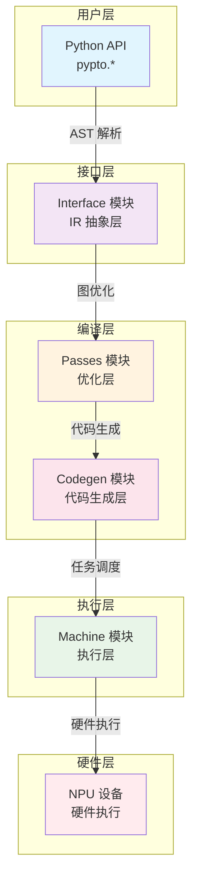
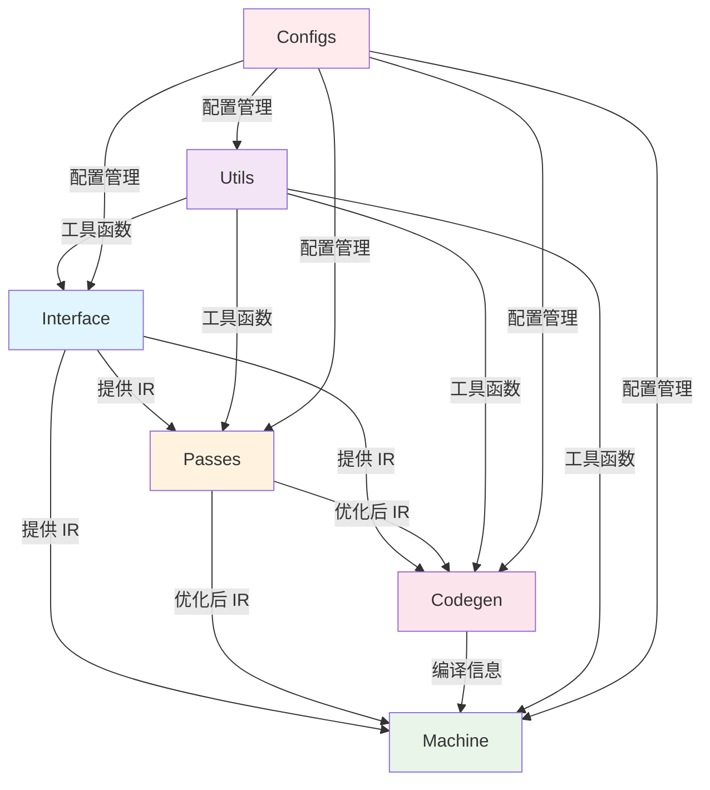
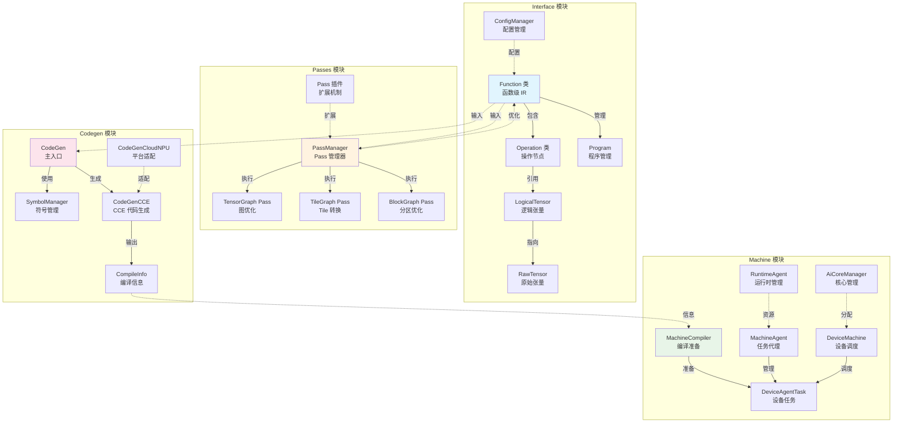
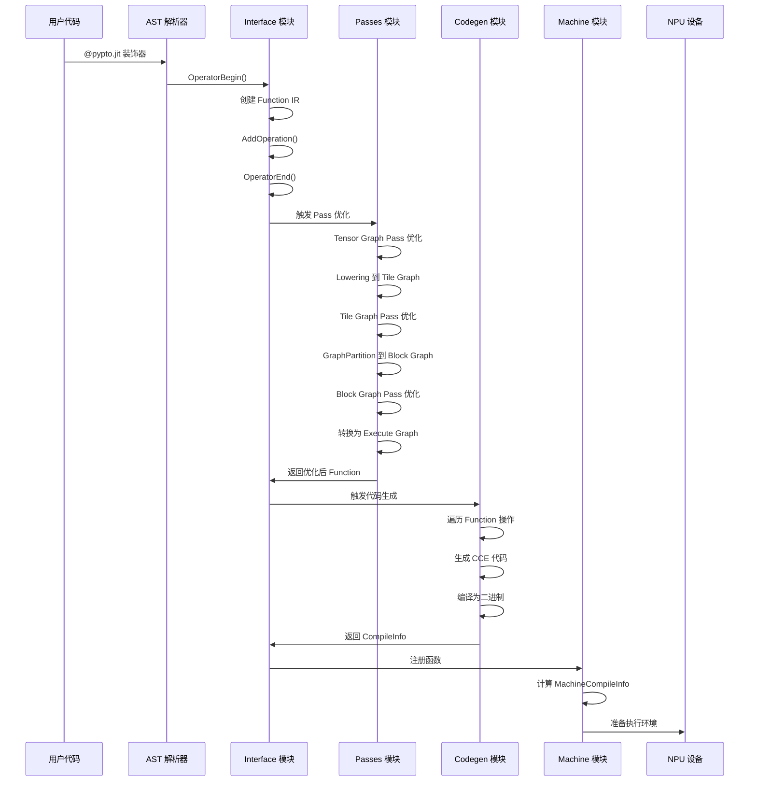
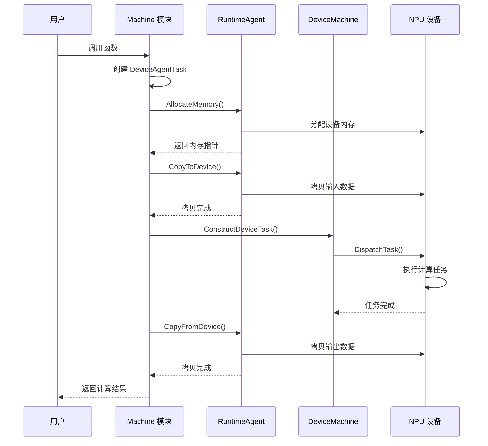
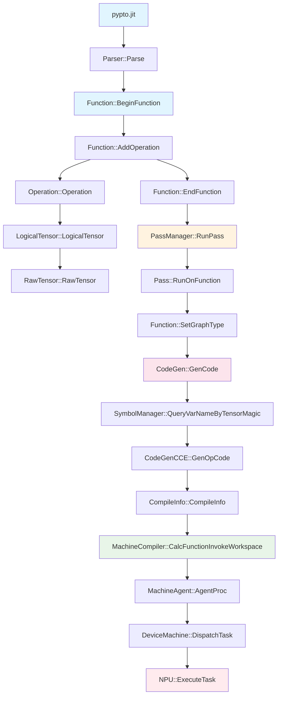
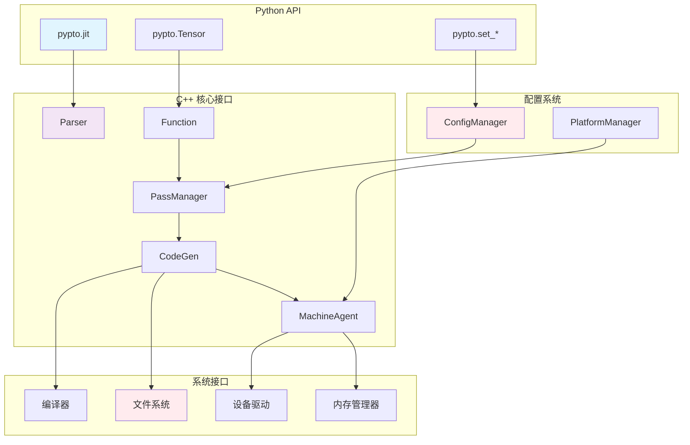
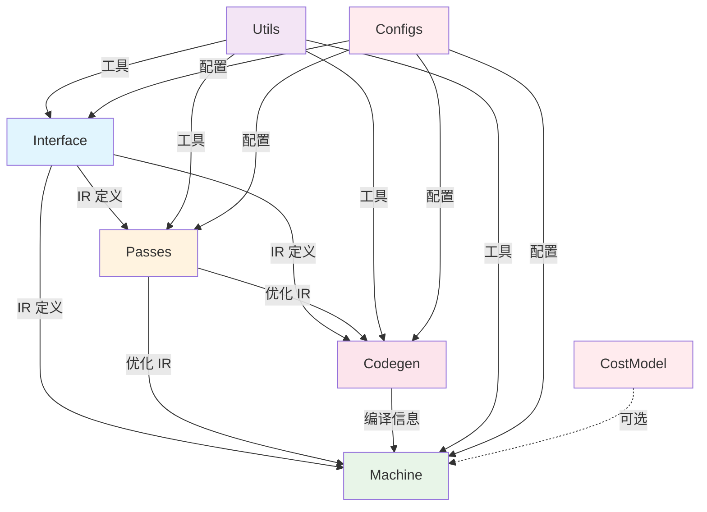
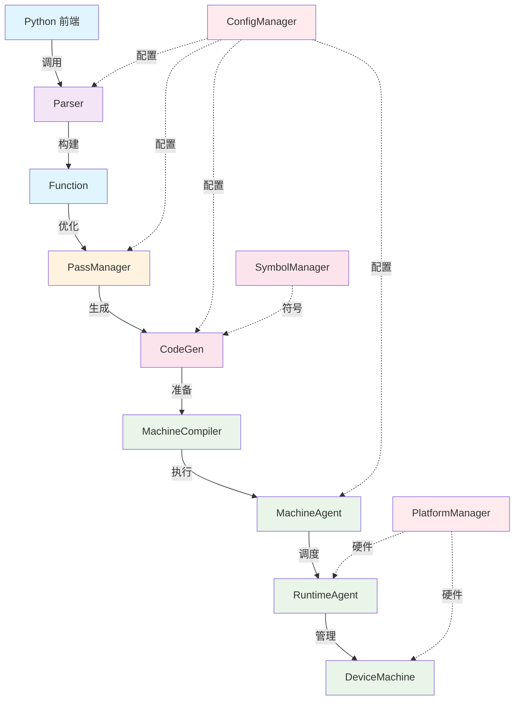

# PyPTO 模块关系图

> **适用对象：** 想要理解模块依赖关系的开发者、架构分析者  
> **学习时间：** 30-45分钟  
> **前置知识：** 已阅读[框架总览](00-overview.md)和[架构设计](11-architecture-design.md)  
> **学习目标：** 理解模块间的依赖关系、数据流和接口定义

## 概述

本文档详细展示 PyPTO 框架各模块之间的关系、依赖和交互流程。基于 `framework/src/CMakeLists.txt` 和核心源码的分析，帮助开发者理解模块间的协作机制和数据流转路径。

**文档价值：**
- **依赖关系**：清晰展示模块间的依赖
- **数据流**：理解数据在模块间的流转
- **接口定义**：了解模块间的接口规范
- **架构理解**：从依赖关系理解架构设计

## 从问题定位到模块（反向索引）

| 问题类型 | 相关模块 | 说明 |
|---------|---------|------|
| **性能问题** | [Passes 模块](07-passes.md)、[Machine 模块](06-machine.md)、[Codegen 模块](08-codegen.md) | Pass 优化、执行调度、代码生成都会影响性能 |
| **精度问题** | [Operation 模块](04-operation.md)、[Operator 模块](05-operator.md) | 操作实现和算子精度相关 |
| **编译失败** | [Codegen 模块](08-codegen.md)、[Build 系统](09-build.md) | 代码生成和构建系统相关 |
| **内存问题** | [Machine 模块](06-machine.md)、[Passes 模块](07-passes.md) | 内存分配和优化相关 |
| **控制流问题** | [Function 模块](03-function.md)、[Codegen 模块](08-codegen.md) | 函数级 IR 和代码生成相关 |

**相关文档：**
- [框架总览](00-overview.md) - PyPTO 框架技术文档总览
- [架构设计总结](11-architecture-design.md) - PyPTO 架构设计理念
- [核心概念详解](10-concepts.md) - PyPTO 核心概念和术语解释

---

## 目录

- [整体架构图](#整体架构图)
- [模块职责分工](#模块职责分工)
- [数据流关系](#数据流关系)
- [调用关系图](#调用关系图)
- [依赖关系分析](#依赖关系分析)
- [关键接口设计](#关键接口设计)
- [通信机制](#通信机制)
- [总结](#总结)

---

## 整体架构图

### 4层架构模型

基于 PyPTO 的分层设计理念：



### 模块组织结构

基于 `framework/src/CMakeLists.txt` 的模块依赖关系：



### 模块内部结构

各模块的核心组件和内部关系：



---

## 模块职责分工

### Interface 模块职责

**核心功能：**
- IR 构建和管理：从 Python AST 构建中间表示
- 张量生命周期管理：管理张量的创建、引用和销毁
- 函数抽象定义：提供函数级 IR 的核心抽象
- 操作节点管理：管理计算图的基本节点
- 配置管理：提供全局配置管理功能

**主要组件：**

```cpp
// framework/src/interface/function/function.h
class Function {
public:
    // 核心功能
    void AddOperation(std::unique_ptr<Operation> op);
    Status SortOperations();
    uint64_t ComputeHash() const;

private:
    std::vector<std::unique_ptr<Operation>> operations_;  // 操作序列
    std::map<std::string, std::unique_ptr<LogicalTensor>> tensorMap_;  // 张量映射
    std::vector<std::unique_ptr<LogicalTensor>> inCasts_, outCasts_;  // 输入输出
};
```

```cpp
// framework/src/interface/operation/operation.h
class Operation {
public:
    // 操作数管理
    Status ReplaceInputOperand(size_t index, Operand newOperand);
    const std::vector<Operand>& GetInputOperands() const;
    const std::vector<Operand>& GetOutputOperands() const;

private:
    Opcode opcode_;                    // 操作码
    std::vector<Operand> iOperands_;   // 输入操作数
    std::vector<Operand> oOperands_;   // 输出操作数
    OpAttribute opAttribute_;          // 操作属性
};
```

### Passes 模块职责

**核心功能：**
- 图优化和转换：对多层级 IR 进行优化
- 多层级 IR 转换：Tensor Graph → Tile Graph → Block Graph → Execute Graph
- 性能优化 Pass：内存优化、调度优化等
- 插件化扩展：支持自定义 Pass 开发

**主要组件：**

```cpp
// framework/src/passes/pass_mgr/pass_manager.h
class PassManager {
public:
    Status RegisterPass(std::unique_ptr<Pass> pass);
    Status RunPass(Function *func, PassType type);
    Status RunPassChain(Function *func, const std::vector<PassType>& types);

private:
    std::map<PassType, std::vector<std::unique_ptr<Pass>>> passes_;
};
```

```cpp
// framework/src/passes/pass_interface/pass.h
class Pass {
public:
    virtual Status RunOnFunction(Function *func) = 0;
    virtual PassType GetPassType() const = 0;
    virtual std::string GetPassName() const = 0;

    Status PreRun(Function *func);
    Status PostRun(Function *func);
};
```

### Codegen 模块职责

**核心功能：**
- 代码生成和编译：将优化后的 IR 转换为 CCE 代码
- 符号管理和绑定：管理变量名和类型绑定
- CCE 代码生成：生成平台特定的汇编代码
- 编译优化：提供编译时优化选项

**主要组件：**

```cpp
// framework/src/codegen/codegen.h
class CodeGen {
public:
    Status GenCode(const Function *func, CompileInfo *compileInfo);

private:
    std::unique_ptr<CodeGenCCE> cceGen_;
    std::unique_ptr<SymbolManager> symbolMgr_;
};
```

```cpp
// framework/src/codegen/symbol_mgr/codegen_symbol.h
class SymbolManager {
public:
    std::string QueryVarNameByTensorMagic(uint64_t magic) const;
    Status BindVarName(uint64_t magic, const std::string& name);

private:
    std::map<uint64_t, SymbolInfo> symbolTable_;
};
```

### Machine 模块职责

**核心功能：**
- 编译信息准备：计算工作空间大小、参数偏移等
- 设备任务调度：MPMD 模式的设备端任务管理
- 运行时管理：内存管理、流管理、错误处理
- 执行结果处理：结果拷贝和错误报告

**主要组件：**

```cpp
// framework/src/machine/host/machine_compiler.h
struct MachineCompileInfo {
    uint64_t workspaceSize_;           // 工作空间大小
    std::vector<InvokeParaOffset> paramOffsets_;  // 参数偏移
    std::vector<Function*> functions_; // 函数列表
};
```

```cpp
// framework/src/machine/runtime/machine_agent.h
class MachineAgent {
public:
    Status AgentProc(DeviceAgentTask *task);
    Status PrepareWorkSpace(DeviceAgentTask *task);
    Status PrepareInvokeEntry(DeviceAgentTask *task);

private:
    std::unique_ptr<RuntimeAgent> runtimeAgent_;
};
```

---

## 数据流关系

### 编译时数据流

完整的编译流程数据流转：



### 运行时数据流

从函数调用到结果返回的数据流：



### 数据流优化点

**编译时优化：**
- **IR 复用**：相同的子图可以被复用，避免重复编译
- **常量折叠**：编译时计算常量表达式
- **死代码消除**：移除不会被使用的代码路径

**运行时优化：**
- **内存复用**：张量生命周期分析，复用内存缓冲区
- **数据预取**：预测数据访问模式，提前准备数据
- **流水线执行**：计算和数据传输并行执行

---

## 调用关系图

### 主要调用链



### 接口调用关系



### 关键接口定义

**Function 接口：**
```cpp
class Function {
public:
    // 生命周期管理
    static Function* BeginFunction(const std::string& name);
    Status EndFunction();

    // 操作管理
    Status AddOperation(std::unique_ptr<Operation> op);
    const std::vector<std::unique_ptr<Operation>>& GetOperations() const;

    // 张量管理
    LogicalTensor* AddInput(const Shape& shape, DataType dtype);
    LogicalTensor* AddOutput(const Shape& shape, DataType dtype);

    // 图类型转换
    Status SetGraphType(GraphType type);
    GraphType GetGraphType() const;
};
```

**Pass 接口：**
```cpp
class Pass {
public:
    virtual Status RunOnFunction(Function* func) = 0;
    virtual PassType GetPassType() const = 0;
    virtual std::string GetPassName() const = 0;

protected:
    Status PreCheck(Function* func);
    Status PostCheck(Function* func);
};
```

**CodeGen 接口：**
```cpp
class CodeGen {
public:
    virtual Status GenCode(const Function* func, CompileInfo* info) = 0;
    virtual Status Compile(const CompileInfo* info) = 0;

protected:
    SymbolManager* GetSymbolManager();
    std::string GenerateVarName(const LogicalTensor* tensor);
};
```

**Machine 接口：**
```cpp
class MachineAgent {
public:
    virtual Status Initialize() = 0;
    virtual Status AgentProc(DeviceAgentTask* task) = 0;
    virtual Status Finalize() = 0;

protected:
    RuntimeAgent* GetRuntimeAgent();
    DeviceMachine* GetDeviceMachine();
};
```

---

## 依赖关系分析

### 构建依赖关系

基于 `CMakeLists.txt` 的模块依赖：



**依赖说明：**
- **Interface**：基础模块，其他所有模块都依赖它提供的 IR 定义
- **Passes**：依赖 Interface 的 IR，需要在 Codegen 和 Machine 之前运行
- **Codegen**：依赖优化后的 IR，需要在 Machine 之前完成代码生成
- **Machine**：依赖编译信息，需要最后执行
- **Utils**：工具库，被所有模块使用
- **Configs**：配置管理，被所有模块使用

### 运行时依赖关系



**运行时依赖特点：**
- **单向依赖**：数据流从前向后单向流动
- **配置注入**：ConfigManager 在运行时为各模块提供配置
- **硬件抽象**：PlatformManager 提供硬件相关的运行时信息
- **符号管理**：SymbolManager 在代码生成阶段管理符号表

### 循环依赖避免

PyPTO 通过以下方式避免循环依赖：

1. **接口分离**：使用抽象基类定义接口，具体实现分离
2. **依赖注入**：通过构造函数或 setter 注入依赖
3. **工厂模式**：使用工厂创建具体实例
4. **事件驱动**：通过回调机制解耦模块间通信

---

## 关键接口设计

### 数据接口

**IR 接口层次：**
```cpp
// 基础数据结构
class RawTensor;           // 底层数据存储
class LogicalTensor;       // 逻辑视图
class Operation;           // 计算操作
class Function;            // 函数容器

// 关系定义
class Operand {            // 操作数引用
    LogicalTensor* tensor_;
    bool isOutput_;
};

// 类型定义
using Shape = std::vector<int64_t>;
using DataType = enum class DataType { FP32, FP16, INT32, ... };
```

### 控制接口

**Pass 控制接口：**
```cpp
enum class PassType {
    TENSOR_GRAPH_PASS,
    TILE_GRAPH_PASS,
    BLOCK_GRAPH_PASS
};

struct PassConfig {
    bool enable{true};
    int priority{0};
    std::map<std::string, std::string> options;
};
```

**编译控制接口：**
编译选项通过 `pypto.jit` 的 `codegen_options`、`host_options`、`pass_options`、`runtime_options` 参数配置（参考 @docs/api/config/pypto-jit.md）。

### 执行接口

**任务执行接口：**
```cpp
struct DeviceAgentTask {
    MachineCompileInfo compileInfo_;
    std::vector<void*> inputBuffers_;
    std::vector<void*> outputBuffers_;
    std::vector<size_t> bufferSizes_;
};

class TaskExecutor {
public:
    virtual Status Execute(DeviceAgentTask* task) = 0;
    virtual Status GetResult(DeviceAgentTask* task) = 0;
};
```

---

## 通信机制

### 模块间通信方式

| 通信方式 | 使用场景 | 实现机制 | 优点 | 缺点 |
|---------|---------|---------|------|------|
| **直接调用** | 同步处理 | 函数调用栈 | 简单、高效 | 紧耦合 |
| **配置传递** | 参数配置 | ConfigManager 单例 | 灵活、集中管理 | 全局状态 |
| **事件通知** | 状态变更 | 回调函数 | 松耦合、可扩展 | 异步复杂 |
| **数据流** | IR 传递 | 指针引用 | 类型安全 | 生命周期管理 |
| **插件机制** | 扩展功能 | 工厂 + 注册表 | 高度可扩展 | 复杂性高 |

### 通信协议

**配置通信：**
```cpp
// 配置查询
auto config = ConfigManager::Instance().GetPlatformConfig("tile_size", 128);

// 配置设置
ConfigManager::Instance().SetPlatformConfig("optimization_level", 3);
```

**状态同步：**
```cpp
// 状态回调
class StatusCallback {
public:
    virtual void OnCompileStart(const std::string& functionName) = 0;
    virtual void OnCompileEnd(const std::string& functionName, Status status) = 0;
    virtual void OnExecutionStart(const DeviceAgentTask* task) = 0;
    virtual void OnExecutionEnd(const DeviceAgentTask* task, Status status) = 0;
};
```

**错误传播：**
```cpp
// 错误码定义
enum class ErrorCode {
    SUCCESS = 0,
    INVALID_ARGUMENT = 1,
    OUT_OF_MEMORY = 2,
    COMPILATION_FAILED = 3,
    EXECUTION_FAILED = 4
};

// 错误信息结构
struct ErrorInfo {
    ErrorCode code;
    std::string message;
    std::string file;
    int line;
    std::vector<std::string> stackTrace;
};
```

---

## 总结

PyPTO 框架的模块关系体现了以下核心特点：

### 1. 清晰的分层架构
- **用户层**：Python API，提供友好的编程接口
- **接口层**：IR 抽象，统一的数据和控制接口
- **编译层**：优化和代码生成，实现性能优化
- **执行层**：任务调度和运行时管理，确保正确执行
- **硬件层**：NPU 设备，实际的计算执行

### 2. 模块化设计
- **单一职责**：每个模块专注于特定的功能领域
- **接口清晰**：通过抽象基类定义稳定的接口契约
- **依赖明确**：基于 CMakeLists.txt 的构建依赖关系
- **扩展性好**：插件机制支持功能扩展

### 3. 数据流驱动
- **编译时数据流**：从 Python 代码到可执行代码的转换流程
- **运行时数据流**：从函数调用到结果返回的执行流程
- **优化贯穿始终**：在每个阶段都进行相应的优化

### 4. 通信机制完善
- **多种通信方式**：直接调用、配置传递、事件通知等
- **类型安全**：强类型接口和数据结构
- **错误处理**：完善的错误传播和处理机制

### 5. 架构演进友好
- **抽象层稳定**：核心接口长期保持稳定
- **实现层灵活**：具体实现可以根据需求调整
- **扩展点明确**：预留了足够的扩展接口

理解这些模块关系有助于开发者：
- **快速定位问题**：根据错误位置快速找到相关模块
- **理解优化流程**：掌握编译和执行的完整流程
- **进行二次开发**：基于模块接口进行功能扩展
- **优化系统性能**：识别性能瓶颈和优化机会
- **维护代码质量**：遵循模块职责和接口约定

---

**相关文档：**
- [架构设计总结](11-architecture-design.md) - 深入理解架构设计理念
- [API 使用总结](12-api-reference.md) - 了解 API 使用方式
- [核心概念详解](10-concepts.md) - 理解核心概念
