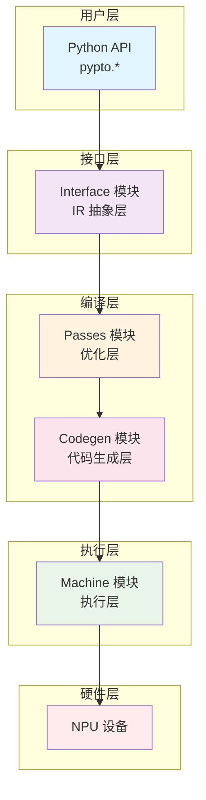

# PyPTO 架构设计文档

> **适用对象：** 想要从工程实现角度理解PyPTO的开发者、框架贡献者  
> **学习时间：** 60-90分钟  
> **前置知识：** 已阅读[框架总览](00-overview.md)与[核心概念](10-concepts.md)  
> **学习目标：** 把“架构图/模块职责”落到源码入口、关键数据结构与关键边界（编译/执行）

## 概述

本文档总结 PyPTO 框架的整体架构设计理念、关键设计决策和模块关系，并补充“从源码看架构”的关键落点，帮助你把文档理解映射到真实工程实现上。

**从源码看架构的三条主线：**
- **Python 前端入口（JIT/Parser）**：`python/pypto/runtime.py` 与 `python/pypto/frontend/parser/entry.py`
- **IR/编译链路（Interface→Passes→Codegen）**：`framework/src/interface` → `framework/src/passes` → `framework/src/codegen`
- **执行/运行时（Machine/Runtime）**：`framework/src/machine` + `pypto_impl` 暴露的执行API

**相关文档：**
- [框架总览](00-overview.md) - PyPTO 框架技术文档总览（包含详细模块介绍）
- [核心概念详解](10-concepts.md) - PyPTO 核心概念和术语解释
- [模块关系图](13-module-relationships.md) - 模块间关系和数据流
- [API 使用总结](12-api-reference.md) - API 使用指南

---

## 目录

- [架构设计理念](#架构设计理念)
- [核心设计原则](#核心设计原则)
- [关键设计决策](#关键设计决策)
- [模块架构图](#模块架构图)
- [数据流设计](#数据流设计)
- [架构演进历史](#架构演进历史)
- [总结](#总结)

---

## 架构设计理念

### PTO 编程范式

**核心思想：**
PyPTO 基于 PTO（Parallel Tensor/Tile Operation）编程范式，将 Tensor 作为数据的基本表达方式，通过一系列对 Tensor 的基本运算来描述并组装完整的计算流程。

**设计理念：**
- **Tensor 级别抽象**：以 Tensor 而非单个元素描述计算，贴近算法设计者的数学表达式
- **声明式编程**：开发者只需描述"做什么"，框架自动处理"怎么做"
- **基于 Tile 的计算**：所有计算最终都基于 Tile（硬件感知的数据块）进行，充分利用硬件并行计算能力
- **计算图驱动**：通过构建计算图，框架可以自动进行优化、调度和执行

**实现依据：**
从 `README.md` 可以看到，PyPTO 的核心特性正是基于这一理念：
```markdown
- **基于 Tile 的编程模型**: 所有计算都基于 Tile（硬件感知的数据块）进行, 充分利用硬件并行计算能力和内存层次结构
- **多层级计算图转换**: 通过编译 Pass 将 Tensor Graph 转换为 Tile Graph、Block Graph 和 Execution Graph
```

### 分层抽象设计

**三层用户视图：**
PyPTO 为不同层次的开发者提供了分层的抽象：

- **Tensor 层**：算法开发者使用 Tensor 和 Tensor Operation 构建计算图
- **Tile 层**：性能优化专家使用 Tile 和 Tile Operation 进行深度优化
- **Block 层**：系统开发者使用 Block 层次进行系统级优化

**实现方式：**
- **多层级 IR 系统**：Tensor Graph → Tile Graph → Block Graph → Execute Graph
- **渐进式 Lowering**：通过 Pass 逐步降低抽象层次
- **模块化 Pass 优化**：不同层次的 Pass 针对特定优化目标

### 编译驱动架构

**编译时优化为主：**
PyPTO 采用编译时优化为主的设计理念，通过复杂的编译流程实现运行时的高性能。

**关键组件：**
- **Pass 框架**：模块化的优化 Pass 系统
- **代码生成器**：将优化后的 IR 转换为高效的 CCE 代码
- **执行调度器**：MPMD 模式的设备端任务调度

---

## 核心设计原则

### 1. 模块化设计原则

**单一职责：**
PyPTO 将框架分为四个核心模块，每个模块职责明确：

- **Interface 模块**：IR 抽象和管理，负责构建和管理中间表示
- **Passes 模块**：编译优化层，负责多层级 IR 的优化和转换
- **Codegen 模块**：代码生成层，将优化后的 IR 转换为可执行代码
- **Machine 模块**：执行层，负责设备端任务调度和执行

**接口清晰：**
每个模块定义明确的输入输出接口，通过抽象基类定义接口契约。

**实现示例：**
```cpp
// framework/src/passes/pass_interface/pass.h
class Pass {
public:
    virtual Status RunOnFunction(Function *func) = 0;
    virtual PassType GetPassType() const = 0;
    virtual std::string GetPassName() const = 0;
};
```

### 2. 可扩展性原则

**插件化架构：**
PyPTO 支持多种插件扩展机制：

- **Pass 插件系统**：开发者可以实现自定义优化 Pass
- **Operator 插件系统**：支持添加新的算子实现
- **Codegen 扩展机制**：支持新的代码生成后端

**配置驱动：**
- **JSON 配置文件**：灵活的配置选项
- **环境变量配置**：运行时配置调整
- **API 配置**：编程式配置

**实现示例：**
```cpp
// framework/src/interface/configs/config_manager.h
class ConfigManager {
public:
    template <typename T>
    auto GetPlatformConfig(const std::string &key, const T &defaultValue);

    template <typename T>
    auto GetHostConfig(const std::string &key, const T &defaultValue);

    template <typename T>
    auto GetDeviceConfig(const std::string &key, const T &defaultValue);
};
```

### 3. 性能优先原则

**编译时优化：**
- **多层级 Pass 优化**：Tensor Graph、Tile Graph、Block Graph 各层次优化
- **图变换和重写**：代数化简、常量折叠、死代码消除等
- **内存布局优化**：内存重用、缓冲区合并等

**运行时优化：**
- **MPMD 调度**：Multiple Program Multiple Data 并行执行模式
- **内存重用**：最大化利用设备内存
- **流水线并行**：指令级和任务级并行

---

## 关键设计决策

### 决策 1：多层级 IR 设计

**问题：** 如何平衡抽象层次和优化能力？

**决策：**
PyPTO 采用 4 层 IR 设计，支持从高层次到低层次的逐步转换：
- **Tensor Graph**：算法抽象，易于理解和优化
- **Tile Graph**：硬件感知，体现内存层次和并行性
- **Block Graph**：并行执行，子图切分和资源管理
- **Execute Graph**：调度执行，依赖关系和执行顺序

**依据：**
1. **算法友好性**：Tensor Graph 让算法开发者专注于算法逻辑
2. **硬件感知性**：Tile Graph 能够体现硬件的内存层次和并行特性
3. **优化空间**：多层级 IR 为不同阶段的优化提供了空间
4. **渐进式优化**：Lowering 过程允许逐步精确化表示

**实现示例：**
```cpp
// framework/src/interface/function/function.h
enum class GraphType {
    TENSOR_GRAPH,   // 算法抽象
    TILE_GRAPH,     // 硬件感知
    BLOCK_GRAPH,    // 并行执行
    EXECUTE_GRAPH   // 调度执行
};
```

### 决策 2：Pass 驱动优化

**问题：** 如何实现可扩展的编译优化系统？

**决策：**
设计统一的 Pass 框架，分类组织 Pass，支持 Pass 组合和策略。

**核心组件：**
- **Pass 基类**：统一的 Pass 接口
- **PassManager**：Pass 管理和执行
- **Pass 分类**：Tensor Graph Pass、Tile Graph Pass、Block Graph Pass
- **Pass 策略**：Pass 执行顺序和依赖关系

**实现示例：**
```cpp
// framework/src/passes/pass_mgr/pass_manager.h
class PassManager {
public:
    Status RegisterPass(std::unique_ptr<Pass> pass);
    Status RunPass(Function *func, PassType type);

private:
    std::map<PassType, std::vector<std::unique_ptr<Pass>>> passes_;
};
```

### 决策 3：配置管理系统

**问题：** 如何管理复杂的配置选项？

**决策：**
采用分层配置系统，支持多种配置方式和运行时更新。

**配置层次：**
- **全局配置**：框架级配置选项
- **平台配置**：平台相关的配置
- **主机配置**：主机端相关的配置
- **设备配置**：设备端相关的配置
- **核心配置**：计算核心相关的配置

**实现示例：**
```cpp
// framework/src/interface/configs/config_manager.h
struct GlobalPassConfigs {
    bool enablePassConfigs{false};
    PassConfigs defaultPassConfigs;
};

struct InternalGlobalConfig {
    std::string logTopFolder;
    std::string logTensorGraphFolder;
    std::string logFile;
};
```

---

## 架构层次设计

### 4层架构模型

PyPTO 采用分层架构设计，从用户 API 到硬件执行的完整技术栈：



**层次职责分工：**
- **用户层**：提供友好的 Python API 接口
- **接口层**：构建和管理中间表示 (IR)
- **编译层**：优化转换和代码生成
- **执行层**：任务调度和设备执行
- **硬件层**：NPU 等 AI 加速器

详细的模块职责和内部结构请参考：[框架总览](00-overview.md#核心模块概览)

---

## 数据流架构

### 编译时 vs 运行时分离

PyPTO 采用编译时优化和运行时执行分离的架构设计：

**编译时数据流：**
- **输入**：Python 代码和配置参数
- **处理**：多层级 IR 转换和优化
- **输出**：优化的可执行代码和元数据

**运行时数据流：**
- **输入**：编译生成的二进制和实际数据
- **处理**：高效的任务调度和执行
- **输出**：计算结果

### 关键设计决策

**数据流设计的考量：**
1. **性能优先**：编译时做尽可能多的优化工作
2. **灵活性**：运行时适应不同的输入形状和数据类型
3. **可靠性**：清晰的错误传播和异常处理机制

详细的数据流图和组件说明请参考：[框架总览](00-overview.md#完整编译执行流程)

---

## 总结

### 核心设计理念

PyPTO 的架构设计基于以下核心理念：

1. **PTO 编程范式**：基于 Tensor 的编程模型，通过 Tile 实现硬件感知计算
2. **分层抽象设计**：从 Tensor 层到硬件层的渐进式抽象
3. **编译驱动架构**：编译时优化为主，运行时高效执行
4. **模块化设计原则**：清晰的职责分工和接口契约
5. **可扩展性原则**：插件化架构支持灵活扩展
6. **性能优先原则**：全方位优化确保高性能

### 关键设计决策

1. **多层级 IR 设计**：平衡抽象层次和优化能力
2. **Pass 驱动优化**：可扩展的编译优化框架
3. **配置管理系统**：分层配置支持灵活定制
4. **4层架构模型**：从用户API到硬件执行的完整技术栈

### 架构优势

- **高性能**：编译时优化 + 运行时效率
- **易用性**：分层抽象满足不同开发者需求
- **可扩展性**：插件化设计支持持续演进
- **可靠性**：模块化设计确保系统稳定性

这些设计决策确保了 PyPTO 在 AI 编程框架领域的竞争力，为开发者提供了强大而易用的工具。

---

**相关文档：**
- [框架总览](00-overview.md) - 完整的技术栈介绍和详细模块说明
- [核心概念详解](10-concepts.md) - 理解 PyPTO 的核心概念
- [模块关系图](13-module-relationships.md) - 模块间关系和数据流
- [API 使用总结](12-api-reference.md) - API 使用方式
