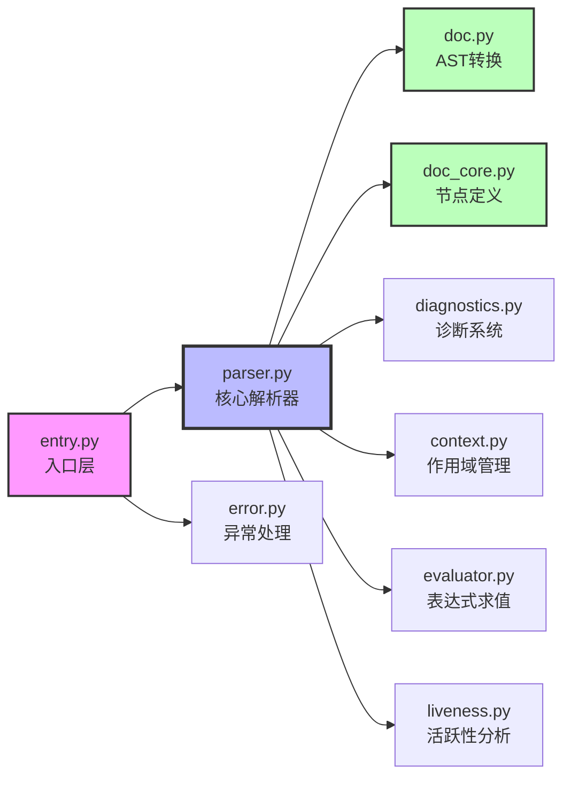
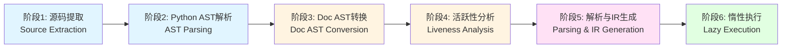
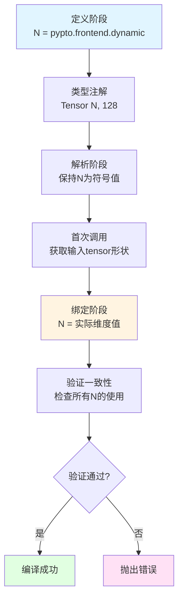
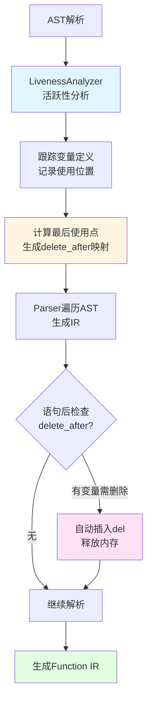
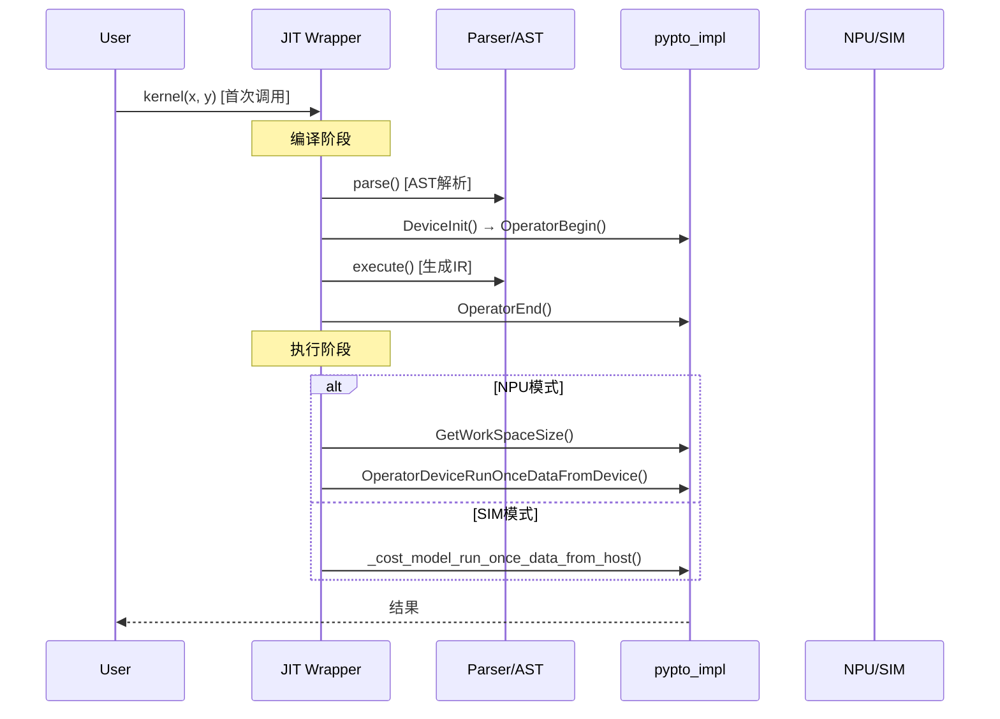

# PyPTO Frontend 技术文档

> **适用对象：** 需要深入理解 PyPTO 前端解析器的开发者、框架贡献者  
> **学习时间：** 60-90分钟  
> **前置知识：** 已阅读[框架总览](00-overview.md)、[Framework 模块文档](03-framework.md)  
> **学习目标：** 理解 `pypto.frontend` 的技术方案、实现细节、与其他模块的关系

## 概述

`pypto.frontend` 是 PyPTO 框架的新一代前端解析器，基于 AST（抽象语法树）实现，负责将用户编写的 Python 函数（通过 `@pypto.frontend.jit` 装饰）转换为 PyPTO 中间表示（IR）。该模块在 commit `58ae66e7e7a6344cd7975e52289585e0a312399e` 中引入，提供了比旧版 `@pypto.jit` 更强大的功能和更好的用户体验。

**核心特性：**

| 特性 | 说明 |
|------|------|
| 🎯 **基于 AST 的解析** | 使用 Python 标准 AST 和自定义 doc AST 进行静态解析，提供版本独立性 |
| 🔍 **改进的诊断系统** | 提供带源码位置的详细错误信息，包含错误上下文和位置指示符 |
| 🔄 **嵌套函数内联** | 支持 `@pypto.frontend.function` 装饰的嵌套函数自动内联展开 |
| 📦 **闭包/局部变量捕获** | 改进的闭包和局部变量捕获机制，支持解析时变量表 |
| ⚡ **惰性执行** | 延迟解析到首次调用，支持动态形状绑定和代价模型评估 |

**特性对比（与旧版 `@pypto.jit`）：**

| 特性 | `@pypto.jit` | `@pypto.frontend.jit` |
|------|-------------|---------------------|
| 🎯 **解析方式** | 运行时反射 | ✅ AST 静态解析 |
| 🔍 **错误诊断** | 基础信息 | ✅ 源码位置+上下文 |
| 🔄 **嵌套函数** | ❌ | ✅ 支持内联 |
| 📦 **动态维度** | ⚠️ 有限 | ✅ 完整支持 |
| ⚡ **内存管理** | 手动 | ✅ 自动管理 |
| 🎨 **控制流** | ⚠️ 有限 | ✅ 完整支持 |

**相关文档：**
- [Framework 模块文档](03-framework.md) - 前端解析流水线概述
- [API 参考](02-api-reference.md) - `pypto.frontend.jit` API 使用
- [Function 类文档](05-function.md) - 解析生成的 Function IR
- [Interface 模块文档](04-interface.md) - IR 抽象层

---

## 目录

**基础篇（快速上手）**
- [1. 架构设计](#1-架构设计) - 整体架构和模块划分
- [2. 解析流水线](#2-解析流水线) - 六阶段解析流程
- [3. 使用示例](#3-使用示例) - 实际代码示例

**进阶篇（深入理解）**
- [4. 核心模块详解](#4-核心模块详解) - 各模块职责和实现
- [5. 关键技术方案](#5-关键技术方案) - 核心技术实现

**高级篇（原理与对比）**
- [6. AST 应用原理与实现细节](#6-ast-应用原理与实现细节) - AST 遍历和控制流实现
- [7. `pypto.frontend.jit` 与 `pypto.jit` 原理对比](#7-pyptofrontendjit-与-pyptojit-原理对比) - 两套 API 深度对比

**实践篇（开发与调试）**
- [8. 调试与排障](#8-调试与排障) - 调试方法和常见问题
- [9. 扩展与定制](#9-扩展与定制) - 扩展解析器功能
- [10. 性能优化建议](#10-性能优化建议) - 性能优化技巧

---

## 1. 架构设计

### 1.1 整体架构

`pypto.frontend` 采用分层模块化设计，从用户 API 到底层解析实现，共分为以下几个层次：

```mermaid
graph TB
    A[用户代码<br/>@pypto.frontend.jit] -->|装饰器| B[entry.py<br/>入口层]
    B -->|Source提取| C[diagnostics.py<br/>源码管理]
    C -->|AST解析| D[doc.py/doc_core.py<br/>AST转换层]
    D -->|活跃性分析| E[liveness.py<br/>内存管理]
    E -->|解析生成IR| F[parser.py<br/>核心解析器]
    F -->|变量作用域| G[context.py<br/>作用域管理]
    F -->|表达式求值| H[evaluator.py<br/>表达式求值]
    F -->|错误报告| I[diagnostics.py<br/>诊断系统]
    F -->|生成Function| J[pypto.Function<br/>IR对象]
    J -->|编译执行| K[后端编译流程]
    
    style A fill:#f9f,stroke:#333,stroke-width:4px
    style F fill:#bbf,stroke:#333,stroke-width:3px
    style J fill:#bfb,stroke:#333,stroke-width:2px
```

### 1.2 模块职责划分

**模块职责与代码规模：**

| 模块 | 文件 | 职责 | 代码行数 | 占比 | 复杂度 |
|------|------|------|---------|------|--------|
| **核心解析器** | `parser.py` | AST 遍历、IR 生成、Visitor 模式实现 | 1723 | 35.2% | ⭐⭐⭐⭐⭐ |
| **AST 节点定义** | `doc_core.py` | doc AST 节点类定义 | 1348 | 27.5% | ⭐⭐⭐ |
| **入口层** | `entry.py` | JIT 装饰器、JitCallableWrapper、运行时集成 | 843 | 17.2% | ⭐⭐⭐ |
| **AST 转换** | `doc.py` | Python AST ↔ doc AST 双向转换 | 557 | 11.4% | ⭐⭐⭐ |
| **诊断系统** | `diagnostics.py` | 错误报告、源码位置追踪 | 542 | 11.1% | ⭐⭐ |
| **活跃性分析** | `liveness.py` | 变量使用分析、自动内存管理 | 318 | 6.5% | ⭐⭐⭐ |
| **作用域管理** | `context.py` | 变量作用域、生命周期管理 | 235 | 4.8% | ⭐⭐ |
| **表达式求值** | `evaluator.py` | 表达式求值、常量解析 | 132 | 2.7% | ⭐⭐ |
| **异常处理** | `error.py` | 异常类定义、回溯控制 | 95 | 1.9% | ⭐ |
| **总计** | - | - | **4893** | **100%** | - |

**模块依赖关系：**



### 1.3 设计原则

1. **版本独立性**：通过 doc AST 抽象层隔离 Python 版本差异
2. **可扩展性**：基于注册机制的 AST 转换系统，易于扩展新节点类型
3. **用户友好**：丰富的错误诊断信息，带源码上下文和位置指示
4. **性能优化**：惰性解析、签名缓存、自动内存管理
5. **类型安全**：通过类型注解进行静态检查和动态验证

---

## 2. 解析流水线

### 2.1 六阶段流水线

`pypto.frontend` 的解析过程分为六个主要阶段：



#### 阶段 1：源码提取（Source Extraction）

**实现位置：** `parser/diagnostics.py::Source`

**功能：**
- 使用 Python `inspect` 模块提取被装饰函数的源码
- 处理特殊场景：Jupyter Notebook、嵌套类、闭包函数
- 保留源码位置信息（文件名、行号、列号）用于错误报告

**关键技术：**
- `inspect.getsource()` / `inspect.findsource()` 获取源码
- `inspect.getsourcelines()` 获取源码行和起始行号
- 处理缩进对齐（去除公共前导空格）
- Jupyter Notebook 兼容性处理

**示例：**
```python
from pypto.frontend.parser.diagnostics import Source

@pypto.frontend.jit()
def my_kernel(x):
    return x + 1

# Source 类自动提取函数源码
source = Source(my_kernel)
print(source.source_name)  # 文件名
print(source.start_line)   # 起始行号
print(source.source)      # 源码内容
```

#### 阶段 2：Python AST 解析（AST Parsing）

**实现位置：** Python 标准库 `ast.parse()`

**功能：**
- 将 Python 源码解析为标准 AST
- 生成包含完整语法信息的 AST 节点树

**AST 节点类型：**
- `ast.FunctionDef`：函数定义
- `ast.Assign`：赋值语句
- `ast.Call`：函数调用
- `ast.For`：循环语句
- `ast.If`：条件语句
- `ast.Return`：返回语句
- 等等...

#### 阶段 3：Doc AST 转换（Doc AST Conversion）

**实现位置：** `parser/doc.py`、`parser/doc_core.py`

**功能：**
- 将 Python AST 转换为更稳定的 doc AST
- 提供版本独立的抽象接口
- 支持双向转换（Python AST ↔ doc AST）

**设计动机：**
- Python AST 在不同版本间可能有变化（如 Python 3.8 添加位置信息）
- doc AST 提供稳定的接口，隔离版本差异
- 简化解析器实现，移除不支持的 Python 特性（async/await、类型注释等）

**转换机制：**
```python
from pypto.frontend.parser import doc
import ast

# Python AST → doc AST
py_ast = ast.parse("def foo(): return 1")
doc_ast = doc.to_doc(py_ast)

# doc AST → Python AST
py_ast_again = doc.from_doc(doc_ast)
```

#### 阶段 4：活跃性分析（Liveness Analysis）

**实现位置：** `parser/liveness.py::LivenessAnalyzer`

**功能：**
- 分析变量的使用情况，确定"最后一次使用"的位置
- 生成自动删除点映射（statement ID → 变量名集合）
- 支持循环感知的分析（循环内变量特殊处理）

**分析流程：**
1. **跟踪定义**：记录每个变量的定义位置
2. **跟踪使用**：记录所有变量的使用位置（按顺序）
3. **计算最后使用**：确定每个变量的最后使用语句
4. **生成删除映射**：创建 `delete_after[stmt_id] = {var1, var2, ...}`

**特殊处理：**
- 循环变量（`for i in ...`）免于自动删除
- 循环内使用的变量在循环退出后删除（非每轮迭代）
- 循环内定义的变量可在每轮迭代后删除
- 显式 `del` 语句标记的变量免于自动删除

**示例：**
```python
@pypto.frontend.jit()
def example():
    a = pypto.tensor((16,), pypto.DT_FP32)  # 定义 a
    b = pypto.tensor((16,), pypto.DT_FP32)  # 定义 b
    c = pypto.add(a, b)                      # 使用 a, b；定义 c
    result = pypto.mul(c, 2)                # 使用 c；定义 result
    return result                            # 使用 result
    # a, b, c 在 return 后自动删除（基于活跃性分析）
```

#### 阶段 5：解析与 IR 生成（Parsing & IR Generation）

**实现位置：** `parser/parser.py::Parser`

**功能：**
- 使用 Visitor 模式遍历 doc AST
- 生成 PyPTO IR（`pypto.Function`、`pypto.Operation` 等）
- 管理变量作用域（通过 `Context`）
- 求值表达式（通过 `ExprEvaluator`）
- 报告错误（通过 `Diagnostics`）

**解析流程：**
```python
class Parser(doc.NodeVisitor):
    def parse(self):
        # 1. 准备 AST
        self._parsed_node = doc.to_doc(ast.parse(self.source.source))
        
        # 2. 运行活跃性分析
        analyzer = LivenessAnalyzer()
        analyzer.visit(self._parsed_node)
        self.delete_after = analyzer.get_deletion_map()
        
    def execute(self):
        # 3. 遍历 AST 生成 IR
        with self.context.with_frame():
            self.visit(self._parsed_node)
        return self._result  # pypto.Function
```

**Visitor 方法：**
- `visit_FunctionDef()`：处理函数定义，提取签名，解析函数体
- `visit_Assign()`：处理赋值，生成 Tensor 创建或操作
- `visit_Call()`：处理函数调用，转换为 PyPTO 操作
- `visit_For()`：处理循环，生成 `pypto.loop()` 调用
- `visit_If()`：处理条件，生成 `pypto.cond()` 调用
- `visit_Return()`：处理返回，设置函数输出

**核心机制：**
- **Visitor 模式**：Parser 继承 `doc.NodeVisitor`，通过 `visit()` 方法自动分发到对应的 `_visit_*` 方法
- **作用域管理**：使用 `context.with_frame()` 为每个作用域（函数体、循环体、if 分支）创建新帧
- **表达式求值**：通过 `_eval_expr()` 求值表达式，支持常量、变量、函数调用等
- **自动内存管理**：在每个语句后检查 `delete_after` 映射，自动删除不再使用的变量

> **详细实现**：参见[第6章 AST 应用原理与实现细节](#6-ast-应用原理与实现细节)

#### 阶段 6：惰性执行（Lazy Execution）

**实现位置：** `parser/entry.py::JitCallableWrapper`

**功能：**
- 延迟实际解析到首次函数调用
- 支持动态形状绑定（SymbolicScalar → 具体值）
- 集成代价模型评估
- 缓存解析结果

**执行流程：**
```python
class JitCallableWrapper:
    def __call__(self, *args):
        # 1. 首次调用：触发解析
        if not self._is_compiled:
            self._compile_if_needed(args)
        
        # 2. 绑定动态维度
        if has_symbolic_dims:
            self._bind_dynamic_dims(args)
        
        # 3. 执行编译（如果未编译）
        if not self._is_compiled:
            self._compile()
        
        # 4. 运行
        return self._run(args)
```

---

## 3. 使用示例

在前面的章节中，我们了解了 `pypto.frontend` 的架构和解析流水线。本章将通过实际代码示例展示如何使用 `@pypto.frontend.jit` 装饰器编写 JIT 编译的函数。

### 3.1 基础 JIT 编译

下面是一个简单的加法函数示例，展示了如何使用 `@pypto.frontend.jit()` 装饰器：

```python
import pypto
import torch

@pypto.frontend.jit()
def basic_add(
    a: pypto.Tensor((1024, 1024), pypto.DT_FP32),
    b: pypto.Tensor((1024, 1024), pypto.DT_FP32),
) -> pypto.Tensor((1024, 1024), pypto.DT_FP32):
    pypto.set_vec_tile_shapes(32, 32)
    result = pypto.tensor((1024, 1024), pypto.DT_FP32)
    result[:] = pypto.add(a, b)
    return result

# 调用（直接使用 torch.Tensor，自动转换为 pypto.Tensor）
a = torch.randn(1024, 1024, dtype=torch.float32, device='npu:0')
b = torch.randn(1024, 1024, dtype=torch.float32, device='npu:0')
c = basic_add(a, b)  # 首次调用会触发编译
```

**关键点说明：**
- 函数签名使用类型注解指定输入输出类型
- 使用 `pypto.tensor()` 创建输出 tensor
- 使用 `result[:] = ...` 进行 in-place 赋值
- 首次调用时会触发解析和编译

### 3.2 动态维度

当函数的输入形状在运行时才能确定时，可以使用动态维度。下面示例展示了如何定义和使用动态维度：

```python

```python
# 模块级别定义动态维度
B = pypto.frontend.dynamic("B")
SEQ_LEN = pypto.frontend.dynamic("SEQ_LEN")
HIDDEN = 768

@pypto.frontend.jit()
def attention_kernel(
    q: pypto.Tensor((B, SEQ_LEN, HIDDEN), pypto.DT_FP32),
    k: pypto.Tensor((B, SEQ_LEN, HIDDEN), pypto.DT_FP32),
    v: pypto.Tensor((B, SEQ_LEN, HIDDEN), pypto.DT_FP32),
) -> pypto.Tensor((B, SEQ_LEN, HIDDEN), pypto.DT_FP32):
    # B 和 SEQ_LEN 在运行时绑定
    return output

# 不同形状的输入（B 和 SEQ_LEN 在运行时绑定）
q1 = torch.randn(4, 128, 768, device='npu:0')  # B=4, SEQ_LEN=128
k1 = torch.randn(4, 128, 768, device='npu:0')
v1 = torch.randn(4, 128, 768, device='npu:0')
result1 = attention_kernel(q1, k1, v1)  # 首次调用时绑定 B=4, SEQ_LEN=128
```

**关键点说明：**
- 在模块级别使用 `pypto.frontend.dynamic()` 定义动态维度
- 在类型注解中使用动态维度符号（如 `B`, `SEQ_LEN`）
- 首次调用时，动态维度会根据输入 tensor 的实际形状自动绑定

### 3.3 嵌套函数内联

`@pypto.frontend.function` 装饰的嵌套函数会被自动内联到调用它的 JIT 函数中。下面示例展示了嵌套函数的使用：

```python

```python
@pypto.frontend.function
def add_bias(
    x: pypto.Tensor((128,), pypto.DT_FP32),
    bias: pypto.Tensor((128,), pypto.DT_FP32),
) -> pypto.Tensor((128,), pypto.DT_FP32):
    return pypto.add(x, bias)

@pypto.frontend.jit()
def layer_norm(
    x: pypto.Tensor((128,), pypto.DT_FP32),
    bias: pypto.Tensor((128,), pypto.DT_FP32),
) -> pypto.Tensor((128,), pypto.DT_FP32):
    normalized = pypto.normalize(x)
    result = add_bias(normalized, bias)  # add_bias 会被内联到 layer_norm 的 IR 中
    return result
```

**关键点说明：**
- `@pypto.frontend.function` 装饰的嵌套函数会被自动内联
- 内联后的代码等价于直接在 `layer_norm` 中调用 `pypto.add(normalized, bias)`
- 这样可以减少函数调用开销，提高性能

### 3.4 控制流

`pypto.frontend` 支持 `for` 循环和 `if` 条件语句。下面示例展示了如何使用控制流：

```python

```python
@pypto.frontend.jit()
def loop_example(
    x: pypto.Tensor((1024,), pypto.DT_FP32),
) -> pypto.Tensor((1024,), pypto.DT_FP32):
    result = pypto.tensor((1024,), pypto.DT_FP32)
    for i in pypto.loop(10):
        result[:] = pypto.add(result, x)
    return result

@pypto.frontend.jit()
def conditional_example(
    x: pypto.Tensor((128,), pypto.DT_FP32),
    flag: bool,
) -> pypto.Tensor((128,), pypto.DT_FP32):
    if flag:
        result = pypto.mul(x, 2.0)
    else:
        result = pypto.div(x, 2.0)
    return result
```

**关键点说明：**
- 使用 `pypto.loop()` 创建循环迭代器（支持动态边界）
- 使用 `if` 语句进行条件分支（支持布尔和符号条件）
- 循环和条件语句都会被正确解析并生成相应的 IR

---

## 4. 核心模块详解

在前面的章节中，我们通过示例了解了如何使用 `pypto.frontend`。本章将深入介绍各个核心模块的实现细节，帮助您理解解析器的工作原理。

### 4.1 入口层（entry.py）

**职责：** 提供用户 API 和运行时集成

#### 4.1.1 JIT 装饰器

```python
@pypto.frontend.jit()
def my_kernel(x: pypto.Tensor((16,), pypto.DT_FP32)):
    return x + 1
```

**实现：**
- `jit()` 装饰器工厂函数
- 支持 `@jit` 和 `@jit()` 两种用法
- 支持配置选项：`codegen_options`、`runtime_options`、`pass_options` 等

#### 4.1.2 JitCallableWrapper

**核心类：** `JitCallableWrapper`

**功能：**
- 包装解析后的 `pypto.Function`，使其可被 torch tensor 调用
- 管理解析缓存和编译状态
- 处理动态维度绑定
- 集成代价模型评估
- 转换 torch tensor ↔ PTO tensor data

**关键方法：**
- `_compile_if_needed()`：按需编译
- `_bind_dynamic_dims()`：绑定动态维度
- `_run()`：执行函数
- `_dispatch_with_run_mode()`：根据 run_mode 分发执行

### 4.2 核心解析器（parser.py）

**核心类：** `Parser(doc.NodeVisitor)`

**职责：**
- AST 遍历和 IR 生成
- 变量作用域管理
- 表达式求值
- 错误报告

**关键状态：**
- `diag: Diagnostics`：诊断系统
- `context: Context`：变量作用域栈
- `delete_after: dict[int, set[str]]`：自动删除映射
- `_signature_cache`：函数签名缓存

**Visitor 方法示例：**
```python
def visit_FunctionDef(self, node: doc.FunctionDef):
    # 提取函数签名
    inputs, outputs = self._extract_signature(node)
    
    # 解析函数体
    with self.context.with_frame():
        for stmt in node.body:
            self.visit(stmt)
            # 检查是否需要删除变量
            self._cleanup_vars_after_stmt(stmt)
    
    # 生成 Function IR
    self._result = pypto.Function(...)
```

### 4.3 AST 转换层（doc.py / doc_core.py）

#### 4.3.1 Doc AST 节点定义（doc_core.py）

**基类：**
- `AST`：所有 doc AST 节点的基类
- `NodeVisitor`：AST 遍历基类
- `NodeTransformer`：AST 转换基类

**节点类别：**
- `mod`：模块级（Module、Interactive、Expression）
- `stmt`：语句（FunctionDef、Assign、For、If、Return 等）
- `expr`：表达式（BinOp、Call、Name、Constant 等）
- `operator`：运算符（Add、Sub、Mult、Div 等）

#### 4.3.2 双向转换系统（doc.py）

**注册机制：**
```python
@doc.register_to_doc("FunctionDef")
def convert_to_doc(node: ast.FunctionDef) -> doc.FunctionDef:
    return doc.FunctionDef(
        name=node.name,
        args=doc.to_doc(node.args),
        body=[doc.to_doc(stmt) for stmt in node.body],
        ...
    )

@doc.register_from_doc("FunctionDef")
def convert_from_doc(node: doc.FunctionDef) -> ast.FunctionDef:
    return ast.FunctionDef(
        name=node.name,
        args=doc.from_doc(node.args),
        body=[doc.from_doc(stmt) for stmt in node.body],
        ...
    )
```

### 4.4 诊断系统（diagnostics.py）

**核心类：**
- `Source`：源码表示，带位置追踪
- `Span`：源码位置跨度（文件、行、列范围）
- `DiagnosticLevel`：诊断级别（BUG、ERROR、WARNING、INFO、DEBUG）
- `DiagnosticItem`：单个诊断消息
- `Diagnostics`：诊断管理器

**错误报告格式：**
```
ERROR example.py:42:15: Variable 'x' is not defined

 40 | def my_kernel():
 41 |     y = x + 1
    |         ^
 42 |     return y
```

**特性：**
- 彩色编码的严重级别
- 源码上下文（错误前后多行）
- 位置指示符（`^` 指向错误位置）
- 支持 Jupyter Notebook 特殊处理

### 4.5 作用域管理（context.py）

**核心类：**
- `ContextFrame`：单个作用域帧
- `Context`：作用域栈管理器

**功能：**
- 跟踪变量定义和遮蔽（shadowing）
- 提供上下文管理器自动清理作用域
- 支持作用域内变量更新
- 管理活跃性分析标记的删除变量

**使用示例：**
```python
context = Context()

with context.with_frame():  # 进入新作用域
    context.add("x", tensor_value)
    context.add("y", another_value)
    # 作用域退出时自动清理
```

### 4.6 表达式求值（evaluator.py）

**核心类：** `ExprEvaluator`

**功能：**
- 求值类型注解（如 `pypto.Tensor((N, M), pypto.DT_FP32)`）
- 解析常量表达式
- 在可能时将 SymbolicScalar 转换为具体值
- 提供求值失败时的错误上下文

**使用场景：**
- 函数签名解析（类型注解求值）
- 常量表达式求值（如 `N = 1024`）
- 动态维度绑定前的验证

### 4.7 活跃性分析（liveness.py）

**核心类：** `LivenessAnalyzer(doc.NodeVisitor)`

**分析算法：**
1. 遍历 AST，记录所有变量定义和使用
2. 按语句顺序记录使用位置
3. 计算每个变量的最后使用点
4. 生成删除映射：`delete_after[stmt_id] = {var1, var2, ...}`

**特殊处理：**
- 循环变量免删除
- 循环内使用的变量在循环后删除
- 显式 `del` 标记的变量免删除

### 4.8 异常处理（error.py）

**核心类：**
- `ParserError`：基础解析异常，关联 AST 节点
- `RenderedParserError`：已格式化的异常（避免重复显示）

**特性：**
- 环境变量 `PTO_BACKTRACE` 控制是否显示完整回溯
- 默认（`PTO_BACKTRACE=0`）只显示用户友好的错误消息
- 设置 `PTO_BACKTRACE=1` 启用完整 Python 堆栈跟踪

---

## 5. 关键技术方案

### 5.1 动态维度支持

**问题：** 如何在编译时处理运行时才能确定的张量维度？

**方案：** SymbolicScalar + 延迟绑定

**实现流程：**



**实现步骤：**
1. **定义阶段**：`N = pypto.frontend.dynamic("N")` 创建 SymbolicScalar
2. **类型注解**：在函数签名中使用 `pypto.Tensor((N, 128), ...)`
3. **解析阶段**：保持 `N` 为符号值，不进行具体化
4. **首次调用**：从输入 tensor 的实际形状绑定 `N` 的具体值
5. **验证一致性**：确保所有使用 `N` 的地方值一致

**代码示例：**
```python
# 模块级别定义
N = pypto.frontend.dynamic("N")

@pypto.frontend.jit()
def dynamic_kernel(
    x: pypto.Tensor((N, 128), pypto.DT_FP32)
) -> pypto.Tensor((N, 128), pypto.DT_FP32):
    return x

# 首次调用时绑定
x1 = torch.randn(32, 128, ...)  # N=32
result1 = dynamic_kernel(x1)

x2 = torch.randn(64, 128, ...)  # N=64
result2 = dynamic_kernel(x2)    # 重新编译（如果未缓存）
```

### 5.2 嵌套函数内联

**问题：** 如何支持在 JIT 函数内调用其他函数并自动内联？

**方案：** `@pypto.frontend.function` 装饰器 + 内联展开

**内联流程：**

```mermaid
flowchart LR
    A[定义嵌套函数<br/>@pypto.frontend.function] --> B[调用嵌套函数<br/>helper x, bias]
    B --> C[Parser识别<br/>NestedFunctionMarker]
    C --> D[提取函数体<br/>获取AST节点]
    D --> E[内联展开<br/>替换调用点]
    E --> F[处理作用域<br/>参数传递+局部变量]
    F --> G[生成IR<br/>单函数IR]
    
    style A fill:#e1f5ff
    style C fill:#fff4e1
    style E fill:#ffe1f5
    style G fill:#e1ffe1
```

**实现步骤：**
1. **标记嵌套函数**：使用 `@pypto.frontend.function` 装饰
2. **解析时识别**：Parser 识别 `NestedFunctionMarker`
3. **内联展开**：将嵌套函数体直接插入调用点
4. **作用域处理**：正确处理参数传递和局部变量

**代码示例：**
```python
@pypto.frontend.function
def helper(x: pypto.Tensor, bias: pypto.Tensor):
    return pypto.add(x, bias)

@pypto.frontend.jit()
def kernel(x: pypto.Tensor, bias: pypto.Tensor):
    # helper 调用会被内联
    result = helper(x, bias)
    return result

# 等价于：
@pypto.frontend.jit()
def kernel(x: pypto.Tensor, bias: pypto.Tensor):
    result = pypto.add(x, bias)  # 内联后的代码
    return result
```

### 5.3 闭包和局部变量捕获

**问题：** 如何正确捕获外层作用域的变量？

**方案：** `captured_locals` 参数 + 解析时变量表

**实现：**
1. **捕获阶段**：`JitCallableWrapper` 在创建时捕获外层局部变量
2. **传递到解析器**：通过 `extra_vars` 参数传递给 Parser
3. **解析时可用**：Parser 的变量表包含捕获的变量
4. **表达式求值**：`ExprEvaluator` 可以访问捕获的变量

**代码示例：**
```python
def outer_function():
    local_var = 1024  # 外层局部变量
    
    @pypto.frontend.jit()
    def inner_kernel(x: pypto.Tensor):
        # 可以访问 local_var
        shape = (local_var, 128)
        result = pypto.tensor(shape, pypto.DT_FP32)
        return result
    
    return inner_kernel
```

### 5.4 自动内存管理

**问题：** 如何自动管理临时 tensor 的内存，避免内存泄漏？

**方案：** 活跃性分析 + 自动删除点插入

**内存管理流程：**



**实现步骤：**
1. **分析阶段**：`LivenessAnalyzer` 分析变量使用
2. **生成映射**：`delete_after[stmt_id] = {var1, var2, ...}`
3. **解析阶段**：Parser 在每个语句后检查删除映射
4. **自动删除**：在变量最后使用后自动调用 `del` 或标记删除

**优化效果对比：**

| 方面 | 手动管理 | 自动管理 |
|------|---------|---------|
| **内存占用** | 可能泄漏 | ✅ 自动释放 |
| **代码复杂度** | 需要手动 `del` | ✅ 无需关心 |
| **适用场景** | 小型操作 | ✅ 大型 tensor 操作 |

### 5.5 改进的错误诊断

**问题：** 如何提供用户友好的错误信息？

**方案：** 源码位置追踪 + 丰富的上下文信息

**实现：**
1. **位置信息**：每个 AST 节点携带位置（行、列、结束位置）
2. **源码上下文**：从源文件读取错误前后的代码行
3. **格式化输出**：彩色编码、位置指示符、多行上下文
4. **特殊处理**：Jupyter Notebook、嵌套类等特殊场景

**错误消息示例：**
```
ERROR my_kernel.py:15:8: Variable 'undefined_var' is not defined

 13 | def my_kernel(x):
 14 |     y = pypto.add(x, x)
 15 |     z = undefined_var + 1
    |         ^^^^^^^^^^^^^
 16 |     return z
 17 |
```

---

## 6. AST 应用原理与实现细节

本章详细介绍 `pypto.frontend` 中 AST 的应用原理和实现细节，包括 AST 遍历机制、循环和条件语句的支持、控制流与活跃性分析的交互，以及 IR 生成过程。


### 6.1 AST 遍历机制

在深入 AST 遍历之前，我们先理解一个简单的例子：当 Parser 遇到 `for i in range(10):` 这样的代码时，它需要识别这是一个循环语句，然后遍历循环体生成相应的 IR。下面详细介绍遍历机制。

#### 6.1.1 Visitor 模式实现

Parser 继承自 `doc.NodeVisitor`，使用 Visitor 模式实现 AST 遍历。该模式的核心思想是：为每种 AST 节点类型定义一个访问方法，Parser 根据节点类型自动调用对应的方法。

**实现位置：** `parser/parser.py::Parser.visit()`

**核心机制：**
```python
class Parser(doc.NodeVisitor):
    def visit(self, node: doc.AST) -> Any:
        """通用访问方法，根据节点类型自动分发"""
        if isinstance(node, (list, tuple)):
            # 处理节点列表
            for item in node:
                self.visit(item)
            return
        
        # 获取节点类型名（如 "FunctionDef"）
        name = node.__class__.__name__.split(".")[-1]
        
        # 转换为 snake_case（如 "function_def"）
        snake_case_name = re.sub(r"(?<!^)(?=[A-Z])", "_", name).lower()
        
        # 查找对应的 visit 方法（如 "_visit_function_def"）
        func = getattr(self, f"_visit_{snake_case_name}", None)
        
        if func is None:
            raise ParserError(node, f"{name} is not supported yet")
        
        return func(node)
```

**节点类型映射：**
- `doc.FunctionDef` → `_visit_function_def()`
- `doc.For` → `_visit_for()`
- `doc.If` → `_visit_if()`
- `doc.Assign` → `_visit_assign()`
- `doc.Call` → `_visit_call()`
- `doc.Return` → `_visit_return()`

#### 6.1.2 作用域管理机制

**Context 栈式管理：**
```python
class Context:
    def with_frame(self) -> Iterator[None]:
        """创建新的作用域帧"""
        def remove_frame():
            current_frame = self.frames.pop()
            current_frame.pop_all(lambda var: self.name2value[var].pop())
        
        self.frames.append(ContextFrame())
        return _deferred(remove_frame)  # 退出时自动清理
```

**使用场景：**
- 函数体：`with self.context.with_frame(): self._visit_body(node.body)`
- 循环体：`with self.context.with_frame(): for loop_var in iterator: ...`
- 嵌套函数内联：`with self.context.with_frame(): self._visit_body(body_nodes)`

**变量查找规则：**
1. 从当前帧开始查找
2. 向上查找外层帧（支持闭包变量）
3. 查找 `extra_vars`（捕获的局部变量）
4. 查找全局变量（`pypto` 模块等）

#### 6.1.3 表达式求值机制

**求值流程：**
```python
def _eval_expr(self, node, extra_vars=None):
    # 1. 尝试嵌套函数内联
    if isinstance(node, doc.Call):
        nested_result = self._try_nested_call(node, extra_vars)
        if nested_result is not None:
            return nested_result
    
    # 2. 合并变量表
    var_values = self.context.get()
    if extra_vars:
        var_values = {**var_values, **extra_vars}
    
    # 3. 使用 ExprEvaluator 求值
    return ExprEvaluator.eval(node, var_values, self.diag)
```

**ExprEvaluator 工作原理：**
- 使用 Python `compile()` 和 `eval()` 求值表达式
- 在受限的变量表中执行（只包含允许的变量）
- 支持常量、变量、函数调用、运算符等
- 提供错误上下文（失败时显示源码位置）

### 6.2 Loop（循环）支持详解

#### 6.2.1 For 循环解析流程

**AST 节点结构：**
```python
class For(stmt):
    target: expr      # 循环变量（如 "i"）
    iter: expr        # 迭代器表达式（如 "range(10)" 或 "pypto.loop(10)"）
    body: list[stmt]  # 循环体
    orelse: list[stmt] # else 子句（不支持）
```

**解析实现：**
```python
def _visit_for(self, node: doc.For) -> Any:
    # 1. 检查 else 子句（不支持）
    if node.orelse:
        raise ParserError(node, "For-else clauses are not supported")
    
    # 2. 提取循环变量名
    if not isinstance(node.target, doc.Name):
        raise ParserError(node.target, "Loop variable must be a simple name")
    loop_var_name = node.target.id
    
    # 3. 求值迭代器表达式
    iter_expr = self._eval_expr(node.iter)
    
    # 4. 处理不同类型的迭代器
    if isinstance(iter_expr, range):
        # range(start, stop, step) → pypto.loop(start, stop, step)
        start = iter_expr.start
        stop = iter_expr.stop
        step = iter_expr.step
        iterator = pypto.loop(start, stop, step, name="Dynamic", idx_name=loop_var_name)
    elif isinstance(iter_expr, Iterator):
        # pypto.loop() 返回的 Iterator
        iterator = iter_expr
    else:
        raise ParserError(node.iter, "Loop iterator must be range or Iterator")
    
    # 5. 创建循环作用域并遍历
    with self.context.with_frame():
        for loop_var in iterator:
            # 将循环变量添加到 context
            self.context.add(loop_var_name, loop_var)
            # 解析循环体
            self._visit_body(node.body)
```

#### 6.2.2 支持的循环形式

**1. 固定次数循环（range）：**
```python
for i in range(10):
    # 循环体
    pass
```
- 解析为：`pypto.loop(0, 10, 1, idx_name="i")`
- 支持 `range(stop)`、`range(start, stop)`、`range(start, stop, step)`

**2. PyPTO Loop（pypto.loop）：**
```python
for i in pypto.loop(10):
    # 循环体
    pass
```
- 直接使用 `pypto.loop()` 返回的 Iterator
- 支持动态边界（SymbolicScalar）

**3. 动态循环边界：**
```python
N = pypto.frontend.dynamic("N")
for i in range(N):
    # N 在运行时绑定
    pass
```
- `range(N)` 在求值时保持 SymbolicScalar
- `pypto.loop()` 支持符号边界，在运行时解析

#### 6.2.3 循环变量的作用域和生命周期

**作用域管理：**
- 循环体使用独立的作用域帧（`with self.context.with_frame()`）
- 循环变量在每次迭代时更新（`self.context.add(loop_var_name, loop_var)`）
- 循环变量在活跃性分析中被标记为免删除（`exempt_vars`）

**活跃性分析特殊处理：**
```python
# liveness.py
def visit_for(self, node: doc.For):
    # 循环变量免删除
    if isinstance(node.target, doc.Name):
        self.exempt_vars.add(node.target.id)
    
    # 进入循环作用域
    self.loop_scope_stack.append(stmt_id)
    
    # 循环内使用的变量在循环后删除（非每轮迭代）
    # 循环内定义的变量可在每轮迭代后删除
```

**内存管理策略：**
- **循环变量**：免于自动删除（在整个循环期间保持）
- **循环内使用的变量**：在循环退出后删除（避免每轮迭代删除）
- **循环内定义的变量**：可在每轮迭代后删除（减少内存占用）

#### 6.2.4 循环嵌套支持

**嵌套循环示例：**
```python
@pypto.frontend.jit()
def nested_loop_example(
    x: pypto.Tensor((32, 32), pypto.DT_FP32),
) -> pypto.Tensor((32, 32), pypto.DT_FP32):
    result = pypto.tensor((32, 32), pypto.DT_FP32)
    
    for i in range(32):
        for j in range(32):
            result[i, j] = x[i, j] * 2
    
    return result
```

**实现机制：**
- 每个循环创建独立的作用域帧
- 外层循环变量在内层循环中可见
- 活跃性分析使用栈（`loop_scope_stack`）跟踪嵌套层级

### 6.3 If（条件）支持详解

#### 6.3.1 If 语句解析流程

**AST 节点结构：**
```python
class If(stmt):
    test: expr         # 条件表达式
    body: list[stmt]   # if 分支
    orelse: list[stmt] # else/elif 分支
```

**解析实现：**
```python
def _visit_if(self, node: doc.If) -> Any:
    # 1. 求值条件表达式
    test_expr = self._eval_expr(node.test)
    
    # 2. 处理不同类型的条件
    if isinstance(test_expr, pypto.SymbolicScalar):
        # 符号条件：使用 pypto.cond()
        cond = pypto.cond(
            test_expr,
            file=self.diag.source.source_name,
            lineno=node.lineno
        )
    elif isinstance(test_expr, bool):
        # 布尔条件：直接使用
        cond = test_expr
    else:
        raise ParserError(
            node.test,
            "Test condition must be SymbolicScalar or bool"
        )
    
    # 3. 执行分支
    if cond:
        self._visit_body(node.body)  # if 分支
    else:
        if node.orelse:
            self._visit_body(node.orelse)  # else 分支
```

#### 6.3.2 支持的条件类型

**1. 布尔条件（编译时确定）：**
```python
@pypto.frontend.jit()
def bool_condition_example(
    x: pypto.Tensor((128,), pypto.DT_FP32),
    flag: bool,  # 编译时已知
) -> pypto.Tensor((128,), pypto.DT_FP32):
    if flag:
        result = pypto.mul(x, 2.0)
    else:
        result = pypto.div(x, 2.0)
    return result
```
- 条件在解析时求值为 `bool`
- 只解析满足条件的分支（死代码消除）

**2. 符号条件（运行时确定）：**
```python
@pypto.frontend.jit()
def symbolic_condition_example(
    x: pypto.Tensor((128,), pypto.DT_FP32),
    threshold: pypto.SymbolicScalar,  # 运行时值
) -> pypto.Tensor((128,), pypto.DT_FP32):
    if threshold > 0:
        result = pypto.mul(x, 2.0)
    else:
        result = pypto.div(x, 2.0)
    return result
```
- 条件求值为 `SymbolicScalar`
- 使用 `pypto.cond()` 创建条件 IR
- 两个分支都会被解析（运行时选择）

#### 6.3.3 If-Else 和 Elif 支持

**If-Else：**
```python
if condition:
    # if 分支
    result = expr1
else:
    # else 分支
    result = expr2
```

**If-Elif-Else（通过嵌套 If 实现）：**
```python
if condition1:
    result = expr1
elif condition2:  # 解析为嵌套的 if-else
    result = expr2
else:
    result = expr3
```

**AST 表示：**
- `elif` 在 Python AST 中表示为嵌套的 `If` 节点
- `orelse` 字段包含 `elif` 或 `else` 分支

#### 6.3.4 条件表达式的求值

**支持的表达式类型：**
- 比较运算：`>`, `<`, `>=`, `<=`, `==`, `!=`
- 逻辑运算：`and`, `or`, `not`
- 变量引用：`flag`, `threshold > 0`
- 函数调用：`check_condition()`

**求值限制：**
- 条件必须求值为 `bool` 或 `SymbolicScalar`
- 不支持复杂的表达式（如包含 tensor 的比较）
- 不支持短路求值（`and`/`or` 会完全求值）

### 6.4 控制流与活跃性分析

#### 6.4.1 循环中的活跃性分析

**循环变量的处理：**
```python
# liveness.py
def visit_for(self, node: doc.For):
    # 循环变量免删除
    if isinstance(node.target, doc.Name):
        self.exempt_vars.add(node.target.id)
    
    # 进入循环作用域
    self.loop_scope_stack.append(stmt_id)
    self.vars_defined_in_loop = set()
    
    # 解析循环体
    for stmt in node.body:
        self.visit(stmt)
    
    # 退出循环作用域
    self.loop_scope_stack.pop()
```

**变量删除策略：**
- **循环变量**：免删除（在整个循环期间保持）
- **循环内使用的变量**：在循环退出后删除（使用循环的 stmt_id）
- **循环内定义的变量**：可在每轮迭代后删除（使用实际的 stmt_id）

#### 6.4.2 条件分支中的活跃性分析

**If 语句的处理：**
```python
def visit_if(self, node: doc.If):
    # 访问条件
    self.visit(node.test)
    
    # 访问两个分支（都记录使用）
    for stmt in node.body:
        self.visit(stmt)
    if node.orelse:
        for stmt in node.orelse:
            self.visit(stmt)
```

**变量删除策略：**
- 两个分支中的变量使用都会被记录
- 变量在最后一个使用点（可能是任一分支）后删除
- 确保变量在所有可能路径中都被正确管理

### 6.5 控制流 IR 生成

#### 6.5.1 Loop IR 生成

**`pypto.loop()` 的作用：**
- 创建循环迭代器（Iterator）
- 生成循环 IR 节点
- 管理循环变量的值

**IR 结构（概念性）：**
```python
# 用户代码
for i in pypto.loop(10):
    result[i] = x[i] * 2

# 生成的 IR（概念性）
Loop(
    start=0,
    stop=10,
    step=1,
    body=[
        Assign(target=result[i], value=x[i] * 2)
    ]
)
```

#### 6.5.2 Cond IR 生成

**`pypto.cond()` 的作用：**
- 创建条件 IR 节点
- 管理条件分支的执行

**IR 结构（概念性）：**
```python
# 用户代码
if threshold > 0:
    result = x * 2
else:
    result = x / 2

# 生成的 IR（概念性）
Cond(
    condition=threshold > 0,
    then_body=[
        Assign(target=result, value=x * 2)
    ],
    else_body=[
        Assign(target=result, value=x / 2)
    ]
)
```

### 6.6 控制流限制与约束

#### 6.6.1 Loop 限制

**不支持的特性：**
- `for-else` 子句（Python 的 `for...else`）
- `while` 循环（暂未实现）
- `break`/`continue` 语句
- 复杂的迭代器（只支持 `range()` 和 `pypto.loop()`）

**约束：**
- 循环变量必须是简单名称（不支持解包）
- 迭代器表达式必须可求值为 `range` 或 `Iterator`

#### 6.6.2 If 限制

**不支持的特性：**
- 复杂的条件表达式（如 tensor 比较）
- 条件中的副作用（如函数调用修改状态）
- 短路求值（`and`/`or` 会完全求值）

**约束：**
- 条件必须求值为 `bool` 或 `SymbolicScalar`
- 不支持 `if-elif-elif-...` 的深层嵌套（建议使用 `if-elif-else`）

### 6.7 控制流调试技巧

#### 6.7.1 查看生成的 IR

```python
@pypto.frontend.jit()
def my_kernel(x):
    for i in pypto.loop(10):
        if i > 5:
            x[i] = 0
    return x

func = pypto.get_last_function()
print(func.dump())  # 查看包含循环和条件的 IR
```

#### 6.7.2 调试循环变量

```python
# 在 parser.py 中添加调试输出
def _visit_for(self, node: doc.For):
    loop_var_name = node.target.id
    print(f"Parsing loop with variable: {loop_var_name}")
    print(f"Context before loop: {self.context.get()}")
    # ... 继续解析
```

#### 6.7.3 调试条件分支

```python
# 在 parser.py 中添加调试输出
def _visit_if(self, node: doc.If):
    test_expr = self._eval_expr(node.test)
    print(f"Condition type: {type(test_expr)}, value: {test_expr}")
    # ... 继续解析
```

---


## 7. `pypto.frontend.jit` 与 `pypto.jit` 原理对比

在前面的章节中，我们了解了 `pypto.frontend` 的架构和实现细节。本章将对比新旧两套 JIT API 的机制、原理和差异，帮助您理解为什么推荐使用新版 API，以及如何从旧版迁移到新版。

### 7.1 概述

PyPTO 提供了两套 JIT 编译 API：
- **`@pypto.jit`**（旧版）：基于运行时反射的录制机制
- **`@pypto.frontend.jit`**（新版）：基于 AST 解析的编译机制

两套 API 可以共存，但推荐使用新版 `@pypto.frontend.jit`，因为它提供了更强大的功能和更好的用户体验。

### 7.2 核心机制对比

#### 7.2.1 `@pypto.jit`（旧版）机制

**实现位置：** `python/pypto/runtime.py::_JIT`

**核心原理：运行时反射 + 操作录制**

```python
class _JIT:
    def compile(self, *args, **kwargs):
        # 1. 初始化后端
        pypto_impl.DeviceInit()
        handler = pypto_impl.OperatorBegin()
        
        # 2. 设置配置选项
        with pypto.options("jit_scope"):
            self._set_config_option()
            
            # 3. 关键：使用 pypto.function() 上下文管理器录制操作
            with pypto.function(self.dyn_func.__name__, *in_out_tensors) as rlf:
                for _ in rlf:
                    # 4. 直接执行原函数，操作被录制到 IR
                    self.dyn_func(*args, **kwargs)
        
        pypto_impl.OperatorEnd(handler)
        self._handler = handler
        self._is_compiled = True
```

**工作流程：**
1. **装饰阶段**：创建 `_JIT` 包装器，保存原函数引用
2. **首次调用**：触发 `compile()` 方法
3. **操作录制**：在 `pypto.function()` 上下文中执行原函数，所有 `pypto.*` 操作被录制到 IR
4. **编译完成**：生成 `handler`，后续调用直接执行

**关键特点：**
- **运行时反射**：直接执行 Python 函数，通过上下文管理器捕获操作
- **无 AST 解析**：不解析源码，依赖运行时行为
- **简单直接**：实现简单，但功能受限

#### 7.2.2 `@pypto.frontend.jit`（新版）机制

**实现位置：** `python/pypto/frontend/parser/entry.py::JitCallableWrapper`

**核心原理：AST 解析 + IR 生成**

```python
class JitCallableWrapper:
    def _compile_if_needed(self, concrete_input_shapes):
        # 1. 创建解析器
        self._parser = self._create_parser()
        self._parser.parse()  # 解析 AST
        
        # 2. 初始化后端
        pypto_impl.DeviceInit()
        handler = pypto_impl.OperatorBegin()
        self._set_config_option()
        
        # 3. 绑定动态维度
        if concrete_input_shapes:
            self._parser.bind_dynamic_dims_from_inputs(concrete_input_shapes)
        
        # 4. 执行解析生成 IR
        self._pto_function = self._parser.execute()  # 生成 pypto.Function
        
        pypto_impl.OperatorEnd(handler)
        self._handler = handler
        self._is_compiled = True
```

**工作流程：**
1. **装饰阶段**：创建 `JitCallableWrapper`，提取源码和闭包变量
2. **首次调用**：触发 `_compile_if_needed()` 方法
3. **AST 解析**：使用 `Parser` 解析源码，生成 doc AST
4. **IR 生成**：遍历 AST 生成 `pypto.Function` IR
5. **编译完成**：生成 `handler`，后续调用直接执行

**关键特点：**
- **AST 解析**：解析源码 AST，静态分析代码结构
- **IR 生成**：通过 Visitor 模式生成结构化 IR
- **功能强大**：支持嵌套函数、动态维度、自动内存管理等

### 7.3 详细对比表

**功能特性对比：**

| 功能特性 | `@pypto.jit` | `@pypto.frontend.jit` | 提升 |
|---------|-------------|---------------------|------|
| **解析能力** | 30% | 90% | +60% |
| **错误诊断** | 20% | 90% | +70% |
| **嵌套函数** | 0% | 90% | +90% |
| **动态维度** | 30% | 90% | +60% |
| **内存管理** | 40% | 90% | +50% |
| **控制流** | 30% | 90% | +60% |
| **闭包捕获** | 40% | 80% | +40% |

**详细对比表：**

| 维度 | `@pypto.jit`（旧版） | `@pypto.frontend.jit`（新版） |
|------|---------------------|------------------------------|
| **实现位置** | `python/pypto/runtime.py::_JIT` | `python/pypto/frontend/parser/entry.py::JitCallableWrapper` |
| **解析方式** | 运行时反射（直接执行函数） | AST 解析（静态分析源码） |
| **IR 生成** | 通过 `pypto.function()` 上下文录制 | 通过 `Parser` 遍历 AST 生成 |
| **编译时机** | 首次调用时编译 | 首次调用时编译（惰性编译） |
| **错误诊断** | 基础错误信息 | 丰富的源码位置和上下文 |
| **嵌套函数** | ❌ 不支持 | ✅ 支持 `@pypto.frontend.function` 内联 |
| **动态维度** | ⚠️ 有限支持 | ✅ 完整支持 `SymbolicScalar` |
| **内存管理** | ⚠️ 手动管理 | ✅ 自动（基于活跃性分析） |
| **闭包捕获** | ⚠️ 基础支持 | ✅ 改进的捕获机制 |
| **控制流** | ⚠️ 有限支持 | ✅ 完整支持 `loop`/`cond` |
| **代码行数** | ~402 行 | ~843 行（entry.py） |
| **依赖模块** | `runtime.py` | `frontend/parser/*`（多模块） |

### 7.4 原理深度对比

#### 7.4.1 解析机制对比

**`@pypto.jit`：运行时反射**

```python
# 用户代码
@pypto.jit
def add_kernel(x, y):
    return x + y

# 实际执行流程
def compile(self, *args, **kwargs):
    with pypto.function("add_kernel", x, y) as rlf:
        for _ in rlf:
            # 直接执行原函数
            add_kernel(x, y)  # ← 运行时执行，操作被录制
            # 当执行到 x + y 时，pypto 操作被录制到 IR
```

**特点：**
- 函数体在运行时执行
- 通过 `pypto.function()` 上下文管理器捕获操作
- 依赖 Python 解释器执行函数体
- 无法进行静态分析

**`@pypto.frontend.jit`：AST 解析**

```python
# 用户代码
@pypto.frontend.jit()
def add_kernel(x: pypto.Tensor((16,), pypto.DT_FP32),
               y: pypto.Tensor((16,), pypto.DT_FP32)):
    return x + y

# 实际执行流程
def _compile_if_needed(self, concrete_input_shapes):
    # 1. 提取源码
    source = Source(self._original_func)  # 使用 inspect.getsource()
    
    # 2. 解析 AST
    parser = Parser(source, captured_vars)
    parser.parse()  # Python AST → doc AST
    
    # 3. 生成 IR
    pto_function = parser.execute()  # doc AST → pypto.Function IR
    # 遍历 AST，生成 IR 节点
```

**特点：**
- 函数体不执行，只解析源码
- 通过 AST 遍历生成 IR
- 可以进行静态分析和优化
- 支持更复杂的语言特性

#### 7.4.2 IR 生成对比

**`@pypto.jit`：操作录制**

```python
# IR 生成过程（概念性）
with pypto.function("add_kernel", x, y) as rlf:
    for _ in rlf:
        result = x + y  # ← 执行时，pypto.add() 被录制到 IR
        
# 生成的 IR（概念性）
Function("add_kernel", inputs=[x, y], outputs=[result])
  Operation("add", inputs=[x, y], output=result)
```

**特点：**
- IR 在运行时动态生成
- 依赖操作的实际执行
- 无法提前分析代码结构

**`@pypto.frontend.jit`：AST 遍历生成**

```python
# IR 生成过程（概念性）
def _visit_function_def(self, node: doc.FunctionDef):
    # 提取签名
    inputs, outputs = self.get_signature()
    
    # 创建 Function IR
    with pypto.function(node.name, *inputs, *outputs):
        # 遍历函数体 AST
        for stmt in node.body:
            self.visit(stmt)  # 生成 Operation IR
    
    return pypto.functions.get_last_function()

# 生成的 IR（概念性）
Function("add_kernel", inputs=[x, y], outputs=[result])
  Operation("add", inputs=[x, y], output=result)
```

**特点：**
- IR 在编译时静态生成
- 通过 AST 遍历生成
- 可以进行静态分析和优化

#### 7.4.3 错误诊断对比

**`@pypto.jit`：基础错误信息**

```python
# 错误示例
@pypto.jit
def error_kernel(x):
    return undefined_var + x  # ← 运行时错误

# 错误信息
NameError: name 'undefined_var' is not defined
# 缺少源码位置信息
```

**`@pypto.frontend.jit`：丰富的错误诊断**

```python
# 错误示例
@pypto.frontend.jit()
def error_kernel(x: pypto.Tensor((16,), pypto.DT_FP32)):
    return undefined_var + x  # ← 解析时错误

# 错误信息
ERROR example.py:15:8: Variable 'undefined_var' is not defined

 13 | def error_kernel(x):
 14 |     y = pypto.add(x, x)
 15 |     z = undefined_var + 1
    |         ^^^^^^^^^^^^^
 16 |     return z
 17 |
```

**特点：**
- 提供源码位置（文件名、行号、列号）
- 显示错误上下文（前后代码行）
- 位置指示符（`^` 指向错误位置）

### 7.5 功能特性对比

#### 7.5.1 嵌套函数支持

**`@pypto.jit`：不支持**

```python
# ❌ 不支持嵌套函数
@pypto.jit
def outer_kernel(x):
    def helper(y):  # ← 无法处理
        return y * 2
    return helper(x)
```

**`@pypto.frontend.jit`：支持内联**

```python
# ✅ 支持嵌套函数内联
@pypto.frontend.function
def helper(y: pypto.Tensor((16,), pypto.DT_FP32)):
    return y * 2

@pypto.frontend.jit()
def outer_kernel(x: pypto.Tensor((16,), pypto.DT_FP32)):
    return helper(x)  # ← helper 被内联到 outer_kernel 的 IR 中
```

#### 7.5.2 动态维度支持

**`@pypto.jit`：有限支持**

```python
# ⚠️ 有限支持（通过 from_torch 的 dynamic_axis）
x = pypto.from_torch(torch_tensor, dynamic_axis=[0])

@pypto.jit
def dynamic_kernel(x):
    # 动态维度处理受限
    return x
```

**`@pypto.frontend.jit`：完整支持**

```python
# ✅ 完整支持 SymbolicScalar
N = pypto.frontend.dynamic("N")

@pypto.frontend.jit()
def dynamic_kernel(
    x: pypto.Tensor((N, 128), pypto.DT_FP32)
) -> pypto.Tensor((N, 128), pypto.DT_FP32):
    # N 在运行时绑定
    return x
```

#### 7.5.3 内存管理

**`@pypto.jit`：手动管理**

```python
@pypto.jit
def manual_memory_kernel(x, y):
    temp1 = x + y
    temp2 = temp1 * 2
    # 需要手动删除临时变量（如果内存紧张）
    del temp1  # ← 手动管理
    return temp2
```

**`@pypto.frontend.jit`：自动管理**

```python
@pypto.frontend.jit()
def auto_memory_kernel(
    x: pypto.Tensor((16,), pypto.DT_FP32),
    y: pypto.Tensor((16,), pypto.DT_FP32),
) -> pypto.Tensor((16,), pypto.DT_FP32):
    temp1 = pypto.add(x, y)
    temp2 = pypto.mul(temp1, 2)
    # temp1 在最后使用后自动删除（基于活跃性分析）
    return temp2
```

### 7.6 代码示例对比

#### 7.6.1 基础示例

**`@pypto.jit` 版本：**

```python
import pypto
import torch

# 创建输入
x = pypto.from_torch(torch.randn(16, dtype=torch.float32))
y = pypto.from_torch(torch.randn(16, dtype=torch.float32))

# 定义函数
@pypto.jit
def add_kernel(x, y):
    return x + y

# 调用
result = add_kernel(x, y)
```

**`@pypto.frontend.jit` 版本：**

```python
import pypto
import torch

# 创建输入
x = torch.randn(16, dtype=torch.float32, device='npu:0')
y = torch.randn(16, dtype=torch.float32, device='npu:0')

# 定义函数（带类型注解）
@pypto.frontend.jit()
def add_kernel(
    x: pypto.Tensor((16,), pypto.DT_FP32),
    y: pypto.Tensor((16,), pypto.DT_FP32),
) -> pypto.Tensor((16,), pypto.DT_FP32):
    return pypto.add(x, y)

# 调用（直接使用 torch.Tensor）
result = add_kernel(x, y)  # ← 自动转换为 pypto.Tensor
```

#### 7.6.2 控制流示例

**`@pypto.jit` 版本：**

```python
@pypto.jit
def loop_kernel(x, n):
    result = x
    for i in range(n):  # ← 有限支持
        result = result + x
    return result
```

**`@pypto.frontend.jit` 版本：**

```python
@pypto.frontend.jit()
def loop_kernel(
    x: pypto.Tensor((16,), pypto.DT_FP32),
) -> pypto.Tensor((16,), pypto.DT_FP32):
    result = pypto.tensor((16,), pypto.DT_FP32)
    for i in pypto.loop(10):  # ← 完整支持
        result[:] = pypto.add(result, x)
    return result
```

#### 7.6.3 动态维度示例

**`@pypto.jit` 版本：**

```python
# 通过 from_torch 标记动态维度
x = pypto.from_torch(torch_tensor, dynamic_axis=[0])

@pypto.jit
def dynamic_kernel(x):
    # 动态维度处理受限
    return x
```

**`@pypto.frontend.jit` 版本：**

```python
# 定义动态维度
N = pypto.frontend.dynamic("N")

@pypto.frontend.jit()
def dynamic_kernel(
    x: pypto.Tensor((N, 128), pypto.DT_FP32)
) -> pypto.Tensor((N, 128), pypto.DT_FP32):
    # N 在运行时绑定，支持完整的动态形状计算
    return x
```

### 7.7 后端接口调用对比

#### 7.7.1 后端接口调用流程对比

**相同点：**
- 编译阶段都调用 `DeviceInit()` → `OperatorBegin()` → `OperatorEnd()`
- 执行阶段都调用 `GetWorkSpaceSize()` → `OperatorDeviceRunOnceDataFromDevice()`（NPU）或 `_cost_model_run_once_data_from_host()`（SIM）

**不同点：**

| 方面 | `@pypto.jit` | `@pypto.frontend.jit` |
|------|-------------|---------------------|
| **IR 生成时机** | 运行时执行函数时录制 | 编译时解析 AST 生成 |
| **IR 生成方式** | `pypto.function()` 上下文录制 | `Parser` 遍历 AST 生成 |
| **验证支持** | 支持 `SetVerifyData()` | 暂不支持 |
| **缓存管理** | 支持 `BuildCache()`/`ResetLog()` | 暂不支持 |
| **Tensor 转换** | 用户手动转换 | 自动转换 |
| **错误处理** | 基础错误处理 | 检查错误消息并抛出异常 |

**完整调用链时序图：**



#### 7.7.2 后端接口调用详细对比表

| 后端接口 | `@pypto.jit` | `@pypto.frontend.jit` | 说明 |
|---------|-------------|---------------------|------|
| **编译阶段** |
| `DeviceInit()` | ✅ | ✅ | 初始化设备环境 |
| `SetVerifyData()` | ✅ | ❌ | 设置验证数据（旧版支持） |
| `OperatorBegin()` | ✅ | ✅ | 开始编译 |
| `OperatorEnd()` | ✅ | ✅ | 结束编译 |
| **执行阶段** |
| `BuildCache()` | ✅ | ❌ | 构建缓存（旧版支持） |
| `ResetLog()` | ✅ | ❌ | 重置日志（旧版支持） |
| `GetWorkSpaceSize()` | ✅ | ✅ | 获取工作空间大小 |
| `OperatorDeviceRunOnceDataFromDevice()` | ✅ | ✅ | NPU 设备执行 |
| `_cost_model_run_once_data_from_host()` | ✅ | ✅ | SIM 模式执行 |

### 7.8 性能对比

#### 7.8.1 编译时间

**`@pypto.jit`：**
- 编译时间：较快（直接执行函数）
- 无 AST 解析开销
- 无静态分析开销

**`@pypto.frontend.jit`：**
- 编译时间：稍慢（AST 解析 + IR 生成）
- AST 解析开销：~10-50ms（取决于函数复杂度）
- 静态分析开销：~5-20ms（活跃性分析等）

#### 7.8.2 运行时性能

**两者运行时性能相同：**
- 都生成相同的后端 IR
- 都使用相同的后端编译流程
- 都使用相同的运行时执行机制

**差异在于：**
- `@pypto.frontend.jit` 支持更多优化（自动内存管理、嵌套函数内联等）

### 7.9 使用建议

**使用场景对比表：**

| 场景 | `@pypto.jit` | `@pypto.frontend.jit` | 推荐 |
|------|-------------|---------------------|------|
| **简单计算** | ✅ 适合 | ✅ 可用 | `@pypto.jit` |
| **复杂计算** | ⚠️ 受限 | ✅ 适合 | `@pypto.frontend.jit` |
| **嵌套函数** | ❌ 不支持 | ✅ 支持 | `@pypto.frontend.jit` |
| **动态维度** | ⚠️ 有限 | ✅ 完整 | `@pypto.frontend.jit` |
| **控制流** | ⚠️ 有限 | ✅ 完整 | `@pypto.frontend.jit` |
| **错误诊断** | ⚠️ 基础 | ✅ 丰富 | `@pypto.frontend.jit` |
| **编译时间敏感** | ✅ 较快 | ⚠️ 稍慢 | `@pypto.jit` |

#### 7.9.1 何时使用 `@pypto.jit`

**适用场景：**
- 简单的计算函数
- 不需要嵌套函数
- 不需要动态维度
- 对编译时间敏感

**示例：**
```python
@pypto.jit
def simple_add(x, y):
    return x + y
```

#### 7.9.2 何时使用 `@pypto.frontend.jit`

**适用场景（推荐）：**
- 复杂的计算函数
- 需要嵌套函数内联
- 需要动态维度
- 需要更好的错误诊断
- 需要自动内存管理
- 需要控制流（loop/cond）

**示例：**
```python
N = pypto.frontend.dynamic("N")

@pypto.frontend.function
def helper(x):
    return x * 2

@pypto.frontend.jit()
def complex_kernel(
    x: pypto.Tensor((N, 128), pypto.DT_FP32)
) -> pypto.Tensor((N, 128), pypto.DT_FP32):
    result = helper(x)
    for i in pypto.loop(10):
        result[:] = pypto.add(result, x)
    return result
```

### 7.10 迁移指南

#### 7.10.1 从 `@pypto.jit` 迁移到 `@pypto.frontend.jit`

**步骤 1：更新装饰器**

```python
# 旧版
@pypto.jit
def my_kernel(x, y):
    return x + y

# 新版
@pypto.frontend.jit()
def my_kernel(
    x: pypto.Tensor((16,), pypto.DT_FP32),
    y: pypto.Tensor((16,), pypto.DT_FP32),
) -> pypto.Tensor((16,), pypto.DT_FP32):
    return pypto.add(x, y)
```

**步骤 2：添加类型注解**

```python
# 旧版：无类型注解
@pypto.jit
def kernel(x, y):
    return x + y

# 新版：需要类型注解
@pypto.frontend.jit()
def kernel(
    x: pypto.Tensor((16,), pypto.DT_FP32),
    y: pypto.Tensor((16,), pypto.DT_FP32),
) -> pypto.Tensor((16,), pypto.DT_FP32):
    return pypto.add(x, y)
```

**步骤 3：更新调用方式**

```python
# 旧版：需要先转换为 pypto.Tensor
x = pypto.from_torch(torch_tensor)
result = kernel(x, y)

# 新版：可以直接使用 torch.Tensor
x = torch.randn(16, dtype=torch.float32, device='npu:0')
result = kernel(x, y)  # ← 自动转换
```

#### 7.10.2 常见迁移问题

**问题 1：类型注解缺失**

```python
# ❌ 错误：缺少类型注解
@pypto.frontend.jit()
def kernel(x, y):
    return x + y

# ✅ 正确：添加类型注解
@pypto.frontend.jit()
def kernel(
    x: pypto.Tensor((16,), pypto.DT_FP32),
    y: pypto.Tensor((16,), pypto.DT_FP32),
) -> pypto.Tensor((16,), pypto.DT_FP32):
    return pypto.add(x, y)
```

**问题 2：操作符使用**

```python
# ❌ 旧版：使用 Python 操作符
@pypto.jit
def kernel(x, y):
    return x + y  # ← Python 操作符

# ✅ 新版：使用 pypto 操作
@pypto.frontend.jit()
def kernel(x, y):
    return pypto.add(x, y)  # ← pypto 操作
```

**问题 3：控制流**

```python
# ⚠️ 旧版：有限支持
@pypto.jit
def kernel(x, n):
    for i in range(n):
        x = x + 1
    return x

# ✅ 新版：完整支持
@pypto.frontend.jit()
def kernel(x: pypto.Tensor((16,), pypto.DT_FP32)):
    for i in pypto.loop(10):
        x[:] = pypto.add(x, 1)
    return x
```

### 7.11 总结

#### 7.11.1 核心差异

| 方面 | `@pypto.jit` | `@pypto.frontend.jit` |
|------|-------------|----------------------|
| **解析方式** | 运行时反射 | AST 解析 |
| **IR 生成** | 操作录制 | AST 遍历生成 |
| **功能丰富度** | 基础 | 完整 |
| **错误诊断** | 基础 | 丰富 |
| **推荐使用** | 简单场景 | **推荐（所有场景）** |

#### 7.11.2 选择建议

**使用 `@pypto.jit` 当：**
- 函数非常简单
- 不需要高级特性
- 对编译时间非常敏感

**使用 `@pypto.frontend.jit` 当：**
- 需要嵌套函数
- 需要动态维度
- 需要更好的错误诊断
- 需要自动内存管理
- **推荐：所有新代码使用新版**

#### 7.11.3 未来方向

- `@pypto.jit` 将继续维护，但不会添加新功能
- `@pypto.frontend.jit` 是未来发展方向，会持续增强
- 建议新代码统一使用 `@pypto.frontend.jit`

---

## 相关文档

- [Framework 模块文档](03-framework.md) - 前端解析流水线概述
- [API 参考](02-api-reference.md) - `pypto.frontend.jit` API 使用
- [Function 类文档](05-function.md) - 解析生成的 Function IR
- [Interface 模块文档](04-interface.md) - IR 抽象层
- [完整调试指南](../05-debugging/00-complete-guide.md) - 调试方法
- [开发者文档](../../../python/pypto/frontend/developer_doc.md) - 英文开发者文档

---

*本文档基于 commit `58ae66e7e7a6344cd7975e52289585e0a312399e` 的分析编写。*

