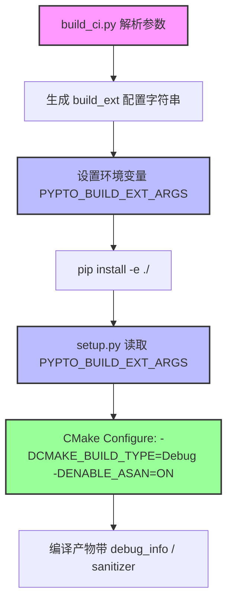

# 🧩 构建与调试工具机制详解

> **适用对象：** 希望理解“为什么这样构建/这样调试”的开发者  
> **前置知识：** 建议先读完[完整调试指南](00-complete-guide.md)

---

## 本文解决什么问题？

`00-complete-guide.md` 关注“怎么做”，本文关注“为什么是这样”：
- `build_ci.py` 的参数是如何一路传到 `pip install`、再传到 CMake 的
- ASAN 的编译开关与运行时环境变量是如何生效的
- 常见环境变量（编译期/运行期）的作用边界与优先级

---

## build_ci.py 参数传递机制（editable 场景）

下面以命令为例：

```bash
python build_ci.py --build_type Debug --asan --editable --clean
```

**参数传递流程图：**



**详细说明：**
1. **build_ci.py 解析参数**：解析 `--build_type`、`--asan` 等命令行参数
2. **生成配置字符串**：将参数转换为 `--cmake-build-type=Debug --enable-asan` 格式
3. **设置环境变量**：将配置字符串设置到 `PYPTO_BUILD_EXT_ARGS` 环境变量
4. **pip install**：执行 `pip install -e ./`，触发 Setuptools 构建
5. **setup.py 读取**：`setup.py` 中的 `CMakeBuild` 类读取环境变量
6. **CMake Configure**：将环境变量转换为 CMake 参数（`-DCMAKE_BUILD_TYPE=Debug -DENABLE_ASAN=ON`）
7. **编译产物**：CMake 根据参数生成带调试符号或 sanitizer 的编译产物

**关键代码位置（供快速跳转）：**
- `build_ci.py`：构建参数解析与环境变量注入（以仓库源码为准）
- `setup.py`：读取 `PYPTO_BUILD_EXT_ARGS` 并传递给 CMake
- `cmake/*`：根据 `ENABLE_ASAN` 等开关拼接编译选项

---

## ASAN：编译期开关与运行时配置

### 1) 编译期：`ENABLE_ASAN`

启用 ASAN 的本质是让编译器插桩，并在链接阶段带上 sanitizer 运行库。

### 2) 运行期：`ASAN_OPTIONS`

`ASAN_OPTIONS` 由 sanitizer 运行库在进程启动阶段读取（格式一般为 `k=v:k=v`），常见用法：

```bash
export ASAN_OPTIONS="abort_on_error=1:halt_on_error=1"
```

**实践建议：**
- 调试时建议 `abort_on_error=1`，这样能被 GDB 捕获停在最接近根因的位置
- 若你在跑测试/CI，可能需要开启更多检查项（以项目 CMake/CI 配置为准）

---

## 环境变量机制对比（编译期 vs 运行期）

| 环境变量 | 作用阶段 | 典型读取位置 | 用途 |
|---|---|---|---|
| `PYPTO_BUILD_EXT_ARGS` | 编译期 | `setup.py` | 传递 CMake 参数（如 build_type/asan） |
| `ASAN_OPTIONS` | 运行期 | sanitizer 运行库 | 控制 ASAN 错误处理行为 |
| `TILE_FWK_OUTPUT_DIR` | 运行期 | 框架运行时 | 指定输出目录（便于对比与回归） |


