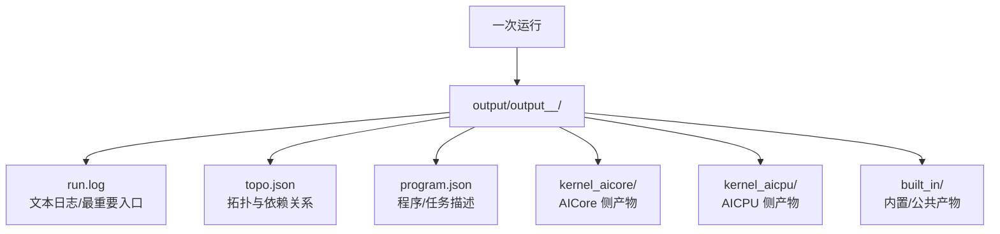

# PyPTO 输出目录与产物总览

> **目标**：当你在 `run.log` 里看到“输出目录”，或你想定位“某次运行到底生成了什么”，可以先从本页把产物体系串起来，再进入每个文件/目录的详解页。

---

## 1. 输出目录长什么样？

常见形式（示意）：

- 默认：`<work_dir>/output/output_<timestamp>_<pid>/`
- 自定义：通过 `TILE_FWK_OUTPUT_DIR` 指定根目录后，仍会生成 `output_<timestamp>_<pid>/` 子目录

查找最新一次运行的输出目录：

```bash
ls -dt output/output_* | head -1
```

---

## 2. 产物之间的关系（先记住这张图）



---

## 3. 快速入口：我应该先看哪个？

- **先看 `run.log`**：确认运行模式（NPU/SIM）、关键阶段、报错点、以及输出目录本身
  - 详见：[run.log 文件详细说明](run-log.md)
- **想理解"编译/执行生成了哪些任务/依赖"**：看 `topo.json` 与 `program.json`
  - 详见：[topo.json 文件详细说明](topo-json.md)、[program.json 文件详细说明](program-json.md)
- **想找 device 侧代码/二进制/编译中间产物**：看 `kernel_aicore/`、`kernel_aicpu/`
  - 详见：[kernel_aicore 目录详细说明](kernel-aicore.md)、[kernel_aicpu 目录详细说明](kernel-aicpu.md)
- **想了解公共/内置产物**：看 `built_in/`
  - 详见：[built_in 目录详细说明](built-in.md)

---

## 4. 常用排查套路（建议照这个顺序）

1. **先固定输出目录**：便于“同一输入”的多次运行对比
2. **看 `run.log`**：定位失败点/关键阶段
3. **再决定看什么**：
   - 图/依赖相关 → `topo.json`
   - 任务/执行相关 → `program.json`
   - kernel 生成物 → `kernel_aicore/`、`kernel_aicpu/`


