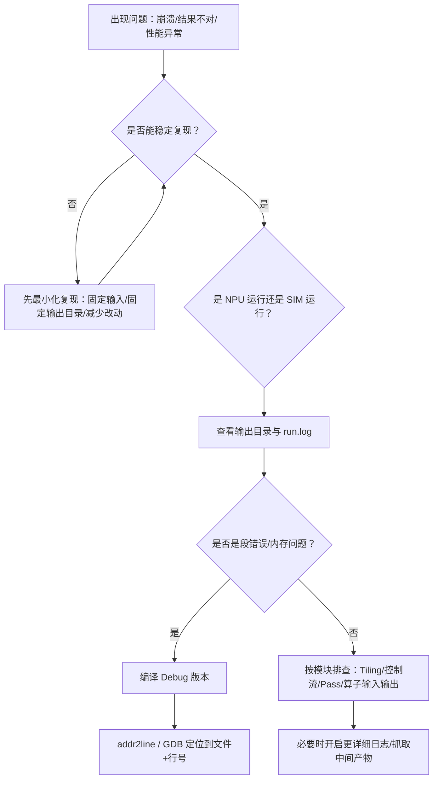

# PyPTO 完整调试指南

> **适用对象：** 遇到问题需要调试的开发者  
> **学习时间：** 35-50分钟  
> **前置知识：** 基本的GDB和Python调试知识  
> **学习目标：** 掌握PyPTO的完整调试方法和工具链

**⚠️ 重要提示：** 遇到问题时，先查看本指南确定调试策略，再使用具体工具。

**调试工具链：**
- **GDB调试**：C++层问题定位
- **ASAN**：内存问题检测
- **调试文件**：IR和Pass分析
- **日志输出**：运行时信息跟踪

## 目录

1. [概述](#概述)
2. [编译Debug版本](#编译debug版本)
3. [使用GDB调试](#使用gdb调试)
4. [使用AddressSanitizer (ASAN)](#使用addresssanitizer-asan)
5. [使用Valgrind](#使用valgrind)
6. [使用Backtrace和addr2line](#使用backtrace和addr2line)
7. [调试工具对比](#调试工具对比)
8. [实际案例](#实际案例)
9. [机制详解](#机制详解)
10. [快速参考](#快速参考)

---

## 概述

当PyPTO程序出现段错误（segmentation fault）或其他内存问题时，可以使用以下工具进行调试：

**相关主题：**
- 环境与工具链：见 [环境准备与安装](../00-getting-started/01-environment-setup.md)
- 精度调试流程：见 [精度调试（流程与方法）](07-precision-debugging.md)
- 常见问题与已知问题库：见 [常见问题与已知问题库](08-troubleshooting-and-known-issues.md)
- ASAN Python 前端不支持的原因：见 [构建与调试工具机制详解](../03-mechanisms/03-build-and-debug-mechanisms.md) 中的 ASAN 机制说明

### 调试流程（总览）



### 先明确：你在调试哪条“前端入口”？

PyPTO目前存在两条JIT入口，它们决定了你应该在哪些Python/C++边界打断点：

- **旧版入口（@pypto.jit）**：`python/pypto/runtime.py::_JIT`
  - 编译边界：`pypto_impl.OperatorBegin()` / `pypto_impl.OperatorEnd()`
  - 执行边界：`pypto_impl.GetWorkSpaceSize()` / `pypto_impl.OperatorDeviceRunOnceDataFromDevice()`
- **新版入口（@pypto.frontend.jit）**：`python/pypto/frontend/parser/entry.py::JitCallableWrapper`
  - 编译边界：`JitCallableWrapper._compile_if_needed()` 内部的 `OperatorBegin/End`
  - 执行边界：`JitCallableWrapper._run()` → `OperatorDeviceRunOnceDataFromDevice()`

**非常实用的结论：**
- 你想看“IR怎么生成”：就从 `OperatorBegin/End` 附近入手（Python层可先用print/日志，C++层用GDB断点）。
- 你想看“为什么跑崩/跑错”：就从 `GetWorkSpaceSize` 和 `OperatorDeviceRunOnceDataFromDevice` 入手（大概率能拿到最接近根因的栈）。

| 工具 | 类型 | 性能开销 | 检测精度 | 是否需要重新编译 | 推荐场景 |
|------|------|---------|---------|----------------|---------|
| **GDB** | 调试器 | 无 | 高（需要调试符号） | 是（推荐Debug版本） | 交互式调试，设置断点 |
| **ASAN** | 内存检查器 | 2-3倍 | 极高（精确到代码行） | 是 | 开发调试，CI/CD（**注意：ASAN Python 前端不支持，仅支持 C++ 后端**） |
| **Valgrind** | 内存检查器 | 10-50倍 | 中（需要调试符号） | 否 | 快速检查已编译版本 |
| **Backtrace** | 堆栈跟踪 | 无 | 中（需要调试符号） | 是（已集成） | 自动打印堆栈信息 |
| **addr2line** | 地址转换 | 无 | 高（需要调试符号） | 否 | 从地址获取文件名和行号 |

---

## 编译Debug版本

### 方法对比

| 方法 | 命令 | 优点 | 缺点 | 推荐度 |
|------|------|------|------|--------|
| **build_ci.py** | `python build_ci.py --build_type Debug --editable --clean` | 功能完整，自动清理，支持更多选项 | 需要了解build_ci.py | ⭐⭐⭐⭐⭐ |
| **pip + 环境变量** | `export PYPTO_BUILD_EXT_ARGS='--cmake-build-type=Debug'`<br>`pip install -e ./` | 命令简洁，与build_ci.py机制相同 | 需要手动清理 | ⭐⭐⭐⭐ |
| **pip + --config-setting** | `pip install -e ./ --config-setting=--build-option='build_ext --cmake-build-type=Debug'` | 不需要环境变量 | 命令冗长，引号嵌套复杂 | ⭐⭐ |

### 方法1：使用build_ci.py（推荐）

```bash
# 基本用法：编译Debug版本（会自动清理并安装）
python build_ci.py --build_type Debug --editable --clean

# 带详细输出
python build_ci.py --build_type Debug --editable --clean --verbose

# 指定编译线程数
python build_ci.py --build_type Debug --editable --clean -j 8

# 不清理之前的构建（如果确定之前就是Debug版本）
python build_ci.py --build_type Debug --editable
```

**参数说明：**
- `--build_type Debug`：指定构建类型为Debug（支持：Debug, Release, MinSizeRel, RelWithDebInfo）
- `--editable`：以可编辑模式安装，源码修改会即时生效
- `--clean`：清理之前的构建目录，确保使用新的Debug配置
- `--verbose`：输出详细的编译信息
- `-j 8`：指定编译线程数

### 方法2：使用环境变量（最简单）

```bash
# 1. 清理之前的构建（如果之前编译过Release版本）
rm -rf build/ dist/ *.egg-info

# 2. 设置环境变量
export PYPTO_BUILD_EXT_ARGS='--cmake-build-type=Debug'

# 3. 编译Debug版本
pip install -e ./
```

**优点：**
- 命令简洁，易于记忆
- 与`build_ci.py`的editable模式使用相同机制
- 可以设置一次环境变量，多次使用

### 方法3：使用--config-setting参数

```bash
# 1. 清理之前的构建
rm -rf build/ dist/ *.egg-info

# 2. 编译Debug版本
pip install -e ./ --config-setting=--build-option='build_ext --cmake-build-type=Debug'
```

**说明：**
- 命令较长，但不需要设置环境变量
- 需要pip >= 22.1支持`--config-setting`参数
- 如果pip版本较低，会自动降级到环境变量方式

### Debug版本特点

- **编译选项**：`-g -O0`（见`cmake/intf.cmake:25`）
- **符号表**：不被strip（Release版本会strip，见`cmake/intf.cmake:110`）
- **文件大小**：比Release版本大约10倍（包含调试符号）
- **性能**：比Release版本慢很多（`-O0`优化）

### 验证Debug版本

```bash
# 1. 检查构建类型
find build -name "CMakeCache.txt" | xargs grep "CMAKE_BUILD_TYPE"
# 应该显示：CMAKE_BUILD_TYPE:STRING=Debug

# 2. 检查.so文件
file python/pypto/pypto_impl*.so
# Debug版本应该显示：... with debug_info, not stripped
# Release版本会显示：... stripped

# 3. 检查调试段
readelf -S python/pypto/pypto_impl*.so | grep -E "\.debug"
# 应该看到：.debug_info, .debug_line, .debug_str 等段

# 4. 检查调试段大小
objdump -h python/pypto/pypto_impl*.so | grep -E "\.debug" | \
  awk '{printf "%-20s %10s bytes (%.2f MB)\n", $2, $3, $3/1024/1024}'
```

### 增强调试信息（使用-g3）

如果需要更详细的调试信息（包括宏定义）：

```bash
# 设置CXXFLAGS添加-g3（更详细的调试信息）
export CXXFLAGS="-g3 -O0"
export CFLAGS="-g3 -O0"

# 然后编译
pip install -e ./ --config-setting=--build-option='build_ext --cmake-build-type=Debug'
```

### 使用RelWithDebInfo（带调试信息的Release版本）

如果需要在保持一定性能的同时获得调试信息：

```bash
pip install -e ./ --config-setting=--build-option='build_ext --cmake-build-type=RelWithDebInfo'
```

**特点：**
- 使用`-O2`优化级别（性能较好）
- 包含`-g`调试符号
- 适合生产环境调试

---

## 使用GDB调试

### 基本用法

```bash
# 使用gdb运行程序
gdb --args python examples/01_beginner/00_introduction/add_scalar.py

# 在gdb中执行
(gdb) run
# 等待段错误发生
(gdb) bt              # 查看调用栈（会显示文件名和行号）
(gdb) frame 0          # 查看当前帧
(gdb) list             # 查看当前代码
(gdb) info locals      # 查看局部变量
(gdb) print variable   # 打印变量值
(gdb) info registers   # 查看寄存器
```

### 高级用法

```bash
# 设置断点
(gdb) break backend.cpp:94
(gdb) break Execute
(gdb) break *0x12345678

# 条件断点
(gdb) break backend.cpp:94 if task == nullptr

# 查看内存
(gdb) x/10x $rsp        # 查看栈顶10个字
(gdb) x/s 0x12345678    # 查看字符串
(gdb) x/i $pc           # 查看当前指令

# 单步执行
(gdb) step              # 单步进入
(gdb) next              # 单步跳过
(gdb) continue          # 继续执行

# 查看变量
(gdb) print task
(gdb) print *task
(gdb) print task->GetFunction()
```

### 使用Core Dump

```bash
# 1. 启用core dump
ulimit -c unlimited

# 2. 运行程序（发生段错误）
python examples/01_beginner/00_introduction/add_scalar.py

# 3. 使用gdb分析core dump
gdb python core
(gdb) bt
(gdb) frame 0
(gdb) list
```

---

## 使用AddressSanitizer (ASAN)

### ⚠️ 重要限制

**Python前端不支持ASAN**：当前项目Python前端会自动关闭ASAN（见`cmake/config.cmake:234-237`），CMake会给出警告并自动关闭。这意味着对于Python前端项目，ASAN无法使用。

**替代方案**：对于Python前端，建议使用Valgrind或GDB进行调试。

### ASAN机制详解

#### 编译时机制

**流程图：**

```
用户命令: python build_ci.py --build_type Debug --asan --editable
    │
    ├─> build_ci.py 解析参数
    │   └─> BuildParam.__init__() 设置 self.asan = True
    │
    ├─> _get_setuptools_build_ext_config_setting()
    │   └─> 生成配置字符串: "--cmake-build-type=Debug"
    │
    ├─> 设置环境变量: PYPTO_BUILD_EXT_ARGS="--cmake-build-type=Debug"
    │
    ├─> 调用: pip install -e ./
    │   └─> setup.py 的 CMakeBuild 类读取环境变量
    │       └─> 执行: cmake -DCMAKE_BUILD_TYPE=Debug -DENABLE_ASAN=ON
    │
    └─> CMake配置编译选项（cmake/intf.cmake:127）
        ├─> 编译选项: -fsanitize=address -fsanitize-address-use-after-scope -fsanitize=leak
        ├─> 链接选项: -fsanitize=address
        └─> 编译器插桩: 在代码中插入检查指令
            └─> 链接: libasan.so
```

**关键代码位置：**

```cmake
# cmake/intf.cmake:127 - 编译选项
$<$<BOOL:${ENABLE_ASAN}>:-fsanitize=address -fsanitize-address-use-after-scope -fsanitize=leak>

# cmake/intf.cmake:160 - 链接选项
$<$<BOOL:${ENABLE_ASAN}>:-fsanitize=address>
```

#### 运行时机制

**ASAN_OPTIONS生效流程图：**

```
程序启动
    │
    ├─> 动态链接器加载 libasan.so（通过 -fsanitize=address 链接选项）
    │
    ├─> libasan.so 初始化阶段
    │   │
    │   ├─> 读取环境变量 ASAN_OPTIONS
    │   │   │
    │   │   ├─> 优先级1: 用户设置的环境变量（最高优先级）
    │   │   │   export ASAN_OPTIONS="halt_on_error=1:abort_on_error=1"
    │   │   │
    │   │   ├─> 优先级2: CMake设置的默认值（仅在ENABLE_TESTS_EXECUTE时）
    │   │   │   cmake/config.cmake:307
    │   │   │   set(ASAN_OPTIONS "ASAN_OPTIONS=halt_on_error=0,...")
    │   │   │
    │   │   └─> 优先级3: ASAN内置默认值
    │   │
    │   ├─> 初始化shadow memory（内存映射表）
    │   │   └─> 为每个内存地址分配shadow byte
    │   │
    │   └─> 设置错误处理回调
    │
    └─> 程序正常运行
        │
        ├─> 每次内存访问
        │   └─> 编译器插入的检查指令
        │       ├─> 检查shadow memory
        │       ├─> 验证内存状态（已分配/已释放/不可访问）
        │       └─> 如果检测到错误
        │           └─> 根据ASAN_OPTIONS决定行为
        │               ├─> halt_on_error=1 → 停止程序
        │               ├─> abort_on_error=1 → abort()以便gdb捕获
        │               └─> 默认 → 打印错误信息并继续
```

**ASAN_OPTIONS读取位置：**

```
环境变量 ASAN_OPTIONS
    │
    └─> libasan.so 内部（GCC/Clang提供的库）
        │
        ├─> 读取时机: 程序启动时，libasan.so初始化阶段
        ├─> 读取位置: libasan.so的__asan_init()函数
        └─> 解析格式: key1=value1:key2=value2:key3=value3
```

### 编译ASAN版本

```bash
# 清理之前的构建
rm -rf build/ dist/ *.egg-info

# 编译ASAN版本（会自动启用Debug模式）
python build_ci.py --build_type Debug --asan --editable --clean
```

**注意**：`--asan`选项会自动启用Debug模式，因为需要调试符号来显示代码行号。

### 配置ASAN选项

```bash
# 基本配置（推荐用于调试）
export ASAN_OPTIONS="halt_on_error=1:abort_on_error=1:detect_leaks=1"

# 完整配置（所有检查）
export ASAN_OPTIONS="halt_on_error=1:abort_on_error=1:detect_stack_use_after_return=1:check_initialization_order=1:strict_init_order=1:strict_string_checks=1:detect_leaks=1:print_stats=1:verbosity=1"

# 运行程序
python examples/01_beginner/00_introduction/add_scalar.py
```

### ASAN选项说明

| 选项 | 默认值 | 说明 |
|------|--------|------|
| `halt_on_error` | 0 | 检测到错误时是否停止（1=停止，0=继续） |
| `abort_on_error` | 0 | 错误时是否abort（1=abort，便于gdb调试） |
| `detect_leaks` | 1 | 是否检测内存泄漏 |
| `detect_stack_use_after_return` | 0 | 是否检测栈返回后使用 |
| `check_initialization_order` | 0 | 是否检查初始化顺序 |
| `strict_init_order` | 0 | 是否严格检查初始化顺序 |
| `strict_string_checks` | 0 | 是否严格检查字符串 |
| `print_stats` | 0 | 是否打印统计信息 |
| `verbosity` | 0 | 详细程度（0-2） |

### 查看ASAN输出

ASAN会在检测到错误时立即输出详细信息：

```
=================================================================
==12345==ERROR: AddressSanitizer: heap-use-after-free on address 0x603000000010 at pc 0x7f8b12345678 bp 0x7fff12345678 sp 0x7fff12345670
READ of size 4 at 0x603000000010 thread T0
    #0 0x7f8b12345678 in Execute /data/w00576008/pypto/framework/src/machine/host/backend.cpp:94:12
    #1 0x7f8b12345679 in AgentThreadFunc /data/w00576008/pypto/framework/src/interface/machine/host/host_machine.cpp:123:45
    ...

0x603000000010 is located 0 bytes inside of 16-byte region [0x603000000010,0x603000000020)
freed by thread T0 here:
    #0 0x7f8b12345680 in operator delete /usr/lib64/libasan.so.5
    #1 0x7f8b12345681 in ~DeviceAgentTask /data/w00576008/pypto/framework/src/machine/host/backend.cpp:100:12
    ...

SUMMARY: AddressSanitizer: heap-use-after-free /data/w00576008/pypto/framework/src/machine/host/backend.cpp:94:12 in Execute
```

### ASAN + GDB组合调试

```bash
# 1. 编译ASAN版本
python build_ci.py --build_type Debug --asan --editable --clean

# 2. 配置ASAN选项（错误时abort以便gdb捕获）
export ASAN_OPTIONS="abort_on_error=1:halt_on_error=1"

# 3. 使用gdb运行
gdb --args python examples/01_beginner/00_introduction/add_scalar.py

# 4. 在gdb中
(gdb) run
# ASAN检测到错误时会abort，gdb停在错误位置
(gdb) bt              # 查看完整调用栈
(gdb) frame 0         # 切换到错误发生的帧
(gdb) list            # 查看源代码
(gdb) print *ptr      # 打印指针内容
```

---

## 使用Valgrind

### 安装Valgrind

```bash
# Ubuntu/Debian
sudo apt-get install valgrind

# CentOS/RHEL
sudo yum install valgrind

# 验证安装
valgrind --version
```

### 基本用法

```bash
# 基本内存检查
valgrind --tool=memcheck \
         --leak-check=full \
         --show-leak-kinds=all \
         --track-origins=yes \
         python examples/01_beginner/00_introduction/add_scalar.py
```

### 详细配置

```bash
# 完整配置（推荐）
valgrind --tool=memcheck \
         --leak-check=full \
         --show-leak-kinds=all \
         --track-origins=yes \
         --track-fds=yes \
         --show-reachable=yes \
         --num-callers=20 \
         --error-limit=no \
         --verbose \
         --log-file=valgrind.log \
         python examples/01_beginner/00_introduction/add_scalar.py

# 查看日志
cat valgrind.log
```

### Valgrind参数说明

| 参数 | 说明 |
|------|------|
| `--tool=memcheck` | 使用memcheck工具（检测内存错误） |
| `--leak-check=full` | 完整的内存泄漏检查 |
| `--show-leak-kinds=all` | 显示所有类型的泄漏 |
| `--track-origins=yes` | 跟踪未初始化值的来源（性能开销大） |
| `--track-fds=yes` | 跟踪文件描述符泄漏 |
| `--show-reachable=yes` | 显示可达但未释放的内存 |
| `--num-callers=20` | 显示20层调用栈 |
| `--error-limit=no` | 不限制错误数量 |
| `--log-file=valgrind.log` | 将输出保存到文件 |

### 查看Valgrind输出

```
==12345== Invalid read of size 4
==12345==    at 0x12345678: Execute (backend.cpp:94)
==12345==    by 0x12345679: AgentThreadFunc (host_machine.cpp:123)
==12345==  Address 0x603000000010 is 0 bytes inside a block of size 16 free'd
==12345==    at 0x4C2A1E0: operator delete(void*) (vg_replace_malloc.c:576)
==12345==    by 0x1234567B: ~DeviceAgentTask (backend.cpp:100)
```

### Valgrind其他工具

```bash
# 检测数据竞争（需要pthread）
valgrind --tool=helgrind python examples/01_beginner/00_introduction/add_scalar.py

# 检测线程错误
valgrind --tool=drd python examples/01_beginner/00_introduction/add_scalar.py

# 检测缓存性能问题
valgrind --tool=cachegrind python examples/01_beginner/00_introduction/add_scalar.py
```

---

## 使用Backtrace和addr2line

### Backtrace（代码中已集成）

项目中的`error.cpp`已经集成了backtrace功能，当发生段错误时会自动打印堆栈。Debug版本会显示：

```
segment fault!!!
#0  function_name() at file.cpp:123
#1  another_function() at file.cpp:456
...
```

**实现位置**：`framework/src/interface/utils/error.cpp:108`

### addr2line

如果只有地址信息，可以使用`addr2line`转换：

```bash
# 假设崩溃地址是0x12345678
addr2line -e $(python -c "import pypto; import os; print(os.path.dirname(pypto.__file__))")/pypto_impl*.so 0x12345678

# 显示函数名和文件名
addr2line -e python/pypto/pypto_impl*.so -f -C 0x12345678
```

**参数说明：**
- `-e`：指定可执行文件
- `-f`：显示函数名
- `-C`：解码C++函数名（demangle）

---

## 调试工具对比

### 性能开销对比

| 工具 | 性能开销 | 内存开销 | 适用场景 |
|------|---------|---------|---------|
| **GDB** | 无（正常运行时） | 无 | 交互式调试，设置断点 |
| **ASAN** | 2-3倍 | 2-3倍 | 开发调试，CI/CD（**Python前端不支持**） |
| **Valgrind** | 10-50倍 | 2倍 | 快速检查已编译版本 |
| **Backtrace** | 无 | 无 | 自动打印堆栈信息 |

### 检测能力对比

| 错误类型 | GDB | ASAN | Valgrind | Backtrace |
|---------|-----|------|----------|-----------|
| Use-after-free | ✓（需手动触发） | ✓✓（自动） | ✓✓（自动） | ✗ |
| Buffer overflow | ✓（需手动触发） | ✓✓（自动） | ✓✓（自动） | ✗ |
| Memory leak | ✗ | ✓✓ | ✓✓ | ✗ |
| Use-after-return | ✗ | ✓✓ | ✗ | ✗ |
| Use-after-scope | ✗ | ✓✓ | ✗ | ✗ |
| Uninitialized memory | ✗ | ✗ | ✓✓ | ✗ |
| 代码行号定位 | ✓✓ | ✓✓ | ✓（需调试符号） | ✓（需调试符号） |
| 堆栈跟踪 | ✓✓ | ✓✓ | ✓✓ | ✓✓ |

---

## 实际案例

### 案例1：使用GDB调试add_scalar.py的段错误

```bash
# 1. 编译Debug版本
python build_ci.py --build_type Debug --editable --clean

# 2. 使用gdb运行
gdb --args python examples/01_beginner/00_introduction/add_scalar.py

# 3. 在gdb中
(gdb) run
# 等待段错误发生
(gdb) bt              # 查看调用栈
(gdb) frame 0         # 查看当前帧
(gdb) list            # 查看代码
(gdb) print task      # 打印变量
```

### 案例2：使用Valgrind检查add_scalar.py

```bash
# 1. 确保已安装valgrind
valgrind --version

# 2. 使用valgrind运行（不需要重新编译）
valgrind --tool=memcheck \
         --leak-check=full \
         --show-leak-kinds=all \
         --track-origins=yes \
         --log-file=valgrind_add_scalar.log \
         python examples/01_beginner/00_introduction/add_scalar.py

# 3. 查看日志
cat valgrind_add_scalar.log
```

### 案例3：ASAN + GDB组合调试（仅C++前端）

```bash
# 1. 编译ASAN版本（注意：Python前端不支持）
python build_ci.py --build_type Debug --asan --editable --clean

# 2. 配置ASAN选项（错误时abort）
export ASAN_OPTIONS="abort_on_error=1:halt_on_error=1"

# 3. 使用gdb运行
gdb --args python examples/01_beginner/00_introduction/add_scalar.py

# 4. 在gdb中
(gdb) run
# ASAN检测到错误时会abort，gdb停在错误位置
(gdb) bt              # 查看完整调用栈
(gdb) frame 0         # 切换到错误发生的帧
(gdb) list            # 查看源代码
(gdb) print task      # 打印变量
```

---

## 机制详解

本节内容已单独拆分为一篇“构建与调试工具机制详解”，避免本指南过长且重复：

- [构建与调试工具机制详解](05-build-and-debug-mechanisms.md)

<!-- 原“机制详解”内容已迁移到 05-build-and-debug-mechanisms.md -->

---

## 快速参考

### 编译Debug版本

```bash
# 方法1：build_ci.py（推荐）
python build_ci.py --build_type Debug --editable --clean

# 方法2：环境变量（最简单）
export PYPTO_BUILD_EXT_ARGS='--cmake-build-type=Debug'
pip install -e ./
```

### 使用GDB调试

```bash
gdb --args python examples/01_beginner/00_introduction/add_scalar.py
(gdb) run
(gdb) bt
```

### 使用Valgrind

```bash
valgrind --tool=memcheck --leak-check=full --track-origins=yes \
         python examples/01_beginner/00_introduction/add_scalar.py
```

### 使用ASAN（仅C++前端）

```bash
# 编译ASAN版本
python build_ci.py --build_type Debug --asan --editable --clean

# 配置ASAN选项
export ASAN_OPTIONS="halt_on_error=1:abort_on_error=1"

# 运行程序
python examples/01_beginner/00_introduction/add_scalar.py
```

### 使用addr2line

```bash
addr2line -e python/pypto/pypto_impl*.so -f -C 0x12345678
```

---

## 相关文件

- `build_ci.py`：构建脚本，支持`--build_type`和`--asan`选项
- `setup.py`：setuptools配置，读取`PYPTO_BUILD_EXT_ARGS`环境变量
- `cmake/intf.cmake`：CMake编译选项配置（`-g`, `-fsanitize=address`）
- `cmake/config.cmake`：CMake运行时配置（`ASAN_OPTIONS`默认值）
- `framework/src/interface/utils/error.cpp`：backtrace功能实现

---

## 注意事项

1. **ASAN版本不能与正常版本混用**：必须使用ASAN编译的版本
2. **Python前端限制**：**当前项目Python前端不支持ASAN**（见`cmake/config.cmake:234-237`），CMake会自动关闭ASAN并给出警告。对于Python前端项目，建议使用Valgrind或GDB进行调试
3. **性能影响**：ASAN和Valgrind都会显著影响性能，不适合生产环境长期使用
4. **调试符号**：ASAN和Valgrind都需要调试符号才能显示代码行号，建议使用Debug版本
5. **环境变量优先级**：用户设置的`ASAN_OPTIONS`会覆盖CMake的默认值
6. **ASAN_OPTIONS生效位置**：`ASAN_OPTIONS`是运行时环境变量，由`libasan.so`在程序启动时读取。CMake设置的默认值仅在`ENABLE_TESTS_EXECUTE`时生效（见`cmake/config.cmake:307`），普通运行时需要用户手动设置
7. **清理构建**：如果之前编译过Release版本，建议清理后再编译Debug版本：`rm -rf build/ dist/ *.egg-info`
8. **文件大小**：Debug版本的.so文件会比Release版本大很多（可能大10倍以上），因为包含调试符号信息
