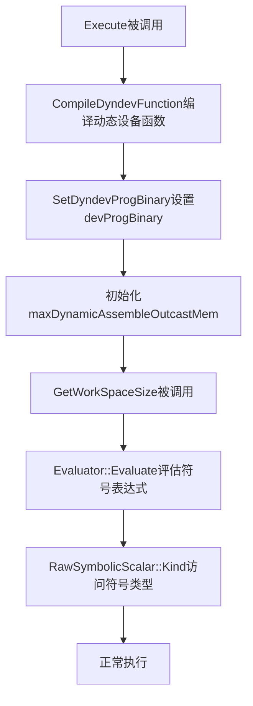
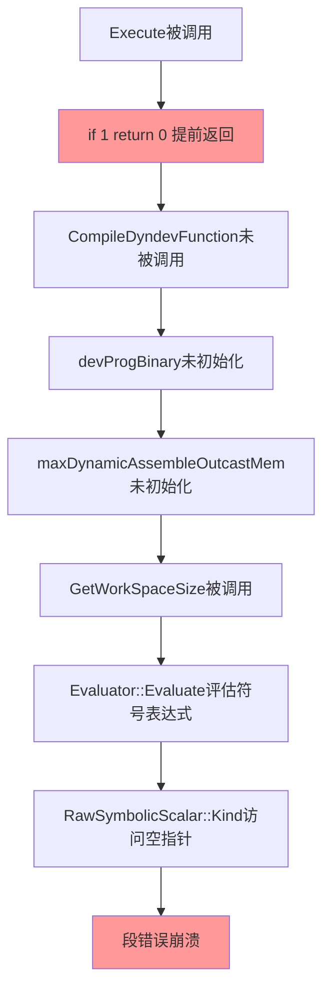

# Segfault 调试实战案例

> **适用对象：** 遇到段错误的开发者  
> **学习时间：** 20-30分钟  
> **前置知识：** 已阅读[完整调试指南](00-complete-guide.md)  
> **学习目标：** 通过真实案例学会Segfault的调试方法

**案例特点：**
- 📖 真实案例：实际开发中遇到的段错误
- 🔍 完整过程：从问题发现到根本原因
- 🛠️ 工具使用：GDB和ASAN的实战应用
- 💡 经验总结：可复用的调试技巧

## 问题描述

**重要提示：** 本案例依赖具体源码修改（在 `framework/src/machine/host/backend.cpp` 文件中添加 `if (1) { return 0; }`），**仅用于示例说明调试方法，不要在主干长期保留该改动**。

在 `framework/src/machine/host/backend.cpp` 文件的第94行修改为 `if (1) { return 0; }` 后，执行 `python examples/01_beginner/00_introduction/add_scalar.py` 时出现段错误（segmentation fault）。

**问题代码（仅示例，不要在实际代码中保留）：**
```cpp
extern "C" int32_t Execute(MachineTask *task, FunctionCache &cache) {
    if (1) {
        ALOG_INFO("draw graph switch enabled, push finish queue.");
        return 0;  // 提前返回，跳过了所有初始化代码
    }
    // ... 后续初始化代码被跳过
}
```

---

## 调试环境准备

### 工具检查

```bash
# 检查调试工具是否安装
which gdb valgrind addr2line
/usr/bin/gdb
/usr/bin/valgrind
/usr/bin/addr2line

# 检查Python环境
python --version
Python 3.10.x
```

### 编译版本对比

| 版本类型 | 编译命令 | 调试符号 | 文件大小 | 性能 |
|---------|---------|---------|---------|------|
| **Release** | `python build_ci.py --build_type Release --editable --clean` | ❌ stripped | 较小 | 快 |
| **Debug** | `python build_ci.py --build_type Debug --editable --clean` | ✅ with debug_info | 较大（约10倍） | 慢 |

---

## 阶段一：Release版本调试（无调试符号）

### 1.1 Release版本调试限制

Release版本（stripped）只能获取崩溃地址和偏移量，无法获取函数名、文件名和行号信息。使用 `addr2line` 或 `GDB` 也无法进行有效的源码级调试。

**结论：如果你能重编译，建议直接跳到阶段二（Debug版本）进行源码级定位。**

---

## 阶段二：Debug版本调试（有调试符号）

### 2.1 编译Debug版本

```bash
python build_ci.py --build_type Debug --editable --clean
```

**验证编译结果：**
```bash
file python/pypto/pypto_impl*.so
python/pypto/pypto_impl.cpython-310-aarch64-linux-gnu.so: ELF 64-bit LSB shared object, ARM aarch64, version 1 (GNU/Linux), dynamically linked, BuildID[sha1]=d8993ff70e763cac8c3fc333442677784a307491, with debug_info, not stripped
```

**关键信息：** `with debug_info, not stripped` 表示包含完整的调试符号。

**检查调试段：**
```bash
readelf -S python/pypto/pypto_impl*.so | grep -E "\.debug"
  [28] .debug_info       PROGBITS         0000000000000000  0023a000
  [29] .debug_abbrev     PROGBITS         0000000000000000  0023b000
  [30] .debug_line       PROGBITS         0000000000000000  0023c000
  [31] .debug_str        PROGBITS         0000000000000000  0023d000
  [32] .debug_ranges     PROGBITS         0000000000000000  0023e000
```

**分析：**
- ✅ 包含 `.debug_info`、`.debug_line`、`.debug_str` 等调试段
- ✅ 可以进行源码级调试

### 2.2 运行程序获取Backtrace

```bash
export TILE_FWK_DEVICE_ID=0
python examples/01_beginner/00_introduction/add_scalar.py
```

**输出日志：**
```
============================================================
PyPTO add_scalar Example
============================================================

segment fault!!!
pypto_impl.cpython-310-aarch64-linux-gnu.so(+0x23ac74) [0xfffcf5e70c74]
pypto_impl.cpython-310-aarch64-linux-gnu.so(+0x23be68) [0xfffcf5e71e68]
pypto_impl.cpython-310-aarch64-linux-gnu.so(+0x23ba9c) [0xfffcf5e71a9c]
pypto_impl.cpython-310-aarch64-linux-gnu.so(+0x23c6ec) [0xfffcf5e726ec]
pypto_impl.cpython-310-aarch64-linux-gnu.so(+0x236b5c) [0xfffcf5e6cb5c]
...
```

**注意：** Debug版本的地址偏移与Release版本不同（`+0x23ac74` vs `+0x8f964`），这是因为Debug版本包含更多调试信息，代码布局不同。

### 2.3 使用addr2line转换地址（Debug版本）

```bash
addr2line -e python/pypto/pypto_impl*.so -f -C 0x23ac74
npu::tile_fwk::RawSymbolicScalar::Kind() const
/data/w00576008/pypto/framework/src/interface/tensor/symbolic_scalar.h:107
```

**分析：**
- ✅ **函数名清晰可读**：`npu::tile_fwk::RawSymbolicScalar::Kind() const`
- ✅ **文件名和行号准确**：`symbolic_scalar.h:107`
- ✅ **可以立即定位到问题代码**

### 2.4 使用GDB调试Debug版本

```bash
gdb --batch --ex "set confirm off" --ex "run" --ex "bt" --ex "info registers" --ex "frame 0" --ex "list" --ex "quit" --args python examples/01_beginner/00_introduction/add_scalar.py
```

**完整Backtrace输出：**
```
Thread 1 "python" received signal SIGSEGV, Segmentation fault.
0x0000fffd6b40bc74 in npu::tile_fwk::RawSymbolicScalar::Kind (this=0x0) at /data/w00576008/pypto/framework/src/interface/tensor/symbolic_scalar.h:107
#0  0x0000fffd6b40bc74 in npu::tile_fwk::RawSymbolicScalar::Kind (this=0x0) at /data/w00576008/pypto/framework/src/interface/tensor/symbolic_scalar.h:107
#1  0x0000fffd6b40ce68 in npu::tile_fwk::dynamic::Evaluator::Evaluate (this=0xffffffffb610, ss=...) at /data/w00576008/pypto/framework/src/machine/runtime/device_launcher_binding.h:144
#2  0x0000fffd6b40ca9c in npu::tile_fwk::dynamic::Evaluator::Evaluate (this=0xffffffffb610, ss=...) at /data/w00576008/pypto/framework/src/machine/runtime/device_launcher_binding.h:112
#3  0x0000fffd6b40d6ec in npu::tile_fwk::dynamic::ExportedOperator::GetWorkSpaceSize (this=0xaaaada4989c0, inputs=..., outputs=...) at /data/w00576008/pypto/framework/src/machine/runtime/device_launcher_binding.h:197
#4  0x0000fffd6b407b5c in pypto::GetWorkSpaceSize (opAddr=187650783414720, inputs=..., outputs=...) at /data/w00576008/pypto/python/src/bindings/runtime.cpp:164
#5  0x0000fffd6b418684 in pybind11::detail::argument_loader<...>::call_impl<...> (this=0xffffffffb760, f=@0xaaaab5ac7468: 0xfffd6b407b24 <pypto::GetWorkSpaceSize(...)>) at /tmp/pip-build-env-2ilrltg3/overlay/lib/python3.10/site-packages/pybind11/include/pybind11/cast.h:2137
#6  0x0000fffd6b416974 in pybind11::detail::argument_loader<...>::call<...> (this=0xffffffffb760, f=@0xaaaab5ac7468: 0xfffd6b407b24 <pypto::GetWorkSpaceSize(...)>) at /tmp/pip-build-env-2ilrltg3/overlay/lib/python3.10/site-packages/pybind11/include/pybind11/cast.h:2105
#7  0x0000fffd6b41392c in pybind11::cpp_function::initialize<...>::{lambda(pybind11::detail::function_call&)#3}::operator()(pybind11::detail::function_call&) const (this=0x0, call=...) at /tmp/pip-build-env-2ilrltg3/overlay/lib/python3.10/site-packages/pybind11/include/pybind11/pybind11.h:429
#8  0x0000fffd6b413b58 in pybind11::cpp_function::initialize<...>::{lambda(pybind11::detail::function_call&)#3}::_FUN(pybind11::detail::function_call&) () at /tmp/pip-build-env-2ilrltg3/overlay/lib/python3.10/site-packages/pybind11/include/pybind11/pybind11.h:400
#9  0x0000fffd6b291e14 in pybind11::cpp_function::dispatcher (self=0xfffd89e0ecd0, args_in=0xfffde6863440, kwargs_in=0x0) at /tmp/pip-build-env-2ilrltg3/overlay/lib/python3.10/site-packages/pybind11/include/pybind11/pybind11.h:1063
#10 0x0000aaaaaacc404c in cfunction_call ()
#11 0x0000aaaaaab14c80 in _PyObject_MakeTpCall ()
#12 0x0000aaaaaabb979c in _PyEval_EvalFrameDefault ()
...
```

**关键信息提取：**

1. **崩溃位置（Frame 0）：**
   - **文件**：`symbolic_scalar.h:107`
   - **函数**：`npu::tile_fwk::RawSymbolicScalar::Kind()`
   - **问题**：`this=0x0`（**空指针**）

2. **调用链分析：**
   ```
   Frame 0: RawSymbolicScalar::Kind()          <- 崩溃点：this=0x0
   Frame 1: Evaluator::Evaluate()              <- 调用ss->Kind()，ss为空
   Frame 2: Evaluator::Evaluate()              <- 递归调用
   Frame 3: ExportedOperator::GetWorkSpaceSize() <- 调用Evaluate()
   Frame 4: pypto::GetWorkSpaceSize()          <- Python绑定层
   ```

3. **问题根源定位：**
   - `GetWorkSpaceSize` 函数中访问 `maxDynamicAssembleOutcastMem`
   - `Evaluator::Evaluate` 接收到的 `ss` 参数是空指针
   - 调用 `ss->Kind()` 时发生段错误

### 2.5 查看相关源码

**崩溃点代码（symbolic_scalar.h:107）：**
```cpp
SymbolicScalarKind Kind() const { return kind; }
```

**调用点代码（device_launcher_binding.h:144）：**
```cpp
int Evaluate(RawSymbolicScalarPtr ss) {
    switch (ss->Kind()) {  // <- 这里ss是空指针
        // ...
    }
}
```

**GetWorkSpaceSize代码（device_launcher_binding.h:197）：**
```cpp
uint64_t GetWorkSpaceSize(const std::vector<DeviceTensorData> &inputs,
    const std::vector<DeviceTensorData> &outputs) const {
    auto dynAttr = func_->GetDyndevAttribute();
    std::vector<uint8_t> &devProgData = dynAttr->devProgBinary;
    
    if (devProgData.empty() || devProgData.data() == nullptr) {
        ALOG_ERROR_F("GetWorkSpaceSize: devProgBinary is empty or null! Size: %zu", devProgData.size());
        return 0;
    }
    
    auto *devProg = reinterpret_cast<DevAscendProgram *>(devProgData.data());
    
    if (dynAttr->inputSymbolDict.empty()) {
        ALOG_WARN_F("GetWorkSpaceSize: inputSymbolDict is empty, using default value 0 for maxDynamicAssembleOutcastMem");
        devProg->memBudget.tensor.maxDynamicAssembleOutcastMem = 0;
    } else {
        Evaluator eval{dynAttr->inputSymbolDict, inputs, outputs};
        if (dynAttr->maxDynamicAssembleOutcastMem.IsValid()) {  // <- 这里检查IsValid()
            devProg->memBudget.tensor.maxDynamicAssembleOutcastMem = eval.Evaluate(dynAttr->maxDynamicAssembleOutcastMem);  // <- 但Evaluate()内部调用ss->Kind()时ss仍可能为空
        }
    }
    
    return devProg->memBudget.Total();
}
```

### 2.6 Debug版本调试总结

| 工具 | 可用性 | 信息质量 | 结论 |
|------|--------|---------|------|
| **Backtrace（内置）** | ✅ | 中（地址+偏移） | 可以定位崩溃模块 |
| **addr2line** | ✅ | **高（函数名+文件名+行号）** | **可以精确定位问题代码** |
| **GDB** | ✅ | **极高（完整调用栈+变量值）** | **可以进行源码级调试，查看变量值** |

**关键发现：**
- ✅ **问题定位到具体文件和行号**：`symbolic_scalar.h:107`
- ✅ **问题原因明确**：空指针访问（`this=0x0`）
- ✅ **调用链清晰**：`GetWorkSpaceSize` -> `Evaluator::Evaluate` -> `RawSymbolicScalar::Kind`

---

## 阶段三：问题根本原因分析

### 3.1 代码执行流程分析

**正常执行流程：**



**问题执行流程：**



### 3.2 根本原因

**问题根源：**
1. `Execute()` 函数提前返回，跳过了 `CompileDyndevFunction()` 的调用
2. `devProgBinary` 没有被初始化，保持为空
3. `maxDynamicAssembleOutcastMem` 可能没有被正确初始化，导致 `RawSymbolicScalarPtr` 为空指针
4. 后续代码访问 `maxDynamicAssembleOutcastMem` 时，调用 `ss->Kind()` 导致段错误

**数据依赖关系：**
```
Execute()
  └─> CompileDyndevFunction()
      └─> SetDyndevProgBinary()
          └─> devProgBinary 被初始化
              └─> maxDynamicAssembleOutcastMem 被初始化
                  └─> GetWorkSpaceSize() 可以安全访问
```

**提前返回导致的问题：**
```
Execute() 提前返回
  └─> CompileDyndevFunction() 没有被调用
      └─> devProgBinary 为空
          └─> maxDynamicAssembleOutcastMem 未初始化（可能为空指针）
              └─> GetWorkSpaceSize() 访问空指针
                  └─> 段错误
```

---

---

## 调试工具对比总结

### Release版本 vs Debug版本

| 特性 | Release版本（stripped） | Debug版本（with debug_info） |
|------|----------------------|---------------------------|
| **编译选项** | `-O2 -DNDEBUG` | `-g -O0` |
| **文件大小** | 较小 | 较大（约10倍） |
| **性能** | 快 | 慢 |
| **调试符号** | ❌ 无 | ✅ 完整 |
| **Backtrace信息** | 仅地址偏移 | 地址+函数名+文件名+行号 |
| **addr2line** | ❌ 无法解析 | ✅ 可以解析 |
| **GDB调试** | ⚠️ 有限 | ✅ 完整源码级调试 |
| **变量查看** | ❌ 无法查看 | ✅ 可以查看变量值 |
| **断点设置** | ⚠️ 仅地址断点 | ✅ 源码行号断点 |

### 工具使用建议

| 场景 | 推荐工具 | 说明 |
|------|---------|------|
| **快速定位崩溃模块** | Backtrace（内置） | 无需额外工具，自动输出 |
| **精确定位问题代码** | addr2line + Debug版本 | 需要编译Debug版本 |
| **交互式调试** | GDB + Debug版本 | 可以设置断点、查看变量 |
| **内存错误检测** | Valgrind + Debug版本 | 需要系统支持（当前环境不可用） |
| **生产环境调试** | Backtrace + addr2line | 可以事后分析core dump |

---

## 调试技巧总结

### 1. 编译Debug版本的重要性

**关键点：**
- Release版本（stripped）无法进行有效的源码级调试
- Debug版本虽然性能慢、文件大，但对于调试是必需的
- 使用 `--build_type Debug` 编译选项

**验证方法：**
```bash
file python/pypto/pypto_impl*.so
# Debug版本应显示：with debug_info, not stripped
# Release版本会显示：stripped
```

### 2. 使用addr2line快速定位

**命令格式：**
```bash
addr2line -e <binary> -f -C <address>
```

**参数说明：**
- `-e <binary>`：指定可执行文件或共享库
- `-f`：显示函数名
- `-C`：解码C++函数名（demangle）
- `<address>`：崩溃地址（使用偏移量，如 `0x23ac74`）

**示例：**
```bash
addr2line -e python/pypto/pypto_impl*.so -f -C 0x23ac74
npu::tile_fwk::RawSymbolicScalar::Kind() const
/data/w00576008/pypto/framework/src/interface/tensor/symbolic_scalar.h:107
```

### 3. 使用GDB进行交互式调试

**基本命令：**
```bash
# 运行程序
(gdb) run

# 查看调用栈
(gdb) bt

# 切换到指定帧
(gdb) frame 0

# 查看当前代码
(gdb) list

# 查看变量值
(gdb) print variable_name

# 查看局部变量
(gdb) info locals

# 查看寄存器
(gdb) info registers
```

**批处理模式：**
```bash
gdb --batch --ex "run" --ex "bt" --ex "frame 0" --ex "list" --args python script.py
```

### 4. 理解调用链

**关键步骤：**
1. 从backtrace中找到崩溃点（Frame 0）
2. 向上追踪调用链（Frame 1, 2, 3...）
3. 理解数据流和依赖关系
4. 定位问题的根本原因

**本案例的调用链：**
```
Frame 0: RawSymbolicScalar::Kind()          <- 崩溃点：空指针访问
  ↑
Frame 1: Evaluator::Evaluate()              <- 传递了空指针
  ↑
Frame 2: Evaluator::Evaluate()              <- 递归调用
  ↑
Frame 3: ExportedOperator::GetWorkSpaceSize() <- 调用Evaluate()
  ↑
Frame 4: pypto::GetWorkSpaceSize()          <- Python绑定层
```

### 5. 防御性编程

**关键原则：**
- 在访问指针前检查是否为空
- 在访问容器前检查是否为空
- 确保数据结构在使用前被正确初始化
- 提前返回时要考虑所有依赖关系

**本案例的教训：**
- `Execute()` 提前返回时，跳过了关键的初始化代码
- 后续代码访问未初始化的数据导致段错误
- 需要在提前返回前初始化所有可能被访问的数据

---

**文档版本：** 1.0  
**最后更新：** 2025-12-30  
**作者：** PyPTO调试团队

