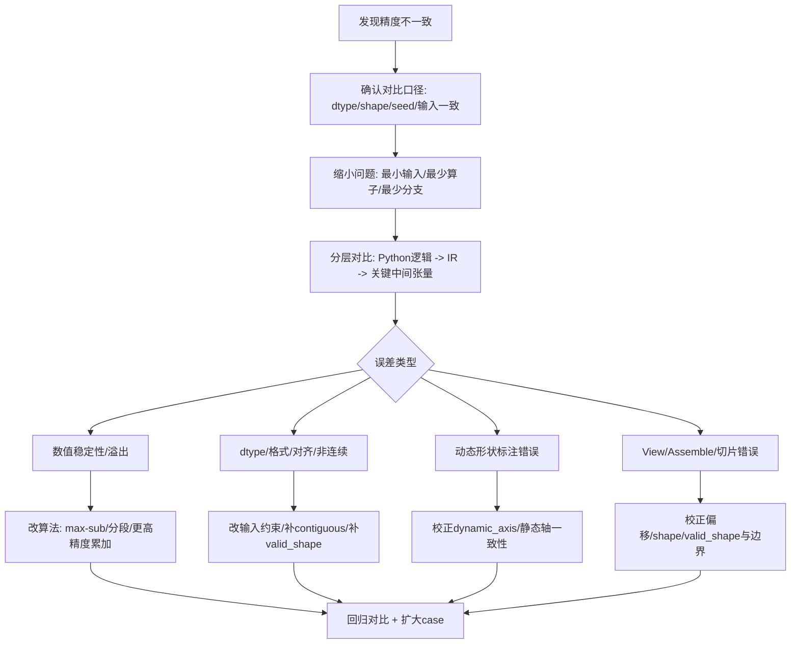

# 精度调试（流程与方法）

> **目标**：当 PyPTO 的输出与 PyTorch/参考实现不一致时，能用一套可复现、可收敛的流程定位到“是哪一步、哪一种原因”导致的精度偏差。

---

## 1. 先做三件事：让问题可复现、可对比、可收敛

### 1.1 固定输入与随机性

- 固定输入数据（保存到文件或固定随机种子）
- 固定 batch/shape（尤其动态轴场景先缩到最小）
- 固定 dtype（优先 BF16/FP16/FP32 三套分别验证）

### 1.2 固定运行模式与设备

- 明确你是在 **NPU** 还是 **SIM** 下对比
- 明确 device id（真实环境）

### 1.3 固定产物目录与日志

建议固定 `TILE_FWK_OUTPUT_DIR`，把一次对比的所有产物收敛在同一目录，便于比对。

---

## 2. 精度调试总流程（建议照着走）

---

## 3. 常见根因类型与定位方式（高频）

### 3.1 数值稳定性问题（Softmax/exp/log 等）

典型症状：
- 极端输入时 NaN/Inf
- 与 PyTorch 相差很大，且误差随输入幅度迅速放大

定位建议：
- 对 `exp/log` 类算子优先检查是否采用了数值稳定写法（例如 Softmax 的 max-sub）
- 对归约类算子检查累加精度（是否应该用 FP32 累加再 cast 回 BF16/FP16）

### 3.2 dtype 与中间精度（尤其归一化/方差类）

典型症状：
- 误差不大但稳定存在；不同 dtype 下误差显著变化

定位建议：
- 把关键中间步骤改为 FP32 计算（仅用于定位）看误差是否消失
- 检查是否存在不期望的 cast（比如 int8 量化路径）

### 3.3 输入/权重非连续（contiguous）导致的行为差异

很多模型算子/融合算子对输入有约束：**不支持非连续 Tensor**。  
典型症状：
- 结果不一致或运行异常；同一逻辑换 contiguous 输入就正常

定位建议：
- 在进入 PyPTO 前强制 `contiguous()`（或改数据布局生成方式）
- 对比输入的 strides/contiguous 标志

### 3.4 dynamic_axis / 静态轴一致性问题

典型症状：
- 同一个算子多次执行，shape 的“静态轴”传了不同运行值
- 或者动态轴未正确标注，导致编译假设与运行数据不一致

定位建议：
- 先把动态轴关掉，固定 shape 跑通
- 再逐步引入动态轴，并确保“静态轴”跨多次执行保持一致

### 3.5 View / Assemble / 切片边界与 valid_shape

典型症状：
- 特定边界（最后一个 tile）误差大
- 误差出现在“拼回大张量”或“切片”附近

定位建议：
- 检查 view/assemble 的 `shape/offsets/valid_shape`
- 对边界 tile 单独打印/对比（先在仿真/小 shape 下做）

---

## 4. 建议的“最小化对比脚手架”（可复用思路）

你可以采用“同一份输入 → PyTorch 参考 → PyPTO kernel → 误差统计”的固定脚手架：

- 统一输出：
  - 最大绝对误差（max abs）
  - 相对误差（rel）
  - 是否出现 NaN/Inf
- 统一对比阈值（建议使用 `numpy.testing.assert_allclose` 或 `torch.allclose`）：
  - **BF16**：`atol=1e-2, rtol=1e-2`（或更宽，取决于具体算子）
  - **FP16**：`atol=1e-3, rtol=1e-3`（或更宽）
  - **FP32**：`atol=1e-5, rtol=1e-5`（或更紧，如 `atol=1e-6, rtol=1e-6`）
  - **注意**：对于归一化/方差类算子，可能需要更宽松的阈值；对于纯线性运算，可以更紧

---

## 5. 进一步联动：性能与精度一起看

精度定位到位后，常见下一步是"在不破坏精度的前提下做性能优化"：
- 先固定精度版本作为 baseline
- 再调整 tiling/融合/调度；每一步都跑精度回归
- 性能数据采集与分析见：[性能优化指南](../07-features/01-performance-optimization.md)

---

## 6. 与性能/调试指南的关系

### 6.1 精度调试与性能优化的关系

**典型工作流：**
1. **先对齐精度**：使用本流程定位并修复精度问题
2. **再优化性能**：在精度对齐的基础上进行性能优化
3. **持续回归**：每次性能优化后都要跑精度回归，确保不破坏精度

**详细说明：** 见[性能优化指南](../07-features/01-performance-optimization.md)

### 6.2 精度调试与调试指南的关系

**何时使用精度调试：**
- 结果数值不对（与参考实现有偏差）
- 需要定位是哪一步/哪种原因导致的精度偏差

**何时使用通用调试指南：**
- 程序崩溃/段错误 → 见[完整调试指南](00-complete-guide.md)
- 编译失败 → 见[常见问题与已知问题库](08-troubleshooting-and-known-issues.md)
- 性能问题 → 见[性能优化指南](../07-features/01-performance-optimization.md)

### 6.3 回归流程建议

**精度回归流程：**
1. 固定输入（seed/shape/dtype）
2. 运行 PyPTO kernel 和参考实现
3. 使用 `numpy.testing.assert_allclose` 或 `torch.allclose` 对比（阈值见[第4节](#4-建议的最小化对比脚手架可复用思路)）
4. 记录误差统计（max abs、rel、NaN/Inf）
5. 如果误差超出阈值，按[第2节](#2-精度调试总流程建议照着走)流程定位

**阈值建议（默认值）：**
- **BF16**：`atol=1e-2, rtol=1e-2`（或更宽，取决于具体算子）
- **FP16**：`atol=1e-3, rtol=1e-3`（或更宽）
- **FP32**：`atol=1e-5, rtol=1e-5`（或更紧，如 `atol=1e-6, rtol=1e-6`）

**注意**：对于归一化/方差类算子，可能需要更宽松的阈值；对于纯线性运算，可以更紧。

