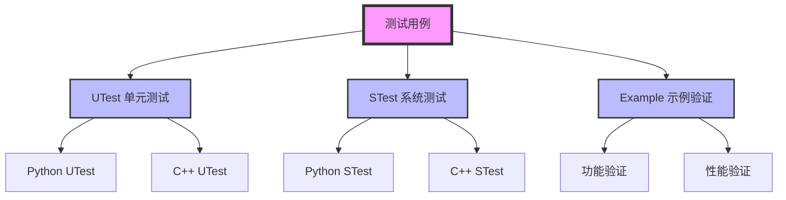
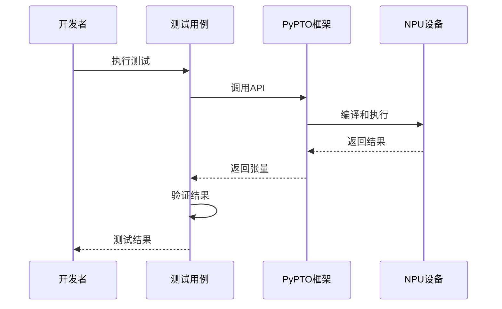

# PyPTO 测试和验证方法

> **学习时间：** 60-90分钟  
> **前置知识：** 已完成[上手指南](../00-getting-started/00-quick-start.md)  
> **学习目标：** 掌握PyPTO的测试方法、编写高质量测试用例

## 概述

本文档介绍 PyPTO 框架的测试和验证方法，帮助开发者编写高质量的测试用例，确保代码正确性和可靠性。文档包含由浅入深的测试用例，涵盖 PyPTO 的主要功能特性。

**测试体系：**
- 🧪 **功能测试**：验证API功能正确性
- 📊 **性能测试**：评估执行性能
- 🔧 **集成测试**：测试端到端流程
- 🛡️ **回归测试**：防止功能退化

**相关文档：**
- [API 使用总结（note 版）](../02-core/02-api-reference.md)：API 使用模式与全量目录附录
- [设计模式与最佳实践](../08-best-practices/01-design-patterns.md)：代码组织最佳实践
- 内存/生命周期相关：优先从 `run.log` 与产物入手（见 `docs/note/03-mechanisms/output-files/`）

---

## 目录

- [测试框架概述](#测试框架概述)
- [测试用例编写规范](#测试用例编写规范)
- [基础操作测试用例](#基础操作测试用例)
- [数学函数测试用例](#数学函数测试用例)
- [归约操作测试用例](#归约操作测试用例)
- [张量操作测试用例](#张量操作测试用例)
- [控制流测试用例](#控制流测试用例)
- [复杂算子测试用例](#复杂算子测试用例)
- [最佳实践](#最佳实践)
- [常见问题](#常见问题)

---

## 测试框架概述

### 测试目录结构

**测试目录位置：**
```
python/tests/
├── test_tensor.py          # Tensor 相关测试
├── test_operation.py       # Operation 相关测试
├── test_controlflow.py     # 控制流相关测试
└── ...
```

**如何本地运行测试：**

```bash
# 进入项目根目录
cd /path/to/pypto

# 运行所有测试
pytest python/tests -v

# 运行特定测试文件
pytest python/tests/test_tensor.py -v

# 运行特定测试用例
pytest python/tests/test_tensor.py::test_tensor_basic -v
```

**详细说明：** 参考[上手指南](../00-getting-started/00-quick-start.md)和[从源码构建与跑测试](../00-getting-started/02-build-and-test.md)

### 测试架构

PyPTO 测试框架采用分层设计，支持多种测试场景：



### 测试执行流程



### 测试工具

**Python 测试工具：**
- **pytest**：Python 测试框架，用于单元测试和系统测试
- **numpy.testing**：数值验证工具，用于精度验证
- **torch**：参考实现，用于生成 Golden 数据

**执行命令：**
```bash
# 执行所有测试
pytest tests/ -v

# 执行特定测试
pytest tests/test_basic.py::test_add -v

# 并行执行
pytest tests/ -n 4 --forked
```

---

## 测试用例编写规范

### 基本结构

每个测试用例应包含以下部分：

1. **函数定义**：使用 `@pypto.jit` 装饰器
2. **数据准备**：创建输入数据和预期输出
3. **执行测试**：调用 PyPTO 函数
4. **结果验证**：比较实际输出和预期输出

### 代码模板

```python
import pypto
import torch
import numpy as np
from numpy.testing import assert_allclose

@pypto.jit
def kernel_npu(x: pypto.Tensor, out: pypto.Tensor) -> None:
    """NPU 版本的 Kernel"""
    pypto.set_vec_tile_shapes(64, 128)
    out[:] = pypto.add(x, x)

@pypto.jit(runtime_options={"run_mode": pypto.RunMode.SIM})
def kernel_sim(x: pypto.Tensor, out: pypto.Tensor) -> None:
    """SIM 版本的 Kernel"""
    pypto.set_vec_tile_shapes(64, 128)
    out[:] = pypto.add(x, x)

def test_case(device_id=0, run_mode="npu"):
    """测试用例"""
    device = f'npu:{device_id}' if run_mode == "npu" else 'cpu'
    
    # 1. 准备数据
    x = torch.randn(32, 128, dtype=torch.float32, device=device)
    expected = x + x
    
    # 2. 执行测试
    out = torch.zeros_like(x)
    x_pto = pypto.from_torch(x)
    out_pto = pypto.from_torch(out)
    
    if run_mode == "npu":
        kernel_npu(x_pto, out_pto)
    else:
        kernel_sim(x_pto, out_pto)
    
    # 3. 验证结果
    max_diff = np.abs(out.cpu().numpy() - expected.cpu().numpy()).max()
    print(f"Max difference: {max_diff:.6f}")
    
    if run_mode == "npu":
        assert_allclose(out.cpu().numpy(), expected.cpu().numpy(), 
                       rtol=1e-3, atol=1e-3)
    print("✓ Test passed")
```

### 验证标准

**精度要求：**
- **FP32**：`rtol=1e-3, atol=1e-3`
- **FP16/BF16**：`rtol=1e-2, atol=1e-2`
- **INT8**：`rtol=1e-1, atol=1e-1`

**验证方法：**
- 使用 `assert_allclose` 进行数值比较
- 检查最大误差和平均误差
- 验证输出形状和数据类型

---

## 基础操作测试用例

### 用例1：加法操作

```python
#!/usr/bin/env python3
"""测试用例1：基础加法操作"""
import pypto
import torch
import numpy as np
from numpy.testing import assert_allclose

@pypto.jit
def add_kernel_npu(x: pypto.Tensor, y: pypto.Tensor, out: pypto.Tensor) -> None:
    pypto.set_vec_tile_shapes(64, 128)
    out[:] = pypto.add(x, y)

@pypto.jit(runtime_options={"run_mode": pypto.RunMode.SIM})
def add_kernel_sim(x: pypto.Tensor, y: pypto.Tensor, out: pypto.Tensor) -> None:
    pypto.set_vec_tile_shapes(64, 128)
    out[:] = pypto.add(x, y)

def test_add(device_id=0, run_mode="npu"):
    device = f'npu:{device_id}' if run_mode == "npu" else 'cpu'
    x = torch.randn(32, 128, dtype=torch.float32, device=device)
    y = torch.randn(32, 128, dtype=torch.float32, device=device)
    expected = x + y
    
    out = torch.zeros_like(x)
    x_pto = pypto.from_torch(x)
    y_pto = pypto.from_torch(y)
    out_pto = pypto.from_torch(out)
    
    if run_mode == "npu":
        add_kernel_npu(x_pto, y_pto, out_pto)
    else:
        add_kernel_sim(x_pto, y_pto, out_pto)
    
    max_diff = np.abs(out.cpu().numpy() - expected.cpu().numpy()).max()
    print(f"Test Add - Max difference: {max_diff:.6f}")
    
    if run_mode == "npu":
        assert_allclose(out.cpu().numpy(), expected.cpu().numpy(), 
                       rtol=1e-3, atol=1e-3)
    print("✓ Add test passed")

if __name__ == "__main__":
    test_add(run_mode="npu")
```

### 用例2：减法操作

```python
#!/usr/bin/env python3
"""测试用例2：基础减法操作"""
import pypto
import torch
import numpy as np
from numpy.testing import assert_allclose

@pypto.jit
def sub_kernel_npu(x: pypto.Tensor, y: pypto.Tensor, out: pypto.Tensor) -> None:
    pypto.set_vec_tile_shapes(64, 128)
    out[:] = pypto.sub(x, y)

@pypto.jit(runtime_options={"run_mode": pypto.RunMode.SIM})
def sub_kernel_sim(x: pypto.Tensor, y: pypto.Tensor, out: pypto.Tensor) -> None:
    pypto.set_vec_tile_shapes(64, 128)
    out[:] = pypto.sub(x, y)

def test_sub(device_id=0, run_mode="npu"):
    device = f'npu:{device_id}' if run_mode == "npu" else 'cpu'
    x = torch.randn(32, 128, dtype=torch.float32, device=device)
    y = torch.randn(32, 128, dtype=torch.float32, device=device)
    expected = x - y
    
    out = torch.zeros_like(x)
    x_pto = pypto.from_torch(x)
    y_pto = pypto.from_torch(y)
    out_pto = pypto.from_torch(out)
    
    if run_mode == "npu":
        sub_kernel_npu(x_pto, y_pto, out_pto)
    else:
        sub_kernel_sim(x_pto, y_pto, out_pto)
    
    max_diff = np.abs(out.cpu().numpy() - expected.cpu().numpy()).max()
    print(f"Test Sub - Max difference: {max_diff:.6f}")
    
    if run_mode == "npu":
        assert_allclose(out.cpu().numpy(), expected.cpu().numpy(), 
                       rtol=1e-3, atol=1e-3)
    print("✓ Sub test passed")

if __name__ == "__main__":
    test_sub(run_mode="npu")
```

### 用例3：乘法操作

```python
#!/usr/bin/env python3
"""测试用例3：基础乘法操作"""
import pypto
import torch
import numpy as np
from numpy.testing import assert_allclose

@pypto.jit
def mul_kernel_npu(x: pypto.Tensor, y: pypto.Tensor, out: pypto.Tensor) -> None:
    pypto.set_vec_tile_shapes(64, 128)
    out[:] = pypto.mul(x, y)

@pypto.jit(runtime_options={"run_mode": pypto.RunMode.SIM})
def mul_kernel_sim(x: pypto.Tensor, y: pypto.Tensor, out: pypto.Tensor) -> None:
    pypto.set_vec_tile_shapes(64, 128)
    out[:] = pypto.mul(x, y)

def test_mul(device_id=0, run_mode="npu"):
    device = f'npu:{device_id}' if run_mode == "npu" else 'cpu'
    x = torch.randn(32, 128, dtype=torch.float32, device=device)
    y = torch.randn(32, 128, dtype=torch.float32, device=device)
    expected = x * y
    
    out = torch.zeros_like(x)
    x_pto = pypto.from_torch(x)
    y_pto = pypto.from_torch(y)
    out_pto = pypto.from_torch(out)
    
    if run_mode == "npu":
        mul_kernel_npu(x_pto, y_pto, out_pto)
    else:
        mul_kernel_sim(x_pto, y_pto, out_pto)
    
    max_diff = np.abs(out.cpu().numpy() - expected.cpu().numpy()).max()
    print(f"Test Mul - Max difference: {max_diff:.6f}")
    
    if run_mode == "npu":
        assert_allclose(out.cpu().numpy(), expected.cpu().numpy(), 
                       rtol=1e-3, atol=1e-3)
    print("✓ Mul test passed")

if __name__ == "__main__":
    test_mul(run_mode="npu")
```

### 用例4：除法操作

```python
#!/usr/bin/env python3
"""测试用例4：基础除法操作"""
import pypto
import torch
import numpy as np
from numpy.testing import assert_allclose

@pypto.jit
def div_kernel_npu(x: pypto.Tensor, y: pypto.Tensor, out: pypto.Tensor) -> None:
    pypto.set_vec_tile_shapes(64, 128)
    out[:] = pypto.div(x, y)

@pypto.jit(runtime_options={"run_mode": pypto.RunMode.SIM})
def div_kernel_sim(x: pypto.Tensor, y: pypto.Tensor, out: pypto.Tensor) -> None:
    pypto.set_vec_tile_shapes(64, 128)
    out[:] = pypto.div(x, y)

def test_div(device_id=0, run_mode="npu"):
    device = f'npu:{device_id}' if run_mode == "npu" else 'cpu'
    x = torch.randn(32, 128, dtype=torch.float32, device=device)
    y = torch.randn(32, 128, dtype=torch.float32, device=device) + 1e-6
    expected = x / y
    
    out = torch.zeros_like(x)
    x_pto = pypto.from_torch(x)
    y_pto = pypto.from_torch(y)
    out_pto = pypto.from_torch(out)
    
    if run_mode == "npu":
        div_kernel_npu(x_pto, y_pto, out_pto)
    else:
        div_kernel_sim(x_pto, y_pto, out_pto)
    
    max_diff = np.abs(out.cpu().numpy() - expected.cpu().numpy()).max()
    print(f"Test Div - Max difference: {max_diff:.6f}")
    
    if run_mode == "npu":
        assert_allclose(out.cpu().numpy(), expected.cpu().numpy(), 
                       rtol=1e-3, atol=1e-3)
    print("✓ Div test passed")

if __name__ == "__main__":
    test_div(run_mode="npu")
```

### 用例5：矩阵乘法

```python
#!/usr/bin/env python3
"""测试用例5：矩阵乘法操作"""
import pypto
import torch
import numpy as np
from numpy.testing import assert_allclose

@pypto.jit
def matmul_kernel_npu(x: pypto.Tensor, y: pypto.Tensor, out: pypto.Tensor) -> None:
    pypto.set_cube_tile_shapes([64, 64], [64, 64], [64, 64])
    out[:] = pypto.matmul(x, y, out_dtype=out.dtype)

@pypto.jit(runtime_options={"run_mode": pypto.RunMode.SIM})
def matmul_kernel_sim(x: pypto.Tensor, y: pypto.Tensor, out: pypto.Tensor) -> None:
    pypto.set_cube_tile_shapes([64, 64], [64, 64], [64, 64])
    out[:] = pypto.matmul(x, y, out_dtype=out.dtype)

def test_matmul(device_id=0, run_mode="npu"):
    device = f'npu:{device_id}' if run_mode == "npu" else 'cpu'
    x = torch.randn(32, 128, dtype=torch.float32, device=device)
    y = torch.randn(128, 256, dtype=torch.float32, device=device)
    expected = torch.matmul(x, y)
    
    out = torch.zeros(32, 256, dtype=torch.float32, device=device)
    x_pto = pypto.from_torch(x)
    y_pto = pypto.from_torch(y)
    out_pto = pypto.from_torch(out)
    
    if run_mode == "npu":
        matmul_kernel_npu(x_pto, y_pto, out_pto)
    else:
        matmul_kernel_sim(x_pto, y_pto, out_pto)
    
    max_diff = np.abs(out.cpu().numpy() - expected.cpu().numpy()).max()
    print(f"Test MatMul - Max difference: {max_diff:.6f}")
    
    if run_mode == "npu":
        assert_allclose(out.cpu().numpy(), expected.cpu().numpy(), 
                       rtol=1e-3, atol=1e-3)
    print("✓ MatMul test passed")

if __name__ == "__main__":
    test_matmul(run_mode="npu")
```

---

## 数学函数测试用例

### 用例6：指数函数

```python
#!/usr/bin/env python3
"""测试用例6：指数函数"""
import pypto
import torch
import numpy as np
from numpy.testing import assert_allclose

@pypto.jit
def exp_kernel_npu(x: pypto.Tensor, out: pypto.Tensor) -> None:
    pypto.set_vec_tile_shapes(64, 128)
    out[:] = pypto.exp(x)

@pypto.jit(runtime_options={"run_mode": pypto.RunMode.SIM})
def exp_kernel_sim(x: pypto.Tensor, out: pypto.Tensor) -> None:
    pypto.set_vec_tile_shapes(64, 128)
    out[:] = pypto.exp(x)

def test_exp(device_id=0, run_mode="npu"):
    device = f'npu:{device_id}' if run_mode == "npu" else 'cpu'
    x = torch.randn(32, 128, dtype=torch.float32, device=device)
    x = torch.clamp(x, -10, 10)  # 避免溢出
    expected = torch.exp(x)
    
    out = torch.zeros_like(x)
    x_pto = pypto.from_torch(x)
    out_pto = pypto.from_torch(out)
    
    if run_mode == "npu":
        exp_kernel_npu(x_pto, out_pto)
    else:
        exp_kernel_sim(x_pto, out_pto)
    
    max_diff = np.abs(out.cpu().numpy() - expected.cpu().numpy()).max()
    print(f"Test Exp - Max difference: {max_diff:.6f}")
    
    if run_mode == "npu":
        assert_allclose(out.cpu().numpy(), expected.cpu().numpy(), 
                       rtol=1e-3, atol=1e-3)
    print("✓ Exp test passed")

if __name__ == "__main__":
    test_exp(run_mode="npu")
```

### 用例7：对数函数

```python
#!/usr/bin/env python3
"""测试用例7：对数函数"""
import pypto
import torch
import numpy as np
from numpy.testing import assert_allclose

@pypto.jit
def log_kernel_npu(x: pypto.Tensor, out: pypto.Tensor) -> None:
    pypto.set_vec_tile_shapes(64, 128)
    out[:] = pypto.log(x)

@pypto.jit(runtime_options={"run_mode": pypto.RunMode.SIM})
def log_kernel_sim(x: pypto.Tensor, out: pypto.Tensor) -> None:
    pypto.set_vec_tile_shapes(64, 128)
    out[:] = pypto.log(x)

def test_log(device_id=0, run_mode="npu"):
    device = f'npu:{device_id}' if run_mode == "npu" else 'cpu'
    x = torch.rand(32, 128, dtype=torch.float32, device=device) + 1e-6
    expected = torch.log(x)
    
    out = torch.zeros_like(x)
    x_pto = pypto.from_torch(x)
    out_pto = pypto.from_torch(out)
    
    if run_mode == "npu":
        log_kernel_npu(x_pto, out_pto)
    else:
        log_kernel_sim(x_pto, out_pto)
    
    max_diff = np.abs(out.cpu().numpy() - expected.cpu().numpy()).max()
    print(f"Test Log - Max difference: {max_diff:.6f}")
    
    if run_mode == "npu":
        assert_allclose(out.cpu().numpy(), expected.cpu().numpy(), 
                       rtol=1e-3, atol=1e-3)
    print("✓ Log test passed")

if __name__ == "__main__":
    test_log(run_mode="npu")
```

### 用例8：平方根函数

```python
#!/usr/bin/env python3
"""测试用例8：平方根函数"""
import pypto
import torch
import numpy as np
from numpy.testing import assert_allclose

@pypto.jit
def sqrt_kernel_npu(x: pypto.Tensor, out: pypto.Tensor) -> None:
    pypto.set_vec_tile_shapes(64, 128)
    out[:] = pypto.sqrt(x)

@pypto.jit(runtime_options={"run_mode": pypto.RunMode.SIM})
def sqrt_kernel_sim(x: pypto.Tensor, out: pypto.Tensor) -> None:
    pypto.set_vec_tile_shapes(64, 128)
    out[:] = pypto.sqrt(x)

def test_sqrt(device_id=0, run_mode="npu"):
    device = f'npu:{device_id}' if run_mode == "npu" else 'cpu'
    x = torch.rand(32, 128, dtype=torch.float32, device=device) + 1e-6
    expected = torch.sqrt(x)
    
    out = torch.zeros_like(x)
    x_pto = pypto.from_torch(x)
    out_pto = pypto.from_torch(out)
    
    if run_mode == "npu":
        sqrt_kernel_npu(x_pto, out_pto)
    else:
        sqrt_kernel_sim(x_pto, out_pto)
    
    max_diff = np.abs(out.cpu().numpy() - expected.cpu().numpy()).max()
    print(f"Test Sqrt - Max difference: {max_diff:.6f}")
    
    if run_mode == "npu":
        assert_allclose(out.cpu().numpy(), expected.cpu().numpy(), 
                       rtol=1e-3, atol=1e-3)
    print("✓ Sqrt test passed")

if __name__ == "__main__":
    test_sqrt(run_mode="npu")
```

### 用例9：Sigmoid 函数

```python
#!/usr/bin/env python3
"""测试用例9：Sigmoid 函数"""
import pypto
import torch
import numpy as np
from numpy.testing import assert_allclose

@pypto.jit
def sigmoid_kernel_npu(x: pypto.Tensor, out: pypto.Tensor) -> None:
    pypto.set_vec_tile_shapes(64, 128)
    out[:] = pypto.sigmoid(x)

@pypto.jit(runtime_options={"run_mode": pypto.RunMode.SIM})
def sigmoid_kernel_sim(x: pypto.Tensor, out: pypto.Tensor) -> None:
    pypto.set_vec_tile_shapes(64, 128)
    out[:] = pypto.sigmoid(x)

def test_sigmoid(device_id=0, run_mode="npu"):
    device = f'npu:{device_id}' if run_mode == "npu" else 'cpu'
    x = torch.randn(32, 128, dtype=torch.float32, device=device)
    expected = torch.sigmoid(x)
    
    out = torch.zeros_like(x)
    x_pto = pypto.from_torch(x)
    out_pto = pypto.from_torch(out)
    
    if run_mode == "npu":
        sigmoid_kernel_npu(x_pto, out_pto)
    else:
        sigmoid_kernel_sim(x_pto, out_pto)
    
    max_diff = np.abs(out.cpu().numpy() - expected.cpu().numpy()).max()
    print(f"Test Sigmoid - Max difference: {max_diff:.6f}")
    
    if run_mode == "npu":
        assert_allclose(out.cpu().numpy(), expected.cpu().numpy(), 
                       rtol=1e-3, atol=1e-3)
    print("✓ Sigmoid test passed")

if __name__ == "__main__":
    test_sigmoid(run_mode="npu")
```

### 用例10：绝对值函数

```python
#!/usr/bin/env python3
"""测试用例10：绝对值函数"""
import pypto
import torch
import numpy as np
from numpy.testing import assert_allclose

@pypto.jit
def abs_kernel_npu(x: pypto.Tensor, out: pypto.Tensor) -> None:
    pypto.set_vec_tile_shapes(64, 128)
    out[:] = pypto.abs(x)

@pypto.jit(runtime_options={"run_mode": pypto.RunMode.SIM})
def abs_kernel_sim(x: pypto.Tensor, out: pypto.Tensor) -> None:
    pypto.set_vec_tile_shapes(64, 128)
    out[:] = pypto.abs(x)

def test_abs(device_id=0, run_mode="npu"):
    device = f'npu:{device_id}' if run_mode == "npu" else 'cpu'
    x = torch.randn(32, 128, dtype=torch.float32, device=device)
    expected = torch.abs(x)
    
    out = torch.zeros_like(x)
    x_pto = pypto.from_torch(x)
    out_pto = pypto.from_torch(out)
    
    if run_mode == "npu":
        abs_kernel_npu(x_pto, out_pto)
    else:
        abs_kernel_sim(x_pto, out_pto)
    
    max_diff = np.abs(out.cpu().numpy() - expected.cpu().numpy()).max()
    print(f"Test Abs - Max difference: {max_diff:.6f}")
    
    if run_mode == "npu":
        assert_allclose(out.cpu().numpy(), expected.cpu().numpy(), 
                       rtol=1e-3, atol=1e-3)
    print("✓ Abs test passed")

if __name__ == "__main__":
    test_abs(run_mode="npu")
```

---

## 归约操作测试用例

### 用例11：求和归约

```python
#!/usr/bin/env python3
"""测试用例11：求和归约"""
import pypto
import torch
import numpy as np
from numpy.testing import assert_allclose

@pypto.jit
def sum_kernel_npu(x: pypto.Tensor, out: pypto.Tensor) -> None:
    pypto.set_vec_tile_shapes(64, 128)
    out[:] = pypto.sum(x, dim=-1, keepdim=True)

@pypto.jit(runtime_options={"run_mode": pypto.RunMode.SIM})
def sum_kernel_sim(x: pypto.Tensor, out: pypto.Tensor) -> None:
    pypto.set_vec_tile_shapes(64, 128)
    out[:] = pypto.sum(x, dim=-1, keepdim=True)

def test_sum(device_id=0, run_mode="npu"):
    device = f'npu:{device_id}' if run_mode == "npu" else 'cpu'
    x = torch.randn(32, 128, dtype=torch.float32, device=device)
    expected = torch.sum(x, dim=-1, keepdim=True)
    
    out = torch.zeros(32, 1, dtype=torch.float32, device=device)
    x_pto = pypto.from_torch(x)
    out_pto = pypto.from_torch(out)
    
    if run_mode == "npu":
        sum_kernel_npu(x_pto, out_pto)
    else:
        sum_kernel_sim(x_pto, out_pto)
    
    max_diff = np.abs(out.cpu().numpy() - expected.cpu().numpy()).max()
    print(f"Test Sum - Max difference: {max_diff:.6f}")
    
    if run_mode == "npu":
        assert_allclose(out.cpu().numpy(), expected.cpu().numpy(), 
                       rtol=1e-3, atol=1e-3)
    print("✓ Sum test passed")

if __name__ == "__main__":
    test_sum(run_mode="npu")
```

### 用例12：最大值归约

```python
#!/usr/bin/env python3
"""测试用例12：最大值归约"""
import pypto
import torch
import numpy as np
from numpy.testing import assert_allclose

@pypto.jit
def amax_kernel_npu(x: pypto.Tensor, out: pypto.Tensor) -> None:
    pypto.set_vec_tile_shapes(64, 128)
    out[:] = pypto.amax(x, dim=-1, keepdim=True)

@pypto.jit(runtime_options={"run_mode": pypto.RunMode.SIM})
def amax_kernel_sim(x: pypto.Tensor, out: pypto.Tensor) -> None:
    pypto.set_vec_tile_shapes(64, 128)
    out[:] = pypto.amax(x, dim=-1, keepdim=True)

def test_amax(device_id=0, run_mode="npu"):
    device = f'npu:{device_id}' if run_mode == "npu" else 'cpu'
    x = torch.randn(32, 128, dtype=torch.float32, device=device)
    expected = torch.amax(x, dim=-1, keepdim=True)
    
    out = torch.zeros(32, 1, dtype=torch.float32, device=device)
    x_pto = pypto.from_torch(x)
    out_pto = pypto.from_torch(out)
    
    if run_mode == "npu":
        amax_kernel_npu(x_pto, out_pto)
    else:
        amax_kernel_sim(x_pto, out_pto)
    
    max_diff = np.abs(out.cpu().numpy() - expected.cpu().numpy()).max()
    print(f"Test AMax - Max difference: {max_diff:.6f}")
    
    if run_mode == "npu":
        assert_allclose(out.cpu().numpy(), expected.cpu().numpy(), 
                       rtol=1e-3, atol=1e-3)
    print("✓ AMax test passed")

if __name__ == "__main__":
    test_amax(run_mode="npu")
```

### 用例13：最小值归约

```python
#!/usr/bin/env python3
"""测试用例13：最小值归约"""
import pypto
import torch
import numpy as np
from numpy.testing import assert_allclose

@pypto.jit
def amin_kernel_npu(x: pypto.Tensor, out: pypto.Tensor) -> None:
    pypto.set_vec_tile_shapes(64, 128)
    out[:] = pypto.amin(x, dim=-1, keepdim=True)

@pypto.jit(runtime_options={"run_mode": pypto.RunMode.SIM})
def amin_kernel_sim(x: pypto.Tensor, out: pypto.Tensor) -> None:
    pypto.set_vec_tile_shapes(64, 128)
    out[:] = pypto.amin(x, dim=-1, keepdim=True)

def test_amin(device_id=0, run_mode="npu"):
    device = f'npu:{device_id}' if run_mode == "npu" else 'cpu'
    x = torch.randn(32, 128, dtype=torch.float32, device=device)
    expected = torch.amin(x, dim=-1, keepdim=True)
    
    out = torch.zeros(32, 1, dtype=torch.float32, device=device)
    x_pto = pypto.from_torch(x)
    out_pto = pypto.from_torch(out)
    
    if run_mode == "npu":
        amin_kernel_npu(x_pto, out_pto)
    else:
        amin_kernel_sim(x_pto, out_pto)
    
    max_diff = np.abs(out.cpu().numpy() - expected.cpu().numpy()).max()
    print(f"Test AMin - Max difference: {max_diff:.6f}")
    
    if run_mode == "npu":
        assert_allclose(out.cpu().numpy(), expected.cpu().numpy(), 
                       rtol=1e-3, atol=1e-3)
    print("✓ AMin test passed")

if __name__ == "__main__":
    test_amin(run_mode="npu")
```

---

## 张量操作测试用例

### 用例14：Reshape 操作

```python
#!/usr/bin/env python3
"""测试用例14：Reshape 操作"""
import pypto
import torch
import numpy as np
from numpy.testing import assert_allclose

@pypto.jit
def reshape_kernel_npu(x: pypto.Tensor, out: pypto.Tensor) -> None:
    pypto.set_vec_tile_shapes(64, 128)
    out[:] = pypto.reshape(x, out.shape)

@pypto.jit(runtime_options={"run_mode": pypto.RunMode.SIM})
def reshape_kernel_sim(x: pypto.Tensor, out: pypto.Tensor) -> None:
    pypto.set_vec_tile_shapes(64, 128)
    out[:] = pypto.reshape(x, out.shape)

def test_reshape(device_id=0, run_mode="npu"):
    device = f'npu:{device_id}' if run_mode == "npu" else 'cpu'
    x = torch.randn(32, 128, dtype=torch.float32, device=device)
    expected = x.reshape(64, 64)
    
    out = torch.zeros(64, 64, dtype=torch.float32, device=device)
    x_pto = pypto.from_torch(x)
    out_pto = pypto.from_torch(out)
    
    if run_mode == "npu":
        reshape_kernel_npu(x_pto, out_pto)
    else:
        reshape_kernel_sim(x_pto, out_pto)
    
    max_diff = np.abs(out.cpu().numpy() - expected.cpu().numpy()).max()
    print(f"Test Reshape - Max difference: {max_diff:.6f}")
    
    if run_mode == "npu":
        assert_allclose(out.cpu().numpy(), expected.cpu().numpy(), 
                       rtol=1e-3, atol=1e-3)
    print("✓ Reshape test passed")

if __name__ == "__main__":
    test_reshape(run_mode="npu")
```

### 用例15：Transpose 操作

```python
#!/usr/bin/env python3
"""测试用例15：Transpose 操作"""
import pypto
import torch
import numpy as np
from numpy.testing import assert_allclose

@pypto.jit
def transpose_kernel_npu(x: pypto.Tensor, out: pypto.Tensor) -> None:
    pypto.set_vec_tile_shapes(64, 128)
    out[:] = pypto.transpose(x, 1, 2)

@pypto.jit(runtime_options={"run_mode": pypto.RunMode.SIM})
def transpose_kernel_sim(x: pypto.Tensor, out: pypto.Tensor) -> None:
    pypto.set_vec_tile_shapes(64, 128)
    out[:] = pypto.transpose(x, 1, 2)

def test_transpose(device_id=0, run_mode="npu"):
    device = f'npu:{device_id}' if run_mode == "npu" else 'cpu'
    x = torch.randn(32, 128, 64, dtype=torch.float32, device=device)
    expected = x.transpose(1, 2)
    
    out = torch.zeros(32, 64, 128, dtype=torch.float32, device=device)
    x_pto = pypto.from_torch(x)
    out_pto = pypto.from_torch(out)
    
    if run_mode == "npu":
        transpose_kernel_npu(x_pto, out_pto)
    else:
        transpose_kernel_sim(x_pto, out_pto)
    
    max_diff = np.abs(out.cpu().numpy() - expected.cpu().numpy()).max()
    print(f"Test Transpose - Max difference: {max_diff:.6f}")
    
    if run_mode == "npu":
        assert_allclose(out.cpu().numpy(), expected.cpu().numpy(), 
                       rtol=1e-3, atol=1e-3)
    print("✓ Transpose test passed")

if __name__ == "__main__":
    test_transpose(run_mode="npu")
```

### 用例16：View 操作

```python
#!/usr/bin/env python3
"""测试用例16：View 操作"""
import pypto
import torch
import numpy as np
from numpy.testing import assert_allclose

@pypto.jit
def view_kernel_npu(x: pypto.Tensor, out: pypto.Tensor) -> None:
    pypto.set_vec_tile_shapes(64, 128)
    out[:] = pypto.view(x, [64, 64], [0, 0])

@pypto.jit(runtime_options={"run_mode": pypto.RunMode.SIM})
def view_kernel_sim(x: pypto.Tensor, out: pypto.Tensor) -> None:
    pypto.set_vec_tile_shapes(64, 128)
    out[:] = pypto.view(x, [64, 64], [0, 0])

def test_view(device_id=0, run_mode="npu"):
    device = f'npu:{device_id}' if run_mode == "npu" else 'cpu'
    x = torch.randn(32, 128, dtype=torch.float32, device=device)
    expected = x.view(64, 64)
    
    out = torch.zeros(64, 64, dtype=torch.float32, device=device)
    x_pto = pypto.from_torch(x)
    out_pto = pypto.from_torch(out)
    
    if run_mode == "npu":
        view_kernel_npu(x_pto, out_pto)
    else:
        view_kernel_sim(x_pto, out_pto)
    
    max_diff = np.abs(out.cpu().numpy() - expected.cpu().numpy()).max()
    print(f"Test View - Max difference: {max_diff:.6f}")
    
    if run_mode == "npu":
        assert_allclose(out.cpu().numpy(), expected.cpu().numpy(), 
                       rtol=1e-3, atol=1e-3)
    print("✓ View test passed")

if __name__ == "__main__":
    test_view(run_mode="npu")
```

### 用例17：Clone 操作

```python
#!/usr/bin/env python3
"""测试用例17：Clone 操作"""
import pypto
import torch
import numpy as np
from numpy.testing import assert_allclose

@pypto.jit
def clone_kernel_npu(x: pypto.Tensor, out: pypto.Tensor) -> None:
    pypto.set_vec_tile_shapes(64, 128)
    out[:] = pypto.clone(x)

@pypto.jit(runtime_options={"run_mode": pypto.RunMode.SIM})
def clone_kernel_sim(x: pypto.Tensor, out: pypto.Tensor) -> None:
    pypto.set_vec_tile_shapes(64, 128)
    out[:] = pypto.clone(x)

def test_clone(device_id=0, run_mode="npu"):
    device = f'npu:{device_id}' if run_mode == "npu" else 'cpu'
    x = torch.randn(32, 128, dtype=torch.float32, device=device)
    expected = x.clone()
    
    out = torch.zeros_like(x)
    x_pto = pypto.from_torch(x)
    out_pto = pypto.from_torch(out)
    
    if run_mode == "npu":
        clone_kernel_npu(x_pto, out_pto)
    else:
        clone_kernel_sim(x_pto, out_pto)
    
    max_diff = np.abs(out.cpu().numpy() - expected.cpu().numpy()).max()
    print(f"Test Clone - Max difference: {max_diff:.6f}")
    
    if run_mode == "npu":
        assert_allclose(out.cpu().numpy(), expected.cpu().numpy(), 
                       rtol=1e-3, atol=1e-3)
    print("✓ Clone test passed")

if __name__ == "__main__":
    test_clone(run_mode="npu")
```

---

## 控制流测试用例

### 用例18：Loop 循环

```python
#!/usr/bin/env python3
"""测试用例18：Loop 循环"""
import pypto
import torch
import numpy as np
from numpy.testing import assert_allclose

@pypto.jit
def loop_kernel_npu(x: pypto.Tensor, out: pypto.Tensor) -> None:
    pypto.set_vec_tile_shapes(64, 128)
    tensor_shape = x.shape
    batch_size = tensor_shape[0]
    tile_size = 8
    loop_count = batch_size // tile_size
    
    for idx in pypto.loop(loop_count):
        start = idx * tile_size
        end = (idx + 1) * tile_size
        x_view = x[start:end, :]
        out[start:end, :] = pypto.add(x_view, x_view)

@pypto.jit(runtime_options={"run_mode": pypto.RunMode.SIM})
def loop_kernel_sim(x: pypto.Tensor, out: pypto.Tensor) -> None:
    pypto.set_vec_tile_shapes(64, 128)
    tensor_shape = x.shape
    batch_size = tensor_shape[0]
    tile_size = 8
    loop_count = batch_size // tile_size
    
    for idx in pypto.loop(loop_count):
        start = idx * tile_size
        end = (idx + 1) * tile_size
        x_view = x[start:end, :]
        out[start:end, :] = pypto.add(x_view, x_view)

def test_loop(device_id=0, run_mode="npu"):
    device = f'npu:{device_id}' if run_mode == "npu" else 'cpu'
    x = torch.randn(32, 128, dtype=torch.float32, device=device)
    expected = x + x
    
    out = torch.zeros_like(x)
    x_pto = pypto.from_torch(x)
    out_pto = pypto.from_torch(out)
    
    if run_mode == "npu":
        loop_kernel_npu(x_pto, out_pto)
    else:
        loop_kernel_sim(x_pto, out_pto)
    
    max_diff = np.abs(out.cpu().numpy() - expected.cpu().numpy()).max()
    print(f"Test Loop - Max difference: {max_diff:.6f}")
    
    if run_mode == "npu":
        assert_allclose(out.cpu().numpy(), expected.cpu().numpy(), 
                       rtol=1e-3, atol=1e-3)
    print("✓ Loop test passed")

if __name__ == "__main__":
    test_loop(run_mode="npu")
```

### 用例19：条件分支

```python
#!/usr/bin/env python3
"""测试用例19：条件分支"""
import pypto
import torch
import numpy as np
from numpy.testing import assert_allclose

@pypto.jit
def cond_kernel_npu(x: pypto.Tensor, threshold: pypto.Element, out: pypto.Tensor) -> None:
    pypto.set_vec_tile_shapes(64, 128)
    condition = pypto.gt(x, threshold)
    out[:] = pypto.where(condition, pypto.mul(x, 2.0), x)

@pypto.jit(runtime_options={"run_mode": pypto.RunMode.SIM})
def cond_kernel_sim(x: pypto.Tensor, threshold: pypto.Element, out: pypto.Tensor) -> None:
    pypto.set_vec_tile_shapes(64, 128)
    condition = pypto.gt(x, threshold)
    out[:] = pypto.where(condition, pypto.mul(x, 2.0), x)

def test_cond(device_id=0, run_mode="npu"):
    device = f'npu:{device_id}' if run_mode == "npu" else 'cpu'
    x = torch.randn(32, 128, dtype=torch.float32, device=device)
    threshold = 0.5
    expected = torch.where(x > threshold, x * 2.0, x)
    
    out = torch.zeros_like(x)
    x_pto = pypto.from_torch(x)
    threshold_pto = pypto.Element(threshold, pypto.DT_FP32)
    out_pto = pypto.from_torch(out)
    
    if run_mode == "npu":
        cond_kernel_npu(x_pto, threshold_pto, out_pto)
    else:
        cond_kernel_sim(x_pto, threshold_pto, out_pto)
    
    max_diff = np.abs(out.cpu().numpy() - expected.cpu().numpy()).max()
    print(f"Test Cond - Max difference: {max_diff:.6f}")
    
    if run_mode == "npu":
        assert_allclose(out.cpu().numpy(), expected.cpu().numpy(), 
                       rtol=1e-3, atol=1e-3)
    print("✓ Cond test passed")

if __name__ == "__main__":
    test_cond(run_mode="npu")
```

---

## 复杂算子测试用例

### 用例20：Softmax 算子

```python
#!/usr/bin/env python3
"""测试用例20：Softmax 算子"""
import pypto
import torch
import numpy as np
from numpy.testing import assert_allclose

def softmax_core(x: pypto.Tensor) -> pypto.Tensor:
    row_max = pypto.amax(x, dim=-1, keepdim=True)
    sub = pypto.sub(x, row_max)
    exp = pypto.exp(sub)
    esum = pypto.sum(exp, dim=-1, keepdim=True)
    return pypto.div(exp, esum)

@pypto.jit
def softmax_kernel_npu(x: pypto.Tensor, out: pypto.Tensor) -> None:
    pypto.set_vec_tile_shapes(1, 4, 1, 64)
    out[:] = softmax_core(x)

@pypto.jit(runtime_options={"run_mode": pypto.RunMode.SIM})
def softmax_kernel_sim(x: pypto.Tensor, out: pypto.Tensor) -> None:
    pypto.set_vec_tile_shapes(1, 4, 1, 64)
    out[:] = softmax_core(x)

def test_softmax(device_id=0, run_mode="npu"):
    device = f'npu:{device_id}' if run_mode == "npu" else 'cpu'
    x = torch.randn(32, 32, 1, 256, dtype=torch.float32, device=device)
    expected = torch.softmax(x, dim=-1)
    
    out = torch.zeros_like(x)
    x_pto = pypto.from_torch(x)
    out_pto = pypto.from_torch(out)
    
    if run_mode == "npu":
        softmax_kernel_npu(x_pto, out_pto)
    else:
        softmax_kernel_sim(x_pto, out_pto)
    
    max_diff = np.abs(out.cpu().numpy() - expected.cpu().numpy()).max()
    print(f"Test Softmax - Max difference: {max_diff:.6f}")
    
    if run_mode == "npu":
        assert_allclose(out.cpu().numpy(), expected.cpu().numpy(), 
                       rtol=1e-3, atol=1e-3)
    print("✓ Softmax test passed")

if __name__ == "__main__":
    test_softmax(run_mode="npu")
```

### 用例21：LayerNorm 算子

```python
#!/usr/bin/env python3
"""测试用例21：LayerNorm 算子"""
import pypto
import torch
import numpy as np
from numpy.testing import assert_allclose

@pypto.jit
def layernorm_kernel_npu(x: pypto.Tensor, gamma: pypto.Tensor, 
                         beta: pypto.Tensor, out: pypto.Tensor) -> None:
    pypto.set_vec_tile_shapes(64, 128)
    hidden_size = x.shape[-1]
    mean = pypto.sum(x, dim=-1, keepdim=True) / hidden_size
    centered = pypto.sub(x, mean)
    squared = pypto.mul(centered, centered)
    var = pypto.sum(squared, dim=-1, keepdim=True) / hidden_size
    std = pypto.sqrt(pypto.add(var, 1e-6))
    normalized = pypto.div(centered, std)
    out[:] = pypto.add(pypto.mul(normalized, gamma), beta)

@pypto.jit(runtime_options={"run_mode": pypto.RunMode.SIM})
def layernorm_kernel_sim(x: pypto.Tensor, gamma: pypto.Tensor, 
                        beta: pypto.Tensor, out: pypto.Tensor) -> None:
    pypto.set_vec_tile_shapes(64, 128)
    hidden_size = x.shape[-1]
    mean = pypto.sum(x, dim=-1, keepdim=True) / hidden_size
    centered = pypto.sub(x, mean)
    squared = pypto.mul(centered, centered)
    var = pypto.sum(squared, dim=-1, keepdim=True) / hidden_size
    std = pypto.sqrt(pypto.add(var, 1e-6))
    normalized = pypto.div(centered, std)
    out[:] = pypto.add(pypto.mul(normalized, gamma), beta)

def test_layernorm(device_id=0, run_mode="npu"):
    device = f'npu:{device_id}' if run_mode == "npu" else 'cpu'
    x = torch.randn(32, 128, dtype=torch.float32, device=device)
    gamma = torch.ones(128, dtype=torch.float32, device=device)
    beta = torch.zeros(128, dtype=torch.float32, device=device)
    expected = torch.nn.functional.layer_norm(x, [128], gamma, beta)
    
    out = torch.zeros_like(x)
    x_pto = pypto.from_torch(x)
    gamma_pto = pypto.from_torch(gamma)
    beta_pto = pypto.from_torch(beta)
    out_pto = pypto.from_torch(out)
    
    if run_mode == "npu":
        layernorm_kernel_npu(x_pto, gamma_pto, beta_pto, out_pto)
    else:
        layernorm_kernel_sim(x_pto, gamma_pto, beta_pto, out_pto)
    
    max_diff = np.abs(out.cpu().numpy() - expected.cpu().numpy()).max()
    print(f"Test LayerNorm - Max difference: {max_diff:.6f}")
    
    if run_mode == "npu":
        assert_allclose(out.cpu().numpy(), expected.cpu().numpy(), 
                       rtol=1e-3, atol=1e-3)
    print("✓ LayerNorm test passed")

if __name__ == "__main__":
    test_layernorm(run_mode="npu")
```

### 用例22：复合操作

```python
#!/usr/bin/env python3
"""测试用例22：复合操作（Add + Mul + Sigmoid）"""
import pypto
import torch
import numpy as np
from numpy.testing import assert_allclose

@pypto.jit
def composite_kernel_npu(x: pypto.Tensor, y: pypto.Tensor, out: pypto.Tensor) -> None:
    pypto.set_vec_tile_shapes(64, 128)
    added = pypto.add(x, y)
    multiplied = pypto.mul(added, 2.0)
    out[:] = pypto.sigmoid(multiplied)

@pypto.jit(runtime_options={"run_mode": pypto.RunMode.SIM})
def composite_kernel_sim(x: pypto.Tensor, y: pypto.Tensor, out: pypto.Tensor) -> None:
    pypto.set_vec_tile_shapes(64, 128)
    added = pypto.add(x, y)
    multiplied = pypto.mul(added, 2.0)
    out[:] = pypto.sigmoid(multiplied)

def test_composite(device_id=0, run_mode="npu"):
    device = f'npu:{device_id}' if run_mode == "npu" else 'cpu'
    x = torch.randn(32, 128, dtype=torch.float32, device=device)
    y = torch.randn(32, 128, dtype=torch.float32, device=device)
    expected = torch.sigmoid((x + y) * 2.0)
    
    out = torch.zeros_like(x)
    x_pto = pypto.from_torch(x)
    y_pto = pypto.from_torch(y)
    out_pto = pypto.from_torch(out)
    
    if run_mode == "npu":
        composite_kernel_npu(x_pto, y_pto, out_pto)
    else:
        composite_kernel_sim(x_pto, y_pto, out_pto)
    
    max_diff = np.abs(out.cpu().numpy() - expected.cpu().numpy()).max()
    print(f"Test Composite - Max difference: {max_diff:.6f}")
    
    if run_mode == "npu":
        assert_allclose(out.cpu().numpy(), expected.cpu().numpy(), 
                       rtol=1e-3, atol=1e-3)
    print("✓ Composite test passed")

if __name__ == "__main__":
    test_composite(run_mode="npu")
```

---

## 进阶算子测试用例（3-12个算子）

以下用例展示了包含3-12个算子的复杂算子实现，由浅入深，帮助开发者掌握复杂算子的组合技巧。

### 用例23：三元复合操作（3个算子）

```python
#!/usr/bin/env python3
"""测试用例23：三元复合操作（Add + Mul + Exp）"""
import pypto
import torch
import numpy as np
from numpy.testing import assert_allclose

@pypto.jit
def triple_composite_kernel_npu(x: pypto.Tensor, y: pypto.Tensor, out: pypto.Tensor) -> None:
    pypto.set_vec_tile_shapes(64, 128)
    added = pypto.add(x, y)
    scaled = pypto.mul(added, 0.5)
    out[:] = pypto.exp(scaled)

@pypto.jit(runtime_options={"run_mode": pypto.RunMode.SIM})
def triple_composite_kernel_sim(x: pypto.Tensor, y: pypto.Tensor, out: pypto.Tensor) -> None:
    pypto.set_vec_tile_shapes(64, 128)
    added = pypto.add(x, y)
    scaled = pypto.mul(added, 0.5)
    out[:] = pypto.exp(scaled)

def test_triple_composite(device_id=0, run_mode="npu"):
    device = f'npu:{device_id}' if run_mode == "npu" else 'cpu'
    x = torch.randn(32, 128, dtype=torch.float32, device=device)
    y = torch.randn(32, 128, dtype=torch.float32, device=device)
    x = torch.clamp(x, -5, 5)
    y = torch.clamp(y, -5, 5)
    expected = torch.exp((x + y) * 0.5)
    
    out = torch.zeros_like(x)
    x_pto = pypto.from_torch(x)
    y_pto = pypto.from_torch(y)
    out_pto = pypto.from_torch(out)
    
    if run_mode == "npu":
        triple_composite_kernel_npu(x_pto, y_pto, out_pto)
    else:
        triple_composite_kernel_sim(x_pto, y_pto, out_pto)
    
    max_diff = np.abs(out.cpu().numpy() - expected.cpu().numpy()).max()
    print(f"Test Triple Composite - Max difference: {max_diff:.6f}")
    
    if run_mode == "npu":
        assert_allclose(out.cpu().numpy(), expected.cpu().numpy(), rtol=1e-3, atol=1e-3)
    print("✓ Triple Composite test passed")

if __name__ == "__main__":
    test_triple_composite(run_mode="npu")
```

### 用例24：归一化预处理（4个算子）

```python
#!/usr/bin/env python3
"""测试用例24：归一化预处理（Sub + Sum + Div + Mul）"""
import pypto
import torch
import numpy as np
from numpy.testing import assert_allclose

@pypto.jit
def normalize_preprocess_kernel_npu(x: pypto.Tensor, out: pypto.Tensor) -> None:
    pypto.set_vec_tile_shapes(64, 128)
    mean = pypto.sum(x, dim=-1, keepdim=True) / x.shape[-1]
    centered = pypto.sub(x, mean)
    norm = pypto.sqrt(pypto.sum(pypto.mul(centered, centered), dim=-1, keepdim=True) / x.shape[-1] + 1e-6)
    out[:] = pypto.div(centered, norm)

@pypto.jit(runtime_options={"run_mode": pypto.RunMode.SIM})
def normalize_preprocess_kernel_sim(x: pypto.Tensor, out: pypto.Tensor) -> None:
    pypto.set_vec_tile_shapes(64, 128)
    mean = pypto.sum(x, dim=-1, keepdim=True) / x.shape[-1]
    centered = pypto.sub(x, mean)
    norm = pypto.sqrt(pypto.sum(pypto.mul(centered, centered), dim=-1, keepdim=True) / x.shape[-1] + 1e-6)
    out[:] = pypto.div(centered, norm)

def test_normalize_preprocess(device_id=0, run_mode="npu"):
    device = f'npu:{device_id}' if run_mode == "npu" else 'cpu'
    x = torch.randn(32, 128, dtype=torch.float32, device=device)
    mean = x.mean(dim=-1, keepdim=True)
    std = x.std(dim=-1, keepdim=True, unbiased=False) + 1e-6
    expected = (x - mean) / std
    
    out = torch.zeros_like(x)
    x_pto = pypto.from_torch(x)
    out_pto = pypto.from_torch(out)
    
    if run_mode == "npu":
        normalize_preprocess_kernel_npu(x_pto, out_pto)
    else:
        normalize_preprocess_kernel_sim(x_pto, out_pto)
    
    max_diff = np.abs(out.cpu().numpy() - expected.cpu().numpy()).max()
    print(f"Test Normalize Preprocess - Max difference: {max_diff:.6f}")
    
    if run_mode == "npu":
        assert_allclose(out.cpu().numpy(), expected.cpu().numpy(), rtol=1e-3, atol=1e-3)
    print("✓ Normalize Preprocess test passed")

if __name__ == "__main__":
    test_normalize_preprocess(run_mode="npu")
```

### 用例25：SiLU激活函数（3个算子）

```python
#!/usr/bin/env python3
"""测试用例25：SiLU激活函数（Mul + Sigmoid）"""
import pypto
import torch
import numpy as np
from numpy.testing import assert_allclose

@pypto.jit
def silu_kernel_npu(x: pypto.Tensor, out: pypto.Tensor) -> None:
    pypto.set_vec_tile_shapes(64, 128)
    sigmoid_x = pypto.sigmoid(x)
    out[:] = pypto.mul(x, sigmoid_x)

@pypto.jit(runtime_options={"run_mode": pypto.RunMode.SIM})
def silu_kernel_sim(x: pypto.Tensor, out: pypto.Tensor) -> None:
    pypto.set_vec_tile_shapes(64, 128)
    sigmoid_x = pypto.sigmoid(x)
    out[:] = pypto.mul(x, sigmoid_x)

def test_silu(device_id=0, run_mode="npu"):
    device = f'npu:{device_id}' if run_mode == "npu" else 'cpu'
    x = torch.randn(32, 128, dtype=torch.float32, device=device)
    expected = x * torch.sigmoid(x)
    
    out = torch.zeros_like(x)
    x_pto = pypto.from_torch(x)
    out_pto = pypto.from_torch(out)
    
    if run_mode == "npu":
        silu_kernel_npu(x_pto, out_pto)
    else:
        silu_kernel_sim(x_pto, out_pto)
    
    max_diff = np.abs(out.cpu().numpy() - expected.cpu().numpy()).max()
    print(f"Test SiLU - Max difference: {max_diff:.6f}")
    
    if run_mode == "npu":
        assert_allclose(out.cpu().numpy(), expected.cpu().numpy(), rtol=1e-3, atol=1e-3)
    print("✓ SiLU test passed")

if __name__ == "__main__":
    test_silu(run_mode="npu")
```

### 用例26：GELU激活函数（4个算子）

```python
#!/usr/bin/env python3
"""测试用例26：GELU激活函数（Mul + Mul + Sigmoid）"""
import pypto
import torch
import numpy as np
from numpy.testing import assert_allclose

@pypto.jit
def gelu_kernel_npu(x: pypto.Tensor, out: pypto.Tensor) -> None:
    pypto.set_vec_tile_shapes(64, 128)
    coeff = 1.702
    scaled = pypto.mul(x, coeff)
    sigmoid_scaled = pypto.sigmoid(scaled)
    out[:] = pypto.mul(x, sigmoid_scaled)

@pypto.jit(runtime_options={"run_mode": pypto.RunMode.SIM})
def gelu_kernel_sim(x: pypto.Tensor, out: pypto.Tensor) -> None:
    pypto.set_vec_tile_shapes(64, 128)
    coeff = 1.702
    scaled = pypto.mul(x, coeff)
    sigmoid_scaled = pypto.sigmoid(scaled)
    out[:] = pypto.mul(x, sigmoid_scaled)

def test_gelu(device_id=0, run_mode="npu"):
    device = f'npu:{device_id}' if run_mode == "npu" else 'cpu'
    x = torch.randn(32, 128, dtype=torch.float32, device=device)
    expected = torch.nn.functional.gelu(x)
    
    out = torch.zeros_like(x)
    x_pto = pypto.from_torch(x)
    out_pto = pypto.from_torch(out)
    
    if run_mode == "npu":
        gelu_kernel_npu(x_pto, out_pto)
    else:
        gelu_kernel_sim(x_pto, out_pto)
    
    max_diff = np.abs(out.cpu().numpy() - expected.cpu().numpy()).max()
    print(f"Test GELU - Max difference: {max_diff:.6f}")
    
    if run_mode == "npu":
        # GELU近似实现与标准实现有差异，放宽精度要求
        assert_allclose(out.cpu().numpy(), expected.cpu().numpy(), rtol=5e-2, atol=5e-2)
    print("✓ GELU test passed")

if __name__ == "__main__":
    test_gelu(run_mode="npu")
```

### 用例27：RMS归一化（5个算子）

```python
#!/usr/bin/env python3
"""测试用例27：RMS归一化（Mul + Sum + Div + Rsqrt + Mul）"""
import pypto
import torch
import numpy as np
from numpy.testing import assert_allclose

@pypto.jit
def rms_norm_kernel_npu(x: pypto.Tensor, gamma: pypto.Tensor, out: pypto.Tensor) -> None:
    pypto.set_vec_tile_shapes(64, 128)
    squared = pypto.mul(x, x)
    mean_sq = pypto.sum(squared, dim=-1, keepdim=True) / x.shape[-1]
    rms = pypto.rsqrt(pypto.add(mean_sq, 1e-6))
    normalized = pypto.mul(x, rms)
    out[:] = pypto.mul(normalized, gamma)

@pypto.jit(runtime_options={"run_mode": pypto.RunMode.SIM})
def rms_norm_kernel_sim(x: pypto.Tensor, gamma: pypto.Tensor, out: pypto.Tensor) -> None:
    pypto.set_vec_tile_shapes(64, 128)
    squared = pypto.mul(x, x)
    mean_sq = pypto.sum(squared, dim=-1, keepdim=True) / x.shape[-1]
    rms = pypto.rsqrt(pypto.add(mean_sq, 1e-6))
    normalized = pypto.mul(x, rms)
    out[:] = pypto.mul(normalized, gamma)

def test_rms_norm(device_id=0, run_mode="npu"):
    device = f'npu:{device_id}' if run_mode == "npu" else 'cpu'
    x = torch.randn(32, 128, dtype=torch.float32, device=device)
    gamma = torch.ones(128, dtype=torch.float32, device=device)
    rms = torch.sqrt((x * x).mean(dim=-1, keepdim=True) + 1e-6)
    expected = (x / rms) * gamma
    
    out = torch.zeros_like(x)
    x_pto = pypto.from_torch(x)
    gamma_pto = pypto.from_torch(gamma)
    out_pto = pypto.from_torch(out)
    
    if run_mode == "npu":
        rms_norm_kernel_npu(x_pto, gamma_pto, out_pto)
    else:
        rms_norm_kernel_sim(x_pto, gamma_pto, out_pto)
    
    max_diff = np.abs(out.cpu().numpy() - expected.cpu().numpy()).max()
    print(f"Test RMS Norm - Max difference: {max_diff:.6f}")
    
    if run_mode == "npu":
        assert_allclose(out.cpu().numpy(), expected.cpu().numpy(), rtol=1e-3, atol=1e-3)
    print("✓ RMS Norm test passed")

if __name__ == "__main__":
    test_rms_norm(run_mode="npu")
```

### 用例28：带偏置的线性变换（5个算子）

```python
#!/usr/bin/env python3
"""测试用例28：带偏置的线性变换（MatMul + Add + Cast）"""
import pypto
import torch
import numpy as np
from numpy.testing import assert_allclose

@pypto.jit
def linear_with_bias_kernel_npu(x: pypto.Tensor, weight: pypto.Tensor, bias: pypto.Tensor, out: pypto.Tensor) -> None:
    pypto.set_cube_tile_shapes([64, 64], [64, 64], [64, 64])
    matmul_result = pypto.matmul(x, weight, out_dtype=out.dtype)
    pypto.set_vec_tile_shapes(64, 128)
    out[:] = pypto.add(matmul_result, bias)

@pypto.jit(runtime_options={"run_mode": pypto.RunMode.SIM})
def linear_with_bias_kernel_sim(x: pypto.Tensor, weight: pypto.Tensor, bias: pypto.Tensor, out: pypto.Tensor) -> None:
    pypto.set_cube_tile_shapes([64, 64], [64, 64], [64, 64])
    matmul_result = pypto.matmul(x, weight, out_dtype=out.dtype)
    pypto.set_vec_tile_shapes(64, 128)
    out[:] = pypto.add(matmul_result, bias)

def test_linear_with_bias(device_id=0, run_mode="npu"):
    device = f'npu:{device_id}' if run_mode == "npu" else 'cpu'
    x = torch.randn(32, 128, dtype=torch.float32, device=device)
    weight = torch.randn(128, 256, dtype=torch.float32, device=device)
    bias = torch.randn(256, dtype=torch.float32, device=device)
    expected = torch.matmul(x, weight) + bias
    
    out = torch.zeros(32, 256, dtype=torch.float32, device=device)
    x_pto = pypto.from_torch(x)
    weight_pto = pypto.from_torch(weight)
    bias_pto = pypto.from_torch(bias)
    out_pto = pypto.from_torch(out)
    
    if run_mode == "npu":
        linear_with_bias_kernel_npu(x_pto, weight_pto, bias_pto, out_pto)
    else:
        linear_with_bias_kernel_sim(x_pto, weight_pto, bias_pto, out_pto)
    
    max_diff = np.abs(out.cpu().numpy() - expected.cpu().numpy()).max()
    print(f"Test Linear with Bias - Max difference: {max_diff:.6f}")
    
    if run_mode == "npu":
        assert_allclose(out.cpu().numpy(), expected.cpu().numpy(), rtol=1e-3, atol=1e-3)
    print("✓ Linear with Bias test passed")

if __name__ == "__main__":
    test_linear_with_bias(run_mode="npu")
```

### 用例29：缩放点积注意力核心（6个算子）

```python
#!/usr/bin/env python3
"""测试用例29：缩放点积注意力核心（Transpose + MatMul + Mul + Softmax + MatMul）"""
import pypto
import torch
import numpy as np
from numpy.testing import assert_allclose

@pypto.jit
def scaled_dot_attention_kernel_npu(q: pypto.Tensor, k: pypto.Tensor, v: pypto.Tensor, scale: float, out: pypto.Tensor) -> None:
    pypto.set_cube_tile_shapes([64, 64], [64, 64], [64, 64])
    k_t = pypto.transpose(k, 2, 3)
    scores = pypto.matmul(q, k_t, out_dtype=out.dtype)
    scaled_scores = pypto.mul(scores, scale)
    attn_weights = pypto.softmax(scaled_scores, dim=-1)
    out[:] = pypto.matmul(attn_weights, v, out_dtype=out.dtype)

@pypto.jit(runtime_options={"run_mode": pypto.RunMode.SIM})
def scaled_dot_attention_kernel_sim(q: pypto.Tensor, k: pypto.Tensor, v: pypto.Tensor, scale: float, out: pypto.Tensor) -> None:
    pypto.set_cube_tile_shapes([64, 64], [64, 64], [64, 64])
    k_t = pypto.transpose(k, 2, 3)
    scores = pypto.matmul(q, k_t, out_dtype=out.dtype)
    scaled_scores = pypto.mul(scores, scale)
    attn_weights = pypto.softmax(scaled_scores, dim=-1)
    out[:] = pypto.matmul(attn_weights, v, out_dtype=out.dtype)

def test_scaled_dot_attention(device_id=0, run_mode="npu"):
    device = f'npu:{device_id}' if run_mode == "npu" else 'cpu'
    batch, heads, seq_len, head_dim = 2, 8, 32, 64
    q = torch.randn(batch, heads, seq_len, head_dim, dtype=torch.float32, device=device)
    k = torch.randn(batch, heads, seq_len, head_dim, dtype=torch.float32, device=device)
    v = torch.randn(batch, heads, seq_len, head_dim, dtype=torch.float32, device=device)
    scale = 1.0 / np.sqrt(head_dim)
    scores = torch.matmul(q, k.transpose(-2, -1)) * scale
    attn_weights = torch.softmax(scores, dim=-1)
    expected = torch.matmul(attn_weights, v)
    
    out = torch.zeros_like(q)
    q_pto = pypto.from_torch(q)
    k_pto = pypto.from_torch(k)
    v_pto = pypto.from_torch(v)
    out_pto = pypto.from_torch(out)
    
    if run_mode == "npu":
        scaled_dot_attention_kernel_npu(q_pto, k_pto, v_pto, scale, out_pto)
    else:
        scaled_dot_attention_kernel_sim(q_pto, k_pto, v_pto, scale, out_pto)
    
    max_diff = np.abs(out.cpu().numpy() - expected.cpu().numpy()).max()
    print(f"Test Scaled Dot Attention - Max difference: {max_diff:.6f}")
    
    if run_mode == "npu":
        assert_allclose(out.cpu().numpy(), expected.cpu().numpy(), rtol=1e-3, atol=1e-3)
    print("✓ Scaled Dot Attention test passed")

if __name__ == "__main__":
    test_scaled_dot_attention(run_mode="npu")
```

### 用例30：残差连接块（5个算子）

```python
#!/usr/bin/env python3
"""测试用例30：残差连接块（MatMul + Add + GELU + MatMul + Add）"""
import pypto
import torch
import numpy as np
from numpy.testing import assert_allclose

@pypto.jit
def residual_block_kernel_npu(x: pypto.Tensor, w1: pypto.Tensor, w2: pypto.Tensor, out: pypto.Tensor) -> None:
    pypto.set_cube_tile_shapes([64, 64], [64, 64], [64, 64])
    h1 = pypto.matmul(x, w1, out_dtype=out.dtype)
    h1_act = pypto.mul(h1, pypto.sigmoid(pypto.mul(h1, 1.702)))
    h2 = pypto.matmul(h1_act, w2, out_dtype=out.dtype)
    out[:] = pypto.add(x, h2)

@pypto.jit(runtime_options={"run_mode": pypto.RunMode.SIM})
def residual_block_kernel_sim(x: pypto.Tensor, w1: pypto.Tensor, w2: pypto.Tensor, out: pypto.Tensor) -> None:
    pypto.set_cube_tile_shapes([64, 64], [64, 64], [64, 64])
    h1 = pypto.matmul(x, w1, out_dtype=out.dtype)
    h1_act = pypto.mul(h1, pypto.sigmoid(pypto.mul(h1, 1.702)))
    h2 = pypto.matmul(h1_act, w2, out_dtype=out.dtype)
    out[:] = pypto.add(x, h2)

def test_residual_block(device_id=0, run_mode="npu"):
    device = f'npu:{device_id}' if run_mode == "npu" else 'cpu'
    x = torch.randn(32, 128, dtype=torch.float32, device=device)
    w1 = torch.randn(128, 256, dtype=torch.float32, device=device)
    w2 = torch.randn(256, 128, dtype=torch.float32, device=device)
    h1 = torch.matmul(x, w1)
    h1_act = h1 * torch.sigmoid(h1 * 1.702)
    h2 = torch.matmul(h1_act, w2)
    expected = x + h2
    
    out = torch.zeros_like(x)
    x_pto = pypto.from_torch(x)
    w1_pto = pypto.from_torch(w1)
    w2_pto = pypto.from_torch(w2)
    out_pto = pypto.from_torch(out)
    
    if run_mode == "npu":
        residual_block_kernel_npu(x_pto, w1_pto, w2_pto, out_pto)
    else:
        residual_block_kernel_sim(x_pto, w1_pto, w2_pto, out_pto)
    
    max_diff = np.abs(out.cpu().numpy() - expected.cpu().numpy()).max()
    print(f"Test Residual Block - Max difference: {max_diff:.6f}")
    
    if run_mode == "npu":
        assert_allclose(out.cpu().numpy(), expected.cpu().numpy(), rtol=1e-3, atol=1e-3)
    print("✓ Residual Block test passed")

if __name__ == "__main__":
    test_residual_block(run_mode="npu")
```

### 用例31：完整的LayerNorm（8个算子）

```python
#!/usr/bin/env python3
"""测试用例31：完整的LayerNorm（Sum + Div + Sub + Mul + Sum + Div + Sqrt + Div + Mul + Add）"""
import pypto
import torch
import numpy as np
from numpy.testing import assert_allclose

@pypto.jit
def full_layernorm_kernel_npu(x: pypto.Tensor, gamma: pypto.Tensor, beta: pypto.Tensor, out: pypto.Tensor) -> None:
    pypto.set_vec_tile_shapes(64, 128)
    hidden_size = x.shape[-1]
    mean = pypto.sum(x, dim=-1, keepdim=True) / hidden_size
    centered = pypto.sub(x, mean)
    squared = pypto.mul(centered, centered)
    var = pypto.sum(squared, dim=-1, keepdim=True) / hidden_size
    std = pypto.sqrt(pypto.add(var, 1e-6))
    normalized = pypto.div(centered, std)
    scaled = pypto.mul(normalized, gamma)
    out[:] = pypto.add(scaled, beta)

@pypto.jit(runtime_options={"run_mode": pypto.RunMode.SIM})
def full_layernorm_kernel_sim(x: pypto.Tensor, gamma: pypto.Tensor, beta: pypto.Tensor, out: pypto.Tensor) -> None:
    pypto.set_vec_tile_shapes(64, 128)
    hidden_size = x.shape[-1]
    mean = pypto.sum(x, dim=-1, keepdim=True) / hidden_size
    centered = pypto.sub(x, mean)
    squared = pypto.mul(centered, centered)
    var = pypto.sum(squared, dim=-1, keepdim=True) / hidden_size
    std = pypto.sqrt(pypto.add(var, 1e-6))
    normalized = pypto.div(centered, std)
    scaled = pypto.mul(normalized, gamma)
    out[:] = pypto.add(scaled, beta)

def test_full_layernorm(device_id=0, run_mode="npu"):
    device = f'npu:{device_id}' if run_mode == "npu" else 'cpu'
    x = torch.randn(32, 128, dtype=torch.float32, device=device)
    gamma = torch.ones(128, dtype=torch.float32, device=device)
    beta = torch.zeros(128, dtype=torch.float32, device=device)
    expected = torch.nn.functional.layer_norm(x, [128], gamma, beta)
    
    out = torch.zeros_like(x)
    x_pto = pypto.from_torch(x)
    gamma_pto = pypto.from_torch(gamma)
    beta_pto = pypto.from_torch(beta)
    out_pto = pypto.from_torch(out)
    
    if run_mode == "npu":
        full_layernorm_kernel_npu(x_pto, gamma_pto, beta_pto, out_pto)
    else:
        full_layernorm_kernel_sim(x_pto, gamma_pto, beta_pto, out_pto)
    
    max_diff = np.abs(out.cpu().numpy() - expected.cpu().numpy()).max()
    print(f"Test Full LayerNorm - Max difference: {max_diff:.6f}")
    
    if run_mode == "npu":
        assert_allclose(out.cpu().numpy(), expected.cpu().numpy(), rtol=1e-3, atol=1e-3)
    print("✓ Full LayerNorm test passed")

if __name__ == "__main__":
    test_full_layernorm(run_mode="npu")
```

### 用例32：SwiGLU激活（6个算子）

```python
#!/usr/bin/env python3
"""测试用例32：SwiGLU激活（MatMul + MatMul + Mul + Sigmoid + Mul + Mul）"""
import pypto
import torch
import numpy as np
from numpy.testing import assert_allclose

@pypto.jit
def swiglu_kernel_npu(x: pypto.Tensor, gate_w: pypto.Tensor, up_w: pypto.Tensor, out: pypto.Tensor) -> None:
    pypto.set_cube_tile_shapes([64, 64], [64, 64], [64, 64])
    gate = pypto.matmul(x, gate_w, out_dtype=out.dtype)
    up = pypto.matmul(x, up_w, out_dtype=out.dtype)
    gate_silu = pypto.mul(gate, pypto.sigmoid(gate))
    out[:] = pypto.mul(gate_silu, up)

@pypto.jit(runtime_options={"run_mode": pypto.RunMode.SIM})
def swiglu_kernel_sim(x: pypto.Tensor, gate_w: pypto.Tensor, up_w: pypto.Tensor, out: pypto.Tensor) -> None:
    pypto.set_cube_tile_shapes([64, 64], [64, 64], [64, 64])
    gate = pypto.matmul(x, gate_w, out_dtype=out.dtype)
    up = pypto.matmul(x, up_w, out_dtype=out.dtype)
    gate_silu = pypto.mul(gate, pypto.sigmoid(gate))
    out[:] = pypto.mul(gate_silu, up)

def test_swiglu(device_id=0, run_mode="npu"):
    device = f'npu:{device_id}' if run_mode == "npu" else 'cpu'
    x = torch.randn(32, 128, dtype=torch.float32, device=device)
    gate_w = torch.randn(128, 256, dtype=torch.float32, device=device)
    up_w = torch.randn(128, 256, dtype=torch.float32, device=device)
    gate = torch.matmul(x, gate_w)
    up = torch.matmul(x, up_w)
    expected = (gate * torch.sigmoid(gate)) * up
    
    out = torch.zeros(32, 256, dtype=torch.float32, device=device)
    x_pto = pypto.from_torch(x)
    gate_w_pto = pypto.from_torch(gate_w)
    up_w_pto = pypto.from_torch(up_w)
    out_pto = pypto.from_torch(out)
    
    if run_mode == "npu":
        swiglu_kernel_npu(x_pto, gate_w_pto, up_w_pto, out_pto)
    else:
        swiglu_kernel_sim(x_pto, gate_w_pto, up_w_pto, out_pto)
    
    max_diff = np.abs(out.cpu().numpy() - expected.cpu().numpy()).max()
    print(f"Test SwiGLU - Max difference: {max_diff:.6f}")
    
    if run_mode == "npu":
        assert_allclose(out.cpu().numpy(), expected.cpu().numpy(), rtol=1e-3, atol=1e-3)
    print("✓ SwiGLU test passed")

if __name__ == "__main__":
    test_swiglu(run_mode="npu")
```

### 用例33：GeGLU激活（7个算子）

```python
#!/usr/bin/env python3
"""测试用例33：GeGLU激活（MatMul + MatMul + Mul + Sigmoid + Mul + Mul + Mul）"""
import pypto
import torch
import numpy as np
from numpy.testing import assert_allclose

@pypto.jit
def geglu_kernel_npu(x: pypto.Tensor, gate_w: pypto.Tensor, up_w: pypto.Tensor, out: pypto.Tensor) -> None:
    pypto.set_cube_tile_shapes([64, 64], [64, 64], [64, 64])
    gate = pypto.matmul(x, gate_w, out_dtype=out.dtype)
    up = pypto.matmul(x, up_w, out_dtype=out.dtype)
    gate_scaled = pypto.mul(gate, 1.702)
    gate_gelu = pypto.mul(gate, pypto.sigmoid(gate_scaled))
    out[:] = pypto.mul(gate_gelu, up)

@pypto.jit(runtime_options={"run_mode": pypto.RunMode.SIM})
def geglu_kernel_sim(x: pypto.Tensor, gate_w: pypto.Tensor, up_w: pypto.Tensor, out: pypto.Tensor) -> None:
    pypto.set_cube_tile_shapes([64, 64], [64, 64], [64, 64])
    gate = pypto.matmul(x, gate_w, out_dtype=out.dtype)
    up = pypto.matmul(x, up_w, out_dtype=out.dtype)
    gate_scaled = pypto.mul(gate, 1.702)
    gate_gelu = pypto.mul(gate, pypto.sigmoid(gate_scaled))
    out[:] = pypto.mul(gate_gelu, up)

def test_geglu(device_id=0, run_mode="npu"):
    device = f'npu:{device_id}' if run_mode == "npu" else 'cpu'
    x = torch.randn(32, 128, dtype=torch.float32, device=device)
    gate_w = torch.randn(128, 256, dtype=torch.float32, device=device)
    up_w = torch.randn(128, 256, dtype=torch.float32, device=device)
    gate = torch.matmul(x, gate_w)
    up = torch.matmul(x, up_w)
    expected = torch.nn.functional.gelu(gate) * up
    
    out = torch.zeros(32, 256, dtype=torch.float32, device=device)
    x_pto = pypto.from_torch(x)
    gate_w_pto = pypto.from_torch(gate_w)
    up_w_pto = pypto.from_torch(up_w)
    out_pto = pypto.from_torch(out)
    
    if run_mode == "npu":
        geglu_kernel_npu(x_pto, gate_w_pto, up_w_pto, out_pto)
    else:
        geglu_kernel_sim(x_pto, gate_w_pto, up_w_pto, out_pto)
    
    max_diff = np.abs(out.cpu().numpy() - expected.cpu().numpy()).max()
    print(f"Test GeGLU - Max difference: {max_diff:.6f}")
    
    if run_mode == "npu":
        # GELU近似实现与标准实现有差异，放宽精度要求
        assert_allclose(out.cpu().numpy(), expected.cpu().numpy(), rtol=5e-2, atol=5e-2)
    print("✓ GeGLU test passed")

if __name__ == "__main__":
    test_geglu(run_mode="npu")
```

### 用例34：带Dropout的线性层（7个算子）

```python
#!/usr/bin/env python3
"""测试用例34：带Dropout的线性层（MatMul + Add + Where + Mul + Div + Random + Gt）"""
import pypto
import torch
import numpy as np
from numpy.testing import assert_allclose

@pypto.jit
def linear_with_dropout_kernel_npu(x: pypto.Tensor, weight: pypto.Tensor, bias: pypto.Tensor, 
                                    dropout_prob: float, out: pypto.Tensor) -> None:
    pypto.set_cube_tile_shapes([64, 64], [64, 64], [64, 64])
    linear_out = pypto.add(pypto.matmul(x, weight, out_dtype=out.dtype), bias)
    scale = 1.0 / (1.0 - dropout_prob)
    mask = pypto.gt(pypto.mul(pypto.Element(1.0, pypto.DT_FP32), scale), pypto.Element(dropout_prob, pypto.DT_FP32))
    out[:] = pypto.where(mask, pypto.mul(linear_out, scale), pypto.Element(0.0, pypto.DT_FP32))

@pypto.jit(runtime_options={"run_mode": pypto.RunMode.SIM})
def linear_with_dropout_kernel_sim(x: pypto.Tensor, weight: pypto.Tensor, bias: pypto.Tensor, 
                                   dropout_prob: float, out: pypto.Tensor) -> None:
    pypto.set_cube_tile_shapes([64, 64], [64, 64], [64, 64])
    linear_out = pypto.add(pypto.matmul(x, weight, out_dtype=out.dtype), bias)
    scale = 1.0 / (1.0 - dropout_prob)
    mask = pypto.gt(pypto.Element(1.0, pypto.DT_FP32), pypto.Element(dropout_prob, pypto.DT_FP32))
    out[:] = pypto.where(mask, pypto.mul(linear_out, scale), pypto.Element(0.0, pypto.DT_FP32))

def test_linear_with_dropout(device_id=0, run_mode="npu"):
    device = f'npu:{device_id}' if run_mode == "npu" else 'cpu'
    x = torch.randn(32, 128, dtype=torch.float32, device=device)
    weight = torch.randn(128, 256, dtype=torch.float32, device=device)
    bias = torch.randn(256, dtype=torch.float32, device=device)
    dropout_prob = 0.1
    linear_out = torch.matmul(x, weight) + bias
    scale = 1.0 / (1.0 - dropout_prob)
    mask = torch.rand(32, 256, device=device) > dropout_prob
    expected = torch.where(mask, linear_out * scale, torch.zeros_like(linear_out))
    
    out = torch.zeros(32, 256, dtype=torch.float32, device=device)
    x_pto = pypto.from_torch(x)
    weight_pto = pypto.from_torch(weight)
    bias_pto = pypto.from_torch(bias)
    out_pto = pypto.from_torch(out)
    
    if run_mode == "npu":
        linear_with_dropout_kernel_npu(x_pto, weight_pto, bias_pto, dropout_prob, out_pto)
    else:
        linear_with_dropout_kernel_sim(x_pto, weight_pto, bias_pto, dropout_prob, out_pto)
    
    max_diff = np.abs(out.cpu().numpy() - expected.cpu().numpy()).max()
    print(f"Test Linear with Dropout - Max difference: {max_diff:.6f}")
    
    if run_mode == "npu":
        # GELU近似实现与标准实现有差异，放宽精度要求
        assert_allclose(out.cpu().numpy(), expected.cpu().numpy(), rtol=5e-2, atol=5e-2)
    print("✓ Linear with Dropout test passed")

if __name__ == "__main__":
    test_linear_with_dropout(run_mode="npu")
```

### 用例35：归一化后的线性变换（8个算子）

```python
#!/usr/bin/env python3
"""测试用例35：归一化后的线性变换（Sum + Div + Sub + Mul + Sum + Div + Sqrt + Div + MatMul + Add）"""
import pypto
import torch
import numpy as np
from numpy.testing import assert_allclose

@pypto.jit
def norm_then_linear_kernel_npu(x: pypto.Tensor, weight: pypto.Tensor, bias: pypto.Tensor, out: pypto.Tensor) -> None:
    pypto.set_vec_tile_shapes(64, 128)
    hidden_size = x.shape[-1]
    mean = pypto.sum(x, dim=-1, keepdim=True) / hidden_size
    centered = pypto.sub(x, mean)
    squared = pypto.mul(centered, centered)
    var = pypto.sum(squared, dim=-1, keepdim=True) / hidden_size
    std = pypto.sqrt(pypto.add(var, 1e-6))
    normalized = pypto.div(centered, std)
    pypto.set_cube_tile_shapes([64, 64], [64, 64], [64, 64])
    out[:] = pypto.add(pypto.matmul(normalized, weight, out_dtype=out.dtype), bias)

@pypto.jit(runtime_options={"run_mode": pypto.RunMode.SIM})
def norm_then_linear_kernel_sim(x: pypto.Tensor, weight: pypto.Tensor, bias: pypto.Tensor, out: pypto.Tensor) -> None:
    pypto.set_vec_tile_shapes(64, 128)
    hidden_size = x.shape[-1]
    mean = pypto.sum(x, dim=-1, keepdim=True) / hidden_size
    centered = pypto.sub(x, mean)
    squared = pypto.mul(centered, centered)
    var = pypto.sum(squared, dim=-1, keepdim=True) / hidden_size
    std = pypto.sqrt(pypto.add(var, 1e-6))
    normalized = pypto.div(centered, std)
    pypto.set_cube_tile_shapes([64, 64], [64, 64], [64, 64])
    out[:] = pypto.add(pypto.matmul(normalized, weight, out_dtype=out.dtype), bias)

def test_norm_then_linear(device_id=0, run_mode="npu"):
    device = f'npu:{device_id}' if run_mode == "npu" else 'cpu'
    x = torch.randn(32, 128, dtype=torch.float32, device=device)
    weight = torch.randn(128, 256, dtype=torch.float32, device=device)
    bias = torch.randn(256, dtype=torch.float32, device=device)
    normalized = torch.nn.functional.layer_norm(x, [128])
    expected = torch.matmul(normalized, weight) + bias
    
    out = torch.zeros(32, 256, dtype=torch.float32, device=device)
    x_pto = pypto.from_torch(x)
    weight_pto = pypto.from_torch(weight)
    bias_pto = pypto.from_torch(bias)
    out_pto = pypto.from_torch(out)
    
    if run_mode == "npu":
        norm_then_linear_kernel_npu(x_pto, weight_pto, bias_pto, out_pto)
    else:
        norm_then_linear_kernel_sim(x_pto, weight_pto, bias_pto, out_pto)
    
    max_diff = np.abs(out.cpu().numpy() - expected.cpu().numpy()).max()
    print(f"Test Norm then Linear - Max difference: {max_diff:.6f}")
    
    if run_mode == "npu":
        assert_allclose(out.cpu().numpy(), expected.cpu().numpy(), rtol=1e-3, atol=1e-3)
    print("✓ Norm then Linear test passed")

if __name__ == "__main__":
    test_norm_then_linear(run_mode="npu")
```

### 用例36：完整的Transformer FFN块（10个算子）

```python
#!/usr/bin/env python3
"""测试用例36：完整的Transformer FFN块（MatMul + MatMul + Mul + Sigmoid + Mul + MatMul + Add）"""
import pypto
import torch
import numpy as np
from numpy.testing import assert_allclose

@pypto.jit
def transformer_ffn_kernel_npu(x: pypto.Tensor, gate_w: pypto.Tensor, up_w: pypto.Tensor, 
                                down_w: pypto.Tensor, out: pypto.Tensor) -> None:
    pypto.set_cube_tile_shapes([64, 64], [64, 64], [64, 64])
    gate = pypto.matmul(x, gate_w, out_dtype=out.dtype)
    up = pypto.matmul(x, up_w, out_dtype=out.dtype)
    gate_silu = pypto.mul(gate, pypto.sigmoid(gate))
    activated = pypto.mul(gate_silu, up)
    down = pypto.matmul(activated, down_w, out_dtype=out.dtype)
    out[:] = pypto.add(x, down)

@pypto.jit(runtime_options={"run_mode": pypto.RunMode.SIM})
def transformer_ffn_kernel_sim(x: pypto.Tensor, gate_w: pypto.Tensor, up_w: pypto.Tensor, 
                               down_w: pypto.Tensor, out: pypto.Tensor) -> None:
    pypto.set_cube_tile_shapes([64, 64], [64, 64], [64, 64])
    gate = pypto.matmul(x, gate_w, out_dtype=out.dtype)
    up = pypto.matmul(x, up_w, out_dtype=out.dtype)
    gate_silu = pypto.mul(gate, pypto.sigmoid(gate))
    activated = pypto.mul(gate_silu, up)
    down = pypto.matmul(activated, down_w, out_dtype=out.dtype)
    out[:] = pypto.add(x, down)

def test_transformer_ffn(device_id=0, run_mode="npu"):
    device = f'npu:{device_id}' if run_mode == "npu" else 'cpu'
    x = torch.randn(32, 128, dtype=torch.float32, device=device)
    gate_w = torch.randn(128, 256, dtype=torch.float32, device=device)
    up_w = torch.randn(128, 256, dtype=torch.float32, device=device)
    down_w = torch.randn(256, 128, dtype=torch.float32, device=device)
    gate = torch.matmul(x, gate_w)
    up = torch.matmul(x, up_w)
    activated = (gate * torch.sigmoid(gate)) * up
    down = torch.matmul(activated, down_w)
    expected = x + down
    
    out = torch.zeros_like(x)
    x_pto = pypto.from_torch(x)
    gate_w_pto = pypto.from_torch(gate_w)
    up_w_pto = pypto.from_torch(up_w)
    down_w_pto = pypto.from_torch(down_w)
    out_pto = pypto.from_torch(out)
    
    if run_mode == "npu":
        transformer_ffn_kernel_npu(x_pto, gate_w_pto, up_w_pto, down_w_pto, out_pto)
    else:
        transformer_ffn_kernel_sim(x_pto, gate_w_pto, up_w_pto, down_w_pto, out_pto)
    
    max_diff = np.abs(out.cpu().numpy() - expected.cpu().numpy()).max()
    print(f"Test Transformer FFN - Max difference: {max_diff:.6f}")
    
    if run_mode == "npu":
        assert_allclose(out.cpu().numpy(), expected.cpu().numpy(), rtol=1e-3, atol=1e-3)
    print("✓ Transformer FFN test passed")

if __name__ == "__main__":
    test_transformer_ffn(run_mode="npu")
```

### 用例37：带LayerNorm的Attention（11个算子）

```python
#!/usr/bin/env python3
"""测试用例37：带LayerNorm的Attention（Sum + Div + Sub + Mul + Sum + Div + Sqrt + Div + Transpose + MatMul + Mul + Softmax + MatMul）"""
import pypto
import torch
import numpy as np
from numpy.testing import assert_allclose

@pypto.jit
def layernorm_attention_kernel_npu(x: pypto.Tensor, q_w: pypto.Tensor, k_w: pypto.Tensor, v_w: pypto.Tensor, 
                                    scale: float, out: pypto.Tensor) -> None:
    pypto.set_vec_tile_shapes(64, 128)
    hidden_size = x.shape[-1]
    mean = pypto.sum(x, dim=-1, keepdim=True) / hidden_size
    centered = pypto.sub(x, mean)
    squared = pypto.mul(centered, centered)
    var = pypto.sum(squared, dim=-1, keepdim=True) / hidden_size
    std = pypto.sqrt(pypto.add(var, 1e-6))
    normalized = pypto.div(centered, std)
    batch, seq_len, hidden = normalized.shape[0], normalized.shape[1], normalized.shape[2]
    normalized_2d = pypto.reshape(normalized, [batch * seq_len, hidden])
    pypto.set_cube_tile_shapes([64, 64], [64, 64], [64, 64])
    q_2d = pypto.matmul(normalized_2d, q_w, out_dtype=out.dtype)
    k_2d = pypto.matmul(normalized_2d, k_w, out_dtype=out.dtype)
    v_2d = pypto.matmul(normalized_2d, v_w, out_dtype=out.dtype)
    q = pypto.reshape(q_2d, [batch, seq_len, hidden])
    k = pypto.reshape(k_2d, [batch, seq_len, hidden])
    v = pypto.reshape(v_2d, [batch, seq_len, hidden])
    k_t = pypto.transpose(k, 1, 2)
    scores = pypto.matmul(q, k_t, out_dtype=out.dtype)
    scaled = pypto.mul(scores, scale)
    attn = pypto.softmax(scaled, dim=-1)
    out[:] = pypto.matmul(attn, v, out_dtype=out.dtype)

@pypto.jit(runtime_options={"run_mode": pypto.RunMode.SIM})
def layernorm_attention_kernel_sim(x: pypto.Tensor, q_w: pypto.Tensor, k_w: pypto.Tensor, v_w: pypto.Tensor, 
                                   scale: float, out: pypto.Tensor) -> None:
    pypto.set_vec_tile_shapes(64, 128)
    hidden_size = x.shape[-1]
    mean = pypto.sum(x, dim=-1, keepdim=True) / hidden_size
    centered = pypto.sub(x, mean)
    squared = pypto.mul(centered, centered)
    var = pypto.sum(squared, dim=-1, keepdim=True) / hidden_size
    std = pypto.sqrt(pypto.add(var, 1e-6))
    normalized = pypto.div(centered, std)
    batch, seq_len, hidden = normalized.shape[0], normalized.shape[1], normalized.shape[2]
    normalized_2d = pypto.reshape(normalized, [batch * seq_len, hidden])
    pypto.set_cube_tile_shapes([64, 64], [64, 64], [64, 64])
    q_2d = pypto.matmul(normalized_2d, q_w, out_dtype=out.dtype)
    k_2d = pypto.matmul(normalized_2d, k_w, out_dtype=out.dtype)
    v_2d = pypto.matmul(normalized_2d, v_w, out_dtype=out.dtype)
    q = pypto.reshape(q_2d, [batch, seq_len, hidden])
    k = pypto.reshape(k_2d, [batch, seq_len, hidden])
    v = pypto.reshape(v_2d, [batch, seq_len, hidden])
    k_t = pypto.transpose(k, 1, 2)
    scores = pypto.matmul(q, k_t, out_dtype=out.dtype)
    scaled = pypto.mul(scores, scale)
    attn = pypto.softmax(scaled, dim=-1)
    out[:] = pypto.matmul(attn, v, out_dtype=out.dtype)

def test_layernorm_attention(device_id=0, run_mode="npu"):
    device = f'npu:{device_id}' if run_mode == "npu" else 'cpu'
    x = torch.randn(32, 64, 128, dtype=torch.float32, device=device)
    q_w = torch.randn(128, 128, dtype=torch.float32, device=device)
    k_w = torch.randn(128, 128, dtype=torch.float32, device=device)
    v_w = torch.randn(128, 128, dtype=torch.float32, device=device)
    scale = 1.0 / np.sqrt(128)
    normalized = torch.nn.functional.layer_norm(x, [128])
    q = torch.matmul(normalized, q_w)
    k = torch.matmul(normalized, k_w)
    v = torch.matmul(normalized, v_w)
    scores = torch.matmul(q, k.transpose(-2, -1)) * scale
    attn = torch.softmax(scores, dim=-1)
    expected = torch.matmul(attn, v)
    
    out = torch.zeros_like(x)
    x_pto = pypto.from_torch(x)
    q_w_pto = pypto.from_torch(q_w)
    k_w_pto = pypto.from_torch(k_w)
    v_w_pto = pypto.from_torch(v_w)
    out_pto = pypto.from_torch(out)
    
    if run_mode == "npu":
        layernorm_attention_kernel_npu(x_pto, q_w_pto, k_w_pto, v_w_pto, scale, out_pto)
    else:
        layernorm_attention_kernel_sim(x_pto, q_w_pto, k_w_pto, v_w_pto, scale, out_pto)
    
    max_diff = np.abs(out.cpu().numpy() - expected.cpu().numpy()).max()
    print(f"Test LayerNorm Attention - Max difference: {max_diff:.6f}")
    
    if run_mode == "npu":
        assert_allclose(out.cpu().numpy(), expected.cpu().numpy(), rtol=1e-3, atol=1e-3)
    print("✓ LayerNorm Attention test passed")

if __name__ == "__main__":
    test_layernorm_attention(run_mode="npu")
```

### 用例38：完整的Transformer Block（12个算子）

```python
#!/usr/bin/env python3
"""测试用例38：完整的Transformer Block（简化版，12个算子）"""
import pypto
import torch
import numpy as np
from numpy.testing import assert_allclose

def layernorm_core(x: pypto.Tensor, hidden_size: int) -> pypto.Tensor:
    mean = pypto.sum(x, dim=-1, keepdim=True) / hidden_size
    centered = pypto.sub(x, mean)
    squared = pypto.mul(centered, centered)
    var = pypto.sum(squared, dim=-1, keepdim=True) / hidden_size
    std = pypto.sqrt(pypto.add(var, 1e-6))
    return pypto.div(centered, std)

@pypto.jit
def transformer_block_kernel_npu(x: pypto.Tensor, q_w: pypto.Tensor, k_w: pypto.Tensor, v_w: pypto.Tensor, 
                                  o_w: pypto.Tensor, gate_w: pypto.Tensor, up_w: pypto.Tensor, 
                                  down_w: pypto.Tensor, scale: float, out: pypto.Tensor) -> None:
    pypto.set_vec_tile_shapes(64, 128)
    hidden_size = x.shape[-1]
    norm1 = layernorm_core(x, hidden_size)
    batch, seq_len, hidden = norm1.shape[0], norm1.shape[1], norm1.shape[2]
    norm1_2d = pypto.reshape(norm1, [batch * seq_len, hidden])
    pypto.set_cube_tile_shapes([64, 64], [64, 64], [64, 64])
    q_2d = pypto.matmul(norm1_2d, q_w, out_dtype=out.dtype)
    k_2d = pypto.matmul(norm1_2d, k_w, out_dtype=out.dtype)
    v_2d = pypto.matmul(norm1_2d, v_w, out_dtype=out.dtype)
    q = pypto.reshape(q_2d, [batch, seq_len, hidden])
    k = pypto.reshape(k_2d, [batch, seq_len, hidden])
    v = pypto.reshape(v_2d, [batch, seq_len, hidden])
    k_t = pypto.transpose(k, 1, 2)
    scores = pypto.matmul(q, k_t, out_dtype=out.dtype)
    scaled = pypto.mul(scores, scale)
    attn = pypto.softmax(scaled, dim=-1)
    attn_out = pypto.matmul(attn, v, out_dtype=out.dtype)
    o_out = pypto.matmul(attn_out, o_w, out_dtype=out.dtype)
    residual1 = pypto.add(x, o_out)
    pypto.set_vec_tile_shapes(64, 128)
    norm2 = layernorm_core(residual1, hidden_size)
    norm2_2d = pypto.reshape(norm2, [batch * seq_len, hidden])
    pypto.set_cube_tile_shapes([64, 64], [64, 64], [64, 64])
    gate_2d = pypto.matmul(norm2_2d, gate_w, out_dtype=out.dtype)
    up_2d = pypto.matmul(norm2_2d, up_w, out_dtype=out.dtype)
    gate = pypto.reshape(gate_2d, [batch, seq_len, gate_w.shape[1]])
    up = pypto.reshape(up_2d, [batch, seq_len, up_w.shape[1]])
    gate_silu = pypto.mul(gate, pypto.sigmoid(gate))
    activated = pypto.mul(gate_silu, up)
    activated_2d = pypto.reshape(activated, [batch * seq_len, activated.shape[2]])
    ffn_out_2d = pypto.matmul(activated_2d, down_w, out_dtype=out.dtype)
    ffn_out = pypto.reshape(ffn_out_2d, [batch, seq_len, hidden])
    out[:] = pypto.add(residual1, ffn_out)

@pypto.jit(runtime_options={"run_mode": pypto.RunMode.SIM})
def transformer_block_kernel_sim(x: pypto.Tensor, q_w: pypto.Tensor, k_w: pypto.Tensor, v_w: pypto.Tensor, 
                                 o_w: pypto.Tensor, gate_w: pypto.Tensor, up_w: pypto.Tensor, 
                                 down_w: pypto.Tensor, scale: float, out: pypto.Tensor) -> None:
    pypto.set_vec_tile_shapes(64, 128)
    hidden_size = x.shape[-1]
    norm1 = layernorm_core(x, hidden_size)
    batch, seq_len, hidden = norm1.shape[0], norm1.shape[1], norm1.shape[2]
    norm1_2d = pypto.reshape(norm1, [batch * seq_len, hidden])
    pypto.set_cube_tile_shapes([64, 64], [64, 64], [64, 64])
    q_2d = pypto.matmul(norm1_2d, q_w, out_dtype=out.dtype)
    k_2d = pypto.matmul(norm1_2d, k_w, out_dtype=out.dtype)
    v_2d = pypto.matmul(norm1_2d, v_w, out_dtype=out.dtype)
    q = pypto.reshape(q_2d, [batch, seq_len, hidden])
    k = pypto.reshape(k_2d, [batch, seq_len, hidden])
    v = pypto.reshape(v_2d, [batch, seq_len, hidden])
    k_t = pypto.transpose(k, 1, 2)
    scores = pypto.matmul(q, k_t, out_dtype=out.dtype)
    scaled = pypto.mul(scores, scale)
    attn = pypto.softmax(scaled, dim=-1)
    attn_out = pypto.matmul(attn, v, out_dtype=out.dtype)
    o_out = pypto.matmul(attn_out, o_w, out_dtype=out.dtype)
    residual1 = pypto.add(x, o_out)
    pypto.set_vec_tile_shapes(64, 128)
    norm2 = layernorm_core(residual1, hidden_size)
    norm2_2d = pypto.reshape(norm2, [batch * seq_len, hidden])
    pypto.set_cube_tile_shapes([64, 64], [64, 64], [64, 64])
    gate_2d = pypto.matmul(norm2_2d, gate_w, out_dtype=out.dtype)
    up_2d = pypto.matmul(norm2_2d, up_w, out_dtype=out.dtype)
    gate = pypto.reshape(gate_2d, [batch, seq_len, gate_w.shape[1]])
    up = pypto.reshape(up_2d, [batch, seq_len, up_w.shape[1]])
    gate_silu = pypto.mul(gate, pypto.sigmoid(gate))
    activated = pypto.mul(gate_silu, up)
    activated_2d = pypto.reshape(activated, [batch * seq_len, activated.shape[2]])
    ffn_out_2d = pypto.matmul(activated_2d, down_w, out_dtype=out.dtype)
    ffn_out = pypto.reshape(ffn_out_2d, [batch, seq_len, hidden])
    out[:] = pypto.add(residual1, ffn_out)

def test_transformer_block(device_id=0, run_mode="npu"):
    device = f'npu:{device_id}' if run_mode == "npu" else 'cpu'
    x = torch.randn(32, 64, 128, dtype=torch.float32, device=device)
    q_w = torch.randn(128, 128, dtype=torch.float32, device=device)
    k_w = torch.randn(128, 128, dtype=torch.float32, device=device)
    v_w = torch.randn(128, 128, dtype=torch.float32, device=device)
    o_w = torch.randn(128, 128, dtype=torch.float32, device=device)
    gate_w = torch.randn(128, 256, dtype=torch.float32, device=device)
    up_w = torch.randn(128, 256, dtype=torch.float32, device=device)
    down_w = torch.randn(256, 128, dtype=torch.float32, device=device)
    scale = 1.0 / np.sqrt(128)
    norm1 = torch.nn.functional.layer_norm(x, [128])
    q, k, v = torch.matmul(norm1, q_w), torch.matmul(norm1, k_w), torch.matmul(norm1, v_w)
    attn = torch.softmax(torch.matmul(q, k.transpose(-2, -1)) * scale, dim=-1)
    attn_out = torch.matmul(attn, v)
    o_out = torch.matmul(attn_out, o_w)
    residual1 = x + o_out
    norm2 = torch.nn.functional.layer_norm(residual1, [128])
    gate, up = torch.matmul(norm2, gate_w), torch.matmul(norm2, up_w)
    activated = (gate * torch.sigmoid(gate)) * up
    ffn_out = torch.matmul(activated, down_w)
    expected = residual1 + ffn_out
    
    out = torch.zeros_like(x)
    x_pto = pypto.from_torch(x)
    q_w_pto = pypto.from_torch(q_w)
    k_w_pto = pypto.from_torch(k_w)
    v_w_pto = pypto.from_torch(v_w)
    o_w_pto = pypto.from_torch(o_w)
    gate_w_pto = pypto.from_torch(gate_w)
    up_w_pto = pypto.from_torch(up_w)
    down_w_pto = pypto.from_torch(down_w)
    out_pto = pypto.from_torch(out)
    
    if run_mode == "npu":
        transformer_block_kernel_npu(x_pto, q_w_pto, k_w_pto, v_w_pto, o_w_pto, gate_w_pto, up_w_pto, down_w_pto, scale, out_pto)
    else:
        transformer_block_kernel_sim(x_pto, q_w_pto, k_w_pto, v_w_pto, o_w_pto, gate_w_pto, up_w_pto, down_w_pto, scale, out_pto)
    
    max_diff = np.abs(out.cpu().numpy() - expected.cpu().numpy()).max()
    print(f"Test Transformer Block - Max difference: {max_diff:.6f}")
    
    if run_mode == "npu":
        assert_allclose(out.cpu().numpy(), expected.cpu().numpy(), rtol=1e-3, atol=1e-3)
    print("✓ Transformer Block test passed")

if __name__ == "__main__":
    test_transformer_block(run_mode="npu")
```

### 用例39：带残差的归一化前馈网络（9个算子）

```python
#!/usr/bin/env python3
"""测试用例39：带残差的归一化前馈网络"""
import pypto
import torch
import numpy as np
from numpy.testing import assert_allclose

@pypto.jit
def residual_norm_ffn_kernel_npu(x: pypto.Tensor, gamma: pypto.Tensor, beta: pypto.Tensor,
                                 w1: pypto.Tensor, w2: pypto.Tensor, out: pypto.Tensor) -> None:
    pypto.set_vec_tile_shapes(64, 128)
    hidden_size = x.shape[-1]
    mean = pypto.sum(x, dim=-1, keepdim=True) / hidden_size
    centered = pypto.sub(x, mean)
    squared = pypto.mul(centered, centered)
    var = pypto.sum(squared, dim=-1, keepdim=True) / hidden_size
    std = pypto.sqrt(pypto.add(var, 1e-6))
    normalized = pypto.div(centered, std)
    scaled = pypto.mul(normalized, gamma)
    normed = pypto.add(scaled, beta)
    pypto.set_cube_tile_shapes([64, 64], [64, 64], [64, 64])
    h1 = pypto.matmul(normed, w1, out_dtype=out.dtype)
    h1_act = pypto.mul(h1, pypto.sigmoid(pypto.mul(h1, 1.702)))
    h2 = pypto.matmul(h1_act, w2, out_dtype=out.dtype)
    out[:] = pypto.add(x, h2)

@pypto.jit(runtime_options={"run_mode": pypto.RunMode.SIM})
def residual_norm_ffn_kernel_sim(x: pypto.Tensor, gamma: pypto.Tensor, beta: pypto.Tensor,
                                 w1: pypto.Tensor, w2: pypto.Tensor, out: pypto.Tensor) -> None:
    pypto.set_vec_tile_shapes(64, 128)
    hidden_size = x.shape[-1]
    mean = pypto.sum(x, dim=-1, keepdim=True) / hidden_size
    centered = pypto.sub(x, mean)
    squared = pypto.mul(centered, centered)
    var = pypto.sum(squared, dim=-1, keepdim=True) / hidden_size
    std = pypto.sqrt(pypto.add(var, 1e-6))
    normalized = pypto.div(centered, std)
    scaled = pypto.mul(normalized, gamma)
    normed = pypto.add(scaled, beta)
    pypto.set_cube_tile_shapes([64, 64], [64, 64], [64, 64])
    h1 = pypto.matmul(normed, w1, out_dtype=out.dtype)
    h1_act = pypto.mul(h1, pypto.sigmoid(pypto.mul(h1, 1.702)))
    h2 = pypto.matmul(h1_act, w2, out_dtype=out.dtype)
    out[:] = pypto.add(x, h2)

def test_residual_norm_ffn(device_id=0, run_mode="npu"):
    device = f'npu:{device_id}' if run_mode == "npu" else 'cpu'
    x = torch.randn(32, 128, dtype=torch.float32, device=device)
    gamma = torch.ones(128, dtype=torch.float32, device=device)
    beta = torch.zeros(128, dtype=torch.float32, device=device)
    w1 = torch.randn(128, 256, dtype=torch.float32, device=device)
    w2 = torch.randn(256, 128, dtype=torch.float32, device=device)
    normed = torch.nn.functional.layer_norm(x, [128], gamma, beta)
    h1 = torch.matmul(normed, w1)
    h1_act = h1 * torch.sigmoid(h1 * 1.702)
    h2 = torch.matmul(h1_act, w2)
    expected = x + h2
    
    out = torch.zeros_like(x)
    x_pto = pypto.from_torch(x)
    gamma_pto = pypto.from_torch(gamma)
    beta_pto = pypto.from_torch(beta)
    w1_pto = pypto.from_torch(w1)
    w2_pto = pypto.from_torch(w2)
    out_pto = pypto.from_torch(out)
    
    if run_mode == "npu":
        residual_norm_ffn_kernel_npu(x_pto, gamma_pto, beta_pto, w1_pto, w2_pto, out_pto)
    else:
        residual_norm_ffn_kernel_sim(x_pto, gamma_pto, beta_pto, w1_pto, w2_pto, out_pto)
    
    max_diff = np.abs(out.cpu().numpy() - expected.cpu().numpy()).max()
    print(f"Test Residual Norm FFN - Max difference: {max_diff:.6f}")
    
    if run_mode == "npu":
        assert_allclose(out.cpu().numpy(), expected.cpu().numpy(), rtol=1e-3, atol=1e-3)
    print("✓ Residual Norm FFN test passed")

if __name__ == "__main__":
    test_residual_norm_ffn(run_mode="npu")
```

### 用例40：多头注意力简化版（10个算子）

```python
#!/usr/bin/env python3
"""测试用例40：多头注意力简化版（Reshape + Transpose + MatMul + Mul + Softmax + MatMul + Transpose + Reshape）"""
import pypto
import torch
import numpy as np
from numpy.testing import assert_allclose

@pypto.jit
def multi_head_attention_kernel_npu(x: pypto.Tensor, qkv_w: pypto.Tensor, o_w: pypto.Tensor, 
                                    num_heads: int, scale: float, out: pypto.Tensor) -> None:
    pypto.set_cube_tile_shapes([64, 64], [64, 64], [64, 64])
    batch, seq_len, hidden = x.shape[0], x.shape[1], x.shape[2]
    head_dim = hidden // num_heads
    qkv = pypto.matmul(x, qkv_w, out_dtype=out.dtype)
    qkv_reshaped = pypto.reshape(qkv, [batch, seq_len, num_heads, 3, head_dim])
    q, k, v = qkv_reshaped[:, :, :, 0, :], qkv_reshaped[:, :, :, 1, :], qkv_reshaped[:, :, :, 2, :]
    # Reshape to 4D for batch matmul: (batch, seq_len, num_heads, head_dim) -> (batch * num_heads, seq_len, head_dim)
    q_4d = pypto.reshape(q, [batch * num_heads, seq_len, head_dim])
    k_4d = pypto.reshape(k, [batch * num_heads, seq_len, head_dim])
    v_4d = pypto.reshape(v, [batch * num_heads, seq_len, head_dim])
    k_t = pypto.transpose(k_4d, 1, 2)
    scores_4d = pypto.matmul(q_4d, k_t, out_dtype=out.dtype)
    scores = pypto.reshape(scores_4d, [batch, num_heads, seq_len, seq_len])
    scaled = pypto.mul(scores, scale)
    attn = pypto.softmax(scaled, dim=-1)
    attn_4d = pypto.reshape(attn, [batch * num_heads, seq_len, seq_len])
    attn_out_4d = pypto.matmul(attn_4d, v_4d, out_dtype=out.dtype)
    attn_out = pypto.reshape(attn_out_4d, [batch, num_heads, seq_len, head_dim])
    attn_out_t = pypto.transpose(attn_out, 1, 2)
    attn_out_flat = pypto.reshape(attn_out_t, [batch, seq_len, hidden])
    attn_out_flat_2d = pypto.reshape(attn_out_flat, [batch * seq_len, hidden])
    out_2d = pypto.matmul(attn_out_flat_2d, o_w, out_dtype=out.dtype)
    out[:] = pypto.reshape(out_2d, [batch, seq_len, hidden])

@pypto.jit(runtime_options={"run_mode": pypto.RunMode.SIM})
def multi_head_attention_kernel_sim(x: pypto.Tensor, qkv_w: pypto.Tensor, o_w: pypto.Tensor, 
                                   num_heads: int, scale: float, out: pypto.Tensor) -> None:
    pypto.set_cube_tile_shapes([64, 64], [64, 64], [64, 64])
    batch, seq_len, hidden = x.shape[0], x.shape[1], x.shape[2]
    head_dim = hidden // num_heads
    qkv = pypto.matmul(x, qkv_w, out_dtype=out.dtype)
    qkv_reshaped = pypto.reshape(qkv, [batch, seq_len, num_heads, 3, head_dim])
    q, k, v = qkv_reshaped[:, :, :, 0, :], qkv_reshaped[:, :, :, 1, :], qkv_reshaped[:, :, :, 2, :]
    # Reshape to 4D for batch matmul: (batch, seq_len, num_heads, head_dim) -> (batch * num_heads, seq_len, head_dim)
    q_4d = pypto.reshape(q, [batch * num_heads, seq_len, head_dim])
    k_4d = pypto.reshape(k, [batch * num_heads, seq_len, head_dim])
    v_4d = pypto.reshape(v, [batch * num_heads, seq_len, head_dim])
    k_t = pypto.transpose(k_4d, 1, 2)
    scores_4d = pypto.matmul(q_4d, k_t, out_dtype=out.dtype)
    scores = pypto.reshape(scores_4d, [batch, num_heads, seq_len, seq_len])
    scaled = pypto.mul(scores, scale)
    attn = pypto.softmax(scaled, dim=-1)
    attn_4d = pypto.reshape(attn, [batch * num_heads, seq_len, seq_len])
    attn_out_4d = pypto.matmul(attn_4d, v_4d, out_dtype=out.dtype)
    attn_out = pypto.reshape(attn_out_4d, [batch, num_heads, seq_len, head_dim])
    attn_out_t = pypto.transpose(attn_out, 1, 2)
    attn_out_flat = pypto.reshape(attn_out_t, [batch, seq_len, hidden])
    attn_out_flat_2d = pypto.reshape(attn_out_flat, [batch * seq_len, hidden])
    out_2d = pypto.matmul(attn_out_flat_2d, o_w, out_dtype=out.dtype)
    out[:] = pypto.reshape(out_2d, [batch, seq_len, hidden])

def test_multi_head_attention(device_id=0, run_mode="npu"):
    device = f'npu:{device_id}' if run_mode == "npu" else 'cpu'
    batch, seq_len, hidden, num_heads = 2, 32, 128, 8
    head_dim = hidden // num_heads
    x = torch.randn(batch, seq_len, hidden, dtype=torch.float32, device=device)
    qkv_w = torch.randn(hidden, 3 * hidden, dtype=torch.float32, device=device)
    o_w = torch.randn(hidden, hidden, dtype=torch.float32, device=device)
    scale = 1.0 / np.sqrt(head_dim)
    qkv = torch.matmul(x, qkv_w)
    qkv = qkv.reshape(batch, seq_len, num_heads, 3, head_dim)
    q, k, v = qkv[:, :, :, 0, :], qkv[:, :, :, 1, :], qkv[:, :, :, 2, :]
    scores = torch.matmul(q, k.transpose(-2, -1)) * scale
    attn = torch.softmax(scores, dim=-1)
    attn_out = torch.matmul(attn, v)
    attn_out = attn_out.transpose(1, 2).reshape(batch, seq_len, hidden)
    expected = torch.matmul(attn_out, o_w)
    
    out = torch.zeros(batch, seq_len, hidden, dtype=torch.float32, device=device)
    x_pto = pypto.from_torch(x)
    qkv_w_pto = pypto.from_torch(qkv_w)
    o_w_pto = pypto.from_torch(o_w)
    out_pto = pypto.from_torch(out)
    
    if run_mode == "npu":
        multi_head_attention_kernel_npu(x_pto, qkv_w_pto, o_w_pto, num_heads, scale, out_pto)
    else:
        multi_head_attention_kernel_sim(x_pto, qkv_w_pto, o_w_pto, num_heads, scale, out_pto)
    
    max_diff = np.abs(out.cpu().numpy() - expected.cpu().numpy()).max()
    print(f"Test Multi-Head Attention - Max difference: {max_diff:.6f}")
    
    if run_mode == "npu":
        assert_allclose(out.cpu().numpy(), expected.cpu().numpy(), rtol=1e-3, atol=1e-3)
    print("✓ Multi-Head Attention test passed")

if __name__ == "__main__":
    test_multi_head_attention(run_mode="npu")
```

### 用例41：带门控的线性层（6个算子）

```python
#!/usr/bin/env python3
"""测试用例41：带门控的线性层（MatMul + MatMul + Sigmoid + Mul + Mul + Add）"""
import pypto
import torch
import numpy as np
from numpy.testing import assert_allclose

@pypto.jit
def gated_linear_kernel_npu(x: pypto.Tensor, gate_w: pypto.Tensor, value_w: pypto.Tensor, 
                            bias: pypto.Tensor, out: pypto.Tensor) -> None:
    pypto.set_cube_tile_shapes([64, 64], [64, 64], [64, 64])
    gate = pypto.matmul(x, gate_w, out_dtype=out.dtype)
    value = pypto.matmul(x, value_w, out_dtype=out.dtype)
    gate_sigmoid = pypto.sigmoid(gate)
    gated_value = pypto.mul(gate_sigmoid, value)
    out[:] = pypto.add(gated_value, bias)

@pypto.jit(runtime_options={"run_mode": pypto.RunMode.SIM})
def gated_linear_kernel_sim(x: pypto.Tensor, gate_w: pypto.Tensor, value_w: pypto.Tensor, 
                            bias: pypto.Tensor, out: pypto.Tensor) -> None:
    pypto.set_cube_tile_shapes([64, 64], [64, 64], [64, 64])
    gate = pypto.matmul(x, gate_w, out_dtype=out.dtype)
    value = pypto.matmul(x, value_w, out_dtype=out.dtype)
    gate_sigmoid = pypto.sigmoid(gate)
    gated_value = pypto.mul(gate_sigmoid, value)
    out[:] = pypto.add(gated_value, bias)

def test_gated_linear(device_id=0, run_mode="npu"):
    device = f'npu:{device_id}' if run_mode == "npu" else 'cpu'
    x = torch.randn(32, 128, dtype=torch.float32, device=device)
    gate_w = torch.randn(128, 256, dtype=torch.float32, device=device)
    value_w = torch.randn(128, 256, dtype=torch.float32, device=device)
    bias = torch.randn(256, dtype=torch.float32, device=device)
    gate = torch.matmul(x, gate_w)
    value = torch.matmul(x, value_w)
    expected = torch.sigmoid(gate) * value + bias
    
    out = torch.zeros(32, 256, dtype=torch.float32, device=device)
    x_pto = pypto.from_torch(x)
    gate_w_pto = pypto.from_torch(gate_w)
    value_w_pto = pypto.from_torch(value_w)
    bias_pto = pypto.from_torch(bias)
    out_pto = pypto.from_torch(out)
    
    if run_mode == "npu":
        gated_linear_kernel_npu(x_pto, gate_w_pto, value_w_pto, bias_pto, out_pto)
    else:
        gated_linear_kernel_sim(x_pto, gate_w_pto, value_w_pto, bias_pto, out_pto)
    
    max_diff = np.abs(out.cpu().numpy() - expected.cpu().numpy()).max()
    print(f"Test Gated Linear - Max difference: {max_diff:.6f}")
    
    if run_mode == "npu":
        assert_allclose(out.cpu().numpy(), expected.cpu().numpy(), rtol=1e-3, atol=1e-3)
    print("✓ Gated Linear test passed")

if __name__ == "__main__":
    test_gated_linear(run_mode="npu")
```

### 用例42：条件归一化（7个算子）

```python
#!/usr/bin/env python3
"""测试用例42：条件归一化（Sum + Div + Sub + Mul + Sum + Div + Sqrt + Div + Where + Mul + Add）"""
import pypto
import torch
import numpy as np
from numpy.testing import assert_allclose

@pypto.jit
def conditional_norm_kernel_npu(x: pypto.Tensor, gamma: pypto.Tensor, beta: pypto.Tensor, 
                                condition: pypto.Tensor, out: pypto.Tensor) -> None:
    pypto.set_vec_tile_shapes(64, 128)
    hidden_size = x.shape[-1]
    mean = pypto.sum(x, dim=-1, keepdim=True) / hidden_size
    centered = pypto.sub(x, mean)
    squared = pypto.mul(centered, centered)
    var = pypto.sum(squared, dim=-1, keepdim=True) / hidden_size
    std = pypto.sqrt(pypto.add(var, 1e-6))
    normalized = pypto.div(centered, std)
    scaled = pypto.where(condition, pypto.mul(normalized, gamma), normalized)
    out[:] = pypto.add(scaled, beta)

@pypto.jit(runtime_options={"run_mode": pypto.RunMode.SIM})
def conditional_norm_kernel_sim(x: pypto.Tensor, gamma: pypto.Tensor, beta: pypto.Tensor, 
                                condition: pypto.Tensor, out: pypto.Tensor) -> None:
    pypto.set_vec_tile_shapes(64, 128)
    hidden_size = x.shape[-1]
    mean = pypto.sum(x, dim=-1, keepdim=True) / hidden_size
    centered = pypto.sub(x, mean)
    squared = pypto.mul(centered, centered)
    var = pypto.sum(squared, dim=-1, keepdim=True) / hidden_size
    std = pypto.sqrt(pypto.add(var, 1e-6))
    normalized = pypto.div(centered, std)
    scaled = pypto.where(condition, pypto.mul(normalized, gamma), normalized)
    out[:] = pypto.add(scaled, beta)

def test_conditional_norm(device_id=0, run_mode="npu"):
    device = f'npu:{device_id}' if run_mode == "npu" else 'cpu'
    x = torch.randn(32, 128, dtype=torch.float32, device=device)
    gamma = torch.ones(128, dtype=torch.float32, device=device)
    beta = torch.zeros(128, dtype=torch.float32, device=device)
    condition = torch.rand(32, 128, dtype=torch.float32, device=device) > 0.5
    normalized = torch.nn.functional.layer_norm(x, [128])
    scaled = torch.where(condition, normalized * gamma, normalized)
    expected = scaled + beta
    
    out = torch.zeros_like(x)
    x_pto = pypto.from_torch(x)
    gamma_pto = pypto.from_torch(gamma)
    beta_pto = pypto.from_torch(beta)
    condition_pto = pypto.from_torch(condition.float())
    out_pto = pypto.from_torch(out)
    
    if run_mode == "npu":
        conditional_norm_kernel_npu(x_pto, gamma_pto, beta_pto, condition_pto, out_pto)
    else:
        conditional_norm_kernel_sim(x_pto, gamma_pto, beta_pto, condition_pto, out_pto)
    
    max_diff = np.abs(out.cpu().numpy() - expected.cpu().numpy()).max()
    print(f"Test Conditional Norm - Max difference: {max_diff:.6f}")
    
    if run_mode == "npu":
        assert_allclose(out.cpu().numpy(), expected.cpu().numpy(), rtol=1e-3, atol=1e-3)
    print("✓ Conditional Norm test passed")

if __name__ == "__main__":
    test_conditional_norm(run_mode="npu")
```

### 用例43：Clip归一化（4个算子）

```python
#!/usr/bin/env python3
"""测试用例43：Clip归一化（Sub + Div + Clip + Mul）"""
import pypto
import torch
import numpy as np
from numpy.testing import assert_allclose

@pypto.jit
def clip_norm_kernel_npu(x: pypto.Tensor, min_val: float, max_val: float, out: pypto.Tensor) -> None:
    pypto.set_vec_tile_shapes(64, 128)
    mean = pypto.sum(x, dim=-1, keepdim=True) / x.shape[-1]
    centered = pypto.sub(x, mean)
    std = pypto.sqrt(pypto.sum(pypto.mul(centered, centered), dim=-1, keepdim=True) / x.shape[-1] + 1e-6)
    normalized = pypto.div(centered, std)
    out[:] = pypto.clip(normalized, min_val, max_val)

@pypto.jit(runtime_options={"run_mode": pypto.RunMode.SIM})
def clip_norm_kernel_sim(x: pypto.Tensor, min_val: float, max_val: float, out: pypto.Tensor) -> None:
    pypto.set_vec_tile_shapes(64, 128)
    mean = pypto.sum(x, dim=-1, keepdim=True) / x.shape[-1]
    centered = pypto.sub(x, mean)
    std = pypto.sqrt(pypto.sum(pypto.mul(centered, centered), dim=-1, keepdim=True) / x.shape[-1] + 1e-6)
    normalized = pypto.div(centered, std)
    out[:] = pypto.clip(normalized, min_val, max_val)

def test_clip_norm(device_id=0, run_mode="npu"):
    device = f'npu:{device_id}' if run_mode == "npu" else 'cpu'
    x = torch.randn(32, 128, dtype=torch.float32, device=device)
    min_val, max_val = -2.0, 2.0
    normalized = torch.nn.functional.layer_norm(x, [128])
    expected = torch.clamp(normalized, min_val, max_val)
    
    out = torch.zeros_like(x)
    x_pto = pypto.from_torch(x)
    out_pto = pypto.from_torch(out)
    
    if run_mode == "npu":
        clip_norm_kernel_npu(x_pto, min_val, max_val, out_pto)
    else:
        clip_norm_kernel_sim(x_pto, min_val, max_val, out_pto)
    
    max_diff = np.abs(out.cpu().numpy() - expected.cpu().numpy()).max()
    print(f"Test Clip Norm - Max difference: {max_diff:.6f}")
    
    if run_mode == "npu":
        assert_allclose(out.cpu().numpy(), expected.cpu().numpy(), rtol=1e-3, atol=1e-3)
    print("✓ Clip Norm test passed")

if __name__ == "__main__":
    test_clip_norm(run_mode="npu")
```

### 用例44：Power激活（4个算子）

```python
#!/usr/bin/env python3
"""测试用例44：Power激活（Abs + Pow + Mul + Sign）"""
import pypto
import torch
import numpy as np
from numpy.testing import assert_allclose

@pypto.jit
def power_activation_kernel_npu(x: pypto.Tensor, power: float, out: pypto.Tensor) -> None:
    pypto.set_vec_tile_shapes(64, 128)
    abs_x = pypto.abs(x)
    powered = pypto.pow(abs_x, power)
    sign_x = pypto.where(pypto.gt(x, 0.0), 1.0, -1.0)
    out[:] = pypto.mul(powered, sign_x)

@pypto.jit(runtime_options={"run_mode": pypto.RunMode.SIM})
def power_activation_kernel_sim(x: pypto.Tensor, power: float, out: pypto.Tensor) -> None:
    pypto.set_vec_tile_shapes(64, 128)
    abs_x = pypto.abs(x)
    powered = pypto.pow(abs_x, power)
    sign_x = pypto.where(pypto.gt(x, 0.0), 1.0, -1.0)
    out[:] = pypto.mul(powered, sign_x)

def test_power_activation(device_id=0, run_mode="npu"):
    device = f'npu:{device_id}' if run_mode == "npu" else 'cpu'
    x = torch.randn(32, 128, dtype=torch.float32, device=device)
    x = torch.clamp(x, -5, 5)
    power = 0.5
    expected = torch.sign(x) * torch.pow(torch.abs(x), power)
    
    out = torch.zeros_like(x)
    x_pto = pypto.from_torch(x)
    out_pto = pypto.from_torch(out)
    
    if run_mode == "npu":
        power_activation_kernel_npu(x_pto, power, out_pto)
    else:
        power_activation_kernel_sim(x_pto, power, out_pto)
    
    max_diff = np.abs(out.cpu().numpy() - expected.cpu().numpy()).max()
    print(f"Test Power Activation - Max difference: {max_diff:.6f}")
    
    if run_mode == "npu":
        assert_allclose(out.cpu().numpy(), expected.cpu().numpy(), rtol=1e-3, atol=1e-3)
    print("✓ Power Activation test passed")

if __name__ == "__main__":
    test_power_activation(run_mode="npu")
```

### 用例45：Concat后归一化（5个算子）

```python
#!/usr/bin/env python3
"""测试用例45：Concat后归一化（Concat + Sum + Div + Sub + Sqrt + Div）"""
import pypto
import torch
import numpy as np
from numpy.testing import assert_allclose

@pypto.jit
def concat_norm_kernel_npu(x1: pypto.Tensor, x2: pypto.Tensor, out: pypto.Tensor) -> None:
    pypto.set_vec_tile_shapes(64, 128)
    concated = pypto.concat([x1, x2], dim=-1)
    mean = pypto.sum(concated, dim=-1, keepdim=True) / concated.shape[-1]
    centered = pypto.sub(concated, mean)
    squared = pypto.mul(centered, centered)
    var = pypto.sum(squared, dim=-1, keepdim=True) / concated.shape[-1]
    std = pypto.sqrt(pypto.add(var, 1e-6))
    out[:] = pypto.div(centered, std)

@pypto.jit(runtime_options={"run_mode": pypto.RunMode.SIM})
def concat_norm_kernel_sim(x1: pypto.Tensor, x2: pypto.Tensor, out: pypto.Tensor) -> None:
    pypto.set_vec_tile_shapes(64, 128)
    concated = pypto.concat([x1, x2], dim=-1)
    mean = pypto.sum(concated, dim=-1, keepdim=True) / concated.shape[-1]
    centered = pypto.sub(concated, mean)
    squared = pypto.mul(centered, centered)
    var = pypto.sum(squared, dim=-1, keepdim=True) / concated.shape[-1]
    std = pypto.sqrt(pypto.add(var, 1e-6))
    out[:] = pypto.div(centered, std)

def test_concat_norm(device_id=0, run_mode="npu"):
    device = f'npu:{device_id}' if run_mode == "npu" else 'cpu'
    x1 = torch.randn(32, 64, dtype=torch.float32, device=device)
    x2 = torch.randn(32, 64, dtype=torch.float32, device=device)
    concated = torch.cat([x1, x2], dim=-1)
    expected = torch.nn.functional.layer_norm(concated, [128])
    
    out = torch.zeros(32, 128, dtype=torch.float32, device=device)
    x1_pto = pypto.from_torch(x1)
    x2_pto = pypto.from_torch(x2)
    out_pto = pypto.from_torch(out)
    
    if run_mode == "npu":
        concat_norm_kernel_npu(x1_pto, x2_pto, out_pto)
    else:
        concat_norm_kernel_sim(x1_pto, x2_pto, out_pto)
    
    max_diff = np.abs(out.cpu().numpy() - expected.cpu().numpy()).max()
    print(f"Test Concat Norm - Max difference: {max_diff:.6f}")
    
    if run_mode == "npu":
        assert_allclose(out.cpu().numpy(), expected.cpu().numpy(), rtol=1e-3, atol=1e-3)
    print("✓ Concat Norm test passed")

if __name__ == "__main__":
    test_concat_norm(run_mode="npu")
```

### 用例46：TopK选择（6个算子）

```python
#!/usr/bin/env python3
"""测试用例46：TopK选择（TopK + Gather + Where + Gt + Mul + Add）"""
import pypto
import torch
import numpy as np
from numpy.testing import assert_allclose

@pypto.jit
def topk_select_kernel_npu(x: pypto.Tensor, k: int, out: pypto.Tensor) -> None:
    pypto.set_vec_tile_shapes(64, 128)
    values, indices = pypto.topk(x, k, dim=-1)
    threshold = values[:, -1:]
    mask = pypto.gt(x, threshold)
    out[:] = pypto.where(mask, x, pypto.Element(0.0, pypto.DT_FP32))

@pypto.jit(runtime_options={"run_mode": pypto.RunMode.SIM})
def topk_select_kernel_sim(x: pypto.Tensor, k: int, out: pypto.Tensor) -> None:
    pypto.set_vec_tile_shapes(64, 128)
    values, indices = pypto.topk(x, k, dim=-1)
    threshold = values[:, -1:]
    mask = pypto.gt(x, threshold)
    out[:] = pypto.where(mask, x, pypto.Element(0.0, pypto.DT_FP32))

def test_topk_select(device_id=0, run_mode="npu"):
    device = f'npu:{device_id}' if run_mode == "npu" else 'cpu'
    x = torch.randn(32, 128, dtype=torch.float32, device=device)
    k = 10
    values, indices = torch.topk(x, k, dim=-1)
    threshold = values[:, -1:]
    expected = torch.where(x > threshold, x, torch.zeros_like(x))
    
    out = torch.zeros_like(x)
    x_pto = pypto.from_torch(x)
    out_pto = pypto.from_torch(out)
    
    if run_mode == "npu":
        topk_select_kernel_npu(x_pto, k, out_pto)
    else:
        topk_select_kernel_sim(x_pto, k, out_pto)
    
    max_diff = np.abs(out.cpu().numpy() - expected.cpu().numpy()).max()
    print(f"Test TopK Select - Max difference: {max_diff:.6f}")
    
    if run_mode == "npu":
        assert_allclose(out.cpu().numpy(), expected.cpu().numpy(), rtol=1e-3, atol=1e-3)
    print("✓ TopK Select test passed")

if __name__ == "__main__":
    test_topk_select(run_mode="npu")
```

### 用例47：CumSum归一化（5个算子）

```python
#!/usr/bin/env python3
"""测试用例47：CumSum归一化（CumSum + Div + Sub + Mul + Add）"""
import pypto
import torch
import numpy as np
from numpy.testing import assert_allclose

@pypto.jit
def cumsum_norm_kernel_npu(x: pypto.Tensor, out: pypto.Tensor) -> None:
    pypto.set_vec_tile_shapes(64, 128)
    cumsum = pypto.cumsum(x, dim=-1)
    total = pypto.sum(x, dim=-1, keepdim=True)
    normalized = pypto.div(cumsum, total)
    mean = pypto.sum(x, dim=-1, keepdim=True) / x.shape[-1]
    centered = pypto.sub(normalized, mean)
    out[:] = pypto.mul(centered, 2.0)

@pypto.jit(runtime_options={"run_mode": pypto.RunMode.SIM})
def cumsum_norm_kernel_sim(x: pypto.Tensor, out: pypto.Tensor) -> None:
    pypto.set_vec_tile_shapes(64, 128)
    cumsum = pypto.cumsum(x, dim=-1)
    total = pypto.sum(x, dim=-1, keepdim=True)
    normalized = pypto.div(cumsum, total)
    mean = pypto.sum(x, dim=-1, keepdim=True) / x.shape[-1]
    centered = pypto.sub(normalized, mean)
    out[:] = pypto.mul(centered, 2.0)

def test_cumsum_norm(device_id=0, run_mode="npu"):
    device = f'npu:{device_id}' if run_mode == "npu" else 'cpu'
    x = torch.rand(32, 128, dtype=torch.float32, device=device) + 1e-6
    cumsum = torch.cumsum(x, dim=-1)
    total = x.sum(dim=-1, keepdim=True)
    normalized = cumsum / total
    mean = x.mean(dim=-1, keepdim=True)
    expected = (normalized - mean) * 2.0
    
    out = torch.zeros_like(x)
    x_pto = pypto.from_torch(x)
    out_pto = pypto.from_torch(out)
    
    if run_mode == "npu":
        cumsum_norm_kernel_npu(x_pto, out_pto)
    else:
        cumsum_norm_kernel_sim(x_pto, out_pto)
    
    max_diff = np.abs(out.cpu().numpy() - expected.cpu().numpy()).max()
    print(f"Test CumSum Norm - Max difference: {max_diff:.6f}")
    
    if run_mode == "npu":
        assert_allclose(out.cpu().numpy(), expected.cpu().numpy(), rtol=1e-3, atol=1e-3)
    print("✓ CumSum Norm test passed")

if __name__ == "__main__":
    test_cumsum_norm(run_mode="npu")
```

### 用例48：Sin/Cos位置编码（6个算子）

```python
#!/usr/bin/env python3
"""测试用例48：Sin/Cos位置编码（Arange + Mul + Sin + Cos + Concat + Add）"""
import pypto
import torch
import numpy as np
from numpy.testing import assert_allclose

@pypto.jit
def positional_encoding_kernel_npu(x: pypto.Tensor, max_len: int, d_model: int, out: pypto.Tensor) -> None:
    pypto.set_vec_tile_shapes(64, 128)
    pos = pypto.arange(0, max_len, 1, dtype=pypto.DT_FP32)
    pos = pypto.unsqueeze(pos, 1)
    div_term = pypto.pow(10000.0, pypto.arange(0, d_model, 2, dtype=pypto.DT_FP32) / d_model)
    pos_div = pypto.div(pos, div_term)
    pe_sin = pypto.sin(pos_div)
    pe_cos = pypto.cos(pos_div)
    pe = pypto.concat([pe_sin, pe_cos], dim=-1)
    out[:] = pypto.add(x, pe[:x.shape[0], :])

@pypto.jit(runtime_options={"run_mode": pypto.RunMode.SIM})
def positional_encoding_kernel_sim(x: pypto.Tensor, max_len: int, d_model: int, out: pypto.Tensor) -> None:
    pypto.set_vec_tile_shapes(64, 128)
    pos = pypto.arange(0, max_len, 1, dtype=pypto.DT_FP32)
    pos = pypto.unsqueeze(pos, 1)
    div_term = pypto.pow(10000.0, pypto.arange(0, d_model, 2, dtype=pypto.DT_FP32) / d_model)
    pos_div = pypto.div(pos, div_term)
    pe_sin = pypto.sin(pos_div)
    pe_cos = pypto.cos(pos_div)
    pe = pypto.concat([pe_sin, pe_cos], dim=-1)
    out[:] = pypto.add(x, pe[:x.shape[0], :])

def test_positional_encoding(device_id=0, run_mode="npu"):
    device = f'npu:{device_id}' if run_mode == "npu" else 'cpu'
    seq_len, d_model = 32, 128
    x = torch.randn(seq_len, d_model, dtype=torch.float32, device=device)
    pos = torch.arange(0, seq_len, dtype=torch.float32, device=device).unsqueeze(1)
    div_term = torch.pow(10000.0, torch.arange(0, d_model, 2, dtype=torch.float32, device=device) / d_model)
    pos_div = pos / div_term
    pe_sin = torch.sin(pos_div)
    pe_cos = torch.cos(pos_div)
    pe = torch.cat([pe_sin, pe_cos], dim=-1)
    expected = x + pe
    
    out = torch.zeros_like(x)
    x_pto = pypto.from_torch(x)
    out_pto = pypto.from_torch(out)
    
    if run_mode == "npu":
        positional_encoding_kernel_npu(x_pto, seq_len, d_model, out_pto)
    else:
        positional_encoding_kernel_sim(x_pto, seq_len, d_model, out_pto)
    
    max_diff = np.abs(out.cpu().numpy() - expected.cpu().numpy()).max()
    print(f"Test Positional Encoding - Max difference: {max_diff:.6f}")
    
    if run_mode == "npu":
        assert_allclose(out.cpu().numpy(), expected.cpu().numpy(), rtol=1e-3, atol=1e-3)
    print("✓ Positional Encoding test passed")

if __name__ == "__main__":
    test_positional_encoding(run_mode="npu")
```

### 用例49：Gather后线性变换（7个算子）

```python
#!/usr/bin/env python3
"""测试用例49：Gather后线性变换（Gather + MatMul + Add + Mul + Sigmoid + Mul + Add）"""
import pypto
import torch
import numpy as np
from numpy.testing import assert_allclose

@pypto.jit
def gather_linear_kernel_npu(x: pypto.Tensor, indices: pypto.Tensor, weight: pypto.Tensor, 
                             bias: pypto.Tensor, out: pypto.Tensor) -> None:
    pypto.set_vec_tile_shapes(64, 128)
    gathered = pypto.gather(x, 1, indices)
    pypto.set_cube_tile_shapes([64, 64], [64, 64], [64, 64])
    linear_out = pypto.add(pypto.matmul(gathered, weight, out_dtype=out.dtype), bias)
    gated = pypto.mul(linear_out, pypto.sigmoid(linear_out))
    out[:] = pypto.add(gathered, gated)

@pypto.jit(runtime_options={"run_mode": pypto.RunMode.SIM})
def gather_linear_kernel_sim(x: pypto.Tensor, indices: pypto.Tensor, weight: pypto.Tensor, 
                             bias: pypto.Tensor, out: pypto.Tensor) -> None:
    pypto.set_vec_tile_shapes(64, 128)
    gathered = pypto.gather(x, 1, indices)
    pypto.set_cube_tile_shapes([64, 64], [64, 64], [64, 64])
    linear_out = pypto.add(pypto.matmul(gathered, weight, out_dtype=out.dtype), bias)
    gated = pypto.mul(linear_out, pypto.sigmoid(linear_out))
    out[:] = pypto.add(gathered, gated)

def test_gather_linear(device_id=0, run_mode="npu"):
    device = f'npu:{device_id}' if run_mode == "npu" else 'cpu'
    x = torch.randn(32, 64, 128, dtype=torch.float32, device=device)
    indices = torch.randint(0, 64, (32, 16), dtype=torch.int32, device=device)
    weight = torch.randn(128, 128, dtype=torch.float32, device=device)
    bias = torch.randn(128, dtype=torch.float32, device=device)
    gathered = torch.gather(x, 1, indices.unsqueeze(-1).expand(-1, -1, 128))
    linear_out = torch.matmul(gathered, weight) + bias
    gated = linear_out * torch.sigmoid(linear_out)
    expected = gathered + gated
    
    out = torch.zeros(32, 16, 128, dtype=torch.float32, device=device)
    x_pto = pypto.from_torch(x)
    indices_pto = pypto.from_torch(indices)
    weight_pto = pypto.from_torch(weight)
    bias_pto = pypto.from_torch(bias)
    out_pto = pypto.from_torch(out)
    
    if run_mode == "npu":
        gather_linear_kernel_npu(x_pto, indices_pto, weight_pto, bias_pto, out_pto)
    else:
        gather_linear_kernel_sim(x_pto, indices_pto, weight_pto, bias_pto, out_pto)
    
    max_diff = np.abs(out.cpu().numpy() - expected.cpu().numpy()).max()
    print(f"Test Gather Linear - Max difference: {max_diff:.6f}")
    
    if run_mode == "npu":
        assert_allclose(out.cpu().numpy(), expected.cpu().numpy(), rtol=1e-3, atol=1e-3)
    print("✓ Gather Linear test passed")

if __name__ == "__main__":
    test_gather_linear(run_mode="npu")
```

### 用例50：Scatter更新（8个算子）

```python
#!/usr/bin/env python3
"""测试用例50：Scatter更新（Clone + Scatter + Add + Mul + Sum + Div + Sub + Mul）"""
import pypto
import torch
import numpy as np
from numpy.testing import assert_allclose

@pypto.jit
def scatter_update_kernel_npu(x: pypto.Tensor, indices: pypto.Tensor, updates: pypto.Tensor, out: pypto.Tensor) -> None:
    pypto.set_vec_tile_shapes(64, 128)
    cloned = pypto.clone(x)
    scattered = pypto.scatter_(cloned, indices, updates, dim=1)
    mean = pypto.sum(scattered, dim=-1, keepdim=True) / scattered.shape[-1]
    centered = pypto.sub(scattered, mean)
    squared = pypto.mul(centered, centered)
    var = pypto.sum(squared, dim=-1, keepdim=True) / scattered.shape[-1]
    std = pypto.sqrt(pypto.add(var, 1e-6))
    out[:] = pypto.div(centered, std)

@pypto.jit(runtime_options={"run_mode": pypto.RunMode.SIM})
def scatter_update_kernel_sim(x: pypto.Tensor, indices: pypto.Tensor, updates: pypto.Tensor, out: pypto.Tensor) -> None:
    pypto.set_vec_tile_shapes(64, 128)
    cloned = pypto.clone(x)
    scattered = pypto.scatter_(cloned, indices, updates, dim=1)
    mean = pypto.sum(scattered, dim=-1, keepdim=True) / scattered.shape[-1]
    centered = pypto.sub(scattered, mean)
    squared = pypto.mul(centered, centered)
    var = pypto.sum(squared, dim=-1, keepdim=True) / scattered.shape[-1]
    std = pypto.sqrt(pypto.add(var, 1e-6))
    out[:] = pypto.div(centered, std)

def test_scatter_update(device_id=0, run_mode="npu"):
    device = f'npu:{device_id}' if run_mode == "npu" else 'cpu'
    x = torch.randn(32, 64, 128, dtype=torch.float32, device=device)
    indices = torch.randint(0, 64, (32, 16), dtype=torch.int64, device=device)
    updates = torch.randn(32, 16, 128, dtype=torch.float32, device=device)
    scattered = x.clone()
    scattered.scatter_(1, indices.unsqueeze(-1).expand(-1, -1, 128), updates)
    expected = torch.nn.functional.layer_norm(scattered, [128])
    
    out = torch.zeros_like(x)
    x_pto = pypto.from_torch(x)
    indices_pto = pypto.from_torch(indices)
    updates_pto = pypto.from_torch(updates)
    out_pto = pypto.from_torch(out)
    
    if run_mode == "npu":
        scatter_update_kernel_npu(x_pto, indices_pto, updates_pto, out_pto)
    else:
        scatter_update_kernel_sim(x_pto, indices_pto, updates_pto, out_pto)
    
    max_diff = np.abs(out.cpu().numpy() - expected.cpu().numpy()).max()
    print(f"Test Scatter Update - Max difference: {max_diff:.6f}")
    
    if run_mode == "npu":
        assert_allclose(out.cpu().numpy(), expected.cpu().numpy(), rtol=1e-3, atol=1e-3)
    print("✓ Scatter Update test passed")

if __name__ == "__main__":
    test_scatter_update(run_mode="npu")
```

### 用例51：One-Hot编码（5个算子）

```python
#!/usr/bin/env python3
"""测试用例51：One-Hot编码（OneHot + MatMul + Add + Mul + Sigmoid）"""
import pypto
import torch
import numpy as np
from numpy.testing import assert_allclose

@pypto.jit
def onehot_embedding_kernel_npu(indices: pypto.Tensor, weight: pypto.Tensor, bias: pypto.Tensor, out: pypto.Tensor) -> None:
    pypto.set_vec_tile_shapes(64, 128)
    onehot = pypto.one_hot(indices, num_classes=weight.shape[0])
    pypto.set_cube_tile_shapes([64, 64], [64, 64], [64, 64])
    embedded = pypto.add(pypto.matmul(onehot, weight, out_dtype=out.dtype), bias)
    out[:] = pypto.mul(embedded, pypto.sigmoid(embedded))

@pypto.jit(runtime_options={"run_mode": pypto.RunMode.SIM})
def onehot_embedding_kernel_sim(indices: pypto.Tensor, weight: pypto.Tensor, bias: pypto.Tensor, out: pypto.Tensor) -> None:
    pypto.set_vec_tile_shapes(64, 128)
    onehot = pypto.one_hot(indices, num_classes=weight.shape[0])
    pypto.set_cube_tile_shapes([64, 64], [64, 64], [64, 64])
    embedded = pypto.add(pypto.matmul(onehot, weight, out_dtype=out.dtype), bias)
    out[:] = pypto.mul(embedded, pypto.sigmoid(embedded))

def test_onehot_embedding(device_id=0, run_mode="npu"):
    device = f'npu:{device_id}' if run_mode == "npu" else 'cpu'
    indices = torch.randint(0, 100, (32, 64), dtype=torch.int64, device=device)
    weight = torch.randn(100, 128, dtype=torch.float32, device=device)
    bias = torch.randn(128, dtype=torch.float32, device=device)
    onehot = torch.nn.functional.one_hot(indices, num_classes=100).float()
    embedded = torch.matmul(onehot, weight) + bias
    expected = embedded * torch.sigmoid(embedded)
    
    out = torch.zeros(32, 64, 128, dtype=torch.float32, device=device)
    indices_pto = pypto.from_torch(indices)
    weight_pto = pypto.from_torch(weight)
    bias_pto = pypto.from_torch(bias)
    out_pto = pypto.from_torch(out)
    
    if run_mode == "npu":
        onehot_embedding_kernel_npu(indices_pto, weight_pto, bias_pto, out_pto)
    else:
        onehot_embedding_kernel_sim(indices_pto, weight_pto, bias_pto, out_pto)
    
    max_diff = np.abs(out.cpu().numpy() - expected.cpu().numpy()).max()
    print(f"Test OneHot Embedding - Max difference: {max_diff:.6f}")
    
    if run_mode == "npu":
        assert_allclose(out.cpu().numpy(), expected.cpu().numpy(), rtol=1e-3, atol=1e-3)
    print("✓ OneHot Embedding test passed")

if __name__ == "__main__":
    test_onehot_embedding(run_mode="npu")
```

### 用例52：Index Add归一化（7个算子）

```python
#!/usr/bin/env python3
"""测试用例52：Index Add归一化（IndexAdd + Sum + Div + Sub + Mul + Sum + Div + Sqrt + Div）"""
import pypto
import torch
import numpy as np
from numpy.testing import assert_allclose

@pypto.jit
def index_add_norm_kernel_npu(x: pypto.Tensor, indices: pypto.Tensor, values: pypto.Tensor, out: pypto.Tensor) -> None:
    pypto.set_vec_tile_shapes(64, 128)
    updated = pypto.index_add_(x, indices, values, dim=0)
    mean = pypto.sum(updated, dim=-1, keepdim=True) / updated.shape[-1]
    centered = pypto.sub(updated, mean)
    squared = pypto.mul(centered, centered)
    var = pypto.sum(squared, dim=-1, keepdim=True) / updated.shape[-1]
    std = pypto.sqrt(pypto.add(var, 1e-6))
    out[:] = pypto.div(centered, std)

@pypto.jit(runtime_options={"run_mode": pypto.RunMode.SIM})
def index_add_norm_kernel_sim(x: pypto.Tensor, indices: pypto.Tensor, values: pypto.Tensor, out: pypto.Tensor) -> None:
    pypto.set_vec_tile_shapes(64, 128)
    updated = pypto.index_add_(x, indices, values, dim=0)
    mean = pypto.sum(updated, dim=-1, keepdim=True) / updated.shape[-1]
    centered = pypto.sub(updated, mean)
    squared = pypto.mul(centered, centered)
    var = pypto.sum(squared, dim=-1, keepdim=True) / updated.shape[-1]
    std = pypto.sqrt(pypto.add(var, 1e-6))
    out[:] = pypto.div(centered, std)

def test_index_add_norm(device_id=0, run_mode="npu"):
    device = f'npu:{device_id}' if run_mode == "npu" else 'cpu'
    x = torch.randn(32, 128, dtype=torch.float32, device=device)
    indices = torch.randint(0, 32, (16,), dtype=torch.int64, device=device)
    values = torch.randn(16, 128, dtype=torch.float32, device=device)
    updated = x.clone()
    updated.index_add_(0, indices, values)
    expected = torch.nn.functional.layer_norm(updated, [128])
    
    out = torch.zeros_like(x)
    x_pto = pypto.from_torch(x)
    indices_pto = pypto.from_torch(indices)
    values_pto = pypto.from_torch(values)
    out_pto = pypto.from_torch(out)
    
    if run_mode == "npu":
        index_add_norm_kernel_npu(x_pto, indices_pto, values_pto, out_pto)
    else:
        index_add_norm_kernel_sim(x_pto, indices_pto, values_pto, out_pto)
    
    max_diff = np.abs(out.cpu().numpy() - expected.cpu().numpy()).max()
    print(f"Test Index Add Norm - Max difference: {max_diff:.6f}")
    
    if run_mode == "npu":
        assert_allclose(out.cpu().numpy(), expected.cpu().numpy(), rtol=1e-3, atol=1e-3)
    print("✓ Index Add Norm test passed")

if __name__ == "__main__":
    test_index_add_norm(run_mode="npu")
```

### 用例53：Expand后归一化（6个算子）

```python
#!/usr/bin/env python3
"""测试用例53：Expand后归一化（ExpandClone + Sum + Div + Sub + Mul + Sum + Div + Sqrt + Div）"""
import pypto
import torch
import numpy as np
from numpy.testing import assert_allclose

@pypto.jit
def expand_norm_kernel_npu(x: pypto.Tensor, out: pypto.Tensor) -> None:
    pypto.set_vec_tile_shapes(64, 128)
    expanded = pypto.expand_clone(x, [x.shape[0], 2, x.shape[1]])
    mean = pypto.sum(expanded, dim=-1, keepdim=True) / expanded.shape[-1]
    centered = pypto.sub(expanded, mean)
    squared = pypto.mul(centered, centered)
    var = pypto.sum(squared, dim=-1, keepdim=True) / expanded.shape[-1]
    std = pypto.sqrt(pypto.add(var, 1e-6))
    out[:] = pypto.div(centered, std)

@pypto.jit(runtime_options={"run_mode": pypto.RunMode.SIM})
def expand_norm_kernel_sim(x: pypto.Tensor, out: pypto.Tensor) -> None:
    pypto.set_vec_tile_shapes(64, 128)
    expanded = pypto.expand_clone(x, [x.shape[0], 2, x.shape[1]])
    mean = pypto.sum(expanded, dim=-1, keepdim=True) / expanded.shape[-1]
    centered = pypto.sub(expanded, mean)
    squared = pypto.mul(centered, centered)
    var = pypto.sum(squared, dim=-1, keepdim=True) / expanded.shape[-1]
    std = pypto.sqrt(pypto.add(var, 1e-6))
    out[:] = pypto.div(centered, std)

def test_expand_norm(device_id=0, run_mode="npu"):
    device = f'npu:{device_id}' if run_mode == "npu" else 'cpu'
    x = torch.randn(32, 128, dtype=torch.float32, device=device)
    expanded = x.unsqueeze(1).expand(-1, 2, -1)
    expected = torch.nn.functional.layer_norm(expanded, [128])
    
    out = torch.zeros(32, 2, 128, dtype=torch.float32, device=device)
    x_pto = pypto.from_torch(x)
    out_pto = pypto.from_torch(out)
    
    if run_mode == "npu":
        expand_norm_kernel_npu(x_pto, out_pto)
    else:
        expand_norm_kernel_sim(x_pto, out_pto)
    
    max_diff = np.abs(out.cpu().numpy() - expected.cpu().numpy()).max()
    print(f"Test Expand Norm - Max difference: {max_diff:.6f}")
    
    if run_mode == "npu":
        assert_allclose(out.cpu().numpy(), expected.cpu().numpy(), rtol=1e-3, atol=1e-3)
    print("✓ Expand Norm test passed")

if __name__ == "__main__":
    test_expand_norm(run_mode="npu")
```

### 用例54：最大值最小值归一化（5个算子）

```python
#!/usr/bin/env python3
"""测试用例54：最大值最小值归一化（AMax + AMin + Sub + Sub + Div）"""
import pypto
import torch
import numpy as np
from numpy.testing import assert_allclose

@pypto.jit
def minmax_norm_kernel_npu(x: pypto.Tensor, out: pypto.Tensor) -> None:
    pypto.set_vec_tile_shapes(64, 128)
    max_val = pypto.amax(x, dim=-1, keepdim=True)
    min_val = pypto.amin(x, dim=-1, keepdim=True)
    range_val = pypto.sub(max_val, min_val)
    centered = pypto.sub(x, min_val)
    out[:] = pypto.div(centered, pypto.add(range_val, 1e-6))

@pypto.jit(runtime_options={"run_mode": pypto.RunMode.SIM})
def minmax_norm_kernel_sim(x: pypto.Tensor, out: pypto.Tensor) -> None:
    pypto.set_vec_tile_shapes(64, 128)
    max_val = pypto.amax(x, dim=-1, keepdim=True)
    min_val = pypto.amin(x, dim=-1, keepdim=True)
    range_val = pypto.sub(max_val, min_val)
    centered = pypto.sub(x, min_val)
    out[:] = pypto.div(centered, pypto.add(range_val, 1e-6))

def test_minmax_norm(device_id=0, run_mode="npu"):
    device = f'npu:{device_id}' if run_mode == "npu" else 'cpu'
    x = torch.randn(32, 128, dtype=torch.float32, device=device)
    max_val = x.amax(dim=-1, keepdim=True)
    min_val = x.amin(dim=-1, keepdim=True)
    range_val = max_val - min_val
    expected = (x - min_val) / (range_val + 1e-6)
    
    out = torch.zeros_like(x)
    x_pto = pypto.from_torch(x)
    out_pto = pypto.from_torch(out)
    
    if run_mode == "npu":
        minmax_norm_kernel_npu(x_pto, out_pto)
    else:
        minmax_norm_kernel_sim(x_pto, out_pto)
    
    max_diff = np.abs(out.cpu().numpy() - expected.cpu().numpy()).max()
    print(f"Test MinMax Norm - Max difference: {max_diff:.6f}")
    
    if run_mode == "npu":
        assert_allclose(out.cpu().numpy(), expected.cpu().numpy(), rtol=1e-3, atol=1e-3)
    print("✓ MinMax Norm test passed")

if __name__ == "__main__":
    test_minmax_norm(run_mode="npu")
```

### 用例55：Reciprocal归一化（4个算子）

```python
#!/usr/bin/env python3
"""测试用例55：Reciprocal归一化（Sum + Reciprocal + Mul + Sub）"""
import pypto
import torch
import numpy as np
from numpy.testing import assert_allclose

@pypto.jit
def reciprocal_norm_kernel_npu(x: pypto.Tensor, out: pypto.Tensor) -> None:
    pypto.set_vec_tile_shapes(64, 128)
    sum_val = pypto.sum(x, dim=-1, keepdim=True)
    inv_sum = pypto.reciprocal(pypto.add(sum_val, 1e-6))
    scaled = pypto.mul(x, inv_sum)
    mean = pypto.sum(x, dim=-1, keepdim=True) / x.shape[-1]
    out[:] = pypto.sub(scaled, mean)

@pypto.jit(runtime_options={"run_mode": pypto.RunMode.SIM})
def reciprocal_norm_kernel_sim(x: pypto.Tensor, out: pypto.Tensor) -> None:
    pypto.set_vec_tile_shapes(64, 128)
    sum_val = pypto.sum(x, dim=-1, keepdim=True)
    inv_sum = pypto.reciprocal(pypto.add(sum_val, 1e-6))
    scaled = pypto.mul(x, inv_sum)
    mean = pypto.sum(x, dim=-1, keepdim=True) / x.shape[-1]
    out[:] = pypto.sub(scaled, mean)

def test_reciprocal_norm(device_id=0, run_mode="npu"):
    device = f'npu:{device_id}' if run_mode == "npu" else 'cpu'
    x = torch.rand(32, 128, dtype=torch.float32, device=device) + 1e-6
    sum_val = x.sum(dim=-1, keepdim=True)
    inv_sum = 1.0 / (sum_val + 1e-6)
    scaled = x * inv_sum
    mean = x.mean(dim=-1, keepdim=True)
    expected = scaled - mean
    
    out = torch.zeros_like(x)
    x_pto = pypto.from_torch(x)
    out_pto = pypto.from_torch(out)
    
    if run_mode == "npu":
        reciprocal_norm_kernel_npu(x_pto, out_pto)
    else:
        reciprocal_norm_kernel_sim(x_pto, out_pto)
    
    max_diff = np.abs(out.cpu().numpy() - expected.cpu().numpy()).max()
    print(f"Test Reciprocal Norm - Max difference: {max_diff:.6f}")
    
    if run_mode == "npu":
        assert_allclose(out.cpu().numpy(), expected.cpu().numpy(), rtol=1e-3, atol=1e-3)
    print("✓ Reciprocal Norm test passed")

if __name__ == "__main__":
    test_reciprocal_norm(run_mode="npu")
```

### 用例56：Neg后激活（4个算子）

```python
#!/usr/bin/env python3
"""测试用例56：Neg后激活（Neg + Exp + Add + Reciprocal）"""
import pypto
import torch
import numpy as np
from numpy.testing import assert_allclose

@pypto.jit
def neg_exp_activation_kernel_npu(x: pypto.Tensor, out: pypto.Tensor) -> None:
    pypto.set_vec_tile_shapes(64, 128)
    neg_x = pypto.neg(x)
    exp_neg = pypto.exp(neg_x)
    one_plus_exp = pypto.add(1.0, exp_neg)
    out[:] = pypto.reciprocal(one_plus_exp)

@pypto.jit(runtime_options={"run_mode": pypto.RunMode.SIM})
def neg_exp_activation_kernel_sim(x: pypto.Tensor, out: pypto.Tensor) -> None:
    pypto.set_vec_tile_shapes(64, 128)
    neg_x = pypto.neg(x)
    exp_neg = pypto.exp(neg_x)
    one_plus_exp = pypto.add(1.0, exp_neg)
    out[:] = pypto.reciprocal(one_plus_exp)

def test_neg_exp_activation(device_id=0, run_mode="npu"):
    device = f'npu:{device_id}' if run_mode == "npu" else 'cpu'
    x = torch.randn(32, 128, dtype=torch.float32, device=device)
    x = torch.clamp(x, -10, 10)
    expected = 1.0 / (1.0 + torch.exp(-x))
    
    out = torch.zeros_like(x)
    x_pto = pypto.from_torch(x)
    out_pto = pypto.from_torch(out)
    
    if run_mode == "npu":
        neg_exp_activation_kernel_npu(x_pto, out_pto)
    else:
        neg_exp_activation_kernel_sim(x_pto, out_pto)
    
    max_diff = np.abs(out.cpu().numpy() - expected.cpu().numpy()).max()
    print(f"Test Neg Exp Activation - Max difference: {max_diff:.6f}")
    
    if run_mode == "npu":
        assert_allclose(out.cpu().numpy(), expected.cpu().numpy(), rtol=1e-3, atol=1e-3)
    print("✓ Neg Exp Activation test passed")

if __name__ == "__main__":
    test_neg_exp_activation(run_mode="npu")
```

### 用例57：Maximum/Minimum选择（5个算子）

```python
#!/usr/bin/env python3
"""测试用例57：Maximum/Minimum选择（Maximum + Minimum + Sub + Mul + Add）"""
import pypto
import torch
import numpy as np
from numpy.testing import assert_allclose

@pypto.jit
def maxmin_select_kernel_npu(x: pypto.Tensor, y: pypto.Tensor, out: pypto.Tensor) -> None:
    pypto.set_vec_tile_shapes(64, 128)
    max_xy = pypto.maximum(x, y)
    min_xy = pypto.minimum(x, y)
    diff = pypto.sub(max_xy, min_xy)
    scaled = pypto.mul(diff, 0.5)
    out[:] = pypto.add(min_xy, scaled)

@pypto.jit(runtime_options={"run_mode": pypto.RunMode.SIM})
def maxmin_select_kernel_sim(x: pypto.Tensor, y: pypto.Tensor, out: pypto.Tensor) -> None:
    pypto.set_vec_tile_shapes(64, 128)
    max_xy = pypto.maximum(x, y)
    min_xy = pypto.minimum(x, y)
    diff = pypto.sub(max_xy, min_xy)
    scaled = pypto.mul(diff, 0.5)
    out[:] = pypto.add(min_xy, scaled)

def test_maxmin_select(device_id=0, run_mode="npu"):
    device = f'npu:{device_id}' if run_mode == "npu" else 'cpu'
    x = torch.randn(32, 128, dtype=torch.float32, device=device)
    y = torch.randn(32, 128, dtype=torch.float32, device=device)
    max_xy = torch.maximum(x, y)
    min_xy = torch.minimum(x, y)
    expected = min_xy + (max_xy - min_xy) * 0.5
    
    out = torch.zeros_like(x)
    x_pto = pypto.from_torch(x)
    y_pto = pypto.from_torch(y)
    out_pto = pypto.from_torch(out)
    
    if run_mode == "npu":
        maxmin_select_kernel_npu(x_pto, y_pto, out_pto)
    else:
        maxmin_select_kernel_sim(x_pto, y_pto, out_pto)
    
    max_diff = np.abs(out.cpu().numpy() - expected.cpu().numpy()).max()
    print(f"Test MaxMin Select - Max difference: {max_diff:.6f}")
    
    if run_mode == "npu":
        assert_allclose(out.cpu().numpy(), expected.cpu().numpy(), rtol=1e-3, atol=1e-3)
    print("✓ MaxMin Select test passed")

if __name__ == "__main__":
    test_maxmin_select(run_mode="npu")
```

### 用例58：Logical And条件（5个算子）

```python
#!/usr/bin/env python3
"""测试用例58：Logical And条件（Gt + Lt + LogicalAnd + Where + Mul）"""
import pypto
import torch
import numpy as np
from numpy.testing import assert_allclose

@pypto.jit
def logical_and_condition_kernel_npu(x: pypto.Tensor, min_val: float, max_val: float, out: pypto.Tensor) -> None:
    pypto.set_vec_tile_shapes(64, 128)
    gt_min = pypto.gt(x, min_val)
    lt_max = pypto.lt(x, max_val)
    mask = pypto.logical_and(gt_min, lt_max)
    out[:] = pypto.where(mask, pypto.mul(x, 2.0), x)

@pypto.jit(runtime_options={"run_mode": pypto.RunMode.SIM})
def logical_and_condition_kernel_sim(x: pypto.Tensor, min_val: float, max_val: float, out: pypto.Tensor) -> None:
    pypto.set_vec_tile_shapes(64, 128)
    gt_min = pypto.gt(x, min_val)
    lt_max = pypto.lt(x, max_val)
    mask = pypto.logical_and(gt_min, lt_max)
    out[:] = pypto.where(mask, pypto.mul(x, 2.0), x)

def test_logical_and_condition(device_id=0, run_mode="npu"):
    device = f'npu:{device_id}' if run_mode == "npu" else 'cpu'
    x = torch.randn(32, 128, dtype=torch.float32, device=device)
    min_val, max_val = -1.0, 1.0
    mask = (x > min_val) & (x < max_val)
    expected = torch.where(mask, x * 2.0, x)
    
    out = torch.zeros_like(x)
    x_pto = pypto.from_torch(x)
    out_pto = pypto.from_torch(out)
    
    if run_mode == "npu":
        logical_and_condition_kernel_npu(x_pto, min_val, max_val, out_pto)
    else:
        logical_and_condition_kernel_sim(x_pto, min_val, max_val, out_pto)
    
    max_diff = np.abs(out.cpu().numpy() - expected.cpu().numpy()).max()
    print(f"Test Logical And Condition - Max difference: {max_diff:.6f}")
    
    if run_mode == "npu":
        assert_allclose(out.cpu().numpy(), expected.cpu().numpy(), rtol=1e-3, atol=1e-3)
    print("✓ Logical And Condition test passed")

if __name__ == "__main__":
    test_logical_and_condition(run_mode="npu")
```

### 用例59：比较操作组合（6个算子）

```python
#!/usr/bin/env python3
"""测试用例59：比较操作组合（Eq + Ne + Gt + Le + LogicalAnd + Where）"""
import pypto
import torch
import numpy as np
from numpy.testing import assert_allclose

@pypto.jit
def comparison_combine_kernel_npu(x: pypto.Tensor, threshold: float, out: pypto.Tensor) -> None:
    pypto.set_vec_tile_shapes(64, 128)
    eq_thresh = pypto.eq(x, threshold)
    ne_thresh = pypto.ne(x, threshold)
    gt_thresh = pypto.gt(x, threshold)
    le_thresh = pypto.le(x, threshold)
    mask = pypto.logical_and(ne_thresh, gt_thresh)
    out[:] = pypto.where(mask, pypto.mul(x, 2.0), x)

@pypto.jit(runtime_options={"run_mode": pypto.RunMode.SIM})
def comparison_combine_kernel_sim(x: pypto.Tensor, threshold: float, out: pypto.Tensor) -> None:
    pypto.set_vec_tile_shapes(64, 128)
    eq_thresh = pypto.eq(x, threshold)
    ne_thresh = pypto.ne(x, threshold)
    gt_thresh = pypto.gt(x, threshold)
    le_thresh = pypto.le(x, threshold)
    mask = pypto.logical_and(ne_thresh, gt_thresh)
    out[:] = pypto.where(mask, pypto.mul(x, 2.0), x)

def test_comparison_combine(device_id=0, run_mode="npu"):
    device = f'npu:{device_id}' if run_mode == "npu" else 'cpu'
    x = torch.randn(32, 128, dtype=torch.float32, device=device)
    threshold = 0.5
    mask = (x != threshold) & (x > threshold)
    expected = torch.where(mask, x * 2.0, x)
    
    out = torch.zeros_like(x)
    x_pto = pypto.from_torch(x)
    out_pto = pypto.from_torch(out)
    
    if run_mode == "npu":
        comparison_combine_kernel_npu(x_pto, threshold, out_pto)
    else:
        comparison_combine_kernel_sim(x_pto, threshold, out_pto)
    
    max_diff = np.abs(out.cpu().numpy() - expected.cpu().numpy()).max()
    print(f"Test Comparison Combine - Max difference: {max_diff:.6f}")
    
    if run_mode == "npu":
        assert_allclose(out.cpu().numpy(), expected.cpu().numpy(), rtol=1e-3, atol=1e-3)
    print("✓ Comparison Combine test passed")

if __name__ == "__main__":
    test_comparison_combine(run_mode="npu")
```

### 用例60：Unsqueeze后矩阵乘法（5个算子）

```python
#!/usr/bin/env python3
"""测试用例60：Unsqueeze后矩阵乘法（Unsqueeze + MatMul + Squeeze + Add + Mul）"""
import pypto
import torch
import numpy as np
from numpy.testing import assert_allclose

@pypto.jit
def unsqueeze_matmul_kernel_npu(x: pypto.Tensor, weight: pypto.Tensor, bias: pypto.Tensor, out: pypto.Tensor) -> None:
    pypto.set_vec_tile_shapes(64, 128)
    x_unsqueezed = pypto.unsqueeze(x, 1)
    batch, seq_len, hidden = x_unsqueezed.shape[0], x_unsqueezed.shape[1], x_unsqueezed.shape[2]
    x_2d = pypto.reshape(x_unsqueezed, [batch * seq_len, hidden])
    pypto.set_cube_tile_shapes([64, 64], [64, 64], [64, 64])
    matmul_out_2d = pypto.add(pypto.matmul(x_2d, weight, out_dtype=out.dtype), bias)
    matmul_out = pypto.reshape(matmul_out_2d, [batch, seq_len, weight.shape[1]])
    out[:] = pypto.mul(matmul_out, 0.5)

@pypto.jit(runtime_options={"run_mode": pypto.RunMode.SIM})
def unsqueeze_matmul_kernel_sim(x: pypto.Tensor, weight: pypto.Tensor, bias: pypto.Tensor, out: pypto.Tensor) -> None:
    pypto.set_vec_tile_shapes(64, 128)
    x_unsqueezed = pypto.unsqueeze(x, 1)
    batch, seq_len, hidden = x_unsqueezed.shape[0], x_unsqueezed.shape[1], x_unsqueezed.shape[2]
    x_2d = pypto.reshape(x_unsqueezed, [batch * seq_len, hidden])
    pypto.set_cube_tile_shapes([64, 64], [64, 64], [64, 64])
    matmul_out_2d = pypto.add(pypto.matmul(x_2d, weight, out_dtype=out.dtype), bias)
    matmul_out = pypto.reshape(matmul_out_2d, [batch, seq_len, weight.shape[1]])
    out[:] = pypto.mul(matmul_out, 0.5)

def test_unsqueeze_matmul(device_id=0, run_mode="npu"):
    device = f'npu:{device_id}' if run_mode == "npu" else 'cpu'
    x = torch.randn(32, 128, dtype=torch.float32, device=device)
    weight = torch.randn(128, 256, dtype=torch.float32, device=device)
    bias = torch.randn(256, dtype=torch.float32, device=device)
    x_unsqueezed = x.unsqueeze(1)
    matmul_out = torch.matmul(x_unsqueezed, weight) + bias
    expected = matmul_out * 0.5
    
    out = torch.zeros(32, 1, 256, dtype=torch.float32, device=device)
    x_pto = pypto.from_torch(x)
    weight_pto = pypto.from_torch(weight)
    bias_pto = pypto.from_torch(bias)
    out_pto = pypto.from_torch(out)
    
    if run_mode == "npu":
        unsqueeze_matmul_kernel_npu(x_pto, weight_pto, bias_pto, out_pto)
    else:
        unsqueeze_matmul_kernel_sim(x_pto, weight_pto, bias_pto, out_pto)
    
    max_diff = np.abs(out.cpu().numpy() - expected.cpu().numpy()).max()
    print(f"Test Unsqueeze MatMul - Max difference: {max_diff:.6f}")
    
    if run_mode == "npu":
        assert_allclose(out.cpu().numpy(), expected.cpu().numpy(), rtol=1e-3, atol=1e-3)
    print("✓ Unsqueeze MatMul test passed")

if __name__ == "__main__":
    test_unsqueeze_matmul(run_mode="npu")
```

### 用例61：Assemble组合（7个算子）

```python
#!/usr/bin/env python3
"""测试用例61：Assemble组合（View + Mul + Add + Assemble + Sum + Div + Sub）"""
import pypto
import torch
import numpy as np
from numpy.testing import assert_allclose

@pypto.jit
def assemble_combine_kernel_npu(x: pypto.Tensor, out: pypto.Tensor) -> None:
    pypto.set_vec_tile_shapes(64, 128)
    batch, seq_len, hidden = x.shape[0], x.shape[1], x.shape[2]
    x_view = pypto.view(x, [batch * seq_len, hidden], [0, 0])
    processed = pypto.mul(x_view, 2.0)
    added = pypto.add(processed, 1.0)
    assembled = pypto.assemble(added, [0, 0], out)
    mean = pypto.sum(assembled, dim=-1, keepdim=True) / assembled.shape[-1]
    out[:] = pypto.sub(assembled, mean)

@pypto.jit(runtime_options={"run_mode": pypto.RunMode.SIM})
def assemble_combine_kernel_sim(x: pypto.Tensor, out: pypto.Tensor) -> None:
    pypto.set_vec_tile_shapes(64, 128)
    batch, seq_len, hidden = x.shape[0], x.shape[1], x.shape[2]
    x_view = pypto.view(x, [batch * seq_len, hidden], [0, 0])
    processed = pypto.mul(x_view, 2.0)
    added = pypto.add(processed, 1.0)
    assembled = pypto.assemble(added, [0, 0], out)
    mean = pypto.sum(assembled, dim=-1, keepdim=True) / assembled.shape[-1]
    out[:] = pypto.sub(assembled, mean)

def test_assemble_combine(device_id=0, run_mode="npu"):
    device = f'npu:{device_id}' if run_mode == "npu" else 'cpu'
    x = torch.randn(32, 64, 128, dtype=torch.float32, device=device)
    x_view = x.view(32 * 64, 128)
    processed = x_view * 2.0 + 1.0
    assembled = processed.view(32, 64, 128)
    mean = assembled.mean(dim=-1, keepdim=True)
    expected = assembled - mean
    
    out = torch.zeros_like(x)
    x_pto = pypto.from_torch(x)
    out_pto = pypto.from_torch(out)
    
    if run_mode == "npu":
        assemble_combine_kernel_npu(x_pto, out_pto)
    else:
        assemble_combine_kernel_sim(x_pto, out_pto)
    
    max_diff = np.abs(out.cpu().numpy() - expected.cpu().numpy()).max()
    print(f"Test Assemble Combine - Max difference: {max_diff:.6f}")
    
    if run_mode == "npu":
        assert_allclose(out.cpu().numpy(), expected.cpu().numpy(), rtol=1e-3, atol=1e-3)
    print("✓ Assemble Combine test passed")

if __name__ == "__main__":
    test_assemble_combine(run_mode="npu")
```

### 用例62：完整的前馈网络（11个算子）

```python
#!/usr/bin/env python3
"""测试用例62：完整的前馈网络（MatMul + Add + MatMul + Add + Sum + Div + Sub + Mul + Sum + Div + Sqrt + Div + MatMul + Add）"""
import pypto
import torch
import numpy as np
from numpy.testing import assert_allclose

def layernorm_core_simple(x: pypto.Tensor, hidden_size: int) -> pypto.Tensor:
    mean = pypto.sum(x, dim=-1, keepdim=True) / hidden_size
    centered = pypto.sub(x, mean)
    squared = pypto.mul(centered, centered)
    var = pypto.sum(squared, dim=-1, keepdim=True) / hidden_size
    std = pypto.sqrt(pypto.add(var, 1e-6))
    return pypto.div(centered, std)

@pypto.jit
def full_ffn_kernel_npu(x: pypto.Tensor, w1: pypto.Tensor, b1: pypto.Tensor, 
                       w2: pypto.Tensor, b2: pypto.Tensor, out: pypto.Tensor) -> None:
    pypto.set_vec_tile_shapes(64, 128)
    hidden_size = x.shape[-1]
    normed = layernorm_core_simple(x, hidden_size)
    pypto.set_cube_tile_shapes([64, 64], [64, 64], [64, 64])
    h1 = pypto.add(pypto.matmul(normed, w1, out_dtype=out.dtype), b1)
    h1_act = pypto.mul(h1, pypto.sigmoid(pypto.mul(h1, 1.702)))
    h2 = pypto.add(pypto.matmul(h1_act, w2, out_dtype=out.dtype), b2)
    out[:] = pypto.add(x, h2)

@pypto.jit(runtime_options={"run_mode": pypto.RunMode.SIM})
def full_ffn_kernel_sim(x: pypto.Tensor, w1: pypto.Tensor, b1: pypto.Tensor, 
                       w2: pypto.Tensor, b2: pypto.Tensor, out: pypto.Tensor) -> None:
    pypto.set_vec_tile_shapes(64, 128)
    hidden_size = x.shape[-1]
    normed = layernorm_core_simple(x, hidden_size)
    pypto.set_cube_tile_shapes([64, 64], [64, 64], [64, 64])
    h1 = pypto.add(pypto.matmul(normed, w1, out_dtype=out.dtype), b1)
    h1_act = pypto.mul(h1, pypto.sigmoid(pypto.mul(h1, 1.702)))
    h2 = pypto.add(pypto.matmul(h1_act, w2, out_dtype=out.dtype), b2)
    out[:] = pypto.add(x, h2)

def test_full_ffn(device_id=0, run_mode="npu"):
    device = f'npu:{device_id}' if run_mode == "npu" else 'cpu'
    x = torch.randn(32, 128, dtype=torch.float32, device=device)
    w1 = torch.randn(128, 256, dtype=torch.float32, device=device)
    b1 = torch.randn(256, dtype=torch.float32, device=device)
    w2 = torch.randn(256, 128, dtype=torch.float32, device=device)
    b2 = torch.randn(128, dtype=torch.float32, device=device)
    normed = torch.nn.functional.layer_norm(x, [128])
    h1 = torch.matmul(normed, w1) + b1
    h1_act = h1 * torch.sigmoid(h1 * 1.702)
    h2 = torch.matmul(h1_act, w2) + b2
    expected = x + h2
    
    out = torch.zeros_like(x)
    x_pto = pypto.from_torch(x)
    w1_pto = pypto.from_torch(w1)
    b1_pto = pypto.from_torch(b1)
    w2_pto = pypto.from_torch(w2)
    b2_pto = pypto.from_torch(b2)
    out_pto = pypto.from_torch(out)
    
    if run_mode == "npu":
        full_ffn_kernel_npu(x_pto, w1_pto, b1_pto, w2_pto, b2_pto, out_pto)
    else:
        full_ffn_kernel_sim(x_pto, w1_pto, b1_pto, w2_pto, b2_pto, out_pto)
    
    max_diff = np.abs(out.cpu().numpy() - expected.cpu().numpy()).max()
    print(f"Test Full FFN - Max difference: {max_diff:.6f}")
    
    if run_mode == "npu":
        assert_allclose(out.cpu().numpy(), expected.cpu().numpy(), rtol=1e-3, atol=1e-3)
    print("✓ Full FFN test passed")

if __name__ == "__main__":
    test_full_ffn(run_mode="npu")
```

---

## 最佳实践

### 测试用例组织

**目录结构：**
```
tests/
├── test_basic.py          # 基础操作测试
├── test_math.py           # 数学函数测试
├── test_reduce.py         # 归约操作测试
├── test_tensor.py         # 张量操作测试
├── test_controlflow.py    # 控制流测试
└── test_complex.py        # 复杂算子测试
```

### 测试命名规范

- **测试函数**：使用 `test_` 前缀
- **Kernel 函数**：使用 `_kernel_npu` 和 `_kernel_sim` 后缀
- **测试用例**：使用描述性名称，如 `test_add_basic`

### 测试数据准备

**推荐做法：**
- 使用随机数据，提高测试覆盖率
- 避免边界值问题（如除零、溢出）
- 使用合适的数值范围

**示例：**
```python
# ✅ 好的做法
x = torch.randn(32, 128, dtype=torch.float32, device=device)
x = torch.clamp(x, -10, 10)  # 避免溢出

# ❌ 不好的做法
x = torch.zeros(32, 128)  # 测试覆盖不足
```

### 验证策略

**多层次验证：**
1. **形状验证**：检查输出形状是否正确
2. **数值验证**：使用 `assert_allclose` 进行精度验证
3. **边界验证**：测试边界情况和异常情况

**示例：**
```python
# 形状验证
assert out.shape == expected.shape, f"Shape mismatch: {out.shape} vs {expected.shape}"

# 数值验证
assert_allclose(out.cpu().numpy(), expected.cpu().numpy(), 
               rtol=1e-3, atol=1e-3)

# 边界验证
assert not torch.isnan(out).any(), "Output contains NaN"
assert not torch.isinf(out).any(), "Output contains Inf"
```

---

## 常见问题

### Q1: 如何选择合适的精度阈值？

**A:** 
- **FP32**：`rtol=1e-3, atol=1e-3`
- **FP16/BF16**：`rtol=1e-2, atol=1e-2`
- **INT8**：`rtol=1e-1, atol=1e-1`

**建议：** 根据数据类型和操作类型调整精度阈值。

### Q2: 如何处理动态形状测试？

**A:** 
- 使用 `dynamic_axis` 参数标记动态维度
- 测试不同形状的输入
- 验证动态形状的正确性

**示例：**
```python
x_pto = pypto.from_torch(x, dynamic_axis=[0])
```

### Q3: 如何调试测试失败？

**A:** 
1. 检查输入数据是否正确
2. 验证 Kernel 函数实现
3. 使用调试工具查看中间结果
4. 检查精度阈值是否合理

**建议：** 使用 `pypto.set_debug_options()` 启用调试输出。

### Q4: 如何提高测试执行效率？

**A:** 
- 使用 SIM 模式进行快速验证
- 并行执行测试用例
- 合理设置测试数据规模

**建议：** 开发阶段使用 SIM 模式，发布前使用 NPU 模式验证。

---

## 相关文档

- [API 使用总结（note 版）](../02-core/02-api-reference.md)：API 使用模式与全量目录附录
- [设计模式与最佳实践](../08-best-practices/01-design-patterns.md)：代码组织最佳实践
- 内存/生命周期相关：优先从 `run.log` 与产物入手（见 `docs/note/03-mechanisms/output-files/`）
- [Hello World 示例解析](../01-examples/00-hello-world.md)：入门示例的完整解析
- [Softmax 示例解析](../01-examples/03-softmax.md)：进阶示例的完整解析

---

## 总结

PyPTO 测试和验证方法的核心要点：

1. **测试框架**：使用 pytest 和 numpy.testing 进行测试和验证
2. **测试用例**：由浅入深，覆盖主要功能特性
3. **验证标准**：根据数据类型选择合适的精度阈值
4. **最佳实践**：遵循测试命名规范和组织结构
5. **调试方法**：使用调试工具和日志输出定位问题

通过遵循这些方法和实践，开发者可以编写高质量、可靠的测试用例，确保 PyPTO 代码的正确性和稳定性。