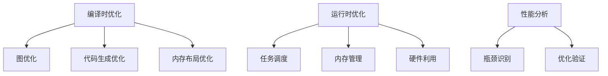
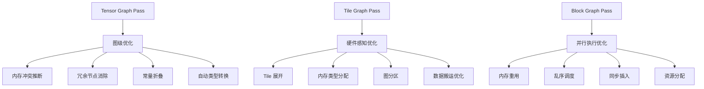
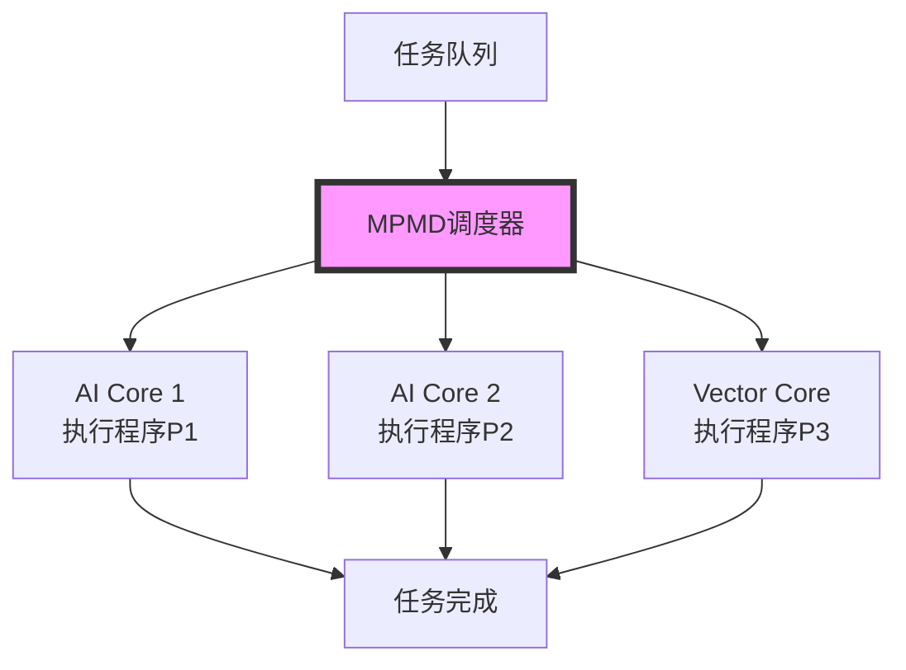

# PyPTO 性能优化指南

> **适用对象：** 需要优化算子性能的开发者  
> **学习时间：** 阅读时间约 30-45 分钟（不含实践）  
> **前置知识：** 已完成[Softmax示例](../01-examples/03-softmax.md)  
> **学习目标：** 掌握Tiling优化、内存优化和调度优化方法

## 概述

本文档总结 PyPTO 框架的性能优化策略、常见性能问题及解决方案。作为 AI 编译框架，性能优化是 PyPTO 的核心关注点之一。

**优化方向：**
- **Tiling优化**：合理配置Tile大小
- **内存优化**：减少内存占用和访问
- **调度优化**：提升并行度
- **算子融合**：减少通信开销

**相关文档：**
- [架构设计总结](../02-core/13-architecture-design.md) - 理解架构设计理念
- [模块关系图](../02-core/12-module-relationships.md) - 理解模块间关系
- [API 使用总结](../02-core/02-api-reference.md) - 了解性能优化 API

**相关内容：**
- 性能数据采集与解析脚本约定：见本文“性能分析工具”章节中的 `PROFILER_SAMPLECONFIG` 与解析脚本示例

---

## 目录

- [性能优化概览](#性能优化概览)
- [编译时优化](#编译时优化)
- [运行时优化](#运行时优化)
- [常见性能问题](#常见性能问题)
- [性能分析工具](#性能分析工具)
- [最佳实践](#最佳实践)

---

## 性能优化概览

### PyPTO 性能优化层次

PyPTO 的性能优化采用分层策略，从编译时到运行时全方位优化：



### 关键性能指标

| 指标 | 说明 | 测量方法 |
|------|------|---------|
| **Latency** | 单次推理延迟 | 端到端时间测量 |
| **Throughput** | 单位时间处理量 | 吞吐量测试 |
| **Memory Usage** | 内存占用 | 内存分析工具 |
| **Power Efficiency** | 功耗效率 | 功耗测量 |

---

## 编译时优化

### 图优化策略

#### 1. Pass 优化流程

基于当前版本源码分析（以 `framework/src/passes/` 为准），PyPTO 的 Pass 优化分为三个阶段：



#### 2. 关键优化 Pass

| Pass 名称 | 优化目标 | 实现位置 |
|----------|---------|---------|
| **InferMemoryConflict** | 内存冲突检测 | `passes/block_graph_pass/memory_reuse/` |
| **GlobalMemoryReuse** | 全局内存重用 | `passes/block_graph_pass/memory_reuse/` |
| **OoOSchedule** | 乱序调度 | `passes/block_graph_pass/prior_scheduling/` |
| **GraphPartition** | 图分区优化 | `passes/tile_graph_pass/` |

### 代码生成优化

#### 符号管理优化

基于 `framework/src/codegen/symbol_mgr/` 的分析：

```cpp
// 符号表管理
class SymbolManager {
private:
    std::map<uint64_t, SymbolInfo> symbolTable_;  // 高效查找
    std::unordered_map<std::string, uint64_t> nameToMagic_;  // 反向映射
};
```

**优化策略：**
- **符号复用**：相同的张量使用相同符号名
- **作用域管理**：函数级符号作用域隔离
- **类型推断**：编译时确定变量类型

#### CCE 代码优化

基于 `framework/src/codegen/codegen_cce.h` 的分析：

```cpp
class CodeGenCCE {
public:
    Status GenOpCode(Operation* op, std::stringstream& ss);
    Status OptimizeCode(std::string& code);  // 内联优化、循环展开等
};
```

**优化特性：**
- **指令融合**：相邻操作融合为复合指令
- **循环优化**：循环展开、向量化
- **分支优化**：条件分支优化

---

## 运行时优化

### 任务调度优化

#### MPMD 调度模型

基于 `framework/src/machine/` 的分析，PyPTO 采用 MPMD（Multiple Program Multiple Data）调度模型：



**MPMD vs 其他调度模型：**

| 调度模型 | 说明 | 适用场景 | PyPTO 选择原因 |
|---------|------|---------|--------------|
| **SPMD**<br/>(Single Program Multiple Data) | 所有处理器执行相同程序，不同数据 | 规则计算、SIMD 优化 | PyPTO 需要灵活的任务调度 |
| **MPMD**<br/>(Multiple Program Multiple Data) | 不同处理器可执行不同程序，处理不同数据 | 异构计算、复杂依赖 | 适应 AI 计算的多样性需求 |
| **SIMD**<br/>(Single Instruction Multiple Data) | 单指令多数据，硬件级并行 | 向量计算、图像处理 | PyPTO 在 Tile 级实现类似优化 |

**PyPTO MPMD 优势：**
- **灵活性**：不同 AI Core 可执行不同类型的操作
- **效率**：避免全局同步，减少等待时间
- **适应性**：适合复杂的神经网络计算模式

**调度策略：**
- **负载均衡**：任务均匀分布到各核心
- **依赖管理**：确保任务依赖关系正确
- **优先级调度**：关键路径优先执行

#### 内存管理优化

基于 `framework/src/machine/runtime/runtime.h` 的分析：

```cpp
struct RuntimeAgentMemory {
    void* Allocate(size_t size, MemoryType type);
    Status Deallocate(void* ptr);
    Status CopyToDevice(void* dst, void* src, size_t size);
};
```

**内存优化策略：**
- **预分配策略**：启动时预分配常用大小内存
- **内存池管理**：复用已释放的内存块
- **NUMA 感知**：根据 CPU 亲和性分配内存

### 硬件利用优化

#### Tile 形状优化

基于 `framework/src/interface/function/function.h` 的分析：

```cpp
struct TileShape {
    std::vector<int64_t> cubeTile;    // Cube 计算 Tile
    std::vector<int64_t> vecTile;     // Vector 计算 Tile
    int64_t commTile;                 // 通信 Tile
};
```

**优化原则：**
- **数据局部性**：最大化数据重用
- **硬件对齐**：满足内存对齐要求
- **并行粒度**：平衡并行度和开销

---

## 常见性能问题

### 1. Tile 形状不合理

**现象：**
- 性能远低于预期
- 内存访问效率低
- 硬件利用率不足

**原因：**
```python
# 不合理的 Tile 设置
pypto.set_vec_tile_shapes(32, 64)    # 太小，无法充分利用硬件
pypto.set_cube_tile_shapes([64, 64], [64, 64], [64, 64])  # 未考虑数据形状
```

**解决方案：**
```python
# 合理的 Tile 设置
pypto.set_vec_tile_shapes(128, 512)  # 16KB-64KB 范围 (@docs/api/config/pypto-set_vec_tile_shapes.md)
pypto.set_cube_tile_shapes([128, 128], [128, 128], [128, 128])  # 根据矩阵维度调整 (@docs/api/config/pypto-set_cube_tile_shapes.md)
```

### 2. 内存布局低效

**现象：**
- 频繁的内存拷贝
- Cache 未命中率高
- 内存带宽成为瓶颈

**原因：**
- 张量布局与访问模式不匹配
- 缺少内存预取
- 未使用视图优化

**解决方案：**
```python
# 使用视图优化内存布局
original = pypto.zeros(data.shape)
transposed = original.transpose(0, 1)  # 零拷贝转置
reshaped = original.reshape((new_shape,))  # 零拷贝重塑

# 注意：PyPTO Tensor 不提供 contiguous() 方法
# 内存布局由框架自动管理
```

### 3. 图分区不当

**现象：**
- 子图过小，调度开销大
- 子图过大，无法并行执行
- 跨子图通信频繁

**原因：**
- 默认分区策略不适合具体场景
- 未考虑硬件并行能力
- 依赖关系分析不准确

**解决方案：**
```python
# Pass 配置（参考 @docs/api/config/pypto-set_pass_config.md）
# 注意：当前版本主要支持图转储配置
from pypto import PassConfigKey
pypto.set_pass_config("default", "all", PassConfigKey.KEY_DUMP_GRAPH, True)
```

### 4. 同步开销过大

**现象：**
- 任务等待时间长
- 并行效率低下
- CPU 利用率低

**原因：**
- 过度同步
- 同步点设置不当
- 未使用异步执行

**解决方案：**
```python
# 注意：当前版本的 pypto.jit 不支持 async_execution 参数
# 异步执行需要通过 runtime_options 或其他配置实现
@pypto.jit(
    runtime_options={}
)
def compute(x, y):
    return complex_computation(x, y)

# Pass 配置（参考 @docs/api/config/pypto-set_pass_config.md）
# 注意：当前版本主要支持图转储配置
from pypto import PassConfigKey
pypto.set_pass_config("default", "all", PassConfigKey.KEY_DUMP_GRAPH, True)
```

---

## 性能分析工具

### 内置性能分析

#### Pass 时间统计

```cpp
// framework/src/passes/pass_mgr/pass_manager.cpp
void PassManager::RunPass(Function* func, PassType type) {
    auto start = std::chrono::high_resolution_clock::now();
    Status status = pass->RunOnFunction(func);
    auto end = std::chrono::high_resolution_clock::now();

    if (dumpPassTimeCost_) {
        LogPassTime(pass->GetPassName(),
                    std::chrono::duration_cast<std::chrono::milliseconds>(end - start));
    }
}
```

**启用方法：**

基于 `docs/api/config/pypto-set_pass_config.md` 的 API，启用调试配置：

```python
from pypto import PassConfigKey

# 启用图转储（实际可用的配置选项 @docs/api/config/pypto-set_pass_config.md）
pypto.set_pass_config("default", "all", PassConfigKey.KEY_DUMP_GRAPH, True)
```

**注意**：当前版本的 PyPTO Pass 配置系统相对简单，主要支持图转储功能。

#### 内存使用统计

```cpp
// framework/src/machine/runtime/runtime.h
struct MemoryStats {
    size_t totalAllocated;
    size_t peakUsage;
    size_t currentUsage;
    std::map<MemoryType, size_t> typeUsage;
};
```

**监控方法：**
```python
## 附录：系统工具（perf/strace）使用

**注意：** 以下系统工具（perf、strace）为 Linux 标准工具，不属于 PyPTO 特有功能。PyPTO 特有的性能分析入口见本文"性能分析工具"章节。

### 使用系统工具监控内存使用
import psutil
process = psutil.Process()
memory_info = process.memory_info()
print(f"Memory usage: {memory_info.rss / 1024 / 1024} MB")
```

### 外部性能工具

#### 1. PyPTO 内置分析工具

基于项目提供的分析脚本和工具：

```bash
# 运行日志分析（如果项目提供相应脚本）
# 注意：具体的分析脚本名称和参数可能因版本而异
# 请参考项目文档或源码中的脚本说明
```

#### 2. 性能数据采集

使用 Python 标准性能分析工具：

```python
# 性能分析使用系统工具（perf、gprof 等）
result = model(input_data)
```

#### 2.1 泳道图/PMU 数据采集：`PROFILER_SAMPLECONFIG`（项目脚本约定）

如果你在做运行时性能排查，常见的做法是通过环境变量 `PROFILER_SAMPLECONFIG` 配置采集等级与输出目录（示例中的 `result_dir/app_dir` 请按你的机器路径调整）：

```bash
# L0：暂无使用（保留示例）
export PROFILER_SAMPLECONFIG='{"stars_acsq_task":"off","app":"test_dynshape","prof_level":"l0","taskTime":"l0","result_dir":"/path/to/build","app_dir":"/path/to/build/.","ai_core_profiling":"off","aicpuTrace":"on"}'

# L1：泳道图数据打点采集
export PROFILER_SAMPLECONFIG='{"stars_acsq_task":"off","app":"test_dynshape","prof_level":"l1","taskTime":"l1","result_dir":"/path/to/build","app_dir":"/path/to/build/.","ai_core_profiling":"off","aicpuTrace":"on"}'

# L2：采集泳道图 + PMU 数据
export PROFILER_SAMPLECONFIG='{"stars_acsq_task":"off","app":"test_dynshape","prof_level":"l2","taskTime":"l2","result_dir":"/path/to/build","app_dir":"/path/to/build/.","ai_core_profiling":"off","aicpuTrace":"on"}'
```

说明：
- `result_dir/app_dir`：采集数据的存放路径（以及应用目录），通常按工程 `build/` 或指定输出路径组织
- 数据落盘后，常见路径形态类似：`<result_dir>/PROF_000001*/device_x/*/.../aicpu.data.0.slice_0`

#### 2.2 采集数据解析脚本（项目工具）

项目工具脚本常见用法如下（按你的数据路径替换）：

```bash
# 按 task id 绘制泳道图（示例）
python3 tilefwk_prof_data_parser.py -p <path-to-prof-data> -t

# PMU 转 CSV（示例；部分脚本可能未完全调测）
python3 tilefwk_pmu_to_csv.py -p <path-to-prof-data>
```

#### 3. 系统级性能分析工具

使用 Linux 系统标准性能分析工具：

```bash
# 使用 perf 进行系统级性能分析 (Linux 标准工具)
perf record -g -- python <your_script.py>  # 记录性能数据
perf report                              # 生成性能报告

# 使用 strace 分析系统调用
strace -c python <your_script.py>          # 统计系统调用
strace -T python <your_script.py>          # 显示调用时间
```

**工具来源说明：**
- `perf`：Linux 内核提供的性能分析工具，无需额外安装
- `strace`：Linux 系统调用跟踪工具，通常预装在大多数发行版中
- 其他工具如 `vtune` 等商业性能分析工具可能需要单独安装和配置

---

---

## 最佳实践

### 1. 开发阶段优化

#### 渐进式优化策略

```python
# 第1步：功能正确性
@pypto.jit
def basic_function(x):
    return x * 2  # 确保功能正确

# 第2步：基本性能优化
pypto.set_vec_tile_shapes(64, 512)  # 设置合理 Tile
@pypto.jit
def optimized_function(x):
    return x * 2

# 第3步：高级优化
# 注意：当前版本的 PyPTO Pass 配置系统相对简单
@pypto.jit  # 参考 @docs/api/config/pypto-jit.md
def highly_optimized_function(x):
    return x * 2
```

#### 性能基准建立

```python
import time

def benchmark_function(func, inputs, iterations=100):
    # 预热
    for _ in range(10):
        _ = func(*inputs)

    # 性能测试
    start_time = time.time()
    for _ in range(iterations):
        result = func(*inputs)
    end_time = time.time()

    avg_time = (end_time - start_time) / iterations
    return avg_time, result

# 使用示例
baseline_time, _ = benchmark_function(baseline_func, inputs)
optimized_time, _ = benchmark_function(optimized_func, inputs)
speedup = baseline_time / optimized_time
print(f"Performance improvement: {speedup:.2f}x")
```

### 2. 生产环境优化

#### 配置管理最佳实践

```python
# 配置文件管理
class PerformanceConfig:
    def __init__(self, model_size, hardware_type):
        self.model_size = model_size
        self.hardware_type = hardware_type
        self._setup_configs()

    def _setup_configs(self):
        if self.hardware_type == 'CloudNPU':
            self.tile_configs = {
                'vec_tile': (128, 512),
                'cube_tile': ([128, 128], [128, 128], [128, 128])
            }
        # 注意：EdgeNPU 为示例，实际使用时请根据目标硬件配置

    def apply_configs(self):
        pypto.set_vec_tile_shapes(*self.tile_configs['vec_tile'])
        pypto.set_cube_tile_shapes(*self.tile_configs['cube_tile'])
        # 应用其他优化配置
        self._apply_pass_configs()

    def _apply_pass_configs(self):
        # Pass 配置参考 @docs/api/config/pypto-set_pass_config.md
```

#### 监控和调优

```python
class PerformanceMonitor:
    def __init__(self):
        self.metrics = {}
        self.baseline = {}

    def set_baseline(self, func_name, baseline_time):
        self.baseline[func_name] = baseline_time

    def monitor_function(self, func, *args, **kwargs):
        start_time = time.time()
        result = func(*args, **kwargs)
        end_time = time.time()

        func_name = func.__name__
        execution_time = end_time - start_time

        if func_name in self.baseline:
            regression = execution_time / self.baseline[func_name]
            if regression > 1.1:  # 性能退化 10%
                self._report_regression(func_name, regression)

        self.metrics[func_name] = execution_time
        return result

    def _report_regression(self, func_name, regression):
        print(f"⚠️  Performance regression in {func_name}: {regression:.2f}x slower")

# 使用示例
monitor = PerformanceMonitor()
monitor.set_baseline('inference', 0.01)  # 10ms baseline

@monitor.monitor_function
@pypto.jit
def inference(x):
    return model(x)
```

### 3. 调试和分析

#### 性能问题诊断流程

```python
def diagnose_performance_issue(func, inputs):
    print("=== Performance Diagnosis ===")

    # 1. 启用性能分析
    # Pass 配置参考 @docs/api/config/pypto-set_pass_config.md
    from pypto import PassConfigKey
    pypto.set_pass_config("default", "all", PassConfigKey.KEY_DUMP_GRAPH, True)

    # 2. 运行并收集数据
    result = func(*inputs)

    # 3. 分析瓶颈
    print("Top 3 slowest passes:")
    # 分析 Pass 时间统计

    print("Memory usage analysis:")
    # 分析内存使用情况

    print("Hardware utilization:")
    # 分析硬件利用率

    return result

# 使用示例
@pypto.jit
def problematic_function(x):
    return complex_computation(x)

diagnose_performance_issue(problematic_function, test_inputs)
```

#### A/B 测试框架

```python
class PerformanceTestSuite:
    def __init__(self):
        self.results = {}

    def add_test_case(self, name, func, inputs):
        self.test_cases[name] = (func, inputs)

    def run_ab_test(self, baseline_name, candidate_name, iterations=100):
        baseline_func, inputs = self.test_cases[baseline_name]
        candidate_func, _ = self.test_cases[candidate_name]

        # 预热
        for _ in range(10):
            baseline_func(*inputs)
            candidate_func(*inputs)

        # A/B 测试
        baseline_times = []
        candidate_times = []

        for _ in range(iterations):
            # 测试 baseline
            start = time.time()
            baseline_func(*inputs)
            baseline_times.append(time.time() - start)

            # 测试 candidate
            start = time.time()
            candidate_func(*inputs)
            candidate_times.append(time.time() - start)

        baseline_avg = sum(baseline_times) / len(baseline_times)
        candidate_avg = sum(candidate_times) / len(candidate_times)

        improvement = (baseline_avg - candidate_avg) / baseline_avg * 100

        return {
            'baseline_avg': baseline_avg,
            'candidate_avg': candidate_avg,
            'improvement_percent': improvement,
            'statistical_significance': self._check_significance(baseline_times, candidate_times)
        }

    def _check_significance(self, group_a, group_b):
        # 简单的统计显著性检验
        from scipy import stats
        t_stat, p_value = stats.ttest_ind(group_a, group_b)
        return p_value < 0.05  # 95% 置信区间
```

---

## 总结

PyPTO 的性能优化是一个系统性的工程，涉及编译时和运行时的全方位优化：

### 核心优化策略

1. **编译时优化**：
   - 图变换和重写
   - 内存布局优化
   - 代码生成优化

2. **运行时优化**：
   - 任务调度优化
   - 内存管理优化
   - 硬件利用优化

3. **分析和调优**：
   - 性能瓶颈识别
   - 优化效果验证
   - 持续监控改进

### 性能优化方法论

**渐进式优化：**
1. **功能正确性优先**：确保实现正确
2. **性能基准建立**：设定性能目标
3. **系统性分析**：识别性能瓶颈
4. **针对性优化**：应用相应优化策略
5. **效果验证**：确认优化效果
6. **持续监控**：防止性能退化

**数据驱动优化：**
- 使用性能分析工具收集数据
- 基于数据分析做出优化决策
- 通过 A/B 测试验证优化效果
- 建立性能监控和预警机制

### 关键成功因素

1. **深入理解硬件**：掌握目标硬件的特性和限制
2. **系统性思维**：从整体架构角度考虑优化策略
3. **数据驱动决策**：基于性能数据而非直觉做出选择
4. **持续迭代优化**：性能优化是一个持续的过程

通过遵循这些原则和方法，开发者可以系统性地提升 PyPTO 应用的性能，实现从毫秒到微秒级的性能突破。

---

**相关文档：**
- [架构设计总结](../02-core/13-architecture-design.md) - 理解架构设计对性能的影响
- [API 使用总结](../02-core/02-api-reference.md) - 了解性能优化相关 API
- [Hello World 示例](../01-examples/00-hello-world.md) - 基础性能优化示例

