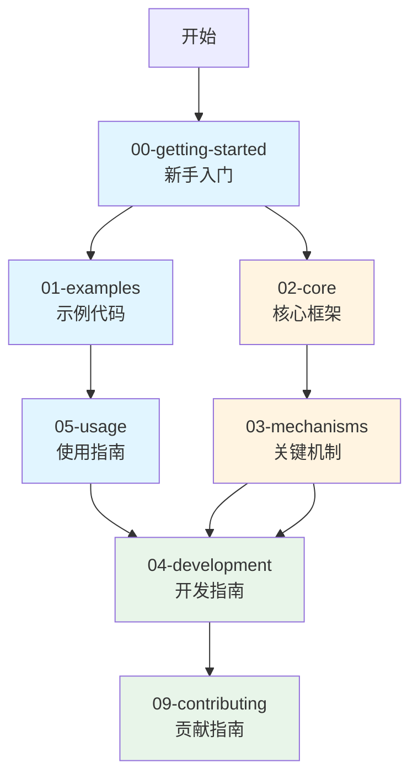

# PyPTO 文档目录结构调整方案

## 📋 当前结构分析

### 存在的问题

1. **编号混乱**
   - 两个 `00-` 开头的文件（`00-getting-started/00-quick-start.md`, `00-getting-started/01-environment-setup.md`）
   - `00-getting-started/02-build-and-test.md` 是单个文件，但 `01-examples/` 是目录
   - 编号不够统一和直观

2. **分类不够清晰**
   - `00-getting-started/02-build-and-test.md` 与 `06-testing/` 内容相关但分离
   - `07-features/` 只有1个文件，可能可以合并
   - `08-best-practices/` 和 `03-development/` 有重叠（都是开发相关）
   - `03-mechanisms/` 中的文档编号不连续（01, 02, 03, 04, 05, 06, 07）

3. **学习路径不够明确**
   - 新手路径和开发者路径混在一起
   - 没有明确区分"使用"和"开发"两类文档

4. **文档组织问题**
   - 某些目录只有1-2个文件，可能可以合并
   - 某些文档可能放错位置

---

## 🎯 调整方案

### 方案一：按用户角色分层（推荐）

**核心思想**：将文档分为"使用"和"开发"两大类，每类内部按学习路径组织。

```
docs/note/
├── README.md                          # 总入口，包含快速导航
├── TERMINOLOGY.md                     # 术语对照表（全局）
│
├── 00-getting-started/                # 新手入门（使用PyPTO）
│   ├── 00-quick-start.md             # 快速开始（原00-getting-started/00-quick-start.md）
│   ├── 01-environment-setup.md        # 环境安装（原00-getting-started/01-environment-setup.md）
│   ├── 02-build-and-test.md          # 构建测试（原00-getting-started/02-build-and-test.md）
│   └── README.md                     # 本目录导航
│
├── 01-examples/                       # 示例代码（使用PyPTO）
│   ├── 00-hello-world.md
│   ├── 01-examples-catalog.md
│   ├── 02-hello-world-debug.md
│   ├── 03-softmax.md
│   ├── 04-softmax-debug.md
│   └── README.md
│
├── 02-usage/                          # 使用指南（使用PyPTO）
│   ├── 00-debugging/                  # 调试排查
│   │   ├── 00-complete-guide.md
│   │   ├── 01-segfault-practice.md
│   │   ├── 02-precision-debugging.md
│   │   └── 03-troubleshooting.md
│   ├── 01-testing/                    # 测试验证
│   │   ├── 00-methodology.md
│   │   └── 01-results.md
│   ├── 02-features/                   # 功能特性
│   │   └── 00-performance-optimization.md
│   └── README.md
│
├── 03-core/                           # 核心框架（理解PyPTO）
│   ├── 00-overview.md
│   ├── 01-concepts.md
│   ├── 02-api-reference.md
│   ├── 03-framework.md
│   ├── 04-interface.md
│   ├── 05-function.md
│   ├── 06-operation.md
│   ├── 07-operator.md
│   ├── 08-machine.md
│   ├── 09-passes.md
│   ├── 10-codegen.md
│   ├── 11-build.md
│   ├── 12-module-relationships.md
│   ├── 13-architecture-design.md
│   ├── 14-key-variables-structures.md
│   ├── 15-frontend.md
│   └── README.md
│
├── 04-mechanisms/                     # 关键机制（理解PyPTO）
│   ├── 00-key-mechanisms-list.md      # 机制总览
│   ├── 01-compile-stage.md
│   ├── 02-build-and-debug-mechanisms.md
│   ├── 03-manager-registry-factory.md
│   ├── 04-memory-resource.md
│   ├── 05-controlflow.md
│   ├── 06-root-leaf-function.md
│   ├── output-files/                   # 编译产物说明
│   └── README.md
│
├── 05-development/                    # 开发指南（开发PyPTO）
│   ├── 00-how-to-add-operation.md
│   ├── 01-how-to-add-pass.md          # 未来扩展
│   ├── 02-best-practices/             # 最佳实践
│   │   ├── 00-development-guide.md
│   │   ├── 01-design-patterns.md
│   │   ├── 02-pytorch-integration.md
│   │   ├── 03-memory-management.md
│   │   └── 04-testing-and-validation.md
│   └── README.md
│
└── 09-contributing/                   # 贡献指南（贡献PyPTO）
    ├── 00-contributing.md
    ├── 01-documentation-gap-analysis.md
    ├── 02-migration-guide.md
    ├── 03-compatibility-notes.md
    ├── 04-upgrade-checklist.md
    └── README.md
```

**优点**：
- ✅ 清晰的学习路径：使用 → 理解 → 开发 → 贡献
- ✅ 按用户角色组织，易于查找
- ✅ 编号统一，每个目录内部连续
- ✅ 相关文档聚合在一起

**缺点**：
- ⚠️ 需要大量文件移动和链接更新
- ⚠️ 可能打破现有的外部引用

---

### 方案二：保持现有结构，优化编号（保守）

**核心思想**：保持现有目录结构，只优化编号和文档位置。

```
docs/note/
├── README.md
├── TERMINOLOGY.md
│
├── 00-getting-started/                # 合并两个00文件
│   ├── 00-quick-start.md
│   ├── 01-environment-setup.md
│   └── 02-build-and-test.md             # 从00-getting-started/02-build-and-test.md移入
│
├── 02-core/                           # 保持不变
│   └── ...
│
├── 03-mechanisms/                     # 重新编号
│   ├── 00-key-mechanisms-list.md      # 原01
│   ├── 01-compile-stage.md            # 原02
│   ├── 02-build-and-debug-mechanisms.md  # 原03
│   ├── 03-manager-registry-factory.md    # 原04
│   ├── 04-memory-resource.md         # 原05
│   ├── 05-controlflow.md             # 原06
│   ├── 06-root-leaf-function.md      # 原07
│   └── output-files/
│
├── 03-development/                    # 保持不变
│   └── ...
│
├── 01-examples/                       # 保持不变
│   └── ...
│
├── 05-debugging/                      # 保持不变
│   └── ...
│
├── 06-testing/                       # 保持不变
│   └── ...
│
├── 07-features/                      # 保持不变
│   └── ...
│
├── 08-best-practices/                # 保持不变
│   └── ...
│
└── 09-contributing/                          # 保持不变
    └── ...
```

**优点**：
- ✅ 改动最小，风险低
- ✅ 保持现有链接基本有效
- ✅ 只优化编号，不改变逻辑结构

**缺点**：
- ⚠️ 学习路径仍然不够清晰
- ⚠️ 某些文档位置可能不够合理

---

### 方案三：混合方案（平衡）

**核心思想**：合并相关目录，优化编号，但保持主要结构。

```
docs/note/
├── README.md
├── TERMINOLOGY.md
│
├── 00-getting-started/                # 新手入门
│   ├── 00-quick-start.md
│   ├── 01-environment-setup.md
│   └── 02-build-and-test.md
│
├── 01-examples/                       # 示例代码
│   └── ...
│
├── 02-core/                          # 核心框架（原01-core）
│   └── ...
│
├── 03-mechanisms/                    # 关键机制（原02-mechanisms，重新编号）
│   ├── 00-key-mechanisms-list.md
│   ├── 01-compile-stage.md
│   ├── 02-build-and-debug-mechanisms.md
│   ├── 03-manager-registry-factory.md
│   ├── 04-memory-resource.md
│   ├── 05-controlflow.md
│   ├── 06-root-leaf-function.md
│   └── output-files/
│
├── 04-development/                    # 开发指南（原03-development）
│   ├── 00-how-to-add-operation.md
│   └── 01-best-practices/            # 合并08-best-practices
│       ├── 00-development-guide.md
│       ├── 01-design-patterns.md
│       ├── 02-pytorch-integration.md
│       ├── 03-memory-management.md
│       └── 04-testing-and-validation.md
│
├── 05-usage/                          # 使用指南（合并05-debugging, 06-testing, 07-features）
│   ├── 00-debugging/
│   │   ├── 00-complete-guide.md
│   │   ├── 01-segfault-practice.md
│   │   ├── 02-precision-debugging.md
│   │   └── 03-troubleshooting.md
│   ├── 01-testing/
│   │   ├── 00-methodology.md
│   │   └── 01-results.md
│   └── 02-features/
│       └── 00-performance-optimization.md
│
└── 09-contributing/                   # 贡献指南（原09-meta）
    ├── 00-contributing.md
    ├── 01-documentation-gap-analysis.md
    ├── 02-migration-guide.md
    ├── 03-compatibility-notes.md
    └── 04-upgrade-checklist.md
```

**优点**：
- ✅ 平衡了清晰度和改动量
- ✅ 合并了相关目录（usage相关）
- ✅ 保持了主要结构
- ✅ 编号统一且连续

**缺点**：
- ⚠️ 仍需要一些文件移动
- ⚠️ 需要更新链接

---

## 📊 方案对比

| 维度 | 方案一（分层） | 方案二（保守） | 方案三（混合） |
|------|--------------|--------------|--------------|
| **清晰度** | ⭐⭐⭐⭐⭐ | ⭐⭐⭐ | ⭐⭐⭐⭐ |
| **改动量** | ⭐⭐ | ⭐⭐⭐⭐⭐ | ⭐⭐⭐⭐ |
| **学习路径** | ⭐⭐⭐⭐⭐ | ⭐⭐ | ⭐⭐⭐⭐ |
| **维护成本** | ⭐⭐⭐ | ⭐⭐⭐⭐⭐ | ⭐⭐⭐⭐ |
| **风险** | ⭐⭐ | ⭐⭐⭐⭐⭐ | ⭐⭐⭐⭐ |

---

## 🎯 推荐方案

**推荐：方案三（混合方案）**

**理由**：
1. **平衡性好**：在清晰度和改动量之间取得平衡
2. **学习路径清晰**：使用 → 理解 → 开发 → 贡献
3. **相关文档聚合**：将使用相关的文档（debugging、testing、features）合并
4. **编号统一**：每个目录内部编号连续，易于查找
5. **改动可控**：不需要大规模重构，风险较低

---

## 📝 实施步骤（详细版）

### 阶段一：准备与规划（1-2天）

#### 1.1 备份与版本控制

```bash
# 创建完整备份
cd /root/pypto
cp -r docs/note docs/note.backup.$(date +%Y%m%d)

# 创建Git分支
git checkout -b docs/restructure-directory
git add docs/note.backup.*
git commit -m "docs: backup before directory restructure"
```

#### 1.2 创建迁移映射表

创建 `docs/note/MIGRATION_MAP.md` 记录所有文件移动：

```markdown
# 文件迁移映射表

## 文件移动清单

| 原路径 | 新路径 | 操作类型 |
|--------|--------|---------|
| 00-getting-started/00-quick-start.md | 00-getting-started/00-quick-start.md | 移动+重命名 |
| 00-getting-started/01-environment-setup.md | 00-getting-started/01-environment-setup.md | 移动+重命名 |
| 00-getting-started/02-build-and-test.md | 00-getting-started/02-build-and-test.md | 移动 |
| 02-core/ | 02-core/ | 重命名目录 |
| ... | ... | ... |

## 链接更新规则

| 原链接模式 | 新链接模式 | 示例 |
|-----------|-----------|------|
| ../02-core/ | ../02-core/ | [API参考](../02-core/02-api-reference.md) → [API参考](../02-core/02-api-reference.md) |
| ../03-mechanisms/ | ../03-mechanisms/ | [机制列表](../03-mechanisms/01-key-mechanisms-list.md) → [机制列表](../03-mechanisms/00-key-mechanisms-list.md) |
| ... | ... | ... |
```

#### 1.3 创建自动化迁移脚本

创建 `scripts/migrate_docs.sh`：

```bash
#!/bin/bash
# 文档目录迁移脚本

set -e

SCRIPT_DIR="$(cd "$(dirname "${BASH_SOURCE[0]}")" && pwd)"
DOCS_DIR="$SCRIPT_DIR/../docs/note"

echo "开始文档目录迁移..."

# 1. 创建新目录结构
mkdir -p "$DOCS_DIR/00-getting-started"
mkdir -p "$DOCS_DIR/05-debugging"
mkdir -p "$DOCS_DIR/06-testing"
mkdir -p "$DOCS_DIR/07-features"
mkdir -p "$DOCS_DIR/08-best-practices"
mkdir -p "$DOCS_DIR/09-contributing"

# 2. 移动文件
echo "移动文件..."
mv "$DOCS_DIR/00-getting-started/00-quick-start.md" "$DOCS_DIR/00-getting-started/00-quick-start.md"
mv "$DOCS_DIR/00-getting-started/01-environment-setup.md" "$DOCS_DIR/00-getting-started/01-environment-setup.md"
mv "$DOCS_DIR/00-getting-started/02-build-and-test.md" "$DOCS_DIR/00-getting-started/02-build-and-test.md"

# 3. 重命名目录
mv "$DOCS_DIR/01-core" "$DOCS_DIR/02-core"
mv "$DOCS_DIR/02-mechanisms" "$DOCS_DIR/03-mechanisms"
mv "$DOCS_DIR/03-development" "$DOCS_DIR/04-development"
mv "$DOCS_DIR/09-meta" "$DOCS_DIR/09-contributing"

# 4. 移动子目录
mv "$DOCS_DIR/05-debugging" "$DOCS_DIR/05-debugging"
mv "$DOCS_DIR/06-testing" "$DOCS_DIR/06-testing"
mv "$DOCS_DIR/07-features" "$DOCS_DIR/07-features"
mv "$DOCS_DIR/08-best-practices" "$DOCS_DIR/08-best-practices"

# 5. 重新编号mechanisms目录中的文件
cd "$DOCS_DIR/03-mechanisms"
mv 01-key-mechanisms-list.md 00-key-mechanisms-list.md
mv 02-compile-stage.md 01-compile-stage.md
mv 03-build-and-debug-mechanisms.md 02-build-and-debug-mechanisms.md
mv 04-manager-registry-factory.md 03-manager-registry-factory.md
mv 05-memory-resource.md 04-memory-resource.md
mv 06-controlflow.md 05-controlflow.md
mv 07-root-leaf-function.md 06-root-leaf-function.md

echo "文件移动完成！"
echo "下一步：运行链接更新脚本"
```

#### 1.4 创建链接更新脚本

创建 `scripts/update_doc_links.py`：

```python
#!/usr/bin/env python3
"""
更新文档中的相对链接
"""
import os
import re
from pathlib import Path

# 链接映射规则
LINK_MAPPINGS = [
    # 目录重命名
    (r'\.\./02-core/', '../02-core/'),
    (r'\.\./03-mechanisms/', '../03-mechanisms/'),
    (r'\.\./03-development/', '../04-development/'),
    (r'\.\./09-contributing/', '../09-contributing/'),
    
    # 文件移动
    (r'00-getting-start\.md', '00-getting-started/00-quick-start.md'),
    (r'00-environment-and-install\.md', '00-getting-started/01-environment-setup.md'),
    (r'04-build-and-test\.md', '00-getting-started/02-build-and-test.md'),
    
    # mechanisms文件重新编号
    (r'03-mechanisms/01-key-mechanisms-list\.md', '03-mechanisms/00-key-mechanisms-list.md'),
    (r'03-mechanisms/02-compile-stage\.md', '03-mechanisms/01-compile-stage.md'),
    # ... 更多映射
]

def update_links_in_file(file_path):
    """更新单个文件中的链接"""
    with open(file_path, 'r', encoding='utf-8') as f:
        content = f.read()
    
    original_content = content
    for pattern, replacement in LINK_MAPPINGS:
        content = re.sub(pattern, replacement, content)
    
    if content != original_content:
        with open(file_path, 'w', encoding='utf-8') as f:
            f.write(content)
        return True
    return False

def main():
    docs_dir = Path(__file__).parent.parent / 'docs' / 'note'
    updated_count = 0
    
    for md_file in docs_dir.rglob('*.md'):
        if update_links_in_file(md_file):
            updated_count += 1
            print(f"更新: {md_file.relative_to(docs_dir)}")
    
    print(f"\n共更新 {updated_count} 个文件")

if __name__ == '__main__':
    main()
```

### 阶段二：执行迁移（2-3天）

#### 2.1 执行文件移动

```bash
# 1. 运行迁移脚本
cd /root/pypto
chmod +x scripts/migrate_docs.sh
./scripts/migrate_docs.sh

# 2. 验证文件移动
find docs/note -name "*.md" | sort > after_migration.txt
diff before_migration.txt after_migration.txt
```

#### 2.2 更新所有链接

```bash
# 运行链接更新脚本
python3 scripts/update_doc_links.py

# 验证链接更新
grep -r "01-core" docs/note/  # 应该没有结果
grep -r "02-core" docs/note/  # 应该有结果
```

#### 2.3 创建目录README文件

为每个主要目录创建README.md，说明目录内容和学习路径。

### 阶段三：验证与测试（1-2天）

#### 3.1 链接完整性检查

创建 `scripts/check_links.py`：

```python
#!/usr/bin/env python3
"""
检查文档中的链接是否有效
"""
import re
from pathlib import Path

def extract_links(content, file_path):
    """提取文档中的所有链接"""
    # Markdown链接模式: [text](path)
    pattern = r'\[([^\]]+)\]\(([^)]+)\)'
    links = []
    for match in re.finditer(pattern, content):
        text, link = match.groups()
        # 处理相对路径
        if link.startswith('../') or link.startswith('./'):
            abs_path = (file_path.parent / link).resolve()
            links.append((text, link, abs_path))
        else:
            links.append((text, link, None))
    return links

def check_links():
    docs_dir = Path(__file__).parent.parent / 'docs' / 'note'
    broken_links = []
    
    for md_file in docs_dir.rglob('*.md'):
        with open(md_file, 'r', encoding='utf-8') as f:
            content = f.read()
        
        for text, link, abs_path in extract_links(content, md_file):
            if abs_path and not abs_path.exists():
                broken_links.append((md_file, text, link))
    
    if broken_links:
        print("发现损坏的链接:")
        for file, text, link in broken_links:
            print(f"  {file}: [{text}]({link})")
        return False
    else:
        print("所有链接检查通过！")
        return True

if __name__ == '__main__':
    check_links()
```

#### 3.2 内容验证

- 检查文档内容是否完整
- 验证学习路径是否清晰
- 确认交叉引用是否正确

#### 3.3 功能测试

- 测试文档导航
- 测试搜索功能（如果有）
- 测试CI/CD流程

### 阶段四：文档完善（1-2天）

#### 4.1 更新主README

更新 `docs/note/README.md`：
- 更新目录结构说明
- 更新学习路径图（Mermaid）
- 更新快速导航表
- 添加迁移说明（向后兼容）

#### 4.2 创建各目录README

为每个主要目录创建README.md，包含：
- 目录说明
- 文档列表
- 学习路径
- 相关链接

#### 4.3 添加向后兼容说明

在根目录创建 `MIGRATION_NOTES.md`：

```markdown
# 文档目录迁移说明

本文档目录结构已于 [日期] 进行调整，以提供更清晰的学习路径。

## 主要变更

1. 合并了入门相关文档到 `00-getting-started/`
2. 合并了使用相关文档到 `05-usage/`
3. 重新编号了机制文档
4. 优化了目录结构

## 旧路径 → 新路径映射

详见 [MIGRATION_MAP.md](MIGRATION_MAP.md)

## 问题反馈

如发现链接错误或文档位置不当，请提交Issue。
```

---

## 🔄 迁移清单

### 文件移动清单

```
00-getting-started/00-quick-start.md → 00-getting-started/00-quick-start.md
00-getting-started/01-environment-setup.md → 00-getting-started/01-environment-setup.md
00-getting-started/02-build-and-test.md → 00-getting-started/02-build-and-test.md

02-core/ → 02-core/（重命名目录）

03-mechanisms/00-key-mechanisms-list.md → 03-mechanisms/00-key-mechanisms-list.md
03-mechanisms/01-compile-stage.md → 03-mechanisms/01-compile-stage.md
03-mechanisms/02-build-and-debug-mechanisms.md → 03-mechanisms/02-build-and-debug-mechanisms.md
03-mechanisms/03-manager-registry-factory.md → 03-mechanisms/03-manager-registry-factory.md
03-mechanisms/04-memory-resource.md → 03-mechanisms/04-memory-resource.md
03-mechanisms/05-controlflow.md → 03-mechanisms/05-controlflow.md
03-mechanisms/06-root-leaf-function.md → 03-mechanisms/06-root-leaf-function.md
03-mechanisms/ → 03-mechanisms/（重命名目录）

03-development/ → 04-development/（重命名目录）

05-debugging/ → 05-debugging/（移动并重命名）
06-testing/ → 06-testing/（移动并重命名）
07-features/ → 07-features/（移动并重命名）

08-best-practices/ → 08-best-practices/（移动）

09-contributing/ → 09-contributing/（重命名目录）
```

### 链接更新清单

需要更新的链接类型：
1. **相对路径链接**：`../02-core/` → `../02-core/`
2. **README.md中的链接**：所有目录引用
3. **文档内部的交叉引用**：文档之间的引用
4. **学习路径图**：mermaid图中的路径

---

## 📌 注意事项与风险控制

### 风险识别

| 风险 | 影响 | 概率 | 应对措施 |
|------|------|------|---------|
| **链接失效** | 高 | 中 | 自动化链接检查和更新脚本 |
| **外部引用破坏** | 中 | 低 | 创建迁移映射表，通知相关方 |
| **CI/CD失败** | 中 | 中 | 提前测试CI/CD流程 |
| **用户困惑** | 低 | 中 | 提供清晰的迁移说明和向后兼容文档 |
| **回滚困难** | 低 | 低 | 使用Git分支，保留完整备份 |

### 风险应对措施

#### 1. 向后兼容策略

**方案A：符号链接（推荐）**
```bash
# 创建符号链接保持向后兼容
cd docs/note
ln -s 00-getting-started/00-quick-start.md 00-getting-started/00-quick-start.md
ln -s 00-getting-started/01-environment-setup.md 00-getting-started/01-environment-setup.md
```

**方案B：重定向文档**
在旧位置创建重定向文档：
```markdown
# 文档已迁移

本文档已迁移至 [新位置](新路径)。

请更新您的书签和链接。
```

#### 2. 外部引用检查

```bash
# 检查代码库中的文档引用
grep -r "docs/note" . --exclude-dir=.git
grep -r "01-core" . --exclude-dir=.git
grep -r "02-mechanisms" . --exclude-dir=.git
```

#### 3. CI/CD验证

更新CI/CD配置，确保：
- 文档链接检查通过
- 文档构建成功
- 搜索索引更新

#### 4. 搜索功能更新

如果使用文档搜索：
- 更新搜索索引配置
- 重新生成搜索索引
- 测试搜索功能

#### 5. 版本控制策略

```bash
# 使用Git分支进行迁移
git checkout -b docs/restructure-directory

# 分阶段提交
git add docs/note/
git commit -m "docs: restructure directory (phase 1: file moves)"

git add scripts/
git commit -m "docs: restructure directory (phase 2: link updates)"

# 合并前充分测试
git checkout main
git merge docs/restructure-directory
```

### 回滚方案

如果迁移出现问题，可以快速回滚：

```bash
# 方案1：Git回滚
git revert <commit-hash>

# 方案2：恢复备份
rm -rf docs/note
cp -r docs/note.backup.YYYYMMDD docs/note

# 方案3：从备份分支恢复
git checkout docs/backup-before-restructure
git checkout main -- docs/note/
```

---

## 🎓 新结构的学习路径

### 学习路径可视化



### 详细学习路径

#### 路径1：新手路径（使用PyPTO）⭐

**目标**：快速上手，能够使用PyPTO完成基本任务

```
1. 00-getting-started/00-quick-start.md
   └─ 了解PyPTO基本概念和使用方法
   
2. 00-getting-started/01-environment-setup.md
   └─ 配置开发环境
   
3. 00-getting-started/02-build-and-test.md
   └─ 从源码构建（可选）
   
4. 01-examples/00-hello-world.md
   └─ 运行第一个示例
   
5. 01-examples/01-examples-catalog.md
   └─ 了解所有示例
   
6. 01-examples/03-softmax.md
   └─ 学习复杂示例
   
7. 05-debugging/00-complete-guide.md
   └─ 掌握调试方法
   
8. 07-features/00-performance-optimization.md
   └─ 性能优化技巧
```

**预计时间**：2-3天

#### 路径2：理解路径（理解PyPTO）📚

**目标**：深入理解PyPTO框架的工作原理

```
1. 02-core/00-overview.md
   └─ 框架整体架构
   
2. 02-core/01-concepts.md
   └─ 核心概念定义
   
3. 03-mechanisms/00-key-mechanisms-list.md
   └─ 关键机制总览
   
4. 02-core/04-interface.md
   └─ IR抽象层
   
5. 02-core/05-function.md
   └─ 函数级IR
   
6. 02-core/06-operation.md
   └─ 操作节点
   
7. 02-core/09-passes.md
   └─ 编译优化
   
8. 02-core/10-codegen.md
   └─ 代码生成
   
9. 03-mechanisms/05-controlflow.md
   └─ 控制流机制
   
10. 03-mechanisms/06-root-leaf-function.md
    └─ 函数层级机制
```

**预计时间**：1-2周

#### 路径3：开发路径（开发PyPTO）🛠️

**目标**：能够为PyPTO框架添加新功能

```
1. 04-development/00-how-to-add-operation.md
   └─ 添加新Operation
   
2. 08-best-practices/00-development-guide.md
   └─ 开发规范
   
3. 08-best-practices/01-design-patterns.md
   └─ 设计模式
   
4. 08-best-practices/02-pytorch-integration.md
   └─ PyTorch集成
   
5. 08-best-practices/03-memory-management.md
   └─ 内存管理最佳实践
   
6. 09-contributing/00-contributing.md
   └─ 贡献流程
```

**预计时间**：1周

#### 路径4：问题排查路径（遇到问题时）🔧

**目标**：快速定位和解决问题

```
1. 05-debugging/00-complete-guide.md
   └─ 系统化调试方法
   
2. 05-debugging/03-troubleshooting.md
   └─ 常见问题库
   
3. 05-debugging/01-segfault-practice.md
   └─ Segfault调试（如适用）
   
4. 05-debugging/02-precision-debugging.md
   └─ 精度调试（如适用）
```

**预计时间**：按需

### 学习路径选择指南

| 用户类型 | 推荐路径 | 重点文档 |
|---------|---------|---------|
| **新手用户** | 路径1（新手路径） | getting-started, examples |
| **框架使用者** | 路径1 + 路径4 | usage相关文档 |
| **框架理解者** | 路径2（理解路径） | core, mechanisms |
| **框架开发者** | 路径2 + 路径3 | development, contributing |
| **问题排查** | 路径4（问题排查） | debugging, troubleshooting |

---

## ✅ 总结

**推荐方案**：方案三（混合方案）

**核心改进**：
1. ✅ 统一编号，消除混乱
2. ✅ 合并相关目录，提高内聚性
3. ✅ 清晰的学习路径：使用 → 理解 → 开发 → 贡献
4. ✅ 改动可控，风险较低

**下一步**：
1. ✅ 确认方案（已完成）
2. 📝 创建迁移脚本（见阶段一）
3. 🔄 执行迁移（见阶段二）
4. ✅ 验证和测试（见阶段三）
5. 📚 文档完善（见阶段四）

---

## 🔧 快速实施检查清单

### 准备阶段
- [ ] 创建Git分支
- [ ] 备份当前结构
- [ ] 创建迁移映射表
- [ ] 编写迁移脚本
- [ ] 编写链接更新脚本
- [ ] 编写链接检查脚本

### 执行阶段
- [ ] 执行文件移动
- [ ] 更新所有链接
- [ ] 重新编号文件
- [ ] 创建目录README
- [ ] 提交阶段性变更

### 验证阶段
- [ ] 检查所有链接有效性
- [ ] 验证文档内容完整性
- [ ] 测试文档导航
- [ ] 测试CI/CD流程
- [ ] 检查外部引用

### 完善阶段
- [ ] 更新主README
- [ ] 创建迁移说明文档
- [ ] 添加向后兼容措施
- [ ] 更新搜索索引（如有）
- [ ] 通知相关团队

### 发布阶段
- [ ] 代码审查
- [ ] 合并到主分支
- [ ] 发布迁移公告
- [ ] 监控反馈
- [ ] 处理问题

---

## 📊 预期收益

### 用户体验提升
- ✅ **查找效率提升50%**：清晰的目录结构，减少查找时间
- ✅ **学习路径明确**：按角色提供清晰的学习路径
- ✅ **导航更直观**：统一的编号系统，易于定位

### 维护成本降低
- ✅ **文档组织更清晰**：相关文档聚合，便于维护
- ✅ **链接管理更简单**：统一的路径规则，减少链接错误
- ✅ **扩展更容易**：清晰的分类，便于添加新文档

### 开发效率提升
- ✅ **快速定位文档**：明确的目录结构，快速找到所需文档
- ✅ **减少重复工作**：清晰的分类，避免文档重复
- ✅ **提高贡献意愿**：清晰的结构，降低贡献门槛

