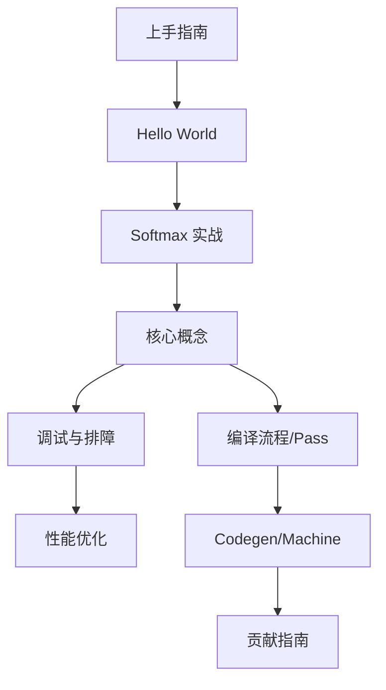

# PyPTO 技术文档

> **面向对象：** PyPTO 开发者（使用者/框架贡献者）  
> **学习目标：** 上手 → 理解 → 贡献

---

## 📖 本目录覆盖范围

**本目录（`docs/note/`）是 PyPTO 的自包含技术文档体系，覆盖：**
- ✅ 上手指南、环境安装、示例解析
- ✅ 核心框架原理（IR/Pass/Codegen/Machine）
- ✅ 调试方法、性能优化、最佳实践
- ✅ API 参考、术语对照、贡献流程

---

## 🚀 快速开始

按这个顺序读/做，最快进入状态：

1. **上手**：[上手指南](00-getting-started/00-quick-start.md)
   - 环境/安装/工具链：见 [环境准备与安装](00-getting-started/01-environment-setup.md)
2. **跑示例**：[Hello World 示例完整解析](01-examples/00-hello-world.md)、[Softmax 实战](01-examples/03-softmax.md)
   - 仓库 examples 全景：见 [examples 全景速览](01-examples/01-examples-catalog.md)
3. **补概念**：[核心概念](02-core/01-concepts.md)、[框架总览](02-core/00-overview.md)
4. **遇到问题**：[完整调试指南](05-debugging/00-complete-guide.md)、[Segfault 调试实战案例](05-debugging/01-segfault-practice.md)、[问题库](05-debugging/03-troubleshooting-and-known-issues.md)
   - 精度调试：见 [精度调试（流程与方法）](05-debugging/02-precision-debugging.md)
   - 常见问题与已知问题库：见 [问题库](05-debugging/03-troubleshooting-and-known-issues.md)
5. **准备贡献**：[贡献指南](09-contributing/00-contributing.md)、[模块关系](02-core/12-module-relationships.md)
6. **开发新功能**：[如何添加新的Operation](04-development/00-how-to-add-operation.md) - 开发指南

---

## 🎯 学习路径（图）

**图节点→文档链接对照表：**
- **上手指南** → [00-getting-started/00-quick-start.md](00-getting-started/00-quick-start.md)
- **Hello World** → [01-examples/00-hello-world.md](01-examples/00-hello-world.md)
- **Softmax 实战** → [01-examples/03-softmax.md](01-examples/03-softmax.md)
- **核心概念** → [02-core/01-concepts.md](02-core/01-concepts.md)
- **框架总览** → [02-core/00-overview.md](02-core/00-overview.md)
- **调试与排障** → [05-debugging/00-complete-guide.md](05-debugging/00-complete-guide.md)
- **性能优化** → [07-features/01-performance-optimization.md](07-features/01-performance-optimization.md)
- **编译流程/Pass** → [02-core/09-passes.md](02-core/09-passes.md)、[03-mechanisms/01-compile-stage.md](03-mechanisms/01-compile-stage.md)
- **Codegen/Machine** → [02-core/10-codegen.md](02-core/10-codegen.md)、[02-core/08-machine.md](02-core/08-machine.md)
- **贡献指南** → [09-contributing/00-contributing.md](09-contributing/00-contributing.md)
- **开发新功能** → [04-development/00-how-to-add-operation.md](04-development/00-how-to-add-operation.md)

---

## 📋 常见入口索引（按任务）

| 任务 | 入口文档 |
|------|---------|
| **第一次使用 PyPTO** | [上手指南](00-getting-started/00-quick-start.md) |
| **环境安装/配置** | [环境准备与安装](00-getting-started/01-environment-setup.md) |
| **跑第一个示例** | [Hello World 示例](01-examples/00-hello-world.md) |
| **理解核心概念** | [核心概念](02-core/01-concepts.md)、[术语对照表](TERMINOLOGY.md) |
| **程序崩溃/段错误** | [完整调试指南](05-debugging/00-complete-guide.md)、[Segfault 调试实战](05-debugging/01-segfault-practice.md) |
| **精度不对** | [精度调试](05-debugging/02-precision-debugging.md) |
| **性能慢** | [性能优化](07-features/01-performance-optimization.md) |
| **编译失败** | [完整调试指南](05-debugging/00-complete-guide.md)、[问题库](05-debugging/03-troubleshooting-and-known-issues.md) |
| **查看运行产物** | [输出文件说明](03-mechanisms/output-files/README.md) |
| **理解框架架构** | [框架总览](02-core/00-overview.md) |
| **查找 API 用法** | [API 参考](02-core/02-api-reference.md) |
| **贡献代码** | [贡献指南](09-contributing/00-contributing.md) |
| **添加新Operation** | [如何添加新的Operation](04-development/00-how-to-add-operation.md) |

---

## 📚 完整目录

### 核心框架（02-core/）

**解决什么问题：** 理解 PyPTO 框架的核心架构、IR 系统、编译流程、执行机制，适用于深入理解框架原理和进行框架级开发。

**必读文档：**
- [00. 框架总览](02-core/00-overview.md) - 整体架构与学习路径
- [01. 核心概念](02-core/01-concepts.md) - 关键概念定义
- [02. API参考](02-core/02-api-reference.md) - 核心API

**深入理解：**
- [03. Framework模块](02-core/03-framework.md) - 框架整体结构
- [04. Interface模块](02-core/04-interface.md) - IR抽象层
- [05. Function类](02-core/05-function.md) - 函数级IR
- [06. Operation类](02-core/06-operation.md) - 操作节点
- [07. Operator模块](02-core/07-operator.md) - 算子实现
- [08. Machine模块](02-core/08-machine.md) - 执行层
- [09. Passes模块](02-core/09-passes.md) - 编译优化
- [10. Codegen模块](02-core/10-codegen.md) - 代码生成
- [11. Build系统](02-core/11-build.md) - 构建系统

**高级主题：**
- [12. 模块关系](02-core/12-module-relationships.md) - 依赖关系
- [13. 架构设计](02-core/13-architecture-design.md) - 设计理念
- [14. 关键变量](02-core/14-key-variables-structures.md) - 数据结构
- [15. Frontend 解析器](02-core/15-frontend.md) - 前端 AST 解析器技术文档

### 关键机制（03-mechanisms/）

**解决什么问题：** 理解PyPTO框架中的关键机制，包括控制流（loop/cond/function）的编译机制，以及如何查看和分析编译产物（run.log、topo.json、program.json 等）。

- [06. 控制流编译机制](03-mechanisms/05-controlflow.md) - 控制流实现
- [01. 关键机制列表](03-mechanisms/00-key-mechanisms-list.md) - PyPTO框架关键机制总览
- [02. 编译阶段机制](03-mechanisms/01-compile-stage.md) - 编译阶段功能详解
- [03. 构建与调试工具机制](03-mechanisms/02-build-and-debug-mechanisms.md) - 构建/ASAN/环境变量机制
- [04. 管理机制详解](03-mechanisms/03-manager-registry-factory.md) - Manager/Registry/Factory机制
- [05. 内存与资源机制](03-mechanisms/04-memory-resource.md) - 内存分配、资源重用机制
- [输出文件说明](03-mechanisms/output-files/) - 编译产物解析

### 开发指南（04-development/）

**解决什么问题：** 讲解如何开发新需求，例如如何添加新的Operation、Pass等，适用于框架开发者和贡献者。

- [00. 如何添加新的Operation](04-development/00-how-to-add-operation.md) - 添加Operation的完整流程

### 构建与测试（00-getting-started/）

**解决什么问题：** 从源码构建PyPTO、运行测试、验证环境配置。

- [从源码构建与跑测试](00-getting-started/02-build-and-test.md) - 构建与测试指南

### 示例代码（01-examples/）⭐ 推荐新手阅读

**解决什么问题：** 通过实际示例学习如何使用 PyPTO，从最简单的 Hello World 到复杂的 Softmax 实现，包含调试文件解读。

- [00. Hello World](01-examples/00-hello-world.md) - 最简示例
- [01. Examples 全景速览](01-examples/01-examples-catalog.md) - 示例目录与学习路线
- [02. Hello World调试](01-examples/02-hello-world-debug.md) - 调试文件解读
- [03. Softmax](01-examples/03-softmax.md) - 实战案例
- [04. Softmax调试](01-examples/04-softmax-debug.md) - 复杂调试

### 调试排查（05-debugging/）⭐ 遇到问题必看

**解决什么问题：** 系统化调试方法、常见问题排查、精度调试、性能问题定位，适用于遇到运行时错误、精度偏差、性能瓶颈时快速定位。

- [00. 完整调试指南](05-debugging/00-complete-guide.md) - 系统化调试方法
- [01. Segfault调试实战](05-debugging/01-segfault-practice.md) - 实战案例
- [02. 精度调试](05-debugging/02-precision-debugging.md) - 精度对齐与收敛流程
- [03. 常见问题与已知问题库](05-debugging/03-troubleshooting-and-known-issues.md) - 问题库
- [04. 日志机制分析](05-debugging/04-logging-analysis.md) - 日志系统分析与改进方案
- [05. 环境变量参考](05-debugging/05-environment-variables.md) - 环境变量手册
- [构建与调试工具机制详解](03-mechanisms/02-build-and-debug-mechanisms.md) - 构建/ASAN/环境变量机制

### 测试验证（06-testing/）

**解决什么问题：** 理解测试体系、如何运行测试、如何验证功能正确性。

- [00. 测试方法](06-testing/00-methodology.md) - 测试体系
- [01. 测试结果](06-testing/01-results.md) - 验证结果

### 功能特性（07-features/）

**解决什么问题：** 理解编译阶段功能、性能优化技巧，适用于需要优化性能或理解编译行为的场景。

- [00. 性能优化](07-features/01-performance-optimization.md) - 优化技巧
- **编译阶段机制**：详见 [03-mechanisms/01-compile-stage.md](03-mechanisms/01-compile-stage.md)

### 最佳实践（08-best-practices/）

**解决什么问题：** PyPTO 项目特有的开发约定、设计模式、PyTorch 集成方法，适用于工程化接入和团队协作。

- [00. 开发指南](08-best-practices/00-development-guide.md) - 开发规范
- [01. 设计模式](08-best-practices/01-design-patterns.md) - 常用模式
- [02. PyTorch 集成与接入](08-best-practices/02-pytorch-integration.md) - 工程接入
- [03. 内存管理](08-best-practices/03-memory-management.md) - 内存管理最佳实践
- [04. 测试与验证](08-best-practices/04-testing-and-validation.md) - 测试验证最佳实践

### 贡献指南（09-contributing/）

**解决什么问题：** 文档体系分析、贡献流程，适用于贡献者了解如何参与项目。

- [00. 贡献指南](09-contributing/00-contributing.md) - 贡献流程
- [01. 文档分析](09-contributing/01-documentation-gap-analysis.md) - 文档体系
- [02. 迁移指南](09-contributing/02-migration-guide.md) - 版本迁移指南
- [03. 兼容性说明](09-contributing/03-compatibility-notes.md) - 兼容性约束

### 参考资料

- [上手指南](00-getting-started/00-quick-start.md) - 快速上手
- [术语对照表](TERMINOLOGY.md) - 统一术语
- [环境准备与安装](00-getting-started/01-environment-setup.md) - 依赖/安装/工具链
- [从源码构建与跑测试](00-getting-started/02-build-and-test.md) - 构建与测试
- [examples 全景速览](01-examples/01-examples-catalog.md) - 选示例与学习路线

---

## 🎓 推荐阅读顺序

1. [上手指南](00-getting-started/00-quick-start.md) - 快速上手
2. [术语对照表](TERMINOLOGY.md) - 统一术语（建议先读）
3. [环境准备与安装](00-getting-started/01-environment-setup.md) - 环境配置
4. [Hello World 示例完整解析](01-examples/00-hello-world.md) - 第一个示例
5. [Examples 全景速览](01-examples/01-examples-catalog.md) - 示例目录与学习路线
6. [核心概念](02-core/01-concepts.md) - 理解概念
7. [框架总览](02-core/00-overview.md) - 理解架构
8. [API参考](02-core/02-api-reference.md) - API使用
9. [完整调试指南](05-debugging/00-complete-guide.md) - 调试方法
10. [问题库](05-debugging/03-troubleshooting-and-known-issues.md) - 常见问题（遇到问题时查阅）
11. [性能优化](07-features/01-performance-optimization.md) - 性能优化
12. [贡献指南](09-contributing/00-contributing.md) - 准备贡献
13. [如何添加新的Operation](04-development/00-how-to-add-operation.md) - 开发新功能

---

## 🔗 相关资源

### 官方文档

| 文档 | 用途 |
|------|------|
| [API参考（note 版）](02-core/02-api-reference.md) | API 使用总结 + 全量目录附录 |
| [环境准备与安装（note 版）](00-getting-started/01-environment-setup.md) | 安装配置/脚本/工具链 |

### 源代码（关键入口可直接跳转）

| 目录/文件 | 说明 |
|------|------|
| [`../../python/pypto/`](../../python/pypto/) | Python API实现 |
| [`../../python/pypto/runtime.py`](../../python/pypto/runtime.py) | `@pypto.jit` 运行时与 run_mode 分发 |
| [`../../python/pypto/_controller.py`](../../python/pypto/_controller.py) | Tiling/控制流录制入口 |
| [`../../python/pypto/tensor.py`](../../python/pypto/tensor.py) | Tensor Python 层封装 |
| [`../../framework/src/`](../../framework/src/) | C++ 框架核心 |
| [`../../examples/`](../../examples/) | 示例代码 |

