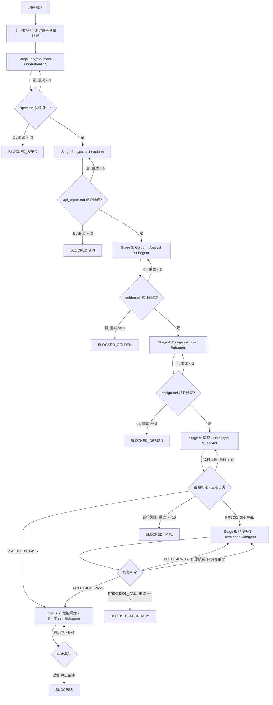

# PyPTO Agent Skill 总体架构优化设计方案 V2

> **版本**: 2.0
> **日期**: 2026-03-20
> **状态**: 已确认
> **基础**: 基于 agent-skills-solution-V1.md，结合 ai-tools-multi-agent-guide.md 最佳实践

---

## 一、设计目标

1. **全面对齐 V1 架构** — 统一 Stage 编号（1-7）、引入 Subagent 层、补全缺失 Skill
2. **强化 Skill 独立性** — Skill 不约定输入文件名和输出路径，可脱离 Agent 体系独立使用
3. **双平台兼容** — 以 OpenCode 为主，兼容 Claude Code
4. **简化知识库** — op-design 知识库从 600 行减至 60 行，改为搜索动态获取

---

## 二、整体架构

### 2.1 三层架构

```
┌─────────────────────────────────────────────────────────────────────┐
│                   Orchestrator 层（编排层）                           │
│  ┌───────────────────────────────────────────────────────────────┐ │
│  │ 职责：状态机管理、门禁检查、重试控制、用户交互                     │ │
│  │                                                               │ │
│  │ - 管理 7 个 Stage 的状态转换                                   │ │
│  │ - Stage 1-2 直接调用 Skill（共享上下文）                       │ │
│  │ - Stage 3-7 通过 Subagent 调用（上下文隔离）                   │ │
│  │ - 检查工件门禁，决定是否进入下一阶段                           │ │
│  │ - 持久化状态到 .orchestrator_state.json                       │ │
│  └───────────────────────────────────────────────────────────────┘ │
└─────────────────────────────────────────────────────────────────────┘
                              │
            ┌─────────────────┴─────────────────┐
            │                                   │
            ▼                                   ▼
     [Stage 1-2]                        [Stage 3-7]
     直接调用 Skill                     通过 Subagent 调用
            │                                   │
            ▼                                   ▼
┌─────────────────────┐         ┌─────────────────────────────────────┐
│   Skill 层           │         │          Subagent 层（隔离层）        │
│   (自包含、可独立)    │         │  ┌───────────────────────────────┐  │
│                     │         │  │ 职责：上下文隔离 + 路径管理     │  │
│  pypto-intent-      │         │  │ Analyst：Stage 3-4            │  │
│  understanding      │         │  │ Developer：Stage 5-6          │  │
│  pypto-api-explorer │         │  │ PerfTuner：Stage 7            │  │
│                     │         │  └───────────────────────────────┘  │
└─────────────────────┘         │              │                      │
                                │              ▼                      │
                                │   Skill 层（自包含、可独立）           │
                                │   (6 Skills)                       │
                                └─────────────────────────────────────┘
```

### 2.2 核心设计原则

| 原则 | 说明 |
|------|------|
| **Skill 自包含独立** | Skill 定义输入的内容类型，不约定文件名；通过 template 规范化输出格式，不约定路径 |
| **Skill 可独立使用** | 脱离 Subagent/Orchestrator 体系后，用户直接调用 Skill 也能完成算子开发 |
| **Subagent 只为隔离** | Subagent 的核心目的是上下文隔离，负责路径管理和内容传递 |
| **Orchestrator 管状态** | 状态机转换、门禁检查、重试控制 |
| **工件通过文件系统传递** | Subagent 读写 `custom/{op}/` 目录 |
| **门禁 = Skill 执行成功** | 验证在 Skill 内部完成（Checklist） |

### 2.3 Skill 输入输出契约

**输入约定（只约定内容类型，不约定来源）**：
- 需要什么内容（如"算子的数学公式和数据规格"）
- 内容可来自任何来源：用户自然语言、Subagent 传递的文件内容、其他 Skill 的输出

**输出约定（只约定格式和结构，不约定路径）**：
- 输出件格式（markdown / python）
- 输出件结构（template 定义）
- 导出函数签名（如适用）
- 路径由调用者（Subagent/Orchestrator/用户）决定

**独立使用时**：
- Skill 提示用户提供必要信息
- Skill 自行决定输出位置（当前目录或询问用户）

---

## 三、7-Stage 状态机

### 3.1 Stage 定义

| Stage | 名称 | 执行方式 | Skill | 可选 |
|-------|------|----------|-------|------|
| **1** | 需求理解 | Orchestrator → Skill | `pypto-intent-understanding` | 必选 |
| **2** | API 探索 | Orchestrator → Skill | `pypto-api-explorer`（新增） | 必选 |
| **3** | Golden 生成 | Analyst Subagent → Skill | `pypto-golden-generator` | 必选 |
| **4** | Design 设计 | Analyst Subagent → Skill | `pypto-op-design` | 必选 |
| **5** | 代码实现 | Developer Subagent → Skill | `pypto-op-develop` | 必选 |
| **6** | 精度修复 | Developer Subagent → Skill | `pypto-precision-debugger` | **可选** |
| **7** | 性能调优 | PerfTuner Subagent → Skill | `pypto-op-perf-analyzer` + `pypto-op-perf-autotuner` | 必选 |

> Stage 6 仅当 Stage 5 首跑检测到 `[PRECISION_FAIL]` 时才执行。

### 3.2 状态机流程图



### 3.3 三态分类（Stage 5 首跑判定）

| 标记 | 含义 | 检测方式 | 下一步 |
|------|------|----------|--------|
| `[PRECISION_PASS]` | 精度通过 | stdout 包含标记 | → Stage 7 |
| `[PRECISION_FAIL]` | 精度失败 | stdout 包含标记 | → Stage 6 |
| 无标记 + exit ≠ 0 | 运行失败 | exit code ≠ 0 且无标记 | → Stage 5 重试 |

**边界情况**：
| 情况 | 处理 | 是否计入重试 |
|------|------|-------------|
| 语法错误 | 快速失败 | 不计入 |
| import 失败 | 快速失败 | 不计入 |
| 运行时错误 | 运行失败 | 计入 |
| 超时 | 运行失败 | 计入 |
| PRECISION_FAIL | 进入 Stage 6 | 不计入 Stage 5 |

### 3.4 重试限制

| Stage | 最大重试 | 超限状态 |
|-------|---------|---------|
| 1 | 3 | BLOCKED_SPEC |
| 2 | 3 | BLOCKED_API |
| 3 | 3 | BLOCKED_GOLDEN |
| 4 | 3 | BLOCKED_DESIGN |
| 5 | 10 | BLOCKED_IMPL |
| 6 | 5 | BLOCKED_ACCURACY |
| 7 | 10 次迭代 | SUCCESS（带说明） |

### 3.5 Stage 6 精度修复策略

每次修复前必须备份当前 impl.py：

| 测试结果 | 处理方式 |
|----------|----------|
| `[PRECISION_PASS]` | 保留修改，进入 Stage 7 |
| `[PRECISION_FAIL]` | 对比精度指标：提升则保留并继续重试；下降则回滚后重试 |
| 功能问题（无标记报错） | 必须回滚到备份版本，继续尝试其他修复方案 |

### 3.6 Stage 7 中止条件

满足任一条件即中止：
- 迭代次数 >= 10
- 连续三次无性能提升
- 满足 spec.md 定义的性能目标

每次调优后必须验证精度。精度失败则回滚，计入中止计数。

---

## 四、Subagent 设计

### 4.1 Subagent 职责

Subagent 的核心目的是**上下文隔离**：

1. 接收 Orchestrator 的任务指令（含算子目录路径、Stage 编号）
2. 读取所需工件内容（从文件系统读取）
3. 调用 Skill（传递内容，不传递文件路径）
4. 管理输出位置（将 Skill 输出写入指定路径）
5. 返回执行结果摘要给 Orchestrator

### 4.2 三个 Subagent

#### Analyst Subagent（Stage 3-4）

```yaml
---
description: "PyPTO 算子分析 Subagent。负责 Golden 生成和 Design 设计阶段。
  接收算子目录路径和 Stage 指令，调用相应 Skill 完成分析工作。"
mode: subagent
tools: [Read, Write, Edit, Bash, Glob, Grep]
skills: [pypto-golden-generator, pypto-op-design]
---
```

职责：
- Stage 3: 读取 spec.md 内容 → 调用 pypto-golden-generator → 将输出写入算子目录
- Stage 4: 读取 spec.md + api_report.md + golden.py 内容 → 调用 pypto-op-design → 将输出写入算子目录
- 执行 Skill 内置 Checklist 验证
- 返回执行结果摘要

#### Developer Subagent（Stage 5-6）

```yaml
---
description: "PyPTO 算子开发 Subagent。负责代码实现和精度修复阶段。"
mode: subagent
tools: [Read, Write, Edit, Bash, Glob, Grep]
skills: [pypto-op-develop, pypto-precision-debugger, pypto-binary-search-verify]
---
```

职责：
- Stage 5: 读取 spec.md + design.md + golden.py 内容 → 调用 pypto-op-develop → 写入 impl.py + test.py + README.md → 执行首跑测试
- Stage 6: 读取精度失败信息 → 调用 pypto-precision-debugger（内部可调用 pypto-binary-search-verify）→ 修复 impl.py → 重跑验证

#### PerfTuner Subagent（Stage 7）

```yaml
---
description: "PyPTO 算子性能调优 Subagent。负责性能分析和调优迭代。"
mode: subagent
tools: [Read, Write, Edit, Bash, Glob, Grep]
skills: [pypto-op-perf-analyzer, pypto-op-perf-autotuner]
---
```

职责：
- 迭代调用 pypto-op-perf-analyzer → pypto-op-perf-autotuner
- 每次调优后验证精度
- 管理中止条件

### 4.3 Subagent 调用规则

| 规则 | 说明 |
|------|------|
| Subagent 不能调用 Subagent | 最多 3 层：Orchestrator → Subagent → Skill |
| Skill 可以调用其他 Skill | 如 precision-debugger 调用 binary-search-verify |
| Orchestrator 直接调用 Skill | Stage 1-2 共享上下文场景 |

---

## 五、目录结构

### 5.1 目标目录结构

```
# Agent 定义（OpenCode 为主）
.opencode/agents/
├── pypto-op-orchestrator.md      # Orchestrator（Primary Agent）→ 重写
├── pypto-op-analyst.md           # Analyst Subagent → 新增
├── pypto-op-developer.md         # Developer Subagent → 新增
└── pypto-op-perftuner.md         # PerfTuner Subagent → 新增

# Skill 定义
.agents/skills/
├── pypto-intent-understanding/   # 保留，优化独立性
│   └── SKILL.md
├── pypto-api-explorer/           # 新增
│   ├── SKILL.md
│   └── templates/
│       └── api_report.md
├── pypto-golden-generator/       # 保留，优化独立性
│   └── SKILL.md
├── pypto-op-design/              # 重构知识库
│   ├── SKILL.md
│   ├── templates/
│   │   └── design-template.md
│   └── references/
│       └── quick_ref.md          # 替代原 4 个文件（~60 行）
├── pypto-op-develop/             # 保留，优化独立性
│   └── SKILL.md
├── pypto-precision-debugger/     # 保留（统一精度调试入口）
│   └── SKILL.md
├── pypto-binary-search-verify/   # 保留（precision-debugger 的底层工具）
│   └── SKILL.md
├── pypto-op-perf-analyzer/       # 保留
│   └── SKILL.md
└── pypto-op-perf-autotuner/      # 保留
    └── SKILL.md
```

### 5.2 算子工作目录（与 V1 对齐）

```
custom/{op}/
├── spec.md                         # 需求规格
├── api_report.md                   # API 探索报告（新增）
├── design.md                       # 设计方案
├── {op}_golden.py                  # Golden 参考实现，导出 {op}_golden()
├── {op}_impl.py                    # PyPTO kernel 实现，导出 {op}_wrapper()
├── test_{op}.py                    # 测试入口
├── README.md                       # 算子文档
├── .orchestrator_state.json        # 状态持久化
└── history_version/                # 历史版本
```

---

## 六、Skill 输入输出约定

### 6.1 各 Skill 约定

| Skill | 需要的输入内容 | 输出格式 | 输出模板 |
|-------|-------------|---------|---------|
| `pypto-intent-understanding` | 算子名称、数学公式/计算描述、数据规格 | markdown | spec.md template |
| `pypto-api-explorer` | 算子计算逻辑（公式/代码/自然语言） | markdown | api_report.md template |
| `pypto-golden-generator` | 算子规格（等同 spec 内容） | python | `{op}_golden()` 函数 |
| `pypto-op-design` | 算子规格 + API 映射信息 + golden 代码 | markdown | design.md template |
| `pypto-op-develop` | 设计方案 + golden 代码 + 算子规格 | python×2 + md | impl.py + test.py + README.md |
| `pypto-precision-debugger` | 精度失败的 impl + golden + 错误信息 | python | 修复后的 impl.py |
| `pypto-op-perf-analyzer` | 性能数据 | markdown | 性能分析报告 |
| `pypto-op-perf-autotuner` | 精度通过的 impl + 性能分析报告 | python | 调优后的 impl.py |

### 6.2 三态标记约定

`test.py` 必须输出以下标记之一：
- 精度通过：`[PRECISION_PASS]`
- 精度失败：`[PRECISION_FAIL]`
- 功能问题：无标记，exit code ≠ 0

由 `pypto-op-develop` Skill 在生成 `test.py` 时统一实现。

---

## 七、具体变更清单

### 7.1 文件级变更

| 文件/目录 | 动作 | 说明 |
|----------|------|------|
| `.opencode/agents/pypto-op-orchestrator.md` | **重写** | 7-Stage 状态机，Stage 1-7 |
| `.opencode/agents/pypto-op-analyst.md` | **新增** | Analyst Subagent |
| `.opencode/agents/pypto-op-developer.md` | **新增** | Developer Subagent |
| `.opencode/agents/pypto-op-perftuner.md` | **新增** | PerfTuner Subagent |
| `.agents/skills/pypto-api-explorer/SKILL.md` | **新增** | API 探索 Skill |
| `.agents/skills/pypto-api-explorer/templates/api_report.md` | **新增** | 报告模板 |
| `.agents/skills/pypto-op-design/references/quick_ref.md` | **新增** | 核心原则速查 |
| `.agents/skills/pypto-op-design/references/api_mapping.md` | **删除** | 被 quick_ref.md 替代 |
| `.agents/skills/pypto-op-design/references/tiling_rules.md` | **删除** | 被 quick_ref.md 替代 |
| `.agents/skills/pypto-op-design/references/loop_strategy.md` | **删除** | 被 quick_ref.md 替代 |
| `.agents/skills/pypto-op-design/references/performance_params.md` | **删除** | 被 quick_ref.md 替代 |
| `.agents/skills/pypto-binary-search-without-verify/` | **删除整个目录** | 能力已不需要 |
| `AGENTS.md` | **精简** | 仅保留项目总体原则 |
| 各现有 Skill 的 SKILL.md | **优化** | 移除硬编码文件名/路径，强化独立性 |

### 7.2 状态文件迁移

旧格式（Stage 0/1/2a/2b/3-6）自动映射到新格式（Stage 1-7）：

| 旧 Stage | 新 Stage | 映射规则 |
|----------|----------|---------|
| 0 | 内部逻辑 | 不计入正式 Stage |
| 1 | 1 | 直接映射 |
| 2a | 3 | Golden 生成 |
| 2b | 4 | Design 设计 |
| 3 | 5 | 代码实现 |
| 4 | 6 | 精度修复 |
| 5 | 7 | 性能调优（合并原 5+6） |
| 6 | 7 | 性能调优（合并原 5+6） |

> 注：Stage 2（API 探索）是新增的，旧状态文件中不存在。迁移时如果旧 Stage 1 已完成且旧 Stage 2a 已完成，则新 Stage 2 自动标记为 completed（因为旧流程没有 API 探索步骤）。

---

## 八、AGENTS.md 精简方案

精简后的 AGENTS.md 仅保留：
- 项目概述（PyPTO、昇腾、CANN 8.5.0）
- 核心原则（文档优先、定位修复不推翻、方案可用即完成）
- 环境关键提示（TILE_FWK_DEVICE_ID、PTO_TILE_LIB_CODE_PATH）
- API 文档和示例位置

移除：
- 开发技能系统（Skill 列表）
- 调试辅助（binary-search 说明）
- 项目目录结构（由 Orchestrator 管理）

---

## 九、双平台兼容策略

| 概念 | OpenCode | Claude Code |
|------|----------|-------------|
| Primary Agent | `.opencode/agents/` + `mode: primary` | Orchestrator Skill/CLAUDE.md |
| Subagent | `.opencode/agents/` + `mode: subagent` | Agent tool + 自然语言描述 |
| Skill | `.agents/skills/` | `.agents/skills/`（位置相同） |
| Subagent 调用 | OpenCode 原生切换 | Agent tool 传递 Subagent `.md` 内容 |

Subagent `.md` 文件的指令内容是通用的，仅 frontmatter 格式因工具而异。

---

## 十、统一结束态

| 状态 | 含义 | 恢复方式 |
|------|------|----------|
| `SUCCESS` | 全流程完成 | — |
| `BLOCKED_SPEC` | Stage 1 重试超限 | 用户指令恢复 |
| `BLOCKED_API` | Stage 2 重试超限 | 用户指令恢复 |
| `BLOCKED_GOLDEN` | Stage 3 重试超限 | 用户指令恢复 |
| `BLOCKED_DESIGN` | Stage 4 重试超限 | 用户指令恢复 |
| `BLOCKED_IMPL` | Stage 5 重试超限 | 用户指令恢复 |
| `BLOCKED_ACCURACY` | Stage 6 重试超限 | 用户指令恢复 |
| `BLOCKED_ENVIRONMENT` | 环境问题 | 用户指令恢复 |

恢复方式：识别用户意图 → 从 current_stage 恢复 → 重置该 Stage 重试计数。

---

## 十一、状态持久化格式

```json
{
  "operator_name": "{op}",
  "current_stage": 5,
  "stage_status": {
    "1": "completed",
    "2": "completed",
    "3": "completed",
    "4": "completed",
    "5": "in_progress"
  },
  "stage_retry_count": {
    "1": 0,
    "2": 0,
    "3": 0,
    "4": 0,
    "5": 0,
    "6": 0
  },
  "last_updated": "2026-03-20T10:30:00Z",
  "perf_iteration": {
    "count": 0,
    "last_improvement": 0.0,
    "consecutive_no_improvement": 0
  }
}
```

---

## 十二、关键设计决策

| 决策项 | 选择 | 原因 |
|--------|------|------|
| **Skill 独立性** | 不约定输入文件名和输出路径 | Skill 可脱离 Agent 体系独立使用 |
| **Subagent 角色** | 仅做上下文隔离 + 路径管理 | 核心逻辑在 Skill 中，保持 Skill 可独立迭代 |
| **目标平台** | OpenCode 为主，兼容 Claude Code | 项目实际使用 OpenCode |
| **binary-search-verify** | 保留，由 precision-debugger 调用 | 仍然是精度二分定位的核心工具 |
| **binary-search-without-verify** | 删除 | 能力已不需要 |
| **op-design 知识库** | 4 文件 → 1 个 quick_ref.md | 减少 90%，改为搜索动态获取 |
| **AGENTS.md** | 仅保留项目总体原则 | 不专门针对算子开发 |
| **Stage 编号** | 1-7 | 与 V1 对齐 |
| **三态分类** | PRECISION_PASS/FAIL/无标记 | 区分精度问题和功能问题 |
