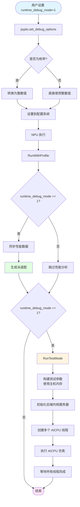

# DebugMode 枚举类与 RunTestMode 技术文档

## 概述

本文档描述了 PyPTO 中 `debug_options` 的枚举类设计，以及 `runtime_debug_mode=1` 时启用泳道图和 AICPU 仿真的实现机制。

## 1. DebugMode 枚举类设计

### 1.1 枚举定义

`DebugMode` 是一个 `IntEnum` 枚举类，用于统一管理编译阶段和运行阶段的调试模式。

**位置**: `python/pypto/runtime.py`

```python
class DebugMode(IntEnum):
    """Debug mode enumeration for both compile and runtime stages."""
    NONE = 0  # Default: no debug mode enabled
    ALL = 1   # Enable all debug features
```

### 1.2 设计特点

1. **共用枚举**: `compile_debug_mode` 和 `runtime_debug_mode` 共用同一个 `DebugMode` 枚举类
2. **IntEnum 继承**: 继承自 `IntEnum`，可以直接与整数进行比较和运算
3. **向后兼容**: 支持整数（0/1）和枚举值（`DebugMode.NONE`/`DebugMode.ALL`）两种使用方式

### 1.3 使用方式

```python
# 方式1: 使用整数（向后兼容）
pypto.set_debug_options(compile_debug_mode=1, runtime_debug_mode=1)

# 方式2: 使用枚举类（推荐）
pypto.set_debug_options(
    compile_debug_mode=pypto.DebugMode.ALL,
    runtime_debug_mode=pypto.DebugMode.ALL
)
```

## 2. set_debug_options 实现

### 2.1 函数签名

**位置**: `python/pypto/config.py`

```python
def set_debug_options(*,
                      compile_debug_mode: Optional[Union[int, DebugMode]] = None,
                      runtime_debug_mode: Optional[Union[int, DebugMode]] = None
                      ) -> None:
```

### 2.2 参数处理

函数支持整数和枚举类型，由于 `DebugMode` 继承自 `IntEnum`，可以直接与整数进行比较和赋值：

```python
from .runtime import DebugMode

# 由于 DebugMode 是 IntEnum，可以直接使用
options_dict = {k: v for k, v in locals().items() if v is not None}
set_options(debug_options=options_dict)
```

**注意**: `IntEnum` 类型的值可以直接作为整数使用，因此不需要显式转换。如果传入 `DebugMode.ALL`，其值 `1` 会自动传递给配置系统。

### 2.3 配置传递

配置值通过 `set_options(debug_options=options_dict)` 传递到 C++ 层，使用以下常量：

- `CFG_COMPILE_DBEUG_MODE = "compile_debug_mode"`
- `CFG_RUNTIME_DBEUG_MODE = "runtime_debug_mode"`
- `CFG_DEBUG_NONE = 0`
- `CFG_DEBUG_ALL = 1`

## 3. runtime_debug_mode=1 功能实现

当 `runtime_debug_mode=1` (或 `DebugMode.ALL`) 时，会启用以下功能：

### 3.1 泳道图（Swimlane Graph）

**实现位置**: `framework/src/machine/runtime/device_launcher.cpp`

在 `RunWithProfile` 函数中：

```cpp
int DeviceLauncher::RunWithProfile(rtStream_t aicoreStream, rtStream_t aicpuStream) {
    // ...
    if (config::GetDebugOption<int64_t>(CFG_RUNTIME_DBEUG_MODE) == CFG_DEBUG_ALL) {
        // 启用性能分析，生成泳道图
        DeviceRunner::Get().DynamicLaunchSynchronize(aicpuStream, nullptr, aicoreStream);
        DeviceRunner::Get().SynchronizeDeviceToHostProfData();
        DeviceRunner::Get().ResetPerData();
    }
    return 0;
}
```

**功能说明**:
- 自动启用性能分析（`profile_enable = True`）
- 同步设备到主机的性能数据
- 生成泳道图用于性能调优

### 3.2 AICPU 仿真（RunTestMode）

**实现位置**: `framework/src/machine/runtime/device_launcher.cpp`

在 `DeviceLaunchOnceWithDeviceTensorData` 函数中，NPU 执行后调用 RunTestMode：

```cpp
int DeviceLauncher::DeviceLaunchOnceWithDeviceTensorData(...) {
    // ... NPU 执行流程 ...
    
    rc = RunWithProfile(aicoreStream, aicpuStream);
    if (rc < 0) {
        return rc;
    }

    // When runtime_debug_mode=1, enable RunTestMode for aicpu simulation
    int64_t runtime_debug_mode = config::GetDebugOption<int64_t>(CFG_RUNTIME_DBEUG_MODE);
    if (runtime_debug_mode == CFG_DEBUG_ALL) {
        RunTestMode(function, inputList, outputList, config);
    }
    
    // ... 同步流程 ...
}
```

## 4. RunTestMode 实现细节

### 4.1 DeviceLauncher::RunTestMode

**位置**: `framework/src/machine/runtime/device_launcher.cpp`

```cpp
void DeviceLauncher::RunTestMode(Function *function, 
        const std::vector<DeviceTensorData> &inputList,
        const std::vector<DeviceTensorData> &outputList, 
        const DeviceLauncherConfig &config) {
    // 检查 runtime_debug_mode
    int64_t runtime_debug_mode = config::GetDebugOption<int64_t>(CFG_RUNTIME_DBEUG_MODE);
    if (runtime_debug_mode != CFG_DEBUG_ALL) {
        return;
    }

    if (function == nullptr || function->GetDyndevAttribute() == nullptr) {
        return;
    }

    // 使用主机内存构建测试参数
    DeviceKernelArgs kArgsTest;
    DeviceLauncherConfig testConfig = config;
    testConfig.onBoard = false;  // 使用主机内存
    DeviceLauncherConfigFillDeviceInfo(testConfig);
    
    // 使用 MemoryHelper(true) 表示测试模式（主机内存）
    CostModelLauncher::MemoryHelper memoryHelper(true);
    DeviceInitTilingData(memoryHelper, kArgsTest, 
        function->GetDyndevAttribute()->devProgBinary, testConfig, nullptr);
    DeviceInitKernelInOuts(memoryHelper, kArgsTest, inputList, outputList,
        function->GetDyndevAttribute()->disableL2List, config.isGETensorList);
    
    std::cout << "Run TestModel (aicpu simulation) " << "\n";
    // 调用 CostModelLauncher::RunTestMode 进行 AICPU 仿真
    CostModelLauncher::RunTestMode(&kArgsTest);
}
```

### 4.2 CostModelLauncher::RunTestMode

**位置**: `framework/src/cost_model/simulation/cost_model_launcher.h`

```cpp
// RunTestMode for aicpu simulation (can be called from DeviceLauncher)
static void RunTestMode(DeviceKernelArgs *kArgs) {
    std::thread aicpus[DEVICE_MAX_AICPU_NUM];
    std::atomic<int> idx{0};
    auto *devProg = (DevAscendProgram *)(kArgs->cfgdata);
    
    // 初始化后端内核服务器
    (void)DynTileFwkBackendKernelServerInit(kArgs);
    
    // 计算线程数
    int threadNum = static_cast<int>(devProg->devArgs.nrAicpu);
    threadNum = (devProg->devArgs.enableCtrl == 1) ? threadNum : threadNum + 1;
    
    // 创建多个 AICPU 线程进行仿真
    for (int i = 0; i < threadNum; i++) {
        aicpus[i] = std::thread([&]() {
            int tidx = idx++;
            cpu_set_t cpuset;
            CPU_ZERO(&cpuset);
            CPU_SET(tidx, &cpuset);
            std::string name = "aicput" + std::to_string(tidx);
            std::cout << "start thread: " << name << std::endl;
            pthread_setname_np(pthread_self(), name.c_str());
            pthread_setaffinity_np(pthread_self(), sizeof(cpu_set_t), &cpuset);
            
            // 根据线程类型执行不同的服务器
            if ((devProg->devArgs.enableCtrl == 0) && 
                (uint32_t)tidx == devProg->devArgs.scheCpuNum) {
                (void)PyptoKernelCtrlServer(kArgs);
            } else {
                (void)DynTileFwkBackendKernelServer(kArgs);
            }
        });
    }

    // 等待所有线程完成
    for (int i = 0; i < threadNum; i++) {
        if (aicpus[i].joinable()) {
            aicpus[i].join();
        }
    }
}
```

### 4.3 关键特性

1. **多线程仿真**: 根据 `devProg->devArgs.nrAicpu` 创建多个线程模拟 AICPU 执行
2. **CPU 亲和性**: 每个线程绑定到不同的 CPU 核心
3. **线程命名**: 使用 `aicput0`, `aicput1` 等名称便于调试
4. **控制线程**: 如果未启用内置控制，会创建一个额外的控制线程

## 5. 调用流程

### 5.1 Python 层调用

```
用户代码
  └─> pypto.set_debug_options(runtime_debug_mode=pypto.DebugMode.ALL)
      └─> config.py::set_debug_options()
          └─> 转换为整数并设置到配置系统
```

### 5.2 C++ 层执行流程

```
DeviceLaunchOnceWithDeviceTensorData()
  ├─> 初始化环境和 Kernel 参数
  ├─> DeviceRunner::DynamicLaunch() [NPU 执行]
  ├─> RunWithProfile() [性能分析，生成泳道图]
  │   └─> 检查 runtime_debug_mode == CFG_DEBUG_ALL
  │       └─> 同步性能数据，生成泳道图
  │
  └─> RunTestMode() [AICPU 仿真]
      └─> 检查 runtime_debug_mode == CFG_DEBUG_ALL
          └─> DeviceLauncher::RunTestMode()
              └─> 使用主机内存构建测试参数
                  └─> CostModelLauncher::RunTestMode()
                      └─> 多线程 AICPU 仿真
```

### 5.3 完整流程图



## 6. 内存管理

### 6.1 NPU 执行模式

- **内存工具**: `DeviceMemoryUtils()` - 使用 NPU 设备内存
- **数据位置**: 数据在 NPU 设备上

### 6.2 RunTestMode 仿真模式

- **内存工具**: `CostModelLauncher::MemoryHelper(true)` - 使用主机内存
- **数据位置**: 数据在主机内存上
- **配置**: `testConfig.onBoard = false` - 标记为不在板上执行

## 7. 线程模型

### 7.1 线程数量计算

```cpp
int threadNum = static_cast<int>(devProg->devArgs.nrAicpu);
// 如果未启用内置控制，需要额外一个控制线程
threadNum = (devProg->devArgs.enableCtrl == 1) ? threadNum : threadNum + 1;
```

### 7.2 线程分配

- **AICPU 工作线程**: `nrAicpu` 个线程，执行 `DynTileFwkBackendKernelServer`
- **控制线程**: 如果 `enableCtrl == 0`，额外创建一个线程执行 `PyptoKernelCtrlServer`

### 7.3 CPU 亲和性

每个线程绑定到不同的 CPU 核心，避免线程迁移带来的性能损失：

```cpp
cpu_set_t cpuset;
CPU_ZERO(&cpuset);
CPU_SET(tidx, &cpuset);
pthread_setaffinity_np(pthread_self(), sizeof(cpu_set_t), &cpuset);
```

## 8. 使用示例

### 8.1 基本使用

```python
import pypto

# 启用运行时调试模式
pypto.set_debug_options(runtime_debug_mode=pypto.DebugMode.ALL)

# 或者使用整数值
pypto.set_debug_options(runtime_debug_mode=1)

# 定义和运行 kernel
@pypto.frontend.jit(runtime_options={"run_mode": pypto.RunMode.NPU})
def my_kernel(x: pypto.Tensor(...), y: pypto.Tensor(...)):
    return x + y

result = my_kernel(input0, input1)
# 执行后会：
# 1. 生成泳道图（在 output/ 目录下）
# 2. 执行 AICPU 仿真（在控制台输出 "Run TestModel (aicpu simulation)"）
```

### 8.2 同时启用编译和运行时调试

```python
# 使用枚举类（推荐）
pypto.set_debug_options(
    compile_debug_mode=pypto.DebugMode.ALL,
    runtime_debug_mode=pypto.DebugMode.ALL
)

# 使用整数值（向后兼容）
pypto.set_debug_options(
    compile_debug_mode=1,
    runtime_debug_mode=1
)
```

## 9. 配置常量

### 9.1 C++ 层常量

**位置**: `framework/src/interface/inner/config.h`

```cpp
// Debug mode configuration keys
constexpr const char *CFG_COMPILE_DBEUG_MODE = "compile_debug_mode";
constexpr const char *CFG_RUNTIME_DBEUG_MODE = "runtime_debug_mode";

// Debug mode values
const int64_t CFG_DEBUG_NONE = 0;
const int64_t CFG_DEBUG_ALL = 1;
const int64_t CFG_DEBUG_NO_DEVICE_TENSOR_DEPEND = 2;
```

### 9.2 配置获取

```cpp
// 获取运行时调试模式
int64_t runtime_debug_mode = config::GetDebugOption<int64_t>(CFG_RUNTIME_DBEUG_MODE);

// 检查是否启用
if (runtime_debug_mode == CFG_DEBUG_ALL) {
    // 执行调试相关功能
}
```

## 10. 注意事项

### 10.1 性能影响

- **泳道图生成**: 会增加一定的性能开销，主要用于性能分析和调优
- **AICPU 仿真**: 在主机 CPU 上运行，会显著增加执行时间，仅用于调试和测试

### 10.2 使用场景

- **开发阶段**: 使用 `runtime_debug_mode=1` 进行调试和性能分析
- **生产环境**: 建议关闭调试模式以获得最佳性能

### 10.3 内存要求

- RunTestMode 使用主机内存，需要确保主机有足够的内存来存储仿真数据
- 大型模型可能需要较大的主机内存

## 11. 相关文件

### 11.1 Python 层

- `python/pypto/runtime.py`: DebugMode 枚举类定义
- `python/pypto/config.py`: set_debug_options 实现
- `python/pypto/__init__.py`: DebugMode 导出

### 11.2 C++ 层

- `framework/src/machine/runtime/device_launcher.h`: DeviceLauncher::RunTestMode 声明
- `framework/src/machine/runtime/device_launcher.cpp`: DeviceLauncher::RunTestMode 实现
- `framework/src/cost_model/simulation/cost_model_launcher.h`: CostModelLauncher::RunTestMode 实现
- `framework/src/interface/inner/config.h`: 配置常量定义

### 11.3 文档

- `docs/api/config/pypto-set_debug_options.md`: API 文档

## 12. 总结

1. **枚举类设计**: `DebugMode` 作为 `IntEnum`，`compile_debug_mode` 和 `runtime_debug_mode` 共用
2. **向后兼容**: 支持整数和枚举两种使用方式
3. **功能集成**: `runtime_debug_mode=1` 同时启用泳道图和 AICPU 仿真
4. **实现分离**: RunTestMode 保持在 CostModelLauncher 中，DeviceLauncher 通过静态方法调用
5. **内存隔离**: NPU 执行使用设备内存，RunTestMode 使用主机内存，互不干扰
