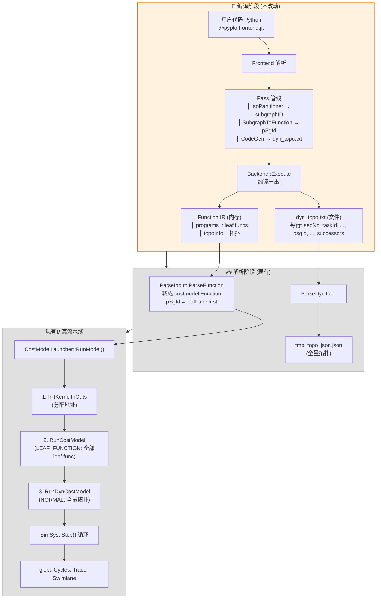
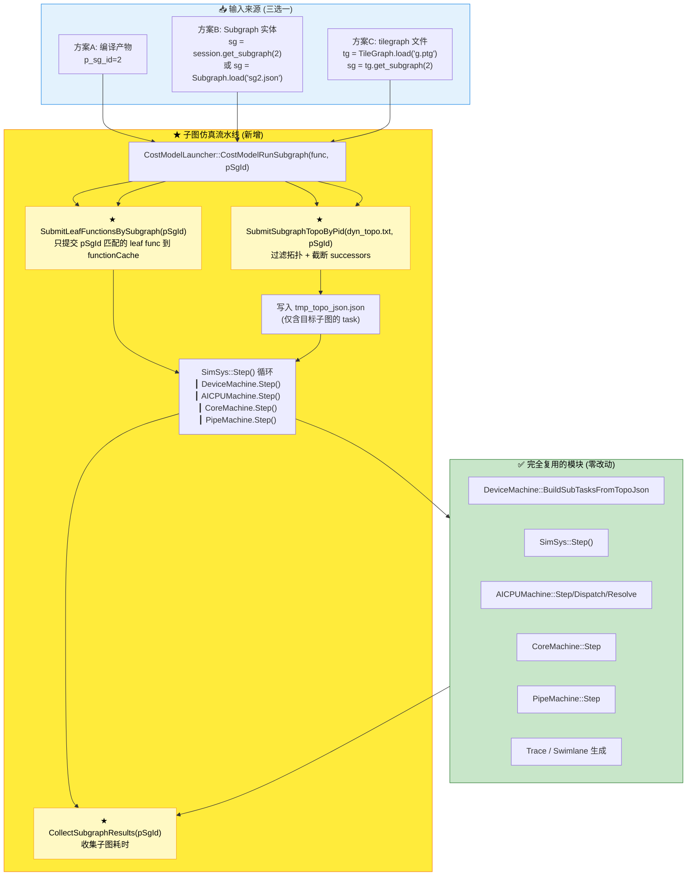
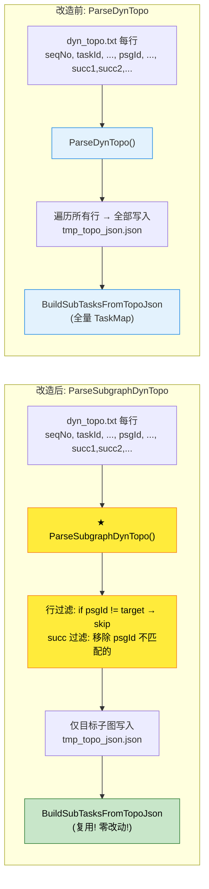
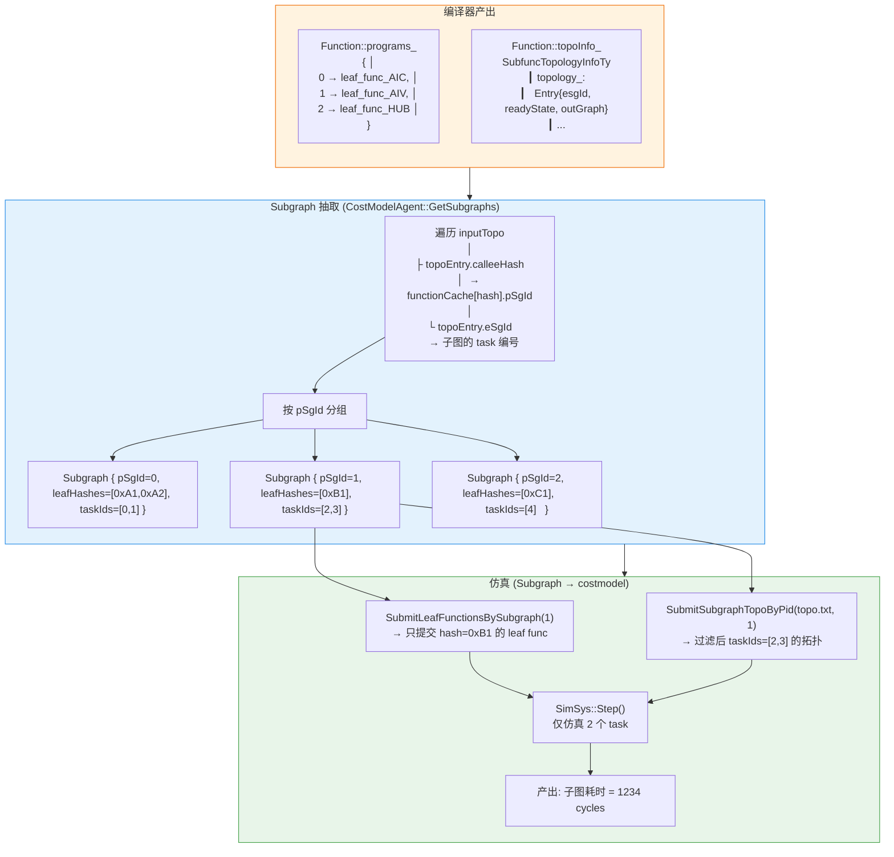
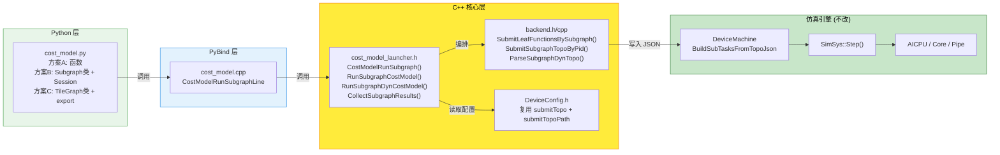

# PyPTO 子图 CostModel 仿真 — 改造方案

---

## 第一部分: 接口设计（三种方案）

### 方案 A: 沿用编译流水线 + 子图过滤参数

**思路**: 在现有 `@pypto.frontend.jit → cost_model` 链路的基础上，增加一个子图过滤参数。用户照常编译整图，然后可以选择只仿真某一个子图。

**使用方式**:

```python
import pypto
import torch
from pypto.cost_model import _cost_model_run_subgraph_line

# Step1: 照常编译整图 (JIT + 整图 costmodel)
@pypto.frontend.jit(runtime_options={"run_mode": pypto.RunMode.SIM})
def my_kernel(a: pypto.Tensor(), b: pypto.Tensor()):
    ...

a = pypto.Tensor(torch.randn(128, 256))
b = pypto.Tensor(torch.zeros(128, 256))
my_kernel(a, b)  # 编译 + 全量仿真

# Step2: 对编译好的图，只仿真 pSgId=2 的子图
result = _cost_model_run_subgraph_line(
    inputs=[a],
    outputs=[b],
    p_sg_id=2,
)
print(result)
```

**接口签名**:

```python
# python/pypto/cost_model.py
def _cost_model_run_subgraph_line(
    inputs: list[pypto.Tensor],
    outputs: list[pypto.Tensor],
    *,
    p_sg_id: int,
) -> dict:
```

| 参数 | 类型 | 说明 |
|------|------|------|
| `inputs` | `list[pypto.Tensor]` | 与整图 inputs 相同的 tensor 列表（实际数据不重要，仅用于地址分配和 shape 校验） |
| `outputs` | `list[pypto.Tensor]` | 与整图 outputs 相同 |
| `p_sg_id` | `int` | 要仿真的子图编号，取值 `0, 1, 2, ...`，来自 `dyn_topo.txt` 中的 psgId |

**返回值**:

```python
{
    "status":       "success" | "error",        # 状态
    "error_msg":    "",                           # 错误信息
    "p_sg_id":      2,                           # 回显
    "subgraph_total_cycles":  8234,              # 子图总耗时
    "tasks": [
        {"task_id": 5, "func_hash": 0xABCD, "func_name": "leaf_3", "cycles": 500, "core_type": "AIC"},
        {"task_id": 6, "func_hash": 0xBCDE, "func_name": "leaf_4", "cycles": 300, "core_type": "AIV"},
    ],
    "full_graph_total_cycles": 50000,            # 整图耗时（对比参考）
    "output_dir":  "/path/to/CostModelSimulationOutput/",
}
```

**适用场景**: 快速迭代开发，编译一次，反复对不同的子图进行性能分析。

---

### 方案 B: 子图实体 / IR 接口

**思路**: 定义一个 `Subgraph` 类，作为独立的实体。用户可以从编译产物中提取，也可以手动构造（用于未编译场景的探索性分析）。Subgraph 可被单独仿真，也可序列化/反序列化。

#### B.1 Subgraph 实体定义

```
┌── Subgraph ──────────────────────────────────────────────────┐
│                                                                │
│  pSgId: int              子图编号                              │
│  coreType: CoreType      子图类型 (AIC/AIV/MIX/HUB)            │
│  name: str               名称 "Subgraph_2"                     │
│                                                                │
│  leafFunctions:          包含的 leaf function 列表              │
│    ┌─ LeafFunc                                             ┐  │
│    │  hash: uint64       函数 hash                         │  │
│    │  name: str          函数名 "my_kernel_leaf2"          │  │
│    │  machineType:       AIC / AIV                         │  │
│    │  tileOps: []        tile 级操作序列 <opcode, pipe>     │  │
│    │  incast: [Tile]     从子图外流入的边界 tensor (含 shape) │  │
│    │  outcast: [Tile]    流出到子图外的边界 tensor (含 shape) │  │
│    └──────────────────────────────────────────────────────┘  │
│                                                                │
│  topology:               task 间拓扑依赖                        │
│    ┌─ TopoEntry                                           ┐  │
│    │  eSgId: uint64        task 编号                       │  │
│    │  calleeHash:         leaf func hash                   │  │
│    │  readyState: int     前驱数量                          │  │
│    │  successors: []      后继 task 列表                    │  │
│    └──────────────────────────────────────────────────────┘  │
│                                                                │
└────────────────────────────────────────────────────────────────┘
```

**C++ 定义** (`ISA.h`):

```cpp
class Subgraph {
public:
    int pSgId = -1;
    CoreType coreType;
    std::string name;
    std::vector<uint64_t> leafFunctionHashes;
    // 可选: 完整的 tile 级 IR (incast/outcast + tileOps)
    bool hasFullIR = false;
    // 可选: 子图内拓扑
    bool hasTopology = false;
};
```

#### B.2 获取方式

```python
# 方式 1: 从编译产物中提取
from pypto.cost_model import CostModelSession, Subgraph

session = CostModelSession(
    inputs=[a, b],
    outputs=[c],
)
session.compile()             # 触发编译 + 解析到 costmodel

sgs = session.get_subgraphs() # → List[Subgraph]
sg2 = session.get_subgraph(2) # → Subgraph(pSgId=2)

# 方式 2: 直接仿真某个子图
result = sg2.simulate()
print(result.subgraph_total_cycles)
```

```python
# 方式 3: 序列化 / 反序列化
sg2.dump("subgraph_2.json")

sg2_reloaded = Subgraph.load("subgraph_2.json")
result = sg2_reloaded.simulate()
```

#### B.3 Subgraph.simulate() 签名

```python
class Subgraph:
    def simulate(
        self,
        inputs: Optional[list[pypto.Tensor]] = None,
        outputs: Optional[list[pypto.Tensor]] = None,
    ) -> dict:
```

`inputs`/`outputs` 为可选——如果 Subgraph 的 IR 足够完整（含 shape），可以不传。

**适用场景**:
- 需要将子图独立保存、跨会话复用的场景
- 需要在不重新编译的情况下反复调优同一子图
- 团队协作：编译一次，子图发给其他人分析

---

### 方案 C: tilegraph 文件 + 子图 ID 接口

**思路**: 编译完成后，将整个 tilegraph（所有子图 + 拓扑）导出为一个文件。后续用户可以加载这个文件，指定要仿真的子图，无需重新编译。**编译 ⇄ 仿真彻底解耦**。

#### C.1 设计关键点

```
编译阶段                             仿真阶段
┌──────────────────┐            ┌─────────────────────┐
│ @pypto.frontend  │            │ load_tilegraph()    │
│   .jit            │            │   ↓                 │
│     ↓             │  导出      │ tg.get_subgraph(2)  │
│ 编译产出:          │ ────────▶ │   ↓                 │
│  Function IR      │ .ptg 文件  │ sg.simulate()       │
│  Sequence IR      │            │                     │
└──────────────────┘            └─────────────────────┘
```

#### C.2 TileGraph 文件格式 (`.ptg`)

```json
{
    "format_version": 1,
    "graph_name": "my_kernel",
    "root_function": {
        "hash": 0x12345678,
        "name": "my_kernel",
        "total_subgraph_count": 4
    },
    "subgraphs": [
        {
            "pSgId": 0,
            "coreType": "AIV",
            "leaf_functions": [
                {
                    "hash": 0xABCD,
                    "name": "my_kernel_leaf0",
                    "tile_ops": [
                        {"opcode": "vec_add", "pipe": "ALU", "inputs": [...], "outputs": [...], "tile_shape": [...]},
                        ...
                    ]
                }
            ],
            "topology": {
                "entries": [
                    {"eSgId": 0, "calleeHash": 0xABCD, "readyState": 0, "successors": [1, 2]},
                    ...
                ]
            }
        },
        ...
    ],
    "global_topology": {
        "edges": [
            {"from_sg": 0, "from_esg": 2, "to_sg": 1, "to_esg": 3},
            ...
        ]
    }
}
```

#### C.3 使用方式

```python
# === 编译阶段 (一次性) ===
from pypto.cost_model import export_tilegraph

@pypto.frontend.jit(runtime_options={"run_mode": pypto.RunMode.SIM})
def my_kernel(a: pypto.Tensor(), b: pypto.Tensor()):
    ...

my_kernel(a, b)

export_tilegraph("my_kernel.ptg")  # 导出
```

```python
# === 仿真阶段 (可反复执行，无需重新编译) ===
from pypto.cost_model import TileGraph

tg = TileGraph.load("my_kernel.ptg")
print(tg.graph_name)            # "my_kernel"
print(tg.subgraph_count)        # 4
print(tg.subgraph_ids)          # [0, 1, 2, 3]

# 取第 2 个子图仿真
sg = tg.get_subgraph(2)
result = sg.simulate()
print(result["subgraph_total_cycles"])
```

**接口签名**:

```python
# python/pypto/cost_model.py

def export_tilegraph(
    filepath: str,
    *,
    include_tile_ir: bool = True,    # 是否包含 tile 级 IR
    include_topology: bool = True,   # 是否包含拓扑
) -> None:
    """将当前编译好的图导出为 .ptg 文件"""


class TileGraph:
    graph_name: str
    subgraph_count: int

    @staticmethod
    def load(filepath: str) -> "TileGraph": ...
    def get_subgraph(self, p_sg_id: int) -> Subgraph: ...
    def get_subgraphs(self) -> list[Subgraph]: ...
```

**适用场景**:
- CI/CD 中编译一次，分发给多人分析
- 历史版本对比（保存不同版本的 .ptg 文件）
- 大规模图的分析（一次编译，反复查询不同热点子图）

---

### 三种方案对比

```mermaid
flowchart TB
    subgraph A["方案A: 沿用编译流水线"]
        A1["jit 编译 + 全量仿真"] --> A2["_cost_model_run_subgraph_line(p_sg_id=2)"]
        A2 --> A3["直接拿到 cycle 数"]
    end

    subgraph B["方案B: Subgraph 实体"]
        B1["jit 编译"] --> B2["session.get_subgraph(2)"]
        B2 --> B3["sg.simulate()"]
        B2 --> B4["sg.dump('sg2.json')"]
        B4 --> B5["Subgraph.load('sg2.json')"]
        B5 --> B6["sg.simulate()"]
    end

    subgraph C["方案C: tilegraph 文件"]
        C1["jit 编译"] --> C2["export_tilegraph('g.ptg')"]
        C2 --> C3["TileGraph.load('g.ptg')"]
        C3 --> C4["tg.get_subgraph(2)"]
        C4 --> C5["sg.simulate()"]
    end

    style A fill:#e8f5e9,stroke:#43a047
    style B fill:#e3f2fd,stroke:#1e88e5
    style C fill:#fff3e0,stroke:#ef6c00
```



| 维度 | 方案A | 方案B | 方案C |
|------|-------|-------|-------|
| 改动量 | ★ 最小 | ★★ 中等 | ★★★ 较大 |
| 是否需要重新编译 | 是（但可复用编译缓存） | 是（但 Subgraph 可序列化后复用） | 否 |
| 子图可独立存储 | 否 | 是（JSON） | 是（.ptg） |
| 适用场景 | 快速迭代分析 | 子图独立分发复用 | 编译⇄仿真分离 |
| Python 新类 | 0 | 2（Subgraph, CostModelSession） | 3（Subgraph, TileGraph, export） |

---

## 第二部分: 代码修改说明

### 新增接口代码

#### 2.1 方案 A 新增接口

**文件**: `python/pypto/cost_model.py`

```python
# ★ 新增函数
def _cost_model_run_subgraph_line(
    inputs: list[pypto.Tensor],
    outputs: list[pypto.Tensor],
    *,
    p_sg_id: int,
) -> dict:
    """对编译完成的图,仅仿真 p_sg_id 指定的子图"""
    isDevice = False
    for t in inputs:
        if t.device != torch.device("cpu"):
            isDevice = True
            break

    if isDevice:
        input_datas = _device_to_host_tensor_datas(inputs)
        output_datas = _device_to_host_tensor_datas(outputs)
    else:
        input_datas = _pto_to_tensor_data(inputs)
        output_datas = _pto_to_tensor_data(outputs)

    result_json = pypto_impl.CostModelRunSubgraphLine(input_datas, output_datas, p_sg_id)

    if isDevice:
        _host_to_device_tensor_datas(inputs, input_datas)
        _host_to_device_tensor_datas(outputs, output_datas)

    return json.loads(result_json)


# ★ 导出列表新增
__all__ = [
    "_cost_model_run_once_data_from_host",
    "_cost_model_run_subgraph_line",           # 方案A
]
```

**文件**: `python/src/bindings/cost_model.cpp`

```cpp
// ★ 新增绑定函数
std::string CostModelRunSubgraphLine(
    const std::vector<DeviceTensorData>& inputs,
    const std::vector<DeviceTensorData>& outputs,
    uint64_t pSgId)
{
    if (config::GetHostOption<int64_t>(COMPILE_STAGE) != CS_ALL_COMPLETE) {
        return R"({"status":"error","error_msg":"compile not complete"})";
    }

    Function* func = Program::GetInstance().GetLastFunction();
    std::string initResult = InitInputOutputData(inputs, outputs);
    if (!initResult.empty()) {
        return R"({"status":"error","error_msg":")" + initResult + R"("})";
    }

    Json result = CostModelLauncher::CostModelRunSubgraph(func, pSgId);
    CopyTensorFromModel(inputs, outputs);
    return result.dump();
}

// ★ 注册绑定
void BindCostModelRuntime(py::module& m) {
    m.def("CostModelRunOnceDataFromHost", &CostModelRunOnceDataFromHost);
    m.def("CostModelRunSubgraphLine",      &CostModelRunSubgraphLine);  // 方案A +方案B +方案C
}
```

**文件**: `framework/src/cost_model/simulation/cost_model_launcher.h`

```cpp
class CostModelLauncher : public DeviceLauncher {
public:
    // ... 现有方法 ...

    // ★ 子图仿真入口 (方案A/B/C 共用)
    static Json CostModelRunSubgraph(Function* function, uint64_t pSgId)
    {
        auto runner = CostModelLauncher(function, DeviceLauncherConfig());

        // 阶段1: LEAF_FUNCTION — 仅子图内的 leaf func
        runner.RunSubgraphCostModel(pSgId);

        // 阶段2: 子图 NORMAL — 过滤后的拓扑
        runner.RunSubgraphDynCostModel(pSgId);

        return runner.CollectSubgraphResults(pSgId);
    }

private:
    void RunSubgraphCostModel(uint64_t pSgId);
    void RunSubgraphDynCostModel(uint64_t pSgId);
    Json CollectSubgraphResults(uint64_t pSgId);
};
```

#### 2.2 方案 B 新增接口

**文件**: `python/pypto/cost_model.py`

```python
# ★ 新增类
class Subgraph:
    p_sg_id: int
    core_type: str
    name: str
    leaf_function_hashes: list[int]

    def simulate(self, inputs=None, outputs=None) -> dict: ...
    def dump(self, filepath: str) -> None: ...
    @staticmethod
    def load(filepath: str) -> "Subgraph": ...


class CostModelSession:
    """封装一次编译 + costmodel 解析的完整会话"""
    def __init__(self, inputs: list[pypto.Tensor], outputs: list[pypto.Tensor]): ...
    def compile(self) -> None: ...
    def get_subgraph(self, p_sg_id: int) -> Subgraph: ...
    def get_subgraphs(self) -> list[Subgraph]: ...
```

方案 B 的 `Subgraph.load()` 和方案 C 的 `TileGraph.load()` 共享同一个 .ptg 文件格式。

#### 2.3 方案 C 新增接口

**文件**: `python/pypto/cost_model.py`

```python
# ★ 新增类
class TileGraph:
    graph_name: str
    subgraph_count: int

    @staticmethod
    def load(filepath: str) -> "TileGraph": ...
    def get_subgraph(self, p_sg_id: int) -> Subgraph: ...
    def get_subgraphs(self) -> list[Subgraph]: ...


# ★ 新增函数
def export_tilegraph(
    filepath: str,
    *,
    include_tile_ir: bool = True,
    include_topology: bool = True,
) -> None:
    """将当前编译完成的图导出为 .ptg"""
```

**关键**: `export_tilegraph()` 需要在 C++ 侧实现序列化逻辑：
- 遍历 `functionCache` 收集所有 Function
- 遍历 `inputTopo` 收集拓扑
- 序列化为 JSON → `.ptg` 文件

---

### 辅助修改代码

#### 2.4 CostModelAgent 扩展

**设计要点**:

1. **`SubmitLeafFunctionsBySubgraph`** — 从编译产出的根函数 `programs_` 中获取 pSgId 到 functionHash 的映射，筛选后提交到 costmodel。`programs_` 是 `map<uint64_t pSgId, Function* leafFunc>`，其中 key 即为子图编号。
2. **`SubmitSubgraphTopoByPid`** — 两遍扫描 `dyn_topo.txt`：第一遍收集目标子图的 `taskId` 集合，第二遍保留目标行并截断 successors（移除不属于目标子图的 taskId）。
3. **依赖关系**：在 NORMAL 模式下，必须先调用 `SubmitSubgraphTopoByPid` 写入 `topoJsonPath`，再调用 `SubmitLeafFunctionsBySubgraph`（其内部的 `BuildCostModel` 会读取 `topoJsonPath` 设置 `submitTopo` 配置）。

**文件**: `framework/src/cost_model/simulation/backend.h`

```cpp
class CostModelAgent {
public:
    // ... 现有方法 ...

    // ★ 按 pSgId 过滤提交 leaf function (方案A/B/C共用)
    void SubmitLeafFunctionsBySubgraph(uint64_t pSgId);

    // ★ 按 pSgId 过滤提交拓扑 (方案A/B/C共用)
    void SubmitSubgraphTopoByPid(std::string& path, uint64_t pSgId);

    // ★ 解析 dyn_topo.txt，按 pSgId 过滤 (方案A/B/C共用，内部两遍扫描)
    Json ParseSubgraphDynTopo(std::string& path, uint64_t pSgId);

    // ★ 序列化 functionCache 到 JSON (方案C)
    Json ExportFunctionCacheToJson();

    // ★ 从 JSON 反序列化 functionCache (方案C)
    void ImportFunctionCacheFromJson(const Json& j);
};
```

**文件**: `framework/src/cost_model/simulation/backend.cpp`

```cpp
void CostModelAgent::SubmitLeafFunctionsBySubgraph(uint64_t pSgId)
{
    BuildCostModel();

    // 从根函数的 programs_ 中获取 pSgId → hash 映射
    // programs_ 是 map<uint64_t pSgId, Function* leafFunc>
    // 其中 key 即为子图编号, BuildCostModel 后 functionCache 为空, 不能遍历它
    auto* rootFunc = Program::GetInstance().GetLastFunction();
    std::unordered_set<uint64_t> targetHashes;
    for (auto& [sgId, leafFunc] : rootFunc->programs_) {
        if (sgId == pSgId) {
            targetHashes.insert(leafFunc->GetFunctionHash().GetHash());
        }
    }

    std::vector<npu::tile_fwk::Function*> funcs;
    for (auto& [name, f] : Program::GetInstance().GetFunctionMap()) {
        if (targetHashes.count(f->GetHash())) {
            funcs.push_back(f.get());
        }
    }
    costModel->Submit(funcs, false, "");
}

void CostModelAgent::SubmitSubgraphTopoByPid(std::string& path, uint64_t pSgId)
{
    Json filtered = ParseSubgraphDynTopo(path, pSgId);
    topoJsonPath = config::LogTopFolder() + "/tmp_topo_json.json";
    std::ofstream file(topoJsonPath);
    file << filtered.dump(1) << std::endl;
}

Json CostModelAgent::ParseSubgraphDynTopo(std::string& path, uint64_t pSgId)
{
    // ── 第一遍：收集目标子图的所有 taskId ──
    std::unordered_set<uint64_t> targetTaskIds;
    {
        std::ifstream file(path);
        std::string line;
        while (std::getline(file, line)) {
            if (line.empty() || isalpha(line[0])) continue;
            std::vector<uint64_t> fields;
            std::stringstream ss(line);
            std::string item;
            while (std::getline(ss, item, ',')) {
                try { fields.push_back(std::stoull(item)); }
                catch (...) { /* ignore */ }
            }
            if (fields[psgIdPos] == pSgId) {
                targetTaskIds.insert(fields[taskIdPos]);
            }
        }
    }

    // ── 第二遍：保留目标行，截断 successors ──
    Json topoJson = Json::array();
    std::ifstream file(path);
    std::string line;
    while (std::getline(file, line)) {
        if (line.empty() || isalpha(line[0])) continue;
        std::vector<uint64_t> fields;
        std::stringstream ss(line);
        std::string item;
        while (std::getline(ss, item, ',')) {
            try { fields.push_back(std::stoull(item)); }
            catch (...) { /* ignore */ }
        }
        if (fields[psgIdPos] != pSgId) continue;  // 跳过非目标子图

        Json taskJson;
        taskJson["uniqueKey"] = static_cast<uint64_t>(fields[seqPos]) << seqNumOffset | fields[taskIdPos];
        taskJson["seqNo"] = fields[seqPos];
        taskJson["taskId"] = fields[taskIdPos];
        taskJson["rootIndex"] = fields[rootIndexPos];
        taskJson["rootHash"] = fields[rootHashpos];
        taskJson["leafIndex"] = fields[leafIndexPos];
        taskJson["opmagic"] = fields[opmagicPos];
        taskJson["funcHash"] = fields[funcHashPos];
        taskJson["coreType"] = npu::tile_fwk::GetCoreTypeDict().Find(
            static_cast<npu::tile_fwk::CoreType>(fields[coreTypePos]));
        taskJson["psgId"] = fields[psgIdPos];
        taskJson["wrapId"] = fields[wrapIdPos];

        // successors 截断：只保留属于目标子图的 taskId
        Json successorsJson = Json::array();
        for (size_t i = succStartPos; i < fields.size(); i++) {
            if (targetTaskIds.count(fields[i])) {
                successorsJson.push_back(fields[i]);
            }
        }
        taskJson["successors"] = successorsJson;
        topoJson.push_back(taskJson);
    }
    return topoJson;
}
```

#### 2.5 DeviceMachine 路由扩展

**文件**: `framework/src/cost_model/simulation/machine/DeviceMachine.cpp`

```cpp
void DeviceMachine::InitFunctions()
{
    if (GetSim()->dynamicWorkflow) {
        BuildLeafFunctionTasks();
        return;
    }

    auto functionCache = GetSim()->functionCache.cache;
    auto startFuncHash = GetSim()->startFuncHash;

    if (GetSim()->testSingleFunc) {
        BuildSingleFuncTask();
        return;
    }

    if (config.submitTopo) {
        BuildSubTasksFromTopoJson();    // ← 子图模式也走这里,只需 tmp_topo_json.json 是过滤后的
        return;
    }

    if (functionCache[startFuncHash]->topoFromRootFunc) {
        BuildSubtasksFromRootFuncTopo();
        return;
    }
}
```

#### 2.6 Config 扩展

**文件**: `framework/src/cost_model/simulation/config/DeviceConfig.h`

方案A 复用现有的 `submitTopo` + `submitTopoPath` 字段控制子图路由，**无需新增字段**。子图仿真时，`SubmitSubgraphTopoByPid` 写入过滤后的 `tmp_topo_json.json`，`BuildCostModel` 读取 `topoJsonPath` 并设置 `Device.submitTopo=true` + `Device.submitTopoPath=...`，`InitFunctions` 走现有的 `submitTopo` 分支直接复用 `BuildSubTasksFromTopoJson`。

#### 2.7 ISA.h 扩展

**文件**: `framework/src/cost_model/simulation/common/ISA.h`

```cpp
// 将空壳补全为:
class Subgraph {
public:
    int pSgId = -1;
    std::string name;
    std::vector<uint64_t> leafFunctionHashes;
    bool hasFullIR = false;
    bool hasTopology = false;
};
```

---

### 改动文件清单

| 文件 | 改动性质 | 方案A | 方案B | 方案C | 行数 |
|------|---------|:---:|:---:|:---:|------|
| `python/pypto/cost_model.py` | 新增接口 | ✓ | ✓ | ✓ | ~120 |
| `python/src/bindings/cost_model.cpp` | 新增绑定 | ✓ | ✓ | ✓ | ~30 |
| `simulation/common/ISA.h` | Subgraph 类补全 | ✓ | ✓ | ✓ | ~10 |
| `simulation/backend.h` | Agent 方法声明 | ✓ | ✓ | ✓ | ~10 |
| `simulation/backend.cpp` | Agent 方法实现 | ✓ | ✓ | ✓ | ~80 |
| `simulation/cost_model_launcher.h` | 子图仿真入口 | ✓ | ✓ | ✓ | ~60 |
| `simulation/machine/DeviceMachine.cpp` | InitFunctions 分支 | ✓ | ✓ | ✓ | +0（不需要改！走现有 submitTopo 分支） |
| `simulation/config/DeviceConfig.h` | 配置字段 | — | — | — | 0（方案A复用 submitTopo） |
| `simulation/machine/DeviceMachine.h` | 声明 | — | — | — | 0 |
| **仿真引擎 (SimSys/AICPU/Core/Pipe)** | — | — | — | — | **0** |
| **总计** | | | | | **~370 行** |

---

## 第三部分: 修改整体逻辑 (Mermaid)

### 3.1 编译到仿真的全链路（改造前后对比）



### 3.2 改造后的子图仿真流水线



### 3.3 关键改动点放大图



### 3.4 Subgraph 类与 IR 的关系



### 3.5 文件改动依赖关系


