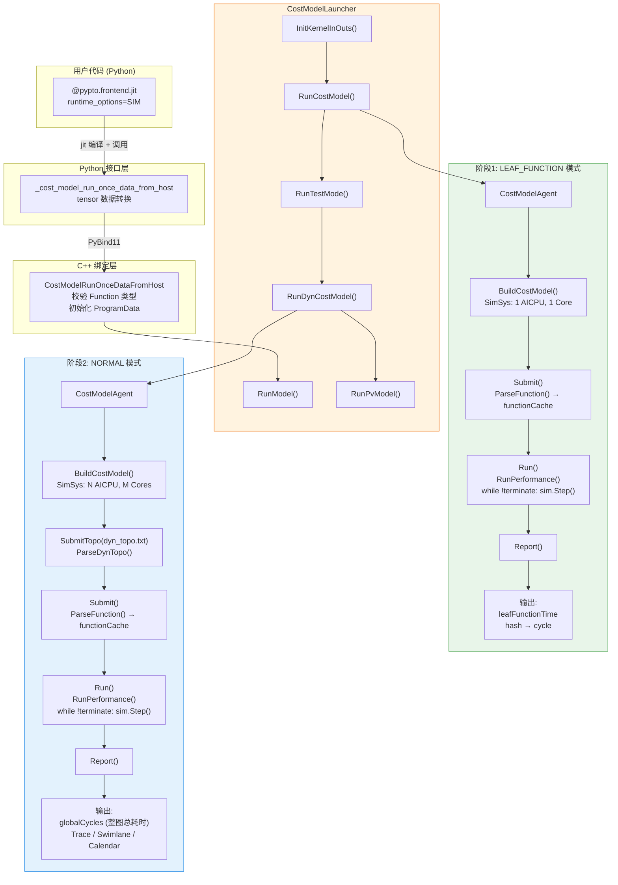
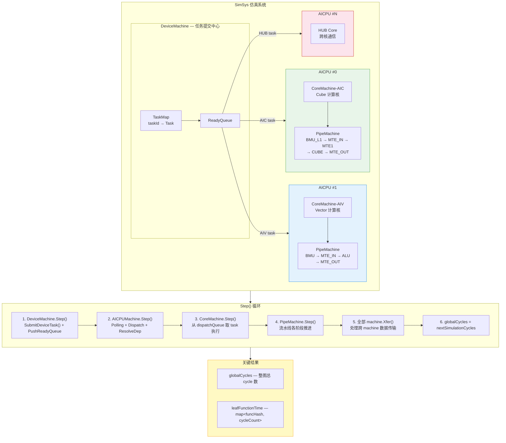
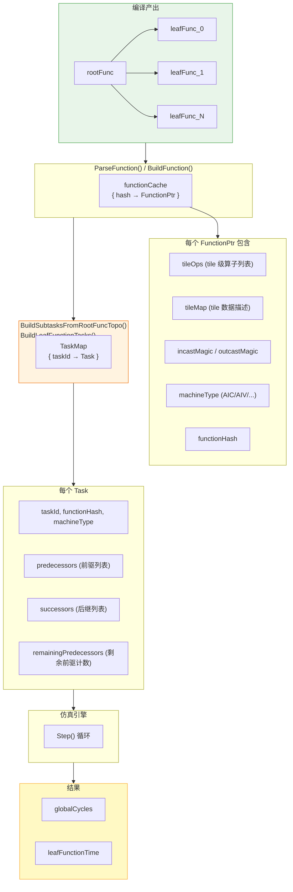
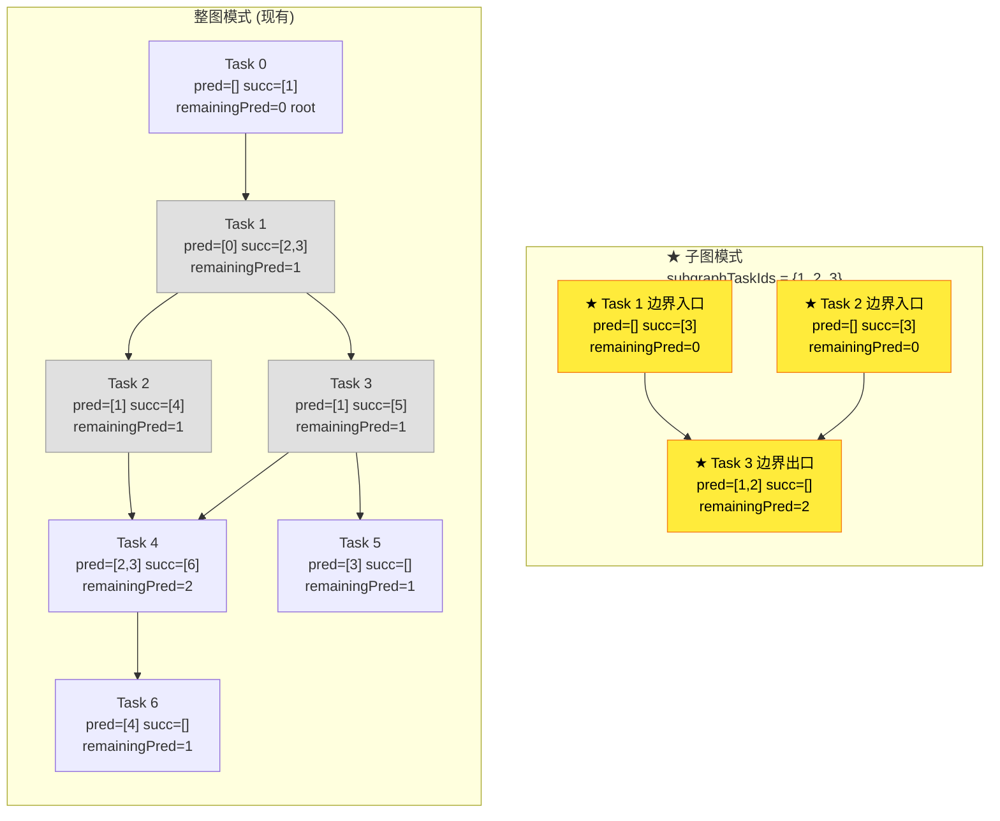

# PyPTO CostModel 架构分析与子图 CostModel 改造方案

## 1. 概述

PyPTO CostModel 是一个硬件在环（hardware-in-the-loop）仿真框架，用于在 Ascend NPU 上估算 AI 计算图的性能。它通过事件驱动的 cycle-accurate 仿真，模拟 Device → AICPU → Core → Pipe 四层硬件层级结构，估算整图执行耗时。

本文档首先分析当前 CostModel 的完整架构与执行流程，然后给出改造为子图 CostModel 的详细方案。

---

## 2. 整体框架结构

### 2.1 现有 CostModel 端到端架构



### 2.2 仿真引擎内部结构



### 2.3 Task 数据流



---

## 3. 源码文件结构

```
framework/src/cost_model/simulation/
├── CostModelInterface.h/.cpp    # 仿真主入口：Build/Submit/Run/Report
├── backend.h/.cpp               # CostModelAgent：Python/C++ 桥接层
├── cost_model_launcher.h        # CostModelLauncher：集成到编译流水线
├── base/
│   ├── ModelTop.h/.cpp          # SimSys：仿真系统核心（全局 cycle、machine 管理）
│   ├── Machine.h/.cpp           # Machine 基类：Step/Xfer 接口
│   └── Reporter.h               # 报告输出
├── machine/
│   ├── DeviceMachine.h/.cpp     # Device 级：任务提交、TaskMap 构建、ReadyQueue 管理
│   ├── AICPUMachine.h/.cpp      # AICPU 级：任务分发、依赖解析、leafFunctionTime 记录
│   ├── CoreMachine.h/.cpp       # Core 级：实际计算执行
│   ├── PipeMachine.h/.cpp       # Pipe 级：流水线模拟
│   └── Scheduler.h              # 任务调度器
├── arch/
│   ├── GenCalendar/             # Calendar 调度：counter-based 依赖、barrier 优化
│   ├── PipeFactory.h            # Pipeline 工厂
│   ├── PipeMachineImpl.h        # Pipeline 实现
│   └── Simulator.h              # 指令仿真器
├── tools/
│   ├── ParseInput.h/.cpp        # Function → TaskMap 解析
│   └── ParseArgs.h              # 命令行参数解析
├── config/                      # 硬件配置（Device/AICPU/Core/Pipe）
├── common/                      # 公共类型（Task, TaskMap, MachineType, SimMode）
├── statistics/                  # 统计与 Trace 输出
├── cache/                       # 缓存模拟
└── value/                       # Tile 状态计算

python/
├── pypto/cost_model.py          # Python 用户接口
└── src/bindings/cost_model.cpp  # PyBind11 绑定
```

---

## 4. 整图性能估算流程

### 4.1 端到端调用链

```mermaid
flowchart TB
    U["用户代码<br/>@pypto.frontend.jit(run_mode=SIM)"] --> Py
    Py["Python<br/>_cost_model_run_once_data_from_host<br/>cost_model.py:53"] -->|"PyBind11"| Cpp
    Cpp["C++ 绑定<br/>CostModelRunOnceDataFromHost<br/>cost_model.cpp:94<br/>校验 Function + 初始化 ProgramData"] --> Launcher
    Launcher["CostModelLauncher::CostModelRunOnce<br/>cost_model_launcher.h:172"] --> RunModel
    RunModel["RunModel()"] --> I1
    I1["InitKernelInOuts()"] --> I2["RunCostModel()<br/>阶段1: LEAF_FUNCTION"]
    I2 --> I3["RunTestMode()"]
    I3 --> I4["RunDynCostModel()<br/>阶段2: NORMAL"]
    I4 --> I5["RunPvModel()<br/>(可选)"]

    style I2 fill:#e8f5e9,stroke:#43a047
    style I4 fill:#e3f2fd,stroke:#1e88e5
### 4.2 阶段1: LEAF_FUNCTION 模式 — 单 leaf function 耗时估算

**目的**：估算每个 leaf function 的单次执行 cycle，供后续整图调度使用。

**入口**：`cost_model_launcher.h:306 RunCostModel()`

```cpp
void RunCostModel(DeviceKernelArgs* kArgs) {
    config::SetSimConfig(KEY_SIM_MODE, CostModel::SimMode::LEAF_FUNCTION);
    CostModelAgent costModelAgent;
    costModelAgent.SubmitLeafFunctionsToCostModel();  // 提交所有 leaf function
    costModelAgent.RunCostModel();                     // 运行仿真
    costModelAgent.TerminateCostModel();               // 输出报告
    // 收集每个 leaf function 的执行时间
    for (const auto& [index, hash] : attr->devLeafIndex2Hash) {
        auto time = costModelAgent.GetLeafFunctionTimeCost(hash);
        modelData->functionTime[index] = time;
    }
    kArgs->costmodeldata = modelData;
}
```

**仿真配置**（`CostModelInterface.cpp:93-101`）：
- `sim->dynamicWorkflow = true`
- 1 个 AICPU，1 个 AIC Core，1 个 AIV Core
- 每个 leaf function 作为独立 Task，无依赖（`remainingPredecessors = 0`）

**Task 构建流程**（`DeviceMachine.cpp:197 BuildLeafFunctionTasks()`）：
1. 遍历 `functionCache`，筛选名字含 "leaf" 的 function
2. 为每个 leaf function 创建一个 Task：
   - `taskId` = 递增索引
   - `functionHash` = function 的 hash
   - `machineType` = function 对应的硬件类型 (AIC/AIV)
   - `remainingPredecessors = 0`（无依赖）
3. 放入 `taskMapQueue`，由仿真引擎逐个执行

**耗时记录**（`AICPUMachine.cpp:246 ResolveDependence()`）：
```cpp
uint64_t taskExeCycle = packet.cycleInfo.taskExecuteEndCycle -
                         packet.cycleInfo.taskExecuteStartCycle;
auto funcHash = top->taskMap[taskId]->functionHash;
GetSim()->leafFunctionTime[funcHash] = taskExeCycle;
```

### 4.3 阶段2: NORMAL 模式 — 整图仿真

**目的**：基于完整拓扑关系，模拟所有 task 的并行执行与依赖，得到整图总耗时。

**入口**：`cost_model_launcher.h:331 RunDynCostModel()`

```cpp
void RunDynCostModel() {
    config::SetSimConfig(KEY_SIM_MODE, CostModel::SimMode::NORMAL);
    CostModelAgent costModelAgent;
    std::string path = config::LogTopFolder() + "/dyn_topo.txt";
    costModelAgent.SubmitTopo(path);                    // 解析拓扑文件
    costModelAgent.SubmitLeafFunctionsToCostModel();     // 提交 leaf function
    costModelAgent.RunCostModel();                       // 运行仿真
    costModelAgent.TerminateCostModel();                 // 输出报告
}
```

### 4.4 拓扑文件解析

**拓扑文件格式** (`dyn_topo.txt`)：CSV 格式，每行一个 task。

```
字段位置:
  0: seqNo          - 序列号
  1: taskId         - 任务ID（编码了 funcId + opIndex）
  2: rootIndex      - 根函数索引
  3: rootHash       - 根函数hash
  4: opmagic        - 操作魔数
  5: leafIndex      - leaf函数索引
  6: funcHash       - 函数hash
  7: coreType       - 核心类型 (AIC/AIV/MIXAICORE)
  8: psgId          - pipeline group ID
  9: wrapId         - wrapper ID
  10+: successors   - 后继任务ID列表
```

**解析逻辑**（`backend.cpp:128 ParseDynTopo()`）：
- 每行解析为 JSON task entry
- `uniqueKey = seqNo << 32 | taskId`
- `successors` 为变长列表
- 输出为 `tmp_topo_json.json`

### 4.5 Task 图构建

NORMAL 模式下有三种 Task 构建路径（`DeviceMachine.cpp:171 InitFunctions()`）：

```
if (dynamicWorkflow)
    → BuildLeafFunctionTasks()          // LEAF_FUNCTION 模式
else if (testSingleFunc)
    → BuildSingleFuncTask()             // 单 function 调试
else if (submitTopo)
    → BuildSubTasksFromTopoJson()       // 从拓扑 JSON 文件构建
else
    → BuildSubtasksFromRootFuncTopo()   // 从 root function 的 inputTopo 构建
```

**核心方法 `BuildSubtasksFromRootFuncTopo()`**（`DeviceMachine.cpp:223`）：
1. 从 `startFunc->inputTopo` 遍历每个拓扑条目
2. 创建 Task，设置依赖：
   - `remainingPredecessors = -topoEntry.readyState`（负值表示需要等待的前驱数）
   - `successors` = 拓扑条目的 `outGraph`
3. 反向建立 `predecessors` 关系
4. 放入 `taskMapQueue`

### 4.6 仿真循环

**仿真主循环**（`CostModelInterface.cpp:150 RunPerformance()`）：

```cpp
bool terminate = false;
while (!terminate) {
    sim->Step();
    terminate = sim->IsTerminate() || sim->IsDeadlock();
}
sim->globalCycles = sim->lastSimulationCycles;
```

**四层硬件模型执行流**：

```mermaid
flowchart TB
    subgraph SimStep["SimSys::Step() 每轮迭代"]
        direction TB
        D["DeviceMachine.Step()<br/>SubmitDeviceTask() → PushReadyQueue()"] 
        A["AICPUMachine.Step()<br/>Polling + Dispatch + ResolveDependence()"]
        C["CoreMachine.Step()<br/>从 dispatchQueue 取 task 执行"]
        P["PipeMachine.Step()<br/>流水线各阶段推进"]
        X["全部 machine.Xfer()<br/>处理跨 machine 数据传输"]
        U["globalCycles = nextSimulationCycles"]
        D --> A --> C --> P --> X --> U
    end

    subgraph Pipeline["PipeMachine 内部流水线"]
        direction LR
        MTE_IN["MTE_IN<br/>Global → L1"] --> BMU["BMU<br/>L1 → L0A/B"]
        BMU --> COMPUTE["ALU / CUBE<br/>实际计算"]
        COMPUTE --> MTE_OUT["MTE_OUT<br/>L1 → Global"]
    end

    P -.-> Pipeline

    style D fill:#fff3e0,stroke:#ef6c00
    style A fill:#e3f2fd,stroke:#1e88e5
    style C fill:#e8f5e9,stroke:#43a047
    style P fill:#f3e5f5,stroke:#7b1fa2
    style U fill:#fff9c4,stroke:#f9a825
### 4.7 结果聚合

**整图耗时**：`sim->globalCycles` — 仿真结束时的全局 cycle 数，已经考虑了并行执行和依赖。

**Leaf function 耗时**：`sim->leafFunctionTime[funcHash]` — 每个单独 leaf function 的执行 cycle。

**输出内容**（`CostModelInterface.cpp:187 Report()`）：
- NORMAL 模式：Trace (Chrome trace)、Swimlane 图、Calendar 调度 C++ 代码
- LEAF_FUNCTION 模式：Trace、Leaf function 耗时 dump

---

## 5. 核心数据结构

### 5.1 Task（`CommonType.h:356`）

```cpp
class Task {
    uint64_t seqNo;                    // 序列号
    uint64_t taskId;                   // 任务ID
    uint64_t functionHash;             // 所属 function 的 hash
    std::string functionName;          // function 名称
    int remainingPredecessors;         // 剩余未完成的前驱数（0=可执行）
    std::vector<uint64_t> predecessors;  // 前驱 task 列表
    std::vector<uint64_t> successors;    // 后继 task 列表
    MachineType machineType;           // AIC / AIV / MIXAICORE / HUB
    uint64_t leafIndex;                // leaf 函数索引
    uint64_t rootIndex;                // 根函数索引
    int psgId;                         // pipeline group ID
    uint64_t uniqueKey;                // 唯一键 = seqNo << 32 | taskId
};
using TaskMap = std::map<uint64_t, std::shared_ptr<Task>>;
```

### 5.2 SimSys（`ModelTop.h:44`）

```cpp
class SimSys {
    uint64_t globalCycles;             // 全局仿真 cycle
    uint64_t nextSimulationCycles;     // 下一次事件 cycle
    std::vector<MachinePtr> machines;  // 所有 machine
    TaskMap calendarTaskMap;           // 用于 Calendar 调度
    std::map<uint64_t, uint64_t> leafFunctionTime;  // leaf func hash → cycle
    SimMode mode;                      // NORMAL / LEAF_FUNCTION / EMULATOR
    bool dynamicWorkflow;              // 动态工作流模式
    std::shared_ptr<GenCalendar> calendarGenerator;  // Calendar 调度器
};
```

### 5.3 TopoInfoEntry（`CommonType.h:424`）

```cpp
struct TopoInfoEntry {
    uint64_t eSgId;        // 执行段 ID
    int readyState;        // 前驱数（取负值为 remainingPredecessors）
    uint64_t calleeHash;   // 被调用 function 的 hash
    bool fixedLatency;     // 是否固定延迟
    uint64_t fixedLatencyVal;  // 固定延迟值
    MachineType mType;     // 核心类型
    setType outGraph;      // 后继 task 集合
};
```

### 5.4 硬件层级关系

```mermaid
flowchart TB
    SimSys --> DevM["DeviceMachine (1个)"]
    DevM --> AICPU["AICPUMachine<br/>可配置数量"]
    AICPU --> AIC["CoreMachine-AIC<br/>Cube 计算核"]
    AIC --> PAIC["PipeMachine<br/>BMU_L1 → BMU_L0A/B/C<br/>MTE_IN → MTE1 → CUBE → MTE_OUT"]
    AICPU --> AIV["CoreMachine-AIV<br/>Vector 计算核"]
    AIV --> PAIV["PipeMachine<br/>BMU → MTE_IN → ALU → MTE_OUT"]
    AICPU --> MIX["CoreMachine-MIXAICORE<br/>混合核"]
    DevM --> HUB["HUB Core<br/>跨核通信"]

    style AIC fill:#e8f5e9,stroke:#43a047
    style AIV fill:#e3f2fd,stroke:#1e88e5
    style MIX fill:#f3e5f5,stroke:#7b1fa2
    style HUB fill:#fce4ec,stroke:#c62828
---

## 6. 子图 CostModel 改造方案

### 6.1 设计目标

在完整计算图（root function → leaf functions）中，只选取一部分 task 组成子图进行 costmodel 仿真，用于：
- 局部性能调优（只关注热点区域）
- 快速迭代验证（无需仿真整图）
- 算子融合效果评估（对比子图合并前后的耗时）

### 6.2 子图改造改动全景图

```mermaid
flowchart TB
    subgraph User["用户代码 (Python)"]
        OLD["_cost_model_run_once_data_from_host<br/>(inputs, outputs)"]
        NEW["★ _cost_model_run_subgraph_data_from_host<br/>(inputs, outputs,<br/>subgraph_task_ids,<br/>subgraph_func_hashes)"]
    end

    subgraph PyLayer["★ Python 接口层<br/>cost_model.py"]
        PY["新增子图入口函数"]
    end

    subgraph BindLayer["★ C++ 绑定层<br/>cost_model.cpp"]
        BIND["CostModelRunSubgraphDataFromHost<br/>设置子图过滤参数到 Config"]
    end

    subgraph LauncherLayer["★ CostModelLauncher<br/>cost_model_launcher.h"]
        L1["RunSubgraphCostModel()"]
        L2["RunSubgraphDynCostModel()"]
        L3["★ InitSubgraphKernelInOuts()"]
    end

    subgraph SGP1["★ 阶段1: 子图 LEAF_FUNCTION"]
        SA1["SubmitSubgraphLeafFunctions()<br/>只提交子图内 leaf function"]
        SB1["BuildLeafFunctionTasks()<br/>(无需改动)"]
        SA1 --> SB1
    end

    subgraph SGP2["★ 阶段2: 子图 NORMAL"]
        SA2["SubmitSubgraphTopo()<br/>ParseSubgraphTopo()<br/>过滤 topo + 截断 successors"]
        SB2["★ BuildSubgraphTasks()<br/>只保留子图 task<br/>重建 predecessors<br/>边界 remainingPred = 0"]
        SA2 --> SB2
    end

    subgraph Engine["SimSys 仿真引擎 (无需改动)"]
        ENG["Step() 循环完全复用<br/>→ globalCycles = 子图总耗时"]
    end

    OLD -.->|现有| PY
    NEW ==>|"★ 新增"| PY
    PY ==> BIND
    BIND --> L1
    BIND --> L2
    BIND --> L3
    L1 --> SA1
    L2 --> SA2
    SA1 --> Engine
    SA2 --> Engine

    style NEW fill:#ffeb3b,stroke:#f57f17,color:#000
    style PY fill:#ffeb3b,stroke:#f57f17,color:#000
    style BIND fill:#ffeb3b,stroke:#f57f17,color:#000
    style LauncherLayer fill:#ffeb3b,stroke:#f57f17,color:#000
    style SGP1 fill:#ffeb3b,stroke:#f57f17,color:#000
    style SGP2 fill:#ffeb3b,stroke:#f57f17,color:#000
    style Engine fill:#c8e6c9,stroke:#2e7d32,color:#000

    linkStyle 6,7,8,9,10,11,12 stroke:#f57f17,stroke-width:3px
```

### 6.3 子图 Task 构建对比图



**关键差异说明**：

| 属性 | 整图模式 | 子图模式 |
|------|---------|---------|
| Task 1 pred | [0] (有前驱) | [] ★ 截断 → remainingPred=0 |
| Task 2 pred | [1] (有前驱) | [] ★ 截断 → remainingPred=0 |
| Task 3 succ | [5] (有后继) | [] ★ 截断 (5 不在子图中) |
| Task 3 pred | [1] | [1, 2] ★ 重建 (保留子图内依赖) |

### 6.4 拓扑过滤对比图

```mermaid
flowchart LR
    subgraph Orig["dyn_topo.txt 原始文件"]
        direction TB
        L0["0, 0, ..., AIV, 0, 0, [1]"]
        L1["0, 1, ..., AIV, 0, 0, [2,3]"]
        L2["0, 2, ..., AIC, 1, 0, [4]"]
        L3["0, 3, ..., AIV, 2, 0, [5]"]
        L4["0, 4, ..., AIC, 3, 0, [6]"]
        L5["0, 5, ..., AIV, 4, 0, []"]
        L6["0, 6, ..., AIC, 5, 0, []"]
    end

    subgraph Filter["★ ParseSubgraphTopo() 过滤后<br/>subgraphTaskIds = {1, 2, 3}"]
        direction TB
        F1["✓ 0, 1, ..., AIV, 0, 0, [2,3]"]
        F2["✓ 0, 2, ..., AIC, 1, 0, [] ★ succ 截断"]
        F3["✓ 0, 3, ..., AIV, 2, 0, [] ★ succ 截断"]
    end

    subgraph Rules["过滤规则"]
        R1["1. taskId 不在 subgraphTaskIds → 跳过整行"]
        R2["2. successors 不在 subgraphTaskIds → 从列表移除"]
    end

    Orig -->|"过滤"| Filter
    Filter ~~~ Rules

    style F1 fill:#c8e6c9,stroke:#2e7d32
    style F2 fill:#ffeb3b,stroke:#f57f17,color:#000
    style F3 fill:#ffeb3b,stroke:#f57f17,color:#000
    style L0 fill:#ffcdd2,stroke:#c62828
    style L4 fill:#ffcdd2,stroke:#c62828
    style L5 fill:#ffcdd2,stroke:#c62828
    style L6 fill:#ffcdd2,stroke:#c62828
    style Rules fill:#e3f2fd,stroke:#1e88e5
### 6.5 改动文件全景

### 6.6 详细改动点

#### 6.6.1 Python 接口层

**文件**: `python/pypto/cost_model.py`

新增子图 costmodel 入口函数：

```python
def _cost_model_run_subgraph_data_from_host(
    inputs: List[pypto.Tensor],
    outputs: List[pypto.Tensor],
    subgraph_task_ids: List[int] = None,       # 按 taskId 指定子图范围
    subgraph_func_hashes: List[int] = None,    # 按 funcHash 指定子图范围
):
    """
    子图 CostModel 入口。
    支持两种子图指定方式：
      1. subgraph_task_ids: 直接指定 task ID 列表
      2. subgraph_func_hashes: 指定包含的 leaf function hash 列表
    """
    # ... tensor 数据准备（复用现有逻辑）...
    pypto_impl.CostModelRunSubgraphDataFromHost(
        input_datas, output_datas, subgraph_task_ids, subgraph_func_hashes
    )
```

**文件**: `python/src/bindings/cost_model.cpp`

新增 pybind 函数：

```cpp
std::string CostModelRunSubgraphDataFromHost(
    const std::vector<DeviceTensorData>& inputs,
    const std::vector<DeviceTensorData>& outputs,
    const std::vector<uint64_t>& subgraphTaskIds,
    const std::vector<uint64_t>& subgraphFuncHashes)
{
    // 复用现有的 InitInputOutputData 逻辑
    // ...
    // 设置子图过滤参数
    config::SetSimConfig(KEY_SUBGRAPH_TASK_IDS, subgraphTaskIds);
    config::SetSimConfig(KEY_SUBGRAPH_FUNC_HASHES, subgraphFuncHashes);

    Function* func = Program::GetInstance().GetLastFunction();
    CostModelLauncher::CostModelRunSubgraph(func);
    // ...
}

void BindCostModelRuntime(py::module& m) {
    m.def("CostModelRunOnceDataFromHost", &CostModelRunOnceDataFromHost);
    m.def("CostModelRunSubgraphDataFromHost", &CostModelRunSubgraphDataFromHost);  // 新增
}
```

#### 6.6.2 CostModelLauncher 层

**文件**: `framework/src/cost_model/simulation/cost_model_launcher.h`

新增子图运行方法：

```cpp
class CostModelLauncher : public DeviceLauncher {
public:
    // 现有方法...
    static void CostModelRunOnce(Function* function, ...);

    // 新增：子图 CostModel
    static void CostModelRunSubgraph(
        Function* function,
        const std::vector<uint64_t>& subgraphTaskIds,
        const std::vector<uint64_t>& subgraphFuncHashes,
        const DeviceLauncherConfig& config = DeviceLauncherConfig())
    {
        auto runner = CostModelLauncher(function, config);
        // 阶段1: LEAF_FUNCTION 模式，只提交子图内的 leaf function
        runner.RunSubgraphCostModel(subgraphTaskIds, subgraphFuncHashes);
        // 阶段2: NORMAL 模式，只仿真子图拓扑
        runner.RunSubgraphDynCostModel(subgraphTaskIds, subgraphFuncHashes);
    }

private:
    void RunSubgraphCostModel(
        const std::vector<uint64_t>& taskIds,
        const std::vector<uint64_t>& funcHashes);
    void RunSubgraphDynCostModel(
        const std::vector<uint64_t>& taskIds,
        const std::vector<uint64_t>& funcHashes);
};
```

#### 6.6.3 CostModelAgent 层（核心改动）

**文件**: `framework/src/cost_model/simulation/backend.h`

```cpp
class CostModelAgent {
public:
    // 现有方法...
    void SubmitLeafFunctionsToCostModel();

    // 新增：只提交子图范围内的 leaf function
    void SubmitSubgraphLeafFunctions(const std::vector<uint64_t>& funcHashes);

    // 新增：提交子图拓扑（过滤后的拓扑）
    void SubmitSubgraphTopo(
        std::string& path,
        const std::vector<uint64_t>& subgraphTaskIds);

    // 新增：获取子图的全局耗时
    uint64_t GetSubgraphTotalCycles();
};
```

**文件**: `framework/src/cost_model/simulation/backend.cpp`

```cpp
void CostModelAgent::SubmitSubgraphLeafFunctions(
    const std::vector<uint64_t>& funcHashes)
{
    if (costModel == nullptr) {
        BuildCostModel();
    }
    std::unordered_set<uint64_t> hashSet(funcHashes.begin(), funcHashes.end());
    std::vector<npu::tile_fwk::Function*> funcs;
    for (auto& func : Program::GetInstance().GetFunctionMap()) {
        // 只提交 hash 在子图集合中的 leaf function
        if (func.second->GetMagicName().find("leaf") == std::string::npos)
            continue;
        if (hashSet.count(func.second->GetHash()) == 0)
            continue;
        funcs.push_back(func.second.get());
    }
    costModel->Submit(funcs, false, "");
}
```

#### 6.6.4 DeviceMachine 层 — 子图 Task 构建（核心改动）

**文件**: `framework/src/cost_model/simulation/machine/DeviceMachine.h`

```cpp
class DeviceMachine : public Machine {
public:
    // 现有方法...
    void BuildSubtasksFromRootFuncTopo();

    // 新增：从 root function topo 构建子图 Task
    void BuildSubgraphTasks(
        const std::unordered_set<uint64_t>& subgraphTaskIds);
};
```

**文件**: `framework/src/cost_model/simulation/machine/DeviceMachine.cpp`

子图 Task 构建的核心逻辑：

```cpp
void DeviceMachine::BuildSubgraphTasks(
    const std::unordered_set<uint64_t>& subgraphTaskIds)
{
    TaskMap taskM;
    auto functionCache = GetSim()->functionCache.cache;
    auto startFuncHash = GetSim()->startFuncHash;
    auto startFunc = functionCache[startFuncHash];

    // Step 1: 只遍历子图范围内的 topo entry
    for (const auto& topoEntry : startFunc->inputTopo) {
        if (subgraphTaskIds.count(topoEntry.eSgId) == 0)
            continue;  // 不在子图中，跳过

        auto subtask = std::make_shared<Task>();
        subtask->functionHash = topoEntry.calleeHash;
        subtask->taskId = topoEntry.eSgId;
        subtask->machineType = /* 从 functionCache 获取 */;
        subtask->uniqueKey = subtask->taskId;

        // Step 2: 截断 successors — 只保留子图内的后继
        for (auto& out : topoEntry.outGraph) {
            if (subgraphTaskIds.count(out) != 0) {
                subtask->successors.push_back(out);
            }
        }

        taskM.insert({subtask->taskId, subtask});
    }

    // Step 3: 重新计算 predecessors 和 remainingPredecessors
    for (const auto& it : taskM) {
        for (auto& successor : it.second->successors) {
            taskM.at(successor)->predecessors.push_back(it.first);
        }
    }

    // Step 4: 子图边界 Task 的 remainingPredecessors 设为 0
    // （子图入口 Task 没有子图内的前驱，应立即可执行）
    for (const auto& it : taskM) {
        if (it.second->predecessors.empty()) {
            it.second->remainingPredecessors = 0;
        } else {
            it.second->remainingPredecessors =
                static_cast<int>(it.second->predecessors.size());
        }
    }

    taskMapQueue.push_back(taskM);
    GetSim()->ProcessTaskMap(taskM);
}
```

#### 6.6.5 拓扑解析层 — 子图拓扑过滤

**文件**: `framework/src/cost_model/simulation/backend.cpp`

在 `ParseDynTopo()` 中增加过滤：

```cpp
Json CostModelAgent::ParseSubgraphTopo(
    std::string& path,
    const std::unordered_set<uint64_t>& subgraphTaskIds)
{
    Json topoJson = Json::array();
    std::ifstream file(path);
    std::string line;

    while (std::getline(file, line)) {
        if (line.empty() || isalpha(line[0])) continue;

        // ... 解析 fields（复用现有逻辑）...

        uint64_t taskId = fields[taskIdPos];
        if (subgraphTaskIds.count(taskId) == 0)
            continue;  // 不在子图中，跳过

        // 截断 successors: 只保留子图内的后继
        Json successorsJson = Json::array();
        for (size_t i = succStartPos; i < fields.size(); i++) {
            if (subgraphTaskIds.count(fields[i]) != 0) {
                successorsJson.push_back(fields[i]);
            }
        }

        // ... 构建 taskJson（复用现有逻辑）...
        taskJson["successors"] = successorsJson;
        topoJson.push_back(taskJson);
    }
    return topoJson;
}
```

#### 6.6.6 子图边界 Tensor 映射

整图模式下 `inputs/outputs` 对应图的最外层 IO。子图模式下需要映射到子图边界的 tensor。

**关键问题**：子图边界 tensor 原本是中间 tensor（两个 leaf function 之间的数据传递），在子图模式下需要将其作为子图的 input/output。

**方案**：在 `cost_model_launcher.h` 中新增子图 IO 映射逻辑：

```cpp
void InitSubgraphKernelInOuts(
    DeviceKernelArgs& kArgs,
    const std::vector<RawTensorDataPtr>& boundaryInputs,
    const std::vector<RawTensorDataPtr>& boundaryOutputs)
{
    // 子图边界 tensor 的地址映射
    // 原 leaf function A (子图入口) 的 incast → 子图 input tensor
    // 原 leaf function B (子图出口) 的 outcast → 子图 output tensor
    // ...
}
```

这需要：
1. 分析子图入口 Task 的 incast（数据来源），将其映射为子图 input
2. 分析子图出口 Task 的 outcast（数据去向），将其映射为子图 output
3. 子图内部 Task 间的 incast/outcast 关系保持不变

### 6.7 配置项扩展

在 `Config` 中新增子图相关配置项：

```cpp
// 子图模式开关
KEY_SUBGRAPH_MODE = "Device.subgraphMode"             // bool
// 子图 Task ID 集合
KEY_SUBGRAPH_TASK_IDS = "Device.subgraphTaskIds"      // vector<uint64_t>
// 子图 Function Hash 集合
KEY_SUBGRAPH_FUNC_HASHES = "Device.subgraphFuncHashes" // vector<uint64_t>
```

### 6.8 InitFunctions 调度扩展

**文件**: `DeviceMachine.cpp:171 InitFunctions()`

```cpp
void DeviceMachine::InitFunctions()
{
    if (GetSim()->dynamicWorkflow) {
        BuildLeafFunctionTasks();
        return;
    }

    // 新增：子图模式
    if (GetSim()->config.subgraphMode) {
        BuildSubgraphTasks(GetSim()->config.subgraphTaskIds);
        return;
    }

    // 现有逻辑不变...
}
```

### 6.9 改动汇总

| 层级 | 文件 | 改动类型 | 改动内容 |
|------|------|---------|---------|
| Python 接口 | `python/pypto/cost_model.py` | 修改 | 新增 `_cost_model_run_subgraph_data_from_host()` |
| PyBind | `python/src/bindings/cost_model.cpp` | 修改 | 新增 `CostModelRunSubgraphDataFromHost` 绑定 |
| Launcher | `cost_model_launcher.h` | 修改 | 新增 `CostModelRunSubgraph()`, `RunSubgraphCostModel()`, `RunSubgraphDynCostModel()` |
| Agent | `backend.h` | 修改 | 新增 `SubmitSubgraphLeafFunctions()`, `SubmitSubgraphTopo()` |
| Agent | `backend.cpp` | 修改 | 实现子图过滤的 leaf function 提交和拓扑解析 |
| Task 构建 | `DeviceMachine.h` | 修改 | 新增 `BuildSubgraphTasks()` 声明 |
| Task 构建 | `DeviceMachine.cpp` | 修改 | 实现子图 TaskMap 构建（过滤 + 边界依赖截断） |
| 解析器 | `ParseInput.cpp` | 修改 | 支持子图过滤的 `ParseSubgraphTopo()` |
| IO 映射 | `cost_model_launcher.h` | 修改 | 新增 `InitSubgraphKernelInOuts()` |
| 配置 | `Config` | 修改 | 新增子图相关配置项 |
| 仿真引擎 | `SimSys`, `AICPUMachine` 等 | **无需改动** | 仿真引擎天然只模拟被提交的 TaskMap |

---

## 7. 子图 CostModel 使用示例

### 7.1 按 funcHash 指定子图

```python
import pypto
import torch
from pypto.cost_model import _cost_model_run_subgraph_data_from_host

# 编译图
@pypto.frontend.jit(runtime_options={"run_mode": pypto.RunMode.SIM})
def my_graph(input_tensor: pypto.Tensor(), output_tensor: pypto.Tensor()):
    # ... 用户计算图 ...
    pass

# 运行编译
my_graph(input_data, output_data)

# 获取热点 leaf function 的 hash 列表
hotspot_hashes = [0xABCD1234, 0xEF567890]

# 子图 costmodel
_cost_model_run_subgraph_data_from_host(
    inputs=[input_tensor],
    outputs=[output_tensor],
    subgraph_func_hashes=hotspot_hashes,
)
```

### 7.2 按 taskId 指定子图

```python
# 从拓扑文件中选取感兴趣的 task ID
subgraph_task_ids = [0, 1, 2, 5, 6, 10]

_cost_model_run_subgraph_data_from_host(
    inputs=[input_tensor],
    outputs=[output_tensor],
    subgraph_task_ids=subgraph_task_ids,
)
```

---

## 8. 注意事项

1. **依赖截断的正确性**：子图边界 task 的前驱被截断后，`remainingPredecessors` 必须设为 0，否则仿真会死锁。

2. **子图 IO 一致性**：子图边界 tensor 的 shape 和 dtype 必须与原始中间 tensor 一致，否则 TileState 计算会出错。

3. **Calendar 调度兼容**：如果启用了 Calendar 模式，需要确保 Calendar 生成的调度代码只包含子图内的 task。

4. **Statistics 统计**：子图模式下输出的统计信息（如 `totalTaskExecuteCycles`、`globalCycles`）只反映子图范围，需要与整图结果区分。

5. **Leaf Function 模式优先**：建议先运行 LEAF_FUNCTION 模式获取各 leaf function 耗时，再用 NORMAL 模式评估子图拓扑的并行性。
