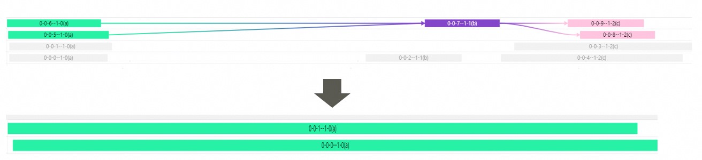
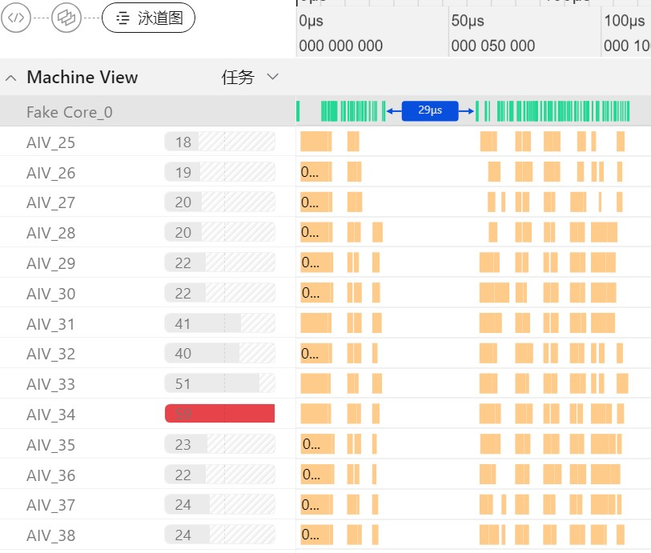
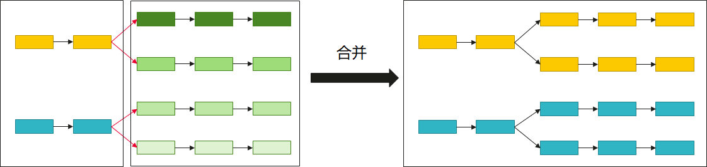
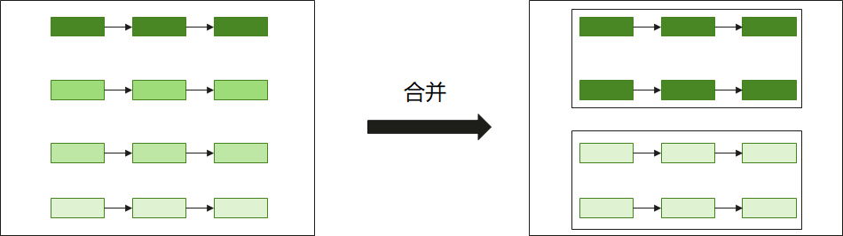
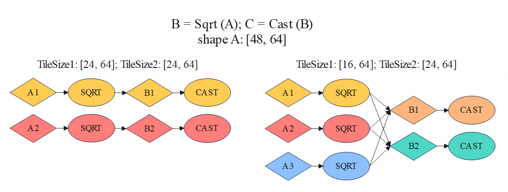

# 性能调优

## 简介

在融合算子的开发过程中，算子性能优化通常难度极高。本章旨在介绍如何利用PyPTO Toolkit可视化工具，帮助开发者在无需深入了解硬件实现细节的情况下，完成高性能融合算子的编写。

## 整体流程

在完成精度调试后，开发者可以利用PyPTO Toolkit查看对应算子的泳道图，泳道图用于直观展示计算图的实际调度与执行过程，清晰呈现任务的执行顺序和耗时信息。基于此，开发者可以得到所编写算子的初版性能，亦可称之为开箱性能。

通过观察泳道图，开发者可以观察到当前算子实现的性能瓶颈点。在观察到瓶颈点后，通过调整Tiling配置和采用不同的计算图编译策略，得到新实现下的算子泳道图，进行进一步地调整，逐步提升算子性能，实现Man-In-The-Loop（人工参与的优化流程）的调优。

## 性能调优工具

### 采集泳道图数据

1.  通过给@pypto.jit装饰器的入参debug_options配置图执行阶段调试开关启动性能数据采集功能。

    ```python
    @pypto.jit(
        debug_options={"runtime_debug_mode": 1}
    )
    ```

2.  执行用例

    ```bash
    python3 examples/02_intermediate/operators/softmax/softmax.py
    ```

3.  生成泳道图json文件

    在当前工作目录的output/output\_时间戳目录下生成merged\_swimlane.json，该文件为泳道图数据文件。

### 查看泳道图数据

1.  通过PyPTO Toolkit插件查看泳道图。

    右键单击json文件，在弹出的菜单中选择“使用PyPTO Toolkit打开”，如下图所示。

    **图 1**  查看泳道图  
    

    图中展示了任务的执行顺序和耗时信息，帮助开发者分析性能瓶颈。

## 提升算子开箱性能
算子初始性能与loop的写法、Tilesize的设置最为密切。本章我们将介绍如何使用相关接口，在算子初始编写过程中直接得到较好的开箱性能。请参考PyPTO仓库的models文件夹内已开发算子的实现，进行新算子的开发。

### loop的写法

由于不同root function之间的子图不能合并，而子图合并是PyPTO优化性能的关键手段，因此loop优化的核心原则是：**增加root function的大小，减少它们的个数**。

#### 1. 静态轴使用 Python for 循环

loop会按当前轴循环展开成不同的root function。因此静态轴上的循环应使用Python的for循环，避免使用PyPTO的loop。

   ```python
   # ✅ 推荐：静态轴使用 Python for
   for i in range(batch_size):
       result[i] = process(data[i])

   # ❌ 避免：静态轴使用 PyPTO loop
   for i in pypto.loop(batch_size, name="LOOP_1", idx_name="i"):
       result[i] = process(data[i])
   ```

调优效果可参考GDR算子案例[动态loop调整为静态loop](./performance_case_GDR.md#331-动态loop调整为静态loop)章节。

#### 2. 动态轴使用 PyPTO loop 并配合恰当的 view 视图配置

当算子内有动态shape时，动态轴的dim数值范围往往较广，需要使用loop循环处理。此时需要注意view视图的参数配置，选取的shape范围不能过小，否则会限制后续Tilesize的配置范围，导致每次循环的计算量过小，循环次数增加，部分运算还可能导致额外的重复搬运。比如矩阵乘运算，Tilesize过小会导致大量的root function搬运相同的左矩阵或右矩阵。view Tilesize为128的写法示例如下：

   ```python
   # 推荐：动态轴使用 loop + unroll
   bsz, h = x.shape
   b = 128
   b_loop = (bsz + b - 1) // b
   for b_idx in pypto.loop(b_loop, name="LOOP_1", idx_name="b_idx"):
       b_valid = (bsz - b_idx * b).min(b)
       x_view = pypto.view(x, [b, h], [b_idx * b, 0], valid_shape=[b_valid, h])
       # Matmul
       pypto.set_cube_tile_shapes([128, 128], [128, 128], [128, 128])
       y = pypto.matmul(x_view, W)
   ```

#### 3. 尽可能合并 loop

检查算子代码是否有可以合并的loop块，应当将其合并以增大root function。例如下面的两个loop就可以合并，进而提升OP1和OP2运算合并的可能，以减少y的冗余搬运。
```
bsz = x1.shape[0]
for b_idx in pypto.loop(bsz, name="LOOP_1", idx_name="b_idx"):
       out_1 = OP_1(x1[b_idx, :], y)
for b_idx in pypto.loop(bsz, name="LOOP_2", idx_name="b_idx"):
       out_2 = OP_2(x2[b_idx, :], y)
```

#### 4. 动态轴范围较广时使用 loop_unroll

当算子使用动态shape，且shape范围较广的场景，应考虑使用loop_unroll代替loop接口。loop_unroll功能与loop类似，在其基础上增加了unroll_list参数支持多个展开方式。比如当算子中某个动态轴需要泛华支持1~64k的shape范围时，指定单一的动态轴切分大小难以满足要求。切分过大时，小shape场景会引入较多实际计算大小为0的空计算任务，增加耗时；切分过小时，大shape场景下循环次数过多，影响整体性能。使用loop_unroll后，无论大小shape场景，框架都会根据unroll_list参数选择合适的档位或组合，避免冗余计算，且循环次数可控，因此可获得较好的性能。

具体使用时注意两点：

- 伴随unroll_list参数配置的挡位数量增加，编译过程需要处理的任务量也成倍增加，导致编译时间变长。因此在最初编写算子时，建议使用较短的unroll list，如[64, 16, 4]。
- 使用动态分档时应当注意不同档位可能需要分别选择合适的Tilesize。

参考示例如下：

```python

'''
input：A， shape:[-1, 64]
output：B， shape:[-1, 64]

-1：表示动态shape
'''
.....
for b, k in pypto.loop_unroll(A.shape[0] // 64, unroll_list=[64, 16, 4], name="A", idx_name='b'):
   ### 支持在不同的展开档位设置不同调优参数
   if k <= 16:
      pypto.set_vec_tile_shapes(16, 64)
   else :
      pypto.set_vec_tile_shapes(64, 64)

   tile_a = A[b * 64:(b + k) * 64, :]  #
   tile_a = tile_a + 2
   B[b * 64:, :] = tile_a
```

调优效果可参考GDR算子案例[unroll_list优化](./performance_case_GDR.md#333-unroll_list优化)章节。

### Tilesize的设置

Tilesize配置的基本原理与使用约束等参考[Tiling配置](../development/tiling.md)章节。其切分大小一方面直接决定了算子切分后的任务数量，从而决定了实际执行时的分核数、计算轮次。另一方面，切分大小从理论层面决定了算子的算数强度。因此，优化性能的关键是优化Tile配置。

通常切分越大，算数强度越大，计算越容易达到Compute Bound，进而充分使能NPU的算力。这是由于，切分必然会引入重复搬运，切分越多重复搬运量越大，从而算数强度越低。而另一方面，切分大小又受片上多级缓存空间（L1、L0或UB）的限制而不能无限增加。

#### 1. Cube 计算（矩阵乘）

针对矩阵运算场景，基于A2/A3平台，以A、B矩阵均为BF16或FP16类型为例，满足Buffer空间约束的推荐Tile配置为：
```python
# Cube的相关计算建议采用如下的TileShape：
pypto.set_cube_tile_shapes([128, 128], [64, 256], [256, 256])
pypto.set_cube_tile_shapes([256, 256], [64, 256], [128, 128])
pypto.set_cube_tile_shapes([128, 128], [128, 512], [128, 128])
```

以上Tile配置的优点：
- 在满足L0 Buffer约束的条件下可以达到较大的算数强度；由于Tile大小需要满足分型格式的对齐要求，同时要考虑切分大小对于写入、写出带宽的影响，一般取128-256的组合。
- MTE2、MTE1搬运均可以开启double buffer，可以使能流水并行。

#### 2. Vector 计算

针对向量运算场景，我们应该按照OP和芯片UB大小来确定合适的Tilesize。

- 首先，需要满足特定OP对Tilesize的规格约束。如scatter update要求尾轴Tilesize和shape一致，即不对尾轴进行切分。各个OP的具体限制可以参考PyPTO文档的API介绍部分。

- 其次，我们要保证OP的输入与输出Tensor可以在UB中分配内存，因此Tilesize不能过大。同时由于子图和搬运的数据块较小会导致性能劣化，因此Tilesize又不能过小。以A2/A3为例，UB的缓存容量为192kb。因此合适的初始Tilesize是既满足OP的要求，又使得数据块大小在16到64KB之间，尾轴32B对齐。

- 此外，归约类计算(Reduce运算，如：sum、max、min等)尽可能不要在归约轴上进行切分。例如，输入shape为(56, 1024)的RMSNorm，它的最后一维Tilesize应当设为1024。下图的上半部分是对reduce轴切分的RMSNorm的泳道图例子，多个子图的输出需要在同一个子图进行reduce操作，导致产生GM搬运和调度开销。下半部分是不对reduce轴切分的例子，此时上下游子图合并，没有GM搬运和调度开销。



综上考虑，在初始算子开发阶段可以先使用如下设置，后续再结合泳道图数据进一步调优。

```python
# Vector的相关计算建议采用如下的TileShape：
pypto.set_vec_tile_shapes(64, 512)
```

针对Tilesize调优的实际效果可参考GDR算子案例[昇腾亲和的Tile Shape大小调优](./performance_case_GDR.md#32-昇腾亲和的tile-shape大小调优)章节。

需要特别说明的是，上述Tile配置并非一成不变，需要用户根据计算场景（考虑输入shape、dtype、format等）以及硬件平台进行综合考虑。

## 深度性能调优
进一步调优算子性能需要采用man-in-loop的方式，通过获取并分析当前算子性能数据，针对性调整各性能配置参数，经过迭代调优逐步逼近最佳性能。算子性能数据可以通过泳道图获取，泳道图的采集和分析是算子调优过程中的重要一环，本章节的调优过程需要结合泳道图进行。

### 1. stitch调优

Stitch配置决定了多少个root function被同时下发调度。因此Stitch设置较大后任务可以充分并行，通常性能更优。当泳道图出现下图这种空白区域时，通常意味着root function数量较大或stitch配置较小，需要进行优化。



当前stitch配置主要由[stitch_function_max_num](../../api/config/pypto-set_pass_options.md)参数决定，在jit装饰器中完成配置，可参考如下配置：

```python
    @pypto.frontend.jit(
        runtime_options={"stitch_function_max_num": 128}
    )
```
具体参数含义与规格请参考对应的API介绍，实际效果可参考GDR算子案例[Config配置调优](./performance_case_GDR.md#31-pypto-config配置调优)章节。

但是stitch配置不是一定越大越好，Stitch设置较大时workspace也会增加，大量任务并行，可能导致L2命中率较低。遇到该类场景时，需要结合泳道图数据调整如上参数，使总耗时减少。

另外root function间的子图依赖关系复杂时，可能会导致任务不能及时调度，泳道图出现因为解依赖导致的空白区域。此时可以尝试配置loop或loop_unroll的`submit_before_loop`参数为`True`，进而保证root function的先后执行顺序，可能带来更优的性能。

### 2. 合图调优

合图是指将计算图中多个逻辑上独立的Operation合并为一个逻辑子图，并由该子图最终生成一个物理计算内核（Kernel）的过程。深度学习模型的计算图往往由大量粒度较小的Operation构成，传统逐Operation 执行模式下，每个 Operation 都会独立触发一次内核启动，计算完毕后将中间结果写回全局内存（GM）。这种执行方式在实际硬件上会引入显著的内核启动开销和冗余内存访问，难以充分发挥计算单元的全部计算能力。合图优化通过Operation逻辑聚合，使多个 Operation 在同一Kernel中协同执行。计算的中间结果得以保存在片上高速缓冲中，供下游Operation直接读取，同构消除冗余的GM读写，显著提升计算–访存比并改善整体执行效率。

在 PyPTO 编程模型中，开发者通过 Tensor 和 Tensor Operation 构建计算图。合图过程由编译器内部的优化 Pass 自动完成，用户无需手工编写融合Operation代码。合图 Pass 会在保证计算结果正确性的前提下，对计算图进行分析与重写，将原始计算图划分并重组为更适合目标硬件执行的子图。PyPTO 的合图优化主要分为深度方向合图和广度方向合图两类，分别针对不同的性能瓶颈场景。

#### 深度方向合图

深度方向合图基于计算图中的生产者–消费者关系，沿数据依赖路径将前后相邻的 Operation 进行融合。该方式通过消除中间结果的写回操作，直接优化数据流路径，使原本受限于带宽的算子链得以在单个内核内一气呵成地完成计算。


PyPTO框架在深度方向上已经实现了自动合图的功能，在极致性能优化场景下，可以配置[sg_set_scope](../../api/config/pypto-set_pass_options.md)参数手动指定合图方案，把operation操作分配到特定的计算任务中，进而改变各个任务的耗时，以实现负载均衡。该过程需要结合泳道图信息进行分析优化。具体使用方式可以参考案例：[glm_attention.py](../../../models/glm_v4_5/glm_attention.py)

#### 广度方向合图
广度方向合图针对计算图中处于同一层级、可并行执行的 Operation，通过将多个并行 Operation 合并到同一 Kernel 中执行以增强单次 Kernel 的计算规模。在核内指令编排阶段，多分支融合能更充分地填充硬件流水，实现更优的多pipe并发。在访存层面，通过归并同源访存，将多次重复的GM到L1搬运整合为单次加载，在节省内存带宽的同时，有效摊薄了 Kernel 启动开销，最终提升了硬件计算单元的整体吞吐率。


针对Matmul与Vector计算，PyPTO 提供了不同的广度方向合图调优接口，将在接下来的章节分别详细介绍。

### 3. Matmul调优
#### Tilesize调优

进一步调优Matmul的Tilesize，需要充分考虑对算数强度和带宽的影响，具体介绍见[Matmul高性能编程](./matmul_performance_guide.md)章节。

#### L1大包搬运

通过设置不同的L0和L1搬运的Tilesize，可以在不超出L0缓存容量的限制下，提升L1搬运的数据块大小，提升带宽利用率。

当M、N中有某个维度相对较小（如推理场景）时，Matmul在切分前的算数强度相对较小，一般只能达到Memory Bound。此时我们的优化思路主要是在保证分满核的前提下，尽量减少数据重复载入（主要是MTE2重复载入）。

一般而言，我们至少要保证分核数达到总核数的0.8以上（以24核平台为例，需要至少分20核），这样可以保证MTE2带宽具有较高的利用率。用公式表示如下：
$$
\frac{M}{mL1} \cdot \frac{N}{nL1} >= 0.8 \cdot coreNum
$$
在此基础上，需要尽可能减小重复载入量。MTE2总载入量为：
$$
MTE2\_LOAD\_SIZE = M \cdot K \cdot \frac{N}{nL1} \cdot aByte + K \cdot N \cdot \frac{M}{mL1} \cdot bByte
$$
综上，此时的Tile配置求解就转化为一个约束条件下的极值求解问题。

举例，对于输入规格为 M = 96，K = 1536，N = 3000，数据类型为FP16的场景。
为了避免B矩阵的MTE2重复载入，一种较好的切分方式是设置mL1 = M = 96；另外，为了分满核，推荐设置nL1 = N / coreNum = 125，还需要进一步满足16元素对齐，因此取nL1 = 128。在此基础上，进一步考虑MTE2、MTE1的流水并行以及MTE2带宽利用率，推荐开启大包搬运，并设置kL1 = 4kL0。
综上，一个较好的Tile配置是：
```python
pypto.set_cube_tile_shapes([96, 96], [64, 256], [128, 128], enable_multi_data_load=True, enable_split_k=False)
```

注意到A矩阵的总数据量为288 KB，而对于A2/A3平台来说，L1 Buffer空间为512 KB，也就是说，A矩阵可以被一次性搬入L1中，然后一直驻留并反复使用即可。因此我们也可以尝试下面的Tile配置：
```python
pypto.set_cube_tile_shapes([96, 96], [64, 1536, 256], [128, 128], enable_multi_data_load=True, enable_split_k=False)
```
此处K轴设置了三个切分值，1536和256分别表示A矩阵和B矩阵的K轴在L1上的切分大小。

#### 多核切K

通常在K轴较大时可以尝试开启多核切K功能，即允许将多个K轴方向上的tile切块分配到不同的cube核进行计算。尤其是M和N轴较小时，不开启多核切K会导致核数使用少、矩阵乘性能差。

举例说明，对于输入规格为 M = 128，K = 8192，N = 256，数据类型为FP16的场景。可以采用以下Tile配置实现K轴分核，将`enable_split_k`置True以使能K轴分核，同时保留K轴上的大包搬运配置以实现流水并行：
```python
pypto.set_cube_tile_shapes([128, 128], [64, 256], [128, 128], enable_multi_data_load=True, enable_split_k=True)
```

K轴切分的实现伪码如下：
```
c = 0.0

for kIdx in range(K / kL1):
    for mIdx in range(M / mL1):
        for nIdx in range(N / nL1):
            c_partial = Matmul(A[mIdx * mL1 : mIdx * mL1 + mL1, kIdx * kL1 : kIdx * kL1 + kL1], B[kIdx * kL1 : kIdx * kL1 + kL1, nIdx * nL1 : nIdx * nL1 + nL1])

    c += sum(c_partial)
```
使用kL1对K轴进行切分，单核内仅计算kL1长度的部分和然后搬出，最后将所有部分和在GM做atomic add。用户也可以按这一形式手写PyPTO算子，使用Add OP以避免确定性计算问题。实现方式为：在前端里使用Python的for循环写出切K后的矩阵乘，将其输出按顺序使用add进行累加。

#### Matmul子图合并（L1Reuse和CubeNBuffer）

Matmul运算场景下通过[set_pass_options](../../api/config/pypto-set_pass_options.md)接口配置子图合并，主要可以选择L1Reuse和CubeNBuffer两种策略。两者都是用于合并Cube子图，前者用于合并具有冗余L1搬运的子图、后者用于合并同构的子图。L1Reuse可以减少L1搬运量，CubeNBuffer可以在不同分支的矩阵乘间隐藏搬运和计算耗时。它们都能减少子图调度开销，但考虑到大多数的矩阵乘场景的性能瓶颈都是数据搬运，因此优先使用L1Reuse策略减少数据搬运量。

实际上L1Reuse策略是默认开启的，但其具体的子图合并数量可以通过cube_l1_reuse_setting参数进行配置，通常考虑2、4、8等值，可以结合泳道图实测数据择优配置。可参考如下配置：

```python
# 推荐：全局统一配置为2
@pypto.frontend.jit(
    pass_options={"cube_l1_reuse_setting": {-1: 2}}
)

# 特定场景下：全局配置的基础上，同构子图id为0的子图配置为8
@pypto.frontend.jit(
    pass_options={"cube_l1_reuse_setting": {-1: 2, 0: 8}}
)
```

CubeNBuffer针对的是不能使能L1Reuse的场景，此类场景较少，主要有以下两种：
1. Cube子图间没有重复L1搬运。如BatchMatmul的左右矩阵shape分别为(128,64,64)和(128,64,64)时，pass切出128个左右矩阵shape分别为(64,64)和(64,64)的同构Cube子图后，它们之间没有重复L1搬运。还有FA算子的MM2，不同S2 block的MM2子图之间没有重复L1搬运。
2. K轴很长。当没有进行切K时，L1Reuse要求左矩阵的一整行或右矩阵的一整列数据块驻留在L1中。而L1缓存容量有限。因此当K轴较长、且没有切K时，无法使用L1Reuse。

此时可以配置cube_nbuffer_setting参数，并结合泳道图实测数据进一步调优。可参考案例[mla_prolog_quant_impl.py](../../../models/deepseek_v32_exp/mla_prolog_quant_impl.py)

#### 其他优化方法

1\. 检查输入矩阵、尤其是shape较大的权重矩阵是否可以提前以NZ格式存储。NZ格式的数据搬运到L1的带宽更高。

2\. 通过`set_cache_policy`设置合理的L2 CacheMode，对于只访问一次的Global Memory数据设置其访问状态为不进入L2 Cache。

3\. 矩阵乘前后有transpose时，可以尝试更换左右矩阵并使用左右矩阵转置的配置。由于N轴在尾轴上，因此当M轴较大、N轴较小时，也可以尝试该方法，使得左右矩阵有更大的尾轴，提升搬运带宽。

4\. 特殊shape时可以尝试使用Vector操作提前处理输入矩阵，使其变成更标准的shape。以左右矩阵shape分别为(884736,16)和(16,16)的矩阵乘为例。如果只使用L1Reuse，只能优化到500us。而使用下面的写法，提前将四个重复的右矩阵在对角线拼成一个shape为(64,64)的新的右矩阵c，将它和reshape后的左矩阵做矩阵乘，则算子性能大幅提升到40us。

```python
def matmul_kernel(a, b, out):
    # 构造c
    pypto.set_vec_tile_shapes(64, 64)
    d = pypto.full([16, 16], 0.0, pypto.DT_BF16)
    c1 = pypto.concat([b, d, d, d], 1)
    c2 = pypto.concat([d, b, d, d], 1)
    c3 = pypto.concat([d, d, b, d], 1)
    c4 = pypto.concat([d, d, d, b], 1)
    c = pypto.concat([c1, c2, c3, c4], 0)
    # a变形
    a = pypto.reshape(a, [221184, 64])
    # 矩阵乘
    pypto.set_pass_options(Cube_l1_reuse_setting={-1:9})
    pypto.set_cube_tile_shapes([512, 512], [64, 64], [64, 64], True)
    e = pypto.matmul(a, c, pypto.DT_BF16)
    e = pypto.reshape(e, [884736, 16])
    pypto.assemble(e, [0, 0], out)
```

### 4. Vector调优

#### Tilesize调优

Vector的Tilesize配置除了需遵从前述章节介绍的原则以外，还需结合泳道图关注以下几点：

- 下游Vector OP的Tilesize尽可能使用上游OP的输出Tilesize。例如Transpose后接着一个Add OP时，假设前者的Tilesize设置为(64, 128)，则后者的Tilesize应该优先选择为(128, 64)。上下游OP的Tilesize对齐时，它们有着简单的一对一依赖，pass通常会自动将其合并在一个子图，达成融合算子的优化效果。如果没有合并，可以使用前文介绍的sg_set_scope或切图旋钮将其合并起来。上下游OP的Tilesize不对齐时，可能产生多对多依赖，无法正常合图。如下图所示，每一种颜色代表一种子图。当前后的Sqrt和Cast OP使用相同的Tilesize时，可以切出两个并行的融合子图；反之Sqrt和Cast OP使用不同Tilesize时，上下游子图之间是三对二的依赖，此时不能得到并行的融合子图。



- 根据泳道图上的子图大小和并行度来调整Tilesize。在优化目标的场景下，当泳道图上某一部分并行的核数较少（如只使用了不到一半的Vector核）时，应尝试减小该处OP的Tilesize。反之，泳道图上某一部分子图耗时较短、调度开销的耗时占比较高时，应尝试增大该处OP的TileSize。需要注意的是这些调整应当避免在尾轴和规约轴上进行，因为这些轴上的Tilesize应当符合前文所述的优化原则。另外，进行Tilesize优化时可能会因为合图等原因导致OoO报错，此时应找到报错相关的OP，将其Tilesize调小，再进行上述的第三点优化。

- 调整相邻的Cube和Vector OP的Tilesize，使Cube子图和Vector子图之间依赖变得更简单，尽量避免多对多的依赖关系。


#### 更改前端写法

1\. 增加冗余计算来避免冗余依赖和搬运。这些下面是PyPTO仓库的models/glm_v4_5/glm_moe_fusion.py的示例，通过将e_score_bias_2d复制tile_batch份后进行cast操作，使得每一份的cast都和对应batch的其他操作进行了合图。这避免了e_score_bias_2d的cast操作和每个batch的后续计算产生一对多的子图依赖、增加调度开销，还避免了cast结果的搬运。
```
e_score_bias_2d_tile = pypto.tensor([tile_batch, ne], e_score_bias_2d.dtype, "e_score_bias_2d_tile")
for tmp_idx in range(tile_batch):
       pypto.assemble(e_score_bias_2d, [tmp_idx, 0], e_score_bias_2d_tile)
e_score_bias_2d_cast = pypto.cast(e_score_bias_2d_tile, tile_logits_fp32.dtype)
```

2\. 检查是否有不合理数据操作导致的冗余搬运，例如更换concat为assemble、尝试对reshape配置`inplace = True`参数。

3\. Vector的优化和矩阵乘的优化一样，需要避免处理尾轴长度较小的Tensor。使用较大的Tilesize也无法避免OP的输入Tensor的尾轴较小时，我们可以使用concat、transpose或reshape等数据操作OP来增大尾轴。

#### Vector子图合并

在优化子图合并相关旋钮之前，需要先完成Tilesize的调优，因为不合适的Tilesize会导致复杂的依赖关系，从理论上无法得到既多核并行又融合多个OP的子图任务。

对于想要融合的多个OP，优先使用sg_set_scope尝试将其合并。融合的目标可以来自于已有经验，例如IFA算子切batch轴、s2轴和g轴后，V1和V2一般应各作为一个子图任务。具体案例可以参照models/glm_v4_5/glm_attention.py示例。融合的目标也可以来自于OP间的依赖关系，例如上下游的两个OP间传输的数据量较大时，应当将其合并以减少搬运耗时；或者多个OP进行tile切分后变成多个并行的连通分支时，应当将这些OP进行合并。

除了sg_set_scope的精细控制，我们也可以调整pg_upper_bound和pg_lower_bound对计算图全局进行算法的自动切分。泳道图上多数子图较小（耗时在10u以下）、调度开销耗时占比较多时，可以增加pg_upper_bound和pg_lower_bound。反之，泳道图上子图较长，但是核数使用较少、并行度差时，可以减少这两个旋钮设置值。

vector运算场景下通过[set_pass_options](../../api/config/pypto-set_pass_options.md)接口的vec_nbuffer_setting参数配置广度方向上的子图合并。需要注意的是，应先进行前面的优化步骤将上下游子图的切分和合并调到较合适后，再尝试使用vecNBuffer来进行广度合并。当泳道图内有同构子图组具有大量的小子图（耗时在10u以下）时，应该使用该功能进行优化，以减少AICPU调度开销和kernel的头开销。

#### 其他优化方法

当进行上述优化后算子性能仍然较差时，需要考虑TileOP本身实现是否较差。我们可以构造单独OP的用例与Ascend C小算子的性能对比，确认性能较差后检查是否没有使用更优的指令。

### 5. 更改调度策略

PyPTO算子的核间的流水由AICPU对子图的调度确定，它基于子图间的依赖关系和核间任务的调度策略。我们可以尝试更改该调度策略以达到更优的算子性能。当上下游子图之间依赖较为简单，或下游子图输入Tensor的L2命中率较为重要时，推荐使用L2亲和调度，配置方式如下：

```python
pypto.set_runtime_options(device_sched_mode=1)
```

具体配置时应综合考虑L2复用与负载均衡的影响，不同场景的最佳配置策略不同，应结合泳道图具体分析。以 `models/glm_v4_5/glm_attention.py` 为例，不同配置策略的效果如下所示：

- `"device_sched_mode": 0`  
  
<span style="font-size:12px;"></span>
- `"device_sched_mode": 1`  
  
<span style="font-size:12px;"></span>
- `"device_sched_mode": 2`  
  
<span style="font-size:12px;"></span>
- `"device_sched_mode": 3`  
  
<span style="font-size:12px;"></span>
