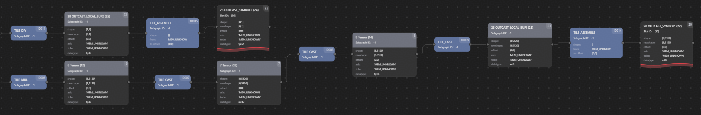

# ffn\_shared\_expert\_quant算子NPU上板调试案例<a name="ZH-CN_TOPIC_0000002531838493"></a>

## 功能说明：<a name="section1925252315288"></a>

ffn\_shared\_expert\_quant算子对应GLM4.5网络中MoE共享专家的计算逻辑，包含symmetric\_quantization\_per\_token、matmul、dequant\_dynamic和swiglu，用于进行单个共享专家的量化前向传播计算，通过在不同任务或数据流之间复用同一组权重参数，以学习通用的特征表示，同时减少模型的参数总量。

## 算子原型：<a name="section1613425112293"></a>

```
def ffn_shared_expert_quant(
    hidden_states: torch.Tensor,
    w13: torch.Tensor,
    w13_scale: torch.Tensor,
    w2: torch.Tensor,
    w2_scale: torch.Tensor,
    ffn_res: torch.Tensor
) -> None:
```

## 源码链接：<a name="section153571111862"></a>

[https://gitcode.com/cann/pypto-dev/blob/master/examples/models/glm\_v4\_5/glm\_ffn\_shared\_expert\_quant.py](https://gitcode.com/cann/pypto-dev/blob/master/examples/models/glm_v4_5/glm_ffn_shared_expert_quant.py)

## 调试案例<a name="section81571242182415"></a>

假设在NPU上板运行时，ffn\_shared\_expert\_quant算子测试用例运行失败并报错，此时需要进行调试，定位问题。

首先可以通过查看计算图中的Tensor Graph进行问题的定位，主要步骤如下：

1.  按照[开启调试模式](NPU上板调试.md#section19435171912125)所述步骤开启调试模式，重新运行用例后获取ffn\_shared\_expert\_quant算子运行计算图；
2.  成功获取计算图后，按照[查看计算图](NPU上板调试.md#section788471319424)所述步骤一，查看Tensor Graph，使用PyPTO Toolkit可视化工具打开文件

    Before\_004\_ExpandFunction\_TENSOR\_share\_loop\_idx\_Unroll1\_PATH0\_4.json：

    

3.  在图中可以发现：Tensor Graph截断于第一个Matmul，之后的节点都未能正确加载，有明显异常，至此可以初步定位问题出现在Matmul中，检查算子中各个Matmul的使用正确性。

除计算图外，也可以根据内部DFX校验展示的ERROR报错内容来定位问题。

```
ERROR:root:Record function share_expert_moe_main failed: ASSERTION FAILED: kSizeA == kSizeB
Matrix K dimemsion mismatch, kSizeA: 384, kSizeB: 8
, func ConstructTensorGraph, file cube_operation_impl.cpp, line 1220
libtile_fwk_interface.so(npu::tile_fwk::Tensor npu::tile_fwk::Matrix::ConstructTensorGraph<false, false, false>(npu::tile_fwk::DataType, npu::tile_fwk::Tensor const&, npu::tile_fwk::Tensor const&, npu::tile_fwk::Tensor const&, npu::tile_fwk::Matrix::MatmulExtendParam const&)+0x25d) [0x7fe34630ad3d]
libtile_fwk_interface.so(npu::tile_fwk::Tensor npu::tile_fwk::Matrix::Matmul<false, false, false>(npu::tile_fwk::DataType, npu::tile_fwk::Tensor const&, npu::tile_fwk::Tensor const&)+0x14e) [0x7fe34630b51e]
```

针对上述报错内容，可以根据以下步骤进行问题定位：

1.  首先获取关键信息"Matrix K dimemsion mismatch"，得知错误由某Matmul operation传入的张量shape的K轴不相等引起；
2.  检查算子计算过程中各Matmul opertion的输入张量shape，发现是其中一个输入的A/B矩阵位置错误，reduce轴没有对上，问题定位完毕；
3.  修改后再次运行用例，能够正常通过，问题解决。

