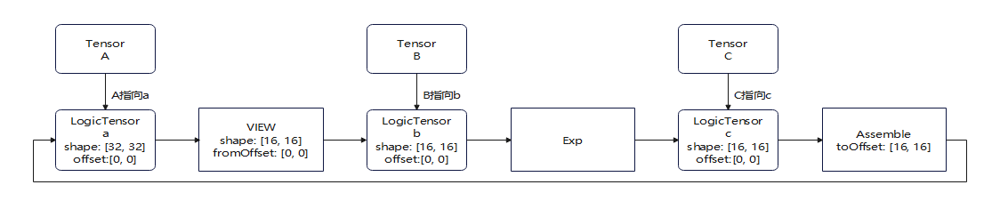
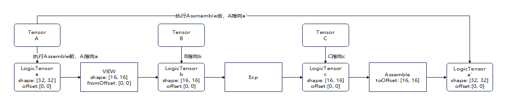

# 同一个Tensor进行View和Assemble导致图成环报错<a name="ZH-CN_TOPIC_0000002530080977"></a>

## 问题现象描述<a name="zh-cn_topic_0000001265073070_section32145724"></a>

示例代码如下：

```
@pypto.jit
def exp_kernel(x, y):
    pypto.set_vec_tile_shapes(16, 16)
    a = pypto.zeros([32, 32])
    b = a[:16, :16] # 从a中view获取数据
    a[16:, 16:] = b.exp() # 计算后assemble写回a

    y[:] = x + a
```

执行报错：

PyPTO接口的报错信息：ASSERTION FAILED

```
ERROR:root:Record function exp_kernel failed: ASSERTION FAILED: outDegree[opToIndex[op.get()]] == 0
```

详细报错如下：

```
ERROR:root:Record function exp_kernel failed: ASSERTION FAILED: outDegree[opToIndex[op.get()]] == 0
, func GetSortedOperations, file function.cpp, line 1036
libtile_fwk_interface.so(npu::tile_fwk::Function::GetSortedOperations() const+0xac0) [0xffff9b038fd4]
libtile_fwk_interface.so(npu::tile_fwk::Function::SortOperations()+0x38) [0xffff9b039798]
libtile_fwk_interface.so(npu::tile_fwk::Function::EndFunction(std::shared_ptr<npu::tile_fwk::TensorSlotScope> const&)+0x8ec) [0xffff9b05d0ac]
libtile_fwk_interface.so(npu::tile_fwk::Program::FinishCurrentFunction(std::shared_ptr<npu::tile_fwk::TensorSlotScope> const&, bool)+0x1b0) [0xffff9b2849b4]
libtile_fwk_interface.so(npu::tile_fwk::Program::EndFunction(std::string const&, bool)+0x128) [0xffff9b289868]
libtile_fwk_interface.so(npu::tile_fwk::Program::EndHiddenLoop(npu::tile_fwk::Function*, bool)+0xb0) [0xffff9b289f00]
libtile_fwk_interface.so(npu::tile_fwk::Program::EndFunction(std::string const&, bool)+0x5c) [0xffff9b28979c]
libtile_fwk_interface.so(npu::tile_fwk::RecordLoopFunc::IterationEnd()+0x44) [0xffff9b28c634]
libtile_fwk_interface.so(npu::tile_fwk::RecordLoopFunc::Iterator::operator!=(npu::tile_fwk::RecordLoopFunc::IteratorEnd const&)+0xfc) [0xffff9b28cb10]
```

## 原因分析<a name="zh-cn_topic_0000001265073070_section20876063"></a>

该报错的原因是内部在对基本算子做拓扑排序时发现存在环路的报错。

这是由于数据从a中读取又写回a导致的。

由于pypto描述的是一个图表达，在读取和写入的时候，当前认为a是一个整体，因此创建的连接关系会形成一个环路，即a-\>b-\>b.exp\(\)-\>a，而pypto不允许构造出的图内存在环路，必须为DAG（有向无环图），所以才有这个报错。



## 解决措施<a name="section978802251020"></a>

-   当前需要将读取和写入a的逻辑拆分成两个图去定义，避免一个图内存在环路。

-   后续等Assemble的SSA语义上线后使用该写法不会有问题。



