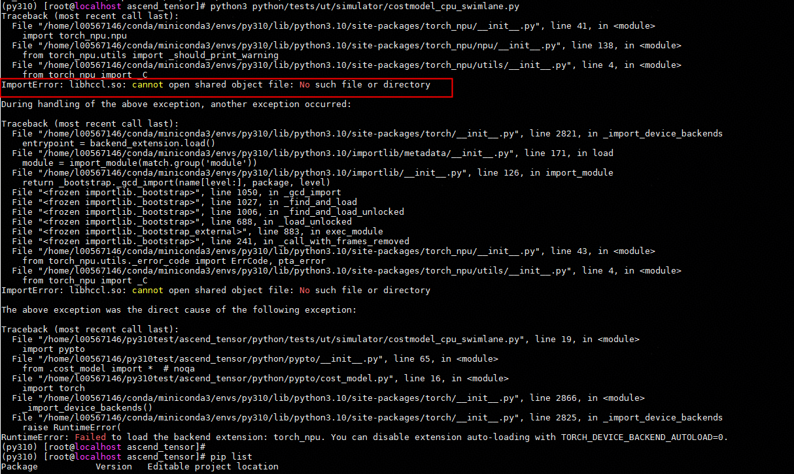

# 已安装torch\_npu，但未安装cann时，执行仿真异常<a name="ZH-CN_TOPIC_0000002498320988"></a>

## 问题现象描述<a name="zh-cn_topic_0000001265073070_section32145724"></a>



## 问题原因<a name="zh-cn_topic_0000001265073070_section20876063"></a>

程序启动时，torch（版本\>2.5）会自动加载组名为“torch.backends”的所有扩展（如torch npu），若环境上已安装torch npu，但未安装cann，因找不到依赖项，而产生异常。

## 处理步骤<a name="zh-cn_topic_0000001265073070_section13239568"></a>

执行算子前，添加以下环境变量，可规避以上异常

```
export TORCH_DEVICE_BACKEND_AUTOLOAD=0
```

