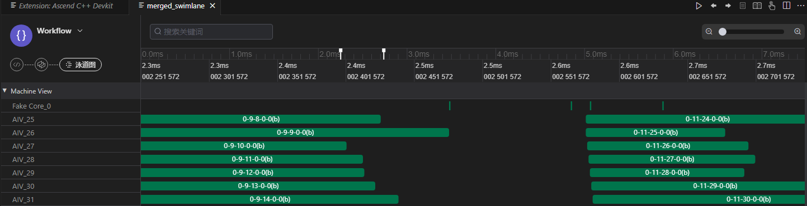

# 性能数据采集与分析<a name="ZH-CN_TOPIC_0000002495188604"></a>

## 简介<a name="section77921998507"></a>

泳道图用于直观展示计算图的实际调度与执行过程，清晰呈现任务的执行顺序和耗时信息，帮助开发者分析算子性能瓶颈。本节将介绍如何采集并查看泳道图，并展示图中的关键信息。

## 采集泳道图数据<a name="section279252115018"></a>

1.  通过给@pypto.jit装饰器的入参debug\_options配置图执行阶段调试开关启动性能数据采集功能。

    ```
    @pypto.jit(
        debug_options={"runtime_debug_mode": 1}
    )
    ```

2.  执行用例

    ```
    python3 python/softmax.py
    ```

3.  生成泳道图json文件

    在当前工作目录的output/output\_时间戳目录下生成merged\_swimlane.json，该文件为泳道图数据文件。

## 查看泳道图数据<a name="section4547124517506"></a>

1.  通过PyPTO Toolkit插件查看泳道图。

    右键单击json文件，在弹出的菜单中选择“使用PyPTO Toolkit打开”，如下图所示。

    **图 1**  查看泳道图<a name="fig19287173812306"></a>  
    

    图中展示了任务的执行顺序和耗时信息，帮助开发者分析性能瓶颈。

