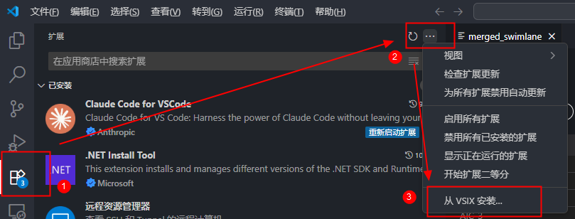

# 环境准备<a name="ZH-CN_TOPIC_0000002527468205"></a>

开源版本请参见仓库README，商发版本参见本节内容。

目前支持开发者在具有昇腾设备的环境使用（下文简称昇腾环境/NPU环境），同时也支持在没有昇腾设备的CPU仿真环境（下文简称CPU仿真环境）中进行测试体验，在准备完成后，可利用昇腾设备进行加速计算。

1.  安装驱动固件和CANN软件包。

    具体请参考《CANN 软件安装指南》，CPU仿真环境运行时无需安装驱动固件。

2.  配置环境变量。

    安装CANN软件后，使用CANN运行用户进行编译、运行时，需要以CANN运行用户登录环境，执行**source $_\{install\_path\}_/set\_env.sh**命令设置环境变量。其中$\{install\_path\}为CANN软件的安装目录，例如：/usr/local/Ascend/cann。

3.  安装Pytorch框架及Ascend Extension for PyTorch（即torch\_npu插件）。

    具体请参考《Ascend Extension for PyTorch 软件安装指南》。

4.  验证是否安装成功。

    ```
    import pypto
    print(pypto.symbolic_scalar('success'))
    ```

    输出success表示成功。

5.  安装PyPTO Toolkit插件。

    如需体验计算图和泳道图的查看能力，请安装PyPTO Toolkit插件：

    1.  单击[LINK](https://ascend-cann.obs.cn-north-4.myhuaweicloud.com/devkit/pypto-toolkit-0.1.12.vsix)下载插件。
    2.  打开Visual Studio Code，进入“扩展”选项卡界面，单击右上角的“...”，选择“从VSIX安装...”。

        **图 1**  安装PyPTO Toolkit插件<a name="fig664318794012"></a>  
        

    3.  选择.vsix插件文件，完成安装。

