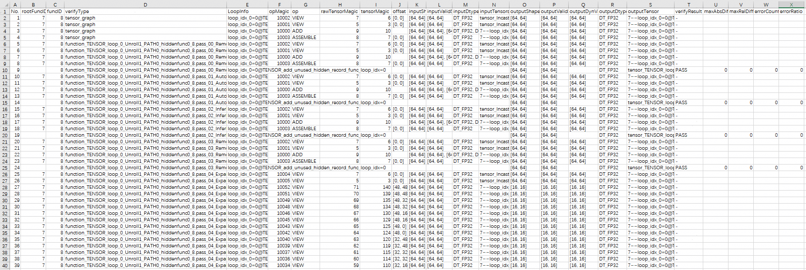

# 精度调试工具<a name="ZH-CN_TOPIC_0000002532160893"></a>

## 工具简介<a name="section244274610279"></a>

PyPTO在计算图编译的各Pass阶段拥有完整的中间表示，可翻译成第三方计算代码，并在其它计算单元（例如Host CPU）上模拟计算过程。该工具通过模拟计算结果与基准数据的误差对比，可以检测算子异常或者某个Pass的处理结果是否存在异常，并定位首个出现异常的计算节点。

主要特性包括：

-   粗检：基于前端框架的Tensor Graph最终输出结果，检测整体正确性。需用户提供基准数据（golden input/output）。
-   自检：基于各Pass的中间计算结果，检测Pass的正确性及异常计算节点。
-   调测：指定单个计算结果，保存到文件或者以可读形式打印到输出、日志。

## 使用约束<a name="section3983525144010"></a>

当前自检工具存在以下限制（完整计算流表示仅保存在pass运行上下文中），无法使用自检功能：

-   不支持上板执行的中间数据自检，仅支持前端及pass的初步检查和自检。
-   不支持集合通信。
-   不支持特定pass，特定pass为中间的优化过程缺少完整计算信息，工具内部做自动跳过处理。
-   不支持pass间的自动对比校验（需人工进行数据对比）。
-   不支持程序退出后的运行环境构造并模拟计算。需在算子编译时，在主机CPU上构造并模拟计算。
-   不支持基于昇腾AI处理器调用Ascend C构造并模拟计算。
-   不支持基于GPU构造并模拟计算。

## 自检操作步骤<a name="section31910273345"></a>

1.  开启精度调试开关。

    ```
    ...
    verify_options = {
        "enable_pass_verify": True,
        "pass_verify_save_tensor": True,
        ...
    }
    
    @pypto.jit(verify_options=verify_options)
    def user_pypto_func(inputs, outputs):
        ...
    ```

2.  执行用例

    ```
    python3 python/softmax.py
    ```

    打印类似以下输出，指示对应的自检结果为通过（PASS）、未通过（FAIL\(ED\)）或跳过校验（NO\_COMPARE）：

    ```
    2025-mm-dd HH:MM:SS:xxx V | tensor_graph Verify NO_COPARE
    2025-mm-dd HH:MM:SS:xxx V | function_TENSOR_loop_0_Unroll1_PATH0_hiddenfunc0_8.pass_00_RemoveRedundantReshape Verify result PASS
    2025-mm-dd HH:MM:SS:xxx V | function_TENSOR_loop_0_Unroll1_PATH0_hiddenfunc0_8.pass_01_AutoCast Verify result PASS
    2025-mm-dd HH:MM:SS:xxx V | function_TENSOR_loop_0_Unroll1_PATH0_hiddenfunc0_8.pass_02_InferMemoryConflict Verify result PASS
    ...
    2025-mm-dd HH:MM:SS:xxx V | function_TENSOR_loop_0_Unroll1_PATH0_hiddenfunc0_8.pass_34_InsertSync Verify result PASS
    2025-mm-dd HH:MM:SS:xxx V | function_TENSOR_loop_0_Unroll1_PATH0_hiddenfunc0_8.pass_35_MixSubgraphSplit Verify result PASS
    2025-mm-dd HH:MM:SS:xxx V | function_TENSOR_loop_0_Unroll1_PATH0_hiddenfunc0_8.pass_36_CodegenPreproc Verify result PASS
    ```

3.  执行结束后，在$\{work\_path\}/output/output\_\*/目录（\*代表时间戳）下生成verify\_\*目录，存放检测结果文件。

    ```
    ├── tensor_graph # 保存前端初始计算图模拟计算后的中间数据，作为基础数据
    │   ├── *.data 
    │   └── ...
    ├── verify_result.csv # 结果报告，用于保存中间数据的元数据信息、元数据对应的数据文件名、对其中属于Tensor数据的文件进行自检的结果
    ├── {FUNC_NAME}.pass_{PASS_SEQ}_{PASS_NAME} # 保存中间pass计算图模拟计算后的中间数据，作为待测数据
    │   ├── *.data 
    │   └── ...
    ```

4.  查看结果报告文件verify\_result.csv，如下图所示。

    

    **表 1**  结果报告文件参数说明

    <a name="table3306716105119"></a>
    <table><thead align="left"><tr id="row2359141665114"><th class="cellrowborder" valign="top" width="33.26%" id="mcps1.2.3.1.1"><p id="p153591716125110"><a name="p153591716125110"></a><a name="p153591716125110"></a>参数</p>
    </th>
    <th class="cellrowborder" valign="top" width="66.74%" id="mcps1.2.3.1.2"><p id="p153595162517"><a name="p153595162517"></a><a name="p153595162517"></a>说明</p>
    </th>
    </tr>
    </thead>
    <tbody><tr id="row9359101655119"><td class="cellrowborder" valign="top" width="33.26%" headers="mcps1.2.3.1.1 "><p id="p103605166517"><a name="p103605166517"></a><a name="p103605166517"></a>No.</p>
    </td>
    <td class="cellrowborder" valign="top" width="66.74%" headers="mcps1.2.3.1.2 "><p id="p158261434195112"><a name="p158261434195112"></a><a name="p158261434195112"></a>单个Pass内的数据顺序编号，例如1。</p>
    </td>
    </tr>
    <tr id="row1436011685116"><td class="cellrowborder" valign="top" width="33.26%" headers="mcps1.2.3.1.1 "><p id="p18360171615519"><a name="p18360171615519"></a><a name="p18360171615519"></a>rootFuncID</p>
    </td>
    <td class="cellrowborder" valign="top" width="66.74%" headers="mcps1.2.3.1.2 "><p id="p10360121625118"><a name="p10360121625118"></a><a name="p10360121625118"></a>pass组件待补充</p>
    </td>
    </tr>
    <tr id="row20360131655115"><td class="cellrowborder" valign="top" width="33.26%" headers="mcps1.2.3.1.1 "><p id="p83601016185115"><a name="p83601016185115"></a><a name="p83601016185115"></a>funcID</p>
    </td>
    <td class="cellrowborder" valign="top" width="66.74%" headers="mcps1.2.3.1.2 "><p id="p13816128151715"><a name="p13816128151715"></a><a name="p13816128151715"></a>pass组件待补充</p>
    </td>
    </tr>
    <tr id="row1236001614514"><td class="cellrowborder" valign="top" width="33.26%" headers="mcps1.2.3.1.1 "><p id="p83600167511"><a name="p83600167511"></a><a name="p83600167511"></a>verifyType</p>
    </td>
    <td class="cellrowborder" valign="top" width="66.74%" headers="mcps1.2.3.1.2 "><p id="p186251529362"><a name="p186251529362"></a><a name="p186251529362"></a>算子信息及数据对应的pass名称，格式为：</p>
    <p id="p836001611515"><a name="p836001611515"></a><a name="p836001611515"></a>* {FUNC_NAME}.pass_{PASS_SEQ}_{PASS_NAME}</p>
    <p id="p146941149205817"><a name="p146941149205817"></a><a name="p146941149205817"></a>示例为：function_TENSOR_LOOP_L1_Unroll1_PATH1_7.pass_06_SplitReshape</p>
    </td>
    </tr>
    <tr id="row193601216115112"><td class="cellrowborder" valign="top" width="33.26%" headers="mcps1.2.3.1.1 "><p id="p6360111645116"><a name="p6360111645116"></a><a name="p6360111645116"></a>LoopInfo</p>
    </td>
    <td class="cellrowborder" valign="top" width="66.74%" headers="mcps1.2.3.1.2 "><p id="p1036081635115"><a name="p1036081635115"></a><a name="p1036081635115"></a>控制流信息，例如s_idx=2@b_idx=1</p>
    <p id="p3489131001810"><a name="p3489131001810"></a><a name="p3489131001810"></a>pass组件待补充</p>
    </td>
    </tr>
    <tr id="row16360181645113"><td class="cellrowborder" valign="top" width="33.26%" headers="mcps1.2.3.1.1 "><p id="p173601216125112"><a name="p173601216125112"></a><a name="p173601216125112"></a>opCode</p>
    </td>
    <td class="cellrowborder" valign="top" width="66.74%" headers="mcps1.2.3.1.2 "><p id="p877833391716"><a name="p877833391716"></a><a name="p877833391716"></a>pass组件待补充</p>
    </td>
    </tr>
    <tr id="row193604167518"><td class="cellrowborder" valign="top" width="33.26%" headers="mcps1.2.3.1.1 "><p id="p336051615115"><a name="p336051615115"></a><a name="p336051615115"></a>opMagic</p>
    </td>
    <td class="cellrowborder" valign="top" width="66.74%" headers="mcps1.2.3.1.2 "><p id="p15245612131720"><a name="p15245612131720"></a><a name="p15245612131720"></a>pass组件待补充</p>
    </td>
    </tr>
    <tr id="row183608168519"><td class="cellrowborder" valign="top" width="33.26%" headers="mcps1.2.3.1.1 "><p id="p19360111618514"><a name="p19360111618514"></a><a name="p19360111618514"></a>tensorMagic</p>
    </td>
    <td class="cellrowborder" valign="top" width="66.74%" headers="mcps1.2.3.1.2 "><p id="p1424761241710"><a name="p1424761241710"></a><a name="p1424761241710"></a>pass组件待补充</p>
    </td>
    </tr>
    <tr id="row13360716195114"><td class="cellrowborder" valign="top" width="33.26%" headers="mcps1.2.3.1.1 "><p id="p1236191655110"><a name="p1236191655110"></a><a name="p1236191655110"></a>rawTensorMagic</p>
    </td>
    <td class="cellrowborder" valign="top" width="66.74%" headers="mcps1.2.3.1.2 "><p id="p825016122172"><a name="p825016122172"></a><a name="p825016122172"></a>pass组件待补充</p>
    </td>
    </tr>
    <tr id="row336141645110"><td class="cellrowborder" valign="top" width="33.26%" headers="mcps1.2.3.1.1 "><p id="p10361131618513"><a name="p10361131618513"></a><a name="p10361131618513"></a>offset</p>
    </td>
    <td class="cellrowborder" valign="top" width="66.74%" headers="mcps1.2.3.1.2 "><p id="p12253812101715"><a name="p12253812101715"></a><a name="p12253812101715"></a>pass组件待补充</p>
    </td>
    </tr>
    <tr id="row1736181614518"><td class="cellrowborder" valign="top" width="33.26%" headers="mcps1.2.3.1.1 "><p id="p15361191612518"><a name="p15361191612518"></a><a name="p15361191612518"></a>inputShape</p>
    </td>
    <td class="cellrowborder" valign="top" width="66.74%" headers="mcps1.2.3.1.2 "><p id="p125613128177"><a name="p125613128177"></a><a name="p125613128177"></a>pass组件待补充</p>
    </td>
    </tr>
    <tr id="row1636131665119"><td class="cellrowborder" valign="top" width="33.26%" headers="mcps1.2.3.1.1 "><p id="p1536151635117"><a name="p1536151635117"></a><a name="p1536151635117"></a>inputValidShape</p>
    </td>
    <td class="cellrowborder" valign="top" width="66.74%" headers="mcps1.2.3.1.2 "><p id="p1325871201714"><a name="p1325871201714"></a><a name="p1325871201714"></a>pass组件待补充</p>
    </td>
    </tr>
    <tr id="row14361616185118"><td class="cellrowborder" valign="top" width="33.26%" headers="mcps1.2.3.1.1 "><p id="p183611616175114"><a name="p183611616175114"></a><a name="p183611616175114"></a>inputDtype</p>
    </td>
    <td class="cellrowborder" valign="top" width="66.74%" headers="mcps1.2.3.1.2 "><p id="p3261181281715"><a name="p3261181281715"></a><a name="p3261181281715"></a>pass组件待补充</p>
    </td>
    </tr>
    <tr id="row03611416145112"><td class="cellrowborder" valign="top" width="33.26%" headers="mcps1.2.3.1.1 "><p id="p123611616115114"><a name="p123611616115114"></a><a name="p123611616115114"></a>inputTensors</p>
    </td>
    <td class="cellrowborder" valign="top" width="66.74%" headers="mcps1.2.3.1.2 "><p id="p183611216125117"><a name="p183611216125117"></a><a name="p183611216125117"></a>tile算子的输入tile tensor对应的数据文件名列表，当前不支持文件落盘。</p>
    </td>
    </tr>
    <tr id="row7361181618514"><td class="cellrowborder" valign="top" width="33.26%" headers="mcps1.2.3.1.1 "><p id="p17361116105117"><a name="p17361116105117"></a><a name="p17361116105117"></a>outputShape</p>
    </td>
    <td class="cellrowborder" valign="top" width="66.74%" headers="mcps1.2.3.1.2 "><p id="p9948112571716"><a name="p9948112571716"></a><a name="p9948112571716"></a>pass组件待补充</p>
    </td>
    </tr>
    <tr id="row1036219168516"><td class="cellrowborder" valign="top" width="33.26%" headers="mcps1.2.3.1.1 "><p id="p15362316155112"><a name="p15362316155112"></a><a name="p15362316155112"></a>outputValidShape</p>
    </td>
    <td class="cellrowborder" valign="top" width="66.74%" headers="mcps1.2.3.1.2 "><p id="p139511325131711"><a name="p139511325131711"></a><a name="p139511325131711"></a>pass组件待补充</p>
    </td>
    </tr>
    <tr id="row14362216175118"><td class="cellrowborder" valign="top" width="33.26%" headers="mcps1.2.3.1.1 "><p id="p83620169510"><a name="p83620169510"></a><a name="p83620169510"></a>outputDynValidShape</p>
    </td>
    <td class="cellrowborder" valign="top" width="66.74%" headers="mcps1.2.3.1.2 "><p id="p795492511712"><a name="p795492511712"></a><a name="p795492511712"></a>pass组件待补充</p>
    </td>
    </tr>
    <tr id="row4362151616518"><td class="cellrowborder" valign="top" width="33.26%" headers="mcps1.2.3.1.1 "><p id="p7362116125120"><a name="p7362116125120"></a><a name="p7362116125120"></a>outputDtype</p>
    </td>
    <td class="cellrowborder" valign="top" width="66.74%" headers="mcps1.2.3.1.2 "><p id="p1695762516178"><a name="p1695762516178"></a><a name="p1695762516178"></a>pass组件待补充</p>
    </td>
    </tr>
    <tr id="row136214163514"><td class="cellrowborder" valign="top" width="33.26%" headers="mcps1.2.3.1.1 "><p id="p143621164519"><a name="p143621164519"></a><a name="p143621164519"></a>outputTensor</p>
    </td>
    <td class="cellrowborder" valign="top" width="66.74%" headers="mcps1.2.3.1.2 "><p id="p1836220167513"><a name="p1836220167513"></a><a name="p1836220167513"></a>tile算子的输出tile tensor对应的数据文件名，例如：5~10003~s_idx=2@b_idx=1~7~10007~MUL~16~17~1765890242967069.data</p>
    <p id="p17674165410127"><a name="p17674165410127"></a><a name="p17674165410127"></a>该列表生成在${work_path}/output/output_*/目录下。</p>
    <p id="p067415415124"><a name="p067415415124"></a><a name="p067415415124"></a>文件名格式定义如下：{ROOT_FN_ID}~{CALL_OP_ID}~{LOOP_INFO}~{LEAF_FN_ID}~{OP_ID}~{OP_NAME}~{TENSOR_ID}~{TILE_TENSOR_ID}~{TIMESTAMP}.data</p>
    <p id="p1367435491213"><a name="p1367435491213"></a><a name="p1367435491213"></a>文件内容格式如下：Tensor数据的直接内存转储（endianness遵循主机CPU所使用的规则，例如x86 CPU通常为little-endian）</p>
    </td>
    </tr>
    <tr id="row14362716205117"><td class="cellrowborder" valign="top" width="33.26%" headers="mcps1.2.3.1.1 "><p id="p16362101611513"><a name="p16362101611513"></a><a name="p16362101611513"></a>verifyResult</p>
    </td>
    <td class="cellrowborder" valign="top" width="66.74%" headers="mcps1.2.3.1.2 "><p id="p16362116205119"><a name="p16362116205119"></a><a name="p16362116205119"></a>对比检测的结果：</p>
    <a name="ul18923125616714"></a><a name="ul18923125616714"></a><ul id="ul18923125616714"><li>粗检模式：用户golden与模拟计算最终输出的结果比较。</li><li>细检模式：tensor graph中间模拟输出与其它pass中间模拟输出的结果比较。</li></ul>
    </td>
    </tr>
    <tr id="row153621016185110"><td class="cellrowborder" valign="top" width="33.26%" headers="mcps1.2.3.1.1 "><p id="p8362151635115"><a name="p8362151635115"></a><a name="p8362151635115"></a>maxAbsDiff</p>
    </td>
    <td class="cellrowborder" valign="top" width="66.74%" headers="mcps1.2.3.1.2 "><p id="p19362216175114"><a name="p19362216175114"></a><a name="p19362216175114"></a>误差信息：最大绝对误差</p>
    </td>
    </tr>
    <tr id="row123621916105118"><td class="cellrowborder" valign="top" width="33.26%" headers="mcps1.2.3.1.1 "><p id="p836221655118"><a name="p836221655118"></a><a name="p836221655118"></a>maxRelDiff</p>
    </td>
    <td class="cellrowborder" valign="top" width="66.74%" headers="mcps1.2.3.1.2 "><p id="p12362101613512"><a name="p12362101613512"></a><a name="p12362101613512"></a>误差信息：最大相对误差</p>
    </td>
    </tr>
    <tr id="row23621616185111"><td class="cellrowborder" valign="top" width="33.26%" headers="mcps1.2.3.1.1 "><p id="p17362161655112"><a name="p17362161655112"></a><a name="p17362161655112"></a>errorCount</p>
    </td>
    <td class="cellrowborder" valign="top" width="66.74%" headers="mcps1.2.3.1.2 "><p id="p436201645119"><a name="p436201645119"></a><a name="p436201645119"></a>误差信息：实际错误数量N_err</p>
    </td>
    </tr>
    <tr id="row3362171610518"><td class="cellrowborder" valign="top" width="33.26%" headers="mcps1.2.3.1.1 "><p id="p2036214163518"><a name="p2036214163518"></a><a name="p2036214163518"></a>errorRatio</p>
    </td>
    <td class="cellrowborder" valign="top" width="66.74%" headers="mcps1.2.3.1.2 "><p id="p13621716195111"><a name="p13621716195111"></a><a name="p13621716195111"></a>误差信息：实际错误数占比R</p>
    <p id="p35312919234"><a name="p35312919234"></a><a name="p35312919234"></a>判定阈值 T：R&lt;=T 为通过</p>
    <p id="p6198192010310"><a name="p6198192010310"></a><a name="p6198192010310"></a>* 粗检模式：T==1e-2</p>
    <p id="p34011932747"><a name="p34011932747"></a><a name="p34011932747"></a>* 细检模式：T==1e-3</p>
    </td>
    </tr>
    </tbody>
    </table>

    当前工具基于以下方式生成检测结果。

    1.  统计待测数据（pass：\*data）中绝对值不大于1e-6但基准数据（tensor：\*data）大于1e-6的数量，记为N\_zero。
    2.  给定误差阈值T，对于两组数据中绝对值均大于1e-6的值，逐点（elementwise）统计相对误差、绝对误差均大于T的数值占总数据量的比例，记为R。
    3.  如果N\_zero <= 1000，且 R<=T，则判定误差在接受范围内。

5.  后续处理建议。

    建议收集相关结果信息，并提交ISSUE进行处理。

## xx<a name="section5342816216"></a>

xx：

```
...
verify_options = {
    "enable_pass_verify": True,
    ...
}

@pypto.jit(..., verify_options=verify_options)
def user_pypto_func(inputs, outputs):
    ...
    t01 = pypto.add(...)
    pypto.pass_verify_save(t01, 't01_file_prefix')
    t02 = pypto.abs(t01)
    pypto.pass_verify_print(t01)
    ... 
```

## 算子中间数据保存与打印<a name="section2088384015217"></a>

在Pass Verify模式下， 当仅需要保存、打印算子代码中指定计算的输出数据时，可在使能工具后调用 pass\_verify\_save\(\)、pass\_verify\_print\(\) 接口实现。该数据为Tensor Graph模拟执行的结果，并非上板执行数据。使用方式如下：

```
...
verify_options = {
    "enable_pass_verify": True,
    ...
}

@pypto.jit(..., verify_options=verify_options)
def user_pypto_func(inputs, outputs):
    ...
    t01 = pypto.add(...)
    pypto.pass_verify_save(t01, 't01_file_prefix')
    t02 = pypto.abs(t01)
    pypto.pass_verify_print(t01)
    ... 
```

