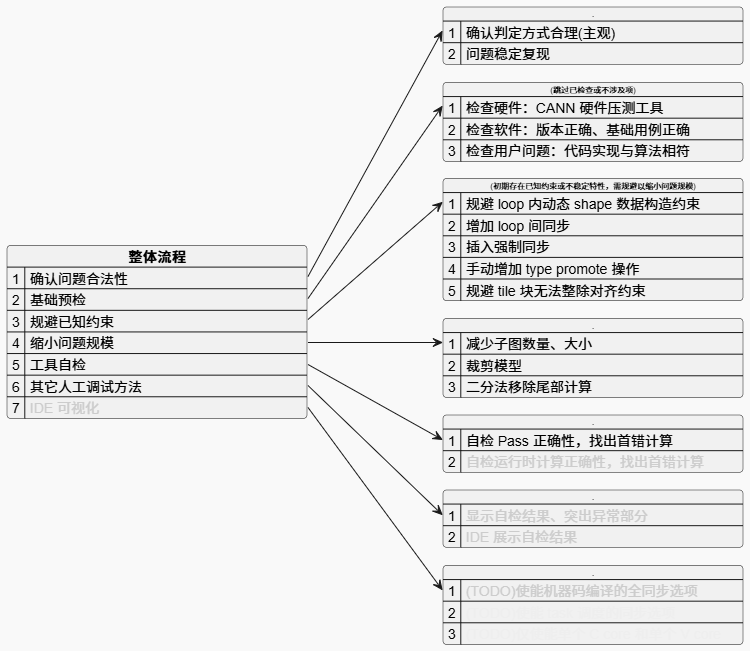

# 精度调试流程

## 简介

当PyPTO算子执行后无功能告警或报错，但输出数据不符合预期时，可基于以下方法进行精度问题的定界和定位。精度问题主要来源于两个方面：

-   功能错误：硬件静默故障、软件静默功能问题、公式实现错误引起的明显数据错误或误差。
-   计算误差：数据类型、算法（切分、累积、公式近似）差异等引起的明显数据误差。

## 整体流程

## 确认问题合法性

1.  确认问题判定方式是否合理（经验判断与实验证明）。
    1.  误差阈值是否使用合理，例如：
        -   存在bfloat16等低精度数据类型的算子使用了float32的误差阈值。
        -   计算路径较深的算子使用了小算子的误差阈值。

    2.  对于不合理部分根据经验进行修正，若问题消失则完成精度调试。

2.  确认问题可稳定复现。
    1.  重复执行多轮输出数据一致且为异常值。
    2.  更换其它环境多轮输出仍旧一致且为异常值。
    3.  若无法稳定复现则明确为功能问题，建议中止精度调试。

## 基础预检

基础预检为指导性说明，指出常见但易被忽视的高概率出错问题。如果用户或调试人员确认相应检查项无误，可以跳过这些步骤。

1.  借助asys工具检查硬件问题。参考xx
    1.  使用硬件自检工具排除硬件安装问题。
    2.  使用硬件压测工具排除硬件故障。

2.  检查软件问题。
    1.  基于安装指导确认软件版本正确。
    2.  执行项目中example用例，确认结果正确。

3.  检查用户侧是否引入问题。
    1.  多方评审算子代码，确认：
        -   计算过程与算法原型一致。
        -   数据类型、计算类型与竞品实现一致（若无竞品实现，需由提供算子实现方案的设计人员完成类型确认）。

    2.  若无法确认，则分析后续发现的问题点时，需额外分析是否为用户侧引入。

## 规避已知问题

精度调试前，应确保已规避当前软件存在的已知问题，详细请参见[已知问题](已知问题.md)。

## 缩小问题规模

缩小问题规模通常是一个可选步骤，旨在简化问题，提高复现和定位的效率。

-   缩小问题规模后需能复现同样问题，然后继续进行后续的工具自检或人工调试
-   对于缩小后出现新问题的情况，建议尝试其它缩小方法以复现原始问题，不建议将新问题纳入关键定位流程。

然而，在某些情况下，缩小问题规模是必选步骤，例如对于较大的模型：

-   主机内存不足导致自检工具无法执行。
-   文件存储空间过小导致自检工具无法保存中间计算数据。
-   其它分析流程或工具的耗时超过主观容忍范围，甚至无法执行等阻塞式情况。

通常通过以下方法缩小问题规模：

-   减少子图数量和大小。例如减少loop的次数或减少cube/vector Tiling块的个数（即增大Tile Shape的大小）。
-   裁剪模型。例如调小模型的Shape规格，如batch\_size、seq\_len等。
-   采用二分法移除尾部计算。
    1.  按模型计算的顺序，采用二分法移除靠近尾部的计算，并将断开的输出加入算子的输出列表。
    2.  执行算子并观察、分析新的输出列表
        -   如果数据正常（无 inf/nan、无主观认为随机的值、或与参考基准数据误差较小）则返回上步继续二分操作。
        -   如果数据存在异常，则将代码恢复到本次移除前的状态，作为最新的候选问题场景。
        -   如果裁剪后的模型规模已经很小，可以停止二分操作并选择最新的候选问题场景进行后续的定位。

## 工具自检

详细用法请参考[精度调试工具](精度调试工具.md)。

## 人工调试：前端及pass部分

如果用户已构建基准算子的实现，并且能够获取基准实现的中间数据，则可以采用近似二分法的形式，单点或多点保存PyPTO中间数据，然后与基准对应的中间数据进行对比分析，以找到首个异常的计算。

1.  使能 Pass Verify 特性，pass 过滤器中仅指定第一个有效 pass 的名称
2.  在 PyPTO 算子代码中找到一个或多个中间 tensor，对相应 tensor 增加 pass\_verify\_save\(\)/pass\_verify\_print\(\) 调测算子
3.  运行算子得到相应 tensor 的模拟计算结果（数据文件或终端打印）
4.  将计算结果逐一与基准实现中对应的中间数据结果对比，找出结果中首个误差明显的 tensor
5.  从误差明显的 tensor 做前序遍历，逐段二分找到拓扑序单个路径上最靠前的异常 tensor 对应的计算节点
6.  对该计算节点所涉及的组件，逐一由**开发（支撑人员）进行辅助分析**：
    1.  用户计算基准中相应问题节点及前序代码的正确性
    2.  PyPTO 算子代码中相应问题节点及前序代码的正确性
    3.  tensor graph、中间 pass 生成的 graph 内问题节点及前序节点的正确性
        -   由于图处理复杂导致无法找到中间 pass 生成的 graph 内问题节点时，需跳过对该节点的分析

7.  数据分析：
    -   与基准中间数据对比，找出误差显著的值及相应索引，确认其维度是否与数据 shape 存在显著相关性
        -   对于相关性较强的维度，进行代码检视确认相应代码处理上是否正确。

            例如某 tensor shape 为 \(16,16\)，数据分析发现最后连续16个数异常，则可排查代码是否在尾轴处理上纯在问题

8.  进一步地，可继续基于二分法的策略增加打印、直到找到某单个路径上拓扑序最靠前的首错数据

