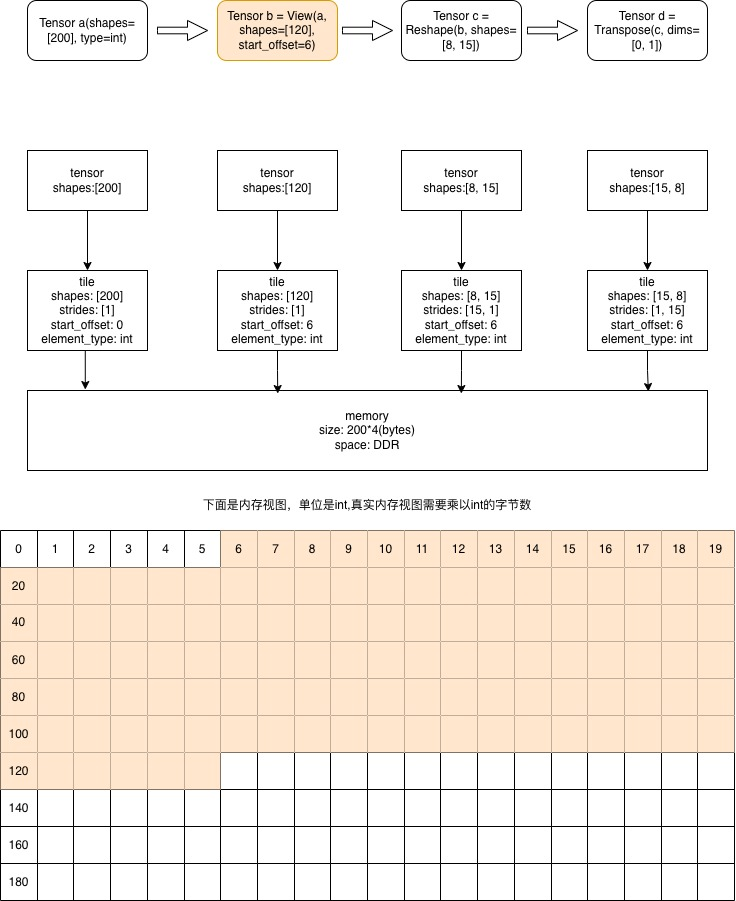

# 4. Type & Shape System

The PTO-IR type and shape system provides a **rigorous, static, and dynamic framework** for reasoning about tensors, tiles, memory layouts, shapes, scalars, buffers, address spaces, and pipeline/register-level objects.

It is a **unified type system** shared by *all dialects*.

This section defines:

1. Type categories
2. Shape system (static, dynamic, symbolic)
3. Layouts and memory spaces
4. Tile and micro-tile formats
5. Derived types
6. Casting, type conversion, and verification rules
7. Shape inference
8. Lifetime & aliasing rules

---

## 4.1 Type Categories

PTO-IR defines the following high-level type categories:

| Category                      | Examples                                    | Used in Dialects   |
| ----------------------------- | ------------------------------------------- | ------------------ |
| **Scalar types**              | `i32`, `f32`, `bool`, `index`               | All                |
| **Tensor types**              | `tensor<[?, %B, 1024], f16>`            | tensor, dist, tile |
| **Tile types**                | `tile<[16, 16], f16, NZ>`                 | tile, statement, blockgraph, pipe  |
| **Memory types**           | `memory<1024, L1>` | statement, mem, pipe   |
| **Shape types**               | `shape<[?, 128]>`                           | tensor, func       |
| **Function types**            | `(T1,T2)->(R)`                              | func               |
| **Distributed types**         | `dist.tensor<replicated>`, `dist.group<16>` | dist               |
| **Pipeline/Register types**   | `pipe.exec.local<T>`                        | pipe, inst    |
| **Instruction operand types** | `reg.f16`, `mma.tile`, `barrier_token`      | inst               |
| **Opaque/custom types**       | `pto.custom<...>`                           | extensibility      |

---

## 4.2 Scalar Types

Scalar types represent indivisible numeric or boolean values:

| Type                        | Description                                                      |
| --------------------------- | ---------------------------------------------------------------- |
| `i1`                        | boolean                                                          |
| `i8`, `i16`, `i32`, `i64`   | integers                                                         |
| `f16`, `bf16`, `f32`, `f64` | floating-point                                                   |
| `index`                     | implementation-defined integer type for loop bounds and indexing |

### Rules

* Scalars are *pure values* (no aliasing).
* `index` is guaranteed to be large enough for device memory addressing.
* No implicit casting; explicit ops are required.

---

## 4.3 Tensor Types

The central type in PTO-IR:

```
tensor<shape, element_type, layout?>
```

Example:

```
tensor<[1, 512, 1024], f16, layout=NHWC>
tensor<[?, ?, 128], f32>
tensor<*, f16> // rank-dynamic
```

### 4.3.1 Shapes

Shapes consist of:

* **Static dimensions** — integers (e.g., `128`)
* **Dynamic dimensions** — represented by `?`
* **Symbolic dimensions** — `%sym0`, `%B`, `%seq_len`

Example:

```
tensor<[%B, ?, 768], f16>
```

### 4.3.2 Rank

Rank is fixed at type creation (unless rank-dynamic `*` is used).

### 4.3.3 Layout

Layouts describe memory layout:

* Default: `ND` (row-major)
* Common alternative layouts:

  * `NHWC`, `NCHW`, `NCDHW`
  * `NDHWC`
  * `NZ` (blocked 16x16 NZ-format)
  * MatMul: `FRACTAL_NZ`、`FRACTAL_ZZ`、`FRACTAL_ZN`
  * MatMul Highly API: `BSH`、`SBH`、`BMNK`、`BSNGD`、`SBNGD`、`BNGS1S2`、`ND_ALIGN`、`VECTOR`
  * Conv: `FRACTAL_Z`、`NC1HWC0`、`NDC1HWC0`、`FRACTAL_Z_3D`
  * `CUSTOM{attrs}`
* Keep stride, shape, and layout metadata synchronized when performing operations such as transpose or reshape.
* The size of the layout must match the size of the shape.
* Layout data resides on the `Tile` and is only provided when the tensor is defined.
* A `Tensor` abstracts a `Tile`, expressing the original logical shape.

### 4.3.4 Element types

Must be scalar types.

### 4.3.5 Verification

* All symbolic dims must be bound by a function argument or shape op.
* Dynamic dims must be resolved before lowering to `pto.statement`.

---

## 4.4 Shape Types

A shape type expresses a runtime-known shape:

```
shape<[d0, d1, ...]>
```

Example:

```
shape<[?, 128]>
shape<[%B, ?]>
shape<*>
```

Shapes are often used in:

* Dynamic reshape
* Transpose
* View
* Runtime kernel dispatch
* Distributed sharding decisions

---

## 4.5 Tile Types

A tile is a *fixed-size block* of a tensor:

```
tile<tile_shapes, strides, start_offset, elem_type, layout?>
```

Examples:

```
tile<[16, 16], [16, 1], 0, f16, ND>
tile<[32, 8, 16], [128, 1, 8], 3, f16, NZ>
tile<[64, 64], [64, 1], 65536, f32, FRACTAL_Z>
```

### 4.5.1 Tile shapes

* Must be fully static.（目前存在纯动态shape场景，如何保证，通过-1表示纯动态么）
* Supported tile sizes depend on hardware (must pass verification).

### 4.5.2 Tile strides

* Dimensions mirror the shapes and represent the stride when advancing by one in each dimension within the memory block.
* `reshape` only updates the shapes without touching the strides, while `transpose` swaps the specified axes in both shapes and strides (allowing the logical axis permutation without rewriting the underlying memory layout).

### 4.5.3 Tile start offset

* The starting location within the memory block, computed by multiplying the offset by the element type size; for example, `tile<[32, 8, 16], [128, 1, 8], 3, f16, NZ>` has a block offset of `3*sizeof(f16)=12`.

### 4.5.4 Tile layout

Tile layout define how tensor data is packed/stored within a tile:

* Same as Tensor Layout
* 在已有strides的表达时，layout是否是必须的，以及layout和strides之间如何相互作用？

### 4.5.5 Tile type invariants

* Used as operands/results of `pto.tile` ops.
* Must map cleanly to tensor slices of the parent tensor.
* Must fit in the target memory space/buffer size.

Below is an example of Tensor-Tile-Memory relationship:



### 4.5.6 Pad shape

- 如果shape pad方案是往尾轴各行都pad一点数据，那么很容易影响到所有tile共用的memory数据。例如视图[8, 1]需要pad到[8, 8]，那么底层数据需要从size 8扩展到size 64，这会导致另一个表示[1, 8]的视图因此变成不连续数据。
- 如果采用另一种方案，即不对尾轴进行pad，那么数据本身在任何视图下都不会需要pad。这需要在cce中使用set_vector_mask等掩码方案，使得通过offset越界将非对齐转为对齐进行处理，然后mask掉越界的部分数据操作，即可完成任意offset、任意strides下的vector操作（cube未穿刺过）。
- 我们需要考虑到需要pad的场景占总比例的大小，可以考虑牺牲一点pad场景的性能，换来更好的框架表达。

---

## 4.6 Memory Types

Memory types represent memory regions with explicit address spaces:

```
memory<byte_size, space>
```

Examples:

```
memory<4096, L1>
memory<?, DDR>
memory<256, UB>
memory<1024, L0A>
```

### 4.6.1 Byte size

* Represents the total number of bytes allocated for the memory.
* 如果是动态shape场景，如何表达内存大小，预分配内存时如何预估所使用的内存大小。
* 是否有必要精确到bit级

### 4.6.2 Address spaces

Supported memory spaces:

| Space       | Meaning                          |
| ----------- | -------------------------------- |
| **DDR**     | Off-chip DRAM                    |
| **L2**      | Large on-chip SRAM               |
| **L1**      | Per-core cache/SRAM              |
| **UB**      | Unified Buffer                   |
| **L0A/B/C** | Matrix unit input/output buffers |
| **REG**     | Registers                        |
| **SHMEM**   | Shared memory (for dist dialect) |

### 4.6.2 Verification

* Access ops (`load`, `store`) must index within bounds.
* memory space must be supported by hardware backend.

---

## 4.7 Function Types

```
(T1, T2, ...) -> (R1, R2, ...)
```

* No closures or captures.
* Functions cannot implicitly capture dynamic shapes; they must be explicit arguments.
* Variadic functions allowed only via explicit `varargs` flag.

---

## 4.8 Distributed Types

```
dist.tensor<layout>
dist.group<n>
dist.token
```

### 4.8.1 Sharding layouts

Examples:

* `shard(axis=0, parts=world_size)`
* `replicate`
* `partial`

Used for:

* Tensor parallelism
* Pipeline parallelism
* Data parallel replica groups

### 4.8.2 Communication token

`dist.token` is used for completion semantics of remote ops.

---

## 4.9 Pipe-Execution & Register Types

### 4.9.1 Pipe-exec local value

```
pipe.exec.local<T>
```

A pipe-local intermediate value that cannot escape a `pipe.exec.pipe`.

### 4.9.2 Register types

```
reg.f16
reg.vec<f16, 8>
reg.pred
```

Backend-specific.

---

## 4.10 Instruction Operand Types

Instruction types used only by `pto.inst`:

* `inst.addr` — a resolved address or pointer
* `inst.immediate` — immediate integer
* `mma.tile` — micro-tile register holding matrix fragments
* `barrier.token` — synchronization primitive

These types *only appear after lowering to the instruction level*.

---

## 4.11 Opaque / Custom Types

Extensions may define:

```
pto.custom<id, params...>
```

* Must declare verification rules.
* Lowering rules optional (may remain opaque until external codegen).

---

## 4.12 Casting and Type Conversion

PTO-IR prohibits implicit casts.

Allowed casts (must use explicit ops):

* `pto.scalar` casts: `cast_i32_to_f32`, `truncate`, `extend`
* `tensor.cast`: layout or dtype change; may not change shape
* `tensor.reshape`: shape change, no data movement
* `tensor.layout_transform`: may change layout & memory arrangement
* `mem.cast`: memref reinterpret cast

Disallowed:

* Implicit dtype changes
* Casting tile types to tensor types without proper conversion
* Layout changes without an explicit transform op

---

## 4.13 Shape Inference System

Shape inference is a core component of PTO-IR.

### 4.13.1 Categories of shapes

1. **Static shape**: All dims known
2. **Partially dynamic shape**: Some dims unknown
3. **Fully dynamic shape**: All dims unknown
4. **Symbolic shape**: Dims expressed using symbols

### 4.13.2 Shape relations

Shape relations encode constraints:

* Equality: `d0 == d1`
* Product constraints: `d0 * d1 == d2`
* Divisibility: `d0 % tile_size == 0` (or tail-handling path)

### 4.13.3 Producers of shape info

* Function arguments
* Ops like `tensor.shape_of`, `tensor.dim`
* Distributed layout descriptors
* Tile configs (tile size constraints)

### 4.13.4 Shape inference rules (examples)

* **Matmul**:

  ```
  A: [M x K]
  B: [K x N]
  → C: [M x N]
  ```
* **Broadcast**:
  Follow NumPy broadcasting rules
* **Concat**:
  Concatenate along one dimension

### 4.13.5 Failure cases

* Conflicting symbolic dims
* Incompatible sharding
* Unsupported partial dynamic → tile transformation

---

## 4.14 Memory Layout System

Layouts define linearization of indices:

### Supported forms:

1. **Row-major (ND)**
2. **Column-major (CN)**
3. **Channel-major / GPU-friendly**

   * `NHWC`, `NCHW` etc.
4. **Blocked layouts**

   * `NZ` → blocks of 16x16
   * `FRAC_Z` → fractal "Z" tiling
5. **Custom layouts**

### Layout attributes

Layouts are represented as:

```
layout = ND
layout = NZ{block=16}
layout = CUSTOM{name="xform", params={...}}
```

### Verification

* Layout must be valid for element type and shape.
* Tile-level lowering must align with layout (e.g., NZ requires dims divisible by block size or handle tails).

---

## 4.15 Lifetime & Aliasing Rules

### 4.15.1 Tensors

* Pure value semantics
* No aliasing
* No in-place mutation unless using explicit `tensor.inplace_*` ops

### 4.15.2 Memory

* Explicitly allocated and deallocated
* May alias if:

  * Allowed via `mem.alias_group` attribute
  * Otherwise aliasing is illegal

### 4.15.3 Tiles

* Non-aliasing unless explicitly loaded from overlapping memory regions
* Compiler must ensure correct sequencing of loads, stores, and overwrites

### 4.15.4 Pipeline local values

* Scope = one stage
* Cannot escape or be captured by higher dialects

---

## 4.16 Type Verification Summary

A valid PTO-IR program must satisfy:

* No implicit casts
* All tensor layout and shape constraints verified
* Tile size fits hardware & memory space
* MemRef bounds consistent
* No unbound symbolic dims
* Distributed types match worker counts
* No cross-stage illegal dataflow in pipelines
* Instruction types fully resolved in `pto.inst`

---

